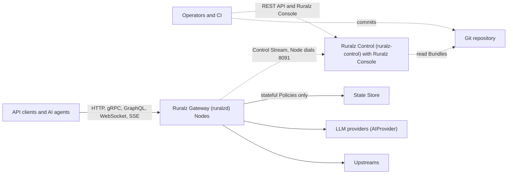

# Ruralz

Ruralz is an open-source API gateway written in Go where every feature, including the control plane and console, is free (Apache-2.0, no feature gating). Nothing is implemented yet; this repository holds the design documentation.

## What is Ruralz

Ruralz has two runtime components and one CLI:

| Component | Binary | Role |
|---|---|---|
| **Ruralz Gateway** | `ruralzd` | The stateless data plane. Each running process is a Node that terminates client protocols, matches requests to Routes, runs an ordered Filter Chain of built-in Filters and sandboxed WASM Plugins, and forwards to Upstreams, including LLM providers, with load balancing, retries and circuit breaking. |
| **Ruralz Control** | `ruralz-control` | The optional control plane. It builds Revisions from Git, delivers Rollouts to Clusters over the mTLS Control Stream that each Node dials, and hosts the **Ruralz Console** with RBAC, audit log and Drift detection. |
| `ruralz` CLI | `ruralz` | Validates, renders, diffs and builds Bundles, drives Rollouts, and builds, tests and publishes Plugins. |

Shared runtime state (Rate Limits, Quotas, Token Budgets, caches) lives in an external State Store: `redis` for Redis, Valkey or Dragonfly, or `memory` for a single Node. Nodes keep serving their active Revision while Ruralz Control is unavailable, and file mode runs them without Ruralz Control at all. Configuration is YAML (JSON accepted) in a Kubernetes-style resource model validated by a published JSON Schema ([ADR-0003](docs/adr/0003-configuration-format.md)).

*Figure 1: system context; solid arrows are on the request path, dashed arrows carry configuration.*

The [System overview](docs/architecture/01-system-overview.md) owns the full component map, request lifecycle and trust boundaries.

## Why Ruralz

Ruralz is built on four commitments:

- **Every feature is free.** Every feature, including Ruralz Control and Ruralz Console, is Apache-2.0. Authentication, stateful Rate Limits, the AI/LLM gateway, every protocol, the control plane, RBAC, audit log and Ruralz Console SSO are all planned for the same public build.
- **There is no feature gating.** No license keys, no license files, no entitlement checks and no "enterprise" build. The FIPS build has the same features and license as the default build, and nothing is limited by Node count.
- **Revenue never buys features.** Revington earns revenue only from Ruralz Cloud (a managed control plane, not yet launched) and commercial support; neither delivers a private feature, and support work lands upstream under Apache-2.0.
- **Every capability is tracked.** The [Feature Catalog](docs/features/01-feature-catalog.md) lists every Ruralz capability with its milestone, or `Not planned` with a reason.

## Four differentiators

The four differentiators are (1) **WASM plugin system**, (2) **AI/LLM gateway**, (3) **built-in control plane + GitOps**, (4) **multi-protocol native**.

| # | Differentiator | What Ruralz plans | Milestone | Design |
|---|---|---|---|---|
| 1 | WASM plugin system | Sandboxed Plugins on Plugin ABI v1 with deny-by-default Capabilities, pulled from OCI by digest and signed, in any Phase including `onChunk` | Planned (M2); proxy-wasm adapter Planned (M4) | [WASM plugin system](docs/architecture/05-wasm-plugin-system.md) |
| 2 | AI/LLM gateway | `AIProvider` and `AIModel`, an OpenAI-compatible facade plus native passthrough, Token Budgets and Semantic Cache | Planned (M3) | [AI/LLM gateway](docs/architecture/06-ai-llm-gateway.md) |
| 3 | built-in control plane + GitOps | Ruralz Control builds and signs Revisions from Git and runs canary Rollouts with automatic rollback; Ruralz Console, RBAC, audit log, Drift detection | Planned (M2); Ruralz Console SSO and SAML Planned (M5) | [Control plane and GitOps](docs/architecture/04-control-plane-and-gitops.md) |
| 4 | multi-protocol native | HTTP/1.1 to HTTP/3, gRPC, GraphQL federation, WebSocket, SSE, Kafka, NATS and MQTT | gRPC, GraphQL, WebSocket, SSE and HTTP/3 Planned (M3); Kafka, NATS, MQTT Planned (M4) | [Multi-protocol](docs/architecture/07-multi-protocol.md) |

[Vision and positioning](docs/vision/01-vision-and-positioning.md) defines the differentiators and the principles `P1` to `P10`.

## Status

Ruralz is in the design phase: nothing is implemented yet, and there is no release, binary or image to install. Every capability in these documents is tagged `Planned (Mx)`, where `Mx` is a milestone from M0 to M5, even when its design is complete. Milestones have an order but no dates.

| Milestone | Scope |
|---|---|
| M0 Foundations | Repository, CI gates, license and governance, configuration contracts |
| M1 Core gateway | File-mode Ruralz Gateway with core Policies, Hot Reload and release `0.1.0` |
| M2 WASM + Control/GitOps | Differentiators (1) and (3), Kubernetes packaging, Bundle tooling commands |
| M3 AI gateway + gRPC/GraphQL/WS/SSE + HTTP/3 | Differentiator (2) and most of (4) |
| M4 Event protocols + multi-region + bench suite | Kafka, NATS and MQTT, Cells across Regions, a bench suite measured against the Performance Budgets and previous releases |
| M5 Enterprise hardening | SSO/SAML for Ruralz Console, FIPS build, monetization hooks |

The [Roadmap and milestones](docs/roadmap/01-roadmap-and-milestones.md) holds each milestone's scope and exit criteria; the [Feature Catalog](docs/features/01-feature-catalog.md) maps every capability to its milestone.

## Documentation map

Start at the [documentation index](docs/README.md), which gives reading paths for evaluators, contributors, operators, Plugin authors and AI platform engineers, plus the review status of every document.

| If you want to | Read |
|---|---|
| Judge fit and positioning | [Vision and positioning](docs/vision/01-vision-and-positioning.md), [Feature Catalog](docs/features/01-feature-catalog.md) |
| Understand the architecture | [System overview](docs/architecture/01-system-overview.md), [Configuration model](docs/architecture/02-configuration-model.md), [Data plane](docs/architecture/03-data-plane.md) |
| Plan a deployment | [Deployment topologies](docs/operations/01-deployment-topologies.md), [Scalability and distributed state](docs/architecture/11-scalability-and-distributed-state.md) |
| Contribute | [Repository layout and conventions](docs/engineering/02-repository-layout-and-conventions.md), [Tech stack and libraries](docs/engineering/01-tech-stack-and-libraries.md), [Testing and quality strategy](docs/engineering/03-testing-and-quality-strategy.md) |
| Look up commands, APIs and terms | [CLI and API surface](docs/reference/01-cli-and-api-surface.md), [Glossary](docs/glossary.md) |
| See what ships when | [Roadmap and milestones](docs/roadmap/01-roadmap-and-milestones.md) |
| Review decisions | [Architecture Decision Records](docs/adr/README.md) |

## License and governance

- **License.** Every component is Apache-2.0: `ruralzd`, `ruralz-control`, Ruralz Console, the `ruralz` CLI, SDKs, the Helm chart and the documentation. See [LICENSE](LICENSE) and [NOTICE](NOTICE). There is no feature gating and no separate "enterprise" build ([ADR-0002](docs/adr/0002-apache-2-license-no-feature-gating.md)).
- **Copyright.** Copyright 2026 Revington ([revington.co](https://revington.co)).
- **Trademark policy.** "Ruralz" is a trademark of Revington (revington.co), and Apache-2.0 grants no trademark rights. The Revington trademark policy, modeled on ASF nominative use, is Planned (M0); its strictness is OQ-vision-and-positioning-2.
- **Repository.** The monorepo [github.com/ravindu-rev/ruralz](https://github.com/ravindu-rev/ruralz) is owned by the GitHub account `ravindu-rev`.
- **Contributions.** Every commit carries a DCO 1.1 `Signed-off-by:` line matching its author; there is no CLA. A CI check enforcing it is Planned (M0); see [DCO sign-off](docs/engineering/02-repository-layout-and-conventions.md#dco-sign-off).
- **Stewardship.** Future releases stay Apache-2.0 because of principle P1 and ADR-0002; a structural safeguard such as a pledge or foundation stewardship is OQ-vision-and-positioning-9.
