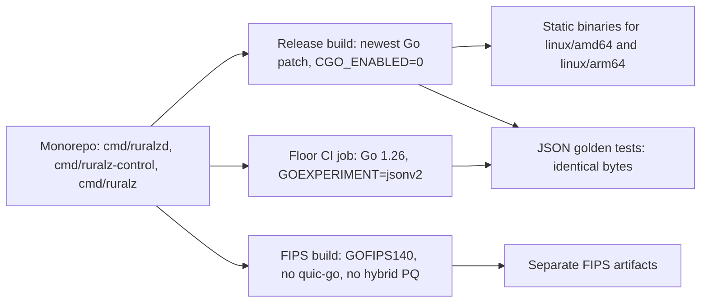

# ADR-0001: Implementation language: Go with CGO_ENABLED=0 static binaries

## Context and problem statement

Ruralz ships three binaries from one monorepo (`github.com/ravindu-rev/ruralz`): `ruralzd` (Ruralz Gateway), `ruralz-control` (Ruralz Control) and the `ruralz` CLI. They share one validation library, so `ruralz bundle validate` and Ruralz Control reject compile errors before a Revision exists, and each Node applies the same checks before any swap. Nodes are disposable (P4); a FIPS build keeps the default build's license (P1) and its features except HTTP/3 (foundation pack section 8.4; OQ-tech-stack-and-libraries-9) and hybrid post-quantum key exchange ([FIPS build](../engineering/01-tech-stack-and-libraries.md#fips-build)); Plugins run in a sandbox inside the Node (P6) ([Vision](../vision/01-vision-and-positioning.md#principles)).

Which language and build mode yield three simple artifacts that operators can copy, upgrade and verify, while every library the [foundation pack](../_meta/foundation-pack.md) section 7 fixes stays usable? Ruralz Console (TypeScript) is out of scope. Code starts in Planned (M0).

## Decision drivers

- **One language for data plane, control plane and CLI**, so validation code is shared rather than ported.
- **Static artifacts** that allow images without a libc, cross-builds for linux/amd64 and linux/arm64, and no shared-library dependency, so a Zero-Downtime Upgrade needs only the new file.
- **Library coverage** for the fixed stack: an in-process WASM runtime, HTTP/1.1 to HTTP/3, gRPC, GraphQL federation, Kafka, NATS, MQTT, Raft and policy engines.
- **A FIPS path** that needs no second cryptographic stack.
- **Tail latency** that the benchmark suite can measure and publish (P10).

## Considered options

1. Go 1.26 or newer with `CGO_ENABLED=0` static binaries ([source](https://go.dev/doc/security/fips140)).
2. Go with CGO enabled, to link C or Rust libraries such as wasmtime ([source](https://github.com/bytecodealliance/wasmtime-go/blob/main/README.md)).
3. Rust, as in the AISIX and Helicone AI gateways ([source](https://github.com/api7/aisix)) ([source](https://github.com/Helicone/ai-gateway)).
4. C++ Envoy as the data plane with a Go control plane, the Envoy Gateway pattern ([source](https://gateway.envoyproxy.io/docs/api/extension_types/)) ([source](https://github.com/envoyproxy/gateway/releases/tag/v1.9.0)).
5. Lua on OpenResty, the Kong and APISIX model ([source](https://developer.konghq.com/custom-plugins/)) ([source](https://github.com/apache/apisix)).

## Decision outcome

Chosen option: "Go 1.26 or newer with `CGO_ENABLED=0` static binaries", plus a `GOFIPS140` variant, because every foundation pack section 7 library is Go and expected to pass the G1 `CGO_ENABLED=0` cross-build (research-verified for five, the rest Pending CI), the three binaries share one validation library ([Dependency graph](../engineering/01-tech-stack-and-libraries.md#dependency-graph)), and the standard library supplies HTTP/2, TLS and the FIPS module. Rules, per [Version floor](../engineering/01-tech-stack-and-libraries.md#version-floor) and [FIPS build](../engineering/01-tech-stack-and-libraries.md#fips-build):

| Rule | Value | Planned |
|---|---|---|
| Floor | Root `go.mod` declares `go 1.26.0`; quic-go, nats.go, OPA, `raft-boltdb/v2` and `otelslog` force it | Planned (M0) |
| Release toolchain | Latest patch of the newest Go release, pinned by the `toolchain` directive (`go1.27.1` at the snapshot ([source](https://go.dev/doc/devel/release))); release and FIPS builds set no `GOEXPERIMENT` | Planned (M0) |
| Floor CI job | Latest 1.26 patch with `GOTOOLCHAIN=local` and `GOEXPERIMENT=jsonv2`, which jwx v4 needs on 1.26 ([source](https://github.com/lestrrat-go/jwx/blob/develop/v4/README.md)) | Planned (M0) |
| Build flags | `CGO_ENABLED=0`, `-trimpath`, `-ldflags -X` version metadata | Planned (M0) |
| Production platforms | linux/amd64 and linux/arm64 for all three binaries; the CLI also targets darwin and windows/amd64 | Planned (M0) |
| FIPS variant | Same source; HTTP/3 off (OQ-tech-stack-and-libraries-9) and hybrid post-quantum key exchange off ([FIPS build](../engineering/01-tech-stack-and-libraries.md#fips-build)); `GOFIPS140=v1.0.0` (CMVP #5247) until v1.26.0 leaves "Pending Review", `GODEBUG=fips140=on`, separate artifacts ([source](https://go.dev/doc/security/fips140)) | Planned (M5) |

A FIPS build constraint keeps the quic-go listener package out of the FIPS `ruralzd`, which the quic-go G3 exception does not cover ([source](https://github.com/quic-go/quic-go/blob/master/FIPS140.md)). How a FIPS Node treats a Revision with `http3: true` is open: ignoring the field would break equal behavior for equal digests (foundation pack section 8.1), a render-time error would need a field that marks FIPS targets, which the Configuration model lacks, and a deterministic NACK rolls back or pauses the Rollout in a Cluster that mixes FIPS and default Nodes (section 8.3). The owning document MUST add this case to OQ-tech-stack-and-libraries-9.

*Figure 1: one source tree feeds the release build, the FIPS build and the CI-only floor job.*

### Consequences

- Good, because each `ghcr.io/ravindu-rev/ruralzd` image can carry one static binary and no libc, which simplifies image handling for disposable Nodes (P4) and frees the Zero-Downtime Upgrade ([ADR-0015](0015-zero-downtime-upgrades-so-reuseport.md)) from library compatibility checks.
- Good, because research confirms pure Go for wazero, quic-go, franz-go, connect-go and grpc-go ([source](https://github.com/wazero/wazero/blob/main/README.md)) ([source](https://github.com/quic-go/quic-go)) ([source](https://github.com/twmb/franz-go)) ([source](https://github.com/connectrpc/connect-go)) ([source](https://github.com/grpc/grpc-go)), so the Plugin sandbox runs in-process without CGO ([ADR-0004](0004-wasm-runtime-wazero.md)).
- Good, because `net/http` serves HTTP/1.1, HTTP/2 and h2c ([ADR-0009](0009-http-stack-net-http-quic-go.md)), and the Go Cryptographic Module gives the FIPS build without a second TLS stack.
- Bad, because GC pauses may hurt tail latency more than in C++ Envoy (hypothesis); `GOMEMLIMIT` and `GOGC` are the levers, and P10 requires published Planned (M4) benchmarks.
- Bad, because wazero lacks fuel metering and wasmtime-go needs CGO: deadlines interrupt guest code only through `WithCloseOnContextDone`, reported 10 to 20x slower on loop-heavy guests ([source](https://github.com/wazero/wazero/issues/2466)), so the P6 `timeout` costs runtime or needs host-side budgets (OQ-tech-stack-and-libraries-8).
- Bad, because a `CGO_ENABLED=0` binary in an image without a libc base still needs CA roots, and an archive install reads the host CA store; whether the image ships them or the binary embeds them (which needs a research-backed catalog row and a G3 decision) is an Open question that the owning document MUST add.
- Bad, because always-linked libraries grow `ruralzd` toward a 160 MiB stripped binary budget (target).

### Confirmation

- **CI cross-build gate (G1)**, Planned (M0): `pr-fast` builds all three binaries with `CGO_ENABLED=0` for every production platform; a library that fails loses its catalog row.
- **Floor job and guard file**, Planned (M0): a guard file constrained to `go1.26 && !go1.27 && !goexperiment.jsonv2` fails compilation, and JSON golden tests MUST produce identical bytes in both jobs.
- **Crypto denylist (G3)**, Planned (M0): `go list -deps` fails on non-allowlisted crypto packages; the FIPS CI job, Planned (M5), builds with `GOFIPS140` and fails if quic-go appears in the FIPS `ruralzd` dependencies.
- **Binary size check**, Planned (M1), reports `ruralzd` against its budget.
- **Review checklist item**: a pull request that changes the `go` directive MUST amend this ADR; `toolchain` bumps follow the [Update policy](../engineering/01-tech-stack-and-libraries.md#update-policy).

## Pros and cons of the options

### Go 1.26 or newer with CGO_ENABLED=0 static binaries

- Good, because the whole section 7 stack is Go.
- Good, because the FIPS module is part of the toolchain ([source](https://go.dev/doc/security/fips140)).
- Bad, because GC tail latency is unmeasured (hypothesis) and wazero deadlines cost up to 20x on loop-heavy guests.

### Go with CGO enabled

- Good, because wasmtime offers fuel metering and epoch interruption, which wazero lacks, likely at lower cost than `WithCloseOnContextDone` (hypothesis) ([source](https://github.com/bytecodealliance/wasmtime-go/blob/main/config.go)).
- Bad, because linking the prebuilt Rust `libwasmtime` breaks static cross-builds and adds a second toolchain.
- Bad, because any C cryptography linked through CGO sits outside the Go FIPS boundary.

### Rust

- Good, because it has no garbage collector and strong memory safety.
- Bad, because raft, graphql-go-tools, cel-go and OPA would need Rust replacements that no research file evaluates.
- Bad, because Ruralz Control and the CLI would be rewritten or stay in Go, adding a second toolchain and losing the shared validation library.

### C++ Envoy with a Go control plane

- Good, because Envoy offers Wasm, Lua, ExtProc and Dynamic Modules ([source](https://gateway.envoyproxy.io/docs/api/extension_types/)).
- Bad, because it splits the product across two languages, so the CLI cannot share data-plane validation code.
- Bad, because it ties delivery to Envoy's resource model, which [ADR-0007](0007-control-stream-protocol.md) rejects.

### Lua on OpenResty

- Good, because Kong and APISIX prove the model.
- Bad, because WASM support is removed or experimental: Kong removed its beta WASM in 3.11.0.0 ([source](https://developer.konghq.com/gateway/breaking-changes/)) and APISIX notes "only a few APIs are implemented" ([source](https://apisix.apache.org/docs/apisix/wasm/)).
- Bad, because Ruralz Control and the CLI would still need a second language.

## More information

- Owning document: [Tech stack and libraries](../engineering/01-tech-stack-and-libraries.md#selection-criteria), [foundation pack section 7](../_meta/foundation-pack.md#7-technology-decisions-fixed-details-in-docsengineering01-tech-stack-and-librariesmd-and-adrs) and the accepted costs in [System overview](../architecture/01-system-overview.md#design-principles).
- Related decisions: [ADR-0002](0002-apache-2-license-no-feature-gating.md) (license gate G2) and [ADR-0017](0017-artifact-signing.md) (artifact verification).
- Proposed owning-document amendments: extend OQ-tech-stack-and-libraries-9 to FIPS handling of `http3: true`; add an Open question on shipping or embedding CA roots. Proposed amendment to [Release, versioning and compatibility](../engineering/04-release-versioning-and-compatibility.md#release-artifacts): once that question is resolved, state CA roots for container images and binary archives.
