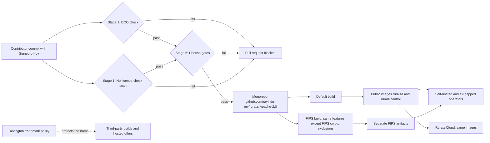

# ADR-0002: License: Apache-2.0 for all components, no feature gating, DCO and Revington trademark policy

## Context and problem statement

Ruralz is positioned as "KrakenD Enterprise, but better, and fully free" ([Vision and positioning](../vision/01-vision-and-positioning.md#positioning-versus-krakend-ee-and-the-market)). KrakenD EE will not start without a license file ([source](https://www.krakend.io/docs/enterprise/overview/license-file/)), unlicensed Kong Gateway 3.10 behaves as expired ([source](https://github.com/Kong/kong/discussions/14628)), and Tyk keeps a commercial `ee` folder ([source](https://github.com/TykTechnologies/tyk)).

Which license, contribution model and name protection make P1 ("Everything is free") verifiable while Revington funds the project?

## Decision drivers

- **P1, one feature set**: every public build, the FIPS build included apart from FIPS cryptography exclusions, has the same features, and no code path checks a license key or Revington entitlement.
- **Adopter trust**: a patent grant and familiar terms, after recent relicensing events.
- **Low contributor friction** and **name protection** that does not restrict code.
- **Dependency compatibility**: every shipped dependency passes gate G2 ([Tech stack and libraries](../engineering/01-tech-stack-and-libraries.md#selection-criteria)).
- **Funding** that needs no gated feature.

## Considered options

1. Apache-2.0 for every component ([source](https://www.apache.org/licenses/LICENSE-2.0)), no feature gating, DCO sign-off ([source](https://developercertificate.org/)) and a Revington trademark policy.
2. Open core with a license-key-gated enterprise edition, as with KrakenD EE ([source](https://www.krakend.io/features/)), Kong Gateway Enterprise ([source](https://developer.konghq.com/gateway/entities/license/)) and Gravitee APIM ([source](https://documentation.gravitee.io/apim/introduction/enterprise-edition)).
3. AGPLv3, as adopted by Grafana ([source](https://grafana.com/blog/grafana-loki-tempo-relicensing-to-agplv3/)) and Redis 8 ([source](https://redis.io/blog/agplv3/)).
4. Source-available terms that convert later: BSL 1.1 ([source](https://www.hashicorp.com/en/bsl)) or the Functional Source License ([source](https://fsl.software/)).
5. Apache-2.0 with a Contributor License Agreement (CLA), as Tyk AI Studio requires ([source](https://github.com/TykTechnologies/ai-studio)).

## Decision outcome

Chosen option: "Apache-2.0 for every component, no feature gating, DCO sign-off and a Revington trademark policy", because only it combines one ungated feature set (P1), no source-disclosure duty on embedders or hosts, the Apache-2.0 Section 3 patent grant ([source](https://www.apache.org/licenses/LICENSE-2.0)) and a contributor model that gives Revington no rights beyond Apache-2.0. It matches foundation pack section 7, row "License", and [Open source and business model](../vision/01-vision-and-positioning.md#open-source-and-business-model).

| Rule | Value | Planned |
|---|---|---|
| License | Apache-2.0 for `ruralzd`, `ruralz-control`, Ruralz Console, the `ruralz` CLI, SDKs, Helm chart and documentation | Planned (M0) |
| Ownership | "Copyright 2026 Revington" for Revington's work; contributors keep copyright, contributing under Apache-2.0 Section 5; `LICENSE` and `NOTICE` in the repository root and every artifact | Planned (M0) |
| No feature gating | No license keys, license files, entitlement checks, Node-count limits or "enterprise" build; no binary refuses to start, turns read-only or degrades over a license state; every Filter, Host Function and API works self-hosted and air-gapped with no Revington-operated service | Planned (M0) |
| Build flavors | The FIPS build (`GOFIPS140`) has the default build's license and features; only the FIPS cryptography exclusions recorded in [FIPS build](../engineering/01-tech-stack-and-libraries.md#fips-build) differ, today HTTP/3, hybrid post-quantum key exchange and non-approved JWA algorithms (OQ-tech-stack-and-libraries-9) | Planned (M5) |
| Contributions | DCO 1.1 `Signed-off-by:` on every commit, per [DCO sign-off](../engineering/02-repository-layout-and-conventions.md#dco-sign-off); no CLA | Planned (M0) |
| Trademark | "Ruralz" is Revington's trademark under a published policy modeled on ASF nominative use ([source](https://www.apache.org/foundation/marks/)); strictness is OQ-vision-and-positioning-2 | Planned (M0) |
| Dependencies | Linked Go packages, the Ruralz Console production dependency tree and each PDK's shipped dependencies stay on the G2 allowlist or its named per-ecosystem addendum; MPL-2.0 only by named exception ([License rules](../engineering/01-tech-stack-and-libraries.md#license-rules)) | Planned (M0) |
| Revenue | Only Ruralz Cloud ([Managed cloud](../vision/01-vision-and-positioning.md#managed-cloud)) and commercial support; support delivers no private features; Ruralz Cloud offers nothing a self-hosted Ruralz Control lacks and uses no cloud-only hook | Policy Planned (M0); Ruralz Cloud has no milestone (OQ-vision-and-positioning-3) |

Scope: a DCO cannot stop Revington, like any redistributor, from shipping later Derivative Works under other terms; published releases stay Apache-2.0 ([Licensing landscape](../_meta/research/licensing-landscape.md), section 11), and P1 and this ADR keep future releases Apache-2.0; stewardship is OQ-vision-and-positioning-9.

*Figure 1: CI gates and one Apache-2.0 feature set for every operator.*

### Consequences

- Good, because P1 becomes testable: no binary holds license state, so one test suite and support surface cover every build.
- Good, because adopters receive each contributor's patent license, and the DCO keeps friction low ([source](https://helm.sh/blog/helm-dco/)).
- Good, because Plugins, Ruralz Control and Ruralz Console are free in every build flavor, while KrakenD CE 3.0 moves Go plugins to EE ([source](https://www.krakend.io/blog/dropping-plugins-support-on-community/)).
- Bad, because revenue has no enterprise upsell, and anyone may host Ruralz against Ruralz Cloud; Apache-2.0 Section 6 grants no trademark rights, so only the name is protected ([source](https://www.apache.org/licenses/LICENSE-2.0)).
- Bad, because G2 bars GPL, AGPL and source-available code, GPLv2-only code is incompatible outright ([source](https://www.apache.org/licenses/GPL-compatibility.html)), and MPL-2.0 exceptions carry file-level obligations.

### Confirmation

- **License gate (G2)**, Planned (M0): `pr-fast` fails on any linked package, per `go list -deps -test=false`, outside the allowlist or named MPL-2.0 exceptions ([Testing and quality strategy](../engineering/03-testing-and-quality-strategy.md#security-scanning)).
- **Non-Go license gate**, Planned (M2): the Console build and each PDK's CI fail on any dependency shipped in the artifact (not build-only tooling such as proc-macros) whose SPDX expression does not resolve to the G2 allowlist or its named per-ecosystem addendum (for example Unicode-3.0); copyleft and source-available licenses never qualify.
- **No-license-check scan**, Planned (M0): `pr-fast` fails on any denylisted identifier, string or hostname (such as `licenseKey`, `entitlement`, `revington.co`) in `cmd/`, `internal/`, `pkg/`, `sdk/` or `console/` absent from a reviewed allowlist file.
- **Air-gapped start**, Planned (M1): the [Testing and quality strategy](../engineering/03-testing-and-quality-strategy.md#end-to-end-tests) end-to-end suite starts each `ruralzd` and `ruralz-control` release image with egress denied except to in-network fixtures (Upstream, State Store, mock `AIProvider`) and no license file, and asserts that every feature path in that release serves; FIPS images join at Planned (M5), less their recorded exclusions.
- **DCO check**, Planned (M0): CI stage 1 blocks a pull request while any commit lacks a `Signed-off-by:` matching its author, bots included.
- **Release audit**, Planned (M1): per tag, code search confirms SM-1; every archive, image and published PDK package (FIPS artifacts from M5) carries `LICENSE`, `NOTICE` (upstream attributions, the EDL-1.0 election) and a third-party license file generated from that artifact's own dependencies, stating where MPL-2.0 source is available.
- **Review checklist items**: scan allowlist edits need maintainer review; a pull request that changes the terms in `LICENSE`, or adds an edition, a build flavor with any difference beyond a FIPS cryptography exclusion recorded in [FIPS build](../engineering/01-tech-stack-and-libraries.md#fips-build), an entitlement check, a Node-count limit, a Revington-operated service dependency or a cloud-only hook, MUST come with an ADR superseding this one.

## Pros and cons of the options

### Apache-2.0, no feature gating, DCO and trademark policy

- Good, because Apache APISIX ([source](https://apisix.apache.org/)) and Envoy ([source](https://www.cncf.io/projects/envoy/)) use the same license.
- Good, because a trademark policy protects the name without restricting code; Redis requires an agreement for hosted services using its mark ([source](https://redis.io/legal/trademark-policy/)).
- Bad, because it gives no copyleft defense against closed forks.

### Open core with a gated enterprise edition

- Good, because it is proven revenue; KrakenD EE is sold through sales only ([source](https://www.krakend.io/enterprise/)).
- Bad, because it contradicts P1: an expired Kong license makes configuration read-only and DB-less restarts fail ([source](https://developer.konghq.com/gateway/entities/license/)).

### AGPLv3

- Good, because network copyleft makes hosts of modified versions share their source, deterring closed hosted forks.
- Bad, because embedders and hosts would inherit source-disclosure duties.

### Source-available with delayed conversion

- Good, because it blocks competing hosted offers until the change date ([source](https://www.hashicorp.com/en/bsl)).
- Bad, because releases are not open source until they convert, two years later under FSL ([source](https://fsl.software/)); HashiCorp's move produced the OpenTofu fork ([source](https://www.linuxfoundation.org/press/opentofu-announces-general-availability)).

### Apache-2.0 with a CLA

- Good, because a CLA can add an explicit patent grant and relicensing rights ([source](https://helm.sh/blog/helm-dco/)).
- Bad, because a corporate CLA signature can take weeks ([source](https://helm.sh/blog/helm-dco/)).
- Bad, because P1 commits every feature to Apache-2.0, leaving relicensing rights unused.

## More information

- Owning document: [Vision and positioning](../vision/01-vision-and-positioning.md) (P1, non-goal 8).
- Related decisions: [ADR-0001](0001-implementation-language-go.md) (FIPS build flavor) and [ADR-0017](0017-artifact-signing.md) (artifact signing).
