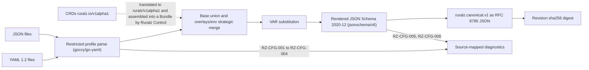

# ADR-0003: Configuration format: YAML with JSON Schema and a Kubernetes-style resource model

## Context and problem statement

Ruralz is configured through Bundles: directories rooted at `ruralz.yaml` that render into one content-addressed Revision per Environment ([Configuration model](../architecture/02-configuration-model.md#canonical-form-and-revision), [System overview](../architecture/01-system-overview.md#configuration-lifecycle)). The same files are reviewed in Git (P5), validated by the `ruralz` CLI, re-rendered by Ruralz Control, loaded by file-mode Nodes (P2) and, Planned (M2), mirrored as CRDs ([ADR-0016](0016-kubernetes-helm-and-crds.md), proposed; [principles](../vision/01-vision-and-positioning.md#principles)).

Which format gives all of them one schema, identical parsing and no construct that expands without bound? KrakenD, the main migration source, recommends one JSON file ([source](https://www.krakend.io/docs/configuration/supported-formats/)) plus Go templates ([source](https://www.krakend.io/docs/configuration/flexible-config/)).

## Decision drivers

- **Reviewable Git diffs with comments** (P5).
- **One published schema** for editors, the CLI, Ruralz Control ingest and CRD admission.
- **Deterministic parsing**: equal bytes and variables yield equal Revision digests on every OS, and on every release except a recorded `v1alpha1` default change, without YAML 1.1 typing.
- **Bounded input**: nothing that can exhaust memory or change unreviewed values.
- **Kubernetes optional**: a CRD-mappable envelope, yet `ruralzd` needs no Kubernetes (P2).
- **Libraries passing gates G1 to G3 and S2** of [Tech stack and libraries](../engineering/01-tech-stack-and-libraries.md#selection-criteria) on the Go 1.26 floor ([ADR-0001](0001-implementation-language-go.md)).

## Considered options

1. YAML 1.2 with JSON Schema (draft 2020-12), restricted profile and Kubernetes envelope, using `goccy/go-yaml` ([source](https://github.com/goccy/go-yaml/blob/master/README.md)) and `santhosh-tekuri/jsonschema/v6` ([source](https://github.com/santhosh-tekuri/jsonschema/blob/boon/README.md)).
2. Unrestricted YAML with a YAML 1.1 resolver, as in `sigs.k8s.io/yaml` ([source](https://github.com/kubernetes-sigs/yaml/blob/v1.6.0/yaml.go)).
3. JSON only, which KrakenD recommends and alone checks with `--lint` ([source](https://www.krakend.io/docs/configuration/supported-formats/)).
4. HCL, listed among KrakenD's formats ([source](https://www.krakend.io/docs/configuration/supported-formats/)).
5. KrakenD-style flat file with templates ([source](https://www.krakend.io/docs/configuration/templates/)).

## Decision outcome

Chosen option: "YAML 1.2 validated by a published JSON Schema (draft 2020-12), with a restricted YAML profile, Kubernetes-style `apiVersion`/`kind`/`metadata`/`spec` resources and strategic-merge overlays, and JSON accepted as a strict subset", because only it keeps comments and line diffs, maps one to one onto CRDs, and parses deterministically, with bounded input, under one schema. HCL and JSON-only are rejected; the flat file stays an import source. The rules refine [Format decision](../architecture/02-configuration-model.md#format-decision) and foundation pack sections 5 and 7:

| Rule | Value | Planned |
|---|---|---|
| Envelope | `apiVersion: ruralz/v1alpha1`, `kind` (ten kinds), `metadata`, `spec`; `camelCase` keys and `PascalCase` kinds, except `$patch` | Planned (M0) |
| Schema | Draft 2020-12 authoring view (accepts `${VAR}` strings) and strict rendered view, generated from one source, with `x-ruralz-*` keywords | Planned (M0) |
| Restricted profile | Rejects non-UTF-8, byte order marks and oversize or over-deep input, depth checked over `lexer.Tokenize` output before parsing (RZ-CFG-001; proposed 64 MiB and 20,000 resources (target), Node limits never below CLI defaults), duplicate keys (RZ-CFG-002), anchors, aliases, merge keys (RZ-CFG-003) and custom tags (RZ-CFG-004) | Planned (M1) |
| JSON | `.json` files share the loader, schema and Revision digest | Planned (M1) |
| Bundle merge | Base files form a union; `overlays/<env>/` patch by `x-ruralz-list` strategic merge; `${VAR}` substitution runs once, between merge and validation | Planned (M1) |
| Libraries | `goccy/go-yaml` for tokens and AST. Ruralz types plain scalars from token text by the YAML 1.2 core schema (null, true/false, decimal, `0o` and `0x` integers, floats, else string), never by library typing; a substituted whole-value `${VAR}`, quoted or JSON too, takes the rendered view's field type. `santhosh-tekuri/jsonschema/v6` with its `Vocabulary` API | Planned (M1) |
| CRD mirror | `ruralz.io/v1alpha1`, translated by changing only the group ([ADR-0016](0016-kubernetes-helm-and-crds.md), proposed) | Planned (M2) |

An example resource; its JSON twin validates identically:

```yaml
apiVersion: ruralz/v1alpha1
kind: Route
metadata:
  name: orders-read
spec:
  match:
    hosts: ["api.shop.example"]
    path: {prefix: /v1/orders}
    methods: [GET]
  upstreams:
    - name: orders
  timeout: 2s
```

*Figure 1: where the format decision acts between source files and a Revision.*



### Consequences

- Good, because one schema source drives editors, the CLI, Ruralz Control ingest and CRD structural schemas, with identical offline diagnostics for the same overlay and variables.
- Good, because the profile removes alias expansion and YAML 1.1 coercion; size and depth limits bound the rest.
- Good, because `x-ruralz-list` lets overlays patch keyed lists instead of replacing them.
- Good, because both libraries pass G2: goccy/go-yaml is MIT with no dependencies ([source](https://github.com/goccy/go-yaml/blob/master/LICENSE)); jsonschema/v6 is Apache-2.0 and passes S2 with `go 1.21` ([source](https://github.com/santhosh-tekuri/jsonschema/blob/v6.0.3/go.mod)). G1, G3 and goccy/go-yaml's S2 are Pending CI (Planned (M0)).
- Bad, because authors lose anchors, replaced by Policies by reference and overlays.
- Bad, because goccy/go-yaml reads leading-zero integers as octal ([source](https://github.com/goccy/go-yaml/blob/master/token/token.go)), so Ruralz owns scalar resolution.
- Bad, because both libraries self-report conformance, and goccy/go-yaml's last release (2026-01-08) ([source](https://github.com/goccy/go-yaml/releases/tag/v1.19.2)) leaves the S1 window on 2027-01-08, triggering a health review.
- Bad, because the depth limit's value and peak loader memory (hypothesis) stay unset until the Configuration model adds an Open question for them.
- Bad, because two schema views and seven custom keywords must stay in step, and apiVersion migration drops comments (OQ-configuration-model-7).
- Bad, because KrakenD users must convert; `ruralz bundle import krakend` is best-effort, Planned (M2).

### Confirmation

- **Loader conformance suite**, Planned (M1): a fixture per rejection (RZ-CFG-001 to RZ-CFG-004), an alias-expansion fixture, and plain scalars `yes`, `on`, `0777`, `0b1`, `1_000` and `2026-09-23`: `0777` MUST decode as 777 raw or substituted into an integer field and stay "0777" substituted into a string field; the rest are strings.
- **Hostile input**, Planned (M1): loader fuzzing, plus size and nesting fixtures that MUST fail with RZ-CFG-001 without a crash.
- **Upstream suites**, Planned (M1): the pinned YAML Test Suite against `goccy/go-yaml`, failing only on a checked-in list of profile-rejected or reviewed cases, and the pinned JSON-Schema-Test-Suite's required draft 2020-12 tests (optional excluded, except used formats) against `jsonschema/v6`, with zero failures. Other failures or regressions fail CI.
- **JSON subset fixtures**, Planned (M1): tab indentation, `\/` and surrogate `\u` escapes MUST yield the digest of their YAML twins.
- **Golden corpus**, Planned (M1): the Configuration model's [example Bundle](../architecture/02-configuration-model.md#complete-annotated-example-bundle) and its JSON twin MUST reproduce one expected digest on every release, except entries recording a `v1alpha1` default change.
- **Schema generation check**, Planned (M0): CI regenerates both views from one source and fails on any drift from the published files.
- **Docs gate**: [verify-docs.mjs](../../scripts/verify-docs.mjs) rejects `ruralz/*` yaml examples with an unknown `kind`.
- **Review checklist item**: a pull request accepting a new YAML feature, file format or envelope key MUST amend this ADR.

## Pros and cons of the options

### YAML 1.2 with JSON Schema, restricted profile and Kubernetes envelope

- Good, because comments, flow style and multi-document files remain.
- Good, because goccy/go-yaml claims YAML 1.2 compliance and reads YAML 1.1 boolean words as strings ([source](https://github.com/goccy/go-yaml/blob/master/token/token.go)); its decoder rejects duplicate keys by default ([source](https://github.com/goccy/go-yaml/blob/v1.19.2/option.go)), and the Ruralz AST pass enforces RZ-CFG-002.
- Bad, because indentation errors remain; file, line and column diagnostics mitigate them.

### Unrestricted YAML with a YAML 1.1 resolver

- Good, because it matches common Kubernetes tooling and allows anchors for reuse.
- Bad, because its resolver maps `y`, `yes` and `on` to booleans ([source](https://github.com/yaml/go-yaml/blob/v2.4.2/resolve.go)), and alias edits change values outside the reviewed hunk.

### JSON only

- Good, because the syntax is unambiguous and every tool parses it.
- Bad, because it lacks comments; KrakenD's schema tolerates `@`, `$`, `_` or `#` keys instead ([source](https://www.krakend.io/schema/v2.13/krakend.json)).
- Bad, because large nested files diff poorly.

### HCL

- Good, because it has comments and readable diffs.
- Bad, because its schema and editor story is weak and it has no CRD path.
- Bad, because KrakenD CE v2.13 parses through krakend-koanf, whose README omits HCL ([source](https://github.com/krakend/krakend-koanf)).

### KrakenD-style flat file with templates

- Good, because KrakenD operators know it.
- Bad, because a failed render falls back to the raw file ([source](https://github.com/krakend/krakend-flexibleconfig/blob/master/template.go)), so the loaded configuration can differ from the reviewed intent.
- Bad, because a template language is a Configuration model non-goal.

## More information

- Owning document: [Configuration model](../architecture/02-configuration-model.md#restricted-yaml-profile).
- Evidence: [Tooling and licenses research](../_meta/research/tooling-and-licenses.md) sections 6 and 7; [KrakenD configuration model research](../_meta/research/krakend-config-model.md); the [Library catalog](../engineering/01-tech-stack-and-libraries.md#library-catalog).
- Related decisions: [ADR-0011](0011-expressions-and-authorization-engines.md) and [ADR-0017](0017-artifact-signing.md).
- Open elsewhere: OQ-configuration-model-10 and OQ-configuration-model-2.
