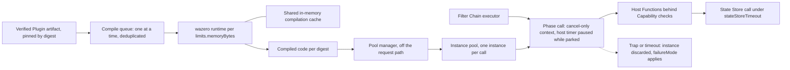

# ADR-0004: WASM runtime: wazero

## Context and problem statement

Differentiator (1), the WASM plugin system, runs operator-installed Plugins inside every Node of Ruralz Gateway (`ruralzd`) under Plugin ABI v1 ([ADR-0005](0005-plugin-abi-v1.md)). Principle P6 requires a sandbox with deny-by-default Capabilities and declared limits (`limits.memoryBytes`, `limits.timeout`) in which a faulty Plugin fails only its own Policy ([Vision](../vision/01-vision-and-positioning.md#principles)).

Which WebAssembly runtime executes Plugins in a `CGO_ENABLED=0` static binary ([ADR-0001](0001-implementation-language-go.md)), under an Apache-2.0-compatible license, with enforceable memory and time limits? Nothing is implemented: the runtime and Plugins are Planned (M2), the proxy-wasm adapter Planned (M4).

## Decision drivers

- **Gate G1**: pure Go, cross-built for linux/amd64 and linux/arm64 ([Selection criteria](../engineering/01-tech-stack-and-libraries.md#selection-criteria)); owning-document goal WG-3.
- **Gate G2**: a license compatible with Apache-2.0 distribution ([ADR-0002](0002-apache-2-license-no-feature-gating.md)).
- **Criterion S4**: memory caps and deadlines the host controls, since P6 limits are enforced per call.
- **Isolation (TB-2)**: a trap fails the call, never the Node ([System overview](../architecture/01-system-overview.md#trust-boundaries)).
- **One host everywhere**: `ruralzd` and `ruralz plugin test` MUST behave identically.
- **Measured cost (P10)**: a pooled Phase call costs 50 µs or less at p99 (target), SM-6.
- **Maintenance**: recent releases and a small transitive graph (S1, S6).

## Considered options

1. **wazero**, repository `wazero/wazero`, Go module path `github.com/tetratelabs/wazero` ([source](https://proxy.golang.org/github.com/tetratelabs/wazero/@latest)), v1.12.0 released 2026-05-29 ([source](https://github.com/wazero/wazero/releases/tag/v1.12.0)).
2. **wasmtime-go** v49, calling the Wasmtime C API through CGO ([source](https://github.com/bytecodealliance/wasmtime-go/blob/main/README.md)).
3. **Extism go-sdk** as the host, itself a wazero wrapper ([source](https://github.com/extism/go-sdk)).
4. **mosn proxy-wasm-go-host** as the host, which depends on wazero v1.2.1 and `wasmer-go` ([source](https://github.com/mosn/proxy-wasm-go-host/blob/main/go.mod)).

## Decision outcome

Chosen option: "wazero, imported as `github.com/tetratelabs/wazero`", because it is the only researched pure-Go runtime engine, which the Extism and mosn hosts wrap, and "doesn't rely on CGO" ([source](https://github.com/wazero/wazero/blob/main/README.md)), is Apache-2.0 ([source](https://github.com/wazero/wazero/blob/v1.12.0/LICENSE)), and offers the page limits, context interruption and shared compiled code the owning document's [Runtime](../architecture/05-wasm-plugin-system.md#runtime) rules need. This matches the foundation pack section 7 WASM runtime row: repository `github.com/wazero/wazero`, Go module path `github.com/tetratelabs/wazero`. Code and `go.mod` MUST use the module path; `import "github.com/wazero/wazero"` fails because the `.mod` file declares the other path ([source](https://proxy.golang.org/github.com/wazero/wazero/@v/v1.12.0.mod)). Rules, all Planned (M2):

| Concern | Rule |
|---|---|
| Version and wrapping | v1.12.x floor, pinned in `go.mod`; imported only by `internal/pluginhost`, which both `ruralzd` and the CLI link ([Banned imports](../engineering/02-repository-layout-and-conventions.md#banned-imports)) |
| Engine | `NewRuntimeConfigCompiler()`, never `NewRuntimeConfig()`, which silently falls back to the interpreter ([source](https://github.com/wazero/wazero/blob/main/config.go)), often ten times slower ([source](https://github.com/wazero/wazero/blob/main/README.md)). Compiler mode runs only on amd64 and arm64, the `ruralzd` production platforms ([Static builds](../engineering/01-tech-stack-and-libraries.md#static-builds)); without it, `ruralzd` activates no Plugins and reports a degraded state |
| Runtimes and cache | One runtime per distinct `limits.memoryBytes`, since the page limit is a runtime setting, all sharing one in-memory `NewCompilationCache()`; never `NewCompilationCacheWithDir`, since no signature covers persisted native code (OQ-data-plane-11, option (c)) ([source](https://github.com/wazero/wazero/blob/main/cache.go)) |
| Compilation | Once per digest and memory limit, off the request path and deduplicated, since the cache does not lock during compilation ([source](https://github.com/wazero/wazero/blob/main/cache.go)); one compile at a time with `experimental.WithCompilationWorkers` at most max(1, `GOMAXPROCS`/4) (target) ([source](https://github.com/wazero/wazero/blob/main/experimental/compilationworkers.go)) |
| Instances | `InstantiateModule` on the shared compiled code, one instance per concurrent Phase call, because `api.Function.Call` is not goroutine-safe ([source](https://github.com/wazero/wazero/blob/main/api/wasm.go)); a background pool manager instantiates, never the request path |
| Memory | `WithMemoryLimitPages` of floor(`limits.memoryBytes` / 64 KiB), alike on Nodes and in audit, default 16 MiB (target), not wazero's 4 GiB default; `WithMemoryCapacityFromMax(true)` reserves it eagerly, so `memory.grow` never copies ([source](https://github.com/wazero/wazero/blob/main/config.go)). `GOMEMLIMIT` MUST be at least [M_node](../operations/03-capacity-planning.md#formulas), counting this cap once; with Plugins active and `GOMEMLIMIT` unset or below the cap plus M_fix, the Node reports `ruralz_node_degraded_info{reason="plugin_memlimit"}` (proposed to Observability); an off-heap `experimental.MemoryAllocator` is the fallback ([source](https://github.com/wazero/wazero/blob/main/experimental/memory.go)) |
| Time | `WithCloseOnContextDone(true)` ([source](https://github.com/wazero/wazero/blob/main/config.go)) on a cancel-only per-call context (`context.WithCancel` of the request context), cancelled by a host timer of `limits.timeout`, default 5 ms (target), that stops while the guest is parked in its State Store call and resumes with the remaining time; that call has its own `stateStoreTimeout` context (pack section 8.7). 1,000 Host Function calls per call (target) replace fuel, which wazero lacks ([source](https://github.com/wazero/wazero/issues/422)) |
| Faults | A trapped or timed-out instance is discarded; refills are rate-limited per [Default limits](../architecture/05-wasm-plugin-system.md#default-limits) |

*Figure 1: wazero inside `internal/pluginhost` on one Node.*

### Consequences

- Good, because the gateway stays one static `CGO_ENABLED=0` binary and wazero's only `go.mod` dependency is `golang.org/x/sys` ([source](https://github.com/wazero/wazero/blob/main/go.mod)), so G1, G2 and S6 hold.
- Good, because `ruralz plugin test` links the same `internal/pluginhost`, enforcing Node limits exactly.
- Good, because compiled code is shared across instances and runtimes in memory ([source](https://github.com/wazero/wazero/blob/main/cache.go)), so a Hot Reload keeping a digest reuses its compiled code, and unchanged pools carry over; Retire calls `CompiledModule.Close` so the cache frees unshared code.
- Bad, because interruption costs 10 to 20x on loop-heavy guests, and no fix had merged by 2026-09-12 ([source](https://github.com/wazero/wazero/issues/2466)); SM-6 includes it and its fixed per-call cancellation cost; whether a wall clock suffices stays OQ-wasm-plugin-system-10.
- Bad, because a compile cannot be cancelled and compiled size has no API, so the owning document bounds abandoned compiles to 1 per Node (target) and accounts 4 × Wasm bytes per digest and memory limit (target; factor a hypothesis), conservative if the cache shares native code across limits, which OQ-wasm-plugin-system-16 SHOULD confirm.
- Bad, because reserved linear memory is live Go heap that raises the `GOGC` heap goal ([source](https://go.dev/doc/gc-guide)), so without `GOMEMLIMIT` resident memory can exceed M_node by up to the live heap (hypothesis); OQ-wasm-plugin-system-16 SHOULD add an off-heap allocator benchmark.
- Bad, because the only dated comparison (2023) has wazero trailing Wasmtime significantly ([source](https://00f.net/2023/01/04/webassembly-benchmark-2023/)), so Ruralz must publish its own numbers (P10).
- Bad, because a compiler defect is a sandbox escape (threat PT-1), mitigated by pinning, `govulncheck`, fuzzing and SM-13 ([Threat model](../architecture/05-wasm-plugin-system.md#threat-model)).
- Bad, because FIPS mode does not cover Wasm ([source](https://go.dev/doc/security/fips140)); FIPS builds, Planned (M5), offer Plugins approved cryptography only through `crypto.use` ([FIPS build](../engineering/01-tech-stack-and-libraries.md#fips-build)).
- Bad, because the project is small, with 14 commits in 90 days and 45 open issues and pull requests ([source](https://github.com/wazero/wazero)), so fixes such as #2466 may land slowly.

### Confirmation

- **Import rule**, Planned (M0): depguard rejects `github.com/tetratelabs/wazero` outside `internal/pluginhost` ([Banned imports](../engineering/02-repository-layout-and-conventions.md#banned-imports)).
- **G1 cross-build and license gate**, Planned (M0): all three binaries build with `CGO_ENABLED=0` for linux/amd64 and linux/arm64, and the gate reads the linked package set ([Admission](../engineering/01-tech-stack-and-libraries.md#admission)).
- **Plugin ABI conformance suite** in `pr-full`, Planned (M2): trap, timeout and memory cases return the same `RZ-PLG` codes on both hosts in compiler mode; a parked `state_get` outlasting `limits.timeout` returns without `RZ-PLG-002`, and the guest then looping past its remaining time gets `RZ-PLG-002` ([Conformance suites](../engineering/03-testing-and-quality-strategy.md#conformance-suites)).
- **Node memory bound**, Planned (M2): at the Node cap, with every instance at its limit and `GOMEMLIMIT` = M_node, resident memory stays at or below `GOMEMLIMIT` / 0.9 (target).
- **SM-6 microbenchmark gate**, Planned (M2): the `pr-full` run gates alloc/op; the `nightly` and `release` Macro latency gate fails a pooled Phase call, interruption on, above 50 µs at p99 (target) ([Benchmarks and regression gates](../engineering/03-testing-and-quality-strategy.md#benchmarks-and-regression-gates)).
- **Fuzzing**, Planned (M2): one target per Host Function group; out-of-bounds guest pointers trap the guest, never the host ([Fuzzing](../engineering/03-testing-and-quality-strategy.md#fuzzing)).
- **`govulncheck`** on every pull request, Planned (M0); SM-13 keeps unpatched sandbox escapes older than 30 days at zero (target).
- **Review checklist item**: a pull request that uses `NewRuntimeConfig()`, enables `NewCompilationCacheWithDir`, disables `WithCloseOnContextDone`, gives it a deadline context, omits `WithMemoryLimitPages` or `WithMemoryCapacityFromMax`, or adds a second WebAssembly runtime MUST amend this ADR.

## Pros and cons of the options

### wazero

- Good, because it provides the documented host pattern: compile once, then instantiate per worker ([source](https://github.com/wazero/wazero/blob/main/runtime.go)).
- Good, because v1.12.0 added exception handling, typed references and extended constant expressions ([source](https://github.com/wazero/wazero/releases/tag/v1.12.0)), so guests that use these proposals load.
- Bad, because it has no fuel or instruction metering; maintainers point to context cancellation and page limits instead ([source](https://github.com/wazero/wazero/issues/422)).
- Bad, because the repository name and Go module path differ ([source](https://github.com/wazero/wazero/blob/main/go.mod)), a naming trap the foundation pack corrected at freeze.

### wasmtime-go

- Good, because it offers fuel (`SetConsumeFuel`), epoch interruption, a stack cap and `Store.Limiter` ([source](https://github.com/bytecodealliance/wasmtime-go/blob/main/config.go)) ([source](https://github.com/bytecodealliance/wasmtime-go/blob/main/store.go)).
- Bad, because it links the prebuilt Rust `libwasmtime` through CGO ([source](https://github.com/bytecodealliance/wasmtime-go/blob/main/ffi.go)), which breaks G1 and ADR-0001; the tech stack lists it under [Alternatives not chosen](../engineering/01-tech-stack-and-libraries.md#alternatives-not-chosen) until an ADR accepts CGO.

### Extism go-sdk

- Good, because it wraps wazero's pooling as `CompiledPlugin.Instance()` and carries manifest limits such as `memory.max_pages` and `timeout_ms` ([source](https://github.com/extism/go-sdk/blob/main/extism.go)).
- Bad, because its last commit was 2025-05-14 ([source](https://github.com/extism/go-sdk)) and it pins wazero v1.9.0 ([source](https://github.com/extism/go-sdk/blob/main/go.mod)), which fails S1; Ruralz reuses Extism's guest conventions only ([ADR-0005](0005-plugin-abi-v1.md)).

### mosn proxy-wasm-go-host

- Good, because it would run proxy-wasm filters without new host code.
- Bad, because it was last pushed in 2024 ([source](https://github.com/mosn/proxy-wasm-go-host)), pins wazero v1.2.1 beside `wasmer-go`, and its original repository is gone ([source](https://github.com/tetratelabs/proxy-wasm-go-host)); the Planned (M4) adapter is Ruralz code on this runtime instead.

## More information

- Owning document: [WASM plugin system](../architecture/05-wasm-plugin-system.md#runtime) and its [Performance model](../architecture/05-wasm-plugin-system.md#performance-model); catalog row: [Tech stack and libraries](../engineering/01-tech-stack-and-libraries.md#library-catalog).
- Research: [Go runtime libraries](../_meta/research/go-libraries-runtime.md) section 2 and [Tooling and licenses](../_meta/research/tooling-and-licenses.md) section 4. The repository-path rejection is inferred from the proxy's `.mod` file, not reproduced with a Go toolchain.
- Related decisions: [ADR-0001](0001-implementation-language-go.md) (static builds), [ADR-0005](0005-plugin-abi-v1.md) (Plugin ABI v1 and the proxy-wasm adapter) and [ADR-0017](0017-artifact-signing.md) (Plugin signatures verified before compilation).
- Revisit when wazero ships metering or a cheaper fix for #2466, or if fuel metering becomes mandatory, which needs an ADR accepting CGO for wasmtime-go.
- Proposed owning-document amendment: [Data plane](../architecture/03-data-plane.md#durable-and-shared-state) still lists an on-disk `${RURALZ_DATA_DIR}/cache/wazero/`, contradicting the in-memory-only rule; it SHOULD remove "compiled Plugin code" and `${RURALZ_DATA_DIR}/cache/wazero/` from that row, keep `${RURALZ_DATA_DIR}/cache/oci/sha256/` for Plugin artifacts, and close OQ-data-plane-11 with option (c). Foundation pack section 8.11 still names compiled code among disposable caches; that stays with OQ-wasm-plugin-system-16.
