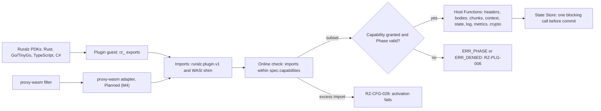
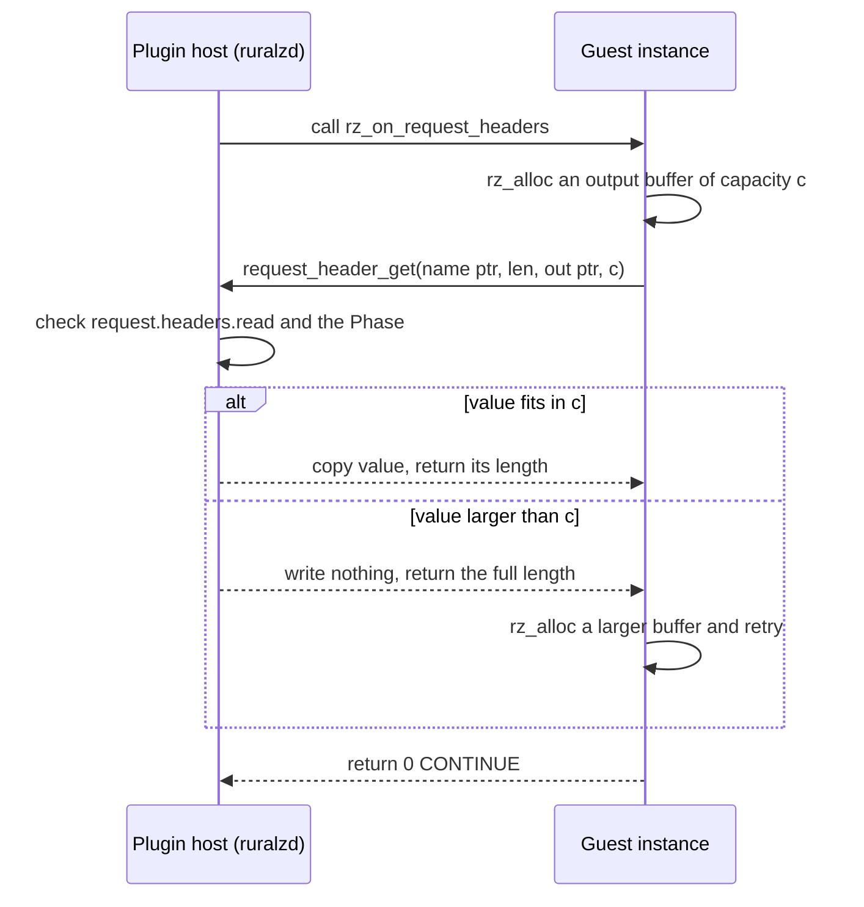

# ADR-0005: Plugin ABI v1: capability-based with Extism-style conventions, proxy-wasm adapter Planned (M4)

## Context and problem statement

Differentiator (1), the WASM plugin system, runs Plugins in every Node of Ruralz Gateway (`ruralzd`) on wazero ([ADR-0004](0004-wasm-runtime-wazero.md)). The guest-host contract decides what a Plugin can read and change, in which Phases and languages, and whether compiled Plugins survive Ruralz releases. [WASM plugin system](../architecture/05-wasm-plugin-system.md#plugin-abi-v1) owns the details; this ADR decides the contract family.

Three principles constrain it ([Vision](../vision/01-vision-and-positioning.md#principles)). P6 requires deny-by-default Capabilities and declared limits, so a faulty Plugin fails only its own Policy. P3 and foundation pack section 8.7 allow one blocking State Store round trip per Policy before commit, none in `onChunk`, and no undeclared remote calls. P7 maps streamed messages to `onChunk`.

Prior art offers no stable contract: KrakenD CE 3.0 drops Go plugins ([source](https://www.krakend.io/blog/dropping-plugins-support-on-community/)), Kong removed its beta WASM support in 3.11.0.0 ([source](https://developer.konghq.com/gateway/breaking-changes/)) and APISIX's proxy-wasm support is experimental ([source](https://apisix.apache.org/docs/apisix/wasm/)). Which ABI should Ruralz freeze? Nothing is implemented yet: Plugin ABI v1 is Planned (M2) and the proxy-wasm compatibility adapter Planned (M4).

## Decision drivers

- **Deny-by-default (P6, WG-4)**: every Plugin effect is granted in `Plugin.spec.capabilities` and checkable before activation.
- **Every Phase (WG-1, P7)**: request, response and `onChunk` hooks; short-circuit only in request Phases (pack section 4).
- **Request-path rules (P3)**: at most one blocking State Store call per Plugin Policy before commit, none in `onChunk`, no outbound calls.
- **Fault isolation (WG-2, TB-2)**: traps and misuse become `RZ-PLG` codes under the Policy's `failureMode`, never a Node crash ([System overview](../architecture/01-system-overview.md#trust-boundaries)).
- **Several PDK languages (WG-7)**: one guest convention that Rust, Go/TinyGo, TypeScript and C# can target.
- **Stable binaries**: a compiled Plugin runs on every release serving the ABI, whatever Go toolchain built `ruralzd`.
- **Maintained pure-Go host**: gate G1 and criterion S1 of the [selection criteria](../engineering/01-tech-stack-and-libraries.md#selection-criteria).
- **Measured cost (P10)**: SM-6, 50 µs or less per pooled Phase call at p99 (target).

## Considered options

1. **Custom capability-based ABI `ruralz.plugin.v1` with Extism-style conventions**: a Ruralz import namespace where each Host Function needs one Capability, following the memory and Host Function conventions of Extism's PDKs ([source](https://extism.org/docs/concepts/pdk)).
2. **proxy-wasm as the primary ABI**, behind Kong's 3.4 beta ([source](https://konghq.com/blog/product-releases/webassembly-in-kong-gateway-3-4)) and APISIX's `wasm-nginx-module` ([source](https://apisix.apache.org/docs/apisix/wasm/)), hosted by mosn proxy-wasm-go-host ([source](https://github.com/mosn/proxy-wasm-go-host)) or by new Ruralz code.
3. **Extism's own ABI with its go-sdk as the host**, so existing Extism plugins load unchanged ([source](https://github.com/extism/go-sdk)).

## Decision outcome

Chosen option: "Custom capability-based Plugin ABI v1 (`ruralz.plugin.v1`) with Extism-style memory and Host Function conventions and deny-by-default Capabilities; a proxy-wasm compatibility adapter is Planned (M4)", because only a Ruralz-defined contract can gate each import with a Capability, expose `onChunk` and enforce the one-round-trip rule, while Extism's guest conventions keep PDKs familiar without linking the stale go-sdk. This matches the foundation pack section 7 Plugin ABI row. Rules, Planned (M2) unless tagged, from the owning document's [Contract](../architecture/05-wasm-plugin-system.md#contract) and [Host Function table](../architecture/05-wasm-plugin-system.md#host-function-table):

| Concern | Rule |
|---|---|
| Identifier | `ruralz.plugin.v1` names the ABI and the Host Function import namespace; `Plugin.spec.abi` accepts only that value; `rz_abi_version()` returns 1 |
| Memory | `(ptr i32, len i32)` buffers allocated by the guest's `rz_alloc`; the host copies and never retains guest pointers |
| Results | Every Host Function returns `i32`, negative only for errors (`-1` ERR_ABSENT to `-7` ERR_DENIED); an output write above its capacity writes nothing and returns the full length |
| Exports | `rz_abi_version`, `rz_alloc`, `rz_free`, `rz_configure`, plus `rz_` Phase exports whose set MUST equal `spec.phases` (RZ-CFG-028) |
| Phase results | `0` CONTINUE, `1` RESPOND after an accepted `response_send`, `2` END_STREAM in `onChunk`; negative means cannot decide, so `failureMode` applies |
| Capabilities | Each Host Function needs exactly one Capability; the requested set, derived from imports, MUST be a subset of `spec.capabilities` (RZ-CFG-028) and is re-checked with the Phase on every call; `ERR_PHASE`, `ERR_BUDGET` and `ERR_DENIED` are sticky and yield `RZ-PLG-006` |
| Ambient authority | None: a `wasi_snapshot_preview1` shim maps log, clock and random calls to their Capabilities and fails file and socket calls; no outbound calls, timers or shared queues |
| State Store | One blocking `state_get` or `state_incr` per Plugin Policy per request before commit, a second returning `ERR_BUDGET`; `onLog` writes are asynchronous; none in `onChunk` |
| Credentials | Credential headers need `credentials.read` (OQ-wasm-plugin-system-3, option (b)) |
| Evolution | Frozen when it ships; only new Host Functions are additions, each raising an integer ABI level; anything else needs `ruralz.plugin.v2` ([Plugin ABI versioning](../engineering/04-release-versioning-and-compatibility.md#plugin-abi-versioning)) |
| proxy-wasm, Planned (M4) | Ruralz adapter on the same host, Capabilities, limits, `RZ-PLG` codes and `failureMode`; outbound calls, timers and shared queues fail activation (RZ-CFG-028); declaration is OQ-wasm-plugin-system-8 ([proxy-wasm stance](../architecture/05-wasm-plugin-system.md#proxy-wasm-stance)) |

*Figure 1: every guest import, native or through the proxy-wasm adapter, passes one Capability gate.*

*Figure 2: the Extism-style buffer convention for one Host Function call inside a Phase.*

### Consequences

- Good, because a Plugin's authority is visible before it runs: `ruralz plugin build` derives Capabilities from imports, the online stage rejects excess, and `ruralz bundle audit` and `ruralz bundle diff` flag grants ([Deny-by-default](../architecture/05-wasm-plugin-system.md#deny-by-default)).
- Good, because Plugins run in every Phase, `onChunk` included, under the one-round-trip and `failureMode` rules of built-in Filters.
- Good, because the contract is WASM imports, not Go linkage, so a compiled Plugin survives Ruralz and Go toolchain upgrades, and the host links only wazero.
- Bad, because Ruralz must maintain four PDKs (Rust and Go/TinyGo Planned (M2), TypeScript Planned (M3), C# Planned (M4)), the WASI shim and a conformance suite ([SDK matrix](../architecture/05-wasm-plugin-system.md#sdk-matrix)).
- Bad, because no existing binary runs at launch: Extism plugins need a rebuild with a Ruralz PDK, and proxy-wasm filters wait for the Planned (M4) adapter.
- Bad, because engine-based PDKs (TypeScript, C#) link every binding, needing a generated import shim and more memory, 64 MiB for TypeScript (hypothesis).
- Bad, because Plugins cannot call external services (OQ-wasm-plugin-system-5) or hold keys in plaintext `config` (OQ-wasm-plugin-system-4).
- Bad, because after the freeze an ABI mistake costs `ruralz.plugin.v2`, served beside v1 for 4 minor releases, about 12 months (target).
- Bad, because the adapter pins each request to one instance, since proxy-wasm keeps stream state in guest memory: 1,000 contexts per instance (target), recycling open (OQ-wasm-plugin-system-17).

### Confirmation

- **Plugin ABI conformance suite** in `pr-full`, Planned (M2): Host Function, encoding and WASI tables; denied Capabilities; `request.headers.read` alone cannot read `authorization`; a sticky error yields `RZ-PLG-006`; it runs on the `ruralzd` and `ruralz plugin test` hosts and every Ruralz PDK, and on the adapter with a proxy-wasm filter corpus, Planned (M4) ([Conformance suites](../engineering/03-testing-and-quality-strategy.md#conformance-suites)).
- **Online Plugin check**, Planned (M2): `ruralz bundle build`, `ruralz bundle validate --online`, Ruralz Control ingest and Node activation reject an artifact whose ABI, Phase exports or requested Capabilities disagree with `Plugin.spec` (RZ-CFG-028) ([Validation and diff semantics](../architecture/02-configuration-model.md#validation-and-diff-semantics)).
- **Host Function fuzzing**, Planned (M2): one target per Host Function group; out-of-bounds pointers and lengths trap the guest, never the host ([Fuzzing](../engineering/03-testing-and-quality-strategy.md#fuzzing)).
- **SM-6 microbenchmark gate**, Planned (M2): 50 µs or less per pooled Phase call at p99 (target).
- **Review checklist item**: a pull request that adds an ambient import or a Host Function without exactly one Capability, changes a result code, Phase result, memory convention or required export, or accepts another `abi` value MUST amend this ADR or open `ruralz.plugin.v2`.

## Pros and cons of the options

### Custom capability-based ABI with Extism-style conventions

- Good, because per-import Capabilities, Phase validity and the State Store budget are part of the contract, not a layer on top.
- Good, because Extism's conventions already serve eight PDK languages ([source](https://extism.org/docs/concepts/pdk)), so authors meet a known pattern.
- Bad, because Ruralz alone owns the specification, host, PDKs and conformance suite.

### proxy-wasm as the primary ABI

- Good, because filters already written for it exist; APISIX implements `proxy_on_configure` and HTTP header and body callbacks ([source](https://apisix.apache.org/docs/apisix/wasm/)).
- Bad, because it lacks deny-by-default Capabilities, `onChunk` and the one-round-trip rule, and its outbound calls, timers and shared queues break pack section 8.7 rule 6.
- Bad, because adoption is receding: Kong removed its beta in 3.11.0.0 ([source](https://developer.konghq.com/gateway/breaking-changes/)), and APISIX says "only a few APIs are implemented" ([source](https://apisix.apache.org/docs/apisix/wasm/)).
- Bad, because no maintained Go host exists: mosn's was last pushed in 2024 and pins wazero v1.2.1 beside `wasmer-go` ([source](https://github.com/mosn/proxy-wasm-go-host/blob/main/go.mod)), and the original repository is gone ([source](https://github.com/tetratelabs/proxy-wasm-go-host)).

### Extism's ABI with its go-sdk as host

- Good, because Extism plugins would load unchanged, and the go-sdk wraps wazero pooling as `CompiledPlugin.Instance()` ([source](https://github.com/extism/go-sdk)).
- Bad, because the go-sdk's last commit was 2025-05-14 and it pins wazero v1.9.0 ([source](https://github.com/extism/go-sdk/blob/main/go.mod)), failing S1 and conflicting with the v1.12.x floor of ADR-0004.
- Bad, because its manifest limits, such as `allowed_hosts`, `memory.max_http_response_bytes` and `timeout_ms` ([source](https://github.com/extism/go-sdk/blob/main/extism.go)), admit outbound HTTP, which Plugin ABI v1 excludes, and name no Phase or per-import grant.

## More information

- Owning document: [WASM plugin system](../architecture/05-wasm-plugin-system.md), with [Capabilities and sandboxing](../architecture/05-wasm-plugin-system.md#capabilities-and-sandboxing) and [Threat model](../architecture/05-wasm-plugin-system.md#threat-model); see also the [Plugin](../architecture/02-configuration-model.md#plugin) kind and the [library catalog](../engineering/01-tech-stack-and-libraries.md#library-catalog) row.
- Research: [Go runtime libraries](../_meta/research/go-libraries-runtime.md) sections 2.5 and 2.6, [Kong, Tyk and APISIX](../_meta/research/competitors-kong-tyk-apisix.md) section 3, and [Envoy Gateway and others](../_meta/research/competitors-envoy-zuplo-gravitee.md) section 2.3, where Wasm is an Envoy Gateway extension type ([source](https://gateway.envoyproxy.io/docs/api/extension_types/)).
- Related decisions: [ADR-0001](0001-implementation-language-go.md) (static Go builds), [ADR-0004](0004-wasm-runtime-wazero.md) (runtime), [ADR-0011](0011-expressions-and-authorization-engines.md) (no Lua) and [ADR-0017](0017-artifact-signing.md) (Plugin signatures before compilation).
- Open questions: OQ-wasm-plugin-system-8 (adapter declaration, blocking Planned (M4)), OQ-wasm-plugin-system-12 (the pack section 12 proto package, as the ABI passes no protobuf messages), OQ-wasm-plugin-system-13 (ABI levels in Rollouts) and OQ-release-versioning-and-compatibility-10.
- Revisit if proxy-wasm gains a capability model and a maintained pure-Go host; admitting outbound calls would only add Host Functions within v1.
