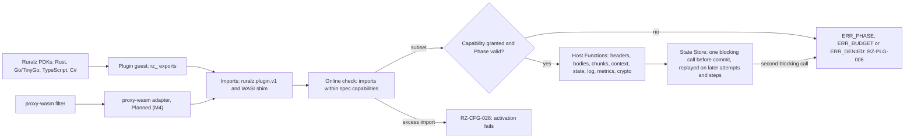
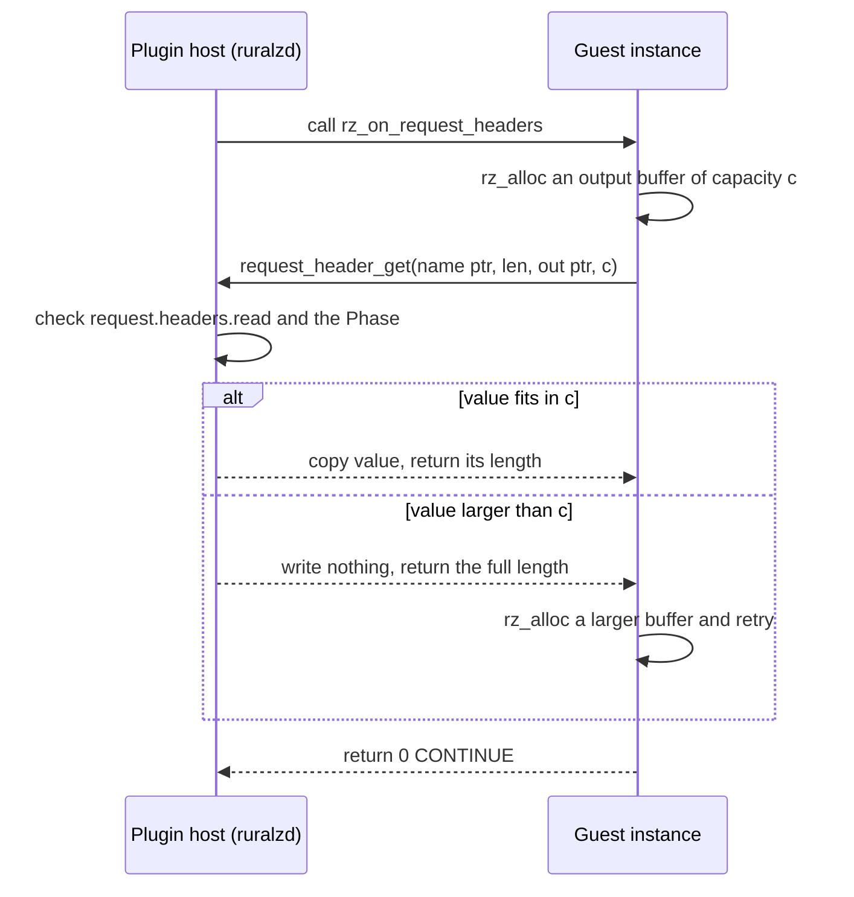

# ADR-0005: Plugin ABI v1: capability-based with Extism-style conventions, proxy-wasm adapter Planned (M4)

## Context and problem statement

Differentiator (1) runs WASM Plugins on wazero ([ADR-0004](0004-wasm-runtime-wazero.md)) in every Node of Ruralz Gateway (`ruralzd`). Their guest-host contract fixes what Plugins can touch, in which Phases and languages, and whether binaries survive releases ([WASM plugin system](../architecture/05-wasm-plugin-system.md#plugin-abi-v1)). Principles P3, P6 and P7 ([Vision](../vision/01-vision-and-positioning.md#principles)) constrain it.

KrakenD CE 3.0 drops Go plugins ([source](https://www.krakend.io/blog/dropping-plugins-support-on-community/)) and Kong dropped its proxy-wasm beta ([source](https://developer.konghq.com/gateway/breaking-changes/)): which ABI should Ruralz freeze? Plugin ABI v1 is Planned (M2), the adapter Planned (M4).

## Decision drivers

- **Deny-by-default (P6, WG-4)**: every effect is granted in `Plugin.spec.capabilities`, checkable before activation.
- **Every Phase (WG-1, P7)**: request, response and `onChunk` hooks (pack section 4).
- **Request-path rules (P3)**: at most one blocking State Store call per Plugin Policy before commit, none in `onChunk`, and no remote call that is not declared on its Policy (pack section 8.7 rule 6); Plugin ABI v1 excludes outbound calls (OQ-wasm-plugin-system-5).
- **Fault isolation (WG-2, TB-2)**: traps and misuse become `RZ-PLG` codes under `failureMode`, never a Node crash.
- **Several PDK languages (WG-7)**: one guest convention for Rust, Go/TinyGo, TypeScript and C#.
- **Stable binaries, maintained pure-Go host**: Plugins outlive Go toolchains; G1 and S1 of the [selection criteria](../engineering/01-tech-stack-and-libraries.md#selection-criteria).
- **Measured cost (P10)**: the SM-6 pooled Phase call budget (target).

## Considered options

1. **Custom capability-based ABI `ruralz.plugin.v1`**: one Capability per Host Function, with Extism's PDK memory and Host Function conventions ([source](https://extism.org/docs/concepts/pdk)).
2. **proxy-wasm as the primary ABI**, as used by Kong's 3.4 beta ([source](https://konghq.com/blog/product-releases/webassembly-in-kong-gateway-3-4)) and APISIX's `wasm-nginx-module` ([source](https://apisix.apache.org/docs/apisix/wasm/)), hosted by mosn's proxy-wasm-go-host ([source](https://github.com/mosn/proxy-wasm-go-host)).
3. **Extism's own ABI with its go-sdk as the host**, loading Extism plugins unchanged ([source](https://github.com/extism/go-sdk)).

## Decision outcome

Chosen option: "Custom capability-based Plugin ABI v1 (`ruralz.plugin.v1`) with Extism-style memory and Host Function conventions and deny-by-default Capabilities; a proxy-wasm compatibility adapter is Planned (M4)", because only a Ruralz-defined contract can gate each import with a Capability, expose `onChunk` and enforce the one-round-trip rule, while Extism's conventions keep PDKs familiar without the stale go-sdk. Rules, Planned (M2) unless tagged, per the owning [Contract](../architecture/05-wasm-plugin-system.md#contract):

| Concern | Rule |
|---|---|
| Identifier | `ruralz.plugin.v1` names the ABI and the import namespace; `Plugin.spec.abi` accepts only that value |
| Memory | `(ptr i32, len i32)` buffers from the guest's `rz_alloc`; the host copies and never retains guest pointers |
| Results | Every Host Function returns `i32`, negative only for errors (`-1` ERR_ABSENT to `-7` ERR_DENIED); an output write above its capacity writes nothing and returns the full length, except that `request_body_read`, `response_body_read` (at an offset) and `chunk_read` return bytes written, 0 at the end, streaming a body through a fixed buffer |
| Exports | `rz_abi_version`, `rz_alloc`, `rz_free`, `rz_configure`, plus `rz_` Phase exports whose set MUST equal `spec.phases` (RZ-CFG-028) |
| Phase results | `0` CONTINUE, `1` RESPOND after an accepted `response_send`, `2` END_STREAM in `onChunk`; negative means cannot decide, so `failureMode` applies |
| Capabilities | Each Host Function needs exactly one Capability; the set derived from imports MUST be a subset of `spec.capabilities` (RZ-CFG-028), re-checked with the Phase per call; `ERR_PHASE`, `ERR_BUDGET` and `ERR_DENIED` are sticky: `RZ-PLG-006` |
| Ambient authority | None: a `wasi_snapshot_preview1` shim maps log, clock and random calls to their Capabilities and fails file and socket calls; ungated, `args_*` and `environ_*` return zero entries and `proc_exit` traps (`RZ-PLG-001`); no outbound calls, timers or shared queues |
| State Store | One blocking `state_get` or `state_incr` per Plugin Policy per request before commit, a second returning `ERR_BUDGET`; in upstream-leg Phases, as proposed in OQ-wasm-plugin-system-20, later attempts and steps replay the first result for the same Host Function and key without a round trip, parallel steps serializing; `onLog` writes asynchronous; none in `onChunk` |
| Credentials | Credential headers need `credentials.read` (OQ-wasm-plugin-system-3, option (b)) |
| Evolution | Frozen when it ships; additions are new Host Functions only, each raising an ABI level while `rz_abi_version()` stays 1; anything else needs `ruralz.plugin.v2`, except optional guest JSON fields (OQ-release-versioning-and-compatibility-10) ([versioning](../engineering/04-release-versioning-and-compatibility.md#plugin-abi-versioning)) |
| proxy-wasm, Planned (M4) | Ruralz adapter with the same host, Capabilities, limits, `RZ-PLG` codes and `failureMode`; a pinned call waits for its instance at most the 1 ms (target) pool wait, else `RZ-PLG-005`; a trap fails every context pinned to that instance, each under its own Policy's `failureMode`; outbound calls, timers and shared queues fail activation (RZ-CFG-028); declaration: OQ-wasm-plugin-system-8 |

*Figure 1: every Host Function import, native or through the proxy-wasm adapter, passes one Capability gate; WASI imports follow the shim.*

*Figure 2: the Extism-style buffer convention for one header read in a Phase; body and chunk reads return bytes written instead.*

### Consequences

- Good, because authority is visible before a Plugin runs: imports derive Capabilities, the online stage rejects excess, and `ruralz bundle audit` and `ruralz bundle diff` flag grants.
- Good, because Plugins run in every Phase, `onChunk` included, under built-in Filters' round-trip and `failureMode` rules.
- Good, because the contract is WASM imports, not Go linkage, so compiled Plugins survive Ruralz and Go upgrades.
- Bad, because Ruralz maintains four PDKs (Rust and Go/TinyGo Planned (M2), TypeScript Planned (M3), C# Planned (M4)), the WASI shim and a conformance suite.
- Bad, because no existing binary runs at launch: Extism plugins need rebuilding; proxy-wasm filters wait for the adapter.
- Bad, because engine-based PDKs (TypeScript, C#) need an import shim and more memory: a 64 MiB `state.*` Plugin (hypothesis) gets a parked bound of 12 under the 2 GiB default cap, below the audit threshold of 16 (target), so it needs a 4 GiB cap ([Sizing](../architecture/05-wasm-plugin-system.md#sizing)).
- Bad, because Plugins cannot call out (OQ-wasm-plugin-system-5) or hold plaintext keys (OQ-wasm-plugin-system-4).
- Bad, because an Upstream-scoped Plugin gets one State Store result per request: retries and steps replay it, another key returns `ERR_BUDGET`, and parallel `aggregate` steps wait on the first call (proposed OQ-wasm-plugin-system-20).
- Bad, because after the freeze an ABI mistake costs `ruralz.plugin.v2`, served beside v1 for 4 minor releases, about 12 months (target).
- Bad, because the adapter pins each request to the instance holding its stream state: up to 1,000 contexts (target) share its serialized calls and traps, with recycling and fault radius open (OQ-wasm-plugin-system-17).

### Confirmation

Planned (M2) unless tagged:

- **Plugin ABI conformance suite** in `pr-full` on `ruralzd`, `ruralz plugin test` and every Ruralz PDK ([Conformance suites](../engineering/03-testing-and-quality-strategy.md#conformance-suites)): Host Function, encoding and WASI tables; denied Capabilities; `request.headers.read` alone cannot read `authorization`; sticky errors yield `RZ-PLG-006`; a body above `limits.memoryBytes` is read in fixed-size chunks without `RZ-PLG-003`; an Upstream-scoped `state.read` Plugin gets no `RZ-PLG-006` with one retry or two `aggregate` steps.
- **Adapter conformance**, Planned (M4): the suite plus a proxy-wasm filter corpus; a trapping context leaves other instances' contexts unaffected, and pinned waits respect the 1 ms bound (target).
- **Online Plugin check**: `ruralz bundle build`, `ruralz bundle validate --online`, ingest and activation reject artifacts disagreeing with `Plugin.spec` (RZ-CFG-028).
- **Host Function fuzzing**: out-of-bounds pointers and lengths trap the guest, never the host ([Fuzzing](../engineering/03-testing-and-quality-strategy.md#fuzzing)).
- **SM-6 microbenchmark gate**: 50 µs or less per pooled Phase call at p99 (target).
- **Review checklist item**: a pull request that adds an ambient import or a Host Function without exactly one Capability, changes a result code, Phase result, memory convention or required export, or accepts another `abi` value MUST amend this ADR or open `ruralz.plugin.v2`.

## Pros and cons of the options

### Custom capability-based ABI with Extism-style conventions

- Good, because per-import Capabilities, Phase validity and the State Store budget are the contract itself.
- Good, because Extism's conventions already serve eight PDK languages ([source](https://extism.org/docs/concepts/pdk)).
- Bad, because Ruralz alone owns specification, host and PDKs.

### proxy-wasm as the primary ABI

- Good, because filters already exist; APISIX implements `proxy_on_configure` and HTTP header and body callbacks ([source](https://apisix.apache.org/docs/apisix/wasm/)).
- Bad, because it lacks deny-by-default Capabilities, `onChunk` and the one-round-trip rule; its outbound calls are remote calls that no Policy declares with a timeout and `failureMode` (pack section 8.7 rule 6), while its timers and shared queues fall outside the per-request model ([Host Function table](../architecture/05-wasm-plugin-system.md#host-function-table), Excluded rule).
- Bad, because adoption is receding: Kong removed its beta in 3.11.0.0 ([source](https://developer.konghq.com/gateway/breaking-changes/)), and APISIX says "only a few APIs are implemented" ([source](https://apisix.apache.org/docs/apisix/wasm/)).
- Bad, because no maintained Go host exists: mosn's, last pushed in 2024, pins wazero v1.2.1 and `wasmer-go` ([source](https://github.com/mosn/proxy-wasm-go-host/blob/main/go.mod)); the original is gone ([source](https://github.com/tetratelabs/proxy-wasm-go-host)).

### Extism's ABI with its go-sdk as host

- Good, because Extism plugins would load unchanged, pooled via `CompiledPlugin.Instance()` ([source](https://github.com/extism/go-sdk)).
- Bad, because the go-sdk's last commit was 2025-05-14 ([source](https://github.com/extism/go-sdk)) and it pins wazero v1.9.0 ([source](https://github.com/extism/go-sdk/blob/main/go.mod)), failing S1 and the v1.12.x floor of ADR-0004.
- Bad, because its manifest limits (`allowed_hosts`, `memory.max_http_response_bytes`, `timeout_ms`) admit outbound HTTP and name no Phase or per-import grant ([source](https://github.com/extism/go-sdk/blob/main/extism.go)).

## More information

- Owning document: [WASM plugin system](../architecture/05-wasm-plugin-system.md).
- Research: [Go runtime libraries](../_meta/research/go-libraries-runtime.md) sections 2.5 and 2.6, [Kong, Tyk and APISIX](../_meta/research/competitors-kong-tyk-apisix.md) section 3, [Envoy Gateway and others](../_meta/research/competitors-envoy-zuplo-gravitee.md) section 2.3.
- Related decisions: [ADR-0001](0001-implementation-language-go.md), [ADR-0011](0011-expressions-and-authorization-engines.md) and [ADR-0017](0017-artifact-signing.md).
- Open questions: OQ-wasm-plugin-system-8 (adapter declaration, blocking Planned (M4); first measure SDK-built filters' import sets), -12 (proto package), -13 (ABI levels in Rollouts), -17 (adapter recycling and fault radius) and OQ-release-versioning-and-compatibility-10. Proposed to the owning document: OQ-wasm-plugin-system-20, whether upstream attempts and steps (a) replay the first State Store result, as here, or (b) forbid `state.*` at Upstream scope (RZ-CFG-020).
- Revisit if proxy-wasm gains a capability model and a maintained pure-Go host; admitting outbound calls would add Host Functions within v1, plus a Policy-declared timeout and `failureMode` (pack section 8.7 rule 6) that the Configuration model does not define yet (OQ-wasm-plugin-system-5).
