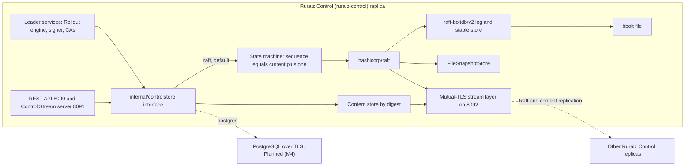
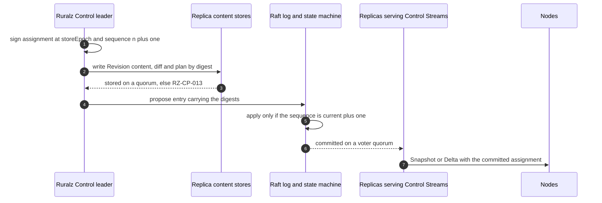

# ADR-0006: Control Store: embedded hashicorp/raft with raft-boltdb/v2 on bbolt, Postgres optional

## Context and problem statement

Ruralz Control (`ruralz-control`) keeps its operational state in the Control Store: Raft-replicated metadata plus digest-addressed Revision content and audit segments on Ruralz Control replicas, all covered by `ruralz control backup` (foundation pack section 2). [Control plane and GitOps](../architecture/04-control-plane-and-gitops.md#control-store-and-high-availability) puts records, sequences, revocations and encrypted keys in the replicated log, and Revision content, diffs, plans and sealed audit segments in a content store.

The store must elect one leader for the Rollout engine, signer and CAs, and apply writes in one order: fencing rests on the state machine rejecting any assignment or promotion whose sequence is not the current value plus one ([Fencing stale replicas](../architecture/04-control-plane-and-gitops.md#fencing-stale-replicas)). It must survive one or two replica failures and back up consistently at one index. Which consensus and storage stack does this inside one `CGO_ENABLED=0` binary ([ADR-0001](0001-implementation-language-go.md)), without an external service, under licenses an Apache-2.0 distribution can carry ([ADR-0002](0002-apache-2-license-no-feature-gating.md))? Nothing is implemented yet: the `raft` Control Store is Planned (M2) and `postgres` is Planned (M4).

## Decision drivers

- **Off the request path**: no request waits on Ruralz Control or the Control Store (P3), and Nodes keep serving their active Revision through quorum loss (P9) ([Vision](../vision/01-vision-and-positioning.md#principles)).
- **Self-contained install**: three `ruralz-control` replicas need no other service, even air-gapped.
- **Ordered, fenced writes**: one leader, sequences checked at apply time, only committed entries delivered.
- **Gates G1 to G3 and S1** ([Selection criteria](../engineering/01-tech-stack-and-libraries.md#selection-criteria)): pure Go, a G2 license or named MPL-2.0 exception, `crypto/tls` for peers, and a release in the last 12 months.
- **Operator choice**: a `postgres` option in the same build (P1).

## Considered options

1. Embedded `hashicorp/raft` v1.8.0 with `raft-boltdb/v2` v2.4.2 on `go.etcd.io/bbolt`, `raft.NetworkTransport` over mutual TLS on 8092, and `postgres` optional behind an interface ([source](https://github.com/hashicorp/raft/releases/tag/v1.8.0)) ([source](https://github.com/hashicorp/raft-boltdb/releases/tag/v2.4.2)).
2. `go.etcd.io/raft/v3` v3.7.0 with a Ruralz-written transport, log store and snapshot store ([source](https://github.com/etcd-io/raft/blob/main/README.md)).
3. `lni/dragonboat` v3.3.8 with its built-in transport and Pebble storage ([source](https://github.com/lni/dragonboat/blob/master/README.md)).
4. PostgreSQL only, as a required external service; the one researched driver candidate is MIT-licensed ([source](https://github.com/jackc/pgx/blob/master/LICENSE)).

## Decision outcome

Chosen option: "embedded `hashicorp/raft` with `raft-boltdb/v2` on bbolt, `postgres` optional", because it is the only researched library that ships consensus, a pure-Go log store, a network transport and a file snapshot store together ([source](https://github.com/hashicorp/raft/blob/main/README.md)) ([source](https://github.com/hashicorp/raft/tree/main)), it released in September 2026, and it costs four named MPL-2.0 exceptions instead of Ruralz-written consensus plumbing. This matches the foundation pack section 7 Control Store row and the [library catalog](../engineering/01-tech-stack-and-libraries.md#library-catalog). Rules:

| Element | Rule | Planned |
|---|---|---|
| Interface | `ruralz-control` reaches storage only through `internal/controlstore`; `raft` is the default and `postgres` the optional implementation, with no feature difference (P1). Ruralz Control's process configuration selects one; no kind or field carries it | Planned (M2); `postgres` Planned (M4) |
| Consensus | `hashicorp/raft` v1.8.0 or newer, confined to `internal/controlstore/raft`. The state machine applies an assignment or promotion only at the current sequence plus one; replicas serve Nodes only committed entries | Planned (M2) |
| Log and stable store | `raft-boltdb/v2` v2.4.2 or newer, since v2.4.0 and v2.4.1 "should not be used" ([source](https://github.com/hashicorp/raft-boltdb/releases/tag/v2.4.2)), on `go.etcd.io/bbolt` v1.4.1 or newer, with `go-msgpack/v2` encoding | Planned (M2) |
| Snapshots | `FileSnapshotStore` holds state-machine snapshots; content objects stay outside them | Planned (M2) |
| Transport | `raft.NetworkTransport` over a Ruralz mutual-TLS stream layer on `crypto/tls`, never the built-in TCP layer, on 8092 ([Control Store transport](../engineering/01-tech-stack-and-libraries.md#control-store-transport)); Ruralz Control peer certificates only, Node certificates rejected (TB-11) | Planned (M2) |
| Content store | Objects stored by digest reach a replica quorum before the Raft entry referencing them, else `RZ-CP-013`; followers fetch missing, self-verifying objects from peers; entries stay under 1 MiB (target) | Planned (M2) |
| Membership | Three voters, or five to survive two failures (target); voters SHOULD share one Region; `ruralz control join` adds a voter over 8092 | Planned (M2) |
| Telemetry | Raft's `go-hclog` output is adapted to `log/slog` ([ADR-0010](0010-telemetry-opentelemetry-first.md)) | Planned (M2) |
| Backup | `ruralz control backup` writes a Raft snapshot plus referenced content, consistent at one index, encrypted and signed; `ruralz control restore` fills an empty deployment and opens a higher `storeEpoch` | Planned (M2) |
| `postgres` | Everything in PostgreSQL over TLS; leadership is a fenced lease row renewed every 2 s and expiring after 10 s (target); sequence checks run in a transaction; 8092 is unused; switching implementations opens a new `storeEpoch` | Planned (M4) |
| Licenses | `hashicorp/raft`, `raft-boltdb/v2`, `go-immutable-radix` and `golang-lru` are the MPL-2.0 exceptions: used unmodified, notices kept, patches to their files published under MPL-2.0. bbolt, `go-msgpack/v2`, `go-hclog`, `go-metrics` and `boltdb/bolt` are MIT | Planned (M0) license gate |

*Figure 1: storage layers inside one Ruralz Control replica; dashed edges are optional or leave the process.*

*Figure 2: one fenced write, from content quorum to committed assignment.*

### Consequences

- Good, because high availability is three copies of one static binary, with no external service.
- Good, because v1.8.0 persists the commit index in the LogStore to speed recovery and needs no build tags ([source](https://github.com/hashicorp/raft/releases/tag/v1.8.0)).
- Good, because the apply-time sequence check fences a deposed leader: its stale-sequence entry never commits, so no replica delivers it.
- Good, because with the default 1000 ms heartbeat and election timeouts, failover takes about 1 to 2 s plus election round trips (hypothesis) ([source](https://raw.githubusercontent.com/hashicorp/raft/main/config.go)), which Nodes do not notice (P9).
- Bad, because four MPL-2.0 modules bring file-level obligations; a linked license outside G2 and the [license rules](../engineering/01-tech-stack-and-libraries.md#license-rules) table reopens this ADR.
- Bad, because `raft-boltdb/v2` links the archived `boltdb/bolt` v1.3.1 for `MigrateToV2`, last pushed 2018-03-02 ([source](https://github.com/boltdb/bolt)), which fails S1 and sits on the [watch list](../engineering/01-tech-stack-and-libraries.md#watch-list) with a fork as fallback.
- Bad, because hashicorp/raft was less active than etcd raft at the snapshot: 8 against 23 commits in 90 days ([source](https://github.com/hashicorp/raft)) ([source](https://github.com/etcd-io/raft)).
- Bad, because quorum loss stops writes, logins and Enrollment with `RZ-CP-004`, though Nodes keep serving ([System overview](../architecture/01-system-overview.md#trust-boundaries), TB-11).
- Bad, because voters across Regions slow every commit, as etcd advises election timeouts of at least ten round trips ([source](https://etcd.io/docs/v3.6/tuning/)); a regional Ruralz Control is therefore a read-only relay, Planned (M4) ([Relay feed](../architecture/04-control-plane-and-gitops.md#relay-feed)).
- Bad, because the 1 MiB entry limit (target) forces a second replication path, the content store.
- Bad, because two implementations must keep identical fencing, backup and upgrade semantics, including the Control Store version and finalize step of [Ruralz Control upgrades](../engineering/04-release-versioning-and-compatibility.md#ruralz-control-upgrades).

### Confirmation

- **License gate (G2)**, stage 6 of `pr-fast`, Planned (M0): reads `go list -deps -test=false` per binary and fails on any MPL-2.0 module outside the exception table, so `go-cleanhttp` or `go-retryablehttp` entering through a go-metrics sink fails it ([CI stages](../engineering/02-repository-layout-and-conventions.md#ci-stages)).
- **Raft denylist**, same stage: `go list -deps ./cmd/ruralzd` never contains Raft (P2). **depguard** keeps `hashicorp/raft` inside `internal/controlstore/raft` ([Banned imports](../engineering/02-repository-layout-and-conventions.md#banned-imports)).
- **Version floor**: an explicit `require` holds `raft-boltdb/v2` at v2.4.2 or newer, and `govulncheck` runs on every pull request ([Version floors from advisories](../engineering/01-tech-stack-and-libraries.md#version-floors-from-advisories)).
- **Container-free integration tests**, Planned (M2): three replicas over loopback mutual TLS, including backup then restore ([Integration tests](../engineering/03-testing-and-quality-strategy.md#integration-tests)); a Node certificate presented on 8092 MUST be refused.
- **Chaos tests**, Planned (M2): quorum loss and leader failover cause zero outage-caused errors (target) ([Chaos testing](../engineering/03-testing-and-quality-strategy.md#chaos-testing)).
- **Fencing test**, Planned (M2): a deposed leader's proposal at a stale sequence never commits, under `raft` and, from Planned (M4), `postgres`.
- **Review checklist item**: a pull request adding a consensus or storage library, or changing `internal/controlstore`, MUST amend this ADR.

## Pros and cons of the options

### hashicorp/raft with raft-boltdb/v2 on bbolt

- Good, because `raft-boltdb` is pure Go, unlike the cgo `raft-mdb` ([source](https://github.com/hashicorp/raft/blob/main/README.md)), and `raft-boltdb/v2` declares `go 1.26.0`, the project floor ([source](https://github.com/hashicorp/raft-boltdb/blob/master/v2/go.mod)).
- Good, because bbolt and go-msgpack/v2 are MIT ([source](https://github.com/etcd-io/bbolt/blob/v1.4.1/LICENSE)) ([source](https://github.com/hashicorp/go-msgpack/blob/v2.1.5/LICENSE)).
- Bad, because raft is MPL-2.0 ([source](https://github.com/hashicorp/raft/blob/v1.8.0/LICENSE)), and go-metrics pulls in the MPL-2.0 go-immutable-radix, which pulls in golang-lru ([source](https://github.com/hashicorp/go-metrics/blob/v0.7.0/metrics.go)) ([source](https://github.com/hashicorp/go-immutable-radix/blob/v1.3.1/iradix.go)).

### etcd raft

- Good, because it is Apache-2.0 and more active, and v3.7.0 improved the ReadIndex flow ([source](https://github.com/etcd-io/raft/blob/main/CHANGELOG/CHANGELOG-3.7.md)).
- Bad, because "Users must implement their own transportation layer" and storage ([source](https://github.com/etcd-io/raft/blob/main/README.md)), so Ruralz would own the crash-safety-critical log store, snapshots and transport.

### dragonboat

- Good, because it is Apache-2.0 with built-in transport, snapshotting and log compaction, and claims 1.25 million writes/s on one Raft group ([source](https://github.com/lni/dragonboat/blob/master/README.md)).
- Bad, because its last release is v3.3.8 of 2023-09-25 ([source](https://github.com/lni/dragonboat/releases)) and master "is our unstable branch for development" toward v4.0 ([source](https://github.com/lni/dragonboat/blob/master/README.md)), so it fails S1.

### PostgreSQL only

- Good, because it needs no MPL-2.0 exception, and a transaction gives the sequence check directly.
- Bad, because every install, single-host and air-gapped ones included, would run and back up PostgreSQL before Ruralz Control starts.
- Bad, because a lease expiring after 10 s (target) fails over more slowly than Raft's default timing (hypothesis) ([source](https://raw.githubusercontent.com/hashicorp/raft/main/config.go)), and the driver is unselected (OQ-tech-stack-and-libraries-20).

## More information

- Owning document: [Control plane and GitOps](../architecture/04-control-plane-and-gitops.md#control-store-and-high-availability), with [Sizing and failover](../architecture/04-control-plane-and-gitops.md#sizing-and-failover); decision row in [foundation pack section 7](../_meta/foundation-pack.md#7-technology-decisions-fixed-details-in-docsengineering01-tech-stack-and-librariesmd-and-adrs).
- Related decisions: [ADR-0001](0001-implementation-language-go.md) (static builds), [ADR-0002](0002-apache-2-license-no-feature-gating.md) (license), [ADR-0007](0007-control-stream-protocol.md) (Control Stream on 8091) and [ADR-0017](0017-artifact-signing.md) (Revision signing by the leader).
- Open questions this decision leans on: OQ-control-plane-and-gitops-22 (status forwarding and content placement under `postgres`), OQ-tech-stack-and-libraries-20 (driver), OQ-control-plane-and-gitops-8 (key custody) and OQ-control-plane-and-gitops-15 (8092 classes in pack section 8.4).
- Revisit when hashicorp/raft stalls or an advisory names `boltdb/bolt` v1.3.1.
- Proposed amendments: Control plane and GitOps SHOULD add the Control Store selection to OQ-control-plane-and-gitops-1, state how long objects of a never-committed proposal are kept, and state how an 8092 connection names its class, such as by ALPN. Testing and quality strategy SHOULD add the fencing test.
