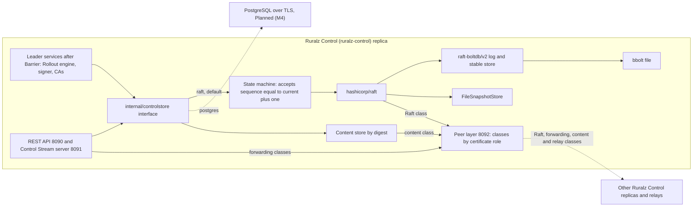
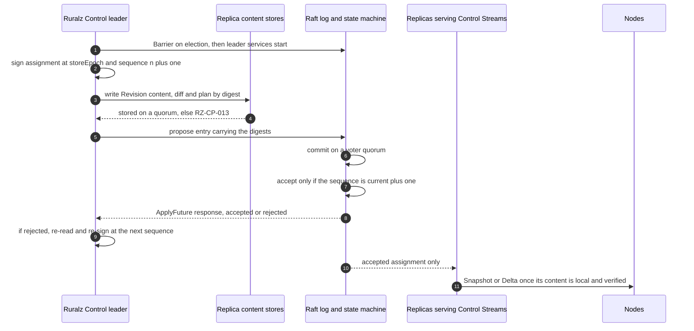

# ADR-0006: Control Store: embedded hashicorp/raft with raft-boltdb/v2 on bbolt, Postgres optional

## Context and problem statement

The Control Store holds Ruralz Control's state: Raft-replicated metadata plus digest-addressed Revision content and audit segments on its replicas, all covered by `ruralz control backup` (foundation pack section 2).

The store must elect one leader for the Rollout engine, signer and CAs, apply writes in one order so that [fencing](../architecture/04-control-plane-and-gitops.md#fencing-stale-replicas) holds, survive one or two replica failures and back up consistently at one index. Which consensus and storage stack does this inside one `CGO_ENABLED=0` binary ([ADR-0001](0001-implementation-language-go.md)), without an external service, under Apache-2.0-compatible licenses ([ADR-0002](0002-apache-2-license-no-feature-gating.md))?

## Decision drivers

- **Off the request path**: no request waits on the Control Store (P3), and Nodes serve through quorum loss (P9) ([Vision](../vision/01-vision-and-positioning.md#principles)).
- **Self-contained install**: three `ruralz-control` replicas need no other service, even air-gapped; `postgres` stays an option in the same build (P1).
- **Ordered, fenced writes**: one leader, sequences checked at apply time, only accepted entries delivered.
- **Gates G1 to G3 and S1** ([Selection criteria](../engineering/01-tech-stack-and-libraries.md#selection-criteria)): pure Go, G2 licenses or named MPL-2.0 exceptions, `crypto/tls` peers, a release within 12 months.

## Considered options

1. **Embedded hashicorp/raft with raft-boltdb/v2**: v1.8.0 and v2.4.2 on `go.etcd.io/bbolt`, peers on 8092, and `postgres` optional behind an interface ([source](https://github.com/hashicorp/raft/releases/tag/v1.8.0)) ([source](https://github.com/hashicorp/raft-boltdb/releases/tag/v2.4.2)).
2. **etcd raft**: `go.etcd.io/raft/v3` v3.7.0 with a Ruralz-written transport, log store and snapshot store ([source](https://github.com/etcd-io/raft/blob/main/README.md)).
3. **dragonboat**: `lni/dragonboat` v3.3.8 with its built-in transport and Pebble storage ([source](https://github.com/lni/dragonboat/blob/master/README.md)).
4. **PostgreSQL only**, a required external service; its researched driver candidate is MIT-licensed and unselected (OQ-tech-stack-and-libraries-20) ([source](https://github.com/jackc/pgx/blob/master/LICENSE)).

## Decision outcome

Chosen option: "Embedded hashicorp/raft with raft-boltdb/v2", because, of the researched libraries with a release in the last 12 months (S1), it is the only one that ships consensus, a pure-Go log store, a network transport and a file snapshot store together ([source](https://github.com/hashicorp/raft/blob/main/README.md)) ([source](https://github.com/hashicorp/raft/tree/main)); it released v1.8.0 on 2026-09-16; and it costs four named MPL-2.0 exceptions, not Ruralz-written consensus plumbing. It matches pack section 7 and the [library catalog](../engineering/01-tech-stack-and-libraries.md#library-catalog). Rules:

| Element | Rule | Planned |
|---|---|---|
| Interface | Storage goes only through `internal/controlstore`: `raft` by default, `postgres` optional, with no feature difference (P1), chosen by process configuration (proposed, OQ-control-plane-and-gitops-1), never a kind or field | Planned (M2); `postgres` Planned (M4) |
| Consensus | `hashicorp/raft` v1.8.0 or newer, only in `internal/controlstore/raft`. The state machine accepts an assignment or promotion only at the current sequence plus one; replicas serve Nodes only what it accepted, never a committed entry it rejected. Leader services start after `raft.Barrier()` on election; a proposal `ApplyFuture.Response()` rejects is re-read and re-signed at the next sequence | Planned (M2) |
| Log and stable store | `raft-boltdb/v2` v2.4.2 or newer, since v2.4.0 and v2.4.1 "should not be used" ([source](https://github.com/hashicorp/raft-boltdb/releases/tag/v2.4.2)), on `go.etcd.io/bbolt` v1.4.1 or newer, with `go-msgpack/v2` encoding | Planned (M2) |
| Snapshots | `FileSnapshotStore` holds state-machine snapshots, never content objects; deleting an unreferenced Revision is a Raft entry, so a backup at one index never misses content | Planned (M2) |
| Transport | A Ruralz mutual-TLS stream layer on `crypto/tls`, never the built-in TCP layer ([Control Store transport](../engineering/01-tech-stack-and-libraries.md#control-store-transport)), owns 8092 and names each connection's class, proposed by ALPN. Only Raft-class connections from voter peer certificates reach `raft.NetworkTransport` via its `Accept`; forwarding, content, relay feed and token `Join` follow [Replica roles](../architecture/04-control-plane-and-gitops.md#replica-roles) (OQ-control-plane-and-gitops-15). Only `Join` takes a token without a client certificate (`VerifyClientCertIfGiven`); Node certificates are always rejected (TB-11) | Planned (M2); relay classes Planned (M4) |
| Content store | Objects stored by digest reach a replica quorum before the Raft entry referencing them, else `RZ-CP-013`. Followers fetch missing, self-verifying objects from peers and serve an assignment only once its content is local, also after `InstallSnapshot` or a join. Content yields to Raft within the 64 MiB/s per-peer cap (target); entries stay under 1 MiB (target) | Planned (M2) |
| Membership | Three voters, or five to survive two failures (target); one voter, tolerating none, only for single-host and development installs; voters SHOULD share one Region. `ruralz control join` redeems a one-time `admin` token in `Join`; the leader signs the peer certificate and adds a voter | Planned (M2) |
| Telemetry | `go-hclog` logs go to `log/slog` ([ADR-0010](0010-telemetry-opentelemetry-first.md)); a Ruralz go-metrics `MetricSink` forwards Raft metrics to OpenTelemetry for `/metrics` on 9902, so quorum loss and leader churn raise degraded-state metrics (P10); go-metrics' Prometheus and Circonus sinks are never imported (OQ-tech-stack-and-libraries-16) | Planned (M2) |
| Backup | `ruralz control backup` writes a Raft snapshot plus referenced content at one index, encrypted and signed; `ruralz control restore` fills an empty deployment at a higher `storeEpoch` | Planned (M2) |
| `postgres` | Metadata in PostgreSQL over TLS; content placement and status forwarding stay OQ-control-plane-and-gitops-22 (proposed: PostgreSQL tables, amending pack section 2), and 8092 stays unused (pack section 8.4) unless it picks option (b). A fenced lease row renewed every 2 s and expiring after 10 s (target) elects the leader; sequence checks run in a transaction; switching implementations opens a new `storeEpoch` | Planned (M4) |
| Licenses | `hashicorp/raft`, `raft-boltdb/v2`, `go-immutable-radix` and `golang-lru` are the MPL-2.0 exceptions: unmodified, notices kept, patches to their files published under MPL-2.0 | Planned (M0) license gate |

*Figure 1: one replica's storage layers; dashed edges are optional or external.*

*Figure 2: one fenced write, from content quorum to acceptance.*

### Consequences

- Good, because v1.8.0 persists the commit index for faster recovery ([source](https://github.com/hashicorp/raft/releases/tag/v1.8.0)) if `raft-boltdb/v2` implements raft's commit-tracking interface (unconfirmed).
- Good, because the apply-time sequence check fences a deposed leader: of two signed entries at one sequence only the first in log order is accepted, and no replica delivers the other.
- Good, because high availability is three copies of one static binary, and with the default 1000 ms timeouts failover takes about 1 to 2 s plus election round trips (hypothesis) ([source](https://raw.githubusercontent.com/hashicorp/raft/main/config.go)).
- Bad, because four MPL-2.0 modules bring file-level obligations ([license rules](../engineering/01-tech-stack-and-libraries.md#license-rules)).
- Bad, because `raft-boltdb/v2` links the archived `boltdb/bolt` v1.3.1 for `MigrateToV2` ([source](https://github.com/boltdb/bolt)), failing S1; it is on the [watch list](../engineering/01-tech-stack-and-libraries.md#watch-list) with a fork as fallback.
- Bad, because bbolt never shrinks its file after log truncation; only rejoining with an empty store reclaims space.
- Bad, because quorum loss stops writes, logins and Enrollment included, with `RZ-CP-004`, though Nodes keep serving ([System overview](../architecture/01-system-overview.md#trust-boundaries), TB-11; [Sizing and failover](../architecture/04-control-plane-and-gitops.md#sizing-and-failover)).
- Bad, because cross-Region voters slow every commit, since etcd advises election timeouts of ten or more round trips ([source](https://etcd.io/docs/v3.6/tuning/)); regional Ruralz Control is a read-only relay, Planned (M4) ([Relay feed](../architecture/04-control-plane-and-gitops.md#relay-feed)).
- Bad, because the 1 MiB entry limit (target) forces a second replication path, the content store.
- Bad, because both implementations must keep identical fencing, backup and upgrade semantics ([Ruralz Control upgrades](../engineering/04-release-versioning-and-compatibility.md#ruralz-control-upgrades)).

### Confirmation

- **License gate (G2)**, stage 6 of `pr-fast`, Planned (M0): fails on any MPL-2.0 module outside the exception table in each binary's `go list -deps -test=false` ([CI stages](../engineering/02-repository-layout-and-conventions.md#ci-stages)).
- **Raft denylist**, same stage: `go list -deps ./cmd/ruralzd` never contains Raft (P2). **depguard** keeps `hashicorp/raft` inside `internal/controlstore/raft` ([Banned imports](../engineering/02-repository-layout-and-conventions.md#banned-imports)).
- **Version floor**: a `require` holds `raft-boltdb/v2` at v2.4.2 or newer; `govulncheck` runs per pull request ([Version floors from advisories](../engineering/01-tech-stack-and-libraries.md#version-floors-from-advisories)).
- **Container-free integration tests**, Planned (M2): three replicas over loopback mutual TLS, with backup then restore and a persisted commit index ([Integration tests](../engineering/03-testing-and-quality-strategy.md#integration-tests)); 8092 MUST refuse Node certificates and certificate-less connections outside `Join`.
- **Chaos tests**, Planned (M2): quorum loss and leader failover cause zero outage-caused errors (target) ([Chaos testing](../engineering/03-testing-and-quality-strategy.md#chaos-testing)).
- **Fencing test**, Planned (M2): a deposed leader's entry at a taken sequence commits but is never accepted or delivered, and a new leader proposes only after Barrier; under `postgres`, Planned (M4), the transaction rejects it.
- **Review checklist item**: a pull request adding a consensus or storage library, or changing `internal/controlstore`, MUST amend this ADR.

## Pros and cons of the options

### Embedded hashicorp/raft with raft-boltdb/v2

- Good, because `raft-boltdb` is pure Go, unlike the cgo `raft-mdb` ([source](https://github.com/hashicorp/raft/blob/main/README.md)), and `raft-boltdb/v2` declares `go 1.26.0`, the project floor ([source](https://github.com/hashicorp/raft-boltdb/blob/master/v2/go.mod)).
- Good, because bbolt, go-msgpack/v2, go-hclog, go-metrics and boltdb/bolt are MIT ([source](https://github.com/etcd-io/bbolt/blob/v1.4.1/LICENSE)) ([source](https://github.com/hashicorp/go-msgpack/blob/v2.1.5/LICENSE)) ([source](https://github.com/hashicorp/go-hclog/blob/v1.6.3/LICENSE)) ([source](https://github.com/hashicorp/go-metrics/blob/v0.7.0/LICENSE)) ([source](https://github.com/boltdb/bolt/blob/v1.3.1/LICENSE)).
- Bad, because raft is MPL-2.0 ([source](https://github.com/hashicorp/raft/blob/v1.8.0/LICENSE)), and go-metrics pulls in the MPL-2.0 go-immutable-radix, which pulls in golang-lru ([source](https://github.com/hashicorp/go-metrics/blob/v0.7.0/metrics.go)) ([source](https://github.com/hashicorp/go-immutable-radix/blob/v1.3.1/iradix.go)).

### etcd raft

- Good, because it is Apache-2.0 and more active, and v3.7.0 improved the ReadIndex flow ([source](https://github.com/etcd-io/raft/blob/main/CHANGELOG/CHANGELOG-3.7.md)).
- Bad, because "Users must implement their own transportation layer" and storage ([source](https://github.com/etcd-io/raft/blob/main/README.md)), so Ruralz would own crash-safety-critical storage and transport.

### dragonboat

- Good, because it is Apache-2.0 with built-in transport, snapshotting and log compaction ([source](https://github.com/lni/dragonboat/blob/master/README.md)).
- Bad, because its last release is v3.3.8 of 2023-09-25 ([source](https://github.com/lni/dragonboat/releases)) and master "is our unstable branch for development" toward v4.0 ([source](https://github.com/lni/dragonboat/blob/master/README.md)), so it fails S1.

### PostgreSQL only

- Good, because it needs no MPL-2.0 exception, and a transaction gives the sequence check directly.
- Bad, because every install, single-host and air-gapped included, must run and back up PostgreSQL first.
- Bad, because a lease expiring after 10 s (target) fails over more slowly than Raft's default timing (hypothesis) ([source](https://raw.githubusercontent.com/hashicorp/raft/main/config.go)).

## More information

- Owning document: [Control plane and GitOps](../architecture/04-control-plane-and-gitops.md#control-store-and-high-availability); [foundation pack section 7](../_meta/foundation-pack.md#7-technology-decisions-fixed-details-in-docsengineering01-tech-stack-and-librariesmd-and-adrs) row.
- Related: [ADR-0007](0007-control-stream-protocol.md) (Control Stream) and [ADR-0017](0017-artifact-signing.md) (Revision signing).
- Open questions: OQ-control-plane-and-gitops-8 (key custody) and those above.
- Revisit when hashicorp/raft, at 8 commits in 90 days against etcd raft's 23 ([source](https://github.com/hashicorp/raft)) ([source](https://github.com/etcd-io/raft)), stalls, an advisory names `boltdb/bolt` v1.3.1, or a linked license leaves G2.
- Proposed amendments: Control plane and GitOps SHOULD add the Control Store selection to OQ-control-plane-and-gitops-1, bound how long a never-accepted proposal's objects are kept, and reword "cannot commit" in Fencing stale replicas as "cannot have a stale-sequence entry accepted"; Testing and quality strategy SHOULD add the fencing test.
