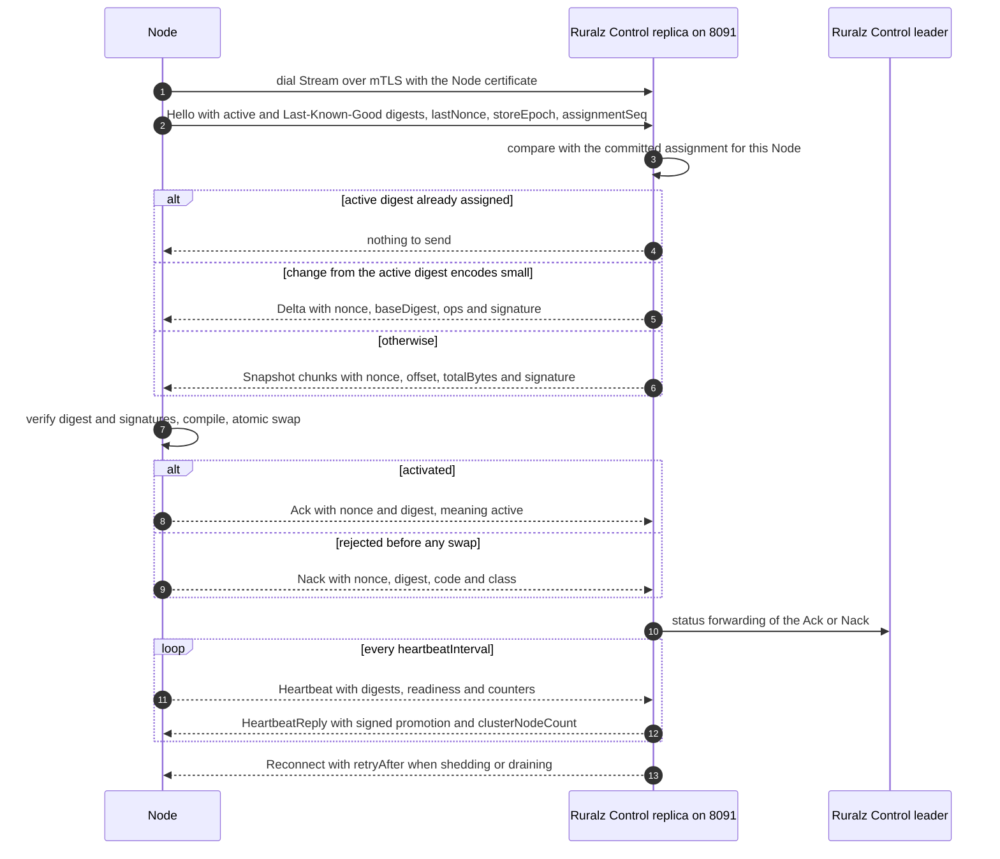
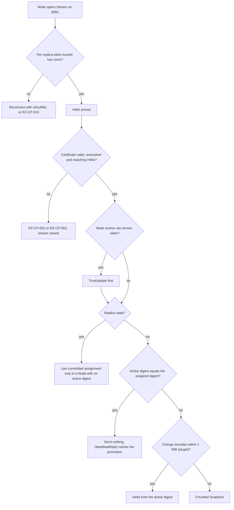

# ADR-0007: Control Stream: own gRPC snapshot and delta protocol with xDS-style ACK/NACK

## Context and problem statement

In Control mode every Node gets its configuration over one channel, the Control Stream: snapshots, deltas and the promoted digest flow down; ACK or NACK and heartbeats flow up (foundation pack [section 8.4](../_meta/foundation-pack.md#84-control-stream-ports-and-http3)). [Control plane and GitOps](../architecture/04-control-plane-and-gitops.md#control-stream) owns the messages; this ADR decides the protocol family and RPC library.

The unit of delivery is a whole Revision: one full `sha256:<64 hex>` digest is what Ruralz Control signs, a Node verifies and swaps atomically, the ACK reports, Last-Known-Good persists and Drift detection compares ([Canonical form and Revision](../architecture/02-configuration-model.md#canonical-form-and-revision)). Rollouts need per-Node ACK/NACK tied to one delivery, NACK classes, and reconnects that present the active digest, so a Node receives only its planned Revision (pack sections 8.2 and 8.3).

Nodes dial 8091, so they work behind NAT, and keep serving when the stream is gone (P9, [Vision](../vision/01-vision-and-positioning.md#principles)). Which protocol and library carry this in `CGO_ENABLED=0` binaries ([ADR-0001](0001-implementation-language-go.md)) on `net/http` ([ADR-0009](0009-http-stack-net-http-quic-go.md))? Nothing is implemented yet: the Control Stream is Planned (M2); a regional relay serving it is Planned (M4).

## Decision drivers

- **Whole-Revision atomicity**: one digest per delivery, verified and swapped at once.
- **Rollout semantics**: ACK means active, not durable; NACK carries digest, code and class; stale replies are recognizable.
- **Node dials, fail static**: no inbound connection to a Node; stream loss never fails `/readyz` (pack section 8.5).
- **Bounded fan-out**: 10,000 Nodes per deployment (target), shed reconnect storms, paced Snapshots.
- **One RPC library, pure Go**: gates G1 to G3 of the [selection criteria](../engineering/01-tech-stack-and-libraries.md#selection-criteria).
- **Evolvable contract**: `ruralz.control.v1` is a stable surface ([Control Stream versioning](../engineering/04-release-versioning-and-compatibility.md#control-stream-versioning)).

## Considered options

1. **Own `ruralz.control.v1.ControlStream` on connect in gRPC mode at both ends**: unary `Enroll` plus one bidirectional `Stream` per Node carrying Snapshots and deltas of whole Revisions with nonce-based ACK/NACK. connect serves gRPC on `net/http` handlers ([source](https://github.com/connectrpc/connect-go/blob/main/README.md)); `buf breaking` checks protos ([source](https://github.com/bufbuild/buf)).
2. **xDS through go-control-plane**: Envoy's State-of-the-World or Incremental (Delta) discovery, ACK/NACK through echoed `version_info` and `response_nonce` ([source](https://www.envoyproxy.io/docs/envoy/latest/api-docs/xds_protocol)); Envoy Gateway's control plane translates Gateway API resources into Envoy Proxy configuration ([source](https://gateway.envoyproxy.io/docs/concepts/)).
3. **The same protocol on grpc-go at both ends**: its native HTTP/2 server ([source](https://github.com/grpc/grpc-go)) or `Server.ServeHTTP` ([source](https://github.com/grpc/grpc-go/blob/master/server.go)).
4. **Node polling**: Nodes long-poll the REST API for their assigned digest, like Consul blocking queries ([source](https://developer.hashicorp.com/consul/api-docs/features/blocking)), pull content by digest as file mode does with oras-go ([source](https://github.com/oras-project/oras-go)), and post ACK, NACK and heartbeats separately.

## Decision outcome

Chosen option: "own `ruralz.control.v1.ControlStream` on connect in gRPC mode at both ends", because only it delivers the signed whole Revision that the rest of the design names by one digest, it keeps one ordered, Node-dialed stream per Node for ACK/NACK, heartbeats and backpressure, and it adds no RPC library. This matches the foundation pack [section 7](../_meta/foundation-pack.md#7-technology-decisions-fixed-details-in-docsengineering01-tech-stack-and-librariesmd-and-adrs) Control Stream row (own snapshot plus delta protocol, xDS-style ACK/NACK, connect in gRPC mode on both ends, `buf breaking`, not xDS, not go-control-plane) and the [library catalog](../engineering/01-tech-stack-and-libraries.md#library-catalog). Rules:

| Element | Rule | Planned |
|---|---|---|
| Service | `ruralz.control.v1.ControlStream` with exactly two RPCs: unary `Enroll` (one-time token, server CA pinned) and bidirectional `Stream` (Node certificate over mTLS, the only source of `node.id`); Ruralz Control never dials a Node | Planned (M2) |
| Transport | `connectrpc.com/connect` v1.21.x, gRPC mode, HTTP/2 over TLS on 8091; no `ReadTimeout` or `WriteTimeout` on the stream; `HTTP2Config` pings detect dead peers | Planned (M2) |
| Delivery | A signed assignment names one Revision by full digest. `Snapshot` sends canonical content in chunks of at most 1 MiB (target); `Delta` (`baseDigest`, `ops`) is used when the change encodes within 1 MiB (target), and a result that mismatches the digest is `Nack` RZ-CFG-027 | Planned (M2) |
| ACK/NACK | Every configuration message carries a `nonce`; `Ack` means active, not durable; `Nack` keeps the active Revision and carries `code` and `class`; stale nonces are ignored; a deterministic `Nack` fails the gate once Ruralz Control reproduces it, else it counts as transient | Planned (M2) |
| Flow control | One unacknowledged configuration message per Node; a newer assignment replaces an unsent one; messages cap at 2 MiB (target) | Planned (M2) |
| Reconnect | `Hello` presents active and Last-Known-Good digests, `lastNonce`, `storeEpoch` and `assignmentSeq`; the answer is nothing, a `Delta` or a `Snapshot`; full-jitter redials, base 1 s, cap 60 s (target); excess streams get `Reconnect` or `RZ-CP-010` | Planned (M2) |
| Heartbeat | Every 15 s (target) up with digests, readiness and per-Rollout counters; `HeartbeatReply` down with the signed promotion and `clusterNodeCount` | Planned (M2) |
| Trust | mTLS authenticates the peer; content trust comes from signatures fenced by `storeEpoch` and sequences ([ADR-0017](0017-artifact-signing.md), [Fencing stale replicas](../architecture/04-control-plane-and-gitops.md#fencing-stale-replicas)) | Planned (M2); relay Planned (M4) |
| Evolution | Additive changes stay in `ruralz.control.v1`; a breaking change needs `ruralz.control.v2` on distinct gRPC paths, served beside v1 for about 12 months (target) | Planned (M2) |

*Figure 1: one Node's Control Stream from dial to steady state.*

*Figure 2: how a replica answers a Hello; every branch keeps the Node's active Revision until a verified swap.*

### Consequences

- Good, because one digest names the unit end to end, from signing to ACK, Last-Known-Good and Drift, with no per-resource versions to reconcile.
- Good, because an atomic swap needs no cross-resource ordering, whereas xDS orders CDS, EDS, LDS, then RDS to avoid blackholing traffic ([source](https://www.envoyproxy.io/docs/envoy/latest/api-docs/xds_protocol)).
- Good, because `ruralzd` already links connect for gRPC ingress and `ruralz-control` serves it on `net/http`, so no second RPC library or HTTP/2 server appears.
- Bad, because Ruralz owns the specification, both implementations and their tests; no xDS client can consume a Revision.
- Bad, because pacing is Ruralz code: at most 32 concurrent Snapshots and 256 MiB in flight per replica (target), and a 10,000-Node Cluster's largest batch takes up to 5 minutes (target).
- Bad, because long-lived streams rely on HTTP/2 pings and heartbeats for liveness, and a replica holds about 5,000 streams (hypothesis).
- Bad, because a proxy in front of 8091 MUST pass HTTP/2 and TLS through, since the Node certificate authenticates the stream.
- Bad, because the protobuf runtime is unselected (OQ-tech-stack-and-libraries-14, blocking Planned (M2)), and the `Delta` `ops` encoding is unspecified.

### Confirmation

- **`buf lint` and `buf breaking`**, stage 3 of `pr-fast`, Planned (M2): against `main` and the last tag of each supported line ([buf rules](../engineering/02-repository-layout-and-conventions.md#buf-rules)).
- **Dependency admission**: go-control-plane has no catalog row and is listed under [Alternatives not chosen](../engineering/01-tech-stack-and-libraries.md#alternatives-not-chosen), so the [banned imports](../engineering/02-repository-layout-and-conventions.md#banned-imports) rule rejects it.
- **Container-free integration tests**, Planned (M2): snapshot and delta delivery, ACK and NACK classification, promoted digests ([Integration tests](../engineering/03-testing-and-quality-strategy.md#integration-tests)), plus a stale-nonce `Ack` that changes nothing and a mismatching `Delta` NACKed with RZ-CFG-027.
- **Fuzzing and chaos**, Planned (M2): one fuzz target per message type ([Fuzzing](../engineering/03-testing-and-quality-strategy.md#fuzzing)); after leader failover each reconnecting Node gets only its planned Revision ([Chaos testing](../engineering/03-testing-and-quality-strategy.md#chaos-testing)).
- **Review checklist item**: a new message, field or RPC MUST update the owning document's message table; a grpc-go server in `ruralz-control` or a second channel to Nodes MUST supersede this ADR.

## Pros and cons of the options

### Own ControlStream on connect in gRPC mode

- Good, because connect is Apache-2.0 without CGO ([source](https://github.com/connectrpc/connect-go)), and its v1 module stays "stable and supported indefinitely" ([source](https://github.com/connectrpc/connect-go/blob/main/README.md)).
- Good, because `WithRequestGate` authenticates before decompression or unmarshalling ([source](https://github.com/connectrpc/connect-go/releases/tag/v1.21.0)), useful for token-only `Enroll`.
- Bad, because connect had 29 commits in 90 days against grpc-go's 112 ([source](https://github.com/connectrpc/connect-go)) ([source](https://github.com/grpc/grpc-go)).
- Bad, because nonces and deltas are re-implemented, not inherited.

### xDS through go-control-plane

- Good, because ACK/NACK with `error_detail` and Incremental updates are already specified ([source](https://www.envoyproxy.io/docs/envoy/latest/api-docs/xds_protocol)).
- Bad, because its unit is the typed Envoy resource, not a Revision under one digest, so signing, Last-Known-Good and Drift need a layer on top, and State-of-the-World resends every LDS and CDS resource ([source](https://www.envoyproxy.io/docs/envoy/latest/api-docs/xds_protocol)).
- Bad, because unchunked messages grow with resource count: Agent Router, built on Envoy Gateway ([source](https://theagentrouter.ai/blog/envoy-ai-gateway-is-now-agent-router/)), needed its gRPC max message size raised from 4 MB to 25 MB at 2,000 routes in a vendor-affiliated test ([source](https://tetrate.io/learn/ai/ai-gateway-benchmarks)).

### Own protocol on grpc-go at both ends

- Good, because grpc-go has a native HTTP/2 transport, more activity ([source](https://github.com/grpc/grpc-go)), and `ruralzd` links it for upstream clients.
- Bad, because `ruralz-control` would run a second HTTP/2 server on 8091, or `ServeHTTP`, which "does not support some gRPC features available through grpc-go's HTTP/2 server" ([source](https://github.com/grpc/grpc-go/blob/master/server.go)).

### Node polling

- Good, because requests are short-lived and stateless, and pulls reuse file mode's digest path ([source](https://github.com/oras-project/oras-go)).
- Bad, because a long poll returns on change or after its wait window, 5 minutes by default in Consul ([source](https://developer.hashicorp.com/consul/api-docs/features/blocking)), and no nonce ties an ACK to one delivery.
- Bad, because Ruralz Control cannot pace deliveries or send `Reconnect`, so canary timing follows poll intervals.

## More information

- Owning document: [Control plane and GitOps](../architecture/04-control-plane-and-gitops.md#control-stream), with [Heartbeat and backpressure](../architecture/04-control-plane-and-gitops.md#heartbeat-and-backpressure); Node side in [Compile before swap](../architecture/01-system-overview.md#compile-before-swap).
- Related decisions: [ADR-0003](0003-configuration-format.md) (canonical digest), [ADR-0006](0006-control-store-raft-boltdb.md) (committed assignments) and [ADR-0017](0017-artifact-signing.md) (signing).
- Open questions leaned on: OQ-tech-stack-and-libraries-14, OQ-release-versioning-and-compatibility-4 (`binaryVersion` in `Hello`), OQ-security-and-identity-31 (`Enroll` credential) and OQ-control-plane-and-gitops-25 (Snapshot limit).
- Proposed amendments: Control plane and GitOps SHOULD add an Open question on the `Delta` `ops` encoding over `ruralz.canonical.v1`; Repository layout and conventions SHOULD ban go-control-plane explicitly.
