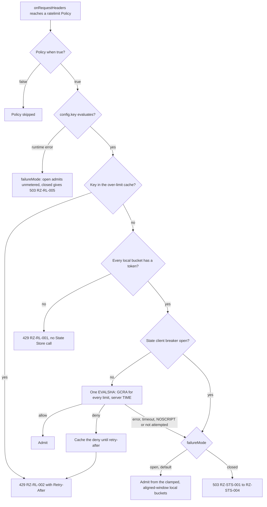

# ADR-0008: Rate limiting: local token bucket plus GCRA in the State Store, fail-open by default

## Context and problem statement

A Rate Limit is a `ratelimit` Policy (admission class, `onRequestHeaders`, default `failureMode: open`, pack section 10) whose `config.key` (CEL) partitions traffic; each `config.limits[]` entry allows `requests` per `window` ([Configuration model](../architecture/02-configuration-model.md#policy)). Every Node of a Cluster shares one State Store, so a limit holds per Cell (pack section 8.13).

Which algorithm enforces a Cell-wide limit when Nodes are disposable (P4), never wait on a peer (P3) and make at most one blocking State Store round trip per Policy (pack section 8.7), and what happens when the State Store fails? Stateful, State Store-backed rate limiting ships in every build, Planned (M1).

## Decision drivers

- **Cell-wide accuracy**: a key gets `requests` per `window` across all Nodes.
- **Bounded round trips**: at most one blocking call per Policy, none for a denial where possible.
- **No coordination**: per-Node state comes from the Policy or Ruralz Control's Node count, never peers, so a new Node needs only a ceiling.
- **Hot-key protection**: one busy key must not starve its State Store shard's co-tenants.
- **Degrade by declaration**: a failing State Store costs at most one deadline, then bounded, documented behavior (P9); Rate Limits, not a security control, may fail open.

## Considered options

1. **Local bucket plus GCRA, fail-open**: a token bucket at a per-Node ceiling, then GCRA in one State Store Lua script.
2. **Shared limiter only**: GCRA or a token bucket in the State Store on every request, as in Stripe ([source](https://stripe.com/blog/rate-limiters)) and redis_rate ([source](https://github.com/go-redis/redis_rate)).
3. **Local limits only**: each Node enforces either a share of the limit or the whole limit.
4. **Shared window counters**: fixed windows or a sliding window counter ([source](https://blog.cloudflare.com/counting-things-a-lot-of-different-things/)).
5. **Leases or asynchronous sync**: Doorman leases ([source](https://github.com/youtube/doorman)), quota assignments pushed by a quota service, or local counters synced to the store on an interval.
6. **Local bucket plus GCRA, fail-closed by default**, denying limited requests while the State Store fails.

## Decision outcome

Chosen option: "Local bucket plus GCRA, fail-open", because the local bucket answers most denials and shields shards from denied and pinned traffic without a round trip, GCRA keeps one timestamp per key and is exact within one store ([source](https://brandur.org/rate-limiting)), and fail-open, Stripe's default too ([source](https://stripe.com/blog/rate-limiters)), stays bounded by the local buckets. Rules, all Planned (M1):

| Aspect | Rule |
|---|---|
| Local bucket | One token bucket per key and `limits[]` entry at the per-Node ceiling; an empty bucket gives 429 `RZ-RL-001`, no State Store call |
| Local state | Buckets and over-limit entries share [Data plane](../architecture/03-data-plane.md#goroutines)'s Node-wide, CLOCK-evicted table of 1,048,576 entries, about 64 MiB (target), surviving Hot Reload; an evicted bucket restarts full, at most one extra ceiling per eviction, and GCRA still bounds the Cell |
| Per-Node ceiling | Declared on the Policy (field: OQ-traffic-management-and-resilience-1), else the limit divided by the Node count Ruralz Control publishes; with neither (file mode, or a Control-mode Node without a count), the full limit |
| GCRA | Each locally admitted request runs one `EVALSHA` for all the Policy's limits, reading server `TIME`, updating TATs only if all allow; a deny is 429 `RZ-RL-002`; τ is one `window` |
| One round trip | Nodes `SCRIPT LOAD` on every primary at connect, reconnect and failover; `NOSCRIPT` applies `failureMode` and schedules a reload, never a second call (pack section 8.7 rule 1) |
| Over-limit cache | A key GCRA denied stays denied locally until its retry-after |
| Keys | `rz:rl:<policy>:<requests>/<window>:{<SHA-256 of the key value>}`, expiring once idle; the hash tag lets consumptive calls share one script (pack section 8.7 rule 3). The State Store MUST run `noeviction` |
| State Store failure | A failed, timed-out or unattempted call, or an open State client breaker, applies `failureMode`: `open` (default) admits from the local buckets, which then refill per epoch-aligned `window`, in 60 steps past 1 minute, without carry-over, clamped per [Per-Node ceiling](../architecture/09-traffic-management-and-resilience.md#per-node-ceiling) (derived ceilings unfloored; a Control-mode Node without a count at max(1, `requests` / 100)); `closed` returns 503 `RZ-STS-001` to `RZ-STS-004` |
| Fail-open bound | At most N × per-Node ceiling per key per window, N being serving Nodes (target), owned by [Scalability and distributed state](../architecture/11-scalability-and-distributed-state.md#consistency-and-accuracy-bounds) |
| `config.key` error | `failureMode`: `open` admits unmetered, `closed` returns 503 `RZ-RL-005` |
| `memory` driver | Limits multiply by the Node count; a Node warns when its Cluster reports several |
| Code | Ruralz scripts sent as raw `EVALSHA` through rueidis `Do`, never `Lua.Exec`, whose `EVAL` retry on `NOSCRIPT` is a second round trip; reloads are single-flight per shard ([source](https://github.com/redis/rueidis)) |

*Figure 1: one `ratelimit` Policy deciding a request.*

### Consequences

- Good, because a key reaches the State Store at most min(offered, 2 × N × ceiling) times per window (target), a bucket's capacity plus its refill, and local denials cost no round trip.
- Good, because GCRA stores one TAT per key and needs no drip worker ([source](https://brandur.org/rate-limiting)), and server `TIME` removes Node clock skew from decisions.
- Bad, because a pinned or unevenly spread key meets its per-Node ceilings before the Cell limit, as any per-Node share does under uneven balancing; OQ-traffic-management-and-resilience-16 proposes headroom over pack section 8.8's limit / N.
- Bad, because each admitted request runs a script, and per-shard script throughput is unmeasured (Valkey 8's 1.19 million per second are `SET`, not `EVAL`, [source](https://valkey.io/blog/unlock-one-million-rps-part2/)). At an assumed 100,000 calls per second per shard (hypothesis), a key spread over many Nodes and admitted above about 25,000 per second (hypothesis) runs GCRA on one shard per request and can open every Node's breaker for it, so co-tenants apply `failureMode` until OQ-traffic-management-and-resilience-1 adds `localOnly` mode.
- Bad, because a lagging or frozen Node count shifts derived ceilings and their fail-open bound (OQ-traffic-management-and-resilience-19), and file mode without a declared ceiling fails open at N × limit.
- Bad, because R Regions allow R × each limit, and Redis Active-Active would replicate a TAT last-write-wins ([source](https://redis.io/docs/latest/operate/rs/databases/active-active/develop/data-types/strings/)).
- Bad, because a State Store failover loses recent TATs, admitting extra requests for the replication lag, and flushes scripts: under `closed` each Node returns 503 `RZ-STS-002` until its reload.
- Bad, because τ of one window admits 2 × `requests` in one window, as does a changed limit's fresh key; a burst field waits on OQ-traffic-management-and-resilience-1.

### Confirmation

- **Integration tests**, Planned (M1): against Redis 8, Valkey, Dragonfly and clustered servers, the script's allow and deny sequences, τ, all-or-nothing updates and the `NOSCRIPT` path ([Integration tests](../engineering/03-testing-and-quality-strategy.md#integration-tests)); a hot key above the shard hypothesis opens the breaker and co-tenants apply `failureMode`.
- **Round-trip test**, Planned (M1): a counting State Store proxy asserts zero commands for local denials and over-limit cache hits, at most one blocking call per admitted request per Policy, and one shared script when consumptive keys share a hash slot (pack section 8.7 rules 1 and 3).
- **Chaos experiments** CE-3, CE-4 and CE-5, Planned (M1): a slow, black-holed or failed-over State Store keeps admission within the fail-open bounds (target) ([Chaos experiments](../architecture/11-scalability-and-distributed-state.md#chaos-experiments)); CE-12 and CE-15 verify OQ-scalability-and-distributed-state-11's proposed amendments.
- **Dependency admission**, Planned (M0): the Rate limiting row of the [Library catalog](../engineering/01-tech-stack-and-libraries.md#library-catalog) lists redis_rate and throttled as alternatives not chosen.
- **Review checklist item**: a change to per-request State Store calls, ceiling derivation or the default `failureMode` MUST amend this ADR and pack section 8.8.

## Pros and cons of the options

### Local bucket plus GCRA, fail-open

- Good, because local limiting in front of the shared store cuts the store's load, since most denials never leave the Node.
- Bad, because two limiters, a Node count and a Lua script path must all be correct.

### Shared limiter only

- Good, because every decision is exact within one store, with no ceiling to configure.
- Bad, because every request, denials included, pays a round trip, hot keys load one shard, and nothing limits while the State Store fails.

### Local limits only

- Good, because no request ever calls the State Store.
- Bad, because a per-Node share is unreliable at low limits when requests are not fairly balanced across Nodes, and a limit silently scales with Node count.

### Shared window counters

- Good, because one `INCR` per request is simple and Cloudflare measured 0.003% wrong decisions for sliding windows ([source](https://blog.cloudflare.com/counting-things-a-lot-of-different-things/)).
- Bad, because fixed windows allow a burst across a window boundary, and both still call the store on every request.

### Leases or asynchronous sync

- Good, because Nodes call the store once per lease or sync interval, not per request ([source](https://github.com/youtube/doorman)).
- Bad, because overage grows with Node count and sync interval, and leasing is OQ-system-overview-15.

### Local bucket plus GCRA, fail-closed by default

- Good, because no request escapes the Cell limit while the State Store fails.
- Bad, because a State Store incident becomes a Cell-wide outage of every limited Route; operators who need it set `failureMode: closed` per Policy.

## More information

- Owning document: [Traffic management and resilience](../architecture/09-traffic-management-and-resilience.md#rate-limiting), with [Per-Node ceiling](../architecture/09-traffic-management-and-resilience.md#per-node-ceiling) and the [Failure matrix](../architecture/09-traffic-management-and-resilience.md#failure-matrix).
- Related decisions: [ADR-0014](0014-ai-api-surface.md) (Token Budgets fail closed) and [ADR-0007](0007-control-stream-protocol.md) (Control Stream carrying the Node count).
- Pending pack section 8.8 amendments: OQ-traffic-management-and-resilience-1, -16, -19 and -20, OQ-scalability-and-distributed-state-11, and aligned-window fail-open refill for declared ceilings too.
- Corrections: the Library catalog's "`NOSCRIPT` fallback" means the `failureMode` path above, never an `EVAL` retry; Traffic management's and Scalability's N × ceiling call bound is 2 × N × ceiling.
- Revisit when OQ-system-overview-15 chooses leases or per-shard script throughput is measured.
