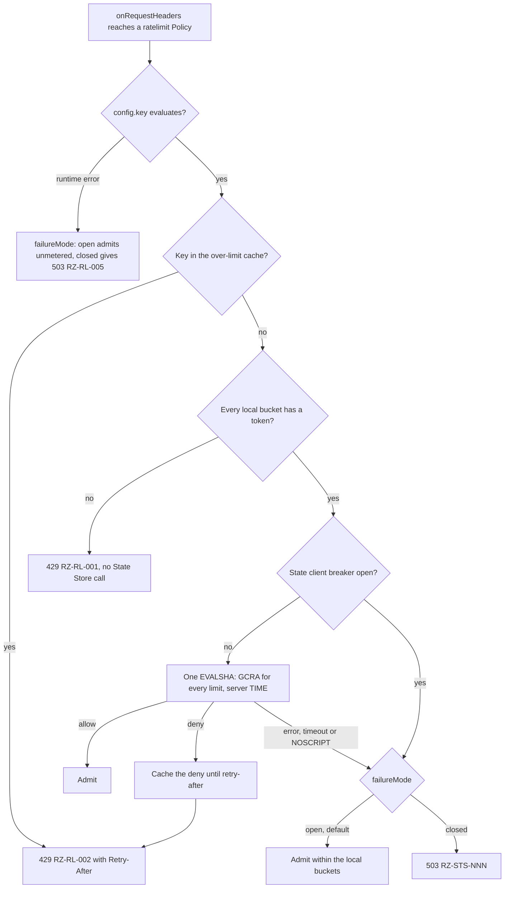

# ADR-0008: Rate limiting: local token bucket plus GCRA in the State Store, fail-open by default

## Context and problem statement

A Rate Limit is a `ratelimit` Policy: admission class, `onRequestHeaders`, Gateway or Route scope, registry default `failureMode: open`, Planned (M1) (foundation pack section 10). Its `config.key` (CEL) partitions traffic, and each `config.limits[]` entry allows `requests` per `window` ([Configuration model](../architecture/02-configuration-model.md#policy)). A limit holds per Cell: every Node of a Cluster shares one State Store (foundation pack section 8.13).

Nodes are disposable (P4), never wait on a peer (P3), and make at most one blocking State Store round trip per Policy before commit (pack section 8.7). Which algorithm enforces a Cell-wide limit under those rules, where does its state live, and what happens when the State Store fails? KrakenD sells stateful Redis-backed rate limiting only in EE ([source](https://www.krakend.io/features/)); Ruralz ships it free.

## Decision drivers

- **Cell-wide accuracy**: a key gets `requests` per `window` across all Nodes, not per Node.
- **Bounded round trips**: one blocking call per Policy at most (P3), and none for a denial where possible.
- **No coordination**: per-Node state comes from the Policy or a count Ruralz Control publishes, never from peers (P4).
- **Hot-key protection**: one busy key must not starve its shard's co-tenants.
- **Degrade by declaration**: a failing State Store costs at most one deadline, then a documented, bounded behavior (P9); Rate Limits are not a security control, so they may fail open.
- **Existing drivers only**: `memory`, and `redis` (Redis, Valkey, Dragonfly) through rueidis (foundation pack section 7).
- **Measured, not claimed**: every bound is a (target) or (hypothesis) that tests check (P10).

## Considered options

1. **Local bucket plus GCRA, fail-open**: a token bucket per Node at a per-Node ceiling, then GCRA in the State Store in one Lua script, the hybrid Envoy recommends ([source](https://www.envoyproxy.io/docs/envoy/latest/intro/arch_overview/other_features/global_rate_limiting)).
2. **Shared limiter only**: GCRA or a token bucket in the State Store on every request, as in Stripe ([source](https://stripe.com/blog/rate-limiters)) and redis_rate ([source](https://github.com/go-redis/redis_rate)).
3. **Local limits only**: each Node enforces a share of the limit, as Tyk's DRL ([source](https://tyk.io/docs/api-management/rate-limit/)) and Kong's default `policy: local` ([source](https://developer.konghq.com/plugins/rate-limiting/reference/)).
4. **Shared window counters**: fixed windows as in Kong and Tyk, or Cloudflare's sliding window counter ([source](https://blog.cloudflare.com/counting-things-a-lot-of-different-things/)).
5. **Leases or asynchronous sync**: Doorman leases ([source](https://github.com/youtube/doorman)), Envoy RLQS assignments ([source](https://www.envoyproxy.io/docs/envoy/latest/configuration/http/http_filters/rate_limit_quota_filter)), Kong `sync_rate` ([source](https://developer.konghq.com/plugins/rate-limiting-advanced/)).
6. **Option 1 failing closed by default**, like Envoy's `failure_mode_deny: true` ([source](https://www.envoyproxy.io/docs/envoy/latest/api-v3/extensions/filters/http/ratelimit/v3/rate_limit.proto)).

## Decision outcome

Chosen option: "Local bucket plus GCRA, fail-open", because the local bucket answers most denials and shields shards without a round trip, GCRA keeps one timestamp per key and is exact within one store ([source](https://brandur.org/rate-limiting)), and fail-open stays bounded by the local buckets. This matches the foundation pack section 7 Rate limiting row and section 8.8. [Traffic management and resilience](../architecture/09-traffic-management-and-resilience.md#decision-path) owns the full decision path. Rules, all Planned (M1):

| Aspect | Rule |
|---|---|
| Local bucket | One token bucket per key and `limits[]` entry at the per-Node ceiling; any empty bucket gives 429 `RZ-RL-001` with no State Store call |
| Per-Node ceiling | Declared on the Policy (field: OQ-traffic-management-and-resilience-1), else the limit divided by the Node count Ruralz Control publishes for the Cluster; never learned from peers; with neither, as in file mode, the full limit |
| GCRA | Each locally admitted request runs one script for all the Policy's limits: `EVALSHA`, the cached form of `EVAL`, reading server `TIME` and updating TATs only if every limit allows; a deny is 429 `RZ-RL-002`. τ is one `window` |
| One round trip | Nodes load scripts at connect, reconnect and failover; `NOSCRIPT` applies `failureMode` and schedules a reload, never a second call (pack section 8.7 rule 1) |
| Over-limit cache | A key GCRA denied stays denied locally until its retry-after, as in envoyproxy/ratelimit ([source](https://github.com/envoyproxy/ratelimit)) |
| Keys | `rz:rl:<policy>:<requests>/<window>:{<SHA-256 of the key value>}`, expiring once idle; the hash tag lets consumptive calls share one script (pack section 8.7 rule 3). The State Store MUST run `noeviction` |
| State Store failure | A failed or timed-out call, or an open State client breaker, applies `failureMode`: `open` (default) admits within the local buckets; `closed` returns 503 `RZ-STS-<NNN>` |
| Fail-open bound | At most N × per-Node ceiling per key per window, N being serving Nodes (target); [Scalability and distributed state](../architecture/11-scalability-and-distributed-state.md#consistency-and-accuracy-bounds) owns it |
| `config.key` error | `failureMode`: `open` admits unmetered, `closed` returns 503 `RZ-RL-005` |
| `memory` driver | Every limit multiplies by the Node count; a Node warns when its Cluster reports more than one Node |
| Code | Ruralz scripts over rueidis ([source](https://github.com/redis/rueidis)); redis_rate is bound to go-redis and not linked |

*Figure 1: one `ratelimit` Policy deciding a request, local bucket first, then State Store GCRA.*

### Consequences

- Good, because a key reaches the State Store at most min(offered, N × ceiling) times per window, and local denials cost no round trip, so a pinned abusive client never loads a shard.
- Good, because GCRA stores one TAT per key and needs no drip worker ([source](https://brandur.org/rate-limiting)), and server `TIME` removes Node clock skew from decisions.
- Good, because fail-open stays bounded: Stripe fails open when Redis is down ([source](https://stripe.com/blog/rate-limiters)), while Ruralz Nodes keep enforcing their local buckets.
- Good, because Nodes stay disposable: a new Node needs only a ceiling, never peer state.
- Bad, because two limiters apply: traffic pinned to one Node meets the per-Node ceiling before the Cell limit; OQ-traffic-management-and-resilience-16 proposes headroom over pack section 8.8's limit divided by the Node count.
- Bad, because each admitted request runs a script, and script throughput per shard is unmeasured: Valkey 8's 1.19 million operations per second are `SET`, not `EVAL` ([source](https://valkey.io/blog/unlock-one-million-rps-part2/)), so the owning document assumes about 100,000 calls per second per shard (hypothesis).
- Bad, because derived ceilings follow Ruralz Control's Node count: a lagging or frozen count shifts both the local and the fail-open bound (OQ-traffic-management-and-resilience-19), and file mode without a declared ceiling fails open at N × limit.
- Bad, because limits hold per Cell, so R Regions allow R × each limit; a TAT is not a CRDT counter, which Redis Active-Active replicates last-write-wins ([source](https://redis.io/docs/latest/operate/rs/databases/active-active/develop/data-types/strings/)).
- Bad, because a State Store failover loses recent TATs, admitting extra requests for the replication lag, and flushes the script cache.
- Bad, because τ of one window admits 2 × `requests` in one window; a burst field waits on OQ-traffic-management-and-resilience-1.

### Confirmation

- **Integration tests** in `pr-full`, Planned (M1): the GCRA script against Redis 8, Valkey, Dragonfly and clustered servers checks allow and deny sequences, τ, all-or-nothing updates across limits and the `NOSCRIPT` path ([Integration tests](../engineering/03-testing-and-quality-strategy.md#integration-tests)).
- **Round-trip test**, Planned (M1): a counting State Store proxy asserts zero commands for local denials and exactly one per admitted request per Policy.
- **Chaos experiments** CE-3, CE-4, CE-5, CE-12 and CE-15, Planned (M1): a slow, black-holed or failed-over State Store keeps admission within N × per-Node ceiling per key (target), and hot keys and key floods stay within their bounds ([Chaos experiments](../architecture/11-scalability-and-distributed-state.md#chaos-experiments)).
- **Dependency admission**, Planned (M0): the Rate limiting row of the [Library catalog](../engineering/01-tech-stack-and-libraries.md#library-catalog) lists redis_rate and throttled as alternatives not chosen, and [Admission](../engineering/01-tech-stack-and-libraries.md#admission) rejects any module without a catalog row.
- **Review checklist item**: a change to per-request State Store calls, ceiling derivation or the default `failureMode` MUST amend this ADR and foundation pack section 8.8.

## Pros and cons of the options

### Local bucket plus GCRA, fail-open

- Good, because Envoy documents local limiting in front of a global service to cut its load ([source](https://www.envoyproxy.io/docs/envoy/latest/intro/arch_overview/other_features/global_rate_limiting)).
- Bad, because two limiters, a Node count and a Lua script path must all be correct.

### Shared limiter only

- Good, because every decision is exact within one store, with no per-Node ceiling to configure.
- Bad, because every request, denials included, pays a round trip, hot keys load one shard, and nothing limits while the State Store fails.

### Local limits only

- Good, because no request ever calls the State Store.
- Bad, because Tyk calls its DRL "unreliable at low rate limits where requests are not fairly balanced" ([source](https://tyk.io/docs/api-management/rate-limit/)), and a limit silently scales with Node count.

### Shared window counters

- Good, because one `INCR` per request is simple and Cloudflare measured 0.003% wrong decisions for sliding windows ([source](https://blog.cloudflare.com/counting-things-a-lot-of-different-things/)).
- Bad, because fixed windows allow a burst across a window boundary ([source](https://tyk.io/docs/api-management/rate-limit/)), and both still call the store on every request.

### Leases or asynchronous sync

- Good, because Nodes call the store once per lease or sync interval, not per request ([source](https://github.com/youtube/doorman)).
- Bad, because Kong documents a worst-case overage that grows with node count and sync interval ([source](https://developer.konghq.com/plugins/rate-limiting-advanced/)), and leasing is a separate design (OQ-system-overview-15).

### Local bucket plus GCRA, fail-closed by default

- Good, because no request escapes the Cell limit while the State Store fails.
- Bad, because a State Store incident becomes a Cell-wide outage of every limited Route; operators who need it set `failureMode: closed` per Policy.

## More information

- Owning document: [Traffic management and resilience](../architecture/09-traffic-management-and-resilience.md#rate-limiting), with [Per-Node ceiling](../architecture/09-traffic-management-and-resilience.md#per-node-ceiling) and the [Failure matrix](../architecture/09-traffic-management-and-resilience.md#failure-matrix); [Scalability and distributed state](../architecture/11-scalability-and-distributed-state.md#distributed-rate-limits) owns the accuracy bounds.
- Related decisions: [ADR-0014](0014-ai-api-surface.md) (Token Budgets, `closed` by default) and [ADR-0007](0007-control-stream-protocol.md) (the Control Stream that carries the Node count).
- Pending amendments to pack section 8.8, which this ADR follows until they close: OQ-traffic-management-and-resilience-1 (ceiling and burst fields, `localOnly` hot keys), -16 (ceiling derivation), -19 (Node count without Ruralz Control), -20 (first-seen keys past the budget skipping GCRA) and OQ-scalability-and-distributed-state-11.
- Revisit when OQ-system-overview-15 chooses leased allowances, or a measured per-shard script throughput replaces the (hypothesis) above.
