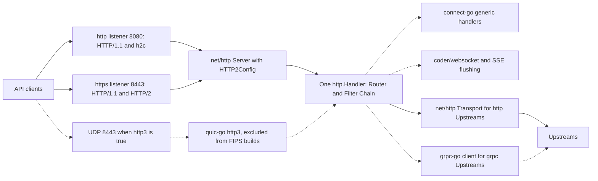

# ADR-0009: HTTP stack: net/http and quic-go, no fasthttp

## Context and problem statement

Ruralz Gateway (`ruralzd`) terminates HTTP/1.1 and h2c on the `http` listener (8080), HTTP/1.1 and HTTP/2 on `https` (8443) and, with `http3: true`, HTTP/3 on UDP 8443; it forwards to `http` Upstreams and serves admin on 9901 (foundation pack section 8.4). Ruralz Control serves the Control Stream on 8091 through `connectrpc.com/connect` ([ADR-0007](0007-control-stream-protocol.md)), and the REST API and Ruralz Console on 8090. gRPC ingress, WebSocket and SSE share the client listeners ([Data plane](../architecture/03-data-plane.md#listeners-and-protocols)).

Which stack carries these protocols in a `CGO_ENABLED=0` binary ([ADR-0001](0001-implementation-language-go.md)), keeps every stream, buffer and deadline bounded, and still offers HTTP/3? Nothing is implemented yet: HTTP/1.1, HTTP/2 and h2c are Planned (M1), HTTP/3 Planned (M3).

## Decision drivers

- **One handler model** for every client wire format, so the Router and Filter Chain behave alike on every protocol (P7) ([Vision](../vision/01-vision-and-positioning.md#principles)).
- **Composition with selected libraries**: soft criterion S3 favors `net/http` handlers and `context.Context` cancellation ([Selection criteria](../engineering/01-tech-stack-and-libraries.md#selection-criteria)).
- **Bounded resources**: stream, buffer, frame and deadline limits on every listener, HTTP/3 included, within the data plane's [Bounded resources](../architecture/03-data-plane.md#bounded-resources) budget.
- **Gates G1 to G3**: pure Go, a G2 license, and cryptography from the Go Cryptographic Module or a named exception.
- **Measured cost**: allocation overhead is accepted only as a (hypothesis) that the benchmark suite checks (P10).

## Considered options

1. **net/http plus quic-go**: `net/http` for HTTP/1.1, HTTP/2 and h2c through `Server.Protocols` and `HTTP2Config`, and quic-go `http3` for HTTP/3 ([source](https://go.dev/doc/go1.24)) ([source](https://github.com/quic-go/quic-go/releases/tag/v0.63.0)).
2. **net/http with x/net/http2**: its `Server`, `Transport` and `ConfigureServer`, and the `h2c` package ([source](https://github.com/golang/net/blob/v0.59.0/http2/server_common.go)) ([source](https://pkg.go.dev/golang.org/x/net/http2/h2c)).
3. **fasthttp**, a server outside `net/http`, on which connect-go cannot serve ([source](https://github.com/connectrpc/connect-go/blob/main/README.md)).
4. **Standard-library HTTP/3 later**: that code is unexported on Go master, and its proposals are on hold ([source](https://github.com/golang/go/issues/70914)) ([source](https://github.com/golang/go/issues/77440)).
5. **TCP only**, with HTTP/3 Not planned, as in KrakenD ([source](https://www.krakend.io/features/)).

## Decision outcome

Chosen option: "net/http plus quic-go", because the ingress libraries, connect-go, coder/websocket and `http.ResponseController` SSE flushing ([Library catalog](../engineering/01-tech-stack-and-libraries.md#library-catalog)), compose with `net/http` handlers, `HTTP2Config` exposes the limits the data plane needs without the `x/net/http2` types that x/net v0.59.0 deprecates ([source](https://github.com/golang/go/issues/78064)), and quic-go is the only researched pure-Go, MIT-licensed HTTP/3 implementation with a public Go API ([source](https://github.com/quic-go/quic-go)). This matches the foundation pack section 7 HTTP stack row. Rules:

| Surface | Rule | Planned |
|---|---|---|
| Client listeners | One `http.Server` per listener; `Server.Protocols` enables HTTP/1.1 and HTTP/2 (ALPN `h2`) on `https`, and HTTP/1.1 plus `UnencryptedHTTP2` on `http` (h2c by prior knowledge; no `Upgrade: h2c`) ([source](https://go.dev/doc/go1.24)) | Planned (M1) |
| HTTP/2 settings | Only `HTTP2Config`; on client listeners `MaxConcurrentStreams`, `MaxReceiveBufferPerConnection`, `MaxReceiveBufferPerStream` and `MaxReadFrameSize`, set once at start. At Hot Reload, a changed listener gets a new socket and server | Planned (M1) |
| Deadlines | Body reads and response writes use `http.ResponseController` deadlines ([source](https://pkg.go.dev/net/http#ResponseController)); server `ReadTimeout` and `WriteTimeout` stay unset on client listeners | Planned (M1) |
| HTTP/3 | quic-go `http3` v0.63.x, pinned, behind an internal interface, on UDP at the `https` port when `http3: true`. QUIC connections count against the Node connection ceiling. quic-go reads each stream's headers before the handler runs, so HTTP/3 per-connection memory is the incoming-stream cap times the header limit plus receive windows, with a separate Bounded resources row and HTTP/3 connection ceiling so the Node worst-case sum holds (hypothesis). Per-stream header reads get a `ReadHeaderTimeout` deadline. The quic-go settings and deadline support await research. 0-RTT stays off ([Security and identity](../architecture/08-security-and-identity.md)) | Planned (M3) |
| FIPS builds | FIPS release builds set the tag `ruralz_fips`, which the HTTP/3 package excludes (`//go:build !ruralz_fips`). A FIPS `ruralzd` never binds UDP 8443 and refuses, never ignores, a Revision with `http3: true` (foundation pack section 8.1). The proposed form, a deterministic NACK or a file-mode load failure with an RZ-CFG code, goes to OQ-tech-stack-and-libraries-9 with the mixed-Cluster cost [ADR-0001](0001-implementation-language-go.md) names | Planned (M5) |
| Upstream layer | Own loop on `http.Transport`, not `httputil.ReverseProxy`; HTTP/1.1 in cleartext, HTTP/2 by ALPN over TLS. `HTTP2Config.StrictMaxConcurrentRequests` is false ([source](https://go.dev/doc/go1.26)), so a server's stream limit opens another connection; each attempt first takes a `circuitBreaker.maxConnections` slot, whose waiters count toward `maxPendingRequests` ([Circuit breakers](../architecture/09-traffic-management-and-resilience.md#circuit-breakers)), so nothing queues unseen in `http.Transport` | Planned (M1) |
| Other servers | `net/http` on 9901 and on `ruralz-control` ports 8090, 8091 and 9902; the 8091 server unsets server timeouts and detects dead peers with `HTTP2Config` pings | Planned (M1) for 9901; Planned (M2) for Ruralz Control |
| `golang.org/x/net/http2` | Non-deprecated low-level APIs only, such as `Framer` ([source](https://github.com/golang/net/blob/v0.59.0/http2/frame.go)); none in use at the snapshot | Planned (M0) lint rule |
| fasthttp | Never linked | Not planned: it is not `net/http` |

*Figure 1: the stack per listener and upstream leg; dashed edges are Planned (M3); gRPC and WebSocket stay on TCP.*

### Consequences

- Good, because since v0.63.0 quic-go `http3` leaves `URL.Scheme` and `URL.Host` empty, as `net/http` does ([source](https://github.com/quic-go/quic-go/releases/tag/v0.63.0)), so one Router and Filter Chain serve all four HTTP versions.
- Good, because connect-go serves gRPC, gRPC-Web and Connect on `net/http` handlers ([source](https://github.com/connectrpc/connect-go/blob/main/README.md)), so gRPC ingress shares the TCP listeners.
- Good, because `HTTP2Config` has exposed stream, receive-buffer and frame-size limits since Go 1.24 ([source](https://go.dev/doc/go1.24)), the ceilings the data plane sets.
- Bad, because `net/http` and quic-go allocate more than fasthttp (hypothesis), a cost [System overview](../architecture/01-system-overview.md#design-principles) accepts; the Planned (M1) PB-8 gate of 30 Ruralz-owned allocations per pass-through request (target) excludes `net/http` internals ([Performance budgets](../architecture/12-performance-budgets-and-benchmarking.md)).
- Bad, because HTTP/2 rides the toolchain: Go 1.27 moved it into `net/http/internal/http2` ([source](https://github.com/golang/go/tree/release-branch.go1.26/src/net/http)) ([source](https://github.com/golang/go/tree/release-branch.go1.27/src/net/http/internal)), so floor and release builds run different HTTP/2 code, and Go 1.27-only APIs ([source](https://go.dev/doc/go1.27)) stay out of floor-compiled files.
- Bad, because quic-go is pre-1.0, breaks `http3` APIs on minor releases, and reaches the unexported `crypto/tls.aeadAESGCMTLS13` through `go:linkname` pending golang/go#79219 ([source](https://github.com/quic-go/quic-go/blob/master/FIPS140.md)), so a Go release can break its build.
- Bad, because FIPS builds lack HTTP/3, a feature difference that foundation pack section 1 and P1 otherwise forbid, allowed only by pack section 8.4 until OQ-tech-stack-and-libraries-9 closes ([ADR-0001](0001-implementation-language-go.md)).
- Bad, because `http.Transport` and grpc-go both reach Upstreams over HTTP/2 ([Library catalog](../engineering/01-tech-stack-and-libraries.md#library-catalog)), so client limits are set twice.
- Bad, because in-flight QUIC connections on UDP 8443 are lost, while TCP connections Drain, at a Zero-Downtime Upgrade ([ADR-0015](0015-zero-downtime-upgrades-so-reuseport.md), OQ-system-overview-18) and when a Hot Reload replaces an `http3` socket (amendment below).
- Bad, because no `Upstream` field selects h2c or HTTP/3, so `http` Upstreams stop at HTTP/1.1 and HTTP/2 over TLS until OQ-multi-protocol-12 decides.

### Confirmation

- **forbidigo rule**, Planned (M0): golangci-lint bans the deprecated `x/net/http2` `Server` and `Transport` in Ruralz code ([Repository layout and conventions](../engineering/02-repository-layout-and-conventions.md#golangci-lint-linter-set)).
- **Dependency admission**, Planned (M0): fasthttp, marked "Never" under [Alternatives not chosen](../engineering/01-tech-stack-and-libraries.md#alternatives-not-chosen), has no catalog row, so [Admission](../engineering/01-tech-stack-and-libraries.md#admission) rejects it; quic-go minor bumps need a named reviewer ([Update policy](../engineering/01-tech-stack-and-libraries.md#update-policy)).
- **Protocol conformance suite** in `pr-full`, in floor and release jobs: HTTP/1.1 and HTTP/2 cases, Planned (M1), and HTTP/3 cases, Planned (M3), that assert the QUIC stream cap and per-connection memory against the HTTP/3 Bounded resources row; frame-level suites wait on OQ-testing-and-quality-strategy-6 ([Conformance suites](../engineering/03-testing-and-quality-strategy.md#conformance-suites)).
- **FIPS job**, Planned (M5): `go list -deps -tags ruralz_fips ./cmd/ruralzd` fails if quic-go appears ([ADR-0001](0001-implementation-language-go.md)), and FIPS tests assert that a FIPS `ruralzd` never binds UDP 8443 and rejects a Revision with `http3: true` with the code OQ-tech-stack-and-libraries-9 settles.
- **Review checklist item**: a pull request that adds an HTTP server or client library, or sets an HTTP/2 option outside `HTTP2Config`, MUST amend this ADR.

## Pros and cons of the options

### net/http plus quic-go

- Good, because h2c has been built into `net/http` since Go 1.24 ([source](https://go.dev/doc/go1.24)).
- Bad, because quic-go requires Go 1.26 since v0.62.0 and is a named G3 exception ([FIPS build](../engineering/01-tech-stack-and-libraries.md#fips-build)).

### net/http with x/net/http2

- Good, because it would work on older Go releases, and low-level types such as `Framer` are not deprecated ([source](https://github.com/golang/net/blob/v0.59.0/http2/frame.go)).
- Bad, because x/net v0.59.0 deprecates `Server` and `ConfigureServer` in favor of `http.Server` and `Server.Protocols` ([source](https://github.com/golang/net/blob/v0.59.0/http2/server_common.go)), and the `h2c` package too ([source](https://pkg.go.dev/golang.org/x/net/http2/h2c)).

### fasthttp

- Good, because it would likely allocate less per request than `net/http` (hypothesis).
- Bad, because connect-go needs `net/http` handlers ([source](https://github.com/connectrpc/connect-go/blob/main/README.md)), so a Node would run two server stacks.

### Standard-library HTTP/3 later

- Good, because it would drop a pre-1.0 dependency and its G3 exception, if the standard-library code avoids quic-go's FIPS workarounds (hypothesis).
- Bad, because Go 1.26 and Go 1.27 ship no HTTP/3 ([source](https://go.dev/doc/go1.27)) and no date is published ([source](https://github.com/golang/go/issues/70914)), leaving the Planned (M3) HTTP/3 work without a library.

### TCP only

- Good, because it drops quic-go, its G3 exception and the QUIC loss at upgrade.
- Bad, because it gives up HTTP/3, which KrakenD lacks ([source](https://www.krakend.io/features/)), and the lossy-network use case that [Multi-protocol](../architecture/07-multi-protocol.md#http11-http2-and-http3) names.

## More information

- Owning document: [Data plane](../architecture/03-data-plane.md#listeners-and-protocols), with [Bounded resources](../architecture/03-data-plane.md#bounded-resources) and [Upstream layer](../architecture/03-data-plane.md#upstream-layer); catalog rows: [Tech stack and libraries](../engineering/01-tech-stack-and-libraries.md#library-catalog) and [foundation pack section 7](../_meta/foundation-pack.md#7-technology-decisions-fixed-details-in-docsengineering01-tech-stack-and-librariesmd-and-adrs).
- Related decisions: [ADR-0001](0001-implementation-language-go.md) (builds, FIPS), [ADR-0007](0007-control-stream-protocol.md) (Control Stream) and [ADR-0015](0015-zero-downtime-upgrades-so-reuseport.md) (upgrades).
- Revisit when the standard library ships a public HTTP/3 API.
- Proposed owning-document amendments:
  - Data plane SHOULD add HTTP/3 Bounded resources rows (per-connection memory, connection ceiling, per-stream header-read deadline), an Open question on the quic-go limits and `http.ResponseController` deadline support, `StrictMaxConcurrentRequests` false in Upstream layer, the Hot Reload QUIC loss with an Open question, and an Open question on HTTP/3 discovery (`Alt-Svc`), which the M3 HTTP/3 row depends on.
  - The Configuration model SHOULD register the RZ-CFG code for `http3: true` on a FIPS Node, under OQ-tech-stack-and-libraries-9.
  - Repository layout and conventions SHOULD admit `ruralz_fips` as the one feature build tag (the pack section 8.4 exception), extend forbidigo to `ConfigureServer`, `ConfigureTransport`, `ClientConn` and `h2c`, also deprecated ([source](https://github.com/golang/go/issues/78064)), and add depguard rules confining quic-go to the HTTP/3 package (criterion S7) and denying fasthttp.
