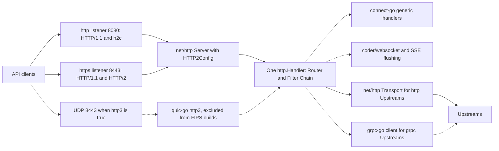

# ADR-0009: HTTP stack: net/http and quic-go, no fasthttp

## Context and problem statement

Ruralz Gateway (`ruralzd`) terminates HTTP/1.1 and h2c on its `http` listener (8080), HTTP/1.1 and HTTP/2 on its `https` listener (8443), and HTTP/3 on UDP 8443 when that listener sets `http3: true`; it forwards to `http` Upstreams and serves its admin API on 9901 (foundation pack section 8.4). Ruralz Control serves the REST API and Ruralz Console on 8090 and the Control Stream on 8091 through `connectrpc.com/connect` in gRPC mode ([ADR-0007](0007-control-stream-protocol.md)). gRPC ingress, WebSocket and SSE ride the same client listeners ([Data plane](../architecture/03-data-plane.md#listeners-and-protocols)).

Which server and client stack carries these protocols in a `CGO_ENABLED=0` binary ([ADR-0001](0001-implementation-language-go.md)), keeps every stream, buffer and deadline bounded, and still offers HTTP/3, part of the multi-protocol native differentiator that KrakenD lacks in both editions ([source](https://www.krakend.io/features/))? Nothing is implemented yet: HTTP/1.1, HTTP/2 and h2c are Planned (M1), and HTTP/3 is Planned (M3).

## Decision drivers

- **One handler model** for every client wire format, so the Router and Filter Chain run the same way whatever the protocol (P7) ([Vision](../vision/01-vision-and-positioning.md#principles)).
- **Composition with selected libraries**: criterion S3 requires `net/http` handlers and `context.Context` cancellation ([Selection criteria](../engineering/01-tech-stack-and-libraries.md#selection-criteria)).
- **Bounded resources**: per-connection stream, buffer and frame limits and per-request deadlines, as the data plane's [Bounded resources](../architecture/03-data-plane.md#bounded-resources) table fixes them.
- **Gates G1 to G3**: pure Go, a G2 license, and cryptography from the Go Cryptographic Module or a named exception.
- **Maintenance**: fixes and protocol features arrive with toolchain updates.
- **Measured cost**: allocation overhead is accepted only as a (hypothesis) that the benchmark suite checks (P10).

## Considered options

1. `net/http` for HTTP/1.1, HTTP/2 and h2c through `Server.Protocols` and `HTTP2Config`, plus quic-go `http3` for HTTP/3 ([source](https://go.dev/doc/go1.24)) ([source](https://github.com/quic-go/quic-go/releases/tag/v0.63.0)).
2. `net/http` configured through the `golang.org/x/net/http2` `Server`, `Transport` and `ConfigureServer` and the `h2c` package ([source](https://github.com/golang/net/blob/v0.59.0/http2/server_common.go)) ([source](https://pkg.go.dev/golang.org/x/net/http2/h2c)).
3. fasthttp, a server outside `net/http`, although connect-go serves gRPC, gRPC-Web and Connect only on `net/http` handlers ([source](https://github.com/connectrpc/connect-go/blob/main/README.md)).
4. `net/http` now and standard-library HTTP/3 later; today that code is unexported on the Go master branch and its proposals are on hold ([source](https://github.com/golang/go/issues/70914)) ([source](https://github.com/golang/go/issues/77440)).
5. TCP only, with HTTP/3 Not planned, as in KrakenD ([source](https://www.krakend.io/features/)).

## Decision outcome

Chosen option: "`net/http` for HTTP/1.1, HTTP/2 and h2c, plus quic-go for HTTP/3", because every protocol library in foundation pack section 7 composes with `net/http` handlers, `HTTP2Config` exposes the limits the data plane needs without the `x/net/http2` types that x/net v0.59.0 deprecates ([source](https://github.com/golang/go/issues/78064)), and quic-go is the only researched HTTP/3 implementation with a public Go API, pure Go and MIT-licensed ([source](https://github.com/quic-go/quic-go)). This matches the foundation pack section 7 HTTP stack row: `golang.org/x/net/http2` serves only non-deprecated low-level APIs, and fasthttp is rejected. Rules:

| Surface | Rule | Planned |
|---|---|---|
| Client listeners | One `http.Server` per listener; `Server.Protocols` enables HTTP/1.1 and HTTP/2 (ALPN `h2`) on `https`, and HTTP/1.1 plus `UnencryptedHTTP2` on `http`: h2c by prior knowledge only, since `Upgrade: h2c` is unsupported ([source](https://go.dev/doc/go1.24)) | Planned (M1) |
| HTTP/2 settings | Only `HTTP2Config` fields (`MaxConcurrentStreams`, `MaxReceiveBufferPerConnection`, `MaxReceiveBufferPerStream`, `MaxReadFrameSize`), set once at server start; a Hot Reload that changes a listener builds a new socket and server before the swap | Planned (M1) |
| Deadlines | Body reads and response writes use `http.ResponseController` deadlines ([source](https://pkg.go.dev/net/http#ResponseController)); server `ReadTimeout` and `WriteTimeout` stay unset on client listeners | Planned (M1) |
| HTTP/3 | quic-go `http3` v0.63.x, pinned, on UDP at the `https` listener's port when `http3: true`, with the same Routes, Policies and certificates, behind an internal interface; a build constraint keeps it out of FIPS builds (OQ-tech-stack-and-libraries-9) | Planned (M3) |
| Upstream layer | Its own loop on `http.Transport`, not `httputil.ReverseProxy`; `http` Upstreams use HTTP/1.1 in cleartext and HTTP/2 by ALPN over TLS, honoring server limits through `HTTP2Config.StrictMaxConcurrentRequests` ([source](https://go.dev/doc/go1.26)) | Planned (M1) |
| Other servers | `net/http` on 9901, and on 8090, 8091 and 9902 in `ruralz-control`; the 8091 Control Stream server disables `ReadTimeout` and `WriteTimeout` and detects dead peers with `HTTP2Config` pings | Planned (M1) for 9901; Planned (M2) for Ruralz Control |
| `golang.org/x/net/http2` | Non-deprecated low-level APIs only, such as `Framer` ([source](https://github.com/golang/net/blob/v0.59.0/http2/frame.go)); none in use at the snapshot | Planned (M0) lint rule |
| fasthttp | Never linked | Not planned: it is not `net/http` |

*Figure 1: the stack behind each Node listener and upstream leg; dashed edges are Planned (M3).*

### Consequences

- Good, because quic-go `http3` hands handlers `*http.Request` values whose `URL.Scheme` and `URL.Host` are empty since v0.63.0, as in `net/http` ([source](https://github.com/quic-go/quic-go/releases/tag/v0.63.0)), so one Router and Filter Chain serve HTTP/1.1, h2c, HTTP/2 and HTTP/3.
- Good, because connect-go serves gRPC, gRPC-Web and Connect on `net/http` handlers ([source](https://github.com/connectrpc/connect-go/blob/main/README.md)), so gRPC ingress shares the TCP listeners instead of opening a second server.
- Good, because `HTTP2Config` has exposed stream, receive-buffer and frame-size limits since Go 1.24 ([source](https://go.dev/doc/go1.24)), which the data plane sets to 250 streams per connection, 256 KiB and 64 KiB receive buffers and 16 KiB frames (target).
- Good, because standard-library HTTP fixes arrive with each toolchain patch, which [Version floor](../engineering/01-tech-stack-and-libraries.md#version-floor) pins for release builds.
- Bad, because `net/http` and quic-go allocate more than fasthttp (hypothesis), a cost [System overview](../architecture/01-system-overview.md#design-principles) accepts; the seed budget of 30 Ruralz-owned allocations per pass-through HTTP/1.1 request (hypothesis) excludes `net/http` internals, so the Planned (M4) benchmark suite reports them separately.
- Bad, because HTTP/2 behavior rides the toolchain: Go 1.27 moved HTTP/2 from `h2_bundle.go` into `net/http/internal/http2` ([source](https://github.com/golang/go/tree/release-branch.go1.26/src/net/http)) ([source](https://github.com/golang/go/tree/release-branch.go1.27/src/net/http/internal)), so the Go 1.26 floor job and go1.27.1 release builds run different HTTP/2 code, and Go 1.27 APIs such as `Server.DisableClientPriority` and `Server.MaxHeaderValueCount` ([source](https://go.dev/doc/go1.27)) cannot appear in files the floor job compiles.
- Bad, because quic-go is pre-1.0, breaks `http3` APIs on minor releases, and reaches the unexported `crypto/tls.aeadAESGCMTLS13` through `go:linkname` pending golang/go#79219 ([source](https://github.com/quic-go/quic-go/blob/master/FIPS140.md)), so a Go release can break its build; that G3 exception is why HTTP/3 is off in FIPS builds (foundation pack section 8.4).
- Bad, because `ruralzd` links two HTTP/2 client implementations, `http.Transport` for `http` Upstreams and grpc-go's native transport for `grpc` Upstreams ([Library catalog](../engineering/01-tech-stack-and-libraries.md#library-catalog)), so client limits are set in two places.
- Bad, because in-flight QUIC connections on UDP 8443 are lost at a Zero-Downtime Upgrade while TCP connections Drain ([ADR-0015](0015-zero-downtime-upgrades-so-reuseport.md), OQ-system-overview-18).
- Bad, because `Upstream` has no field that selects h2c or HTTP/3, so `http` Upstreams stop at HTTP/1.1 and HTTP/2 over TLS until OQ-multi-protocol-12 decides.

### Confirmation

- **forbidigo rule**, Planned (M0): golangci-lint bans the deprecated `x/net/http2` `Server` and `Transport` in Ruralz code ([Repository layout and conventions](../engineering/02-repository-layout-and-conventions.md#golangci-lint-linter-set)).
- **Dependency admission**, Planned (M0): fasthttp has no catalog row and is listed under [Alternatives not chosen](../engineering/01-tech-stack-and-libraries.md#alternatives-not-chosen) with "Never", so the ban on any module without a catalog row rejects it ([Admission](../engineering/01-tech-stack-and-libraries.md#admission)).
- **Protocol conformance suite** in `pr-full`: HTTP/1.1 and HTTP/2 cases through Ruralz Gateway's listeners, Planned (M1), and HTTP/3 cases, Planned (M3); frame-level suites wait on OQ-testing-and-quality-strategy-6 ([Conformance suites](../engineering/03-testing-and-quality-strategy.md#conformance-suites)).
- **FIPS job**, Planned (M5): fails if quic-go appears in the FIPS `ruralzd` dependencies ([ADR-0001](0001-implementation-language-go.md)), and FIPS tests assert that `http3: true` is refused or inert.
- **Update review**: quic-go minor bumps need a named reviewer ([Update policy](../engineering/01-tech-stack-and-libraries.md#update-policy)).
- **Review checklist item**: a pull request that adds an HTTP server or client library, or sets an HTTP/2 option outside `HTTP2Config`, MUST amend this ADR.

## Pros and cons of the options

### net/http plus quic-go

- Good, because h2c has been built into `net/http` since Go 1.24 ([source](https://go.dev/doc/go1.24)), so no extra module serves 8080.
- Good, because quic-go v0.62.0 added RFC 9218 stream priorities and `PRIORITY_UPDATE` handling on HTTP/3 servers ([source](https://github.com/quic-go/quic-go/releases/tag/v0.62.0)).
- Bad, because quic-go requires Go 1.26 since v0.62.0 and is a named G3 exception ([FIPS build](../engineering/01-tech-stack-and-libraries.md#fips-build)).

### net/http with x/net/http2 Server, Transport and h2c

- Good, because it would work unchanged on older Go releases, and low-level types such as `Framer` stay supported ([source](https://github.com/golang/net/blob/v0.59.0/http2/frame.go)).
- Bad, because x/net v0.59.0 marks `Server` "Deprecated: Use [http.Server] instead." and `ConfigureServer` "Deprecated: Set [http.Server.Protocols] instead." ([source](https://github.com/golang/net/blob/v0.59.0/http2/server_common.go)).
- Bad, because the `h2c` package is deprecated: "Unencrypted HTTP/2 is now supported directly by the net/http package" ([source](https://pkg.go.dev/golang.org/x/net/http2/h2c)).

### fasthttp

- Good, because it would likely allocate less per request than `net/http` (hypothesis).
- Bad, because connect-go needs `net/http` handlers ([source](https://github.com/connectrpc/connect-go/blob/main/README.md)) and SSE relies on `http.ResponseController` ([source](https://pkg.go.dev/net/http#ResponseController)), so a Node would run two server stacks.

### net/http and standard-library HTTP/3 later

- Good, because it would drop a pre-1.0 dependency and its G3 exception, if the standard-library code avoids quic-go's FIPS workarounds (hypothesis).
- Bad, because Go 1.26 and Go 1.27 ship no HTTP/3 ([source](https://go.dev/doc/go1.27)) and no release date is published ([source](https://github.com/golang/go/issues/70914)), so the Planned (M3) HTTP/3 work would have no library.

### TCP only, HTTP/3 Not planned

- Good, because it drops quic-go, its G3 exception and the QUIC loss at upgrade.
- Bad, because it gives up HTTP/3, which KrakenD lacks ([source](https://www.krakend.io/features/)), and the lossy-network use case that [Multi-protocol](../architecture/07-multi-protocol.md#http11-http2-and-http3) names.

## More information

- Owning document: [Data plane](../architecture/03-data-plane.md#listeners-and-protocols), with [Bounded resources](../architecture/03-data-plane.md#bounded-resources) and [Upstream layer](../architecture/03-data-plane.md#upstream-layer); the catalog rows live in [Tech stack and libraries](../engineering/01-tech-stack-and-libraries.md#library-catalog) and [foundation pack section 7](../_meta/foundation-pack.md#7-technology-decisions-fixed-details-in-docsengineering01-tech-stack-and-librariesmd-and-adrs).
- Related decisions: [ADR-0001](0001-implementation-language-go.md) (static builds, version floor, FIPS build constraint), [ADR-0007](0007-control-stream-protocol.md) (Control Stream over connect-go) and [ADR-0015](0015-zero-downtime-upgrades-so-reuseport.md) (upgrades and Drain).
- Revisit when the standard library ships a public HTTP/3 API.
- Proposed owning-document amendments: Data plane SHOULD add an Open question on how clients discover HTTP/3 on an `http3: true` listener (an `Alt-Svc` header on TCP responses), since the Configuration model has no field for it. Repository layout and conventions SHOULD extend the forbidigo rule to `ConfigureServer`, `ConfigureTransport`, `ClientConn` and the `h2c` package, which x/net also deprecates ([source](https://github.com/golang/go/issues/78064)), and add a depguard rule confining quic-go to the HTTP/3 listener package, as criterion S7 does for wazero.
