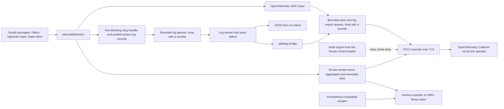

# ADR-0010: Telemetry: OpenTelemetry-first with an slog bridge for logs

## Context and problem statement

Ruralz Gateway and Ruralz Control emit metrics, traces and logs; P10 requires OpenTelemetry signals in every build ([Vision and positioning](../vision/01-vision-and-positioning.md#principles)). Operators set only `Gateway.spec.telemetry.otlp.endpoint`, `traceSampling` and `accessLog.when` ([Configuration model](../architecture/02-configuration-model.md#gateway)).

Which layer should packages code against, when OpenTelemetry Go traces and metrics are stable but Logs is a release candidate ([source](https://github.com/open-telemetry/opentelemetry-go/blob/main/README.md))? Ruralz Gateway telemetry is Planned (M1), Ruralz Control Planned (M2), AI Planned (M3).

## Decision drivers

- **Vendor-neutral and free (P1, P10)**: identical signals in every build, including FIPS (Planned (M5)) and air-gapped.
- **Never on the critical path**: no request goroutine waits on a lock, pipe or exporter; bounded queues drop with a counter (O2 of [Observability](../architecture/10-observability.md#observability-principles); P3's "bounded and droppable").
- **Stable call sites**: packages call only stable APIs; library churn SHOULD stay inside `internal/telemetry`.
- **Gates G1 to G3 and S2**: pure Go, compatible license, Go 1.26 floor ([Selection criteria](../engineering/01-tech-stack-and-libraries.md#selection-criteria)).
- **One name set**: OTLP and `/metrics` (9901, 9902) MUST show identical names.
- **One correlation key (O6)**: (`trace_id`, server `span_id`) links spans, logs and exemplars; problem-document `requestId` ([Data plane](../architecture/03-data-plane.md#error-response-format)) carries the trace ID (span ID: OQ-observability-13).
- **One configuration source**: Nodes on one Revision differ only in `secretRef` values and `RURALZ_*` settings (pack section 8.1).
- **Measured overhead**: telemetry at defaults stays within 5% of Node CPU at half saturation (target).

## Considered options

1. **OpenTelemetry-first with an slog bridge**: `go.opentelemetry.io/otel` v1.46.x for traces and metrics ([source](https://github.com/open-telemetry/opentelemetry-go/releases/tag/v1.46.0)); `log/slog` with the `otelslog` bridge v0.20.x for logs ([source](https://github.com/open-telemetry/opentelemetry-go-contrib/blob/main/bridges/otelslog/go.mod)).
2. **OpenTelemetry for all three signals now**, logs on the v1.47.0-rc.1 Logs API ([source](https://github.com/open-telemetry/opentelemetry-go/releases/tag/v1.47.0-rc.1)).
3. **Prometheus client for metrics**, `prometheus/client_golang` v1.24.1 ([source](https://github.com/prometheus/client_golang/releases/tag/v1.24.1)), OpenTelemetry traces and plain `slog` logs, as APISIX splits them ([source](https://apisix.apache.org/docs/apisix/plugins/opentelemetry/)) ([source](https://apisix.apache.org/blog/2026/08/20/release-apache-apisix-3.18.0/)).
4. **Per-vendor exporters**, as KrakenD links InfluxDB and GELF ([source](https://www.krakend.io/docs/telemetry/influxdb-native/)) ([source](https://www.krakend.io/docs/logging/graylog-gelf/)) ([source](https://github.com/krakend/krakend-ce/blob/master/cmd/krakend-ce/main.go)), with an EE-only New Relic SDK ([source](https://www.krakend.io/docs/enterprise/telemetry/newrelic/)) and deprecated OpenCensus ([source](https://www.krakend.io/docs/telemetry/opencensus/)).

## Decision outcome

Chosen option: "OpenTelemetry-first with an slog bridge", because OTLP carries all three signals while every call site uses a stable API (OpenTelemetry traces and metrics, `log/slog`), per pack section 7.

End state: v1.47.0's expected stable Logs API and SDK ([source](https://github.com/open-telemetry/opentelemetry-go/releases/tag/v1.47.0-rc.1)) replace the release-candidate SDK behind the bridge; `slog` call sites stay, and `otelslog` remains the adapter in `internal/telemetry`. Pack section 7's "until" means the pre-stable SDK; the [Watch list](../engineering/01-tech-stack-and-libraries.md#watch-list) trigger changes only wiring.

| Area | Rule | Planned |
|---|---|---|
| Traces | SDK tracer; W3C Trace Context extracted at the server span and injected into every upstream leg; no baggage. `internal/telemetry` samples under both per-Node caps first, so unsampled requests create no spans, and installs a lock-free per-connection `sdktrace.WithIDGenerator` | Planned (M1) for HTTP; Planned (M3) for gRPC; Planned (M4) for Kafka, NATS and MQTT 5 |
| Metrics | Ruralz-owned aggregates, not SDK synchronous instruments, read by OTLP and `/metrics` via OQ-observability-16's SDK interface | Planned (M1) |
| Exemplars | Sampled requests alone write one slot per histogram label set per collection, under a sequence lock off the unsampled path, exported via OQ-observability-16 and OpenMetrics on `/metrics`; slots add to the 300-byte histogram assumption (hypothesis) | Planned (M1) |
| Logs | Only `log/slog` via `internal/telemetry`, except the audit export; no request goroutine runs a writing handler. Pooled access log records use a bounded queue of 8,192 records and 4 MiB (target), process logs a non-blocking handler and another bounded queue; the one stdout-owning worker encodes each once for stdout and the bridge. Both drop with `ruralz_telemetry_logs_dropped_total{stream, reason="queue_full"}`. Raft's `go-hclog` adapts to `slog` ([ADR-0006](0006-control-store-raft-boltdb.md)) | Planned (M1); Ruralz Control Planned (M2) |
| Export | Node OTLP only when `Gateway.spec.telemetry.otlp.endpoint` is set, over TLS (TB-12); spans and logs, except the audit export, pass queues dropping with `queue_full` or `export_error` counts; failure past one interval raises `telemetry_export_failing`. Before any SDK constructor, `ruralzd` and `ruralz-control` `os.Unsetenv` every `OTEL_*` variable (`WithResource` always merges `resource.Environment()`) and pass explicit options. `${OTEL_...}` substitution runs at render time, or in file-mode `ruralzd` from its pre-removal environment ([Configuration model](../architecture/02-configuration-model.md#environment-substitution)) | Planned (M1) |
| Audit export | The leader emits committed entries, bypassing `slog`, through a dedicated `sdklog.LoggerProvider` with the Resource-row resource and one synchronous capture Processor cloning records into a batch (no BatchProcessor, since `Emit` returns no error). It calls the OTLP log exporter's `Export`, advancing the high-water mark only on a nil error, never on partial success. Raft-indexed batches retry until acknowledged, lagging, never dropping (TB-12 exception proposed in OQ-observability-19) | Planned (M2) |
| Conventions | HTTP semantic conventions without `url.full` and `url.query`; `gen_ai.*` pinned to one commit per release, never content attributes | Planned (M1); `gen_ai` Planned (M3) |
| Resource | `service.name`, `service.version`, `service.instance.id` (`node.id` or replica), plus Cluster and Environment in Control mode; never the active Revision. Providers rebuild once after Enrollment; old-provider spans end and flush off the request path | Planned (M1) |
| Vendor SDKs | None; vendors read the operator's OpenTelemetry Collector or a Prometheus-compatible scraper | Not planned: one export path (P1) |

*Figure 1: signal paths from a Node or Ruralz Control, which serves `/metrics` on 9902; the dashed edge is audit export.*

### Consequences

- Good, because one OTLP pipeline reaches any store without per-vendor Ruralz code (P1).
- Good, because `slog` call sites survive v1.47.0 unchanged.
- Good, because (`trace_id`, server `span_id`) correlates spans, access logs, exemplars and `requestId` (O6).
- Good, because a blocked stdout or stalled Collector costs counted drops, not latency.
- Bad, because until v1.47.0 the bridge feeds a pre-stable SDK, and v1.47.0-rc.1 already deprecates `otel/log/global` ([source](https://github.com/open-telemetry/opentelemetry-go/releases/tag/v1.47.0-rc.1)).
- Bad, because the lossless audit export uses the pre-stable OTLP log exporter and waits on OQ-observability-19 (blocking for Planned (M2)) to amend TB-12's "Drop on failure".
- Bad, because `otelslog` declares `go 1.26.0` ([source](https://github.com/open-telemetry/opentelemetry-go-contrib/blob/main/bridges/otelslog/go.mod)), tying telemetry to the [Version floor](../engineering/01-tech-stack-and-libraries.md#version-floor).
- Bad, because Ruralz aggregates duplicate part of the SDK pipeline and forgo its exemplar reservoirs; OQ-observability-16 (blocking for M1 metrics) sets their export interface, option (c) amending this ADR.
- Bad, because the `/metrics` exporter is unselected (OQ-tech-stack-and-libraries-16): `client_golang`, still a candidate, or the OpenTelemetry Prometheus exporter v0.68.0 ([source](https://proxy.golang.org/go.opentelemetry.io/otel/exporters/prometheus/@latest)); it MUST expose OpenMetrics exemplars.
- Bad, because library instruments rename between releases (grpc-go v1.84.0 ([source](https://github.com/grpc/grpc-go/releases/tag/v1.84.0))), so Grafana dashboards and alerts use only `ruralz_*` names.
- Bad, because the `gen_ai` conventions are Development ([source](https://github.com/open-telemetry/semantic-conventions-genai/tree/main/docs/gen-ai)) with no tagged release ([source](https://github.com/open-telemetry/semantic-conventions-genai)), so each release pins a commit.
- Bad, because, with `OTEL_*` removed, OTLP TLS and authentication wait on OQ-observability-2 (blocking for TLS export at M1); cleartext raises `cleartext_hop`.
- Bad, because telemetry takes up to 40 MiB live heap and 80 MiB RSS, no `/tap` subscriber, at `GOGC=100` (target; OQ-observability-17).

### Confirmation

- **Lint**, Planned (M0): depguard `log$` rejects `log` ([Banned imports](../engineering/02-repository-layout-and-conventions.md#banned-imports)); `sloglint` checks `slog` keys, `spancheck` unended spans ([golangci-lint linter set](../engineering/02-repository-layout-and-conventions.md#golangci-lint-linter-set)); repocheck checks pack section 2 names ([Ruralz-specific checks](../engineering/02-repository-layout-and-conventions.md#ruralz-specific-checks)).
- **Catalog gates**, Planned (M1): CI fails on a `ruralz_*` name or degraded reason absent from the [Metrics catalog](../architecture/10-observability.md#metrics-catalog), a Grafana panel on an unlisted metric, or differing OTLP and `/metrics` names.
- **Cardinality test**, Planned (M1): 1,000 Hot Reloads renaming every Route keep retiring series within 25,000 (target) ([Cardinality budget](../architecture/10-observability.md#cardinality-budget)).
- **Benchmark gate**, Planned (M1): PB-10 fails when telemetry at defaults exceeds 5% of Node CPU (target) ([Budget catalog](../architecture/12-performance-budgets-and-benchmarking.md#budget-catalog-and-slo-ties)); at 4 P and 32 P, unsampled requests never touch exemplar slots (target).
- **Blocked stdout test**, Planned (M1): a blocked stdout keeps request latency within [Overhead per signal](../architecture/10-observability.md#overhead-per-signal) budgets (target), with drops counted.
- **Environment golden test**, Planned (M1): with `OTEL_RESOURCE_ATTRIBUTES`, `OTEL_EXPORTER_OTLP_HEADERS` and `OTEL_TRACES_SAMPLER` set, `ruralzd` exports a byte-identical resource, headers and sampling, `os.Getenv("OTEL_RESOURCE_ATTRIBUTES")` is empty after startup, and an unrendered Bundle's `${OTEL_EXPORTER_OTLP_ENDPOINT}` still resolves.
- **End-to-end test**, Planned (M1): the file-mode Docker Compose environment runs an OpenTelemetry Collector ([End-to-end tests](../engineering/03-testing-and-quality-strategy.md#end-to-end-tests)).
- **Audit export test**, Planned (M2): across a leader failover, against a Collector returning partial success, every committed entry arrives at least once, carrying the Resource-row attributes.
- **Review checklist item**: a vendor telemetry SDK, or `go.opentelemetry.io/otel/log` or an OTLP log exporter used outside `internal/telemetry` or beyond the audit export, MUST amend this ADR.

## Pros and cons of the options

### OpenTelemetry-first with an slog bridge

- Good, because traces and metrics are stable ([source](https://github.com/open-telemetry/opentelemetry-go/blob/main/README.md)).
- Bad, because logs and the audit export rest on a pre-stable Logs SDK until v1.47.0.

### OpenTelemetry for all three signals now

- Good, because one API covers every signal.
- Bad, because call sites would use a release-candidate API, its global logger package already deprecated ([source](https://github.com/open-telemetry/opentelemetry-go/releases/tag/v1.47.0-rc.1)).

### Prometheus client for metrics

- Good, because `client_golang` is Apache-2.0 ([source](https://github.com/prometheus/client_golang/blob/main/LICENSE)) and widely scraped.
- Bad, because metrics miss OTLP, so operators run two pipelines, as with APISIX's traces-only plugin ([source](https://apisix.apache.org/docs/apisix/plugins/opentelemetry/)).

### Per-vendor exporters

- Good, because vendor features need no Collector.
- Bad, because each vendor adds a dependency and code path, and KrakenD keeps native SDKs in a paid edition ([source](https://www.krakend.io/docs/enterprise/telemetry/newrelic/)), against P1.

## More information

- Owning document: [Observability](../architecture/10-observability.md#telemetry-pipeline), notably [Logging and access logs](../architecture/10-observability.md#logging-and-access-logs) and [Control plane observability](../architecture/10-observability.md#control-plane-observability); catalog row in [Tech stack and libraries](../engineering/01-tech-stack-and-libraries.md#library-catalog).
- Related: [ADR-0006](0006-control-store-raft-boltdb.md) (`go-hclog`), [ADR-0007](0007-control-stream-protocol.md) (Node counters ride heartbeats) and [ADR-0014](0014-ai-api-surface.md) (`gen_ai`). Ruralz Control's OTLP settings are OQ-observability-11.
- Revisit at OpenTelemetry Go v1.47.0, when OQ-observability-16 picks Ruralz encoders, OQ-observability-2 adds TLS fields or `gen_ai` tags a release.
- Proposed amendments: tech stack Watch list Fallback for the OTel Logs API: "Stable Logs SDK behind the `otelslog` bridge; `slog` call sites unchanged"; pack section 7: "`slog` bridge (`otelslog`) for logs, over a pre-stable Logs SDK until OTel Go v1.47.0"; Repository layout and conventions (depguard owner): confine `go.opentelemetry.io/otel`, OTLP exporter modules and `otelslog` to `internal/telemetry` (S7), so the checklist item becomes lint.
