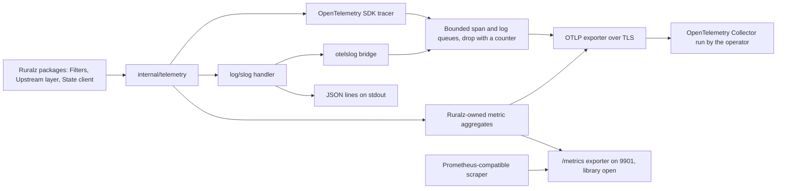

# ADR-0010: Telemetry: OpenTelemetry-first with an slog bridge for logs

## Context and problem statement

Ruralz Gateway (`ruralzd`) and Ruralz Control (`ruralz-control`) must emit metrics, traces and logs. P10 makes OpenTelemetry signals and a metric for every degraded state part of every build, and P3 forbids request-path waits ([Vision and positioning](../vision/01-vision-and-positioning.md#principles)). The foundation pack fixes the names: metrics `ruralz_<component>_<name>_<unit>`, spans `ruralz.filter.<name>`, `ruralz.upstream.<name>` and `ruralz.route.match`, and OpenTelemetry semantic conventions for HTTP and `gen_ai.*`. Ruralz Cloud provisioning and billing may read only public interfaces, OpenTelemetry signals included (foundation pack section 1).

The [Configuration model](../architecture/02-configuration-model.md#gateway) gives operators three telemetry fields: `Gateway.spec.telemetry.otlp.endpoint`, `traceSampling` and `accessLog.when`. Which instrumentation and export layer should every Ruralz package code against, when the OpenTelemetry Go traces and metrics are stable but its Logs signal is a release candidate ([source](https://github.com/open-telemetry/opentelemetry-go/blob/main/README.md))? Nothing is implemented yet: Ruralz Gateway telemetry is Planned (M1), Ruralz Control telemetry Planned (M2) and AI telemetry Planned (M3).

## Decision drivers

- **Vendor-neutral and free (P1, P10)**: the same signals in every build, including the FIPS build (Planned (M5)), air-gapped, with no phone-home.
- **Never on the critical path (P3)**: telemetry never blocks, slows or fails a request; queues are bounded and drop with a counter (rule O2 of [Observability](../architecture/10-observability.md#observability-principles)).
- **Stable call sites**: instrumented packages MUST call only stable APIs; library churn stays inside `internal/telemetry` ([Repository layout and conventions](../engineering/02-repository-layout-and-conventions.md#banned-imports)).
- **Gates G1 to G3 and S2**: pure Go, a compatible license, the Go 1.26 floor ([Selection criteria](../engineering/01-tech-stack-and-libraries.md#selection-criteria)).
- **Two consumers, one name set**: OTLP push and Prometheus-compatible scrapes of `/metrics` on 9901 and 9902 MUST show identical names.
- **One correlation key**: the trace ID links spans, logs, exemplars and the `requestId` of every problem document ([Data plane](../architecture/03-data-plane.md#error-response-format)).
- **Measured overhead**: all telemetry at defaults stays within 5% of Node CPU at half saturation (target).

## Considered options

1. **OpenTelemetry-first**: `go.opentelemetry.io/otel` v1.46.x for traces and metrics ([source](https://github.com/open-telemetry/opentelemetry-go/releases/tag/v1.46.0)); `log/slog` with the `otelslog` bridge v0.20.x for logs ([source](https://github.com/open-telemetry/opentelemetry-go-contrib/blob/main/bridges/otelslog/go.mod)).
2. **OpenTelemetry for all three signals now**, coding logs against the Logs API and SDK of v1.47.0-rc.1 ([source](https://github.com/open-telemetry/opentelemetry-go/releases/tag/v1.47.0-rc.1)).
3. **Prometheus client for metrics**, `prometheus/client_golang` v1.24.1 ([source](https://github.com/prometheus/client_golang/releases/tag/v1.24.1)), with OpenTelemetry for traces only and plain `slog` JSON logs, the split APISIX uses ([source](https://apisix.apache.org/docs/apisix/plugins/opentelemetry/)) ([source](https://apisix.apache.org/blog/2026/08/20/release-apache-apisix-3.18.0/)).
4. **Per-vendor exporters and SDKs** (Datadog, New Relic, InfluxDB, GELF), as KrakenD integrates them, where the native New Relic SDK is EE-only ([source](https://www.krakend.io/docs/enterprise/telemetry/newrelic/)) and OpenCensus is deprecated in favor of OpenTelemetry ([source](https://www.krakend.io/docs/telemetry/opencensus/)).

## Decision outcome

Chosen option: "OpenTelemetry-first: the OpenTelemetry Go SDK for traces and metrics, `log/slog` with the `otelslog` bridge for logs", because it gives one vendor-neutral wire format, OTLP, for all three signals while every call site uses a stable API: OpenTelemetry tracing and metrics, and the standard library's `log/slog`. This matches the foundation pack section 7 Telemetry row. Logs move to the OpenTelemetry Logs API only after its stable release, which v1.47.0 "is expected to include" ([source](https://github.com/open-telemetry/opentelemetry-go/releases/tag/v1.47.0-rc.1)), through a revisit of this ADR that the [Watch list](../engineering/01-tech-stack-and-libraries.md#watch-list) triggers.

| Area | Rule | Planned |
|---|---|---|
| Traces | OpenTelemetry SDK tracer; W3C Trace Context (`traceparent`, `tracestate`) extracted at the server span and injected into every upstream leg; baggage never propagated; unsampled requests create no spans | Planned (M1) for HTTP; Planned (M3) for gRPC; Planned (M4) for Kafka, NATS and MQTT 5 |
| Metrics | Values live in Ruralz-owned aggregates, not SDK synchronous instruments, and both the OTLP reader and the `/metrics` exporter read them; the SDK interface that exports them is OQ-observability-16 | Planned (M1) |
| Logs | Code logs only through `log/slog` via `internal/telemetry`: JSON lines on stdout always, plus OTLP logs through `otelslog` and a bounded processor when an endpoint is set; Raft's `go-hclog` is adapted to `slog` ([ADR-0006](0006-control-store-raft-boltdb.md)) | Planned (M1); Ruralz Control Planned (M2) |
| Export | OTLP only when `Gateway.spec.telemetry.otlp.endpoint` is set, over TLS on boundary TB-12; spans and logs pass Ruralz queues that drop with `queue_full` or `export_error` counts; a failure past one interval raises `telemetry_export_failing` | Planned (M1) |
| Conventions | HTTP semantic conventions without `url.full` and `url.query`; `gen_ai.*` pinned to one commit per release, never content attributes | Planned (M1); `gen_ai` Planned (M3) |
| Resource | `service.name`, `service.version`, `service.instance.id` (`node.id` or replica) and, in Control mode, Cluster and Environment; never the active Revision | Planned (M1) |
| Vendor SDKs | None linked; vendors receive signals through the operator's OpenTelemetry Collector or a Prometheus-compatible scraper | Not planned: one export path and P1 |

*Figure 1: how each signal leaves a Node; Ruralz Control uses the same layer and serves `/metrics` on 9902.*

### Consequences

- Good, because one OTLP pipeline carries all three signals to any store the operator picks, with no Ruralz code per vendor (P1).
- Good, because call sites never change when logs move to the stable Logs API: `log/slog` is the standard library, and Go 1.26 added `slog.NewMultiHandler` for fan-out to stdout and the bridge ([source](https://go.dev/doc/go1.26)).
- Good, because the trace ID is the single correlation key across spans, access log records, exemplars and `requestId`.
- Good, because semantic conventions let generic tools read HTTP and `gen_ai` spans, while the `ruralz_ai_*` metrics stay the stable contract ([AI observability](../architecture/10-observability.md#ai-observability)).
- Bad, because the export side of logs rests on a release candidate: v1.47.0-rc.1 deprecates `otel/log/global` in favor of `otel.Logger` and `otel.SetLoggerProvider` ([source](https://github.com/open-telemetry/opentelemetry-go/releases/tag/v1.47.0-rc.1)), so bridge wiring inside `internal/telemetry` changes at v1.47.0.
- Bad, because `otelslog` declares `go 1.26.0` ([source](https://github.com/open-telemetry/opentelemetry-go-contrib/blob/main/bridges/otelslog/go.mod)) and v1.47.0 drops Go 1.25, which ties telemetry to the [Version floor](../engineering/01-tech-stack-and-libraries.md#version-floor).
- Bad, because Ruralz-owned aggregates duplicate part of the SDK metrics pipeline, and the interface that exports them stays open (OQ-observability-16, blocking for M1 metrics); its option (c), Ruralz encoders, needs an amendment of this ADR.
- Bad, because the `/metrics` exporter is unselected (OQ-tech-stack-and-libraries-16): the OpenTelemetry Prometheus exporter v0.68.0 ([source](https://proxy.golang.org/go.opentelemetry.io/otel/exporters/prometheus/@latest)) or `client_golang`, so no library is named until a catalog row lands.
- Bad, because library-emitted instruments rename across releases, as grpc-go v1.84.0 replaced `grpc.lb.pick_first.*` with `grpc.subchannel.*` ([source](https://github.com/grpc/grpc-go/releases/tag/v1.84.0)); Grafana dashboards and alert rules therefore use only the `ruralz_*` catalog.
- Bad, because the `gen_ai` conventions have no tagged release and are marked Development ([source](https://github.com/open-telemetry/semantic-conventions-genai/tree/main/docs/gen-ai)), so each release pins a commit and names it in its release notes.
- Bad, because OTLP TLS client settings and authentication have no configuration field yet (OQ-observability-2, blocking for TLS export at M1), and a cleartext endpoint raises `cleartext_hop`.
- Bad, because telemetry costs 40 MiB or less of live heap and up to 80 MiB of RSS at `GOGC=100` (target), a fit tracked as OQ-observability-17.

### Confirmation

- **Banned imports**, Planned (M0): the depguard rule `log$` rejects the `log` package, so all logging goes through `log/slog` via `internal/telemetry` ([Banned imports](../engineering/02-repository-layout-and-conventions.md#banned-imports)).
- **Linters**, Planned (M0): `sloglint` enforces consistent `slog` keys and `spancheck` fails on spans not ended or errors not recorded ([golangci-lint linter set](../engineering/02-repository-layout-and-conventions.md#golangci-lint-linter-set)).
- **repocheck**, Planned (M0): metric and span names in code match foundation pack section 2 ([Ruralz-specific checks](../engineering/02-repository-layout-and-conventions.md#ruralz-specific-checks)).
- **Catalog gates**, Planned (M1): CI fails when a `ruralz_*` name or degraded reason under `docs/architecture/` is missing from the [Metrics catalog](../architecture/10-observability.md#metrics-catalog), when a Grafana panel uses an unlisted metric, and when a golden test finds different names on OTLP and `/metrics`.
- **Cardinality test**, Planned (M1): 1,000 Hot Reloads that rename every Route keep retiring series within 25,000 (target) ([Cardinality budget](../architecture/10-observability.md#cardinality-budget)).
- **Benchmark gate**, Planned (M1): PB-10 fails a run whose telemetry at defaults exceeds 5% of Node CPU (target) ([Budget catalog](../architecture/12-performance-budgets-and-benchmarking.md#budget-catalog-and-slo-ties)).
- **End-to-end test**, Planned (M1): the file-mode Docker Compose environment includes an OpenTelemetry Collector, so OTLP export runs end to end ([End-to-end tests](../engineering/03-testing-and-quality-strategy.md#end-to-end-tests)).
- **Review checklist item**: linking a vendor telemetry SDK, or calling `go.opentelemetry.io/otel/log` outside `internal/telemetry`, MUST amend this ADR.

## Pros and cons of the options

### OpenTelemetry-first with an slog bridge

- Good, because traces and metrics are stable in the Go SDK ([source](https://github.com/open-telemetry/opentelemetry-go/blob/main/README.md)).
- Good, because the bridge keeps logs on OTLP today without Ruralz code depending on the Logs API.
- Bad, because the bridge feeds a pre-stable Logs SDK until v1.47.0 ships ([source](https://github.com/open-telemetry/opentelemetry-go/releases/tag/v1.47.0-rc.1)).

### OpenTelemetry for all three signals now

- Good, because one API covers every signal.
- Bad, because call sites would use a release-candidate API whose global logger package is already deprecated ([source](https://github.com/open-telemetry/opentelemetry-go/releases/tag/v1.47.0-rc.1)), and third-party loggers still need an adapter.

### Prometheus client for metrics, OpenTelemetry for traces

- Good, because `client_golang` is Apache-2.0 ([source](https://github.com/prometheus/client_golang/blob/main/LICENSE)) and scrapers everywhere read its format.
- Bad, because metrics would not reach OTLP, so operators run two pipelines, as with APISIX's traces-only OpenTelemetry plugin ([source](https://apisix.apache.org/docs/apisix/plugins/opentelemetry/)).

### Per-vendor exporters and SDKs

- Good, because native vendor features need no Collector.
- Bad, because every vendor adds a dependency and a code path, and KrakenD shows native SDKs drifting into a paid edition ([source](https://www.krakend.io/docs/enterprise/telemetry/newrelic/)), which P1 forbids.

## More information

- Owning document: [Observability](../architecture/10-observability.md#telemetry-pipeline), with [Tracing](../architecture/10-observability.md#tracing), [Logging and access logs](../architecture/10-observability.md#logging-and-access-logs) and [Control plane observability](../architecture/10-observability.md#control-plane-observability); the catalog row lives in [Tech stack and libraries](../engineering/01-tech-stack-and-libraries.md#library-catalog) and [foundation pack section 7](../_meta/foundation-pack.md#7-technology-decisions-fixed-details-in-docsengineering01-tech-stack-and-librariesmd-and-adrs).
- Related decisions: [ADR-0006](0006-control-store-raft-boltdb.md) (`go-hclog` adapted to `slog`), [ADR-0007](0007-control-stream-protocol.md) (heartbeats carry Node counters, so Ruralz Control never scrapes Nodes) and [ADR-0014](0014-ai-api-surface.md) (`gen_ai` telemetry).
- Ruralz Control, Planned (M2), exports like a Node; its OTLP settings are OQ-observability-11.
- Revisit when OpenTelemetry Go v1.47.0 ships a stable Logs API, when OQ-observability-16 chooses Ruralz encoders, or when the `gen_ai` conventions tag a release.
- Proposed owning-document amendment: Repository layout and conventions SHOULD add a depguard rule confining `go.opentelemetry.io/otel` and the `otelslog` bridge to `internal/telemetry`, as criterion S7 requires, so the review checklist item above becomes a lint rule.
