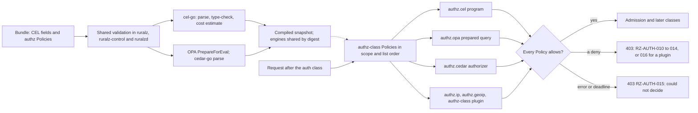

# ADR-0011: Expressions and authorization: CEL inline, OPA and Cedar engines, no Lua

## Context and problem statement

Ruralz needs small expressions in many fields, from Route `match.when` and Policy `when` to Rate Limit keys and `AIModel` candidates ([Allowed places](../architecture/02-configuration-model.md#allowed-places)), and authorization richer than one boolean: `authz.cel`, Planned (M1), and `authz.opa` and `authz.cedar`, Planned (M2), all Filter class `authz`, run in `onRequestHeaders` or `onRequestBody` and `failureMode: closed` only ([foundation pack section 10](../_meta/foundation-pack.md#10-policy-type-registry)).

Which expression language and which authorization engines run inside `CGO_ENABLED=0` binaries ([ADR-0001](0001-implementation-language-go.md)), with bounded cost, compiled once per Revision and validated identically by `ruralz`, `ruralz-control` and `ruralzd`? KrakenD ships CEL conditions and Lua scripting in both editions, but keeps Lua advanced helpers and its Security Policies Engine Enterprise-only ([source](https://www.krakend.io/features/)), and KrakenD CE 3.0 drops Go plugins ([source](https://www.krakend.io/blog/dropping-plugins-support-on-community/)). Nothing is implemented yet.

## Decision drivers

- **Bounded, typed evaluation**: no loops, I/O or randomness on the request path; static and runtime cost bounds (S4 in [Selection criteria](../engineering/01-tech-stack-and-libraries.md#selection-criteria)).
- **Gates G1 to G3**: pure Go, Apache-2.0-compatible license, Go Cryptographic Module only.
- **Compile once, read lock-free**: programs compile with the Revision, never per request ([System overview](../architecture/01-system-overview.md#design-principles)).
- **Validate everywhere**: errors surface in `ruralz bundle validate`, not as Node NACKs.
- **No request-path network hop** (P3), and authorization always fails closed (P9) ([Vision](../vision/01-vision-and-positioning.md#principles)).
- **One custom-code path**: arbitrary logic is a sandboxed Plugin (P6), not a second scripting runtime ([product non-goal 3](../vision/01-vision-and-positioning.md#product-non-goals)).
- **Free**: the Security Policies Engine equivalent ships in the one Apache-2.0 build (P1).

## Considered options

1. CEL inline through `cel.dev/cel-go`, plus OPA (`opa/v1/rego`) and Cedar (`cedar-go`) as pluggable authorization engines, and no Lua ([source](https://github.com/google/cel-go/blob/main/README.md)) ([source](https://github.com/open-policy-agent/opa/blob/main/v1/rego/rego.go)) ([source](https://github.com/cedar-policy/cedar-go/blob/main/README.md)).
2. CEL only, with every richer rule set written as a `plugin` Policy with `filterClass: authz` ([source](https://github.com/cel-expr/cel-go/releases/tag/v0.32.0)).
3. CEL plus an embedded Lua runtime for scripting, as KrakenD offers ([source](https://www.krakend.io/features/)).
4. OPA as an external decision service, such as a sidecar, queried per request instead of embedded ([source](https://github.com/open-policy-agent/opa/blob/main/v1/rego/rego.go)).
5. OPA embedded through the root `opa/rego` package instead of `opa/v1/rego` ([source](https://github.com/open-policy-agent/opa/blob/main/rego/rego.go)).

## Decision outcome

Chosen option: "CEL via cel-go, import path `cel.dev/cel-go`, inline; OPA (`opa/v1/rego`) and Cedar (`cedar-go`) as pluggable authz engines; no Lua", because CEL is typed, non-Turing-complete and offers `CostLimit` and `ContextEval` ([source](https://github.com/cel-expr/cel-go/blob/master/cel/options.go)); OPA's `PrepareForEval` yields a reusable in-process query ([source](https://github.com/open-policy-agent/opa/blob/main/v1/rego/rego.go)); and cedar-go ships the core Cedar authorizer ([source](https://github.com/cedar-policy/cedar-go/blob/main/README.md)). All three are Apache-2.0. This matches the foundation pack section 7 "Expressions / authz" row and the [Library catalog](../engineering/01-tech-stack-and-libraries.md#library-catalog). CEL SHOULD be the default authorization choice; OPA is the fallback for Cedar ([Authorization](../architecture/08-security-and-identity.md#authorization)). Rules:

| Surface | Rule | Planned |
|---|---|---|
| CEL module | `cel.dev/cel-go` v0.32.x; `github.com/google/cel-go` is a read-only alias that "will eventually be removed" ([source](https://github.com/google/cel-go/blob/main/README.md)), so it is a banned import | Planned (M1) |
| CEL places | Only the `x-ruralz-cel` fields, variables and runtime-error rules of [Allowed places](../architecture/02-configuration-model.md#allowed-places); standard library plus the strings and encoders extensions, with no side effects, I/O or randomness, so the v0.32.0 HMAC library stays off | Planned (M1) |
| CEL cost | An estimate above 10,000 units at nominal sizes (a string 256 bytes, a list or map 32 entries) is RZ-CFG-015 (target); the runtime cost limit stops evaluation at 1,000,000 units (target); typical expressions under 2 µs at p99 (target) ([Limits](../architecture/02-configuration-model.md#limits)) | Planned (M1) |
| `authz.cel` | `config.rule` is a bool over the base variables; false denies with 403 RZ-AUTH-010 | Planned (M1) |
| `authz.opa` | `opa/v1/rego`, prepared once per Policy per Revision; allowlisted pure built-ins only, so no `http.send`; a call deadline; 16 MiB of data per Policy (target); under 100 µs at p99 (hypothesis); a deny is 403 RZ-AUTH-011 | Planned (M2) |
| `authz.cedar` | cedar-go v1.8.x core authorizer; 1,000 policies and 10,000 entities per Policy (target); validation stops at parsing, since cedar-go lacks the schema validator; under 100 µs at p99 (hypothesis); a deny is 403 RZ-AUTH-012 | Planned (M2) |
| Engine memory | Identical engines compile once, by digest; per Revision at most 64 MiB of compiled engine memory and 50,000 entities (target), counted toward snapshot size; the rejection code is OQ-security-and-identity-30 | Planned (M2) |
| Engine configuration | `authz.opa` and `authz.cedar` `config` schemas are not yet registered; policy delivery is OQ-security-and-identity-13 | Planned (M2) |
| Failure | Every `authz.*` type is `failureMode: closed` only, and `open` is RZ-CFG-029; a runtime error or deadline, which leaves a Policy unable to decide, returns 403 RZ-AUTH-015 | Planned (M1) |
| Binaries | All three libraries link into `ruralzd`, `ruralz-control` and `ruralz` (size: OQ-tech-stack-and-libraries-22) | Planned (M1) |
| Lua | No Lua runtime in any binary; KrakenD Lua becomes CEL or a WASM Plugin, and `ruralz bundle import krakend` reports it for rewrite | Planned (M2) |

*Figure 1: CEL and the authorization engines compile with the Revision and evaluate in process; no decision leaves the Node.*

### Consequences

- Good, because every inline field uses one bounded, typed language that cannot loop or call out.
- Good, because CEL, Rego and Cedar errors appear in `ruralz bundle validate`, since the same libraries link into all three binaries ([Dependency graph](../engineering/01-tech-stack-and-libraries.md#dependency-graph)).
- Good, because teams reuse existing Rego or Cedar policies without a sidecar, and the counterpart of KrakenD's Enterprise-only Security Policies Engine is free (P1) ([source](https://www.krakend.io/features/)).
- Good, because dropping Lua leaves two extension paths, bounded CEL and sandboxed Plugins (P6).
- Bad, because three evaluators must be secured and upgraded, and OPA always counts against the `ruralzd` 160 MiB stripped binary budget (target).
- Bad, because cedar-go has had no commits since 2026-06-01 and lacks the schema validator, formatter, partial evaluation and templates ([source](https://github.com/cedar-policy/cedar-go/blob/main/README.md)); it sits on the [Watch list](../engineering/01-tech-stack-and-libraries.md#watch-list) with "OPA only; fork" as the fallback.
- Bad, because OPA v1 has no research evidence for gate G3 (OQ-tech-stack-and-libraries-9), so the FIPS build, Planned (M5), may need a named exception.
- Bad, because OPA and Cedar costs stay hypotheses until the Planned (M2) benchmarks, and their unregistered `config` schemas block authoring.
- Bad, because the static CEL bound rests on Ruralz's nominal-size estimator, since cel-go treats `dyn` values and unsized strings, lists and maps as unbounded.
- Bad, because KrakenD Lua scripts never import automatically; each needs a rewrite as CEL or a Plugin.

### Confirmation

- **Banned imports**, Planned (M0): depguard rejects `github.com/google/cel-go` ([Banned imports](../engineering/02-repository-layout-and-conventions.md#banned-imports)) and any Lua runtime ("No `plugin` standard package, no Lua" in [Import boundaries](../engineering/02-repository-layout-and-conventions.md#import-boundaries)).
- **Dependency admission**, Planned (M0): the G1 cross-build, the license gate and the `go list -deps` G3 check cover cel-go, OPA and cedar-go; both catalog rows cite this ADR, and "Embedded Lua" is listed "Never" under [Alternatives not chosen](../engineering/01-tech-stack-and-libraries.md#alternatives-not-chosen).
- **Fuzzing**, Planned (M1): the "CEL compile and cost estimator" target checks that actual cost stays within the static estimate and that capped inputs stop at the runtime limit ([Fuzzing](../engineering/03-testing-and-quality-strategy.md#fuzzing)).
- **Configuration conformance suite**, Planned (M1): the golden corpus, including the `authz-orders` rule, passes RZ-CFG-015; negative fixtures cover RZ-CFG-014, RZ-CFG-015 and `failureMode: open` on an `authz.*` Policy (RZ-CFG-029).
- **Benchmarks**, Planned (M1) for CEL and Planned (M2) for `authz.opa` and `authz.cedar`: microbenchmarks report against the per-call budgets in [Performance budgets and benchmarking](../architecture/12-performance-budgets-and-benchmarking.md); a miss reopens this ADR.
- **Review checklist item**: a pull request that adds an expression language, a policy engine, a CEL extension or an OPA built-in to the allowlist MUST amend this ADR.

## Pros and cons of the options

### CEL inline with OPA and Cedar engines

- Good, because the engines add data-driven and entity-based models in process ([source](https://github.com/open-policy-agent/opa/blob/main/v1/rego/rego.go)).
- Bad, because it links three evaluators and depends on an idle cedar-go ([source](https://github.com/cedar-policy/cedar-go)).

### CEL only

- Good, because it links one evaluator, and cel-go's policy package already offers a YAML rule format ([source](https://github.com/google/cel-go/blob/main/policy/README.md)).
- Bad, because large shared rule sets would move into Plugins, which wazero cannot meter by instruction ([source](https://github.com/wazero/wazero/issues/422)), and existing Rego or Cedar policies could not be reused.

### CEL plus embedded Lua

- Good, because KrakenD configurations that use Lua would import more directly ([source](https://www.krakend.io/features/)).
- Bad, because Lua is Turing-complete with no static cost bound, duplicates the sandboxed Plugin path, and no Go Lua runtime has been researched, so none may be named (foundation pack section 7).

### OPA as an external decision service

- Good, because OPA and its data would live outside `ruralzd`.
- Bad, because every decision adds a remote call before commit, against P3, while embedding already gives prepared in-process queries ([source](https://github.com/open-policy-agent/opa/blob/main/v1/rego/rego.go)).

### Root `opa/rego` package

- Good, because older OPA examples use it.
- Bad, because it is deprecated and kept only for the v0.x transition "for the lifetime of OPA v1.x" ([source](https://github.com/open-policy-agent/opa/blob/main/rego/rego.go)).

## More information

- Owning document: [Security and identity](../architecture/08-security-and-identity.md#authorization) owns engine guidance, limits and the `RZ-AUTH` codes; [CEL expressions and allowed places](../architecture/02-configuration-model.md#cel-expressions-and-allowed-places) owns CEL fields, variables and limits; catalog rows: [Tech stack and libraries](../engineering/01-tech-stack-and-libraries.md#library-catalog), [foundation pack section 7](../_meta/foundation-pack.md#7-technology-decisions-fixed-details-in-docsengineering01-tech-stack-and-librariesmd-and-adrs).
- Related decisions: [ADR-0005](0005-plugin-abi-v1.md) (Plugin ABI v1, the other custom-logic path), [ADR-0004](0004-wasm-runtime-wazero.md) (the Plugin runtime), [ADR-0003](0003-configuration-format.md) (the `x-ruralz-cel` schema keyword) and [ADR-0014](0014-ai-api-surface.md) (`AIModel` candidate `when`).
- Proposed amendments: Security and identity SHOULD extend OQ-security-and-identity-18 to the `authz.opa` and `authz.cedar` `config` schemas and to the input both engines receive (proposed: the base CEL variables `request`, `source`, `route`, `consumer`, `auth` and `now`). Repository layout and conventions SHOULD ban the root `opa/rego` import and confine OPA and cedar-go to one wrapper package in `internal/` (S7). Testing and quality strategy SHOULD add Rego and Cedar parse fuzz targets.
- Not evaluated: expr-lang, a catalog alternative with no research entry.
- Revisit if cedar-go hits its watch-list trigger, OPA fails the G3 check, or a per-call budget misses.
