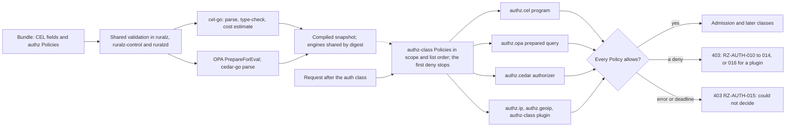

# ADR-0011: Expressions and authorization: CEL inline, OPA and Cedar engines, no Lua

## Context and problem statement

Ruralz needs small expressions in many fields ([Allowed places](../architecture/02-configuration-model.md#allowed-places)) and authorization richer than one boolean: `authz.cel`, Planned (M1), and `authz.opa` and `authz.cedar`, Planned (M2), all Filter class `authz` and `failureMode: closed` only ([foundation pack section 10](../_meta/foundation-pack.md#10-policy-type-registry)).

Which expression language and authorization engines run inside `CGO_ENABLED=0` binaries ([ADR-0001](0001-implementation-language-go.md)) with bounded cost, compiled once per Revision and validated identically everywhere? KrakenD ships CEL and Lua in both editions but keeps its Security Policies Engine Enterprise-only ([source](https://www.krakend.io/features/)).

## Decision drivers

- **Bounded, typed evaluation**: no loops, I/O or randomness on the request path; static and runtime cost bounds (S4 in [Selection criteria](../engineering/01-tech-stack-and-libraries.md#selection-criteria)).
- **Gates G1 to G3**: pure Go, Apache-2.0-compatible license, Go Cryptographic Module only.
- **Compile once, read lock-free**: programs compile with the Revision and evaluate without read locks ([System overview](../architecture/01-system-overview.md#design-principles)).
- **Validate everywhere**: inline policies fail in `ruralz bundle validate`; with OCI delivery (OQ-security-and-identity-13) they fail at Ruralz Control ingest or as a Node NACK.
- **No extra request-path hop**: P3 allows only declared, timed remote calls ([pack section 8.7](../_meta/foundation-pack.md#87-state-store-round-trips)), and authorization always fails closed (P9) ([Vision](../vision/01-vision-and-positioning.md#principles)).
- **One custom-code path**: arbitrary logic is a sandboxed Plugin (P6), not a second scripting runtime ([product non-goal 3](../vision/01-vision-and-positioning.md#product-non-goals)).
- **Free**: the Security Policies Engine equivalent ships in every public build, FIPS included (P1).

## Considered options

1. **CEL inline with OPA and Cedar engines**, and no Lua ([source](https://github.com/cel-expr/cel-go)) ([source](https://github.com/open-policy-agent/opa/blob/main/v1/rego/rego.go)) ([source](https://github.com/cedar-policy/cedar-go/blob/main/README.md)).
2. **CEL only**: richer rules become `authz`-class `plugin` Policies ([source](https://github.com/google/cel-go/blob/main/policy/README.md)).
3. **CEL plus embedded Lua**, as KrakenD offers ([source](https://www.krakend.io/features/)).
4. **OPA as an external decision service**, such as a sidecar.
5. **Root `opa/rego` package** instead of `opa/v1/rego` ([source](https://github.com/open-policy-agent/opa/blob/main/rego/rego.go)).

## Decision outcome

Chosen option: "CEL via cel-go, import path `cel.dev/cel-go`, inline; OPA (`opa/v1/rego`) and Cedar (`cedar-go`) as pluggable authz engines; no Lua" (option 1), because CEL is typed, non-Turing-complete and offers `CostLimit` and `ContextEval` ([source](https://github.com/cel-expr/cel-go/blob/master/cel/options.go)); OPA's `PrepareForEval` yields a reusable in-process query ([source](https://github.com/open-policy-agent/opa/blob/main/v1/rego/rego.go)); and cedar-go ships the core Cedar authorizer ([source](https://github.com/cedar-policy/cedar-go/blob/main/README.md)). All three are Apache-2.0 ([Library catalog](../engineering/01-tech-stack-and-libraries.md#library-catalog)). CEL SHOULD come first, with OPA the fallback for Cedar ([Authorization](../architecture/08-security-and-identity.md#authorization)). Rules:

| Surface | Rule | Planned |
|---|---|---|
| CEL module | `cel.dev/cel-go` v0.32.x; the read-only alias `github.com/google/cel-go` "will eventually be removed" ([source](https://github.com/google/cel-go/blob/main/README.md)), so it is banned | Planned (M1) |
| CEL places | The fields, variables and runtime-error rules of [Allowed places](../architecture/02-configuration-model.md#allowed-places); standard library plus strings and encoders extensions only (no v0.32.0 HMAC library) | Planned (M1) |
| CEL cost | An estimate above 10,000 units at nominal sizes is RZ-CFG-015 (target); `CostLimit` stops evaluation at 1,000,000 units (target), and `ContextEval` at the request deadline ([Limits](../architecture/02-configuration-model.md#limits)) | Planned (M1) |
| `authz.cel` | `config.rule` is a bool over the base variables; false denies with 403 RZ-AUTH-010 | Planned (M1) |
| `authz.opa` | `opa/v1/rego`, prepared per Policy and Revision; allowlisted pure built-ins only, so no `http.send`; data is an immutable per-Revision document served by a Ruralz `storage.Store` whose read transactions take no lock, never `storage/inmem`; `Eval` runs on the request goroutine with a context deadline of the smaller of the time left in the request and 5 ms (target), and a Planned (M2) spike confirms topdown stops at the deadline; 16 MiB of data per Policy in canonical bytes (target); under 100 µs at p99 (hypothesis); a deny is 403 RZ-AUTH-011 | Planned (M2) |
| `authz.cedar` | cedar-go v1.8.x core authorizer, evaluated synchronously on the request goroutine and never abandoned; cedar-go takes no context, so only the policy and entity caps bound it: 1,000 policies and 10,000 entities per Policy (target); validation stops at parsing; under 100 µs at p99 (hypothesis); a deny is 403 RZ-AUTH-012 | Planned (M2) |
| Engine memory | Identical engines compile once, by digest, across Revisions; per Revision at most 64 MiB of compiled engine memory and 50,000 entities (target), counted toward snapshot size. That memory is a deterministic estimate: the canonical bytes of Rego modules, data documents, Cedar policies and entities times an expansion factor of 4 (hypothesis, calibrated by the Planned (M2) benchmarks), so every binary computes the same value; measured heap is only a metric. `ruralz bundle validate` rejects a violation (code: OQ-security-and-identity-30), or, with OCI delivery, Ruralz Control ingest and Node activation (NACK) | Planned (M2) |
| Engine configuration | Engine `config` schemas are unregistered; policy delivery is OQ-security-and-identity-13 | Planned (M2) |
| Failure | Every `authz.*` type is `failureMode: closed` only (`open` is RZ-CFG-029); a runtime error or deadline, leaving a Policy unable to decide, is 403 RZ-AUTH-015 | Planned (M1) |
| Binaries | cel-go links into `ruralzd`, `ruralz-control` and `ruralz`, Planned (M1); OPA and cedar-go join all three with `authz.opa` and `authz.cedar`, Planned (M2) (size: OQ-tech-stack-and-libraries-22) | Planned (M1); Planned (M2) |
| Lua | No Lua runtime; `ruralz bundle import krakend` reports KrakenD Lua as `manual`, for rewrite as CEL or a WASM Plugin | Planned (M2) |

*Figure 1: CEL and the engines compile with the Revision and decide on the Node.*

### Consequences

- Good, because every inline field uses one bounded, typed language that cannot loop or call out.
- Good, because errors in CEL, and in inline Rego and Cedar, appear in `ruralz bundle validate`, since all three binaries link the same libraries ([Dependency graph](../engineering/01-tech-stack-and-libraries.md#dependency-graph)).
- Good, because teams reuse Rego or Cedar policies without a sidecar, and the counterpart of KrakenD's Enterprise-only Security Policies Engine is free (P1) ([source](https://www.krakend.io/features/)).
- Good, because dropping Lua leaves two extension paths, bounded CEL and sandboxed Plugins (P6).
- Bad, because only CEL fully meets S4: OPA has a deadline but no cost or allocation limit, and cedar-go has neither.
- Bad, because three evaluators must be secured and upgraded, and OPA counts against the `ruralzd` 160 MiB stripped binary budget (target).
- Bad, because cedar-go is idle since 2026-06-01 and lacks the schema validator, formatter, partial evaluation and templates ([source](https://github.com/cedar-policy/cedar-go/blob/main/README.md)); its [Watch list](../engineering/01-tech-stack-and-libraries.md#watch-list) fallback is "OPA only; fork".
- Bad, because OPA v1 lacks G3 evidence (OQ-tech-stack-and-libraries-9), so the FIPS build, Planned (M5), may need a named exception.
- Bad, because OPA and Cedar costs stay hypotheses until the Planned (M2) benchmarks, and unregistered `config` schemas block authoring.
- Bad, because the static CEL bound rests on Ruralz's nominal-size estimator for `dyn` and unsized values.

### Confirmation

- **Banned imports**, Planned (M0): depguard rejects `github.com/google/cel-go` and any Lua runtime ([Banned imports](../engineering/02-repository-layout-and-conventions.md#banned-imports), [Import boundaries](../engineering/02-repository-layout-and-conventions.md#import-boundaries)).
- **Dependency admission**, Planned (M0): the G1 cross-build, license gate and `go list -deps` G3 check cover all three libraries, and "Embedded Lua" is "Never" under [Alternatives not chosen](../engineering/01-tech-stack-and-libraries.md#alternatives-not-chosen).
- **Fuzzing**, Planned (M1): the "CEL compile and cost estimator" target checks that actual cost stays within the static estimate and capped inputs stop at the runtime limit ([Fuzzing](../engineering/03-testing-and-quality-strategy.md#fuzzing)).
- **Configuration conformance suite**, Planned (M1): the golden corpus, including the `authz-orders` rule, passes RZ-CFG-015; negative fixtures cover RZ-CFG-014, RZ-CFG-015 and RZ-CFG-029. Planned (M2) fixtures in all three binaries: Rego calling `http.send`, `net.lookup_ip_addr`, `time.now_ns`, `rand.intn` or `uuid.rfc4122` fails compilation, and a Bundle at the engine ceiling gets one verdict.
- **Benchmarks**, Planned (M1) for CEL, Planned (M2) for the engines: microbenchmarks, with worst-case fixtures at the caps, report against the per-call budgets in [Performance budgets and benchmarking](../architecture/12-performance-budgets-and-benchmarking.md); `authz.opa` throughput scales linearly from 1 to 32 GOMAXPROCS (target); a miss reopens this ADR.
- **Review checklist item**: a pull request that adds an expression language, policy engine, CEL extension or allowlisted OPA built-in MUST amend this ADR.

## Pros and cons of the options

### CEL inline with OPA and Cedar engines

- Good, because the engines add data-driven and entity-based models in process ([source](https://github.com/open-policy-agent/opa/blob/main/v1/rego/rego.go)).
- Bad, because it links three evaluators and depends on an idle cedar-go ([source](https://github.com/cedar-policy/cedar-go)).

### CEL only

- Good, because it links one evaluator, and cel-go's policy package offers a YAML rule format ([source](https://github.com/google/cel-go/blob/main/policy/README.md)).
- Bad, because shared rule sets would move into Plugins, which wazero cannot meter by instruction ([source](https://github.com/wazero/wazero/issues/422)), and existing Rego or Cedar policies could not be reused.

### CEL plus embedded Lua

- Good, because KrakenD Lua configurations would import more directly ([source](https://www.krakend.io/features/)).
- Bad, because Lua is Turing-complete with no static cost bound, duplicates the Plugin path, and no Go Lua runtime has been researched.

### OPA as an external decision service

- Good, because OPA and its data would live outside `ruralzd`.
- Bad, because each decision adds a declared, timed remote call before commit ([pack section 8.7](../_meta/foundation-pack.md#87-state-store-round-trips)) that fails closed, while embedding gives prepared in-process queries ([source](https://github.com/open-policy-agent/opa/blob/main/v1/rego/rego.go)).

### Root `opa/rego` package

- Good, because older OPA examples use it.
- Bad, because it is deprecated and kept only for the v0.x transition "for the lifetime of OPA v1.x" ([source](https://github.com/open-policy-agent/opa/blob/main/rego/rego.go)).

## More information

- Owners: [Security and identity](../architecture/08-security-and-identity.md#authorization) (engines, limits, `RZ-AUTH` codes) and [CEL expressions and allowed places](../architecture/02-configuration-model.md#cel-expressions-and-allowed-places) (CEL fields, variables, limits).
- Related: [ADR-0003](0003-configuration-format.md), [ADR-0004](0004-wasm-runtime-wazero.md), [ADR-0005](0005-plugin-abi-v1.md) and [ADR-0014](0014-ai-api-surface.md).
- Proposed amendments: Security and identity SHOULD extend OQ-security-and-identity-18 to the `authz.opa` and `authz.cedar` `config` schemas and to the engines' input (proposed: the base CEL variables), adopt the deterministic engine-memory estimate, and add a Cedar entity ancestor-depth cap (target) with a Revision-time transitive-closure precompute for `in`. Repository layout and conventions SHOULD ban the root `opa/rego` import and confine OPA and cedar-go to one `internal/` wrapper package (S7). Testing and quality strategy SHOULD add Rego and Cedar parse fuzz targets.
- Research action: extend [research section 9.2](../_meta/research/go-libraries-runtime.md#92-opa-v1-go-embedding) to confirm OPA v1.20.x transaction behavior for prepared queries and topdown deadline handling.
- Not evaluated: expr-lang (no research entry).
- Revisit if cedar-go hits its watch-list trigger, OPA fails the G3 check, or a per-call budget misses.
