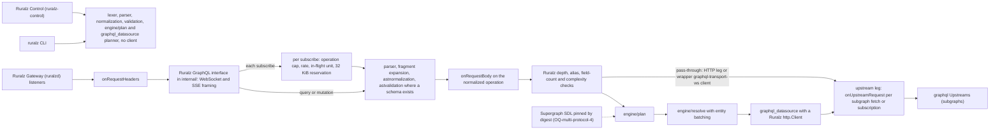

# ADR-0012: GraphQL engine: wundergraph/graphql-go-tools v2

## Context and problem statement

Ruralz Gateway (`ruralzd`) serves GraphQL through `Route.spec.match.graphql` and `Upstream.spec.protocol: graphql` ([Configuration model](../architecture/02-configuration-model.md#route)), Planned (M3). [Multi-protocol](../architecture/07-multi-protocol.md#graphql) defines pass-through, forwarding each operation to one `graphql` Upstream, and federation, planning across subgraph Upstreams. Clients subscribe over `graphql-transport-ws`, `graphql-ws` or SSE; subgraphs over `graphql-transport-ws`.

Which Go library parses, validates, plans and resolves these operations inside a `CGO_ENABLED=0` binary ([ADR-0001](0001-implementation-language-go.md)), while the Router, Filter Chain and buffer accounting stay Ruralz code? Federation is part of the multi-protocol differentiator.

## Decision drivers

- **Federation versions 1 and 2 and subscriptions** from one engine (foundation pack section 7).
- **A library, not a server**, so GraphQL keeps its Filter Chain Phase mapping (P7, [Vision](../vision/01-vision-and-positioning.md#principles)).
- **Runtime configuration**: a Revision, not a rebuilt binary, carries Routes and subgraph and supergraph schemas (declaration: OQ-multi-protocol-4); Hot Reload activates it (P5).
- **Gates G1 to G3** and criteria S1 to S4, S6 and S7 ([Selection criteria](../engineering/01-tech-stack-and-libraries.md#selection-criteria)); S3 and S4 also govern the upstream seam.
- **Shared validation**: all three binaries report the same GraphQL errors, in `ruralz bundle validate` rather than as Node NACKs ([Configuration model](../architecture/02-configuration-model.md#validation-and-diff-semantics)).
- **Bounded memory**: events and subgraph bodies are reserved from Gateway `limits.maxBufferedBytes`, and a request's subgraph bodies together fit `maxResponseBodyBytes` ("Bounded everything", [System overview](../architecture/01-system-overview.md#design-principles)).

## Considered options

1. `github.com/wundergraph/graphql-go-tools/v2`: lexer through planner and resolver, with a federation-aware datasource ([source](https://github.com/wundergraph/graphql-go-tools)) ([source](https://github.com/wundergraph/graphql-go-tools/tree/master/v2)).
2. `99designs/gqlgen`, a schema-first code-generation server framework ([source](https://github.com/99designs/gqlgen)).
3. `movio/bramble`, a federation gateway ([source](https://github.com/movio/bramble)).
4. `graphql-go/graphql`, a port of graphql-js ([source](https://github.com/graphql-go/graphql)).
5. An external GraphQL router as a `graphql` Upstream.
6. No engine: GraphQL forwarded as plain HTTP under HTTP-level Policies.

## Decision outcome

Chosen option: "`github.com/wundergraph/graphql-go-tools/v2` engine (federation versions 1 and 2, subscriptions)", because it is the only researched Go library that plans federation versions 1 and 2 with batched entity calls and supports subscriptions ([source](https://github.com/wundergraph/graphql-go-tools)), and it "is not a GraphQL server by itself" ([source](https://github.com/wundergraph/graphql-go-tools/tree/master/v2)). It matches foundation pack section 7. Rules:

| Surface | Rule | Planned |
|---|---|---|
| Module | v2 only, v2.22.x floor; v1 is "deprecated and retracted" ([source](https://github.com/wundergraph/graphql-go-tools)) | Planned (M3) |
| `ruralzd` | Lexer, parser, `astnormalization`, `astvalidation`, `engine/plan`, `engine/resolve` and `graphql_datasource` behind one `internal/` interface (S7); never `subscription`, since Ruralz frames client subscriptions | Planned (M3) |
| `ruralz-control`, `ruralz` | Lexer, parser, normalization and validation packages, plus `engine/plan` and the `graphql_datasource` planner, built with no HTTP or subscription client, so supergraph planning errors appear in `ruralz bundle validate`; never `engine/resolve` or `subscription`. A spike confirms planning runs without a client; else those errors surface as Node NACKs under option (b) of OQ-tech-stack-and-libraries-22, and these binaries drop `engine/plan` and `graphql_datasource` | Planned (M3) |
| Federation | Would plan against a supergraph SDL composed outside Ruralz and pinned by digest, the proposed option (c) of OQ-multi-protocol-4, since v2 has no composition package; no Configuration model field declares it yet | Planned (M3) |
| Limits | Depth and alias limits in both modes, field count in pass-through and complexity in federation, run per operation after fragment expansion and before any upstream call, with Multi-protocol defaults (settings: OQ-multi-protocol-5). Until a pass-through schema source exists, pass-through expands fragments itself and skips schema validation | Planned (M3) |
| Transport | The `internal/` wrapper frames graphql-transport-ws and graphql-ws over coder/websocket and SSE over `net/http`. Each `subscribe` first passes the per-session operation cap and rate, an in-flight unit and a 32 KiB reservation (target), then parse, normalization, `onRequestBody`, limits and its mode's upstream path; a denial is an `error` for that operation id, keeping the socket (OQ-multi-protocol-17) | Planned (M3) |
| GraphQL upstream seam | `graphql_datasource` fetches and subgraph subscription upgrades use a Ruralz-supplied `http.Client` per upstream leg, whose transport runs the leg Phases, takes an in-flight unit per fetch and reserves response bytes from `maxBufferedBytes`. A spike confirms the engine accepts that client for both paths and keeps one subgraph subscription per operation, never shared across Consumers; else subgraph subscriptions wait on OQ-multi-protocol-12 | Planned (M3) |
| GraphQL pass-through upstream | Queries and mutations use an HTTP upstream leg; each admitted `subscribe` dials its own `graphql-transport-ws` socket through a coder/websocket client in the `internal/` wrapper over the leg's Ruralz `http.Client`, so `onUpstreamRequest` runs per subscription. The wrapper translates `graphql-ws` client frames and holds each event under the 1 MiB chunk cap (target); socket sharing per session: OQ-multi-protocol-12 | Planned (M3) |
| GraphQL module floor | Explicit `require` of `gorilla/websocket` v1.5.3 over the v1.5.1 pin ([source](https://pkg.go.dev/vuln/GO-2026-6278)), in the pull request that first adds graphql-go-tools to `go.mod` | Planned (M3) |

*Figure 1: packages each binary links, and where each operation meets the Filter Chain.*

### Consequences

- Good, because one engine covers pass-through, federation versions 1 and 2 and subgraph subscriptions, and its validation packages run in all three binaries.
- Good, because Ruralz keeps listeners, the Router, the Filter Chain and client framing, and every upstream fetch and subscription gets upstream-leg Phases ([applicability](../architecture/07-multi-protocol.md#filter-chain-applicability-per-protocol)).
- Good, because it is MIT-licensed, its v2 `go.mod` declares `go 1.25.0` with no C dependencies ([source](https://raw.githubusercontent.com/wundergraph/graphql-go-tools/master/v2/go.mod)), it tagged seven releases in 14 days ([source](https://github.com/wundergraph/graphql-go-tools/releases)) so it passes G2, S1 and S2 (G1 and G3: Confirmation).
- Bad, because paying WunderGraph customers steer its features ([source](https://github.com/wundergraph/graphql-go-tools)), and that pace suggests API churn, which the S7 wrapper absorbs under the [Update policy](../engineering/01-tech-stack-and-libraries.md#update-policy).
- Bad, because it pins `gorilla/websocket` v1.5.1, inside the GO-2026-6278 range ([source](https://pkg.go.dev/vuln/GO-2026-6278)), beside coder/websocket: an accepted S6 exception ([Selection criteria](../engineering/01-tech-stack-and-libraries.md#selection-criteria)) that OQ-tech-stack-and-libraries-6 does not yet cover.
- Bad, because it has no composition package ([source](https://github.com/wundergraph/graphql-go-tools/tree/master/v2)), so federation waits on OQ-multi-protocol-4, and planning checks add `engine/plan` and `graphql_datasource`, which imports gorilla/websocket, to Ruralz Control and the CLI (size: OQ-tech-stack-and-libraries-22).
- Bad, because the engine holds each event whole, so each is reserved as a chunk up to 1 MiB (target) even without `onChunk` ([Subscriptions](../architecture/07-multi-protocol.md#subscriptions)); the subgraph read limit is unresearched (OQ-multi-protocol-12).
- Bad, because `ruralzd` always links it, adding to its 160 MiB stripped budget (target) even on Nodes serving no GraphQL.
- Bad, because its `go.mod` requires `connectrpc.com/connect` v1.19.2 against Ruralz's v1.21.x, a pairing its authors did not pin (hypothesis: compatible; the gRPC and GraphQL conformance suites check it).

### Confirmation

- **Dependency admission**, Planned (M0): the GraphQL catalog row cites this ADR, and a depguard rule banning `github.com/99designs/gqlgen`, `github.com/movio/bramble` and `github.com/graphql-go/graphql` (proposed below) fails any pull request importing them.
- **G1 cross-build, G3 crypto denylist and license gate**, Planned (M0), plus the FIPS CI job, Planned (M5): confirm pure Go, Go-module-only cryptography and MIT over all three binaries' linked sets, including graphql-go-tools.
- **GraphQL module floor**, Planned (M3): the `gorilla/websocket` v1.5.3 `require` above; `govulncheck` on every pull request, Planned (M0), blocks a reachable GO-2026-6278 ([Version floors](../engineering/01-tech-stack-and-libraries.md#version-floors-from-advisories)).
- **Protocol conformance suite** in `pr-full`, Planned (M3) ([Conformance suites](../engineering/03-testing-and-quality-strategy.md#conformance-suites)): federation versions 1 and 2, all three subscription transports, pass-through subscriptions including from a `graphql-ws` client, and limit rejections. Every subgraph or pass-through fetch and subscription dial emits a `ruralz.upstream.<name>` span and runs `onUpstreamRequest`; an oversized subgraph body is rejected with its reservation released; a denied `subscribe` gets an `error` for its operation id while the socket stays open.
- **CI size check**, Planned (M1): reports `ruralzd` against its binary budget.
- **Review checklist item**: a pull request that adds another GraphQL library, imports the `subscription` package, or exceeds the `ruralz-control`, `ruralz` row's package set or builds an HTTP or subscription client there, MUST amend this ADR.

## Pros and cons of the options

### graphql-go-tools v2

- Good, because it is federation-aware, subscription-capable and built for gateways ([source](https://github.com/wundergraph/graphql-go-tools/tree/master/v2)).
- Bad, because of the costs under Consequences.

### gqlgen

- Good, because it is active (v0.17.95) with a federation plugin ([source](https://github.com/99designs/gqlgen/releases)).
- Bad, because it generates code from a schema at build time ([source](https://github.com/99designs/gqlgen)), so a Revision's schema would need a rebuild, breaking P5.

### bramble

- Good, because it is a stateless federation gateway with hot reload ([source](https://github.com/movio/bramble)).
- Bad, because it uses its own federation specification, has no subscriptions and shares no unions, interfaces, scalars, enums or inputs across services ([source](https://github.com/movio/bramble)).

### graphql-go

- Good, because it supports queries, mutations and subscriptions ([source](https://github.com/graphql-go/graphql)).
- Bad, because it has no tag since v0.8.1 on 2023-04-10, older versions carry GO-2022-0942 ([source](https://pkg.go.dev/github.com/graphql-go/graphql?tab=versions)), and it documents no federation.

### External GraphQL router as an Upstream

- Good, because Ruralz would link no GraphQL engine.
- Bad, because subgraph calls would bypass the Filter Chain, breaking P7, operators would run a second product, and no router license was researched.

### Opaque HTTP pass-through

- Good, because it adds no dependency.
- Bad, because it gives up federation and subscriptions, and `match.graphql` and the limits still need a parser.

## More information

- Owning document: [Multi-protocol](../architecture/07-multi-protocol.md#engine).
- Related decisions: [ADR-0001](0001-implementation-language-go.md), [ADR-0009](0009-http-stack-net-http-quic-go.md) and [ADR-0013](0013-messaging-client-libraries.md).
- Proposed amendments:
  - [Repository layout and conventions](../engineering/02-repository-layout-and-conventions.md#banned-imports) SHOULD add depguard rules: graphql-go-tools only in one wrapper package; Ruralz Control and the CLI limited to their Decision outcome package set; `subscription` nowhere; gqlgen, bramble and graphql-go banned.
  - Tech stack and libraries SHOULD align its GraphQL catalog row and Figure 2 with this package set, watch graphql-go-tools (trigger: an unfixed advisory or license change; fallback: a fork), extend OQ-tech-stack-and-libraries-22 to supergraph planning, and widen OQ-tech-stack-and-libraries-6 to gorilla/websocket.
  - Multi-protocol SHOULD widen OQ-multi-protocol-4 to a pass-through schema source, if pass-through validates operations against one; this ADR names no field.
  - Testing and quality strategy SHOULD add a GraphQL parser and normalizer fuzz target.
- Revisit if the engine drops a federation version, changes license, or adds a composition package.
