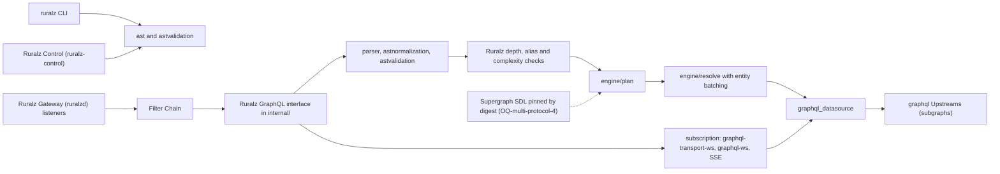

# ADR-0012: GraphQL engine: wundergraph/graphql-go-tools v2

## Context and problem statement

Ruralz Gateway (`ruralzd`) serves GraphQL through `Route.spec.match.graphql` and `Upstream.spec.protocol: graphql` ([Configuration model](../architecture/02-configuration-model.md#route)), Planned (M3). [Multi-protocol](../architecture/07-multi-protocol.md#graphql) defines two modes: pass-through, which forwards each operation to one `graphql` Upstream under depth, alias and field-count limits, and federation, which plans one operation across subgraph Upstreams. Clients subscribe over `graphql-transport-ws`, `graphql-ws` or SSE, and subgraphs are reached over `graphql-transport-ws`.

Which Go library parses, validates, plans and resolves these operations inside a `CGO_ENABLED=0` binary ([ADR-0001](0001-implementation-language-go.md)), while the Router, Filter Chain and buffer accounting stay Ruralz code? GraphQL federation is part of the multi-protocol native differentiator: KrakenD has no GraphQL federation in either edition ([source](https://www.krakend.io/features/)). Kong documents only an Enterprise GraphQL rate-limiting plugin ([source](https://developer.konghq.com/plugins/graphql-rate-limiting-advanced/)). APISIX 3.17 added `graphql-limit-count` and `graphql-proxy-cache` ([source](https://raw.githubusercontent.com/apache/apisix/master/CHANGELOG.md)). Tyk documents Federation v1 and subscriptions, with Federation v2 undocumented ([source](https://tyk.io/docs/api-management/graphql)). Nothing is implemented yet.

## Decision drivers

- **Federation versions 1 and 2 and subscriptions** from one engine, since foundation pack section 7 fixes both.
- **A library, not a server**, so GraphQL maps onto the same `Route`, `Policy` and Filter Chain model through the documented Phase mapping (P7, [Vision](../vision/01-vision-and-positioning.md#principles)).
- **Runtime configuration**: a Revision, not a rebuilt binary, carries schemas and Routes, and Hot Reload activates it (P5).
- **Gates G1 to G3** and criteria S1, S2, S6 and S7 ([Selection criteria](../engineering/01-tech-stack-and-libraries.md#selection-criteria)).
- **Shared validation**: `ruralz`, `ruralz-control` and `ruralzd` report the same GraphQL errors ([Configuration model](../architecture/02-configuration-model.md#validation-and-diff-semantics)).
- **Bounded memory**: events and subgraph bodies are reserved from `maxBufferedBytes`, per the "Bounded everything" rule of [System overview](../architecture/01-system-overview.md#design-principles).

## Considered options

1. `github.com/wundergraph/graphql-go-tools/v2`: lexer, parser, AST, validation, normalization, query planner, resolver and a federation-aware datasource ([source](https://github.com/wundergraph/graphql-go-tools)) ([source](https://github.com/wundergraph/graphql-go-tools/tree/master/v2)).
2. `99designs/gqlgen`, a schema-first code-generation server framework ([source](https://github.com/99designs/gqlgen)).
3. `movio/bramble`, a federation gateway with its own specification rather than Apollo Federation ([source](https://github.com/movio/bramble)).
4. `graphql-go/graphql`, a port of graphql-js ([source](https://github.com/graphql-go/graphql)).
5. An external GraphQL router as a `graphql` Upstream, such as WunderGraph Cosmo Router, itself built on graphql-go-tools ([source](https://raw.githubusercontent.com/wundergraph/cosmo/main/router/go.mod)).
6. No engine: GraphQL forwarded as plain HTTP under HTTP-level Policies only, with no federation, as in KrakenD ([source](https://www.krakend.io/features/)).

## Decision outcome

Chosen option: "`github.com/wundergraph/graphql-go-tools/v2` engine (federation versions 1 and 2, subscriptions)", because it is the only researched Go library that plans federation versions 1 and 2 with batched entity calls and serves subscriptions over graphql-ws, graphql-transport-ws and SSE ([source](https://github.com/wundergraph/graphql-go-tools)), and it states that it "is not a GraphQL server by itself" but a library for routers and gateways ([source](https://github.com/wundergraph/graphql-go-tools/tree/master/v2)). This matches the foundation pack section 7 GraphQL row and the [Library catalog](../engineering/01-tech-stack-and-libraries.md#library-catalog). Rules:

| Surface | Rule | Planned |
|---|---|---|
| Module | v2 only, v2.22.x floor; v1 is "deprecated and retracted" ([source](https://github.com/wundergraph/graphql-go-tools)) | Planned (M3) |
| `ruralzd` | Parser, `astnormalization`, `astvalidation`, `engine/plan`, `engine/resolve`, `graphql_datasource` and the `subscription` package, behind one Ruralz interface in `internal/` (S7) | Planned (M3) |
| `ruralz-control`, `ruralz` | `ast` and `astvalidation` only, so schema and operation errors appear in `ruralz bundle validate` | Planned (M3) |
| Federation | Plans against a supergraph SDL composed outside Ruralz and pinned by digest, since v2 has no composition package (OQ-multi-protocol-4) | Planned (M3) |
| Limits | Depth, alias and complexity checks run per normalized operation before any subgraph call, with the Multi-protocol defaults; settings are OQ-multi-protocol-5 | Planned (M3) |
| Transport | Ruralz listeners terminate client connections and hand operations to the engine; each subgraph fetch is an upstream leg running `onUpstreamRequest` | Planned (M3) |
| Advisory floor | Explicit `require` of `gorilla/websocket` v1.5.3 over the v1.5.1 pin ([source](https://pkg.go.dev/vuln/GO-2026-6278)) | Planned (M0) |

*Figure 1: which graphql-go-tools packages each binary links, and where the engine sits on the request path.*

### Consequences

- Good, because one engine covers pass-through, federation versions 1 and 2 and subscriptions, and the same `ast` and `astvalidation` packages run in all three binaries ([Tech stack](../engineering/01-tech-stack-and-libraries.md#dependency-graph)).
- Good, because the library leaves listeners, the Router and the Filter Chain to Ruralz, so each subgraph fetch runs its upstream-leg Phases ([Filter Chain applicability](../architecture/07-multi-protocol.md#filter-chain-applicability-per-protocol)).
- Good, because it is MIT-licensed, its v2 `go.mod` declares `go 1.25.0` with no C dependencies ([source](https://raw.githubusercontent.com/wundergraph/graphql-go-tools/master/v2/go.mod)), and it tagged seven releases from 2026-09-08 to 2026-09-21 ([source](https://github.com/wundergraph/graphql-go-tools/releases)), so it passes G2, S1 and S2; G1 awaits the CI cross-build.
- Good, because Cosmo Router runs on it and requires v2.22.1 ([source](https://raw.githubusercontent.com/wundergraph/cosmo/main/router/go.mod)).
- Bad, because paying WunderGraph customers steer its features ([source](https://github.com/wundergraph/graphql-go-tools)), so Ruralz cannot set its roadmap.
- Bad, because it pins `gorilla/websocket` v1.5.1, inside the GO-2026-6278 range ([source](https://pkg.go.dev/vuln/GO-2026-6278)), and links it beside coder/websocket, an accepted S6 exception (OQ-tech-stack-and-libraries-6).
- Bad, because it has no composition package ([source](https://github.com/wundergraph/graphql-go-tools/tree/master/v2)), so federation waits on OQ-multi-protocol-4, and a supergraph that only the planner rejects may surface as a Node NACK rather than a `ruralz bundle validate` error.
- Bad, because the engine holds each subscription event whole, so every event is reserved as a chunk up to 1 MiB (target) whether or not `onChunk` is subscribed ([Subscriptions](../architecture/07-multi-protocol.md#subscriptions)); the subgraph read limit is unresearched (OQ-multi-protocol-12).
- Bad, because `ruralzd` always links it, adding to the 160 MiB stripped binary budget (target) for Nodes that serve no GraphQL.
- Bad, because its `go.mod` requires `connectrpc.com/connect` v1.19.2 while Ruralz uses v1.21.x, so minimal version selection runs the engine on a connect release its authors did not pin (hypothesis: compatible).

### Confirmation

- **Dependency admission**, Planned (M0): the catalog row cites this ADR, and gqlgen, bramble and graphql-go are listed "Never" under [Alternatives not chosen](../engineering/01-tech-stack-and-libraries.md#alternatives-not-chosen), so [Admission](../engineering/01-tech-stack-and-libraries.md#admission) rejects them.
- **G1 cross-build and license gate**, Planned (M0): confirm pure Go and MIT over the linked package set.
- **Advisory floor**, Planned (M0): the explicit `require` holds `gorilla/websocket` at v1.5.3 or newer, and `govulncheck` on every pull request blocks a reachable GO-2026-6278 ([Version floors from advisories](../engineering/01-tech-stack-and-libraries.md#version-floors-from-advisories), [Update policy](../engineering/01-tech-stack-and-libraries.md#update-policy)).
- **Protocol conformance suite** in `pr-full`, Planned (M3): GraphQL federation cases through Ruralz Gateway's listeners ([Conformance suites](../engineering/03-testing-and-quality-strategy.md#conformance-suites)), covering versions 1 and 2, all three subscription transports and limit rejections.
- **CI size check**, Planned (M1): reports `ruralzd` against its binary budget.
- **Review checklist item**: a pull request that adds another GraphQL library, or imports engine packages into `ruralz-control` or `ruralz` beyond `ast` and `astvalidation`, MUST amend this ADR.

## Pros and cons of the options

### graphql-go-tools v2

- Good, because it is federation-aware, subscription-capable and built for gateways ([source](https://github.com/wundergraph/graphql-go-tools/tree/master/v2)).
- Bad, because of its `gorilla/websocket` pin and customer-steered roadmap ([source](https://github.com/wundergraph/graphql-go-tools)).

### gqlgen

- Good, because it is active, with v0.17.95 on 2026-09-01, and has a federation plugin ([source](https://github.com/99designs/gqlgen/releases)).
- Bad, because it generates code from a schema at build time ([source](https://github.com/99designs/gqlgen)), so a schema from a Revision would need a rebuild, which breaks P5.

### bramble

- Good, because it is a stateless federation gateway with hot configuration reload ([source](https://github.com/movio/bramble)).
- Bad, because it follows its own federation specification, supports no subscriptions and shares no unions, interfaces, scalars, enums or inputs across services ([source](https://github.com/movio/bramble)).

### graphql-go

- Good, because it supports queries, mutations and subscriptions ([source](https://github.com/graphql-go/graphql)).
- Bad, because it has no tag since v0.8.1 on 2023-04-10, older versions carry GO-2022-0942 ([source](https://pkg.go.dev/github.com/graphql-go/graphql?tab=versions)), and it documents no federation.

### External GraphQL router as an Upstream

- Good, because Ruralz would link no GraphQL engine and could reuse a full router.
- Bad, because subgraph calls would bypass the Filter Chain, breaking P7, operators would run a second product, and no router license was researched ([source](https://raw.githubusercontent.com/wundergraph/cosmo/main/router/go.mod)).

### Opaque HTTP pass-through

- Good, because it adds no dependency.
- Bad, because it gives up federation and subscriptions, which KrakenD lacks ([source](https://www.krakend.io/features/)), and `match.graphql` and the limits still need a parser.

## More information

- Owning document: [Multi-protocol](../architecture/07-multi-protocol.md#engine), with [Route selection by operation](../architecture/07-multi-protocol.md#route-selection-by-operation) and [Depth, complexity and persisted queries](../architecture/07-multi-protocol.md#depth-complexity-and-persisted-queries); the catalog row lives in [Tech stack and libraries](../engineering/01-tech-stack-and-libraries.md#library-catalog) and [foundation pack section 7](../_meta/foundation-pack.md#7-technology-decisions-fixed-details-in-docsengineering01-tech-stack-and-librariesmd-and-adrs).
- Related decisions: [ADR-0001](0001-implementation-language-go.md) (static builds), [ADR-0009](0009-http-stack-net-http-quic-go.md) (the listeners that carry GraphQL) and [ADR-0013](0013-messaging-client-libraries.md) (the other Multi-protocol libraries).
- Proposed amendments: Repository layout and conventions SHOULD add a depguard rule confining graphql-go-tools to one wrapper package and Ruralz Control and CLI to `ast` and `astvalidation`, as it does for wazero. Tech stack and libraries SHOULD add graphql-go-tools to its watch list (trigger: an unfixed advisory or a license change; fallback: a public fork) and extend OQ-tech-stack-and-libraries-22 to supergraph planning. Testing and quality strategy SHOULD add a GraphQL parser and normalizer fuzz target.
- Revisit if the engine drops federation version 1 or 2, changes license, or adds a composition package that could replace the external supergraph.
