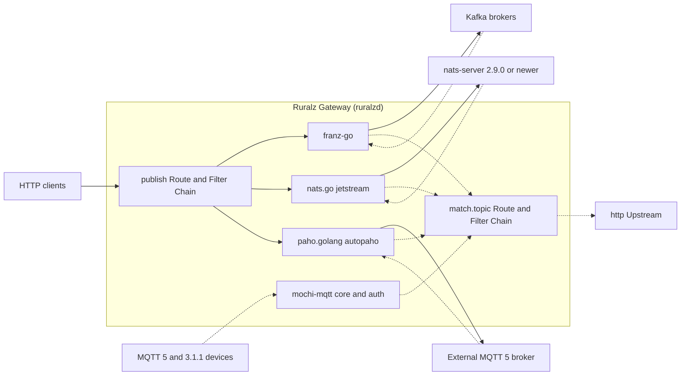

# ADR-0013: Messaging clients: franz-go, nats.go JetStream, paho.golang and embedded mochi-mqtt

## Context and problem statement

Ruralz Gateway (`ruralzd`) mediates event protocols, all Planned (M4): an HTTP Route publishes to a `kafka`, `nats` or `mqtt` Upstream, topic ingress consumes messages and calls Upstreams through a `match.topic` Route, and an embedded MQTT broker mode turns each device PUBLISH into a request ([Multi-protocol](../architecture/07-multi-protocol.md#kafka-nats-jetstream-and-mqtt)). Each message stays inside the Route, Policy and Filter Chain model (P7), and Ruralz stores no events (product non-goal 5, [Vision](../vision/01-vision-and-positioning.md#product-non-goals)).

Which Go libraries speak Kafka, NATS JetStream and MQTT inside a `CGO_ENABLED=0` binary under gates G1 to G3, and should Ruralz Gateway proxy broker wire protocols? KrakenD lists Kafka, NATS and AMQP connectors ([source](https://www.krakend.io/features/)); Gravitee sells a native Kafka wire-protocol gateway in its Enterprise Edition ([source](https://documentation.gravitee.io/apim/introduction/enterprise-edition.md)).

## Decision drivers

- **Gates G1 to G3** and soft criteria S1 to S7 ([Selection criteria](../engineering/01-tech-stack-and-libraries.md#selection-criteria)): pure Go, a G2 license, maintenance, and wrapping behind an `internal/` interface.
- **Protocol completeness (S5)**: current Kafka releases and KIPs, JetStream pull consumers, MQTT 5.
- **Acknowledged publishing**: the Node answers 202 only after the broker acknowledges, so the client MUST report acknowledgment and buffer limits.
- **Disposable Nodes (P3, P4)**: consumer rebalancing through the broker, never Node-to-Node traffic, and no durable state in the embedded broker.
- **One Filter Chain (P7)**: each message needs a Route; record batches seen by a wire proxy do not have one.

## Considered options

1. **franz-go, nats.go `jetstream`, paho.golang `autopaho` and embedded mochi-mqtt, mediation only**: franz-go ([source](https://github.com/twmb/franz-go)), nats.go ([source](https://github.com/nats-io/nats.go/blob/main/jetstream/README.md)), paho.golang ([source](https://github.com/eclipse-paho/paho.golang)), mochi-mqtt ([source](https://github.com/mochi-mqtt/server)).
2. **IBM/sarama for Kafka** ([source](https://github.com/IBM/sarama)).
3. **segmentio/kafka-go for Kafka** ([source](https://github.com/segmentio/kafka-go)).
4. **The legacy JetStream API in the `nats` package** ([source](https://github.com/nats-io/nats.go)).
5. **paho.mqtt.golang as the MQTT client** ([source](https://github.com/eclipse-paho/paho.mqtt.golang)).
6. **External MQTT brokers only, no embedded broker**, the watch-list fallback ([source](https://pkg.go.dev/github.com/mochi-mqtt/server/v2?tab=versions)).
7. **Native Kafka wire-protocol proxying**, as in Gravitee's Kafka Gateway ([source](https://documentation.gravitee.io/apim/kafka-gateway.md)).

## Decision outcome

Chosen option: "franz-go, nats.go `jetstream`, paho.golang `autopaho` and embedded mochi-mqtt, mediation only", because each covers its protocol most completely among the researched Go libraries (mochi-mqtt is the only researched embedded broker), all four pass G2, and mediation keeps every message on a Route. This matches the foundation pack section 7 Messaging row and its rule of no native Kafka or MQTT wire-protocol proxying before M4.

| Concern | Library, floor | Rules | License | Planned |
|---|---|---|---|---|
| Kafka | `github.com/twmb/franz-go` v1.22.x | `messaging.key` is the record key; idempotent producer, acknowledgment from all in-sync replicas; `ProducerLinger(0)` on Routes that await it, since v1.20.0 made the default linger 10 ms ([source](https://raw.githubusercontent.com/twmb/franz-go/master/CHANGELOG.md)); ingress uses consumer groups with cooperative-sticky or KIP-848 balancing and commits after settle | BSD-3-Clause | Planned (M4) |
| NATS | `github.com/nats-io/nats.go` v1.54.x, `jetstream` package only | Publish awaits the stream `PubAck`; ingress uses a durable pull consumer through `Consume()`, pre-buffering one message per consumer per Node (target; setting unresearched); needs nats-server 2.9.0 or newer | Apache-2.0 | Planned (M4) |
| MQTT client | `github.com/eclipse/paho.golang` v0.23.x, `autopaho` | `mqtt` Upstreams; QoS 1 publishes await `PUBACK`; the consume mapping is undecided (OQ-multi-protocol-10) | EPL-2.0 or EDL-1.0; Ruralz elects EDL-1.0 in `NOTICE` | Planned (M4) |
| MQTT embedded broker | `github.com/mochi-mqtt/server/v2` v2.7.x, core and auth packages only | `OnConnectAuthenticate` and `OnACLCheck` hooks (CONNECT credentials: OQ-multi-protocol-7); no persistent sessions, retained messages, SUBSCRIBE or QoS 2; the inline client never carries client traffic, since it bypasses ACL checks | MIT | Planned (M4) |
| Wire protocols | None | Kafka wire proxying Not planned in M0 to M5, revisited at M4 (OQ-multi-protocol-11); MQTT native ingress only through the embedded broker; NATS proxying Not planned | Not applicable | Not planned |

*Figure 1: the messaging libraries inside a Node; dashed edges are topic ingress and embedded PUBLISH, whose declaration is OQ-multi-protocol-10.*

### Consequences

- Good, because franz-go covers Kafka 0.8.0 to 4.4, KIP-848 and KIP-932 and is pure Go ([source](https://github.com/twmb/franz-go)) ([source](https://raw.githubusercontent.com/twmb/franz-go/master/CHANGELOG.md)), so Nodes join or leave consumer groups without peer coordination (P4).
- Good, because nats.go's `jetstream` package replaces the legacy API and recommends pull consumers ([source](https://github.com/nats-io/nats.go/blob/main/jetstream/README.md)), matching the ingress design.
- Good, because mochi-mqtt passes the Paho interoperability tests and exposes `MaximumPacketSize` and `ReceiveMaximum` ([source](https://pkg.go.dev/github.com/mochi-mqtt/server/v2)), which the embedded broker sets to at most `maxRequestBodyBytes` and to 16 (target).
- Good, because every library ships in the single Apache-2.0 build (P1), unlike Gravitee, whose Kafka, MQTT5 and other connectors are Enterprise-only ([source](https://documentation.gravitee.io/apim/introduction/enterprise-edition.md)).
- Bad, because paho.golang (last tag 2025-09-06) and mochi-mqtt (last tag 2025-03-01) fail S1 ([source](https://pkg.go.dev/github.com/eclipse/paho.golang?tab=versions)) ([source](https://pkg.go.dev/github.com/mochi-mqtt/server/v2?tab=versions)); the [Watch list](../engineering/01-tech-stack-and-libraries.md#watch-list) names a public fork and a separate broker as fallbacks.
- Bad, because paho.golang is pre-1.0, implements MQTT 5 only and does not enforce the server's Receive Maximum for inbound messages ([source](https://github.com/eclipse-paho/paho.golang)), so `mqtt` Upstreams need an MQTT 5 broker and inbound flow control is Ruralz code.
- Bad, because nats.go v1.54.0 requires Go 1.26 ([source](https://github.com/nats-io/nats.go/releases)), one of the modules that fix the [Version floor](../engineering/01-tech-stack-and-libraries.md#version-floor).
- Bad, because mochi-mqtt's Redis (go-redis v8), Badger and Pebble storage hooks ship in the same module ([source](https://github.com/mochi-mqtt/server)), so only an import rule keeps them out of `ruralzd`; linked, go-redis would duplicate rueidis (S6).
- Bad, because clients that speak the Kafka or NATS wire protocol cannot use Ruralz Gateway, and AMQP, Google Cloud Pub/Sub and Amazon SQS stay a parity gap (OQ-multi-protocol-14).
- Bad, because the MQTT consume mapping, broker credentials and `messaging` options stay open (OQ-multi-protocol-8, -9, -10), and non-blocking produce on a full franz-go buffer awaits the OQ-multi-protocol-8 spike, so parts of these rules may change before M4.

### Confirmation

- **Integration tests**, Planned (M4), in `pr-full` on testcontainers-go ([Integration tests](../engineering/03-testing-and-quality-strategy.md#integration-tests)): Kafka (KRaft), NATS and Mosquitto modules ([source](https://golang.testcontainers.org/modules/)) assert 202 only after the acknowledgment, `ProducerLinger(0)`, commit or ack after settle, and embedded broker PUBACK codes with a Paho client.
- **G1 cross-build and G2 license gate**, Planned (M0): the three rows marked "Pending CI" in the [Library catalog](../engineering/01-tech-stack-and-libraries.md#library-catalog) lose their row if they fail `CGO_ENABLED=0`, and the license gate admits paho.golang only under its EDL-1.0 election ([License rules](../engineering/01-tech-stack-and-libraries.md#license-rules)).
- **Quarterly health review** against the watch-list triggers: no mochi-mqtt release by M4 start, or a paho.golang MQTT 5 defect unfixed for a quarter.
- **`govulncheck`** on every pull request ([Update policy](../engineering/01-tech-stack-and-libraries.md#update-policy)).
- **Review checklist item**: a pull request that adds a broker library, a wire-protocol listener, or a call to mochi-mqtt's inline client MUST amend this ADR, and a pull request touching `NOTICE` keeps the EDL-1.0 election.

## Pros and cons of the options

### franz-go, nats.go jetstream, paho.golang and mochi-mqtt

- Good, because each covers its protocol's current generation: franz-go claims every non-Java-specific client-facing KIP ([source](https://github.com/twmb/franz-go)), nats.go offers JetStream pull consumers, and paho.golang MQTT 5 with QoS 1 and 2 ([source](https://github.com/eclipse-paho/paho.golang)).
- Bad, because two of the four fail S1 and paho.golang's `ACK()` after connection loss is unpredictable ([source](https://github.com/eclipse-paho/paho.golang)).

### IBM/sarama

- Good, because it is active, MIT-licensed and added cooperative rebalancing in v1.61.0 ([source](https://github.com/IBM/sarama/releases)).
- Bad, because it supports only the two latest stable Kafka releases ([source](https://github.com/IBM/sarama)) and documents no KIP-932 share groups.

### segmentio/kafka-go

- Good, because it is MIT-licensed and exposes a low-level `Conn` API ([source](https://github.com/segmentio/kafka-go)).
- Bad, because it is tested only to Kafka 2.7.1 and `Lag` and `Offset` are unavailable in group mode ([source](https://github.com/segmentio/kafka-go)), with four tags since 2023-12 ([source](https://pkg.go.dev/github.com/segmentio/kafka-go?tab=versions)).

### Legacy JetStream API

- Good, because it lives in the same `nats` package.
- Bad, because the `jetstream` package replaces it ([source](https://github.com/nats-io/nats.go)), so new code would start on a superseded API.

### paho.mqtt.golang

- Good, because it is maintained, with v1.5.1 on 2025-09-16, newer than paho.golang's last tag ([source](https://pkg.go.dev/github.com/eclipse/paho.mqtt.golang?tab=versions)).
- Bad, because it implements only MQTT 3.1 and 3.1.1 and points to paho.golang for MQTT 5 ([source](https://github.com/eclipse-paho/paho.mqtt.golang)), failing S5.

### External MQTT brokers only

- Good, because it removes mochi-mqtt, its S1 failure and connection state from Nodes.
- Bad, because a device PUBLISH then never reaches a Route directly, and each message crosses an extra broker hop.

### Native Kafka wire-protocol proxying

- Good, because existing Kafka clients would connect unchanged, as Gravitee's gateway "is treated like a traditional Kafka broker" ([source](https://documentation.gravitee.io/apim/kafka-gateway.md)).
- Bad, because a proxy rewrites metadata and coordinator responses and its Phases see record batches with no per-message Route, breaking P7.

## More information

- Owning document: [Multi-protocol](../architecture/07-multi-protocol.md), sections [Publishing from HTTP](../architecture/07-multi-protocol.md#publishing-from-http), [Topic ingress](../architecture/07-multi-protocol.md#topic-ingress), [Embedded MQTT broker mode](../architecture/07-multi-protocol.md#embedded-mqtt-broker-mode) and [Native wire-proxy stance](../architecture/07-multi-protocol.md#native-wire-proxy-stance); catalog rows in [Tech stack and libraries](../engineering/01-tech-stack-and-libraries.md#library-catalog).
- Related decisions: [ADR-0001](0001-implementation-language-go.md) (static builds and version floor) and [ADR-0002](0002-apache-2-license-no-feature-gating.md) (license admission).
- Revisit at the M4 review of OQ-multi-protocol-11, or when a watch-list trigger fires.
- Proposed amendment: [Repository layout and conventions](../engineering/02-repository-layout-and-conventions.md#import-boundaries) SHOULD add a depguard rule confining franz-go, nats.go, paho.golang and mochi-mqtt to wrapper packages under `internal/` (criterion S7), and denying mochi-mqtt's storage hook packages.
