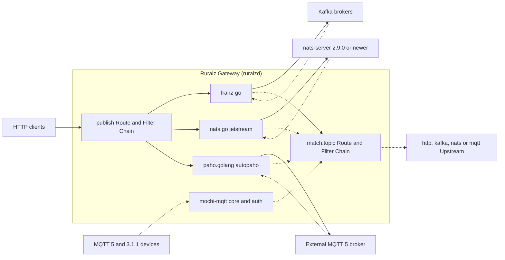

# ADR-0013: Messaging clients: franz-go, nats.go JetStream, paho.golang and embedded mochi-mqtt

## Context and problem statement

Ruralz Gateway (`ruralzd`) mediates event protocols, all Planned (M4): an HTTP Route publishes to a `kafka`, `nats` or `mqtt` Upstream, topic ingress consumes messages and calls Upstreams through a `match.topic` Route (declaration: OQ-multi-protocol-10, OQ-configuration-model-11), and an embedded MQTT broker mode turns each device PUBLISH into a request ([Multi-protocol](../architecture/07-multi-protocol.md#kafka-nats-jetstream-and-mqtt)). Each message stays inside the Route, Policy and Filter Chain model (a P7 exception pending OQ-multi-protocol-18), and Ruralz stores no events (product non-goal 5, [Vision](../vision/01-vision-and-positioning.md#product-non-goals)).

Which Go libraries speak Kafka, NATS JetStream and MQTT inside a `CGO_ENABLED=0` binary, and should Ruralz Gateway proxy broker wire protocols, as Gravitee's Enterprise Edition does ([source](https://documentation.gravitee.io/apim/introduction/enterprise-edition.md))?

## Decision drivers

- **Gates G1 to G3** and criteria S1 to S7 ([Selection criteria](../engineering/01-tech-stack-and-libraries.md#selection-criteria)): pure Go, a G2 license, maintenance.
- **Protocol completeness (S5)**: current Kafka releases and KIPs, JetStream pull consumers, MQTT 5.
- **Acknowledged publishing**: the Node answers 202 only after the broker acknowledges, so the client MUST report acknowledgment and buffer limits.
- **Disposable Nodes (P3, P4)**: rebalancing through the broker, never Node-to-Node traffic, and no session or queue state that outlives a connection.
- **Per-message governance (P7 exception, OQ-multi-protocol-18)**: each HTTP publish has a Route, and topic ingress and embedded PUBLISH run each message through the request Phases of a `match.topic` Route, a P7 exception in the owning document until OQ-multi-protocol-18 closes; a wire proxy sees record batches with no per-message Route or Consumer.

## Considered options

1. **franz-go, nats.go `jetstream`, paho.golang `autopaho` and embedded mochi-mqtt, mediation only**: franz-go ([source](https://github.com/twmb/franz-go)), nats.go ([source](https://github.com/nats-io/nats.go/blob/main/jetstream/README.md)), paho.golang ([source](https://github.com/eclipse-paho/paho.golang)), mochi-mqtt ([source](https://github.com/mochi-mqtt/server)).
2. **IBM/sarama for Kafka** ([source](https://github.com/IBM/sarama)).
3. **segmentio/kafka-go for Kafka** ([source](https://github.com/segmentio/kafka-go)).
4. **Legacy JetStream API in the `nats` package** ([source](https://github.com/nats-io/nats.go)).
5. **paho.mqtt.golang as the MQTT client** ([source](https://github.com/eclipse-paho/paho.mqtt.golang)).
6. **External MQTT brokers only**, the watch-list fallback ([source](https://pkg.go.dev/github.com/mochi-mqtt/server/v2?tab=versions)).
7. **Native Kafka wire-protocol proxying**, as in Gravitee's Kafka Gateway ([source](https://documentation.gravitee.io/apim/kafka-gateway.md)).

## Decision outcome

Chosen option: "franz-go, nats.go `jetstream`, paho.golang `autopaho` and embedded mochi-mqtt, mediation only", because each covers its protocol most completely among the researched Go libraries (mochi-mqtt is the only researched embedded broker), all four pass G2, and mediation keeps every message on a Route (a P7 exception, OQ-multi-protocol-18). This matches the pack section 7 Messaging row and its rule of no native Kafka or MQTT wire-protocol proxying before M4.

| Concern | Library, floor | Rules | License | Planned |
|---|---|---|---|---|
| Kafka | `github.com/twmb/franz-go` v1.22.x | `messaging.key` is the record key; idempotent producer, acknowledgment from all in-sync replicas; `ProducerLinger(0)` on every franz-go producer client, since every publish Route awaits the acknowledgment (an acknowledgment mode is OQ-multi-protocol-8) and v1.20.0 made the default linger 10 ms ([source](https://raw.githubusercontent.com/twmb/franz-go/master/CHANGELOG.md)); `MaxBufferedRecords` bounds the producer buffer ([source](https://github.com/twmb/franz-go/blob/master/docs/producing-and-consuming.md)), and each record keeps its `maxBufferedBytes` reservation until franz-go resolves its produce promise, even after the request has failed, so the Node budget bounds producer memory; ingress consumer groups use cooperative-sticky or KIP-848 balancing and commit after settle; revocation abandons unsettled messages uncommitted for redelivery, never blocking past the group timeout | BSD-3-Clause | Planned (M4) |
| NATS | `github.com/nats-io/nats.go` v1.54.x, `jetstream` package only | Publish awaits the stream `PubAck`; ingress uses a durable pull consumer through `Consume()`, pre-buffering one message per consumer per Node (target); needs nats-server 2.9.0 or newer | Apache-2.0 | Planned (M4) |
| MQTT client | Repository `eclipse-paho/paho.golang`, module `github.com/eclipse/paho.golang` v0.23.x, `autopaho` | `mqtt` Upstreams; QoS 1 publishes await `PUBACK`; each Node connects with its own client identifier derived from `node.id` and the Upstream name, `CleanStartOnInitialConnection` true, `SessionExpiryInterval` 0 and an in-memory `Queue`, so no session or queue state outlives the connection (P4, pack 8.11; proposed for Multi-protocol under OQ-multi-protocol-8); the consume mapping is undecided (OQ-multi-protocol-10) | EPL-2.0 or EDL-1.0; Ruralz elects EDL-1.0 in `NOTICE` | Planned (M4) |
| MQTT embedded broker | `github.com/mochi-mqtt/server/v2` v2.7.x, core and auth packages only | `OnConnectAuthenticate` and `OnACLCheck` hooks (CONNECT credentials: OQ-multi-protocol-7); PUBLISH enters its Route from a publish hook such as `OnPublish`, and PUBACK timing follows the OQ-multi-protocol-10 spike; no persistent sessions, retained messages, SUBSCRIBE or QoS 2; the inline client never carries client traffic, since it bypasses ACL checks | MIT | Planned (M4) |
| Wire protocols | None | Kafka wire proxying Not planned in M0 to M5, revisited at M4 (OQ-multi-protocol-11); MQTT native ingress only through the embedded broker; NATS proxying Not planned | Not applicable | Not planned |

*Figure 1: the messaging libraries inside a Node; dashed edges are topic ingress and embedded PUBLISH, whose declaration is OQ-multi-protocol-10.*

### Consequences

- Good, because franz-go covers Kafka 0.8.0 to 4.4, KIP-848 and KIP-932 in pure Go ([source](https://github.com/twmb/franz-go)) ([source](https://raw.githubusercontent.com/twmb/franz-go/master/CHANGELOG.md)), so Nodes join or leave groups without peer coordination (P4).
- Good, because nats.go's `jetstream` package replaces the legacy API and recommends pull consumers ([source](https://github.com/nats-io/nats.go/blob/main/jetstream/README.md)).
- Good, because mochi-mqtt passes the Paho interoperability tests and exposes `MaximumPacketSize` and `ReceiveMaximum` ([source](https://pkg.go.dev/github.com/mochi-mqtt/server/v2)), set to at most `maxRequestBodyBytes` and to 16 (target).
- Good, because every library ships in the single Apache-2.0 build (P1).
- Bad, because no research shows mochi-mqtt holding a QoS 1 PUBACK until the Upstream call settles without blocking that connection's reads; if it cannot, `ReceiveMaximum` 16 (target) allows one in-flight PUBLISH per connection, and the OQ-multi-protocol-10 fallback, PUBACK on receipt, weakens acknowledgment to receipt by the Node.
- Bad, because paho.golang and mochi-mqtt fail S1 ([source](https://pkg.go.dev/github.com/eclipse/paho.golang?tab=versions)) ([source](https://pkg.go.dev/github.com/mochi-mqtt/server/v2?tab=versions)); the [Watch list](../engineering/01-tech-stack-and-libraries.md#watch-list) names fallbacks.
- Bad, because paho.golang is pre-1.0, MQTT 5 only and ignores the server's inbound Receive Maximum ([source](https://github.com/eclipse-paho/paho.golang)), so `mqtt` Upstreams need an MQTT 5 broker.
- Bad, because mochi-mqtt's Redis (go-redis v8), Badger and Pebble storage hooks ship in the same module ([source](https://github.com/mochi-mqtt/server)), so only an import rule keeps them out of `ruralzd`.
- Bad, because Kafka and NATS wire-protocol clients cannot connect, and AMQP, Google Cloud Pub/Sub and Amazon SQS stay a parity gap (OQ-multi-protocol-14).
- Bad, because the MQTT consume mapping, broker credentials and `messaging` options stay open (OQ-multi-protocol-8, OQ-multi-protocol-9, OQ-multi-protocol-10), and non-blocking produce and a byte bound on the franz-go buffer await the OQ-multi-protocol-8 spike, so these rules may change before M4.

### Confirmation

- **Integration tests**, Planned (M4), in `pr-full` on testcontainers-go ([Integration tests](../engineering/03-testing-and-quality-strategy.md#integration-tests)): Kafka (KRaft), NATS and Mosquitto modules ([source](https://golang.testcontainers.org/modules/)) assert 202 after the acknowledgment, commit or ack after settle, and embedded broker PUBACK codes. With the Kafka container paused, publishes end in 503 or 502 while the Node's reserved bytes stay within `maxBufferedBytes`; two Nodes publishing to one Mosquitto broker see no session-takeover disconnects.
- **Embedded MQTT broker spike**, Planned (M4), before the broker ships, on held PUBACKs: one connection sends 16 QoS 1 PUBLISHes to a Route whose Upstream answers slowly; the test asserts 16 concurrent Upstream calls and a PINGRESP within the keep-alive. If it fails, the fallback applies and this ADR is amended.
- **G1 cross-build and G2 license gate**, Planned (M0): the NATS, MQTT client and MQTT embedded broker rows, marked Pending CI in the [Library catalog](../engineering/01-tech-stack-and-libraries.md#library-catalog), are removed if they fail `CGO_ENABLED=0`, and paho.golang passes the license gate only under EDL-1.0 ([License rules](../engineering/01-tech-stack-and-libraries.md#license-rules)).
- **Quarterly health review** against the [Watch list](../engineering/01-tech-stack-and-libraries.md#watch-list) triggers.
- **`govulncheck`** on every pull request, Planned (M0) ([Update policy](../engineering/01-tech-stack-and-libraries.md#update-policy)).
- **Review checklist item**, from M4: a pull request that adds a broker library, a wire-protocol listener, a call to mochi-mqtt's inline client, or an import of any mochi-mqtt package other than core and auth MUST amend this ADR; one touching `NOTICE` keeps the EDL-1.0 election.

## Pros and cons of the options

### franz-go, nats.go `jetstream`, paho.golang `autopaho` and embedded mochi-mqtt, mediation only

- Good, because franz-go claims every non-Java-specific client-facing KIP ([source](https://github.com/twmb/franz-go)) and paho.golang covers MQTT 5 ([source](https://github.com/eclipse-paho/paho.golang)).
- Bad, because two of the four fail S1 and paho.golang's `ACK()` after connection loss is unpredictable ([source](https://github.com/eclipse-paho/paho.golang)).

### IBM/sarama for Kafka

- Good, because it is active, MIT-licensed and added cooperative rebalancing in v1.61.0 ([source](https://github.com/IBM/sarama/releases)).
- Bad, because it supports only the two latest stable Kafka releases ([source](https://github.com/IBM/sarama)) and documents no KIP-932 share groups.

### segmentio/kafka-go for Kafka

- Good, because it is MIT-licensed and exposes a low-level `Conn` API ([source](https://github.com/segmentio/kafka-go)).
- Bad, because it is tested only to Kafka 2.7.1 and lacks `Lag` in group mode ([source](https://github.com/segmentio/kafka-go)).

### Legacy JetStream API in the `nats` package

- Good, because it lives in the same `nats` package.
- Bad, because the `jetstream` package replaces it ([source](https://github.com/nats-io/nats.go)).

### paho.mqtt.golang as the MQTT client

- Good, because v1.5.1 (2025-09-16) is newer than paho.golang's last tag ([source](https://pkg.go.dev/github.com/eclipse/paho.mqtt.golang?tab=versions)).
- Bad, because it implements only MQTT 3.1 and 3.1.1 ([source](https://github.com/eclipse-paho/paho.mqtt.golang)), failing S5.

### External MQTT brokers only

- Good, because it removes mochi-mqtt, its S1 failure and connection state.
- Bad, because a device PUBLISH never reaches a Route directly, each message crosses an extra broker hop, and device ingress would wait on the undecided MQTT consume mapping, where, without shared subscriptions, every Node gets each message (OQ-multi-protocol-10).

### Native Kafka wire-protocol proxying

- Good, because existing Kafka clients would connect unchanged, as Gravitee's gateway "is treated like a traditional Kafka broker" ([source](https://documentation.gravitee.io/apim/kafka-gateway.md)).
- Bad, because a proxy rewrites metadata and coordinator responses, and its Phases see record batches with no per-message Route or Consumer. Under P7 those records would reach Policies only as `onChunk`, where `authz.*`, `ratelimit` and `quota` do not run.

## More information

- Owning document: [Multi-protocol](../architecture/07-multi-protocol.md); catalog rows in [Tech stack and libraries](../engineering/01-tech-stack-and-libraries.md#library-catalog). Related: [ADR-0001](0001-implementation-language-go.md), [ADR-0002](0002-apache-2-license-no-feature-gating.md). Revisit at the M4 review of OQ-multi-protocol-11 or on a watch-list trigger.
- Proposed amendment: [Repository layout and conventions](../engineering/02-repository-layout-and-conventions.md#import-boundaries) SHOULD add a depguard rule confining these libraries to wrapper packages under `internal/` (S7) and denying mochi-mqtt's storage hook packages.
