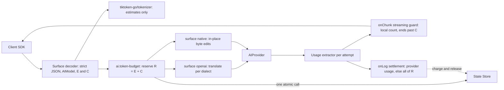

# ADR-0014: AI API surface: OpenAI-compatible facade plus native passthrough, provider usage authoritative

## Context and problem statement

Differentiator (2), the AI/LLM gateway, runs inside Ruralz Gateway: an `Upstream` with `protocol: ai` lists client-nameable `AIModel` resources in `ai.models` and picks the client surface with `ai.surface` (`openai` or `native`); each `AIModel` maps to `AIProvider` candidates of `dialect` `openai`, `anthropic`, `gemini`, `bedrock`, `mistral` or `ollama` ([Configuration model](../architecture/02-configuration-model.md#upstream)). Nothing is implemented; AI traffic is Planned (M3).

Two questions need one answer: which wire format clients speak, and which token count is authoritative for Token Budgets, cost and exports. A proxy that rebuilds requests from typed schemas can drop Prompt Cache markers such as Anthropic `cache_control` that its types omit, and no local tokenizer matches every provider: `tiktoken-go/tokenizer` embeds OpenAI encodings only ([source](https://pkg.go.dev/github.com/tiktoken-go/tokenizer)), and Anthropic publishes no tokenizer ([source](https://platform.claude.com/docs/en/build-with-claude/token-counting)).

## Decision drivers

- **P8, AI traffic is API traffic**: the same Routes, Policies, Consumers and State Store govern AI calls ([Principles](../vision/01-vision-and-positioning.md#principles)).
- **Prompt Cache fidelity**: unless `cache.prompt.mode: disabled`, native requests keep every cache marker in 100% of conformance cases (target; SM-11).
- **Budget safety**: reservation, streaming guard and settlement follow [pack 8.9](../_meta/foundation-pack.md#89-token-budgets-adr-0014); overshoot is at most the sum of concurrent input-estimate errors plus (attempts - 1) x R per concurrent request, plus unstreamed hidden reasoning (OQ-ai-llm-gateway-17) (hypothesis; SM-10), as [Settlement](../architecture/06-ai-llm-gateway.md#settlement) states; pack 8.9 omits both extra terms (OQ-ai-llm-gateway-15).
- **P3, no control-plane or peer dependency on the request path**: one blocking State Store call per Policy before commit, none in `onChunk`; any other remote call is declared on its Policy.
- **Client portability**: SDKs written for OpenAI Chat Completions reach every dialect.
- **P1 and P2, everything is free and the gateway stands alone**: prices ship in `AIProvider.spec.pricing`; no Revington service or entitlement supplies prices or counts.
- **Bounded work**: gateway-added time to first token of 1 ms or less at p99 for bodies up to 16 KiB, excluding State Store, embedding, provider and estimator time (target; PB-12 in [Performance budgets and benchmarking](../architecture/12-performance-budgets-and-benchmarking.md)).

## Considered options

1. **OpenAI-compatible façade plus native passthrough, provider usage authoritative**: both surfaces, chosen per Upstream by `ai.surface`, with billing from the usage each provider returns.
2. **OpenAI-compatible façade only**: one translated surface, the OpenAI Chat Completions format, for every dialect.
3. **Native passthrough only**: vendor APIs forwarded unchanged, with no translation layer.
4. **Gateway tokenizer counts as the billing source**: Token Budgets and cost read local counts; Anthropic offers only a count endpoint ([source](https://platform.claude.com/docs/en/build-with-claude/token-counting)).
5. **Post-response charging without reservation**: admission checks usage already charged, then charges provider-returned usage after the response, so a request's cost is reflected only from the next request on.

## Decision outcome

Chosen option: "OpenAI-compatible façade plus native passthrough, provider usage authoritative", because only it keeps Prompt Cache markers intact for native clients while giving OpenAI-SDK clients one surface across dialects, and only provider usage matches what providers bill. This matches the foundation pack section 7 AI surface row: tokenizer counts serve only pre-admission estimates and the streaming guard; Token Budgets reserve and settle per section 8.9. The [AI/LLM gateway](../architecture/06-ai-llm-gateway.md#unified-api) owns the mechanism:

| Concern | Rule | Planned |
|---|---|---|
| Surface decoder | At the start of `onRequestBody`, before any `onRequestBody` Policy, after the `onRequestHeaders` Policies: strict JSON (invalid UTF-8 or repeated members are `RZ-AI-002`), `model` resolved in `ai.models` (`RZ-AI-001`), C computed, E only when a reader needs it; assumes the Route has exactly one upstream leg and no `composition` (proposed validation code: OQ-ai-llm-gateway-16) | Planned (M3) |
| `surface: openai` | Chat Completions, streamed or not, embeddings and the model list, translated to each candidate's dialect and back to OpenAI chunks ending `data: [DONE]`; an inexpressible feature is `RZ-AI-002`; Responses API Planned (M4) | Planned (M3) |
| `surface: native` | Only the operations in [Native APIs, caps and events](../architecture/06-ai-llm-gateway.md#native-apis-caps-and-events), including Anthropic Messages, Gemini and Bedrock Converse; bytes edited in place, never re-serialized from a typed schema; all candidates share one dialect (code: OQ-ai-llm-gateway-3); Bedrock InvokeModel Planned (M4) | Planned (M3) |
| Native request edits | Only: rewrite `model` or the model path segment; write C into the cap field and remove the others; set `stream_options.include_usage` on streamed Chat Completions; keep only allowlisted headers and query parameters before credentials attach; redact in place for `ai.guardrail`; remove cache markers under `cache.prompt.mode: disabled` | Planned (M3) |
| Usage | Provider-reported usage, read per attempt keeping each field's latest value, since Anthropic `message_delta.usage` is cumulative ([source](https://platform.claude.com/docs/en/build-with-claude/streaming)), is authoritative for settlement, cost and every export | Planned (M3) |
| Tokenizer | `tiktoken-go/tokenizer` computes E (`o200k_base` times the candidates' largest per-dialect correction, OQ-ai-llm-gateway-2) and the `onChunk` guard count; never billed; no count call on the request path | Planned (M3) |
| Token Budget | C is the client cap, else `limits.maxOutputTokens`; R = E + C, reserved in one atomic State Store call only if the budget covers all of R (`RZ-AI-006`); the guard ends the stream past C (`RZ-AI-008`); `onLog` charges usage summed over attempts, plus all of R once per request if an attempt lacked usage (degraded-state metric) or none ran, and releases the rest; budgeted Routes allow 2 attempts (target) and stop Provider Fallback with `RZ-AI-005` once that charge reaches R | Planned (M3) |
| Credentials | `credentials.apiKey` through `secretRef`, attached at the transport after the last `onUpstreamRequest` Filter | Planned (M3) |

*Figure 1: one request through the chosen surface and accounting; dashed edges are asynchronous.*

### Consequences

- Good, because native passthrough cannot drop a field it never parses into a type, so cache markers and new provider fields survive.
- Good, because OpenAI-SDK clients fall back across dialects on the façade without code changes.
- Good, because budgets and cost use billed fields; cost records carry the Revision digest and `pricing.version`, so re-pricing needs no Revington service (P1, P2).
- Good, because the local guard keeps State Store calls out of `onChunk` (pack 8.7).
- Bad, because two surfaces double the fixtures: every native API needs cap, commit-event and usage cases, and the façade drops cache markers for `openai`, `mistral`, `gemini` and `ollama`, counted by `ruralz_ai_cache_markers_dropped_total` (name owned by [Observability](../architecture/10-observability.md)).
- Bad, because Provider Fallback behind `surface: native` stays within one dialect.
- Bad, because non-OpenAI estimates are corrected guesses: Claude Opus 4.7 and later produce about 30% more tokens for the same text ([source](https://platform.claude.com/docs/en/build-with-claude/token-counting)), so E and the guard drift until OQ-ai-llm-gateway-2 closes, and an overestimate can end streams with `RZ-AI-008` below the provider cap (tolerance: OQ-ai-llm-gateway-15).
- Bad, because OpenAI omits the usage chunk on interrupted streams ([source](https://github.com/openai/openai-python/blob/main/src/openai/types/chat/chat_completion_stream_options_param.py)), and such streams are charged all of R.
- Bad, because non-streamed façade responses are buffered, and one beyond `maxResponseBodyBytes` fails with 502 `RZ-AI-013`.
- Bad, because hidden reasoning is never streamed, so only the provider's cap bounds it (OQ-ai-llm-gateway-17).

### Confirmation

- **Protocol conformance suite**, Planned (M3): AI dialect fixtures verify Prompt Cache marker preservation in 100% of cases (target; SM-11) and show that C, `include_usage` and only allowlisted headers reach the provider ([Conformance suites](../engineering/03-testing-and-quality-strategy.md#conformance-suites)).
- **Token Budget property test**, Planned (M3): reservation, per-attempt settlement and the overshoot bound hold ([Required properties](../engineering/03-testing-and-quality-strategy.md#required-properties)).
- **SM-10 scale job**, Planned (M3): the [AI provider mock](../engineering/03-testing-and-quality-strategy.md#ai-provider-mock) drops usage on some streams, and settlement MUST charge all of R.
- **Fuzzing**, Planned (M3): per-dialect stream parsers extract the fixture's final usage or report it missing ([Fuzzing](../engineering/03-testing-and-quality-strategy.md#fuzzing)).
- **Validation**, Planned (M3): `ruralz bundle validate` rejects a Token-Budgeted `AIModel` without `limits.maxOutputTokens` (RZ-CFG-034, [Error codes](../architecture/02-configuration-model.md#error-codes)).
- **Review checklist item**: a pull request that bills, budgets or exports token counts from anything but provider usage, or re-serializes a native body, MUST amend this ADR.

## Pros and cons of the options

### OpenAI-compatible façade plus native passthrough, provider usage authoritative

- Good, because each client picks portability or fidelity per Route.
- Bad, because the gateway maintains a translator and an in-place editor per dialect.

### OpenAI-compatible façade only

- Good, because one decoder and one fixture set cover every client.
- Bad, because rebuilding from typed parameters drops `cache_control` markers the types omit, and translation loses provider features such as Bedrock `guardrailConfig` ([source](https://docs.aws.amazon.com/bedrock/latest/APIReference/API_runtime_ConverseStream.html)).

### Native passthrough only

- Good, because every provider feature and marker passes unchanged.
- Bad, because clients must speak each vendor's API, so Provider Fallback across dialects is impossible.

### Gateway tokenizer counts as the billing source

- Good, because counts exist even when a stream loses its usage chunk.
- Bad, because local counts disagree with invoices: the tokenizer has only OpenAI encodings ([source](https://pkg.go.dev/github.com/tiktoken-go/tokenizer)), and Ollama calls its own Anthropic-API counts "approximations" ([source](https://docs.ollama.com/api/anthropic-compatibility)).

### Post-response charging without reservation

- Good, because it needs no estimate at admission.
- Bad, because every concurrent stream admitted before settlement can overshoot the budget by its full output, which the reservation of R bounds per attempt.

## More information

- Owning document: [AI/LLM gateway](../architecture/06-ai-llm-gateway.md); tokenizer: [Tech stack and libraries](../engineering/01-tech-stack-and-libraries.md#library-catalog).
- Related decisions: [ADR-0008](0008-rate-limiting-local-bucket-and-gcra.md) (request-rate limits in `onRequestHeaders`), [ADR-0010](0010-telemetry-opentelemetry-first.md) (`gen_ai` telemetry) and [ADR-0011](0011-expressions-and-authorization-engines.md) (candidate `when` expressions).
- Open questions that refine, not reverse, this decision: OQ-ai-llm-gateway-1 (client caps above `limits.maxOutputTokens`), OQ-ai-llm-gateway-2 with OQ-vision-and-positioning-15 and OQ-tech-stack-and-libraries-11 (estimate corrections; rate-limited provider count endpoints ([source](https://platform.claude.com/docs/en/build-with-claude/token-counting)) would be declared remote calls), OQ-ai-llm-gateway-3 (mixed dialects, InvokeModel) and OQ-ai-llm-gateway-16 (registrations). `ai.token-budget`'s default `failureMode` stays OQ-configuration-model-8.
- OQ-ai-llm-gateway-15 proposes charging R per attempt without usage and releasing R when no attempt ran; its option (b) amends this ADR, and until it closes pack 8.9 applies as written.
- Proposed amendment: [Banned imports](../engineering/02-repository-layout-and-conventions.md#banned-imports) SHOULD add a depguard rule confining `tiktoken-go/tokenizer` to the estimator and streaming-guard package, so no billing path can import it.
