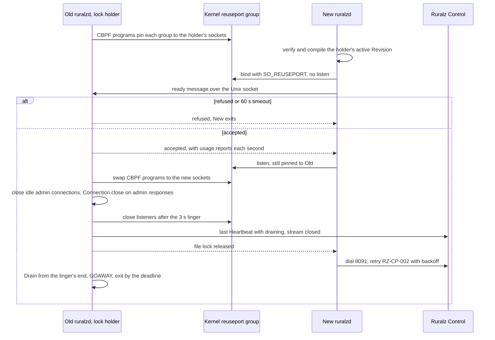

# ADR-0015: Zero-downtime upgrades: SO_REUSEPORT, drain and readiness gating, no socket passing

## Context and problem statement

A Zero-Downtime Upgrade replaces the `ruralzd` binary on a Node without refusing connections or failing requests. `ruralzd` listens by default on 8080, 8443 (TCP, plus UDP for HTTP/3, Planned (M3)) and admin port 9901 (foundation pack section 8.4), holds a Control Stream for its `node.id` and writes Last-Known-Good under `${RURALZ_DATA_DIR}` (pack 8.2, 8.11). Balancers probe `/readyz`, which fails during a Drain (pack 8.5).

How does a new process take over listeners, readiness and identity across N-1 and N, keeping Nodes disposable (P4) and handovers measurable (P10) ([Vision](../vision/01-vision-and-positioning.md#principles))? Nothing is implemented: the in-place handover is Planned (M1), blocked by two Open questions, and the Kubernetes Drain and restart Planned (M2).

## Decision drivers

- **No refused connections**: new TCP connections always reach a listening socket, and probes see `/readyz` 200 throughout a handover.
- **Independent processes**: no descriptors, counters or in-memory state cross between binaries, only the kernel, a file lock and a version-marked readiness and usage message ([Versioned surface](../engineering/04-release-versioning-and-compatibility.md#versioned-surfaces)), keeping skew within N-1 ([version skew](../engineering/04-release-versioning-and-compatibility.md#control-plane-and-data-plane-version-skew)).
- **Bounded Drain**: every long-lived connection gets a going-away signal and all work ends within a fixed bound.
- **Safe refusal**: a new process failing verification or the gate exits holding no listening socket; the old one keeps serving.
- **Static binaries**: only `golang.org/x/sys/unix` and the standard library, with `CGO_ENABLED=0` ([ADR-0001](0001-implementation-language-go.md)).

## Considered options

1. **`SO_REUSEPORT` with CBPF steering, Drain and readiness gating**: the new process binds the same ports, allowed when both share the effective user ID ([source](https://man7.org/linux/man-pages/man7/socket.7.html)), and reports ready; the old one then steers new connections to it and Drains.
2. **Listener socket passing** over a Unix socket: the old process hands its listening descriptors to the new one with `SCM_RIGHTS` ([source](https://man7.org/linux/man-pages/man7/unix.7.html)), optionally with counters, or starts the new process as a child that inherits them.
3. **Plain `SO_REUSEPORT` without steering**: close the old listeners once the new process is ready.
4. **Drain and restart only**: stop the old process, then start the new one, while balancers move traffic to other Nodes.

## Decision outcome

Chosen option: "`SO_REUSEPORT` with CBPF steering, Drain and readiness gating", because it is the only option that keeps the two binaries independent, with no cross-version descriptor protocol, while refusing no new connection when `net.ipv4.tcp_migrate_req=1` (ZG-3). Listener socket passing matches it on refusals but needs a descriptor protocol across N-1 and N. It survives the new process's refusal or crash before the holder closes its listeners, and the holder's crash during the gate, after which the new process takes the lock and listens. It matches pack section 7's Upgrades row, the [System overview handover rules](../architecture/01-system-overview.md#hot-reload-rollout-and-zero-downtime-upgrade) and the owning document's [Binary upgrades](../operations/02-zero-downtime-upgrades-and-hot-reload.md#binary-upgrades). Listener socket passing is Not planned for the first release line.

| Rule | Decision | Planned |
|---|---|---|
| Pinning | At startup and after every bind, the lock holder attaches to each reuseport group (TCP listeners, 9901, UDP 8443) an `SO_ATTACH_REUSEPORT_CBPF` program returning its own socket's index: a bound, unaccepted socket gets nothing until the swap | Planned (M1) |
| Bind, not listen | Same `RURALZ_CONFIG`, `RURALZ_DATA_DIR` and effective user ID; the new process passes the holder's active Revision through the full validation gate without boot wait, then binds every `listeners` `port` and `admin.port` with `SO_REUSEPORT` but does not listen (TCP) and receives nothing while pinned (UDP) | Planned (M1) |
| Readiness gating | Over an owner-only Unix socket under `${RURALZ_DATA_DIR}` the new process sends version, format markers and active digest; the holder has a newer candidate reloaded and reported again, refusing an unknown marker or older candidate. Unaccepted after 60 s (target), the new process exits; if the holder exits first, the new process takes the lock and listens | Planned (M1) |
| Steering | Accepted, the new process listens, still pinned; the holder swaps each program to the new sockets, 9901 included, accepts through a 3 s linger (target), then closes its listeners | Planned (M1) |
| Readiness move | During the linger the holder closes idle admin connections and answers in-flight admin requests with `Connection: close`, so keep-alive health checkers reconnect to the new process and no probe sees the Drain's 503 | Planned (M1) |
| `net.ipv4.tcp_migrate_req` | Complements steering: handover hosts SHOULD set it, so closing migrates queued and in-progress handshakes. Pack section 7 says alternative, pending OQ-zero-downtime-upgrades-and-hot-reload-12 (a) | Planned (M1) |
| Shared Node-wide ceilings | The old process reports connections, in-flight units, buffered bytes, Plugin memory and RSS at acceptance and each second (target); the new one admits each ceiling minus that usage, under a soft memory limit of 90% of the limit minus the old RSS (target) (OQ-zero-downtime-upgrades-and-hot-reload-6) | Planned (M1) |
| Identity | At Drain start the old process sends a last `Heartbeat` with `draining`, closes its Control Stream and releases the file lock; the new one takes it, alone writes Last-Known-Good and, in Control mode, dials 8091, retrying `RZ-CP-002` while ready | Planned (M1) |
| Drain | `/readyz` 503, stop accepting, one HTTP/2 GOAWAY in Planned (M1) (OQ-zero-downtime-upgrades-and-hot-reload-3), `Connection: close` on HTTP/1.1, jittered WebSocket 1001 and SSE ends. After SIGTERM: deadline 20 s after stop-accepting, exit within 30 s (target). After a handover: Drain from the linger's end, no accept window, deadline 20 s later, 23 s after steering (target) ([Drain timeline defaults](../operations/02-zero-downtime-upgrades-and-hot-reload.md#drain-timeline-defaults)) | Planned (M1); WebSocket and SSE Planned (M3) |
| QUIC | In-flight QUIC connections on UDP 8443 are lost and reconnect (OQ-system-overview-18) | Planned (M3) |
| Kubernetes (T4) | preStop, Drain and a new Pod replace each Pod, `terminationGracePeriodSeconds` 45 s (target); the Cluster keeps serving, but this is no per-Node Zero-Downtime Upgrade | Planned (M2) |

*Figure 1: the pinned, gated handover and the old process's Drain.*

### Consequences

- Good, because a refused new process, or one crashing before the holder closes its listeners, leaves the holder serving, and an N-1 binary beside N is a reverse handover (binary rollback).
- Bad, because without `tcp_migrate_req` (Linux 5.14+, per network namespace) a handshake needing a second SYN-ACK retransmission can be reset (hypothesis).
- Bad, because a new process crashing after the holder closes its listeners leaves the Node refusing connections until restarted, a Drain and restart.
- Bad, because Node-local state such as token buckets restarts, admitting at most one extra ceiling per key (target) ([Stateless data plane](../architecture/11-scalability-and-distributed-state.md#stateless-data-plane)).
- Bad, because the overlap needs about 0.6 GiB plus snapshots free (hypothesis) and State Store client limits covering both processes.
- Bad, because a `draining` Heartbeat drops the Node from `clusterNodeCount` for 10 minutes plus a ramp (target), raising derived per-Node ceilings; derived-ceiling Clusters MUST pace upgrades ([Node count during upgrades](../operations/02-zero-downtime-upgrades-and-hot-reload.md#node-count-during-upgrades)).
- Bad, because WebSocket, SSE and QUIC connections never migrate; clients reconnect over a 10 s jitter window (target).
- Bad, because the in-place path is Linux-only and needs process-manager support such as a systemd unit.

### Confirmation

- **V-3**, Planned (M1): 1,000 handovers at half saturation (target), a keep-alive health checker on 9901, `tcp_migrate_req` at 1 and 0, and 1,000 refused or timed-out handovers. Pass: resets per handover recorded: none at 1, only twice-retransmitted handshakes at 0; no refused connection or failed request; every probe 200; no OOM kill or State Store connection refusal; derived-ceiling count drops at most 10% (target) ([Verification runbook](../operations/02-zero-downtime-upgrades-and-hot-reload.md#verification-runbook)).
- **V-4**, Planned (M1); WebSocket and SSE Planned (M3): SIGTERM a Node holding HTTP/2, WebSocket and SSE connections. Pass: zero failed new requests, exit within 30 s (target).
- **V-6**, Planned (M1): a handover to N-1 past the binary rollback limit is refused; N keeps serving.
- **Review checklist item**: a pull request passing listening descriptors between processes (such as `unix.UnixRights`) or closing a listener before steering MUST supersede this ADR.

## Pros and cons of the options

### SO_REUSEPORT with CBPF steering, Drain and readiness gating

- Good, because the kernel always has an accepting socket, and `Server.Shutdown` plus Ruralz tracking of hijacked connections covers the Drain ([source](https://pkg.go.dev/net/http#Server.Shutdown)).
- Bad, because pinning, steering, the linger and lock handoff are Ruralz code, where a mistake resets connections.

### Listener socket passing

- Good, because the listening socket and its accept queue never close, so no connection waits in a queue that disappears.
- Bad, because both binaries must speak a descriptor protocol across N-1 and N, and a per-worker `SO_REUSEPORT` handover can drop queued connections when the new process runs fewer workers.

### Plain SO_REUSEPORT without steering

- Good, because it is simplest, needing no CBPF program.
- Bad, because HAProxy measured 155 failures per million connections over 180 reloads from sockets closed with queued connections ([source](https://www.haproxy.com/blog/truly-seamless-reloads-with-haproxy-no-more-hacks)).

### Drain and restart only

- Good, because it needs no overlap and fits Kubernetes, where preStop runs before SIGTERM within the grace period ([source](https://kubernetes.io/docs/concepts/containers/container-lifecycle-hooks/)).
- Bad, because the Node serves nothing between exit and ready, and correctness depends on balancers noticing the failed `/readyz` in time.

## More information

- Owning document: [Zero-downtime upgrades and hot reload](../operations/02-zero-downtime-upgrades-and-hot-reload.md#in-place-handover), which owns the handover steps, Drain timeline, long-lived connections and rollback. See also [foundation pack section 7](../_meta/foundation-pack.md#7-technology-decisions-fixed-details-in-docsengineering01-tech-stack-and-librariesmd-and-adrs) and [SO_REUSEPORT and listeners](../architecture/11-scalability-and-distributed-state.md#so_reuseport-and-listeners), which rules out `SO_REUSEPORT` for scaling.
- Related decisions: [ADR-0007](0007-control-stream-protocol.md) (Control Stream reconnect), [ADR-0009](0009-http-stack-net-http-quic-go.md) (`net/http` GOAWAY and QUIC loss) and [ADR-0016](0016-kubernetes-helm-and-crds.md) (Kubernetes packaging, proposed).
- Blocking the Planned (M1) handover: OQ-zero-downtime-upgrades-and-hot-reload-6 (overlap memory) and OQ-zero-downtime-upgrades-and-hot-reload-7 (systemd unit). Non-blocking: OQ-zero-downtime-upgrades-and-hot-reload-1, OQ-zero-downtime-upgrades-and-hot-reload-5, OQ-zero-downtime-upgrades-and-hot-reload-11 and OQ-zero-downtime-upgrades-and-hot-reload-12.
- The tech stack document SHOULD add a `golang.org/x/sys` catalog row, today only transitive.
- Revisit when QUIC connection-ID steering is feasible (OQ-system-overview-18) or a measured handover failure rate justifies socket passing.
