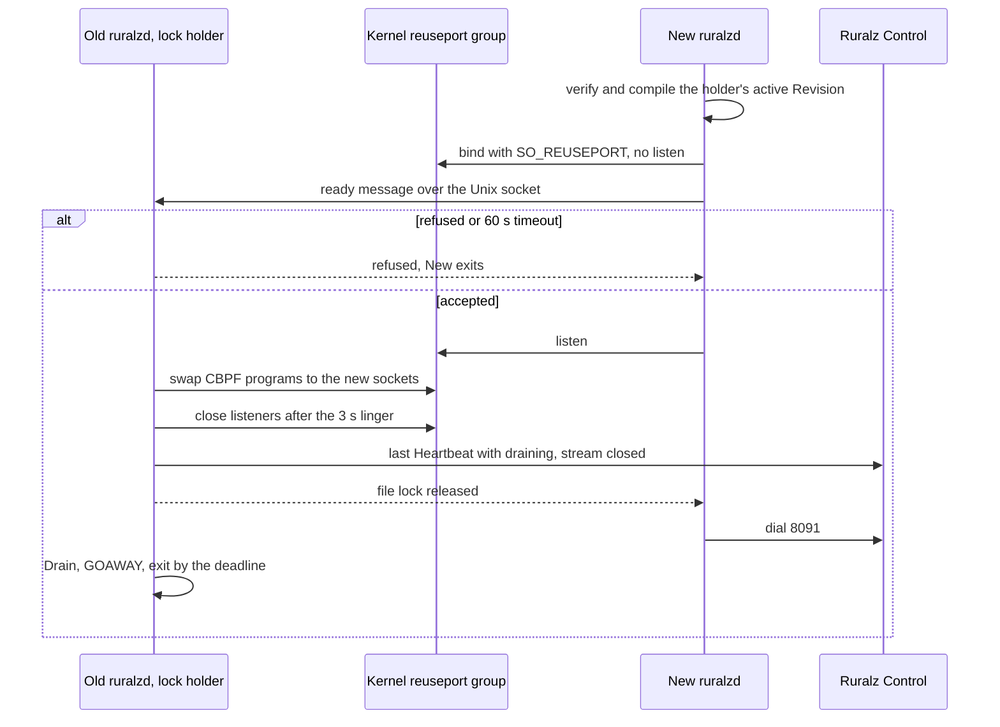

# ADR-0015: Zero-downtime upgrades: SO_REUSEPORT, drain and readiness gating, no socket passing

## Context and problem statement

A Zero-Downtime Upgrade replaces the `ruralzd` binary on a Node without refusing connections or failing requests. `ruralzd` listens on 8080, 8443 (TCP, plus UDP for HTTP/3, Planned (M3)) and admin port 9901 (foundation pack section 8.4). It holds a Control Stream for its `node.id`, and it writes Last-Known-Good under `${RURALZ_DATA_DIR}` (pack sections 8.2 and 8.11). Balancers probe `/readyz`, which fails during a Drain (pack section 8.5).

How does a new process take over listeners, readiness and identity from the old one? The handover must hold across N-1 and N binaries and keep Nodes disposable (P4). It must also stay measurable (P10) ([Vision](../vision/01-vision-and-positioning.md#principles)). Nothing is implemented: the in-place handover is Planned (M1). The Kubernetes Drain and restart is Planned (M2).

## Decision drivers

- **No refused connections**: new TCP connections always reach a listening socket, and balancer probes see `/readyz` 200 throughout a handover.
- **Independent processes**: the old and new binaries share no in-memory state and no versioned socket protocol, only the kernel, a file lock and a small readiness message, so skew stays within N-1 ([version skew](../engineering/04-release-versioning-and-compatibility.md#control-plane-and-data-plane-version-skew)).
- **Bounded Drain**: every long-lived connection gets a going-away signal, and all work ends within a fixed exit bound.
- **Safe refusal**: a new process that fails verification or the gate exits and holds no listening socket, so the old one keeps serving.
- **Static binaries**: only `golang.org/x/sys/unix` and the standard library, with `CGO_ENABLED=0` ([ADR-0001](0001-implementation-language-go.md)).

## Considered options

1. **`SO_REUSEPORT` with CBPF steering, Drain and readiness gating**: the new process binds the same ports, which the kernel allows when both processes share the effective user ID ([source](https://man7.org/linux/man-pages/man7/socket.7.html)). It reports ready, and then the old process steers new connections to it and Drains.
2. **Listener socket passing** over a Unix socket: HAProxy passes listening descriptors with `SCM_RIGHTS` ([source](https://www.haproxy.com/blog/truly-seamless-reloads-with-haproxy-no-more-hacks)) ([source](https://docs.haproxy.org/3.2/management.html)). Envoy hot restart fetches listen sockets and transfers counters ([source](https://www.envoyproxy.io/docs/envoy/latest/intro/arch_overview/operations/hot_restart)). NGINX starts a new master that shares the listeners on `USR2` ([source](https://nginx.org/en/docs/control.html)).
3. **Plain `SO_REUSEPORT` without steering**: close the old listeners once the new process is ready.
4. **Drain and restart only**: stop the old process, then start the new one, with the balancer moving traffic to other Nodes.

## Decision outcome

Chosen option: "`SO_REUSEPORT` with CBPF steering, Drain and readiness gating", because it is the only option that refuses no new connection while keeping the two binaries independent. It needs no version-to-version descriptor protocol and survives the refusal or crash of either process. This matches the foundation pack section 7 Upgrades row, the [System overview handover rules](../architecture/01-system-overview.md#hot-reload-rollout-and-zero-downtime-upgrade) and the owning document's [Binary upgrades](../operations/02-zero-downtime-upgrades-and-hot-reload.md#binary-upgrades). Listener socket passing between processes is Not planned for the first release line.

| Rule | Decision | Planned |
|---|---|---|
| Bind, not listen | The new process starts with the same `RURALZ_CONFIG`, `RURALZ_DATA_DIR` and effective user ID. It verifies and compiles the lock holder's active Revision through the full validation gate without a boot wait, then binds every `listeners` `port` and `admin.port` with `SO_REUSEPORT`, but does not listen | Planned (M1) |
| Readiness gating | Over an owner-only Unix socket under `${RURALZ_DATA_DIR}`, the new process sends version, format markers and active digest. The holder refuses an unknown marker or an older candidate. Without acceptance within 60 s (target), the new process exits | Planned (M1) |
| Steering | Once accepted, the new process listens. The holder swaps each `SO_ATTACH_REUSEPORT_CBPF` program, set through `golang.org/x/sys/unix`, to select the new sockets, 9901 included. It keeps accepting for a 3 s linger (target) and then closes its listeners | Planned (M1) |
| `net.ipv4.tcp_migrate_req` | Host tuning beside steering: pack section 7 names it an alternative, and the owning document says handover hosts SHOULD set it so that closing migrates queued and in-progress handshakes. OQ-zero-downtime-upgrades-and-hot-reload-12 settles the pack wording | Planned (M1) |
| Identity | At Drain start the old process sends a last `Heartbeat` with `draining`, closes its Control Stream and releases the file lock. The new process takes the lock, dials 8091 and alone writes Last-Known-Good | Planned (M1) |
| Drain | `/readyz` 503, stop accepting, one HTTP/2 GOAWAY in Planned (M1) (OQ-zero-downtime-upgrades-and-hot-reload-3), `Connection: close` on HTTP/1.1, jittered WebSocket 1001 and SSE ends. The deadline comes 20 s after stop-accepting, with exit within 30 s of SIGTERM (target) ([Drain timeline defaults](../operations/02-zero-downtime-upgrades-and-hot-reload.md#drain-timeline-defaults)) | Planned (M1); WebSocket and SSE Planned (M3) |
| QUIC | In-flight QUIC connections on UDP 8443 are lost and reconnect (OQ-system-overview-18) | Planned (M3) |
| Kubernetes (T4) | Pods are replaced by preStop, Drain and a new Pod, with `terminationGracePeriodSeconds` 45 s (target). This keeps the Cluster serving but is not a per-Node Zero-Downtime Upgrade | Planned (M2) |

*Figure 1: the gated handover; the old process stops listening only after the new one is accepted and steered.*

### Consequences

- Good, because a refused or crashed new process leaves the holder serving on its own sockets, and an N-1 binary started beside N is a reverse handover, the owning document's binary rollback row.
- Good, because the processes exchange only a ready message and usage reports, never descriptors or counters, so a cross-version handover adds no protocol beyond the format markers in [Versioned surfaces](../engineering/04-release-versioning-and-compatibility.md#versioned-surfaces).
- Good, because CBPF steering and the linger address the residual failures that HAProxy measured with `SO_REUSEPORT` alone, which came from sockets closed with queued connections ([source](https://www.haproxy.com/blog/truly-seamless-reloads-with-haproxy-no-more-hacks)).
- Bad, because without `tcp_migrate_req` a handshake that needs a second SYN-ACK retransmission can still be reset (hypothesis), and the setting needs Linux 5.14 or newer per network namespace.
- Bad, because Node-local state is not carried: token buckets restart, admitting at most one extra ceiling per key (target) ([Stateless data plane](../architecture/11-scalability-and-distributed-state.md#stateless-data-plane)).
- Bad, because two processes overlap on one host, so hosts need free memory for the overlap and State Store client limits must cover both processes (OQ-zero-downtime-upgrades-and-hot-reload-6).
- Bad, because long-lived WebSocket, SSE and QUIC connections never migrate, so clients reconnect, spread over a 10 s jitter window (target).
- Bad, because the in-place path is Linux-only and needs process-manager support; a shipped systemd unit is OQ-zero-downtime-upgrades-and-hot-reload-7.

### Confirmation

- **V-3**, Planned (M1): 1,000 handovers under load at half saturation (target), with a keep-alive health checker on 9901 and `tcp_migrate_req` at 1 and at 0, plus 1,000 refused or timed-out handovers. The pass condition is no refused connection or failed request and every probe returning 200 ([Verification runbook](../operations/02-zero-downtime-upgrades-and-hot-reload.md#verification-runbook)).
- **V-4**, Planned (M1): SIGTERM a Node holding HTTP/2, WebSocket and SSE connections. The pass condition is zero failed new requests and exit within 30 s (target).
- **V-6**, Planned (M1): a handover to N-1 past the binary rollback limit is refused while N keeps serving.
- **Review checklist item**: a pull request that passes listening descriptors between processes, for example through `unix.UnixRights`, or that closes a listener before steering, MUST supersede this ADR.

## Pros and cons of the options

### SO_REUSEPORT with CBPF steering, Drain and readiness gating

- Good, because the kernel keeps accepting on at least one socket throughout, and `Server.Shutdown` plus Ruralz tracking of hijacked connections covers the Drain ([source](https://pkg.go.dev/net/http#Server.Shutdown)).
- Bad, because the steering, linger and lock handoff are Ruralz code, and a mistake there resets connections.

### Listener socket passing

- Good, because the listening socket, and with it the accept queue, never closes, so HAProxy's seamless reload avoids those failures ([source](https://www.haproxy.com/blog/truly-seamless-reloads-with-haproxy-no-more-hacks)).
- Bad, because it adds a descriptor protocol that both binaries must speak across N-1 and N. Envoy hands over reuse_port sockets by worker index, so lowering concurrency can drop queued connections, and it still drains existing connections rather than transferring them ([source](https://www.envoyproxy.io/docs/envoy/latest/intro/arch_overview/operations/hot_restart)).

### Plain SO_REUSEPORT without steering

- Good, because it is the simplest form, needing no CBPF program.
- Bad, because HAProxy measured 155 connection failures per million connections over 180 reloads from closing sockets with queued connections ([source](https://www.haproxy.com/blog/truly-seamless-reloads-with-haproxy-no-more-hacks)).

### Drain and restart only

- Good, because it needs no overlap, and it fits Kubernetes, where preStop runs before SIGTERM inside the grace period ([source](https://kubernetes.io/docs/concepts/containers/container-lifecycle-hooks/)).
- Bad, because the Node serves nothing between exit and ready, so capacity drops for every replaced Node and correctness depends on balancers noticing the failed `/readyz` in time.

## More information

- Owning document: [Zero-downtime upgrades and hot reload](../operations/02-zero-downtime-upgrades-and-hot-reload.md#in-place-handover), which owns the handover steps, the Drain timeline, the long-lived connection strategy and rollback. See also [foundation pack section 7](../_meta/foundation-pack.md#7-technology-decisions-fixed-details-in-docsengineering01-tech-stack-and-librariesmd-and-adrs) and [SO_REUSEPORT and listeners](../architecture/11-scalability-and-distributed-state.md#so_reuseport-and-listeners), which rules out `SO_REUSEPORT` as a scaling mechanism.
- Related decisions: [ADR-0007](0007-control-stream-protocol.md) (Control Stream reconnect), [ADR-0009](0009-http-stack-net-http-quic-go.md) (`net/http` GOAWAY and QUIC loss) and [ADR-0016](0016-kubernetes-helm-and-crds.md) (Kubernetes packaging, proposed).
- Open questions in the owning document: Drain timing settings (OQ-zero-downtime-upgrades-and-hot-reload-1), passing the Node count (OQ-zero-downtime-upgrades-and-hot-reload-5), `Hello` superseding a draining stream (OQ-zero-downtime-upgrades-and-hot-reload-11) and the `tcp_migrate_req` wording (OQ-zero-downtime-upgrades-and-hot-reload-12).
- The tech stack document SHOULD add a catalog row for `golang.org/x/sys`, which is linked today only transitively.
- Revisit when QUIC connection-ID steering is feasible (OQ-system-overview-18), or when a measured handover failure rate justifies socket passing.
