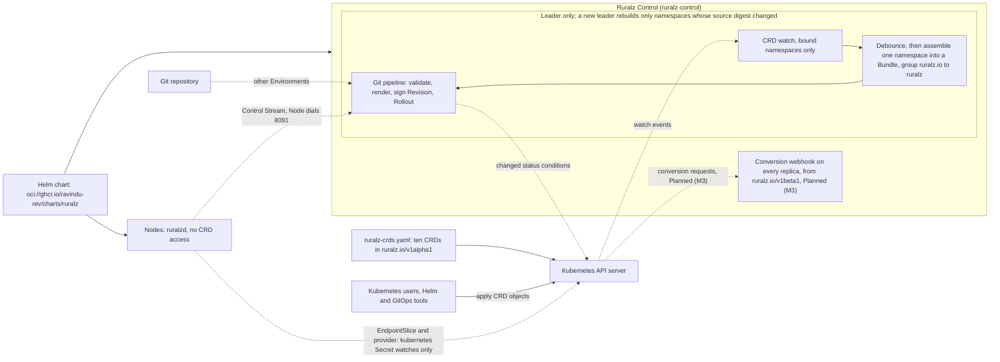
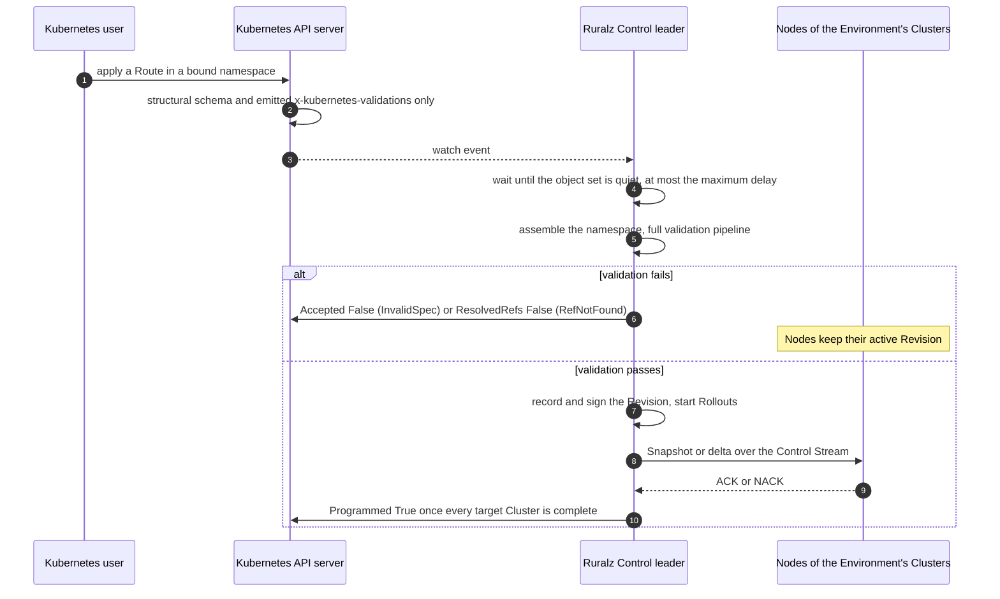

# ADR-0016: Kubernetes packaging: Helm chart and CRDs mirroring kinds, Gateway API deferred

## Context and problem statement

Ruralz runs without Kubernetes (P2), but topology T4 in [Deployment topologies](../operations/01-deployment-topologies.md#t4-kubernetes-with-helm-hpa-and-crds) installs it with a chart and declares configuration as Kubernetes objects. Envoy Gateway, NGINX Gateway Fabric, Traefik Proxy and the Gravitee Kubernetes Operator report Gateway API v1.6.1 conformance ([source](https://gateway-api.sigs.k8s.io/implementations/)). Tyk made its Operator closed source in 2024-10 ([source](https://github.com/TykTechnologies/tyk-operator)), and from v1.0 it requires a license key ([source](https://tyk.io/docs/5.6/product-stack/tyk-operator/release-notes/operator-1.0/)).

The [Configuration model](../architecture/02-configuration-model.md#kubernetes-mapping) already uses the Kubernetes envelope, and Kubernetes rejects a CRD group without a dot. The question: which Kubernetes API carries configuration, and who reads it, without a second schema, a second Revision pipeline, or CRD access on Nodes?

## Decision drivers

- **One schema** ([ADR-0003](0003-configuration-format.md)): a Kubernetes form MUST translate to the Bundle form, and equal rendered resources MUST yield one Revision digest from any source.
- **P2, P3, P4 and P9**: `ruralzd` needs no Kubernetes API to obtain configuration ([principles](../vision/01-vision-and-positioning.md#principles)); an API server outage never reaches the request path, and Nodes keep their active Revision.
- **P5, Git is the source of truth**: other sources are audited and visible as Drift.
- **P1, everything is free**: the chart, CRDs and images are Apache-2.0, with no license check.
- **Coverage**: every kind reaches Kubernetes, including `Plugin`, `AIProvider` and `AIModel`.
- **Timing**: the Helm chart and CRDs ship with Ruralz Control, Planned (M2).

## Considered options

1. **Helm chart and mirrored CRDs, Gateway API deferred**: one CRD per kind in `ruralz.io/v1alpha1`, watched only by Ruralz Control.
2. **Gateway API conformance first**: `GatewayClass`, `Gateway` and `HTTPRoute` carry configuration, with Ruralz Policies as policy CRDs attached through `targetRefs`, the model of Envoy Gateway ([source](https://gateway.envoyproxy.io/docs/concepts/)) ([source](https://gateway.envoyproxy.io/docs/api/extension_types/)) and Agent Router ([source](https://theagentrouter.ai/docs/capabilities/traffic/quota-policy/)).
3. **Helm chart only**: Kubernetes installs use Git or OCI sources (T2, T3); no CRDs, so no Kubernetes-native authoring, which Tyk now sells under license ([source](https://tyk.io/docs/5.6/product-stack/tyk-operator/release-notes/operator-1.0/)).
4. **CRDs read by every Node**: `ruralzd` watches CRDs through dynamic informers, a list-and-watch per kind ([source](https://pkg.go.dev/k8s.io/client-go/informers/discovery/v1)), option (b) of OQ-configuration-model-2.

## Decision outcome

Chosen option: "Helm chart and mirrored CRDs, Gateway API deferred", because it is the only option that keeps one schema and one Revision pipeline for every source, exposes every kind, keeps CRDs and configuration delivery off Nodes and ships with Ruralz Control. It matches the foundation pack section 7 Kubernetes row, and [Deployment topologies](../operations/01-deployment-topologies.md#t4-kubernetes-with-helm-hpa-and-crds) owns the chart objects.

| Element | Rule | Planned |
|---|---|---|
| Chart | `oci://ghcr.io/ravindu-rev/charts/ruralz` at the product version, Apache-2.0 and Sigstore-signed ([Release artifacts](../engineering/04-release-versioning-and-compatibility.md#release-artifacts)). It installs `ruralz-control` and Nodes as StatefulSets with separate image tags, upgraded Ruralz Control first (OQ-release-versioning-and-compatibility-11 (b)). Values schema: OQ-deployment-topologies-1 | Planned (M2) |
| CRDs | `ruralz-crds.yaml`, generated into `deploy/crds/` from the rendered JSON Schema view: one CRD per kind, group `ruralz.io`, version `v1alpha1`, category `ruralz`. Kind names are unchanged; short names are `rz` plus the lower-case kind, except `rzgw` and `rzenv` (OQ-configuration-model-3 (a)). Lowering inlines `$ref` (recursion fails generation); checks with no structural equivalent, over the Kubernetes CEL cost budget or using Ruralz-only variables run only in Ruralz Control, which the generator lists | Planned (M2) |
| CRD translation | Server-set `metadata` and `status` are dropped; otherwise only the group changes. One bound namespace becomes one Bundle holding exactly one `Gateway` (RZ-CFG-016); `Environment` and `Cluster` are cluster-scoped. `x-ruralz-validations` become `x-kubernetes-validations` where lowering allows; `${VAR}` in non-string fields is rejected; a status subresource carries `Accepted`, `ResolvedRefs` and `Programmed` ([Status conditions](../architecture/02-configuration-model.md#status-conditions-in-the-crd-path)) | Planned (M2) |
| Reader | Only the Ruralz Control leader watches CRDs, off until process configuration binds a namespace to an Environment (OQ-control-plane-and-gitops-1). It assembles a namespace into a Bundle and runs the Git pipeline once its object set is quiet for a debounce window, or after a maximum delay (both target values), so one multi-object apply yields one Revision. `ruralzd` never reads CRDs (OQ-configuration-model-2 (a)); without Ruralz Control, Kubernetes installs use T2 | Planned (M2) |
| CRD source | One primary source per Environment, a Git path or one bound namespace (OQ-system-overview-8 (a) and (b)). Until OQ-deployment-topologies-19 decides, a namespace source shows as Git divergence Drift, is refused under `requireApproval` unless overridden (audited) and never promotes | Planned (M2) |
| CRD versions | While only `ruralz.io/v1alpha1` is served, `conversion.strategy: None` needs no webhook. From `ruralz.io/v1beta1`, every Ruralz Control replica serves the conversion webhook (port: OQ-deployment-topologies-13). A new served version applies only once every replica runs N, and becomes the storage version no earlier than the next minor | Planned (M2); `ruralz.io/v1beta1` and the webhook Planned (M3) |
| Gateway API | No conformance work; a later adapter would map Gateway API objects to existing kinds (OQ-vision-and-positioning-4) | Not planned within M0 to M5: mirrored CRDs already expose every feature |

*Figure 1: the CRD path; dashed edges are off the request path.*

*Figure 2: one CRD change from apply to `Programmed`.*

### Consequences

- Good, because one schema drives CLI, Ruralz Control and CRDs, so equal rendered resources yield one Revision and diagnostics from any source.
- Good, because every feature is reachable with `kubectl` and GitOps tooling, free under P1.
- Good, because an API server outage stops new CRD changes and freezes EndpointSlice discovery and `provider: kubernetes` secret refresh at their last state, while running Nodes keep their active Revision (P9); a Node restarted meanwhile stays not ready if it needs such a secret (pack 8.5).
- Good, because authors of Bundle kinds need only namespace-scoped RBAC; only authors of cluster-scoped `Environment` and `Cluster` objects need cluster-scoped rights, and no chart component reads Secrets cluster-wide.
- Bad, because Ruralz stays off the Gateway API conformance list while competitors report v1.6.1 ([source](https://gateway-api.sigs.k8s.io/implementations/)), and users learn Ruralz kinds instead of a portable `HTTPRoute`.
- Bad, because admission checks only the structural schema and emitted `x-kubernetes-validations`: reference and slot errors appear only as conditions after apply, and Plugin `configSchema` rules run only in Ruralz Control, since Policy `config` is schemaless in the CRD.
- Bad, because until the proposed Open questions below close, client-side `kubectl apply`, Helm and Argo CD metadata change the digest of equal resources, and a non-atomic apply slower than the debounce window can expose an intermediate object set.
- Bad, because once a second version is served, reads in a non-storage version fail while every Ruralz Control replica is down.

### Confirmation

- **Generated drift gate**: CI stage 3 in `pr-fast` regenerates `deploy/crds/` and fails on `git diff --exit-code` ([CI stages](../engineering/02-repository-layout-and-conventions.md#ci-stages)), Planned (M2).
- **Equivalence test** (proposed), Planned (M2): the golden-corpus example Bundle rendered for `prod`, applied by `kubectl apply --server-side` without tool labels or annotations to a bound namespace in kind (Kubernetes in Docker), MUST yield its Git render's digest and RZ-CFG diagnostics ([Golden tests](../engineering/03-testing-and-quality-strategy.md#golden-tests)); once the drop rule exists, it MUST also cover Helm and client-side applies.
- **kind end-to-end suite**, Planned (M2): chart install, CRD ingestion with conditions, rolling pod replacement with readiness gating and Drain ([End-to-end tests](../engineering/03-testing-and-quality-strategy.md#end-to-end-tests)). It also (proposed) fails on any generated CRD the API server rejects or finds over its cost budget, asserts that a multi-object change applied in random order records exactly one Revision, and that a Node's service account is denied `list` on `ruralz.io` resources.
- **Upgrade test** (proposed), Planned (M3): `ruralz-crds.yaml` applies in [Release artifacts](../engineering/04-release-versioning-and-compatibility.md#release-artifacts) order and fails on a served-version addition before finalize.
- **Review checklist item**: a pull request adding a Gateway API resource, a CRD reader outside Ruralz Control, or a CRD field absent from the Configuration model MUST amend this ADR.

## Pros and cons of the options

### Helm chart and mirrored CRDs, Gateway API deferred

- Good, because the translation changes only the group, so no second schema exists.
- Good, because Kubernetes stays optional and configuration delivery stays off Nodes.
- Bad, because Ruralz must write CRD status and, from Planned (M3), run the conversion webhook.

### Gateway API conformance first

- Good, because conformance is what evaluators compare, with v1.6.0 making TCPRoute and UDPRoute GA ([source](https://github.com/kubernetes-sigs/gateway-api/releases/tag/v1.6.0)).
- Bad, because AI models, Token Budgets and WASM Plugins still need implementation-specific policy CRDs, as Envoy Gateway's `EnvoyExtensionPolicy` shows ([source](https://gateway.envoyproxy.io/docs/api/extension_types/)).
- Bad, because `targetRefs` attach in reverse, so a new Policy could silently change any Route, which forward references forbid ([Attachment and precedence](../architecture/02-configuration-model.md#attachment-and-precedence)).
- Bad, because Bundles outside Kubernetes (P2) would still need the Ruralz kinds, leaving two models.

### Helm chart only

- Good, because it needs no CRD watch or conversion webhook.
- Bad, because Kubernetes users get no native authoring, a gap vendors gate ([source](https://github.com/TykTechnologies/tyk-operator)).

### CRDs read by every Node

- Good, because Kubernetes installs would need no Ruralz Control.
- Bad, because each Node would add ten CRD informers to the EndpointSlice informers it already holds, so API server load and RBAC grow with Node count.
- Bad, because Nodes would skip Revision signing, canaries, audit and Drift, breaking P5 and the one-mode rule of the [System overview](../architecture/01-system-overview.md#deployment-modes).

## More information

- Owning document: [Deployment topologies](../operations/01-deployment-topologies.md#t4-kubernetes-with-helm-hpa-and-crds); CRD mapping: [Configuration model](../architecture/02-configuration-model.md#kubernetes-mapping); CRD source: [Control plane and GitOps](../architecture/04-control-plane-and-gitops.md#ruralz-console-write-back-and-other-sources); non-goal 7 in [Vision and positioning](../vision/01-vision-and-positioning.md#product-non-goals).
- client-go is linked into both binaries ([Tech stack and libraries](../engineering/01-tech-stack-and-libraries.md#library-catalog)); Nodes watch only EndpointSlices and `provider: kubernetes` Secrets.
- Proposed amendments: the Configuration model, owner of the canonical form, SHOULD open an Open question on which tool-managed labels and annotations the translation drops, and note that not every rule is emitted; Deployment topologies SHOULD open one on how a namespace source signals a complete object set: (a) debounce only; (b) an expected object-set digest, like `ruralz bundle push`.
- Revisit when OQ-vision-and-positioning-4 schedules conformance.
