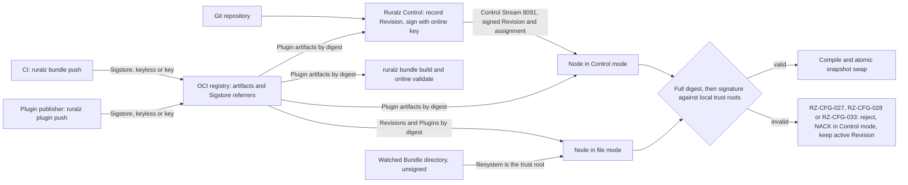

# ADR-0017: Artifact signing: Revisions and Plugins signed, verified by Nodes by default

## Context and problem statement

Nodes activate Revisions and Plugin artifacts arriving over the Control Stream in Control mode, or by OCI pull or a watched Bundle directory in file mode ([System overview](../architecture/01-system-overview.md#deployment-modes)). Threat T6 of [Security and identity](../architecture/08-security-and-identity.md#threat-model-and-trust-boundaries) covers tampering, replay and retagging across TB-5 (Node to Ruralz Control) and TB-8 (Node to OCI registry).

A digest proves which bytes arrived, not who chose them: a file-mode Node learns its Revision digest from a repository reference (OQ-system-overview-19), and a Bundle author can pin any Plugin digest. The freeze answered OQ-system-overview-3 with this ADR. Nothing is implemented; signing and verification are Planned (M2).

## Decision drivers

- **T6 integrity and origin**: every activated artifact is bound to its digest and a trusted identity.
- **P9, fail static**: a bad artifact is rejected before any swap ([Principles](../vision/01-vision-and-positioning.md#principles)).
- **P2 and P1, standalone and free**: file mode verifies without Ruralz Control or any Revington service.
- **P10, measured, not claimed**: a disabled check emits a degraded-state metric.
- **P6, custom code is sandboxed**: the sandbox limits what a Plugin does; signatures add who published it.
- **Trust outside the Bundle**: authors cannot trust their own content.
- **Stable digests**: signing never changes a digest ([Validation and diff semantics](../architecture/02-configuration-model.md#validation-and-diff-semantics)).
- **Library gates**: pure Go, Apache-2.0, FIPS via G3 ([Tech stack and libraries](../engineering/01-tech-stack-and-libraries.md#selection-criteria)).

## Considered options

1. **Layered signing, verified offline by default**: sigstore-go, "considered stable and ready for production use", accepts custom trusted roots ([source](https://github.com/sigstore/sigstore-go)); oras-go v2 has a Referrers API ([source](https://pkg.go.dev/oras.land/oras-go/v2/registry/remote)).
2. **Digest verification only**: pull by digest with oras-go ([source](https://github.com/oras-project/oras-go)), trusting whoever supplied it.
3. **Sigstore for every artifact, Control-mode Revisions included**: Ruralz Control signs keyless through Fulcio and OIDC, as cosign supports ([source](https://github.com/sigstore/cosign)).
4. **Signatures opt-in**: verify only when enabled, as standalone cosign does ([source](https://github.com/sigstore/cosign)).
5. **cosign as the embedded signing and verification library**: Apache-2.0 at v3.1.3 ([source](https://github.com/sigstore/cosign/releases/tag/v3.1.3)).

## Decision outcome

Chosen option: "Layered signing, verified offline by default", because it alone proves origin on every signed path, keeps the Control-mode trust root inside Enrollment and needs no lookup at activation, matching the pack section 7 row and [pack 8.14](../_meta/foundation-pack.md#814-artifact-signing-adr-0017):

| Artifact | Signed by | Verified by | Default | Planned |
|---|---|---|---|---|
| Every Revision and Plugin artifact | Content addressing | Every fetch, by full `sha256:<64 hex>` (RZ-CFG-027 for Revisions, RZ-CFG-028 for Plugins) | Always on; not configurable | Planned (M1); OCI and Control Stream Planned (M2) |
| Revision in Control mode | Ruralz Control's online key ([Revision signing and verification](../architecture/04-control-plane-and-gitops.md#revision-signing-and-verification)) | Each Node before activation and at Last-Known-Good boot, against Enrollment anchors | Always verified; failure is a NACK | Planned (M2) |
| Revision published to OCI (file mode) | CI at `ruralz bundle push`, Sigstore (keyless OIDC or a key) referrer | Each Node before activation | `enforce`; an explicit `off` is a degraded state | Planned (M2) |
| Plugin artifact | Publisher at `ruralz plugin push`, Sigstore referrer | `ruralz bundle build`, `ruralz bundle validate --online`, Ruralz Control at ingest, Nodes at activation | `enforce`; `warn` in `ruralz dev run`; `off` is degraded | Planned (M2) |
| Watched Bundle directory | Not signed | The operator's filesystem is the trust root | Not applicable | Planned (M1) |

Rules that follow:

- **Failure.** A signature missing from a reachable registry, invalid, or matching no trusted identity is RZ-CFG-033 ([Configuration model](../architecture/02-configuration-model.md#error-codes)), a deterministic NACK (pack 8.3); a failed or timed-out registry or referrer fetch is a transient NACK, retried then quarantined ([WASM plugin system](../architecture/05-wasm-plugin-system.md#failure-semantics-and-the-rz-plg-registry)). The Node keeps its active Revision; verification is step 1 of [Compile before swap](../architecture/01-system-overview.md#compile-before-swap), off the request path.
- **Trust policies.** Control mode: root-signed anchor sets carry the online keys and the Plugin trust policy, via Enrollment and `TrustUpdate`; Ruralz Control's process configuration (OQ-control-plane-and-gitops-1, option (a) proposed) only feeds the offline root signing. File mode: the Node's process configuration (OQ-security-and-identity-8), also read by `ruralz bundle build` and `ruralz bundle validate --online` (flags: [CLI and API surface](../reference/01-cli-and-api-surface.md)), which without one fail with RZ-CFG-033 naming the missing input. Trust policies never live in a Bundle. Under `enforce` an empty trust policy rejects everything; keyless entries name exact issuer and subject pairs, and patterns are opt-in ([Signed Revisions and Plugin artifacts](../architecture/08-security-and-identity.md#signed-revisions-and-plugin-artifacts)).
- **Offline verification.** Nodes never fetch trust roots over TUF. The Sigstore trusted root (Fulcio, log and timestamp keys) sits in the anchor-set Plugin trust policy in Control mode, refreshed by `TrustUpdate` (to confirm: OQ-control-plane-and-gitops-1), and in process configuration in file mode. A keyless signature MUST be a Sigstore bundle carrying a transparency-log inclusion proof and at least one trusted timestamp; the Node checks the certificate against that time, and the log and timestamp keys against its local trusted root; a missing or unverifiable proof or timestamp is RZ-CFG-033. Key-based signatures verify against the configured key. cosign signs through Rekor v2 since v3.1.1 ([source](https://github.com/sigstore/cosign/releases)), a tile-backed log with yearly shards ([source](https://blog.sigstore.dev/rekor-v2-ga/)).
- **Bounds.** Verifiers list only Sigstore bundle referrers and try at most 16 of at most 1 MiB each within 10 s (target), inside the 64 MiB and 30 s fetch limits (target) of [Control plane and GitOps](../architecture/04-control-plane-and-gitops.md#building-and-recording-a-revision), proposed there for Nodes and the CLI. No valid signature within the count and size limits is RZ-CFG-033; a timeout is transient. Results are cached by artifact digest and trust policy version.
- **What a signature binds.** Control mode signs Revisions (digest, Environment, key ID, time), assignments (Cluster, Environment, digest, `rolloutId`, `storeEpoch`, `assignmentSeq`) and promotions (Cluster, `promotedDigest`, `storeEpoch`, `promotionSeq`), stopping cross-Cluster, stale, deposed-leader and Last-Known-Good replay. OCI Revisions bind digest and signature only until OQ-security-and-identity-26 closes; each Environment SHOULD use its own signing identity, so trust policies reject other Environments' Revisions.
- **Algorithms and libraries.** ECDSA P-256 and SHA-256 through Go `crypto/ecdsa` for Ruralz Control; `sigstore/sigstore-go` v1.3.x; `oras.land/oras-go/v2` v2.6.2 or newer, above GO-2026-5879 ([Library catalog](../engineering/01-tech-stack-and-libraries.md#library-catalog)).
- **Key compromise.** After emergency key removal, a Node refuses to boot a candidate or Last-Known-Good accepted from that key after `compromisedSince` and stays not ready until the Control Stream delivers, an exception to pack 8.2 step (3) and P9 (OQ-control-plane-and-gitops-24, option (a)).
- **Scope.** Release artifact signing (images, SBOM) belongs to [Release, versioning and compatibility](../engineering/04-release-versioning-and-compatibility.md).

*Figure 1: who signs each artifact and where Nodes verify it before activation.*

### Consequences

- Good, because it closes T6 on TB-5 and TB-8 for every artifact outside a watched directory.
- Good, because air-gapped installs copy artifacts and referrers by digest, and Control-mode Revisions need no Sigstore infrastructure.
- Good, because a disabled check is a degraded state, such as `ruralz_node_degraded_info{reason="plugin_signature_off"}` ([WASM plugin system](../architecture/05-wasm-plugin-system.md#observability)).
- Bad, because two signing schemes exist: Ruralz Control keys (custody: OQ-control-plane-and-gitops-8) and Sigstore.
- Bad, because file-mode Nodes accept older same-identity Revisions until OQ-security-and-identity-26 closes.
- Bad, because Sigstore trusted roots need a refresh at least yearly, as Rekor v2 shards yearly, or new keyless signatures fail under `enforce`; in Control mode each refresh, like revoking a Plugin publisher, waits on an offline root signing.
- Bad, because the key-compromise boot refusal leaves a Node not ready while Ruralz Control is unreachable.
- Bad, because sigstore-go's G3 FIPS status is unconfirmed (OQ-tech-stack-and-libraries-9); the Control-mode path uses only `crypto/ecdsa`.

### Confirmation

- **Integration tests**, Planned (M2): the OCI registry container asserts RZ-CFG-027 (Revision digest), RZ-CFG-028 (Plugin digest), RZ-CFG-033 (signature) and the referrer bounds at each place pack 8.14 names ([Integration tests](../engineering/03-testing-and-quality-strategy.md#integration-tests)).
- **Chaos test**, Planned (M2): a bad Revision digest or signature is rejected before any swap ([Chaos testing](../engineering/03-testing-and-quality-strategy.md#chaos-testing)).
- **Interoperability job**, Planned (M2), with the OCI registry integration tests: cosign 3.1.3 or newer referrers, keyless bundles included, verify with sigstore-go with egress denied (hypothesis until it passes).
- **FIPS CI job**, Planned (M5): the G3 check confirms `crypto/ecdsa` signing and decides sigstore-go under OQ-tech-stack-and-libraries-9.
- **Review checklist item**: a pull request that skips the verifier, reads a trust policy from a Bundle, or makes the Control-mode check configurable MUST amend this ADR.

## Pros and cons of the options

### Layered signing, verified offline by default

- Good, because each path reuses its trust root: Enrollment, or CI and publisher identities.
- Bad, because Nodes link sigstore-go and oras-go, and two key-management procedures need documentation.

### Digest verification only

- Good, because it needs no keys, trust policy or referrers.
- Bad, because whoever moves a repository reference or edits a Bundle chooses what runs, leaving T6 open.

### Sigstore for every artifact, Control-mode Revisions included

- Good, because one verification library and policy format cover every artifact.
- Bad, because keyless signing needs online Fulcio and OIDC at record time, and sigstore-go fetches its root over TUF unless given one ([source](https://github.com/sigstore/sigstore-go)), which air-gapped installs avoid with Enrollment anchors.

### Signatures opt-in

- Good, because nothing breaks for operators who never configure keys.
- Bad, because default installs run unverified code, contradicting pack 8.14 and hiding a degraded state (P10).

### cosign as the embedded signing and verification library

- Good, because cosign supports keyless, KMS and hardware-token signing ([source](https://github.com/sigstore/cosign)).
- Bad, because its README points library users to sigstore-go and plans a major release on it ([source](https://github.com/sigstore/cosign)), and the tech stack lists it only as an alternative.

## More information

- Owning document: [Security and identity](../architecture/08-security-and-identity.md#signed-revisions-and-plugin-artifacts); mechanisms in [Control plane and GitOps](../architecture/04-control-plane-and-gitops.md#revision-signing-and-verification) and [WASM plugin system](../architecture/05-wasm-plugin-system.md#signing-and-verification).
- Research: [Tooling and licenses](../_meta/research/tooling-and-licenses.md) section 2 records sigstore-go v1.3.0 ([source](https://github.com/sigstore/sigstore-go/releases/tag/v1.3.0)) and oras-go v2.6.2 ([source](https://github.com/oras-project/oras-go/releases/tag/v2.6.2)) as Apache-2.0.
- Related decisions: [ADR-0007](0007-control-stream-protocol.md) (NACKs), [ADR-0005](0005-plugin-abi-v1.md), [ADR-0001](0001-implementation-language-go.md) (FIPS build).
- Open questions refining, not reversing, it: OQ-security-and-identity-8 and -26, OQ-control-plane-and-gitops-1, -8 and -24, OQ-system-overview-19, OQ-wasm-plugin-system-6 and -14, OQ-release-versioning-and-compatibility-3.
