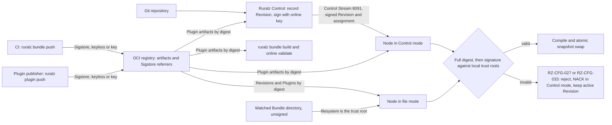

# ADR-0017: Artifact signing: Revisions and Plugins signed, verified by Nodes by default

## Context and problem statement

Nodes activate Revisions (routing, Policies, API key hashes) and Plugin artifacts (WASM code), arriving by three paths: the Control Stream in Control mode, an OCI pull in file mode, and a watched Bundle directory in file mode ([System overview](../architecture/01-system-overview.md#deployment-modes)). Threat T6 of [Security and identity](../architecture/08-security-and-identity.md#threat-model-and-trust-boundaries) covers tampering, replay and retagging across TB-5 (Node to Ruralz Control) and TB-8 (Node to OCI registry).

A digest proves which bytes arrived, not who chose them: a file-mode Node learns its Revision digest from a repository reference (OQ-system-overview-19), and a Bundle author can pin any Plugin digest in `Plugin.spec.image`. The freeze answered OQ-system-overview-3 with this ADR: who signs and verifies each artifact, the default, and where trust lives. Nothing is implemented; signing and verification are Planned (M2).

## Decision drivers

- **T6 integrity and origin**: every artifact a Node activates is bound to its digest and to an identity the operator trusts.
- **P9, fail static**: a bad artifact is rejected before any swap and the active Revision keeps serving ([Principles](../vision/01-vision-and-positioning.md#principles)).
- **P2 and P1, standalone and free**: file mode verifies without Ruralz Control, and no Revington service or online lookup takes part.
- **P10, degraded states are visible**: turning a check off emits a metric and a warning.
- **P6, supply chain for custom code**: a Plugin's publisher is checked, not only its bytes.
- **Trust outside the Bundle**: a Bundle author cannot grant their own content trust.
- **Stable digests**: signing never changes a Revision digest (pack 8.1).
- **Library gates**: pure Go, Apache-2.0 compatible and a FIPS path through the G3 check ([Tech stack and libraries](../engineering/01-tech-stack-and-libraries.md#selection-criteria)).

## Considered options

1. **Layered signing, verified offline by default**: digests always; Ruralz Control signs Revisions; CI and Plugin publishers sign OCI artifacts with Sigstore; Nodes verify. sigstore-go is "considered stable and ready for production use" and accepts custom trusted roots ([source](https://github.com/sigstore/sigstore-go)); the oras-go v2 remote client has a Referrers API ([source](https://pkg.go.dev/oras.land/oras-go/v2/registry/remote)).
2. **Digest verification only**: pull by digest with oras-go ([source](https://github.com/oras-project/oras-go)) and trust whoever supplied the digest.
3. **Sigstore for every artifact, Control-mode Revisions included**: Ruralz Control signs keyless through Fulcio and OIDC, as cosign supports ([source](https://github.com/sigstore/cosign)).
4. **Signatures opt-in**: sign when configured and verify only when an operator enables it.
5. **cosign as the embedded signing and verification library**: Apache-2.0 at v3.1.3 ([source](https://github.com/sigstore/cosign/releases/tag/v3.1.3)).

## Decision outcome

Chosen option: "Layered signing, verified offline by default", because it alone proves origin on every signed path, keeps the Control-mode trust root inside Enrollment and needs no network lookup at activation. It matches the foundation pack section 7 Artifact signing row and [pack 8.14](../_meta/foundation-pack.md#814-artifact-signing-adr-0017):

| Artifact | Signed by | Verified by | Default | Planned |
|---|---|---|---|---|
| Every Revision and Plugin artifact | Content addressing | Every fetch checks the full `sha256:<64 hex>` (RZ-CFG-027 for Revisions, RZ-CFG-028 for Plugins) | Always on; not configurable | Planned (M1); OCI and Control Stream Planned (M2) |
| Revision in Control mode | Ruralz Control when it records the Revision, with its online key ([Revision signing and verification](../architecture/04-control-plane-and-gitops.md#revision-signing-and-verification)) | Each Node before activation and at Last-Known-Good boot, against anchors received at Enrollment | Always verified; failure is a NACK | Planned (M2) |
| Revision published to OCI (file mode) | CI at `ruralz bundle push`, with Sigstore (keyless OIDC or a key), stored as an OCI referrer | Each Node before activation | `enforce`; `off` must be set explicitly and is a degraded state | Planned (M2) |
| Plugin artifact | Its publisher at `ruralz plugin push`, with Sigstore, as an OCI referrer | `ruralz bundle build`, `ruralz bundle validate --online`, Ruralz Control at ingest, Nodes at activation | `enforce`; `warn` in `ruralz dev run`; `off` is a degraded state | Planned (M2) |
| Watched Bundle directory | Not signed | The operator's filesystem is the trust root | Not applicable | Planned (M1) |

Rules that follow:

- **Failure.** Every signature failure is RZ-CFG-033 ([Configuration model](../architecture/02-configuration-model.md#error-codes)). The Node rejects the artifact before any swap, NACKs in Control mode and keeps its active Revision. Verification is step 1 of [Compile before swap](../architecture/01-system-overview.md#compile-before-swap), off the request path.
- **Trust policies.** Control mode: root-signed anchor sets carry the online keys and the Plugin trust policy from Ruralz Control's process configuration, delivered at Enrollment and by `TrustUpdate`. File mode: the Node's process configuration (OQ-security-and-identity-8). Trust policies never live in a Bundle. Under `enforce` an empty trust policy rejects everything; keyless entries name exact issuer and subject pairs, and patterns are opt-in ([Signed Revisions and Plugin artifacts](../architecture/08-security-and-identity.md#signed-revisions-and-plugin-artifacts)).
- **Offline verification.** Trust roots, including the Sigstore trusted root for keyless identities, are supplied locally; Nodes never fetch one over TUF at activation.
- **What a signature binds.** In Control mode, a Revision signature (digest, Environment, key ID, time) and an assignment signature (Cluster, Environment, digest, sequence) stop replay into another Cluster or behind a newer assignment. For OCI Revisions, Nodes check digest and signature only until OQ-security-and-identity-26 closes; each Environment SHOULD use its own signing identity, so a Node's trust policy rejects Revisions signed for another Environment.
- **Algorithms and libraries.** Ruralz Control signs with ECDSA P-256 and SHA-256 through Go `crypto/ecdsa`. Sigstore uses `sigstore/sigstore-go` v1.3.x; fetches use `oras.land/oras-go/v2` v2.6.2 or newer, above GO-2026-5879 ([Library catalog](../engineering/01-tech-stack-and-libraries.md#library-catalog)).
- **Key compromise.** After emergency key removal, a Node refuses to boot a candidate or Last-Known-Good accepted from that key after `compromisedSince` and stays not ready until the Control Stream delivers (OQ-control-plane-and-gitops-24, option (a)).
- **Scope.** Release artifact signing (images, SBOM) is separate and owned by [Release, versioning and compatibility](../engineering/04-release-versioning-and-compatibility.md).

*Figure 1: who signs each artifact and where Nodes verify it before activation.*

### Consequences

- Good, because every activated artifact outside a watched directory is bound to a digest and a trusted identity, closing T6 tampering and retagging on TB-5 and TB-8.
- Good, because air-gapped installs copy artifacts and referrers by digest and verify unchanged.
- Good, because the Control-mode trust root arrives at Enrollment with the Node's identity, so Control-mode Revisions need no Sigstore infrastructure.
- Good, because a disabled check is a degraded state, such as `ruralz_node_degraded_info{reason="plugin_signature_off"}` for Plugins ([WASM plugin system](../architecture/05-wasm-plugin-system.md#observability)).
- Bad, because two signing schemes exist: Ruralz Control keys, rotated per [Control plane and GitOps](../architecture/04-control-plane-and-gitops.md#revision-signing-and-verification) (key custody: OQ-control-plane-and-gitops-8), and Sigstore for CI and publishers.
- Bad, because file-mode Nodes can still be rolled back to an older Revision signed by the same identity until OQ-security-and-identity-26 adds signed Environment and sequence annotations.
- Bad, because operators must refresh local Sigstore trusted roots themselves, and a stale root rejects new keyless signatures under `enforce`.
- Bad, because the G3 FIPS status of sigstore-go is unconfirmed (OQ-tech-stack-and-libraries-9), while the Control-mode path uses only `crypto/ecdsa`.

### Confirmation

- **Integration tests**, Planned (M2): the OCI registry container covers Revision and Plugin pulls by digest with Sigstore verification, asserting RZ-CFG-027 and RZ-CFG-033 at each place pack 8.14 names ([Integration tests](../engineering/03-testing-and-quality-strategy.md#integration-tests)).
- **Chaos test**, Planned (M2): a Revision with a bad digest or signature is rejected before any swap, with a NACK in Control mode ([Chaos testing](../engineering/03-testing-and-quality-strategy.md#chaos-testing)).
- **Interoperability job**, Planned (M2): referrers written by cosign 3.1.3 or newer verify with sigstore-go (hypothesis until the job passes), with network egress denied to prove offline verification.
- **FIPS CI job**, Planned (M5): the G3 check confirms `crypto/ecdsa` signing and decides sigstore-go under OQ-tech-stack-and-libraries-9.
- **Review checklist item**: a pull request that activates a Revision or Plugin without the verifier, reads a trust policy from a Bundle, or adds a configurable Control-mode signature check MUST amend this ADR.

## Pros and cons of the options

### Layered signing, verified offline by default

- Good, because each path reuses its existing trust root: Enrollment in Control mode, CI and publisher identities for OCI.
- Bad, because Nodes link sigstore-go and oras-go, and two key-management procedures need documentation.

### Digest verification only

- Good, because it needs no keys, trust policy or referrers.
- Bad, because anyone who can move a repository reference or edit a Bundle chooses what runs, leaving T6 open on TB-8.

### Sigstore for every artifact, Control-mode Revisions included

- Good, because one verification library and one policy format cover every artifact.
- Bad, because keyless signing needs online Fulcio and OIDC at record time, and sigstore-go fetches its trusted root over TUF unless given a custom one ([source](https://github.com/sigstore/sigstore-go)), which adds an external dependency to air-gapped Control-mode installs that Enrollment anchors already avoid.

### Signatures opt-in

- Good, because nothing breaks for operators who never configure keys.
- Bad, because the default install runs unverified configuration and code, which contradicts pack 8.14 and hides a degraded state (P10).

### cosign as the embedded signing and verification library

- Good, because cosign supports keyless signing, KMS, hardware tokens and OCI storage ([source](https://github.com/sigstore/cosign)).
- Bad, because its README points library contributions to sigstore-go and plans a major release built on it ([source](https://github.com/sigstore/cosign)), and the tech stack lists it only as an alternative not chosen.

## More information

- Owning document: [Security and identity](../architecture/08-security-and-identity.md), section [Signed Revisions and Plugin artifacts](../architecture/08-security-and-identity.md#signed-revisions-and-plugin-artifacts); mechanisms in [Revision signing and verification](../architecture/04-control-plane-and-gitops.md#revision-signing-and-verification) and [WASM plugin system signing](../architecture/05-wasm-plugin-system.md#signing-and-verification); the code in [Validation and diff semantics](../architecture/02-configuration-model.md#validation-and-diff-semantics).
- Research: [Tooling and licenses](../_meta/research/tooling-and-licenses.md) section 2 records sigstore-go v1.3.0 ([source](https://github.com/sigstore/sigstore-go/releases/tag/v1.3.0)) and oras-go v2.6.2 ([source](https://github.com/oras-project/oras-go/releases/tag/v2.6.2)) as Apache-2.0.
- Related decisions: [ADR-0007](0007-control-stream-protocol.md) (Control Stream NACKs), [ADR-0005](0005-plugin-abi-v1.md) (Plugin ABI v1) and [ADR-0001](0001-implementation-language-go.md) (FIPS build).
- Open questions that refine, not reverse, this decision: OQ-security-and-identity-8 and -26, OQ-control-plane-and-gitops-1 and -8, OQ-system-overview-19, OQ-wasm-plugin-system-6 (registry credentials) and OQ-release-versioning-and-compatibility-3 (release signing tools).
