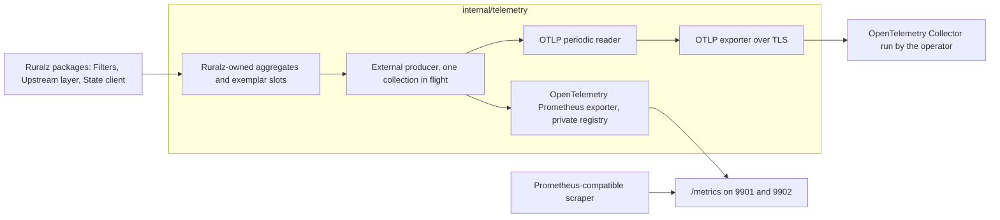

# ADR-0018: Telemetry: OpenTelemetry-first with an slog bridge and the OpenTelemetry Prometheus exporter

## Context and problem statement

[ADR-0010](0010-telemetry-opentelemetry-first.md) made Ruralz telemetry OpenTelemetry-first, with `log/slog` and the `otelslog` bridge for logs, and left two choices open: the `/metrics` exporter (OQ-tech-stack-and-libraries-16) and the OpenTelemetry Go SDK interface that exports Ruralz-owned metric aggregates (OQ-observability-16, blocking for M1 metrics). Both questions chose option (a). An accepted ADR changes only through a superseding one, so this ADR restates ADR-0010's decision and records both answers and the import confinement they rely on.

Which exporter serves `/metrics` on 9901 and 9902 with the names OTLP carries, how do Ruralz aggregates reach both, and which packages may import OpenTelemetry? Ruralz Gateway telemetry is Planned (M1), Ruralz Control Planned (M2), AI Planned (M3).

## Decision drivers

- **Vendor-neutral and free (P1, P10)**: identical signals in every build, FIPS (Planned (M5)) and air-gapped included.
- **Never on the critical path (O2)**: no request goroutine waits on a lock, exporter or scrape; bounded queues drop with a counter ([Observability](../architecture/10-observability.md#observability-principles)).
- **One name set**: OTLP and `/metrics` MUST show identical metric names.
- **Aggregate once**: Ruralz-owned aggregates, kept by name across Hot Reloads, feed both exports, and Ruralz decides when a series ends.
- **Stable call sites**: packages call stable APIs only; library churn stays inside `internal/telemetry`.
- **Gates G1 to G3, S2 and S7**: pure Go, compatible license, Go 1.26 floor, libraries wrapped in `internal/` ([Selection criteria](../engineering/01-tech-stack-and-libraries.md#selection-criteria)).

## Considered options

1. **OpenTelemetry-first with an external producer and the OpenTelemetry Prometheus exporter**: ADR-0010's decision, plus `go.opentelemetry.io/otel/exporters/prometheus` v0.68.x on a private `client_golang` registry, fed through `WithProducer` ([source](https://proxy.golang.org/go.opentelemetry.io/otel/exporters/prometheus/@v/v0.68.0.zip)).
2. **Prometheus client for `/metrics`**: `prometheus/client_golang` v1.24.1 collectors over the same aggregates ([source](https://github.com/prometheus/client_golang/releases/tag/v1.24.1)), beside the OTLP pipeline.
3. **Callback instruments**: OpenTelemetry asynchronous instruments observing the aggregates at each collection (OQ-observability-16 (b)).
4. **Ruralz encoders**: Ruralz code writes OTLP metrics and the exposition formats directly (OQ-observability-16 (c)).

## Decision outcome

Chosen option: "OpenTelemetry-first with an external producer and the OpenTelemetry Prometheus exporter", because one producer hands the same collection to the OTLP reader and the `/metrics` exporter, so both expose one name set while every call site keeps a stable API (OpenTelemetry traces and metrics, `log/slog`), per pack section 7.

| Area | Rule | Planned |
|---|---|---|
| Traces | SDK tracer; W3C Trace Context extracted at the server span and injected into every upstream leg; no baggage; unsampled requests create no spans | Planned (M1) for HTTP; Planned (M3) for gRPC; Planned (M4) for Kafka, NATS and MQTT 5 |
| Metrics | Ruralz-owned aggregates, not SDK synchronous instruments; one external producer (OQ-observability-16 (a)) serves the OTLP periodic reader and the `/metrics` exporter from one collection in flight per process | Planned (M1) |
| `/metrics` | The OpenTelemetry Prometheus exporter, registered with `WithRegisterer` on a private `client_golang` registry and fed with `WithProducer`, with translation strategy `UnderscoreEscapingWithoutSuffixes` because the default appends suffixes ([source](https://proxy.golang.org/go.opentelemetry.io/otel/exporters/prometheus/@v/v0.68.0.zip)) ([source](https://proxy.golang.org/github.com/prometheus/otlptranslator/@v/v1.0.0.zip)); one exporter for 9901 and 9902 (OQ-tech-stack-and-libraries-16 (a)); it MUST expose OpenMetrics exemplars | Planned (M1); 9902 Planned (M2) |
| Confinement | Only `internal/telemetry` imports `go.opentelemetry.io`, `github.com/prometheus` and, until M3, `google.golang.org/grpc`; the in-process test collector `internal/testkit/otlpsink` is the one exception. The `otel` depguard rule in `.golangci.yml` enforces it, turning ADR-0010's review checklist item into lint | Planned (M1) |
| Exemplars | Sampled requests alone write one slot per histogram label set per collection, exported through the producer and as OpenMetrics on `/metrics` | Planned (M1) |
| Logs | Only `log/slog` through `internal/telemetry`, except the audit export; no request goroutine runs a writing handler; bounded queues drop with `ruralz_telemetry_logs_dropped_total`; one stdout-owning worker feeds stdout and the `otelslog` v0.20.x bridge ([source](https://github.com/open-telemetry/opentelemetry-go-contrib/blob/main/bridges/otelslog/go.mod)) | Planned (M1); Ruralz Control Planned (M2) |
| Export | OTLP only when `Gateway.spec.telemetry.otlp.endpoint` is set, over TLS (TB-12); spans and logs pass bounded queues; `ruralzd` and `ruralz-control` remove every `OTEL_*` variable before any SDK constructor | Planned (M1) |
| Audit export | The Ruralz Control leader exports committed entries through a dedicated OTLP log exporter, bypassing `slog`, retrying until acknowledged and never dropping (OQ-observability-19) | Planned (M2) |
| Conventions and resource | HTTP semantic conventions without `url.full` and `url.query`; `gen_ai.*` pinned to one commit per release; `service.name`, `service.version`, `service.instance.id` | Planned (M1); `gen_ai` Planned (M3) |
| Vendor SDKs | None; vendors read the operator's OpenTelemetry Collector or a Prometheus-compatible scraper | Not planned: one export path (P1) |

When v1.47.0 brings the expected stable Logs API and SDK ([source](https://github.com/open-telemetry/opentelemetry-go/releases/tag/v1.47.0-rc.1)), it replaces the release-candidate SDK behind the bridge; `slog` call sites stay.

*Figure 1: one collection of Ruralz aggregates feeds both metric exports; only `internal/telemetry` imports OpenTelemetry.*

### Consequences

- Good, because OTLP and `/metrics` read one collection, so names and values match and each operation aggregates once.
- Good, because Ruralz, not the SDK, ends series, so Hot Reloads that rename Routes retire series within the [Cardinality budget](../architecture/10-observability.md#cardinality-budget).
- Good, because the confinement is lint, so churn in the pre-stable Logs SDK and the pre-1.0 exporter touches one package.
- Good, because `slog` call sites survive v1.47.0 unchanged, and (`trace_id`, server `span_id`) correlates spans, logs, exemplars and `requestId` (O6).
- Bad, because the exporter is pre-1.0 and its default strategy appends suffixes, so Ruralz MUST set the strategy and re-check each upgrade.
- Bad, because `otlptranslator`'s newest release dates from 2025-09-09 ([source](https://proxy.golang.org/github.com/prometheus/otlptranslator/@v/list)), failing S1.
- Bad, because the producer bypasses SDK aggregation and exemplar reservoirs, so Ruralz code owns buckets, exemplar slots and their tests.
- Bad, because until v1.47.0 the bridge feeds a pre-stable SDK, and v1.47.0-rc.1 already deprecates `otel/log/global` ([source](https://github.com/open-telemetry/opentelemetry-go/releases/tag/v1.47.0-rc.1)).
- Bad, because library instruments rename between releases (grpc-go v1.84.0 ([source](https://github.com/grpc/grpc-go/releases/tag/v1.84.0))), so Grafana dashboards and alerts use only `ruralz_*` names.
- Bad, because the lossless audit export waits on OQ-observability-19 (blocking for Planned (M2)), and OTLP authentication headers come after `telemetry.otlp.tls`, Planned (M1) ([Configuration model](../architecture/02-configuration-model.md#gateway)).

### Confirmation

- **Lint**: depguard `log$` rejects `log`, Planned (M0); the `otel` rule rejects `go.opentelemetry.io`, `github.com/prometheus` and `google.golang.org/grpc` imports outside `internal/telemetry` and `internal/testkit/otlpsink`, Planned (M1) ([Banned imports](../engineering/02-repository-layout-and-conventions.md#banned-imports)).
- **Name identity gate**, Planned (M1): a golden over one fixed registry, exported through `/metrics` as text and OpenMetrics and through OTLP into `internal/testkit/otlpsink`, fails when the two metric name sets differ.
- **Catalog gate**, Planned (M1): CI fails on a `ruralz_*` name or degraded reason absent from the [Metrics catalog](../architecture/10-observability.md#metrics-catalog), or a Grafana panel on an unlisted metric.
- **Cardinality test**, Planned (M1): 1,000 Hot Reloads renaming every Route keep retiring series within 25,000 (target).
- **Benchmark gate**, Planned (M1): PB-10 fails when telemetry at defaults exceeds 5% of Node CPU (target) ([Budget catalog](../architecture/12-performance-budgets-and-benchmarking.md#budget-catalog-and-slo-ties)).
- **Blocked stdout and stalled Collector tests**, Planned (M1): request latency stays within [Overhead per signal](../architecture/10-observability.md#overhead-per-signal) budgets (target), with drops counted.
- **Environment golden test**, Planned (M1): with `OTEL_*` variables set, `ruralzd` exports a byte-identical resource, headers and sampling, and `OTEL_RESOURCE_ATTRIBUTES` is empty after startup.
- **Audit export test**, Planned (M2): across a leader failover, against a Collector returning partial success, every committed entry arrives at least once.
- **Review checklist item**: a vendor telemetry SDK, a second `/metrics` exporter, or `go.opentelemetry.io/otel/log` used beyond `internal/telemetry` and the audit export MUST supersede this ADR.

## Pros and cons of the options

### OpenTelemetry-first with an external producer and the OpenTelemetry Prometheus exporter

- Good, because one SDK pipeline serves both exports, and the exporter offers `WithRegisterer`, `WithProducer` and `WithTranslationStrategy` ([source](https://proxy.golang.org/go.opentelemetry.io/otel/exporters/prometheus/@v/v0.68.0.zip)).
- Bad, because the exporter is pre-1.0 and its default naming must be overridden.

### Prometheus client for `/metrics`

- Good, because `client_golang` is Apache-2.0 ([source](https://github.com/prometheus/client_golang/blob/main/LICENSE)) and widely scraped.
- Bad, because a second collection path could let `/metrics` names drift from OTLP.

### Callback instruments

- Good, because they use only the stable metrics API.
- Bad, because every collection copies each aggregate into SDK state, a second aggregation step on every scrape and export.

### Ruralz encoders

- Good, because Ruralz controls every byte and allocation of both exports.
- Bad, because Ruralz would maintain OTLP and exposition encoders that the SDK and exporter already provide.

## More information

- Supersedes [ADR-0010](0010-telemetry-opentelemetry-first.md); its rejected options (logs on the release-candidate Logs API, the Prometheus client for all metrics, per-vendor exporters) stay rejected for its reasons.
- Owning document: [Observability](../architecture/10-observability.md#telemetry-pipeline), which closes OQ-observability-16 with (a). Catalog rows: [Tech stack and libraries](../engineering/01-tech-stack-and-libraries.md#library-catalog). Import rules: [Import boundaries](../engineering/02-repository-layout-and-conventions.md#import-boundaries).
- Related: [ADR-0006](0006-control-store-raft-boltdb.md) (`go-hclog` adapts to `slog`), [ADR-0007](0007-control-stream-protocol.md) (Node counters ride heartbeats) and [ADR-0014](0014-ai-api-surface.md) (`gen_ai`).
- Revisit at OpenTelemetry Go v1.47.0, at the exporter's first v1 release, or when the name identity gate or PB-10 fails.
