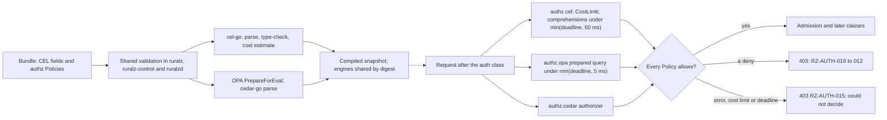

# ADR-0019: Expressions and authorization: CEL inline with a comprehension stop, OPA and Cedar engines, no Lua

## Context and problem statement

[ADR-0011](0011-expressions-and-authorization-engines.md) chose CEL for inline expressions, OPA and Cedar as pluggable authorization engines, and no Lua, bounding CEL by a static estimate, the runtime cost limit and the request deadline. Since `cel-go` cost tracking slows with the square of a comprehension's length (hypothesis), a comprehension over a capped input can stay under the cost limit yet run for seconds (hypothesis). The [Configuration model](../architecture/02-configuration-model.md#limits) therefore stops such evaluation at 50 ms (target), and OQ-configuration-model-21 asked whether to record that stop. An accepted ADR changes only through a superseding one, so this ADR restates ADR-0011's decision with the stop.

Which expression language and authorization engines run inside `CGO_ENABLED=0` binaries ([ADR-0001](0001-implementation-language-go.md)) with bounded cost and time, compiled once per Revision and validated identically everywhere? `authz.cel` is Planned (M1); `authz.opa` and `authz.cedar` are Planned (M2); all are Filter class `authz` and `failureMode: closed` only ([foundation pack section 10](../_meta/foundation-pack.md#10-policy-type-registry)).

## Decision drivers

- **Bounded, typed evaluation**: no loops, I/O or randomness on the request path; static, runtime and wall-clock bounds (S4 in [Selection criteria](../engineering/01-tech-stack-and-libraries.md#selection-criteria)).
- **Gates G1 to G3**: pure Go, Apache-2.0-compatible license, Go Cryptographic Module only.
- **Compile once, read lock-free**: programs compile with the Revision and evaluate without read locks ([System overview](../architecture/01-system-overview.md#design-principles)).
- **Validate everywhere**: inline policies fail in `ruralz bundle validate`; with OCI delivery (OQ-security-and-identity-13) at Ruralz Control ingest or as a Node NACK.
- **No extra request-path hop**: P3 allows only declared, timed remote calls ([pack section 8.7](../_meta/foundation-pack.md#87-state-store-round-trips)), and authorization fails closed (P9) ([Vision](../vision/01-vision-and-positioning.md#principles)).
- **One custom-code path**: arbitrary logic is a sandboxed Plugin (P6) ([product non-goal 3](../vision/01-vision-and-positioning.md#product-non-goals)).
- **Free**: every expression and policy engine ships in every public build, FIPS included (P1).

## Considered options

1. **CEL inline with a comprehension stop, OPA and Cedar engines, no Lua**: ADR-0011's chosen option plus a 50 ms (target) stop through `ContextEval` interrupt checks ([source](https://github.com/cel-expr/cel-go/blob/master/cel/program.go)).
2. **CEL inline with the request deadline alone**: ADR-0011 unchanged (OQ-configuration-model-21 (b)).
3. **CEL only**: richer rules become `authz`-class `plugin` Policies ([source](https://github.com/google/cel-go/blob/main/policy/README.md)).
4. **CEL plus embedded Lua**: a Lua interpreter linked into `ruralzd` for scripted logic.
5. **OPA as an external decision service**, such as a sidecar.

## Decision outcome

Chosen option: "CEL via cel-go, import path `cel.dev/cel-go`, inline, with a 50 ms (target) stop for comprehensions that can reach the runtime cost limit; OPA (`opa/v1/rego`) and Cedar (`cedar-go`) as pluggable authz engines; no Lua", because CEL is typed, non-Turing-complete and offers `CostLimit` and `ContextEval` ([source](https://github.com/cel-expr/cel-go/blob/master/cel/options.go)); the stop bounds time where cost tracking falls short; OPA's `PrepareForEval` yields a reusable in-process query ([source](https://github.com/open-policy-agent/opa/blob/main/v1/rego/rego.go)); and cedar-go ships the core Cedar authorizer ([source](https://github.com/cedar-policy/cedar-go/blob/main/README.md)). All three are Apache-2.0 ([Library catalog](../engineering/01-tech-stack-and-libraries.md#library-catalog)). CEL SHOULD come first, with OPA the fallback for Cedar ([Authorization](../architecture/08-security-and-identity.md#authorization)).

| Surface | Rule | Planned |
|---|---|---|
| CEL module | `cel.dev/cel-go` v0.32.x; the alias `github.com/google/cel-go` "will eventually be removed" ([source](https://github.com/google/cel-go/blob/main/README.md)), so it is banned | Planned (M1) |
| CEL places | The fields, variables and runtime-error rules of [Allowed places](../architecture/02-configuration-model.md#allowed-places); standard library plus strings and encoders extensions only | Planned (M1) |
| CEL cost | An estimate above 10,000 units at nominal sizes is RZ-CFG-015 (target); `CostLimit` stops evaluation at 1,000,000 units (target). An expression that can reach that limit and holds a comprehension evaluates through `ContextEval` under min(request deadline, 50 ms) (target); the 50 ms stop is temporary and ends once `cel-go` tracks comprehension cost linearly. Either stop is a runtime error ([Limits](../architecture/02-configuration-model.md#limits)) | Planned (M1) |
| `authz.cel` | `config.rule` is a bool over the base variables; false denies with 403 RZ-AUTH-010 | Planned (M1) |
| `authz.opa` | `opa/v1/rego`, prepared per Policy and Revision; allowlisted pure built-ins only, so no `http.send`; data is an immutable per-Revision document behind a lock-free Ruralz `storage.Store`, never `storage/inmem`; `Eval` runs on the request goroutine under the smaller of the time left in the request and 5 ms (target), and a Planned (M2) spike confirms topdown stops at the deadline; 16 MiB of data per Policy (target); under 100 µs at p99 (hypothesis); a deny is 403 RZ-AUTH-011 | Planned (M2) |
| `authz.cedar` | cedar-go v1.8.x core authorizer, synchronous and never abandoned; it takes no context, so 1,000 policies and 10,000 entities per Policy (target) bound it; validation stops at parsing; under 100 µs at p99 (hypothesis); a deny is 403 RZ-AUTH-012 | Planned (M2) |
| Engine memory | Identical engines compile once, by digest; per Revision at most 64 MiB of compiled engine memory and 50,000 entities (target), a deterministic estimate of canonical bytes times 4 (hypothesis), counted toward snapshot size; `ruralz bundle validate` rejects a violation (code: OQ-security-and-identity-30) | Planned (M2) |
| Engine configuration | Engine `config` schemas are unregistered; policy delivery is OQ-security-and-identity-13 | Planned (M2) |
| Failure | Every `authz.*` type is `failureMode: closed` only (`open` is RZ-CFG-029); a runtime error or deadline is 403 RZ-AUTH-015 | Planned (M1) |
| Binaries | cel-go links into `ruralzd`, `ruralz-control` and `ruralz`; OPA and cedar-go join all three with their types (size: OQ-tech-stack-and-libraries-22) | Planned (M1); Planned (M2) |
| Lua | No Lua runtime; scripted logic is CEL or a WASM Plugin | Planned (M2) |

*Figure 1: CEL and the engines compile with the Revision; a tracked comprehension also stops at 50 ms (target).*

### Consequences

- Good, because every inline field uses one bounded, typed language that cannot loop or call out, now bounded in time and cost.
- Good, because CEL, inline Rego and Cedar errors appear in `ruralz bundle validate`, since all three binaries link the same libraries ([Dependency graph](../engineering/01-tech-stack-and-libraries.md#dependency-graph)).
- Good, because teams reuse Rego or Cedar policies without a sidecar, free in every build (P1).
- Bad, because a long comprehension that would finish under the cost limit now fails at 50 ms (target), and an `authz.cel` Policy then denies with RZ-AUTH-015.
- Bad, because only CEL fully meets S4: OPA has a deadline but no cost or allocation limit, and cedar-go has neither.
- Bad, because three evaluators must be secured and upgraded, and OPA counts against the `ruralzd` 160 MiB stripped binary budget (target).
- Bad, because cedar-go is idle since 2026-06-01 and lacks the schema validator ([source](https://github.com/cedar-policy/cedar-go/blob/main/README.md)); its [Watch list](../engineering/01-tech-stack-and-libraries.md#watch-list) fallback is "OPA only; fork".
- Bad, because OPA v1 lacks G3 evidence (OQ-tech-stack-and-libraries-9), so the FIPS build, Planned (M5), may need a named exception.

### Confirmation

- **Banned imports**, Planned (M0): depguard rejects `github.com/google/cel-go` and any Lua runtime ([Banned imports](../engineering/02-repository-layout-and-conventions.md#banned-imports)).
- **Dependency admission**, Planned (M0): the G1 cross-build, license gate and `go list -deps` G3 check cover all three libraries.
- **Runtime limit tests**, Planned (M1): a tracked program over a capped list fails at 1,000,000 units, and a long comprehension fails with a deadline error within the deadline plus 10 ms (target).
- **Benchmarks**, Planned (M1) for CEL, Planned (M2) for the engines: microbenchmarks, with worst-case fixtures at the caps, report against the per-call budgets in [Performance budgets and benchmarking](../architecture/12-performance-budgets-and-benchmarking.md); `authz.opa` throughput scales linearly from 1 to 32 GOMAXPROCS (target); a miss reopens this ADR. `split(",")` of a 64 KiB header with `exists` and `map`, and a 32 × 32 nested comprehension, end within 50 ms (target), finished or stopped; once they finish well under 50 ms without the stop, a superseding ADR removes it.
- **Fuzzing**, Planned (M1): the "CEL compile and cost estimator" target checks that actual cost stays within the static estimate ([Fuzzing](../engineering/03-testing-and-quality-strategy.md#fuzzing)).
- **Configuration conformance suite**, Planned (M1): negative fixtures cover RZ-CFG-014, RZ-CFG-015 and RZ-CFG-029. Planned (M2) fixtures in all three binaries: Rego calling `http.send`, `net.lookup_ip_addr`, `time.now_ns`, `rand.intn` or `uuid.rfc4122` fails compilation, and a Bundle at the engine ceiling gets one verdict.
- **Review checklist item**: a pull request that adds an expression language, policy engine, CEL extension or allowlisted OPA built-in, or changes the 50 ms (target) stop, MUST supersede this ADR.

## Pros and cons of the options

### CEL inline with a comprehension stop, OPA and Cedar engines, no Lua

- Good, because wall-clock time stays bounded whatever cost tracking does, and the engines add data-driven and entity-based models in process.
- Bad, because the stop is a temporary workaround, and three evaluators and an idle cedar-go ([source](https://github.com/cedar-policy/cedar-go)) stay linked.

### CEL inline with the request deadline alone

- Good, because one deadline governs every evaluation, with no workaround.
- Bad, because a long request deadline lets one tracked comprehension consume seconds of CPU (hypothesis).

### CEL only

- Good, because it links one evaluator, and cel-go's policy package offers a YAML rule format ([source](https://github.com/google/cel-go/blob/main/policy/README.md)).
- Bad, because shared rule sets would move into Plugins, which wazero cannot meter by instruction ([source](https://github.com/wazero/wazero/issues/422)).

### CEL plus embedded Lua

- Good, because Lua is familiar for small request and response transformations.
- Bad, because Lua is Turing-complete with no static cost bound, duplicates the Plugin path, and no Go Lua runtime has been researched.

### OPA as an external decision service

- Good, because OPA and its data would live outside `ruralzd`.
- Bad, because each decision adds a declared, timed remote call before commit that fails closed ([pack section 8.7](../_meta/foundation-pack.md#87-state-store-round-trips)).

## More information

- Supersedes [ADR-0011](0011-expressions-and-authorization-engines.md); its rejection of the root `opa/rego` package, deprecated and kept "for the lifetime of OPA v1.x" ([source](https://github.com/open-policy-agent/opa/blob/main/rego/rego.go)), stands.
- Owners: [Security and identity](../architecture/08-security-and-identity.md#authorization) (engines, limits, `RZ-AUTH` codes) and [CEL expressions and allowed places](../architecture/02-configuration-model.md#cel-expressions-and-allowed-places) (CEL fields, variables, limits), which closes OQ-configuration-model-21 with (a).
- Related: [ADR-0003](0003-configuration-format.md), [ADR-0004](0004-wasm-runtime-wazero.md), [ADR-0005](0005-plugin-abi-v1.md) and [ADR-0014](0014-ai-api-surface.md).
- Revisit when `cel-go` tracks comprehension cost linearly, cedar-go hits its watch-list trigger, OPA fails the G3 check, or a per-call budget misses.
