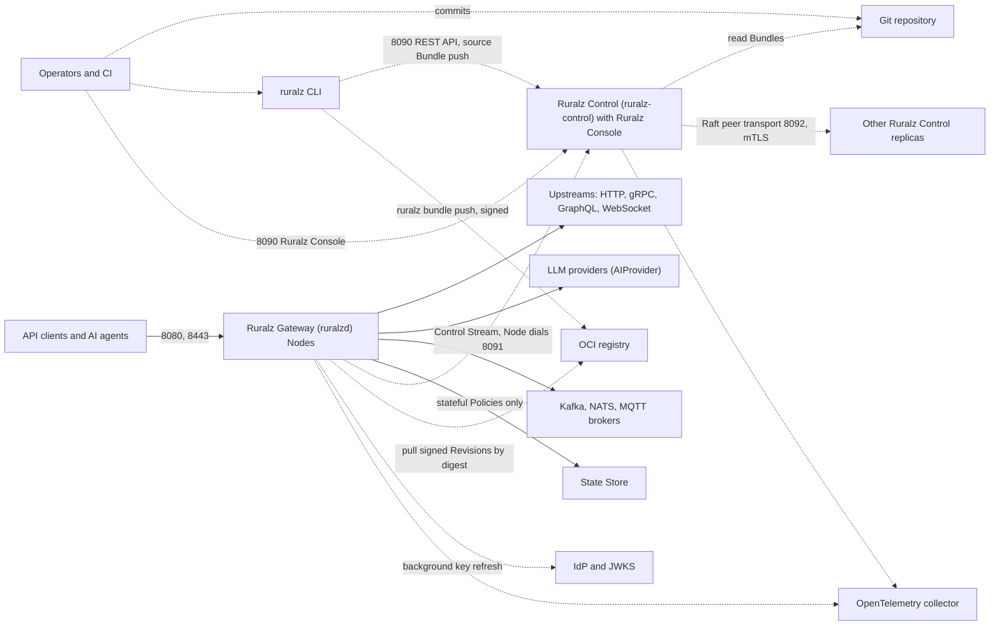
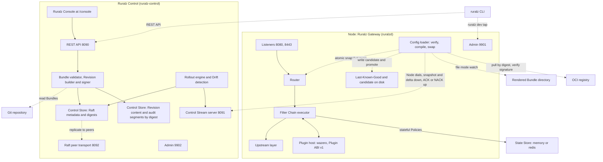
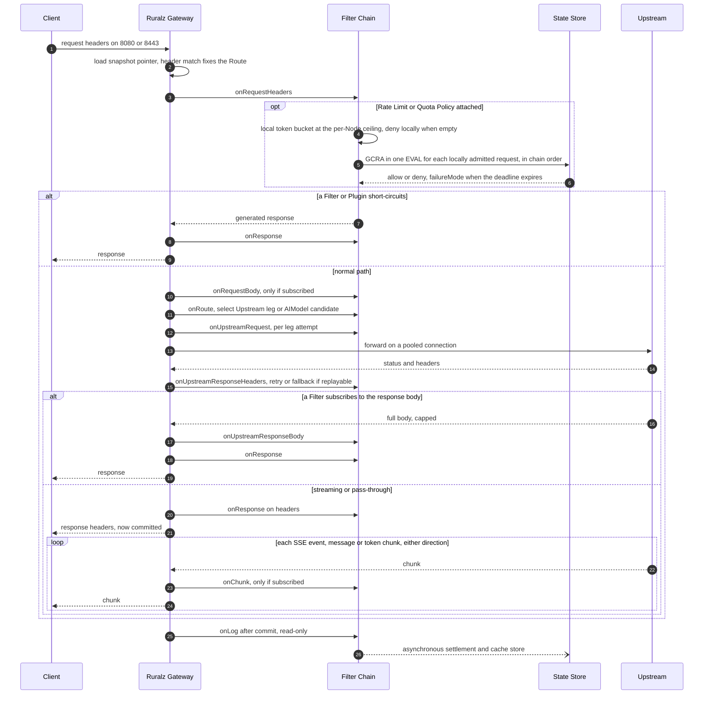
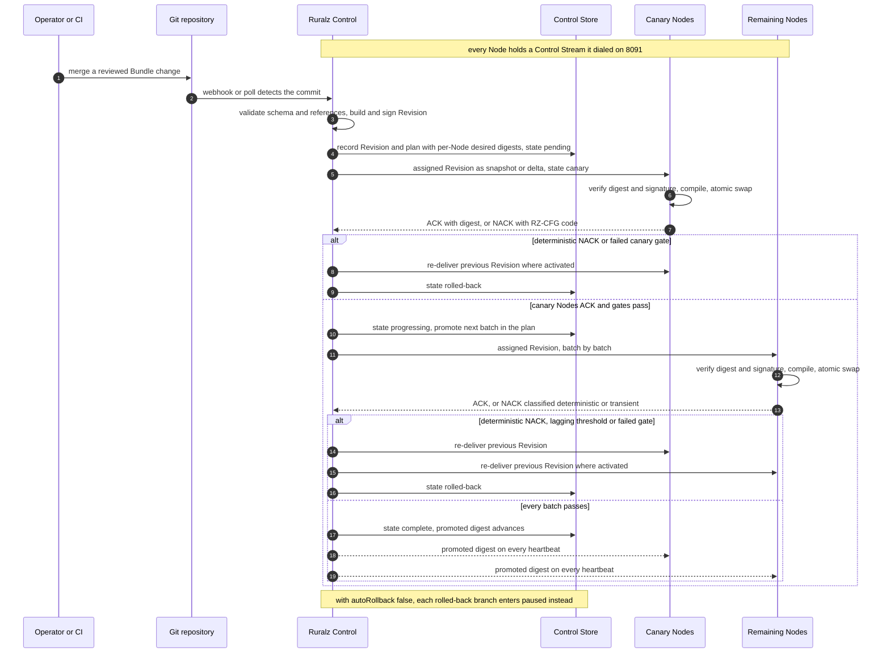
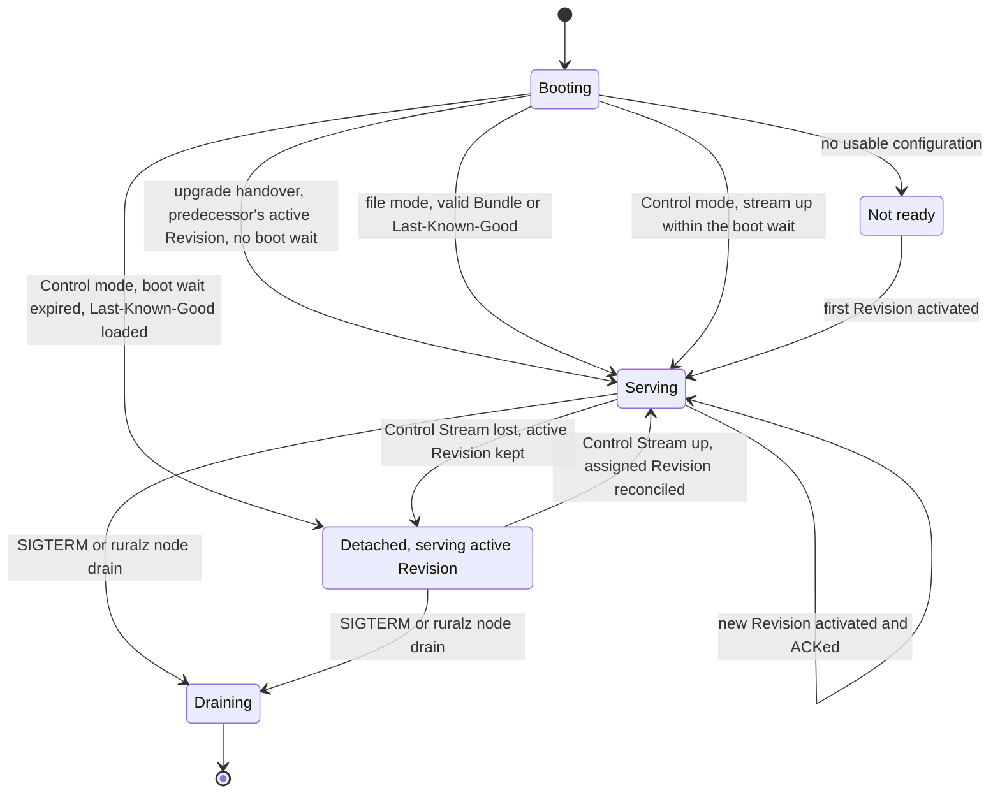
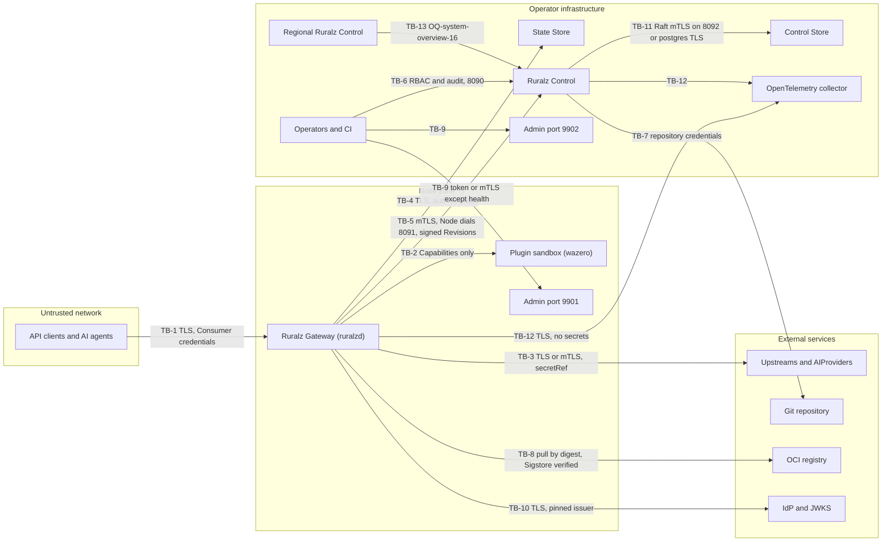

# System Overview

## Summary

This document fixes the top-level shape of Ruralz: two runtime components, Ruralz Gateway (`ruralzd`) and Ruralz Control (`ruralz-control`), one CLI (`ruralz`), the State Store and the Control Store. It decides what runs on the request path, how a Bundle becomes a Revision and reaches Nodes as a Rollout, when a Revision becomes Last-Known-Good, and how components degrade when a neighbor fails. Ruralz Gateway runs without Ruralz Control by watching a Bundle directory or pulling a Revision from an OCI registry. While Ruralz Control is unavailable, Nodes keep serving their active Revision and boot Last-Known-Good configuration after a restart. Architects, evaluators and contributors start here.

## Scope and non-goals

In scope: component boundaries and ports, the request and configuration lifecycles, deployment modes, failure behavior, trust boundaries, and a map to owning documents. References such as "pack 8.3" name a section of the [foundation pack](../_meta/foundation-pack.md) v1, which is binding.

Non-goals: kinds and fields ([Configuration model](02-configuration-model.md) wins on conflict), component internals (see the [Document map](#document-map)), authoritative numbers ([Performance budgets and benchmarking](12-performance-budgets-and-benchmarking.md) wins on conflict), and positioning. Nothing here is implemented yet; every capability carries a Planned tag.

## Design principles

Product principles `P1` to `P10` are defined in [Vision and positioning](../vision/01-vision-and-positioning.md). These rules are their architectural consequences; component documents MUST NOT break one without an ADR.

| Rule | Statement | Consequence |
|---|---|---|
| No coordination on the request path | No request waits on Ruralz Control, the Control Store or another Node. | Control-plane outages cause no request errors. |
| Compile once, read lock-free | Each Revision compiles into an immutable snapshot; Node-local mutable state is sharded or per-P. | A request loads one atomic pointer; no read locks. |
| Pay only for what is attached | A Route's chain holds only the Filters and Plugins its Policies attach. | An unused Phase costs a nil check. |
| Stream by default | Bodies stream unless a body Phase is subscribed; AI Routes always buffer the request body. | Pass-through memory is independent of payload size. |
| External state, bounded round trips | Shared state lives only in the State Store, with at most one blocking round trip per Policy before commit. | Nodes are disposable. |
| Fail static, degrade by declaration | Nodes keep their active Revision when Ruralz Control is lost; every Policy with a remote dependency declares `failureMode`. | A lost dependency costs at most one deadline per request. |
| Verify and validate twice, activate atomically | Ruralz Control validates and signs each Revision; each Node verifies it, validates again and NACKs before any swap. | With `strategy: canary`, a bad Revision that compiles still stops at canary. |
| Bounded everything | Every queue, buffer, pool, retry, fan-out, retired snapshot and per-key bucket table (LRU) has a ceiling. | Overload yields fast `RZ-RT-<NNN>` or `RZ-RL-<NNN>` rejections. |
| Degraded states are observable | Detachment, Last-Known-Good boots, fail-open decisions, dropped writes and disabled signature checks are metrics. | Stale or unverified configuration is visible. |

Accepted costs: `net/http` and `quic-go` allocate more than fasthttp (hypothesis) ([ADR-0009](../adr/0009-http-stack-net-http-quic-go.md)); wazero adds a host-to-guest call per Phase ([ADR-0004](../adr/0004-wasm-runtime-wazero.md), [ADR-0005](../adr/0005-plugin-abi-v1.md), [ADR-0001](../adr/0001-implementation-language-go.md)); the State Store adds a round trip ([ADR-0008](../adr/0008-rate-limiting-local-bucket-and-gcra.md)).

## Component map

| Component | Role | Binary and image | Default ports | On request path? | Milestone |
|---|---|---|---|---|---|
| Ruralz Gateway | Stateless data plane; each process is a Node (`node.id`, a ULID) | `ruralzd`, `ghcr.io/ravindu-rev/ruralzd` | 8080 HTTP, 8443 TLS (plus UDP 8443 for HTTP/3, Planned (M3)), 9901 admin | Yes | Planned (M1); HTTP/3 Planned (M3) |
| Ruralz Control | Optional control plane: Revisions, Rollouts, RBAC, audit log, Drift detection | `ruralz-control`, `ghcr.io/ravindu-rev/ruralz-control` | 8090 REST API and Ruralz Console, 8091 Control Stream (mTLS, Nodes dial), 8092 Raft peer transport (mTLS), 9902 admin | No | Planned (M2) |
| Ruralz Console | React and TypeScript SPA in `ruralz-control` | Served at `/console` | 8090 | No | Planned (M2) |
| `ruralz` CLI | `bundle`, `rollout`, `plugin`, `ai`, `dev`, `node`, `control` and `test` commands | `ruralz` | None | No | Planned (M1) to Planned (M3), per command in pack 9 |
| State Store | Rate Limits, Quotas, Response Cache Planned (M1); Token Budgets, Semantic Cache Planned (M3) | `memory` (single Node) or `redis` (Redis, Valkey, Dragonfly over RESP3) | Operator-defined | Stateful Policies only | Planned (M1) |
| Control Store | Raft metadata (Rollout plans, Environments, Clusters, Enrollment, RBAC) plus digest-addressed Revision content and audit segments | Embedded `hashicorp/raft` with `raft-boltdb/v2` on bbolt; `postgres` optional, Planned (M4) ([ADR-0006](../adr/0006-control-store-raft-boltdb.md), proposed) | 8092 between replicas | No | Planned (M2) |

Revision content and hash-chained audit segments reach a replica quorum before the Raft entry referencing their digest; Raft entries stay under 1 MiB (target), and `ruralz control backup` covers all of it. The dedicated peer port 8092 keeps Nodes off peer traffic (pack 8.4). [Control plane and GitOps](04-control-plane-and-gitops.md) owns the mechanism.

*Figure 1: system context; arrows start at the connecting side, and only solid arrows are on the request path.*

Nodes always dial Ruralz Control on 8091 (gRPC `ruralz.control.v1.ControlStream`), never the reverse, so they work behind NAT and egress-only firewalls. `ruralz bundle push` sends a source Bundle and its expected digest to Ruralz Control, which re-renders it and rejects a mismatch (`RZ-CFG-027`), or publishes and signs a rendered Revision in an OCI registry for file-mode Nodes. Nodes check the full digest and signature before activation ([ADR-0017](../adr/0017-artifact-signing.md), pack 8.14).

*Figure 2: container view of the components; dashed edges are configuration or tooling.*

### Inside a Node

[Data plane](03-data-plane.md) owns these parts.

| Part | Responsibility | Hot-path rule |
|---|---|---|
| Listeners | HTTP/1.1, HTTP/2 Planned (M1); HTTP/3 (`quic-go`, off in FIPS builds) Planned (M3); gRPC via `connectrpc.com/connect`, WebSocket, SSE Planned (M3) | Reads only the snapshot pointer |
| Router | Matches a request to a Route | Prebuilt per Revision; span `ruralz.route.match` |
| Filter Chain executor | Runs the Route's pre-resolved Filters and Plugins | Built at compile time; span `ruralz.filter.<name>` |
| Plugin host | wazero, `ruralz.plugin.v1`, Capabilities, instance pools | Never compiles or instantiates; an exhausted pool rejects with `RZ-PLG-<NNN>` after a brief wait |
| Upstream layer | Load balancing, health checks, retries, breakers, pools | Passive outlier detection by default; span `ruralz.upstream.<name>` |
| State client | `rueidis` to `redis`, or in-process `memory` | Chain-ordered calls, per-request deadline, breaker |
| Config loader | Directory watch, OCI pull or Control Stream; verifies digest and signature; compiles snapshots; Last-Known-Good | Own goroutines; one atomic publish |

### Where the four differentiators live

| Differentiator | Owning architecture document | Milestone |
|---|---|---|
| (1) WASM plugin system | [WASM plugin system](05-wasm-plugin-system.md) | Planned (M2); proxy-wasm adapter Planned (M4) |
| (2) AI/LLM gateway | [AI/LLM gateway](06-ai-llm-gateway.md) | Planned (M3) |
| (3) built-in control plane + GitOps | [Control plane and GitOps](04-control-plane-and-gitops.md) | Planned (M2) |
| (4) multi-protocol native | [Multi-protocol](07-multi-protocol.md) | gRPC, GraphQL, WebSocket, SSE, HTTP/3 Planned (M3); Kafka, NATS, MQTT Planned (M4) |

## Request lifecycle

Every request traverses the fixed Filter Chain phases:

`onRequestHeaders → onRequestBody → onRoute → onUpstreamRequest → onUpstreamResponseHeaders → onUpstreamResponseBody → onResponse → onLog`

plus the streaming hook `onChunk`, invoked per SSE event, WebSocket message, or LLM token chunk in either direction. Work follows the Policy type registry (pack 10; [Configuration model](02-configuration-model.md#policy)).

| Phase | Runs | Typical work | Contract |
|---|---|---|---|
| `onRequestHeaders` | Once, after the header match | Authentication, CORS, `authz.ip` and `authz.geoip`, Rate Limit and Quota admission, Response Cache lookup | Most short-circuits |
| `onRequestBody` | If subscribed | Body-dependent authorization, validation, transforms, Token Budget reservation | Capped buffering |
| `onRoute` | Once | Upstream leg or `AIModel` candidate selection | Never changes the Route |
| `onUpstreamRequest` | Per leg attempt | Upstream-scoped rewrites, credential injection | Replay rule |
| `onUpstreamResponseHeaders` | Per leg attempt | Breaker accounting, Provider Fallback decision | Fallback before commit |
| `onUpstreamResponseBody` | Per leg, if subscribed | Transforms, aggregation merge, usage extraction | Capped buffering |
| `onResponse` | Before headers reach the client | Response headers, Response Cache store for buffered responses | Last status change |
| `onLog` | Always | Access log, metrics, Quota and Token Budget settlement | Read-only; failures reach telemetry only |
| `onChunk` | Per chunk, if subscribed | Local output-token guard, guardrails | No State Store calls; may end the stream |

Filters and Plugins MAY short-circuit in any request Phase (`onRequestHeaders` through `onUpstreamRequest`), skipping to `onResponse` and `onLog`. After commit, an `onChunk` failure ends the stream (`closed`) or passes the chunk (`open`). Precedence is per slot ([Attachment and precedence](02-configuration-model.md#attachment-and-precedence), pack 8.12): a Route Policy replaces a same-slot Gateway Policy unless that one sets `overridable: false`, other slots stack, and Upstream-scoped Policies run only in their upstream leg.

*Figure 3: a request through the Filter Chain phases.*

Three invariants:

- **Fixed Route.** The header match fixes the Route; body-dependent criteria choose only among its Upstream legs or `AIModel` candidates. `match.graphql` (Planned (M3)) may need a bounded pre-match body read (OQ-system-overview-5).
- **Replay rule.** A leg MAY be retried or fall back only if its request body is empty or buffered within the `onRequestBody` cap, and only before the first response byte is committed. A mid-stream Upstream failure ends the stream with an `RZ-UP-<NNN>` or `RZ-AI-<NNN>` error event that `onLog` records.
- **Pinned snapshot.** Each request stays on its starting snapshot through any Hot Reload.

### State Store access

Before commit, each Policy makes at most one blocking round trip (pack 8.7), timed out at the smaller of its `stateStoreTimeout` and the time left in the per-request deadline; after that, remaining Policies apply `failureMode` without waiting. Consumptive calls (GCRA, Quota, Token Budget reservation) run in chain order and stop at the first deny. Post-commit writes (cache stores, settlement) use a bounded per-Node queue that drops with a counter and never delays a response; `onChunk` never calls the State Store. [Scalability and distributed state](11-scalability-and-distributed-state.md) owns accuracy bounds for dropped writes.

### Worked example: a rate-limited Route in a brownout

A Route carries a global Rate Limit (pack 8.8): a local token bucket at a per-Node ceiling, declared on the Policy or derived from the Node count Ruralz Control publishes (never learned from peers), then GCRA in one Lua `EVAL` per locally admitted request (leases: OQ-system-overview-15). When the State Store slows down:

1. GCRA calls hit the deadline and the Rate Limit fails open; admission per key is at most N serving Nodes times the per-Node ceiling per window (target), a bound [Scalability and distributed state](11-scalability-and-distributed-state.md) owns.
2. The State client's breaker opens, so later requests pay no timeout.
3. A `failureMode: closed` Policy, such as the `ai.token-budget` default, rejects with `RZ-STS-<NNN>` (defaults: OQ-configuration-model-8).

Seed budgets exclude Upstream and State Store time; [Performance budgets and benchmarking](12-performance-budgets-and-benchmarking.md) owns the workload and values.

| Seed budget item | Value |
|---|---|
| Gateway-added latency p50 | 150 µs or less (target) |
| Gateway-added latency p99 | 1 ms or less (target) |
| Same-zone State Store GCRA round trip p99 | 1 ms or less (hypothesis) |
| Ruralz-owned allocations per pass-through HTTP/1.1 request, excluding `net/http` internals | 30 or fewer (hypothesis) |
| WASM Plugin Phase call, pooled instance, p99 | 50 µs or less (target) |

### Streaming and AI traffic

An AI Route resolves a virtual `AIModel` to `AIProvider` candidates in `onRoute`. A Token Budget (pack 8.9, [ADR-0014](../adr/0014-ai-api-surface.md)) writes the output cap C (client `max_tokens`, else `limits.maxOutputTokens`) into the upstream request and, in `onRequestBody`, atomically reserves estimated input plus C only if the remaining budget covers it. In `onChunk` it counts output tokens locally and ends the stream beyond C; local counts are never billed. `onLog` settles asynchronously from provider-reported usage, or charges the whole reservation when usage is missing. AI traffic is Planned (M3).

## Configuration lifecycle

A Bundle is validated against a published JSON Schema ([ADR-0003](../adr/0003-configuration-format.md)) and built, by Ruralz Control from Git or by `ruralz bundle build`, into a Revision: the SHA-256 digest of the Bundle rendered for one Environment in `ruralz.canonical.v1` form, defaults materialized ([Configuration model](02-configuration-model.md#canonical-form-and-revision), pack 8.1). Output shows `rev-<12 hex>`; every verification uses the full `sha256:<64 hex>`, and a mismatch is `RZ-CFG-027`. Equal digests mean equal effective behavior; only `secretRef` values and `RURALZ_*` process settings differ between Nodes. Ruralz Control signs each Revision it records (ADR-0017).

A Rollout, which exists only in Control mode, delivers one Revision to one Cluster. Promotion moves a source commit, not a digest: `Environment.spec.promotion.from` lets a commit roll out only after its Revision for the source Environment reached `complete`. Branch mapping is OQ-system-overview-11.

*Figure 4: a configuration Rollout from Git through Ruralz Control to Nodes (`strategy: canary`, `autoRollback: true`).*

| State | Meaning | Next |
|---|---|---|
| `pending` | Recorded with its persisted per-Node plan; queued | `canary` or `progressing` |
| `canary` | `strategy: canary` only: `canary.percent` of Nodes run the Revision for `canary.bake` while gates evaluate (signals: OQ-system-overview-9) | `progressing`, `paused`, `rolled-back` |
| `progressing` | Delivering batch by batch; follows `pending` directly under `all-at-once` | `complete`, `paused`, `rolled-back` |
| `paused` | Delivery stopped, Nodes stay on their current Revisions; entered by `ruralz rollout pause` or, with `autoRollback: false`, by a failure | `ruralz rollout resume`; `ruralz rollout rollback` |
| `complete` | Every non-quarantined Node ACKed; the promoted digest advances | Terminal |
| `rolled-back` | The previous Revision was re-delivered where activated, after a failure with `autoRollback: true` or `ruralz rollout rollback` | Terminal |
| `failed` | Only the revert itself could not finish; pages | Terminal |

In these Rollout states (pack 8.3), a failure is a deterministic NACK (an `RZ-CFG-<NNN>` error that reproduces from the Revision), a failed gate or the lagging threshold. A transient NACK is retried with backoff, then the Node is quarantined as lagging; the threshold is more than max(1, 5% of the batch) lagging (target). The Cluster's `spec.rollout` selects the path ([Configuration model](02-configuration-model.md#cluster)); batch sizing and gate values belong to [Control plane and GitOps](04-control-plane-and-gitops.md). A reconnecting Node gets the Revision its persisted plan assigns, so reconnect storms cannot bypass the canary, and a new leader resumes from the plan.

### Compile before swap

The config loader, off the request path:

1. Verifies content against the full Revision digest and its signature (pack 8.14).
2. Builds router structures and Filter Chains; compiles CEL and Plugins ahead of time, reusing artifacts by digest.
3. Carries over unchanged connection and Plugin instance pools, warming only new ones, with bounded warm-up.
4. Publishes the snapshot with one atomic pointer store (Hot Reload); this Revision becomes the active Revision.
5. ACKs over the Control Stream ([ADR-0007](../adr/0007-control-stream-protocol.md)); an ACK means active, not durable.
6. Writes the Revision and its canonical source under `${RURALZ_DATA_DIR}/lkg/` as a candidate.
7. Retires the old snapshot.

A failure before step 4 NACKs with `RZ-CFG-<NNN>` and leaves the running snapshot untouched. At most K = 2 retired snapshots are kept (target); activation never waits, so at the limit streams pinned to the oldest get an immediate graceful close (WebSocket 1001, HTTP/2 GOAWAY, or an SSE end with a retry hint).

Building router structures and chains for 10,000 Routes takes 2 s or less on one core (target), excluding cold Plugin compilation. Peak configuration memory is (K + 2) times snapshot size (hypothesis); [Data plane](03-data-plane.md) owns the numbers.

### Last-Known-Good

The active Revision is what a Node serves now; a detached Node keeps it and stays ready. Last-Known-Good is the persisted Revision under `${RURALZ_DATA_DIR}/lkg/` that a Node boots when it cannot obtain configuration, never holding resolved secrets (pack 8.2). File mode promotes the candidate on activation. Control mode promotes level-triggered: every snapshot, delta and heartbeat carries the Cluster's promoted digest (its last `complete` Rollout), and a Node promotes whenever its active digest equals it, including after a late reconnect, Enrollment or scale-out. A Revision that failed its canary never becomes Last-Known-Good; Drift detection flags laggards.

Figure 5 shows the boot order; the Control-mode boot wait is up to 5 s (target).

*Figure 5: Node configuration states; losing the Control Stream never makes a Node unready.*

`/readyz` on 9901 returns 200 only with an active validated Revision, resolved `secretRef` values, bound listeners and no drain (pack 8.5). Losing the Control Stream never fails readiness, for any duration, since that would pull every Node during a control-plane incident (staleness limit: OQ-system-overview-13). A Control-mode Node without Last-Known-Good stays not ready until it enrolls and receives its first Revision (OCI seeding: OQ-system-overview-12).

### Reconnect behavior

After a leader failover or partition, Nodes reconnect with exponential backoff and full jitter, presenting their active digest; Ruralz Control answers with nothing, a delta or a full snapshot, and MAY shed reconnects (pack 8.4).

## Deployment modes

Ruralz Gateway runs without Ruralz Control, by watching a Bundle directory or pulling from an OCI registry. A Node runs in exactly one configuration mode, chosen at boot, and never merges sources.

| Aspect | File mode | Control mode | Multi-cluster mode |
|---|---|---|---|
| Source | Bundle directory at `RURALZ_CONFIG`, or a Revision pulled from OCI | Ruralz Control over the Control Stream on 8091 | One Ruralz Control serving Clusters grouped into Environments |
| Components | `ruralzd`, optional State Store | Nodes, `ruralz-control` replicas, Control Store, State Store | Plus a State Store per Cell, optional regional Ruralz Control (Planned (M4)) |
| Change delivery | CI replaces the directory or publishes a digest; not a Rollout | Rollout with per-Node ACK/NACK | Rollouts per Cluster, source commits promoted across Environments |
| Failure domain | Every Node reading that source; no canary unless CI runs one | One Cluster; stopped at canary when strategy is canary | One Cell |
| Milestone | Planned (M1) watch; Planned (M2) OCI pull | Planned (M2) | Planned (M2); multi-region with Cells Planned (M4) |

Choose Control mode when several teams change configuration, auditors need attribution, or bad changes must stop at a canary; in file mode a valid yet wrong change reaches every Node at once.

### File mode lifecycle

For OCI pull, CI runs `ruralz bundle validate`, `ruralz bundle build --env <env>` and `ruralz bundle push`, which signs with Sigstore. The Node polls a repository reference (OQ-system-overview-19), pulls by digest and verifies the signature (`enforce` by default; `off` is a degraded state) before swapping. A watched directory is unsigned, so the filesystem is the trust root; it SHOULD hold `ruralz bundle render --env <env>` output, since file-mode `ruralzd` applies no overlay. The watcher acts only on atomic replacement or after a settle debounce.

### Cells and Regions

A Cell is one Cluster plus the State Store it uses, in one Region (pack 8.13); a State Store outage degrades only its Cell. No request crosses a Region to reach a State Store; each Region resolves its own `stateStore.url` through `secretRef`, so Regions share one Revision. A regional Ruralz Control serves one Region's Clusters, Planned (M4), off the request path; its storage role is OQ-system-overview-16, and Raft voters SHOULD stay in one Region. The `memory` driver multiplies every limit by the Node count (pack 8.8).

The Helm chart and CRDs are Planned (M2) ([ADR-0016](../adr/0016-kubernetes-helm-and-crds.md), proposed): CRDs use `ruralz.io/v1alpha1`, translated to the Bundle `ruralz/v1alpha1` by changing only the group, and only Ruralz Control watches them (OQ-system-overview-8). [Deployment topologies](../operations/01-deployment-topologies.md) owns layouts.

## Cross-cutting concerns

### Failure semantics at component boundaries

| Failure | Blast radius | Node behavior | Owner |
|---|---|---|---|
| Ruralz Control unreachable or Raft quorum lost | Management: Rollouts, Ruralz Console, Drift, Enrollment | Keeps active Revision and stays ready; jittered reconnect | [High availability and disaster recovery](../operations/04-high-availability-and-disaster-recovery.md) |
| Node restart during that outage | One Node | Boots Last-Known-Good after the boot wait; without it, not ready | [Data plane](03-data-plane.md) |
| Revision fails digest or signature check | One Node | Rejected before any swap (NACK in Control mode); active Revision kept | [Security and identity](08-security-and-identity.md) |
| State Store slow or down | One Cell's global accuracy | At most one deadline per request, then `failureMode`; none once the breaker opens | [Scalability and distributed state](11-scalability-and-distributed-state.md) |
| Upstream failing | Its Routes | Outlier detection, budgeted retries, breaker | [Traffic management and resilience](09-traffic-management-and-resilience.md) |
| LLM provider throttling | One `AIModel` | Provider Fallback before commit | [AI/LLM gateway](06-ai-llm-gateway.md) |
| Plugin trap or Node-wide Plugin memory cap | That Plugin's Routes | Call aborted or new instance refused (`RZ-PLG-<NNN>`) under the Policy's `failureMode`; the Node never crashes | [WASM plugin system](05-wasm-plugin-system.md) |

### System-wide rules

- Telemetry is OpenTelemetry-first with a `slog` bridge ([ADR-0010](../adr/0010-telemetry-opentelemetry-first.md)); metrics are named `ruralz_<component>_<name>_<unit>` ([Observability](10-observability.md)).
- Errors are `RZ-<AREA>-<NNN>`, with areas and the selection rule in pack 8.6; [Data plane](03-data-plane.md) owns the response format.
- Security types (`auth.*`, `authz.*`, auth or authz `plugin` Policies) are `failureMode: closed` only; `open` there is `RZ-CFG-029` (pack 8.10).

### Hot Reload, Rollout and Zero-Downtime Upgrade

A **Hot Reload** activates a Revision on one Node without a restart. A **Zero-Downtime Upgrade** replaces the `ruralzd` binary: the new process binds the same ports with `SO_REUSEPORT` and reports ready, then the old one Drains with HTTP/2 GOAWAY ([ADR-0015](../adr/0015-zero-downtime-upgrades-so-reuseport.md)). Both are Planned (M1); [Zero-downtime upgrades and hot reload](../operations/02-zero-downtime-upgrades-and-hot-reload.md) owns procedures. Handover rules:

1. Before closing a TCP listener, `SO_ATTACH_REUSEPORT_CBPF` (through `golang.org/x/sys/unix`) steers new connections to the new socket while the old accept queue empties (`net.ipv4.tcp_migrate_req` is an alternative).
2. In-flight QUIC connections on UDP 8443 are lost and reconnect (OQ-system-overview-18).
3. Only the process holding the file lock on `${RURALZ_DATA_DIR}` writes Last-Known-Good and holds the Control Stream for its `node.id`; the old process releases it at Drain start. A new process that finds a live holder boots the holder's active Revision from its verified candidate ([Compile before swap](#compile-before-swap) step 6) without a boot wait.
4. The new process reports readiness to the old one over a Unix socket under `${RURALZ_DATA_DIR}`; CBPF steers 9901 to whichever process keeps serving.

## Trust boundaries

[Security and identity](08-security-and-identity.md) owns the threat model. Component documents cite these IDs and MUST NOT add an unauthenticated crossing.

*Figure 6: trust zones and their crossings, labeled with boundary IDs.*

| ID | Boundary | Authentication and integrity | Failure posture |
|---|---|---|---|
| TB-1 | Client to Ruralz Gateway (8080, 8443) | TLS or QUIC; hashed API keys, JWT, OAuth or mTLS | Authentication fails closed |
| TB-2 | Filter Chain to Plugin | wazero isolation; declared Capabilities only | Trap fails the call, never the Node |
| TB-3 | Ruralz Gateway to Upstreams and AIProviders | TLS or mTLS; credentials via `secretRef` | Breakers, bounded retries, fallback |
| TB-4 | Ruralz Gateway to State Store | TLS and authentication; contents are never configuration | `failureMode` within the deadline |
| TB-5 | Node to Ruralz Control (8091) | mTLS with a per-Node enrollment certificate; Revisions signed by Ruralz Control, always verified against Enrollment trust anchors ([ADR-0017](../adr/0017-artifact-signing.md)) | NACK; keep active Revision |
| TB-6 | Operators to Ruralz Control (8090) | Sessions or tokens, RBAC, audit log; Ruralz Console SSO/SAML Planned (M5) | Deny by default |
| TB-7 | Ruralz Control to Git | Credentials from Ruralz Control's process configuration, never a Bundle | Invalid content never becomes a Revision |
| TB-8 | Node to OCI registry | Digest-only pulls; Sigstore signatures on Revisions and Plugins, verified offline before activation, `enforce` by default | Mismatch or bad signature rejected |
| TB-9 | Operators to admin ports 9901 and 9902 | Only `/healthz` and `/readyz` MAY be unauthenticated; the rest MUST require a token or mTLS (default bind: OQ-system-overview-6); `/tap` redacts credentials; `/config/dump` omits resolved secrets | Deny by default |
| TB-10 | Node to IdP and JWKS | TLS with server verification; pinned issuer | Cached keys until expiry, then fail closed |
| TB-11 | Ruralz Control to Control Store | mTLS between Raft replicas on 8092, Node certificates rejected; TLS for `postgres` | Quorum loss stops writes only |
| TB-12 | Nodes and Ruralz Control to OpenTelemetry collector | TLS; no secrets in telemetry | Drop on failure |
| TB-13 | Regional Ruralz Control to Ruralz Control | Mutual TLS; role: OQ-system-overview-16 | Region keeps serving |

## Document map

| Document | Owns |
|---|---|
| [System overview](01-system-overview.md) | Boundaries, lifecycles, trust boundaries |
| [Configuration model](02-configuration-model.md) | Kinds, fields, Bundle layout |
| [Data plane](03-data-plane.md) | Listeners, Router, Filter Chain, admin API |
| [Control plane and GitOps](04-control-plane-and-gitops.md) | Control Stream, Rollouts, Control Store |
| [WASM plugin system](05-wasm-plugin-system.md) | Plugin ABI v1, Capabilities |
| [AI/LLM gateway](06-ai-llm-gateway.md) | `AIProvider`, `AIModel`, Token Budgets |
| [Multi-protocol](07-multi-protocol.md) | gRPC, GraphQL, WebSocket, SSE, events |
| [Security and identity](08-security-and-identity.md) | Threat model, identity, secrets, signing |
| [Traffic management and resilience](09-traffic-management-and-resilience.md) | Load balancing, Rate Limits, Quotas |
| [Observability](10-observability.md) | Metrics, traces, logs |
| [Scalability and distributed state](11-scalability-and-distributed-state.md) | State Store bounds, Cells, Regions |
| [Performance budgets and benchmarking](12-performance-budgets-and-benchmarking.md) | Performance Budget, benchmarks |

## Open questions

| ID | Question | Options | Owner | Blocking? |
|---|---|---|---|---|
| OQ-system-overview-5 | How does `match.graphql` select a Route before `onRequestHeaders`? | Bounded pre-match body read; query string, header or persisted-query ID only; `onRoute` leg selector | multi-protocol | Yes, for Data plane and Multi-protocol |
| OQ-system-overview-6 | Port 9901 default bind and authentication? | Loopback plus token; all interfaces with token; mTLS | security-and-identity | Yes, for Security and identity |
| OQ-system-overview-8 | How do CRDs feed a Cluster, and may it also take Git changes (OQ-configuration-model-2)? | (a) One source per Cluster; (b) CRDs convert to a Bundle that Ruralz Control assembles; (c) CRDs win; (d) Git wins | deployment-topologies | Yes, for Kubernetes packaging |
| OQ-system-overview-9 | Where do Rollout gates read health signals? | Control Stream metrics; external store; both | control-plane-and-gitops | Yes, for Rollouts |
| OQ-system-overview-11 | Default branch-to-Environment mapping? | Trunk with overlays; branch per Environment | control-plane-and-gitops | No |
| OQ-system-overview-12 | Break-glass changes and new-Node seeding during a Ruralz Control outage? | None; admin override; seed from an OCI-published Revision | high-availability-and-disaster-recovery | No |
| OQ-system-overview-13 | Should `/readyz` fail after prolonged detachment? | Never (current); opt-in limit | high-availability-and-disaster-recovery | No |
| OQ-system-overview-15 | GCRA per admitted request or leased allowance? | Per request (current); bounded leases | scalability-and-distributed-state | Yes, for Scalability and distributed state |
| OQ-system-overview-16 | What is a regional Ruralz Control? | Own Control Store; Raft non-voter; read-only relay | control-plane-and-gitops | Yes, for multi-region |
| OQ-system-overview-18 | Can upgrades keep in-flight QUIC connections? | Accept loss (current); connection-ID steering | data-plane | No |
| OQ-system-overview-19 | Which variable names a file-mode Node's OCI reference? | `RURALZ_CONFIG` with `oci://`; a new variable | configuration-model | No |

Retired: OQ-system-overview-4 (moved to OQ-configuration-model-8), OQ-system-overview-10 (withdrawn), OQ-system-overview-14 (resolved by [Canonical form and Revision](02-configuration-model.md#canonical-form-and-revision)). Decided by the pack v1 freeze (pack 14) and answered above: OQ-system-overview-1 (HTTP/3), OQ-system-overview-2 (Last-Known-Good promotion), OQ-system-overview-3 (ADR-0017 signing), OQ-system-overview-7 (Raft port 8092), OQ-system-overview-17 (`paused`), OQ-system-overview-20 (streaming guard).
