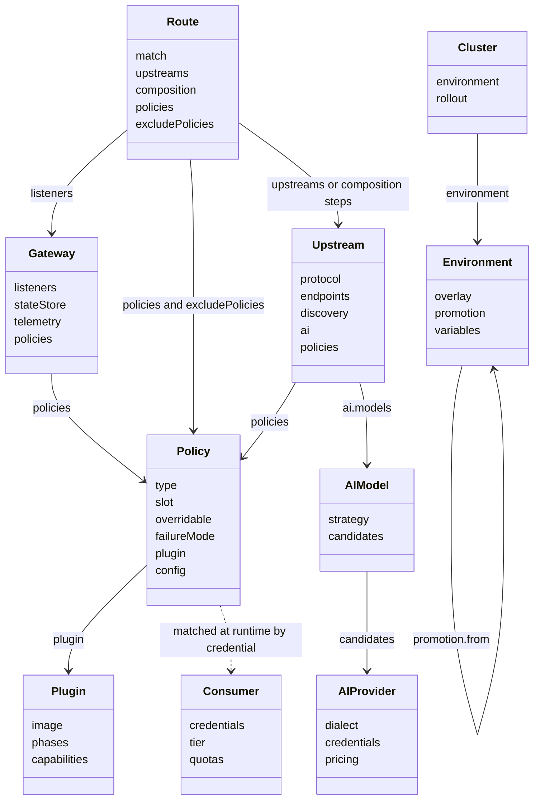
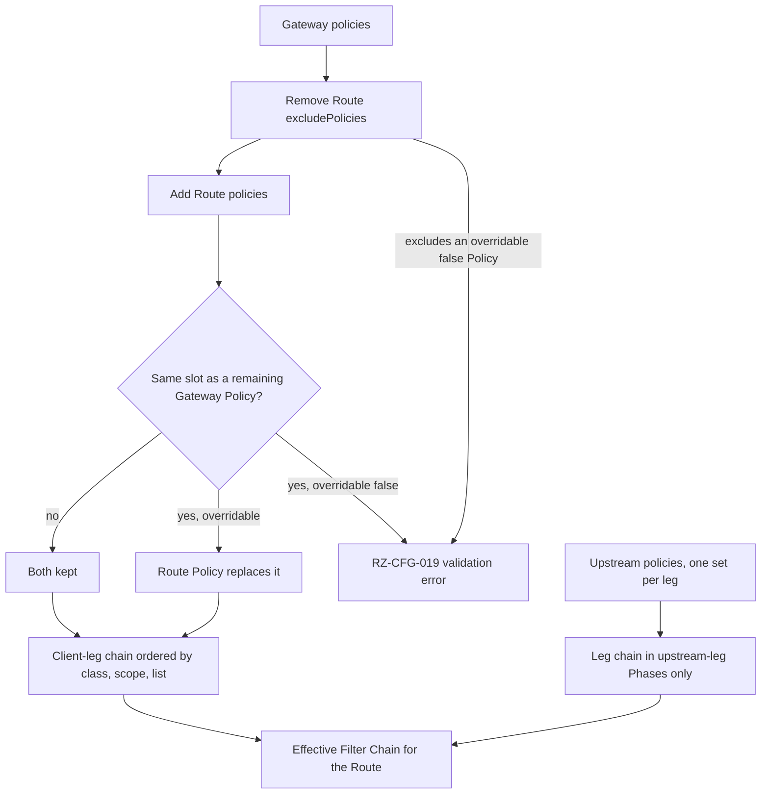
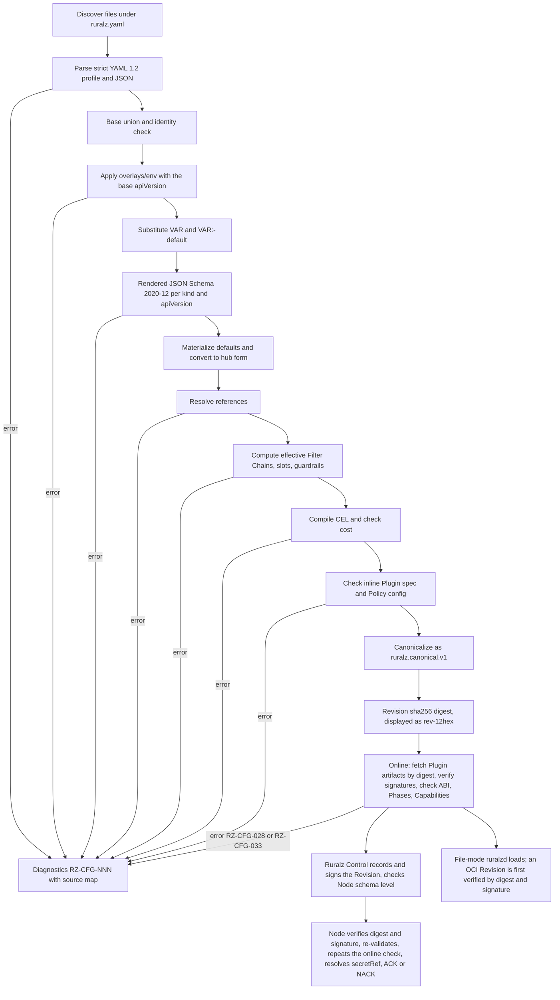

# Configuration Model

## Summary

This document defines how Ruralz is configured: YAML 1.2 resources in the Kubernetes style (`apiVersion: ruralz/v1alpha1`, `kind`, `metadata`, `spec`), validated by one published JSON Schema, grouped into a Bundle and rendered into a content-addressed Revision. It fixes the schema of all ten kinds, merge and overlay rules, slot-based Policy precedence with guardrails, where CEL may appear, `secretRef` and `${VAR}` handling, validation, the diff format, apiVersion evolution and the CRD mapping. Nothing is implemented yet: capabilities carry `Planned (Mx)` tags, and a rule without its own tag ships with the kind or verb that applies it. Architects, contributors and operators should read it before writing or reviewing a Bundle or schema change.

## Scope and non-goals

In scope: everything the Summary lists, including `overlays/<env>/`, the canonical form behind a Revision digest, error codes and the Kubernetes CRD mapping, `Planned (M2)` ([ADR-0016](../adr/0016-kubernetes-helm-and-crds.md), proposed).

Non-goals:

- Runtime semantics of each Policy type's `config`, owned by feature documents such as [Traffic management and resilience](09-traffic-management-and-resilience.md). Each feature document authors its type's `config` schema, and this document registers and publishes it ([foundation pack](../_meta/foundation-pack.md) section 3).
- Rollouts and the Control Stream ([Control plane and GitOps](04-control-plane-and-gitops.md), [ADR-0007](../adr/0007-control-stream-protocol.md)), and artifact signing ([ADR-0017](../adr/0017-artifact-signing.md), owned by [Security and identity](08-security-and-identity.md)); this document registers only the signature error code.
- Host Functions and Capabilities ([WASM plugin system](05-wasm-plugin-system.md)).
- Gateway API conformance, deferred by ADR-0016 (proposed), and Helm values ([Deployment topologies](../operations/01-deployment-topologies.md)).
- A built-in template language.

## Format decision

Configuration is YAML 1.2 with a published JSON Schema (draft 2020-12) and a Kubernetes-style resource model ([ADR-0003](../adr/0003-configuration-format.md)). JSON is accepted as a strict subset of YAML: `.json` files use the same loader and schema and yield the same Revision digest. Keys are `camelCase`; kinds are `PascalCase`. The published JSON Schema is `Planned (M0)`. The `ruralz bundle` verbs `validate`, `render`, `diff` and `build` are `Planned (M1)`, as in [System overview](01-system-overview.md); `push`, `import`, `export` and `audit` are `Planned (M2)` (foundation pack section 9).

### Why the Kubernetes resource model

The envelope maps one to one onto CRDs, so the CRD path in ADR-0016 (proposed) is a translation, not a second schema, and existing YAML language servers, linters and policy engines work unchanged. Kubernetes stays optional: `ruralzd` can watch a Bundle directory, pull a Revision from an OCI registry, or receive one from Ruralz Control.

| Option | Schema and editor story | CRD path | Diffs | Verdict |
|---|---|---|---|---|
| YAML 1.2 + JSON Schema, Kubernetes envelope | One schema source drives editors, CLI, admission | Direct | Good | Chosen |
| JSON only | Strong, no comments | Possible | Poor | Rejected |
| HCL | Weak | None | Good | Rejected |
| Single flat file with templates | Moderate | None | Poor at scale | Rejected |

### Restricted YAML profile

The loader rejects features that let a small edit change distant values or let a small file expand without bound. The profile is `Planned (M1)`, with the `ruralz bundle` verbs and file-mode `ruralzd`.

| YAML feature | Accepted | Reason |
|---|---|---|
| Comments, flow style, multi-document files | Yes | No effect on meaning |
| YAML 1.2 core scalars (`yes`, `on` are strings) | Yes | No YAML 1.1 typing surprises |
| Duplicate keys | No, RZ-CFG-002 | Parsers silently keep the last |
| Anchors, aliases, merge keys | No, RZ-CFG-003 | Alias expansion exhausts memory; edits leak outside the diff hunk |
| Custom tags (`!include`, `!env`) | No, RZ-CFG-004 | One mechanism each for inclusion and substitution |
| Non-UTF-8, byte order marks | No, RZ-CFG-001 | Identical bytes on every OS |

Size and depth limits are configurable; exceeding one is RZ-CFG-001. The proposed defaults are 64 MiB of source text, 20,000 resources and 64 nesting levels (target). Depth is counted over `lexer.Tokenize` output before parsing, so over-deep input never reaches the parser. A Node never enforces a limit below the CLI default, so no Bundle that passes CI fails on a Node for size or depth. The depth value and peak loader memory (hypothesis) are OQ-configuration-model-18. The loader parses with `github.com/goccy/go-yaml`, with Ruralz code over its AST rejecting anchors, aliases, merge keys and custom tags, and validates with `github.com/santhosh-tekuri/jsonschema/v6`, whose `Vocabulary` API carries the `x-ruralz-*` keywords (foundation pack section 7, selected at the freeze).

### OpenAPI, Postman and test tooling

`ruralz bundle import openapi` builds Routes and Upstreams from an OpenAPI document; `ruralz bundle export openapi`, `ruralz bundle export postman` and `ruralz bundle export dot` publish a Bundle as an OpenAPI document, a Postman collection or a DOT graph; and `ruralz test run` executes end-to-end test cases against a Gateway. All are `Planned (M2)` (foundation pack section 9); test cases live outside the Bundle.

## Resource model

Every resource has the same envelope:

```yaml
apiVersion: ruralz/v1alpha1     # required; the first served version, Planned (M0)
kind: Route                      # required; one of the ten kinds
metadata:
  name: orders-summary           # required; RFC 1123 label, 1 to 63 chars
  labels:                        # optional; string to string
    team: commerce
  annotations:                   # optional; string to string
    shop.example/owner: commerce
spec: {}                         # required; kind-specific
```

### Identity and references

Identity is `(kind, metadata.name)`, unique within a rendered Bundle; merge, overlays, references and diff all key on it, so a rename is a removal plus an addition. RFC 1123 names are also valid CRD object names. The `ruralz.io/` label and annotation prefix is reserved. `metadata` accepts only `name`, `labels` and `annotations`, and a `status` block is rejected because only Ruralz Control writes status.

References are by name within the rendered Bundle: a string for one target (`spec.plugin: geo-block`), a list of objects keyed by `name` for several (`spec.policies: [{name: jwt-default}]`), so overlays and server-side apply merge by key. The field implies the target kind. `Route.spec.listeners` is the one list of plain strings, because it names sub-resources of the single `Gateway`, not resources. A missing target is an error and there are no cross-Bundle references, so every Revision is self-contained configuration and safe as Last-Known-Good.

### Scope of kinds

| Kind | Lives in | Planned |
|---|---|---|
| `Gateway`, `Route`, `Upstream`, `Policy`, `Consumer` | Bundle, delivered to Nodes | Planned (M1) |
| `Plugin` | Bundle, delivered to Nodes | Planned (M2) |
| `AIProvider`, `AIModel` | Bundle, delivered to Nodes | Planned (M3) |
| `Environment` | Control plane only, outside the Bundle; the CLI also reads it from `--environments` files and never sends it to Nodes | Planned (M1) for CLI renders; Planned (M2) in Ruralz Control |
| `Cluster` | Control plane only, outside the Bundle | Planned (M2) |

Each Bundle has exactly one `Gateway`, in `ruralz.yaml` (RZ-CFG-016). It holds per-Cluster singletons (admin port, State Store connection, global limits), and one Gateway removes any Route-to-Gateway binding rules.

### Schema keywords that drive tooling

The JSON Schema is the single source of truth. Seven custom annotation keywords, permitted by draft 2020-12, let one schema drive validation, merge, rendering and diff:

| Keyword | Applies to | Effect |
|---|---|---|
| `x-ruralz-ref` | Reference fields | Target kind; `${VAR}` forbidden |
| `x-ruralz-secret` | `SecretValue` fields | Only `secretRef` accepted; never rendered |
| `x-ruralz-cel` | CEL fields | Variables and result type for type-checking |
| `x-ruralz-list` | Arrays | `map` (merged and diffed by a key, sorted), `orderedMap` (merged and diffed by a key, authored order kept), `set` (sorted, replaced whole), `atomic` (ordered, replaced whole) |
| `x-ruralz-impact` | Any field | Diff impact: `routing`, `security`, `traffic`, `plugin`, `ai`, `metadata` |
| `x-ruralz-since` | Any field | Schema level that added the field, for version skew |
| `x-ruralz-validations` | Objects, including Plugin `configSchema` | CEL rules over `self` |

`orderedMap` is for keyed lists whose order carries meaning: `spec.policies` on every kind (list position orders Policies within a Filter class and scope), `AIModel.spec.candidates` (Provider Fallback order) and `Route.spec.composition.steps` (sequential order). Every other keyed list is an unordered `map`.

The schema is published in two views generated from one source. The authoring view, used by editors and for raw source files, lets every non-string scalar that permits substitution also be a string matching `^\$\{[A-Za-z_][A-Za-z0-9_]*(:-[^}]*)?\}$`. The rendered view is strict and validates after substitution. Both carry the same keywords.

Unknown fields outside labels and annotations are rejected with a nearest-match hint (RZ-CFG-006). Durations use Go syntax, byte sizes accept integers or Kubernetes quantities, and prices are decimal strings. The canonical form normalizes them (`90s` becomes `1m30s`, `10Mi` becomes `10485760`), so equivalent spellings never diff and floats never drift.

### Kubernetes mapping

Mirrored CRDs for all ten kinds are `Planned (M2)` ([ADR-0016](../adr/0016-kubernetes-helm-and-crds.md), proposed). A CRD group needs a dot, so CRDs use `ruralz.io/v1alpha1` and translate to the Bundle `ruralz/v1alpha1` by changing only the group; Bundles keep `ruralz/v1alpha1` (foundation pack section 2 Config unit row, section 7 ADR-0016 row and section 12). CRDs publish the rendered view; string fields may still carry `${VAR}` for Ruralz Control to substitute.

| Aspect | Bundle form | CRD form |
|---|---|---|
| `apiVersion` | `ruralz/v1alpha1` | `ruralz.io/v1alpha1`, category `ruralz` |
| `metadata.namespace` | Rejected | One namespace becomes one Bundle |
| `x-ruralz-validations` | Checked by `ruralz bundle validate` | Emitted as `x-kubernetes-validations`; rules in a Plugin `configSchema` run only in Ruralz Control, because Policy `config` is schemaless in the CRD |
| `${VAR}` in non-string fields | Allowed (authoring view) | Rejected by the structural schema |
| `status` | Rejected | Status subresource with conditions |
| `Environment`, `Cluster` | Outside the Bundle | Cluster-scoped CRDs read only by Ruralz Control |

Ruralz Control is the only Kubernetes controller in this path: it watches the CRDs, assembles each namespace into a Bundle and runs the Git pipeline; `ruralzd` never reads CRDs (OQ-configuration-model-2). Whether one Cluster may take both Git and CRD changes stays OQ-system-overview-8, owned by [Deployment topologies](../operations/01-deployment-topologies.md). Mirrored CRDs expose every feature, so Gateway API ([source](https://gateway-api.sigs.k8s.io/implementations/)) is a later adapter.

## Kind catalog

Sketches are normative for field names and mark required fields with `# required`; other fields are optional with schema defaults. Each list is annotated with its `x-ruralz-list` type (`map`, `orderedMap`, `set` or `atomic`). A field not shown does not exist; other documents propose new fields through Open questions. Secret fields take the `SecretValue` shape `{secretRef: {...}}`.

*Figure 1: the ten resource kinds and the references between them; the dotted arrow is a runtime lookup.*



### Gateway

Listeners, TLS, admin, telemetry, global limits, the State Store connection and Gateway-scoped Policies.

```yaml
kind: Gateway
spec:
  listeners:                       # required, at least one; map keyed by name
    - name: https                  # required
      protocol: https              # required: http | https
      port: 8443                   # required
      http3: true                  # https only; adds UDP on the same port
      proxyProtocol: false         # true requires PROXY protocol v2 on this listener; default false
      hostnames: ["api.shop.example"]   # set
      tls:
        minVersion: "1.3"          # "1.2" | "1.3"; default "1.3"
        certificates:              # required for https; map keyed by name
          - name: api-shop
            certificate: {secretRef: {provider: file, name: /etc/ruralz/tls/tls.crt}}
            privateKey: {secretRef: {provider: file, name: /etc/ruralz/tls/tls.key}}
  trustedProxies: ["10.0.0.0/8"]   # set of CIDRs whose forwarding headers set source.ip; default empty
  admin:
    port: 9901                     # default 9901
  telemetry:
    otlp: {endpoint: "https://otel-collector:4317"}   # TLS per TB-12
    traceSampling: 0.05            # ratio 0 to 1
    accessLog: {when: "response.status >= 400"}   # CEL
  limits:
    maxRequestBodyBytes: 10Mi
    maxRequestHeaderBytes: 64Ki
    maxResponseBodyBytes: 10Mi     # cap on one buffered response, and on a Route's step bodies together
    maxCompositionSteps: 16        # cap on composition.steps per Route
    maxBufferedBytes: 512Mi        # Node-wide budget for all buffered bodies, decoded values included
    maxPluginMemoryBytes: 1Gi      # Node-wide cap on aggregate Plugin memory; default owned by WASM plugin system
  stateStore:
    driver: redis                  # memory | redis; default memory
    topology: cluster              # redis only: standalone | cluster; default standalone
    url: {secretRef: {provider: env, name: RURALZ_STATE_STORE_URL}}
    timeout: 50ms                  # per-operation default for Policies
  policies: [{name: cors-default}] # orderedMap keyed by name; Gateway-scoped Policies
```

`trustedProxies` and `listeners[].proxyProtocol`, Planned (M1), feed Security's [Client address](08-security-and-identity.md#ip-filtering-and-geoip) rule, which owns their semantics; a malformed CIDR is RZ-CFG-005. Every topology that puts Nodes behind a load balancer SHOULD set one or both, or `source.ip` is the balancer's address. This answers OQ-security-and-identity-6, option (c).

`stateStore.topology`, Planned (M1), answers OQ-scalability-and-distributed-state-2 with option (a), without Sentinel. `url` uses the rueidis URL form ([source](https://github.com/redis/rueidis/blob/main/README.md)), `rediss://` outside loopback: `standalone` takes one endpoint, `rediss://[user:password@]host:port[/db]`; `cluster` takes a seed list, `rediss://host:port?addr=host:port&addr=host:port`. A `standalone` URL names an endpoint that follows the primary through failover, such as a managed service's primary endpoint; the Node sets `ForceSingleClient`, so rueidis never guesses, and on a closed connection reconnects under Scalability's [reconnect pacing](11-scalability-and-distributed-state.md#state-client-and-rz-sts-error-codes) and reloads its scripts. A `cluster` client reads the slot map from any seed with `CLUSTER SLOTS`, follows `MOVED` and `ASK`, and refreshes the map after a redirect, a closed connection and every 10 s (target) through `ShardsRefreshInterval` ([source](https://github.com/redis/rueidis/blob/main/rueidis.go)), so promoted replicas and new shards need no Revision. A resolved URL that does not fit `topology`, such as `master_set`, or `addr` under `standalone`, is RZ-CFG-026 on the Node.

`stateStore.url` is a `SecretValue` because Redis URLs often carry credentials; each Node resolves it, so each Region uses its own State Store under one Revision. Without `stateStore`, `ruralzd` reads `RURALZ_STATE_STORE_URL`, else uses `memory` and logs a warning at startup, because `memory` multiplies every Rate Limit and Quota by the Node count. The proposed defaults are 10 MiB for `maxResponseBodyBytes`, 16 for `maxCompositionSteps` and 512 MiB for `maxBufferedBytes` (target); how they are enforced is in [Body buffering and limits](#body-buffering-and-limits).

`limits.maxPluginMemoryBytes` caps aggregate Plugin memory per Node; at the cap new instances are refused (`RZ-PLG` under the Policy's `failureMode`). [WASM plugin system](05-wasm-plugin-system.md) owns its default (foundation pack section 8.11). `http3: true` is `Planned (M3)` and off in FIPS builds.

### Route

Match criteria, Route-scoped Policies, and one or more Upstreams, directly or through composition.

```yaml
kind: Route
spec:
  listeners: [https]               # set of Gateway listener names; default all
  match:                           # required; at least one criterion; criteria AND together
    hosts: ["api.shop.example"]    # set
    path: {template: "/v1/orders/{orderId}"}   # exactly one of exact | prefix | template | regex
    methods: [GET]                 # set
    headers: [{name: x-canary, exact: "true"}] # map keyed by name; exact | regex | present
    grpc: {service: shop.cart.v1.CartService, method: GetCart}   # method optional
    graphql: {operationType: query, operationName: GetOrder}
    topic: orders.created          # event ingress (OQ-configuration-model-11)
    when: 'request.headers["x-tenant"] == "acme"'   # CEL
  policies: [{name: jwt-default}]  # orderedMap keyed by name; Route-scoped Policies
  excludePolicies: [{name: cors-default}]   # map keyed by name; removes inherited Gateway Policies
  upstreams:                       # required unless composition is set; map keyed by name
    - name: orders
      weight: 100                  # default 1; weighted split across entries
  composition:                     # mutually exclusive with upstreams
    mode: aggregate                # required: aggregate | sequential | conditional
    steps:                         # required; orderedMap keyed by name
      - name: order                # required
        upstream: orders           # required
        method: GET                # default: the incoming method
        pathExpression: '"/orders/" + request.pathParams.orderId'   # CEL; or path: a literal
        target: data               # unwrap a nested object first
        select: [id, status, total]   # set; allowlist of response fields
        rename: {total: amount}
        collection: false          # true when the body is a JSON array
        group: order               # key under which the body is merged
        maxBodyBytes: 1Mi          # default: an equal share of Gateway limits.maxResponseBodyBytes
        optional: false            # true allows a partial response
        when: "true"               # CEL; conditional and sequential modes
  timeout: 5s                      # whole-request deadline
```

Each step has exactly one of `path` or `pathExpression`; template captures reach steps only through CEL (`request.pathParams`). `aggregate` runs steps in parallel and merges bodies under `group`; `sequential` runs steps in list order and exposes earlier results as `steps`; `conditional` runs the first step whose `when` is true. More steps than `maxCompositionSteps` is RZ-CFG-031.

Two Routes with identical match criteria are RZ-CFG-023; other Route precedence belongs to [Data plane](03-data-plane.md#router). A `match.hosts` entry may start with one `*.` label, as in `*.shop.example`; any other `*` is RZ-CFG-005, and Data plane owns wildcard matching. This answers OQ-data-plane-2, option (a). `grpc` and `graphql` matching are `Planned (M3)`, `topic` `Planned (M4)`.

#### Body buffering and limits

Every body streams unless something must read it whole. Buffering is `Planned (M1)`, its AI triggers `Planned (M3)`, in two forms that fail differently:

| Form | Triggered by | Over a limit or out of budget |
|---|---|---|
| Gate: nothing is forwarded until the body is complete, so the response is still uncommitted | Steps: every `aggregate` step, since merging needs whole bodies, and any step with `target`, `select`, `rename` or `group` or read later through `steps`. CEL reading `request.body` or `response.body`. Policies: `authz.*` in `onRequestBody`, `validation.json-schema`, `transform.request`, `transform.response`, `ai.token-budget` and `ai.guardrail` outside `onChunk`, and the request side of `ai.semantic-cache`. An `ai` Upstream, which parses the request. A Plugin with `onRequestBody` or `onUpstreamResponseBody` in `phases` | Always before commit: 413 for the request body; a failed step, decided by `optional`; 502 for another response body; 503 with an `RZ-RT-<NNN>` code when the Node budget is spent |
| Tee: a copy is kept while the body streams on to the client | The store side of `cache` (Response Cache) and `ai.semantic-cache`, including a streamed SSE completion | Stops copying, skips the store, keeps streaming and increments `ruralz_cache_store_skipped_total` for `cache` or `ruralz_ai_semantic_cache_store_skipped_total` for `ai.semantic-cache` ([Observability](10-observability.md); a `buffer_budget` reason for the latter is proposed there) |

Limits count bytes after content decoding. A body decoded into Go values for CEL (`request.body`, `response.body`, `steps[].body`) or for a merge is charged at the size of the values the decoder builds, at most 4 times the raw limit it arrived under (target); beyond that it fails as oversized. The merged aggregate output is one more copy, capped as the client response by `maxResponseBodyBytes`.

A step without `maxBodyBytes` gets an equal share of what `maxResponseBodyBytes` leaves after explicit values, so a Route's step bodies together fit in one `maxResponseBodyBytes`; explicit values that break this are RZ-CFG-032. Per request, raw buffering is at most `maxRequestBodyBytes` plus twice `maxResponseBodyBytes` (step bodies, then the response): 30 MiB with the proposed defaults, 150 MiB counting decoded values (target). Across requests, all of it is reserved from `maxBufferedBytes`, one budget per Node: a gate that cannot reserve gets the 503 above, whose code [Data plane](03-data-plane.md) owns, and a tee skips the store.

### Upstream

A target service: Endpoints or discovery, protocol, load balancing, health checks, retries, circuit breaking and TLS.

```yaml
kind: Upstream
spec:
  protocol: http                   # required: http | grpc | graphql | websocket | kafka | nats | mqtt | ai
  endpoints:                       # required unless discovery or protocol ai; map keyed by address
    - address: "orders.shop.svc:8080"
      weight: 1
  discovery:                       # alternative to endpoints
    type: kubernetes               # dns | kubernetes
    service: orders
    namespace: shop
    port: http                     # port name or number
  loadBalancing: {algorithm: ring-hash, hashKey: 'request.headers["x-user"]'}   # round-robin | least-request | ring-hash | random
  healthCheck:
    active: {path: /healthz, interval: 10s, timeout: 2s, healthyThreshold: 2, unhealthyThreshold: 3}
    passive: {consecutiveErrors: 5, ejectionTime: 30s}
  retries:
    attempts: 2
    perTryTimeout: 1s
    retryOn: 'error != null ? error.kind in ["connect", "reset"] : response.status in [502, 503]'   # CEL
  circuitBreaker:
    maxConnections: 1024
    maxPendingRequests: 256
    consecutiveFailures: 5
    openDuration: 30s
    failureWhen: 'error != null || response.status >= 500'   # CEL
  tls:
    sni: orders.shop.svc
    caCertificate: {secretRef: {provider: file, name: /etc/ruralz/ca/ca.crt}}
    clientCertificate: {secretRef: {provider: file, name: /etc/ruralz/mtls/tls.crt}}
    clientKey: {secretRef: {provider: file, name: /etc/ruralz/mtls/tls.key}}
  timeout: 3s
  messaging: {topic: orders.created, key: "consumer.name"}   # kafka | nats | mqtt only; key is CEL
  ai: {surface: openai, models: [{name: support-chat}]}     # protocol ai only; surface openai | native; models is a map keyed by name
  policies: [{name: headers-internal}]   # orderedMap keyed by name; upstream-leg Policies
```

`ai.models` replaces `endpoints` for `ai`, and `ring-hash` requires `hashKey`. Kubernetes discovery watches EndpointSlices, avoiding DNS TTL lag. `http` and `dns` discovery are `Planned (M1)`; `kubernetes` discovery `Planned (M2)`; `grpc`, `graphql`, `websocket` and `ai` `Planned (M3)`; `kafka`, `nats`, `mqtt` and `messaging` `Planned (M4)`.

### Policy

Named, reusable configuration for a Filter (built-in) or a Plugin (WASM).

```yaml
kind: Policy
spec:
  type: ratelimit                  # required; see the type registry below
  slot: edge-ratelimit             # optional precedence key; default from the registry
  overridable: true                # when attached to the Gateway: false forbids Route replace or exclude
  failureMode: open                # open | closed; default from the registry
  stateStoreTimeout: 50ms          # default: Gateway spec.stateStore.timeout
  when: 'request.method != "OPTIONS"'   # CEL; the Policy is skipped when false
  plugin: geo-block                # required when type is plugin
  filterClass: authz               # plugin only; default custom
  config: {}                       # required; validated by the type's schema
```

`failureMode` applies whenever the Filter or Plugin cannot decide: a State Store call fails or exceeds `stateStoreTimeout` ([ADR-0008](../adr/0008-rate-limiting-local-bucket-and-gcra.md)), a remote dependency such as a JWKS URL fails, a Plugin traps or exceeds limits, or a CEL expression errors at runtime; for types without dependencies, such as `cors`, only CEL errors. Its effect per Phase is foundation pack section 8.10: before commit, `closed` rejects (401 or 403 for auth and authz types, otherwise 503; 502 in a response Phase) with a code chosen per section 8.6, and `open` skips the Policy; after commit, `closed` ends an `onChunk` stream and `open` passes the chunk; an `onLog` failure only reaches telemetry. Each failure increments `ruralz_filter_failures_total` by Policy, Phase and mode (name proposed to [Observability](10-observability.md)).

No Policy calls the State Store per chunk. `ai.token-budget` reserves, guards and settles as foundation pack section 8.9 fixes ([ADR-0014](../adr/0014-ai-api-surface.md)): one atomic reservation of estimated input plus the output cap in `onRequestBody`, a local count in `onChunk` that ends the stream past the cap and is never billed, and asynchronous settlement with provider-reported usage at `onLog`. An `AIModel` reachable from a Route with an `ai.token-budget` Policy and no `limits.maxOutputTokens` is RZ-CFG-034. `quota` checks in `onRequestHeaders` and settles at `onLog`. Their default postures are OQ-configuration-model-8.

`slot` is the precedence key. `override`-class types default to the registry slot (all client authentication types share `auth`); additive types default to their own name, so they stack unless an author sets `slot` explicitly. In the registry, a Filter class is a position within a Phase, scopes G, R and U are Gateway, Route and Upstream, and slot `name` means the Policy's own name. `failureMode` is overridable only for non-security types: `auth.*` (including the upstream types), `authz.*` and `plugin` Policies with `filterClass` auth or authz are `closed` only, and `open` there is RZ-CFG-029. `headers` and `transform.*` run only in Phases their `config` uses. Registry defaults are materialized into the canonical form like schema defaults (see [Canonical form and Revision](#canonical-form-and-revision)). How one Route accepts either JWT or an API key in the single `auth` slot is OQ-configuration-model-13.

The registry below matches foundation pack section 10; its `type` strings are exact, and `rateLimit`, `rate-limit`, `apiKey`, `jwt`, `tokenBudget`, `ipfilter` and `geoip` are never valid spellings.

| `type` | Filter class | Phases | Scopes | Slot | `failureMode`: default; allowed | Planned |
|---|---|---|---|---|---|---|
| `auth.jwt`, `auth.api-key`, `auth.basic`, `auth.mtls` | auth | onRequestHeaders | G, R | `auth` | closed; closed only | Planned (M1) |
| `authz.cel` | authz | onRequestHeaders, onRequestBody | G, R | `name` | closed; closed only | Planned (M1) |
| `authz.opa`, `authz.cedar` | authz | onRequestHeaders, onRequestBody | G, R | `name` | closed; closed only | Planned (M2) |
| `authz.ip` | authz | onRequestHeaders | G, R | `name` | closed; closed only | Planned (M1) |
| `authz.geoip` | authz | onRequestHeaders | G, R | `name` | closed; closed only | Planned (M2) |
| `ratelimit` | admission | onRequestHeaders | G, R | `name` | open; either | Planned (M1) |
| `quota` | admission | onRequestHeaders, onLog | G, R | `name` | open; either | Planned (M1) |
| `validation.json-schema` | validation | onRequestBody | R | `validation` | closed; either | Planned (M1) |
| `cors` | cors | onRequestHeaders, onResponse | G, R | `cors` | closed; either | Planned (M1) |
| `cache` (Response Cache) | cache | onRequestHeaders, onResponse | R | `cache` | open; either | Planned (M1) |
| `headers` | transform | onRequestHeaders, onResponse; at U: onUpstreamRequest, onUpstreamResponseHeaders | G, R, U | `name` | closed; either | Planned (M1) |
| `transform.request` | transform | onRequestBody; at U: onUpstreamRequest | G, R, U | `name` | closed; either | Planned (M1) |
| `transform.response` | transform | onResponse; at U: onUpstreamResponseBody | G, R, U | `name` | closed; either | Planned (M1) |
| `auth.upstream-oauth2` | upstream-auth | onUpstreamRequest | U | `upstream-auth` | closed; closed only | Planned (M1) |
| `auth.upstream-sigv4` | upstream-auth | onUpstreamRequest | U | `upstream-auth` | closed; closed only | Planned (M2) |
| `ai.token-budget` | admission | onRequestBody, onChunk, onLog | G, R | `name` | closed; either | Planned (M3) |
| `ai.semantic-cache` (Semantic Cache) | cache | onRequestBody, onResponse | R | `semantic-cache` | open; either | Planned (M3) |
| `ai.guardrail` | validation | onRequestBody, onChunk, onResponse | G, R | `name` | closed; either | Planned (M3) |
| `plugin` | `filterClass` | The Plugin's `phases` | Scopes matching those Phases | `name` | closed; closed only for auth and authz classes | Planned (M2) |

The Semantic Cache has one switch: a Route caches only when it attaches an `ai.semantic-cache` Policy, which uses the selected AIModel's `cache.semantic` parameters; a model without them is never cached. The Prompt Cache is provider-side and configured on `AIModel`.

`authz.ip` allows or denies by CIDR on the client address (proxy handling: [Security and identity](08-security-and-identity.md)); `authz.geoip` by ISO 3166 country from a local MaxMind-format database, whose reader is a pending selection (foundation pack sections 7 and 10).

Each type's full `config` schema is authored by its feature document and registered and published by this document, and a registered `config` field counts as defined here for style guide section 5 (foundation pack section 3). The fields this document uses in the CEL table and the example Bundle are fixed here, and feature documents MUST keep them:

| `type` | `config` fields fixed here |
|---|---|
| `cors` | `allowOrigins`, `allowMethods` |
| `auth.jwt` | `issuers[]` with `issuer`, `jwksUrl`, `audiences` |
| `auth.api-key` | `header` (matched against Consumer `apiKeys` by hash) |
| `authz.cel` | `rule` (CEL) |
| `ratelimit` | `key` (CEL), `limits[]` with `requests`, `window` |
| `quota` | `consumerQuota` (a Consumer quota with `unit: requests`), `key` (CEL; default `consumer.name`) |
| `cache`, `ai.semantic-cache` | `key` (CEL; partitions entries, for example per Consumer) |
| `headers` | `request.set[]`, `response.set[]` with `name` and exactly one of `value` or `valueExpression` (CEL) |
| `ai.token-budget` | `consumerQuota` (a Consumer quota with `unit: tokens`) |
| `auth.upstream-oauth2` | `tokenUrl`, `clientId`, `clientSecret` (`SecretValue`), `scopes` |
| `plugin` | Whatever the Plugin's `configSchema` defines |

A `consumerQuota` that no Consumer in the Bundle defines with the matching `unit` is RZ-CFG-009. At runtime, when `consumer` is null or lacks the named quota, the Policy rejects the request with 403 and an `RZ-RL` or `RZ-AI` code owned by the feature document. That is a decision, so it never uses `RZ-STS`. A Route that must also serve such callers guards the Policy with `when: 'consumer != null && "daily-tokens" in consumer.quotas'`.

#### Registered from feature documents

These fields are registered as their feature documents authored them, so each counts as defined here; the authoring section owns their runtime semantics. This answers OQ-security-and-identity-2, -3 and -18 and OQ-traffic-management-and-resilience-1 with option (a), register as authored, and registers the Transform Policies schema and CEL rows that Data plane submitted.

| `type` or kind | Registered fields | Validation | Authored in |
|---|---|---|---|
| `auth.basic` | `config`: none; reads `Authorization: Basic` | Schema only | [Basic and mTLS schemas](08-security-and-identity.md#basic-and-mtls-schemas) |
| `Consumer`, for `auth.basic` | `credentials.basic`: `map` keyed by `username`, each with `hash` (`pbkdf2-sha256:<salt>:<key>`, base64url) and `iterations`, default 600,000 (target) | A `username` in two Consumers is RZ-CFG-035; `iterations` outside 600,000 to 1,000,000 is RZ-CFG-036 | [Basic and mTLS schemas](08-security-and-identity.md#basic-and-mtls-schemas) |
| `auth.mtls` | `config.caCertificate` (required `SecretValue`), `config.subjects` (`set` of rules, each exactly one of `subject` or `uriSan`), `config.crl` (`SecretValue`) | A rule with both or neither is RZ-CFG-005 | [Basic and mTLS schemas](08-security-and-identity.md#basic-and-mtls-schemas) |
| `Consumer`, for `auth.mtls` | `credentials.certificates`: `map` keyed by `name`, each exactly one of `subject` or `uriSan` | A `subject` or `uriSan` in two Consumers is RZ-CFG-035 | [Basic and mTLS schemas](08-security-and-identity.md#basic-and-mtls-schemas) |
| `authz.ip` | `config.allow`, `config.deny`: `set` of CIDRs or bare addresses | Both empty is RZ-CFG-005 | [IP filtering and GeoIP](08-security-and-identity.md#ip-filtering-and-geoip) |
| `authz.geoip` | `config.allow`, `config.deny`: `set` of ISO 3166-1 alpha-2 codes | Both empty is RZ-CFG-005 | [IP filtering and GeoIP](08-security-and-identity.md#ip-filtering-and-geoip) |
| `auth.upstream-sigv4` | `config.region`, `config.service` (both required), `config.payload` (`signed`, the default, or `unsigned`) | Schema only | [Upstream authentication](08-security-and-identity.md#upstream-authentication) |
| `auth.upstream-oauth2` | `config.timeout`, default `2s` (target) | `tokenUrl`, like `auth.jwt` `jwksUrl`, not `https` is RZ-CFG-037 | [Upstream authentication](08-security-and-identity.md#upstream-authentication) |
| `ratelimit` | `limits[].perNodeCeiling` (integer, 1 to `requests`; unset means derived), `limits[].burst` (integer, 0 to `requests`; default `requests`), `config.localOnly` (boolean; default `false`) | Out of range is RZ-CFG-005; `localOnly: true` waits for OQ-scalability-and-distributed-state-11 to amend foundation pack section 8.8 | [Per-Node ceiling](09-traffic-management-and-resilience.md#per-node-ceiling) |
| `transform.request`, `transform.response` | `config.body` (CEL; a map or list is written as JSON, a string as its bytes), `config.contentType` (string; default `application/json`), and `atomic` lists `config.set[]` (`target`: `header`, `query` (request only) or `body`; `name`; `valueExpression`, CEL), `config.remove[]` (`target`, `name`), `config.arrayOps[]` (`op`: `move`, `append` or `delete`; `from`; `to`) and `config.replace[]` (`path`, `pattern`, `replacement`, `literal`) | A `pattern` over 1 KiB (target) or not valid RE2, or more than 32 entries across the four lists (target), is RZ-CFG-005 | [Transform Policies](03-data-plane.md#transform-policies) |

Each field ships with its type's Planned tag in the registry, and the `Consumer` fields with `auth.basic` and `auth.mtls`, Planned (M1).

### Plugin

A WASM artifact and what it may do; Capabilities are deny-by-default under Plugin ABI v1 ([ADR-0005](../adr/0005-plugin-abi-v1.md)).

```yaml
kind: Plugin
spec:
  image: ghcr.io/acme/ruralz-plugins/geo-block:1.4.0@sha256:fc37c2971bb6e82aa12a871aed718818afcf45ab42bd093f0cf52f4ad8045435   # required; digest required
  abi: ruralz.plugin.v1            # required; Plugin ABI v1
  phases: [onRequestHeaders]       # required; set; subset of the Filter Chain Phases, including onChunk
  capabilities: [request.headers.read, response.send, log.write]   # set; illustrative identifiers; nothing else is granted
  limits: {memoryBytes: 16Mi, timeout: 5ms}
  configSchema:                    # JSON Schema for the Policy spec.config
    type: object
    required: [denyCountries]
    properties:
      denyCountries: {type: array, items: {type: string, pattern: "^[A-Z]{2}$"}}
    x-ruralz-validations:
      - rule: "self.denyCountries.size() <= 50"
        message: "at most 50 countries"
```

An image without an `@sha256:` digest is RZ-CFG-021; the tag is informational. The inline `spec` is authoritative for offline validation and the digest; an online stage checks the artifact against it ([Validation and diff semantics](#validation-and-diff-semantics)). Capability identifiers, default limits and instance pool bounds belong to [WASM plugin system](05-wasm-plugin-system.md). Publishers sign Plugin artifacts at `ruralz plugin push` ([ADR-0017](../adr/0017-artifact-signing.md)).

### Consumer

A caller identity with credentials, a Tier, Quotas and tags.

```yaml
kind: Consumer
spec:
  tier: gold                       # free-form Tier name read by Policies
  credentials:                     # required; at least one credential
    apiKeys:                       # map keyed by name; exactly one of hash | secretRef each
      - name: primary
        hash: "sha256:d1bec0f9342e5607570b2636ed0256023b13be7d7d4bb45e1bed3cfee80dc1b6"
    jwt:                           # map keyed by issuer
      - issuer: https://login.acme.example
        subject: acme-integration  # or claims: {client_id: acme}
    oauthClients: [{clientId: acme-portal}]   # map keyed by clientId
    basic:                         # auth.basic; map keyed by username
      - username: acme-batch
        hash: "pbkdf2-sha256:p3QSJbD88BiOWUtS-PBuRA:s18LvDc4t_R93uVhQXgqaaBz1bwS7QkQFuZzsLHF95A"
        iterations: 600000         # 600000 to 1000000; default 600000
    certificates:                  # auth.mtls; map keyed by name; exactly one of subject | uriSan each
      - name: batch-client
        uriSan: spiffe://acme.example/batch
  quotas:                          # map keyed by name
    - name: daily-tokens
      unit: tokens                 # requests | tokens
      limit: 2000000
      window: 24h
  tags: [partner, eu]              # set
```

`basic` and `certificates` are registered from Security and identity ([Registered from feature documents](#registered-from-feature-documents)). API keys are stored as SHA-256 digests of high-entropy keys. A retrievable key uses `secretRef`; the Node hashes it at load and keeps only the hash in memory (foundation pack section 3, Consumer row). Because Consumers live in the Bundle, every key change is a new Revision; a runtime Consumer source is OQ-configuration-model-17.

### AIProvider

One LLM provider account ([ADR-0014](../adr/0014-ai-api-surface.md)).

```yaml
kind: AIProvider
spec:
  dialect: anthropic               # required: openai | anthropic | gemini | bedrock | mistral | ollama
  baseUrl: https://api.anthropic.com   # default per dialect; required for ollama
  credentials:                     # required except for ollama
    apiKey: {secretRef: {provider: kubernetes, name: llm-keys, key: anthropic}}
  region: us                       # used for data residency routing
  pricing:                         # used for cost attribution
    currency: USD                  # required when pricing is set; ISO 4217
    version: "2026-09-01"          # required when pricing is set
    models:                        # map keyed by model
      - model: claude-sonnet-4-5
        inputPerMillionTokens: "3.00"     # decimal strings: no float drift in diffs
        outputPerMillionTokens: "15.00"
        cachedInputPerMillionTokens: "0.30"
```

Prices are illustrative. Provider-reported usage is authoritative; pricing only converts it to currency.

### AIModel

A virtual model name (its `metadata.name`, sent by clients as `model`) mapped to ordered candidates.

```yaml
kind: AIModel
spec:
  strategy: fallback               # required: weighted | latency | cost | fallback
  candidates:                      # required; orderedMap keyed by name
    - name: primary
      provider: anthropic-prod     # required; AIProvider reference
      model: claude-sonnet-4-5     # required; provider model identifier
      weight: 1                    # weighted strategy only
      when: "ai.estimatedInputTokens < 100000"   # CEL; skip candidate when false
  limits: {maxInputTokens: 32000, maxOutputTokens: 2048}
  cache:
    prompt: {mode: passthrough}    # passthrough | disabled; Prompt Cache
    semantic: {similarityThreshold: 0.92, ttl: 1h}   # Semantic Cache parameters; enabled per Route by ai.semantic-cache
```

Under `fallback`, Provider Fallback follows list order; trigger classes belong to [AI/LLM gateway](06-ai-llm-gateway.md).

### Environment

Groups Clusters, defines a promotion path and holds non-secret variables; control plane only.

```yaml
kind: Environment
spec:
  overlay: prod                    # default: metadata.name; selects overlays/<env>/
  promotion:
    from: staging                  # required when promotion is set; the source commit must complete a Rollout there first
    requireApproval: true
  variables:                       # non-secret values for ${VAR} substitution
    OTEL_EXPORTER_OTLP_ENDPOINT: "https://otel-collector.observability:4317"
```

Every `Environment.spec` field is optional. CLI renders read only `overlay` and `variables`; `promotion` needs Ruralz Control. `promotion.from` chains MUST be acyclic (RZ-CFG-022). Promotion moves a source commit, not a digest, because each Environment renders its own Revision. `from: staging` lets Ruralz Control start a `prod` Rollout only for a Revision rendered from a commit whose `staging` Revision reached `complete`.

### Cluster

A Rollout target: enrolled Nodes sharing one configuration; control plane only.

```yaml
kind: Cluster
spec:
  environment: prod                # required; Environment reference
  region: eu-west-1
  rollout:
    strategy: canary               # all-at-once | canary
    canary: {percent: 10, bake: 15m}
    autoRollback: true
```

All Clusters of an Environment converge on the same Revision; during a canary Rollout they briefly differ. With `autoRollback: true` a deterministic NACK, failed gate or lagging threshold ends a Rollout in `rolled-back`; with `false` it enters `paused` (foundation pack section 8.3). In CRD form the name collides with Kubernetes clusters (OQ-configuration-model-3). Enrollment and Rollout semantics belong to [Control plane and GitOps](04-control-plane-and-gitops.md).

## Bundle layout and merge

A Bundle is a directory rooted at `ruralz.yaml`, which holds ordinary resources including the only `Gateway`. There is no Bundle kind or header, so the smallest Bundle is one `ruralz.yaml` with several `---` documents.

```text
shop-bundle/
  ruralz.yaml               Gateway "edge" (Bundle root)
  .ruralzignore             optional, gitignore syntax
  ai/models.yaml
  ai/providers.yaml
  consumers/partner-acme.yaml
  plugins/geo-block.yaml
  policies/common.yaml
  routes/cart-grpc.yaml
  routes/orders-summary.yaml
  routes/support-chat.yaml
  upstreams/services.yaml
  overlays/
    staging/models.yaml
    prod/scale.yaml
control/                    outside the Bundle: Environment and Cluster
  environments.yaml
  clusters.yaml
```

### Discovery and base merge

The loader reads every `*.yaml`, `*.yml` and `*.json` file under the root except `overlays/`, hidden paths and `.ruralzignore` matches, in lexical byte order of the slash-separated relative path, identical on every OS. `Environment` and `Cluster` are rejected inside a Bundle (RZ-CFG-017): they say where a Revision goes, not what it contains, so adding a Cluster never changes a digest. They live elsewhere, such as `control/`; ingestion belongs to [Control plane and GitOps](04-control-plane-and-gitops.md).

Base files form a union and never patch each other. A duplicate identity is RZ-CFG-008, naming both locations, so each resource lives in exactly one place.

### Overlays

`overlays/<env>/` is selected by an Environment's `spec.overlay` (default: its name) or by `--env` on the CLI; at most one applies per render, in lexical file order. Overlays, `--env` and `--environments` (local `Environment` files) are `Planned (M1)`; selection by Ruralz Control is `Planned (M2)`. The rules follow Kubernetes strategic merge, driven by `x-ruralz-list`:

| Construct | Merge rule |
|---|---|
| New identity | Added; must validate alone |
| Existing identity | Deep-merged; maps merge recursively, overlay wins |
| `map` list | Merged by key; new keys added |
| `orderedMap` list | Merged by key in place; new keys appended at the end; a first entry `{$patch: replace}` replaces the whole list, which is how an overlay reorders |
| `set` or `atomic` list, scalar | Replaced |
| `null` | Field removed, then defaulted |
| List entry `$patch: delete` | Keyed entry removed |
| Annotation `ruralz.io/patch: replace` or `delete` | `spec` replaced whole, or resource removed |

`$patch` is the only non-`camelCase` key and is valid only in overlays. One identity MUST NOT appear in two files of one overlay (RZ-CFG-008), so results never depend on file order. An overlay document MUST use the same `apiVersion` as the base resource it patches (RZ-CFG-030), so merge runs on one version's field names and `x-ruralz-list` types.

`ruralz bundle render --env prod` emits one YAML stream that is itself a valid one-file Bundle. Render is idempotent: it writes a literal `${` that came from a `$${` escape back as `$${`, so rendering its output again yields the same Revision. File-mode `ruralzd` applies no overlay; it loads a rendered Bundle or a Revision from an OCI registry (OQ-configuration-model-10).

### Canonical form and Revision

A Revision is the content-addressed digest of a Bundle rendered for one Environment, not of its source; foundation pack sections 2 (Revision row) and 8.1 fix that definition, and [System overview](01-system-overview.md) defers to this section for its detail. The canonical form and the Revision digest are `Planned (M1)`, with `ruralz bundle build`.

The digest covers a specified, versioned serialization, `ruralz.canonical.v1`, never an internal Go type. After merge and substitution, each resource is decoded with the schema of its own apiVersion, every schema default and every registry default (`slot`, `failureMode`, `filterClass`) is materialized, and the resource is converted to its hub representation. Values are then normalized, `set` lists and unordered `map` lists are sorted, `orderedMap` and `atomic` lists keep authored order, resources are sorted by kind (`Gateway`, `Upstream`, `Plugin`, `Policy`, `Consumer`, `AIProvider`, `AIModel`, `Route`) and name, comments and file names are dropped, and the result is serialized as RFC 8785 canonical JSON behind the format identifier. Because effective values are inside the digest, one Revision behaves the same on every Node that accepts it, even when its resources mix apiVersions.

Three rules keep digests stable across tool releases:

- A field added within an apiVersion (`x-ruralz-since` above 0) is written only when it differs from its default, and that default MUST reproduce the behavior from before the field existed, so older Nodes load Revisions that do not use it.
- Defaults never change in `v1beta1` or `v1`. A `v1alpha1` default change ships as a new schema level with one milestone of notice; rebuilding an affected Bundle yields a new Revision whose diff shows the changed effective value, never a silent change under an old digest.
- A golden corpus of Bundles, including the example Bundle below, and their expected digests runs in CI; every release MUST reproduce it byte for byte, except entries that record such a change. Changing the serialization requires a new format identifier.

The display form `rev-<12 hex>` (for example `rev-162af81f5de4`) appears only in CLI output, Ruralz Console, logs and prose; the Control Stream, OCI pulls, Last-Known-Good and every verification use the full `sha256:<64 hex>`, and content that does not hash to its digest is RZ-CFG-027 (foundation pack section 8.1). Ruralz Control records the source commit (or, for a pushed Bundle, its source tree digest), Bundle path and Environment beside each Revision, outside the digest.

## Attachment and precedence

Policies attach by forward reference: the attaching resource lists them in `spec.policies`; a `Policy` never names its targets.

### Why forward references

Kubernetes policy CRDs often attach in reverse, with a Policy naming its targets through `targetRefs`; a new Policy file could then silently change any Route. Ruralz chooses locality: a `Route` plus the `Gateway` show every Policy that can run, and `overridable: false` covers the platform-team case (OQ-configuration-model-4).

### Resolution rules

Each Route's effective Filter Chain is computed at validation time (foundation pack section 8.12):

1. Take the Gateway's `policies` minus the Route's `excludePolicies`.
2. Add the Route's `policies`. A Route Policy in the same slot as a remaining Gateway Policy replaces it (Route over Gateway); other slots stack. All client authentication types share slot `auth`. Additive types default to their own name as slot, so a Route `ratelimit` adds to the Gateway limit instead of dropping it. A slot holds one Policy per scope (RZ-CFG-018).
3. A Gateway Policy with `overridable: false` cannot be excluded or replaced (RZ-CFG-019); platform teams use it for authentication baselines, abuse limits and security headers.
4. Upstream-scoped Policies form one set per Upstream and run only in that leg's Phases (`onUpstreamRequest`, `onUpstreamResponseHeaders`, `onUpstreamResponseBody`, upstream-side `onChunk`). They never see client Phases or another leg and take no part in slot comparison. A type at a disallowed scope is RZ-CFG-020.
5. Within a Phase, order is Filter class (cors, auth, authz, admission, validation, cache, upstream-auth, transform, custom), then scope (Gateway, Route, Upstream), then position in the `orderedMap` list `spec.policies`. Response Phases run in reverse, so within one Filter class a Gateway Policy acts last on the response; across classes, class order decides. `onLog` keeps request order. Execution belongs to [Data plane](03-data-plane.md).

*Figure 2: resolving the effective Filter Chain for one Route and its Upstream legs.*



### Worked example

From the example Bundle: Gateway `edge` attaches `cors-default`, `jwt-default`, `ratelimit-global` and `headers-security` (both `overridable: false`), and `geo-block-default` (a `plugin` Policy with `filterClass: authz`). Route `orders-summary` aggregates `orders` and `inventory` and attaches `cors-partner`, `authz-orders` and `ratelimit-orders`. Upstream `orders` attaches `upstream-oauth` and `headers-internal`; `inventory` attaches `headers-internal`.

| Phase | Leg | Policy | From | Reason |
|---|---|---|---|---|
| onRequestHeaders | client | `cors-partner` | Route | Slot `cors`, replaces `cors-default`; first, so preflights skip auth |
| onRequestHeaders | client | `jwt-default` | Gateway | Slot `auth`; no Route auth Policy, so inherited |
| onRequestHeaders | client | `geo-block-default` | Gateway | Authz class; Gateway before Route |
| onRequestHeaders | client | `authz-orders` | Route | Authz class |
| onRequestHeaders | client | `ratelimit-global` | Gateway | Admission; own slot; not overridable |
| onRequestHeaders | client | `ratelimit-orders` | Route | Own slot, so both limits apply |
| onUpstreamRequest | `orders` | `upstream-oauth` | Upstream `orders` | This leg only |
| onUpstreamRequest | `orders` | `headers-internal` | Upstream `orders` | Transform, after upstream-auth |
| onUpstreamRequest | `inventory` | `headers-internal` | Upstream `inventory` | Separate leg; no OAuth token |
| onResponse | client | `headers-security` | Gateway | Reverse order: transform before cors |
| onResponse | client | `cors-partner` | Route | Response side of cors |
| none | none | `cors-default` | Gateway | Replaced in slot `cors` |

Client-leg Policies run once per request, upstream-leg Policies once per leg. On `support-chat`, `apikey-partner` (`auth.api-key`, slot `auth`) replaces `jwt-default`; `cart-grpc` excludes `cors-default`; excluding `ratelimit-global` fails with RZ-CFG-019. `ruralz bundle render --effective --route orders-summary` prints this table, `Planned (M1)`.

## CEL expressions and allowed places

Inline expressions use CEL via `cel-go` ([ADR-0011](../adr/0011-expressions-and-authorization-engines.md)); there is no Lua or template language, and OPA and Cedar sit behind `authz.opa` and `authz.cedar`. Use cases that would need a scripting language go to CEL or a WASM Plugin.

### Allowed places

CEL is allowed only in these fields, each marked `x-ruralz-cel`; elsewhere CEL-like text is a plain string. `${VAR}` is forbidden in CEL fields (RZ-CFG-011). *Base* means `request`, `source`, `route`, `consumer`, `auth` and `now`. The runtime-error column is normative and fails safe: no authentication or authorization step is skipped because an expression errored.

| Field | Result | Evaluated | Variables | On runtime error | Planned |
|---|---|---|---|---|---|
| `Route.spec.match.when` | bool | Route matching | `request` (no body), `source`, `now` | 500; no fallthrough to another Route | Planned (M1) |
| `Policy.spec.when` | bool | Once, before the Policy's first Phase | Base; `response` if that Phase is a response Phase | `closed`: Policy runs; `open`: skipped | Planned (M1) |
| `Route.spec.composition.steps[].pathExpression` | string | Before the step | Base, `steps` | Step fails; `optional` decides | Planned (M1) |
| `Route.spec.composition.steps[].when` | bool | Before the step | Base, `steps` | Step fails; `optional` decides | Planned (M1) |
| `authz.cel` `config.rule` | bool | onRequestHeaders or onRequestBody | Base | Deny | Planned (M1) |
| `ratelimit`, `quota` `config.key` | string | onRequestHeaders | Base | Policy `failureMode` | Planned (M1) |
| `headers` `config.*.set[].valueExpression` | string | The operation's Phase | Base; `response`, `upstream` on response operations | Policy `failureMode` | Planned (M1) |
| `cache` `config.key` | string | onRequestHeaders | Base | Cache bypassed | Planned (M1) |
| `transform.request` `config.body`, `config.set[].valueExpression` | dyn; string | onRequestBody; onUpstreamRequest at Upstream scope | Base with `request.body`; `upstream` at Upstream scope | Policy `failureMode` | Planned (M1) |
| `transform.response` `config.body`, `config.set[].valueExpression` | dyn; string | onResponse; onUpstreamResponseBody at Upstream scope | Base, `response` with `body`; `upstream` at Upstream scope | Policy `failureMode` | Planned (M1) |
| `ai.semantic-cache` `config.key` | string | onRequestBody | Base, `ai` | Cache bypassed | Planned (M3) |
| `Upstream.spec.loadBalancing.hashKey` | string | Endpoint selection | Base | Random Endpoint | Planned (M1) |
| `Upstream.spec.retries.retryOn` | bool | After each attempt | `request` (no body), `response`, `error`, `attempt`, `upstream` | No retry | Planned (M1) |
| `Upstream.spec.circuitBreaker.failureWhen` | bool | After each attempt | `request` (no body), `response`, `error`, `upstream` | Counted as failure | Planned (M1) |
| `Gateway.spec.telemetry.accessLog.when` | bool | onLog | Base, `response`, `upstream`, `duration` | Entry written | Planned (M1) |
| `Upstream.spec.messaging.key` | string | onUpstreamRequest | Base | 502 | Planned (M4) |
| `AIModel.spec.candidates[].when` | bool | Model routing, after onRequestBody | Base, `ai` | Candidate skipped | Planned (M3) |
| `x-ruralz-validations[].rule` | bool | Validation time only | `self` | Validation error | Planned (M2) |

### Variables

| Variable | Contents |
|---|---|
| `request` | `method`, `scheme`, `host`, `path`, `pathParams`, `query`, `headers` (lowercased names; repeated fields joined by a comma and space as in RFC 9110), `body` (JSON as `dyn`, body Phases and composition only) |
| `source` | `ip`, `port`, `tlsVersion`, `clientCertSubject` |
| `route` | `name`, `labels` |
| `consumer` | `name`, `tier`, `tags`, `labels`, `quotas` (quota names); null before auth or when anonymous |
| `auth` | `method`, `claims` (as `dyn`); null before auth |
| `response` | `status`, `headers`, `body` in body Phases; null when an attempt got no response |
| `error` | `kind` (`connect`, `timeout`, `reset`, `tls`); null when a response arrived |
| `upstream`, `attempt` | `name`, `endpoint`; attempt number from 1 |
| `steps` | Per completed step: `status`, `headers`, `body` |
| `ai` | `model`, `estimatedInputTokens`, `maxOutputTokens`, `stream` |
| `duration`, `now`, `self` | Request duration, request start time, object under validation |

### Limits

Expressions are parsed, type-checked against their place's environment and cost-estimated at validation; a syntax, type or unavailable-variable error (such as `response` in a Route match) is RZ-CFG-014. The standard library plus the strings and encoders extensions are enabled, with no side effects, I/O or randomness.

Cost has a static bound and a runtime bound. `cel-go` treats `dyn` values and unsized strings, lists and maps as unbounded, so Ruralz supplies a size estimator: every string reached from a variable, typed or `dyn`, counts at a nominal 256 bytes and every list or map at 32 entries (target). RZ-CFG-015 rejects an expression whose estimate at nominal sizes exceeds 10,000 cost units (target), catching nested comprehensions. Cost that grows with input size is bounded at runtime, and every input is capped by a Gateway limit ([Body buffering and limits](#body-buffering-and-limits)). Evaluation stops with a runtime error at 1,000,000 units through the `cel-go` runtime cost limit (target).

The example Bundle, including the `split` and `exists` rule in `authz-orders`, is in the golden corpus and MUST pass RZ-CFG-015. Programs compile once per Revision; typical match and key expressions evaluate in under 2 µs at p99 (target).

## Secrets and environment variables

`${VAR}` is a render-time input: its value is baked into the Revision and visible in diffs. `secretRef` is a runtime reference the Node resolves: its value never appears in a Bundle, Revision, diff, `/config/dump` or log.

### secretRef

Secrets are referenced only through `secretRef`, never inline:

```yaml
password:
  secretRef:
    provider: kubernetes     # required: env | file | kubernetes | vault
    name: redis-auth         # required; meaning depends on provider
    key: password            # optional; key within the secret
```

| Provider | `name` means | `key` means | Rotation | Planned |
|---|---|---|---|---|
| `env` | `ruralzd` process variable | Unused | Restart | Planned (M1) |
| `file` | Absolute path | Optional JSON key | File watch | Planned (M1) |
| `kubernetes` | Secret in the Node's namespace | Data key | API watch | Planned (M2) |
| `vault` | Secret path | Field | Lease renewal | Planned (M2) |

Cloud secret managers are OQ-configuration-model-5. Only Nodes resolve secrets, at load and on rotation, and keep resolved values in memory across Hot Reloads. A literal in a `SecretValue` field is RZ-CFG-012; a credential-shaped literal elsewhere warns (RZ-CFG-013). An unresolvable reference is RZ-CFG-026: the Node rejects the Revision (a NACK in Control mode) and keeps serving its active Revision. A failed rotation keeps the last value and increments `ruralz_config_secret_rotation_failures_total`. Rotating a value needs no Rollout; changing the reference is a normal diff with impact `security`.

Last-Known-Good holds configuration only; resolved secret values are never written to disk. A Node that cold-starts from Last-Known-Good resolves every `secretRef` first, and `/readyz` fails, with retries and backoff, until all resolve. Critical secrets, such as TLS keys and the State Store URL, SHOULD therefore come from `file` or `env`. Encrypted persistence of resolved secrets under `${RURALZ_DATA_DIR}/lkg/` is OQ-configuration-model-15.

On Kubernetes, prefer `provider: file` with Secret volume mounts: no API permissions, immune to API server outages, rotated by the kubelet. `provider: kubernetes` needs `get` and `watch` in the Node's own namespace only.

### Environment substitution

String values MAY contain `${VAR}` or `${VAR:-default}`; `$${` escapes a literal, and `:-` treats empty as unset, as in POSIX shells. An undefined variable without default is RZ-CFG-010. Substitution runs once, after overlay merge and before schema validation, on parsed scalars only, so it cannot inject structure, and it is not recursive. A value that is exactly one expression is re-typed by the rendered schema view (`port: ${HTTPS_PORT:-8443}` becomes an integer), while the authoring view accepts the unrendered string, so raw sources validate in editors.

Substitution is forbidden in keys, `apiVersion`, `kind`, `metadata.name`, reference, `SecretValue` and CEL fields (RZ-CFG-011), so references resolve statically. A variable named like `(?i)(secret|password|token|apikey)` warns (RZ-CFG-013); use `secretRef` with `provider: env` instead.

| Renderer | Source of values | Planned |
|---|---|---|
| `ruralz bundle validate`, `render`, `diff` or `build` with `--env <name>` | That Environment's `spec.variables`, read from the file named by `--environments` or fetched from Ruralz Control; never the process environment; with neither source, an error | Planned (M1) from a file; Planned (M2) from Ruralz Control |
| The same verbs without `--env` | CLI process environment, for local development; no overlay | Planned (M1) |
| Ruralz Control, including the CRD path | Target Environment's `spec.variables`, never its own process environment | Planned (M2) |
| `ruralzd` in file mode | Its process environment, only when it loads an unrendered source Bundle | Planned (M1) |

With `--env`, CI renders exactly what Ruralz Control renders and reproduces its digest. Ruralz Control never accepts a pre-rendered Revision: `ruralz bundle push --env staging` uploads the source Bundle with the CLI's digest, and Ruralz Control re-renders it with the Environment's variables, rejects a mismatch with RZ-CFG-027 and records the source tree digest in place of a Git commit, so promotion gating applies unchanged. Pushing to an OCI registry publishes the rendered Revision, signed with Sigstore ([ADR-0017](../adr/0017-artifact-signing.md)), for file-mode Nodes to pull by digest. New flags are OQ-configuration-model-10.

Values never come from a Cluster, so all Clusters of an Environment run one Revision; Node-local values such as a regional State Store URL use `secretRef` (OQ-configuration-model-12). When several file-mode Nodes read one source, they SHOULD load rendered Bundles or OCI Revisions; without Ruralz Control no Drift is reported, so compare Nodes' `/config/dump` with `ruralz bundle diff`. `RURALZ_CONFIG`, `RURALZ_DATA_DIR` and `RURALZ_LOG_LEVEL` never change a Revision.

## Validation and diff semantics

One validation library is linked into `ruralz`, `ruralz-control` and `ruralzd`. Given the same overlay and variables, which `--env` guarantees, a Bundle that passes `ruralz bundle validate` in CI passes the offline stages of Ruralz Control ingest and Node activation with identical diagnostics. Offline validation needs no registry, because the inline `Plugin.spec` is authoritative.

`ruralz bundle validate` is offline unless `--online` is set (OQ-configuration-model-10). After a green offline run, five checks can still fail: RZ-CFG-028 (online Plugin check), RZ-CFG-033 (a Plugin or Revision signature), RZ-CFG-024 (Node schema level, at Rollout), RZ-CFG-026 (secret or State Store URL resolution on a Node) and RZ-CFG-027 (a pushed Bundle that re-renders differently). CI SHOULD gate merges on `ruralz bundle build` or `validate --online`, which also verify Plugin signatures; the rest depend on the target and surface as a refused Rollout or a NACK.

*Figure 3: the Bundle validation pipeline from files to a Revision.*



Stages up to the digest run offline and report every error in one run. The online stage never changes the digest: it fetches each Plugin artifact by digest and checks that its ABI and exported Phases equal `spec.abi` and `spec.phases` and that its requested Capabilities are a subset of `spec.capabilities`. `ruralz bundle build` runs it unless `--offline` is set, `ruralz bundle validate` only with `--online`, Ruralz Control at ingest and Nodes at activation, where a failure is a NACK. Every failure is RZ-CFG-028. Signatures follow [ADR-0017](../adr/0017-artifact-signing.md) (foundation pack section 8.14): the online stage and Nodes verify Plugin signatures; Ruralz Control signs each Revision it records, CI signs a Revision it pushes to OCI, and Nodes verify before activation. A watched Bundle directory is unsigned, every signature failure is RZ-CFG-033, and signing never changes the digest.

Validating 10,000 resources takes under 2 seconds on a four-core laptop, and the 20,000-resource default limit under 4 seconds (target). The Node compile budget is separate ([System overview](01-system-overview.md)). On a Node the pipeline gates every Hot Reload; a failed render keeps the active Revision serving (foundation pack section 8.2). In Control mode a Node receives the canonical JSON, skips parsing and merge, and re-runs the checks from reference resolution onward, with peak validation memory under four times the canonical size (target).

### Error codes

| Code | Meaning |
|---|---|
| RZ-CFG-001 | Parse error, non-UTF-8, byte order mark, or size or depth limit |
| RZ-CFG-002 | Duplicate key |
| RZ-CFG-003 | Anchor, alias or merge key |
| RZ-CFG-004 | Custom tag |
| RZ-CFG-005 | JSON Schema violation |
| RZ-CFG-006 | Unknown field |
| RZ-CFG-007 | Unknown `kind`, or unknown or unserved `apiVersion` |
| RZ-CFG-008 | Duplicate identity in base files or within one overlay |
| RZ-CFG-009 | Missing or wrong-kind reference target |
| RZ-CFG-010 | Undefined variable without default |
| RZ-CFG-011 | `${VAR}` in a forbidden position |
| RZ-CFG-012 | Literal in a `SecretValue` field |
| RZ-CFG-013 | Warning: credential-shaped literal or secret-like variable name |
| RZ-CFG-014 | CEL syntax, type or unavailable-variable error |
| RZ-CFG-015 | CEL cost ceiling exceeded |
| RZ-CFG-016 | Not exactly one `Gateway`, or `Gateway` outside `ruralz.yaml` |
| RZ-CFG-017 | `Environment` or `Cluster` inside a Bundle |
| RZ-CFG-018 | Two Policies in one slot at one scope |
| RZ-CFG-019 | Excluding or replacing an `overridable: false` Policy |
| RZ-CFG-020 | Policy type or Plugin Phases not allowed at the scope |
| RZ-CFG-021 | Plugin without digest, or `config` violates its schema |
| RZ-CFG-022 | Promotion cycle |
| RZ-CFG-023 | Two Routes with identical match criteria |
| RZ-CFG-024 | Field newer than the oldest target Node serves |
| RZ-CFG-025 | Warning: deprecated field or apiVersion |
| RZ-CFG-026 | `secretRef` unresolvable on a Node, or a resolved `stateStore.url` that does not fit `topology` |
| RZ-CFG-027 | Digest mismatch: content does not hash to its digest, or a pushed Bundle re-renders differently |
| RZ-CFG-028 | Plugin artifact unavailable, digest mismatch, or artifact disagrees with its `Plugin.spec` |
| RZ-CFG-029 | `failureMode` not allowed for the Policy type |
| RZ-CFG-030 | Overlay `apiVersion` differs from its base resource |
| RZ-CFG-031 | More composition steps than `maxCompositionSteps` |
| RZ-CFG-032 | Step `maxBodyBytes` values exceed `maxResponseBodyBytes` or leave no default share |
| RZ-CFG-033 | Signature verification failed for a Revision or Plugin artifact ([ADR-0017](../adr/0017-artifact-signing.md)) |
| RZ-CFG-034 | `AIModel` reachable from a Route with an `ai.token-budget` Policy sets no `limits.maxOutputTokens` |
| RZ-CFG-035 | A `credentials.basic` `username`, or a `credentials.certificates` `subject` or `uriSan`, declared by two Consumers |
| RZ-CFG-036 | `credentials.basic[].iterations` outside 600,000 to 1,000,000 |
| RZ-CFG-037 | `auth.jwt` `jwksUrl` or `auth.upstream-oauth2` `tokenUrl` is not an `https` URL |

This document owns the RZ-CFG registry (foundation pack section 8.6, which lists RZ-CFG-001 to RZ-CFG-032 at the freeze); sections 8.14 and 8.9 ask it to register RZ-CFG-033 and RZ-CFG-034, and [Security and identity](08-security-and-identity.md) asks for RZ-CFG-035 to RZ-CFG-037.

### Diagnostics and source map

A source map from every rendered field to its file, line and column survives merge, overlay and substitution. Diagnostics are human-readable by default and JSON with `--output json`:

```text
routes/orders-summary.yaml:23:19 error RZ-CFG-009 Route/orders-summary spec.composition.steps[name=stock].upstream: Upstream "inventroy" not found (did you mean "inventory"?)
routes/cart-grpc.yaml:11:7 error RZ-CFG-019 Route/cart-grpc spec.excludePolicies[name=ratelimit-global]: cannot exclude a Policy with overridable: false (declared in policies/common.yaml:46:3)
```

```json
{"code": "RZ-CFG-009", "severity": "error", "file": "routes/orders-summary.yaml", "line": 23, "column": 19,
 "resource": {"kind": "Route", "name": "orders-summary"},
 "path": ["spec", "composition", "steps", {"name": "stock"}, "upstream"],
 "message": "Upstream \"inventroy\" not found", "hint": "did you mean \"inventory\"?"}
```

Paths are key-aware and stable under reordering: the human form writes `map` and `orderedMap` entries as `[name=stock]`, `set` elements as `[item=request.body.read]` and `atomic` entries by index; JSON uses arrays of strings, integers and single-entry objects such as `{"name": "stock"}`, so names never need escaping.

### Diff semantics

`ruralz bundle diff FROM TO` compares two rendered states in that order, each a Bundle rendered for an Environment, a Revision from Ruralz Control or an OCI registry, or a live Node's `/config/dump` (how Drift is shown). Naming a different Environment per side reviews a promotion. Diffing rendered Bundles and `/config/dump` is `Planned (M1)`; Revisions fetched from Ruralz Control or an OCI registry are `Planned (M2)`. Rules:

1. Resources match by identity; renames are never inferred.
2. Comparison uses the canonical form, so formatting and file moves never appear.
3. `map` lists compare by key and `set` lists by element, so reordering them is never a change. `orderedMap` lists (`spec.policies`, `candidates`, `composition.steps`) compare by key and report a `move` when an entry's position changes. `atomic` lists report one `replace`.
4. `SecretValue` fields show only the reference.
5. Each change carries its `x-ruralz-impact` classes; changes to `Plugin.spec.capabilities` or `image` are always flagged, because a Capability grant widens what sandboxed code may do.
6. An effective layer lists resolved Filter Chain changes per Route and Phase, because one Gateway Policy edit can alter hundreds of Routes.

Exit status is 0 for no changes, 1 for changes and 2 for errors; [CLI and API surface](../reference/01-cli-and-api-surface.md) MUST match. Human-readable form:

```text
ruralz bundle diff: rev-162af81f5de4 -> rev-68f782530463 (environment: prod)

~ Route/orders-summary                          routes/orders-summary.yaml   [traffic]
    ~ spec.timeout: 5s -> 4s
    + spec.policies[name=ratelimit-orders]
~ Plugin/geo-block                              plugins/geo-block.yaml       [plugin, security]
    + spec.capabilities[item=response.send]  (Capability grant)
~ AIModel/support-chat                          ai/models.yaml               [ai]
    > spec.candidates[name=primary]: position 2 -> 1
    > spec.candidates[name=secondary]: position 1 -> 2
+ Policy/ratelimit-orders                       policies/common.yaml         [traffic]
- Upstream/legacy-orders                        upstreams/services.yaml      [routing]

Effective Filter Chain changes:
  Route/orders-summary onRequestHeaders: + ratelimit-orders (admission, after ratelimit-global)

5 resources changed: 1 added, 1 removed, 3 modified; 1 Route chain changed; impact: ai, plugin, routing, security, traffic
```

JSON form (`--output json`), versioned by `format` independently of the apiVersion:

```json
{
  "format": "ruralz.diff.v1",
  "from": {"revision": "rev-162af81f5de4",
           "digest": "sha256:162af81f5de482d540e09cf25205ffe39b705fd2dcf5eca88eb42e92b098a85e"},
  "to": {"revision": "rev-68f782530463", "bundle": "./shop-bundle",
         "digest": "sha256:68f782530463d5c1f0e2b9a7c4d8e6f1a3b5c7d9e0f2a4b6c8d0e2f4a6b8c0d2"},
  "environment": "prod",
  "resources": [
    {"kind": "Route", "name": "orders-summary", "change": "modified", "source": "routes/orders-summary.yaml",
     "impact": ["traffic"], "ops": [
      {"op": "replace", "path": ["spec", "timeout"], "from": "5s", "to": "4s"},
      {"op": "add", "path": ["spec", "policies", {"name": "ratelimit-orders"}], "to": {"name": "ratelimit-orders"}}
    ]},
    {"kind": "Plugin", "name": "geo-block", "change": "modified", "source": "plugins/geo-block.yaml",
     "impact": ["plugin", "security"], "flags": ["capabilityGrant"], "ops": [
      {"op": "add", "path": ["spec", "capabilities", {"item": "response.send"}], "to": "response.send"}
    ]},
    {"kind": "AIModel", "name": "support-chat", "change": "modified", "source": "ai/models.yaml",
     "impact": ["ai"], "ops": [
      {"op": "move", "path": ["spec", "candidates", {"name": "primary"}], "from": 1, "to": 0},
      {"op": "move", "path": ["spec", "candidates", {"name": "secondary"}], "from": 0, "to": 1}
    ]},
    {"kind": "Policy", "name": "ratelimit-orders", "change": "added", "source": "policies/common.yaml", "impact": ["traffic"]},
    {"kind": "Upstream", "name": "legacy-orders", "change": "removed", "source": "upstreams/services.yaml", "impact": ["routing"]}
  ],
  "effective": [
    {"route": "orders-summary", "phase": "onRequestHeaders", "op": "add", "policy": "ratelimit-orders",
     "filterClass": "admission", "after": "ratelimit-global"}
  ],
  "summary": {"changed": 5, "added": 1, "removed": 1, "modified": 3, "routeChainsChanged": 1,
              "impact": ["ai", "plugin", "routing", "security", "traffic"]}
}
```

The TO side is the example Bundle rendered for `prod`; FROM is a hypothetical earlier Revision that listed `secondary` first and did not grant `response.send`. JSON carries the full `sha256:<64 hex>` digest beside each `rev-<12 hex>` ([CLI and API surface](../reference/01-cli-and-api-surface.md)). Field operations are `add`, `remove`, `replace` and `move`; a `move` carries zero-based list positions in JSON and one-based positions in the human form, where `>` marks it. Added and removed resources carry identity only. Ruralz Control attaches the JSON to each Revision for Rollout approval in Ruralz Console.

### Status conditions in the CRD path

Related objects reach Kubernetes admission in any order, so admission enforces only the structural schema and `x-kubernetes-validations`; Ruralz Control runs the full pipeline and writes Gateway API-style conditions:

| Condition | True when | False reasons |
|---|---|---|
| `Accepted` | Schema and semantic checks pass | `InvalidSpec`, `GuardrailViolation` |
| `ResolvedRefs` | Every reference resolves | `RefNotFound`, `PluginDigestMissing` |
| `Programmed` | Its Revision's Rollout reached `complete` on every target Cluster | `RolloutPending` (`pending`, `canary` or `progressing`), `RolloutPaused` (`paused`), `RolledBack` (`rolled-back`), `RolloutFailed` (`failed`), `NodeNack` |

A failing object blocks the namespace's Revision and Nodes keep the previous one; the REST API exposes the same conditions for Git sources.

## apiVersion versioning and migration

The first served version is `ruralz/v1alpha1`, `Planned (M0)`; it names the schema, not the product. The lifecycle follows Kubernetes API conventions:

| Version | Promise | Field removal | Conversion |
|---|---|---|---|
| `ruralz/v1alpha1` | Fields and defaults may change with one milestone of notice, each change a new schema level | Allowed, with conversion | Hub round trip |
| `ruralz/v1beta1` | Deprecation, not removal; defaults never change | Only in the next version | Automatic, lossless |
| `ruralz/v1` | Stable; additive only; defaults never change | Never | Automatic from beta |

Deprecation windows and beta timing belong to [Release, versioning and compatibility](../engineering/04-release-versioning-and-compatibility.md), which answers OQ-configuration-model-6.

### Hub-and-spoke conversion

Every served version converts to and from one internal hub type per kind, with round trips property-tested for every field; newer-only fields survive down-conversion in the annotation `ruralz.io/conversion-data`. A Bundle MAY mix versions; each resource is merged and defaulted under its own apiVersion before hub conversion. Because the digest covers effective values, converting a Bundle from `ruralz/v1alpha1` to `ruralz/v1beta1` MUST yield the same Revision and an empty `ruralz bundle diff`; the converter writes a field explicitly whenever the source version's default differs from the target's. Deprecated versions and fields raise RZ-CFG-025. `ruralz bundle render --api-version ruralz/v1beta1 --output-dir DIR --environments FILE` writes converted resources and drops comments, as [CLI and API surface](../reference/01-cli-and-api-surface.md) decides for OQ-configuration-model-7.

### Version skew

Each field added within an apiVersion carries `x-ruralz-since`, an integer schema level, and Nodes advertise their highest schema level per apiVersion on the Control Stream. Ruralz Control refuses to start a Rollout whose Revision uses a field newer than the oldest Node in the target Cluster serves (RZ-CFG-024); a Node that receives one anyway NACKs. Skew checks are `Planned (M2)`; a file-mode Node rejects an unserved field at load with RZ-CFG-024. On Kubernetes, CRDs serve all versions with one storage version and Ruralz Control serves the conversion webhook.

## Complete annotated example Bundle

The `shop-bundle` from Bundle layout and merge: REST aggregation, a gRPC Route, an AI Route with `AIProvider` and `AIModel`, a WASM Plugin and a Consumer, using only Kind catalog fields. Model identifiers and prices are illustrative.

`ruralz.yaml`, the Bundle root:

```yaml
apiVersion: ruralz/v1alpha1
kind: Gateway
metadata:
  name: edge
  labels:
    team: platform
spec:
  listeners:
    - name: http
      protocol: http
      port: 8080
    - name: https
      protocol: https
      port: 8443
      http3: true                       # HTTP/3 on UDP 8443
      hostnames: ["api.shop.example"]
      tls:
        minVersion: "1.3"
        certificates:
          - name: api-shop
            # Mounted from a Kubernetes Secret volume; never inline.
            certificate: {secretRef: {provider: file, name: /etc/ruralz/tls/tls.crt}}
            privateKey: {secretRef: {provider: file, name: /etc/ruralz/tls/tls.key}}
  admin:
    port: 9901
  telemetry:
    otlp:
      # Render-time value from Environment variables; the default keeps local runs working.
      endpoint: ${OTEL_EXPORTER_OTLP_ENDPOINT:-https://otel-collector:4317}
    traceSampling: 0.05
    accessLog:
      when: 'response.status >= 400 || duration > duration("1s")'   # CEL
  limits:
    maxRequestBodyBytes: 10Mi
    maxRequestHeaderBytes: 64Ki
  stateStore:
    driver: redis
    # Runtime value: each Node reads its own regional URL, so every Region shares one Revision.
    url: {secretRef: {provider: env, name: RURALZ_STATE_STORE_URL}}
    timeout: 50ms
  # Gateway-scoped Policies reach every Route.
  policies:
    - name: cors-default
    - name: jwt-default
    - name: ratelimit-global            # overridable: false
    - name: headers-security            # overridable: false
    - name: geo-block-default
```

`upstreams/services.yaml`:

```yaml
apiVersion: ruralz/v1alpha1
kind: Upstream
metadata:
  name: orders
spec:
  protocol: http
  discovery:                            # EndpointSlices of Service shop/orders
    type: kubernetes
    service: orders
    namespace: shop
    port: http
  loadBalancing: {algorithm: least-request}
  healthCheck:
    active: {path: /healthz, interval: 10s, timeout: 2s}
  retries:
    attempts: 2
    perTryTimeout: 1s
    retryOn: 'error != null ? error.kind in ["connect", "reset"] : response.status == 503'
  circuitBreaker: {consecutiveFailures: 5, openDuration: 30s}
  timeout: 3s
  policies:                             # upstream leg only
    - name: upstream-oauth
    - name: headers-internal
---
apiVersion: ruralz/v1alpha1
kind: Upstream
metadata:
  name: inventory
spec:
  protocol: http
  endpoints:
    - address: "inventory.shop.svc:8080"
  timeout: 2s
  policies:
    - name: headers-internal
---
apiVersion: ruralz/v1alpha1
kind: Upstream
metadata:
  name: cart
spec:
  protocol: grpc
  endpoints:
    - address: "cart.shop.svc:9000"
  tls:
    sni: cart.shop.svc
    caCertificate: {secretRef: {provider: file, name: /etc/ruralz/ca/ca.crt}}
  timeout: 2s
---
apiVersion: ruralz/v1alpha1
kind: Upstream
metadata:
  name: llm
spec:
  protocol: ai
  ai:
    surface: openai                     # OpenAI-compatible facade
    models:
      - name: support-chat              # the AIModel clients may request
```

`routes/orders-summary.yaml`, REST aggregation:

```yaml
apiVersion: ruralz/v1alpha1
kind: Route
metadata:
  name: orders-summary
spec:
  match:
    hosts: ["api.shop.example"]
    path: {template: "/v1/orders/{orderId}/summary"}
    methods: [GET]
  policies:
    - name: cors-partner                # slot cors: replaces cors-default
    - name: authz-orders
    - name: ratelimit-orders            # own slot: adds to ratelimit-global
  composition:
    mode: aggregate                     # both steps run in parallel
    steps:
      - name: order
        upstream: orders
        pathExpression: '"/orders/" + request.pathParams.orderId'
        select: [id, status, total]
        group: order
      - name: stock
        upstream: inventory
        pathExpression: '"/stock?order=" + request.pathParams.orderId'
        target: items
        collection: true
        group: stock
        optional: true                  # partial response if inventory fails
  timeout: 4s
```

`routes/cart-grpc.yaml`, a gRPC Route:

```yaml
apiVersion: ruralz/v1alpha1
kind: Route
metadata:
  name: cart-grpc
spec:
  match:
    hosts: ["api.shop.example"]
    grpc:
      service: shop.cart.v1.CartService   # every method of the service
  excludePolicies:
    - name: cors-default                # not a browser API
  upstreams:
    - name: cart
  timeout: 2s
```

`routes/support-chat.yaml`, an AI Route:

```yaml
apiVersion: ruralz/v1alpha1
kind: Route
metadata:
  name: support-chat
spec:
  match:
    hosts: ["api.shop.example"]
    path: {exact: /v1/chat/completions}
    methods: [POST]
  policies:
    - name: apikey-partner              # auth.api-key, slot auth: replaces jwt-default
    - name: token-budget-partner        # no ai.semantic-cache: this Cell's State Store holds Token Budget keys
  upstreams:
    - name: llm
  timeout: 120s                         # long-running streamed completions; onChunk per token chunk
```

`ai/providers.yaml` and `ai/models.yaml`:

```yaml
apiVersion: ruralz/v1alpha1
kind: AIProvider
metadata:
  name: anthropic-prod
spec:
  dialect: anthropic
  baseUrl: https://api.anthropic.com
  credentials:
    apiKey: {secretRef: {provider: kubernetes, name: llm-keys, key: anthropic}}
  region: us
  pricing:                              # illustrative values, not vendor quotes
    currency: USD
    version: "2026-09-01"
    models:
      - model: claude-sonnet-4-5
        inputPerMillionTokens: "3.00"
        outputPerMillionTokens: "15.00"
        cachedInputPerMillionTokens: "0.30"
---
apiVersion: ruralz/v1alpha1
kind: AIProvider
metadata:
  name: openai-prod
spec:
  dialect: openai
  credentials:
    apiKey: {secretRef: {provider: kubernetes, name: llm-keys, key: openai}}
  region: us
---
apiVersion: ruralz/v1alpha1
kind: AIModel
metadata:
  name: support-chat                    # virtual model name sent by clients
spec:
  strategy: fallback                    # Provider Fallback in list order
  candidates:
    - name: primary
      provider: anthropic-prod
      model: claude-sonnet-4-5
    - name: secondary
      provider: openai-prod
      model: gpt-4.1-mini
      when: "ai.estimatedInputTokens < 100000"
  limits: {maxInputTokens: 32000, maxOutputTokens: 2048}
  cache:
    prompt: {mode: passthrough}         # keep provider cache_control blocks
    semantic: {similarityThreshold: 0.92, ttl: 1h}   # harmless until a Route attaches ai.semantic-cache
```

`plugins/geo-block.yaml`, a WASM Plugin and the Policy that configures it:

```yaml
apiVersion: ruralz/v1alpha1
kind: Plugin
metadata:
  name: geo-block
spec:
  image: ghcr.io/acme/ruralz-plugins/geo-block:1.4.0@sha256:fc37c2971bb6e82aa12a871aed718818afcf45ab42bd093f0cf52f4ad8045435
  abi: ruralz.plugin.v1
  phases: [onRequestHeaders]
  capabilities: [request.headers.read, response.send, log.write]   # response.send rejects a denied country; nothing else is granted
  limits: {memoryBytes: 16Mi, timeout: 5ms}
  configSchema:
    type: object
    required: [denyCountries]
    properties:
      denyCountries: {type: array, items: {type: string, pattern: "^[A-Z]{2}$"}}
    x-ruralz-validations:
      - rule: "self.denyCountries.size() <= 50"
        message: "at most 50 countries"
---
apiVersion: ruralz/v1alpha1
kind: Policy
metadata:
  name: geo-block-default
spec:
  type: plugin
  plugin: geo-block
  filterClass: authz                    # runs with authz, after auth
  failureMode: closed                   # a Plugin trap or timeout rejects the request
  config:
    denyCountries: ["AQ"]
```

`consumers/partner-acme.yaml`:

```yaml
apiVersion: ruralz/v1alpha1
kind: Consumer
metadata:
  name: partner-acme
  labels:
    partner: acme
spec:
  tier: gold
  credentials:
    apiKeys:
      - name: primary                   # SHA-256 of the issued key; the key itself is never stored
        hash: "sha256:d1bec0f9342e5607570b2636ed0256023b13be7d7d4bb45e1bed3cfee80dc1b6"
    jwt:
      - issuer: https://login.acme.example
        subject: acme-integration
  quotas:
    - name: daily-tokens
      unit: tokens
      limit: 2000000
      window: 24h
  tags: [partner, eu]
```

`policies/common.yaml`, every other referenced Policy:

```yaml
apiVersion: ruralz/v1alpha1
kind: Policy
metadata: {name: cors-default}
spec:
  type: cors
  config: {allowOrigins: ["https://shop.example"], allowMethods: [GET, POST]}
---
apiVersion: ruralz/v1alpha1
kind: Policy
metadata: {name: cors-partner}
spec:
  type: cors
  config: {allowOrigins: ["https://portal.acme.example"], allowMethods: [GET]}
---
apiVersion: ruralz/v1alpha1
kind: Policy
metadata: {name: jwt-default}
spec:
  type: auth.jwt
  config:
    issuers:
      - issuer: https://auth.shop.example
        jwksUrl: https://auth.shop.example/.well-known/jwks.json
        audiences: [shop-api]
---
apiVersion: ruralz/v1alpha1
kind: Policy
metadata: {name: apikey-partner}
spec:
  type: auth.api-key
  config: {header: x-api-key}           # looked up against Consumer apiKeys by hash
---
apiVersion: ruralz/v1alpha1
kind: Policy
metadata: {name: authz-orders}
spec:
  type: authz.cel
  config:
    rule: 'auth.claims.scope.split(" ").exists(s, s == "orders:read")'
---
apiVersion: ruralz/v1alpha1
kind: Policy
metadata: {name: ratelimit-global}
spec:
  type: ratelimit
  overridable: false                    # platform guardrail: Routes cannot drop it
  failureMode: open                     # ADR-0008 default, stated explicitly
  config:
    key: "source.ip"
    limits: [{requests: 1000, window: 1s}]
---
apiVersion: ruralz/v1alpha1
kind: Policy
metadata: {name: ratelimit-orders}
spec:
  type: ratelimit
  config:
    key: 'consumer == null ? source.ip : consumer.name'
    limits: [{requests: 50, window: 1s}]
---
apiVersion: ruralz/v1alpha1
kind: Policy
metadata: {name: token-budget-partner}
spec:
  type: ai.token-budget
  failureMode: closed
  stateStoreTimeout: 30ms
  config:
    consumerQuota: daily-tokens         # the Consumer quota with unit tokens
---
apiVersion: ruralz/v1alpha1
kind: Policy
metadata: {name: semantic-cache-support}   # attached nowhere: see the note after this file
spec:
  type: ai.semantic-cache
  config:
    key: "consumer.name"                # one partition per Consumer: no cross-tenant hits
---
apiVersion: ruralz/v1alpha1
kind: Policy
metadata: {name: headers-security}
spec:
  type: headers
  overridable: false
  config:
    response:
      set: [{name: strict-transport-security, value: "max-age=31536000"}]
---
apiVersion: ruralz/v1alpha1
kind: Policy
metadata: {name: headers-internal}
spec:
  type: headers
  config:
    request:
      set:
        - name: x-shop-consumer
          valueExpression: 'consumer == null ? "anonymous" : consumer.name'
---
apiVersion: ruralz/v1alpha1
kind: Policy
metadata: {name: upstream-oauth}
spec:
  type: auth.upstream-oauth2
  config:
    tokenUrl: https://auth.shop.example/oauth2/token
    clientId: gateway-edge
    clientSecret: {secretRef: {provider: kubernetes, name: upstream-oauth, key: client-secret}}
    scopes: [orders.read]
```

`semantic-cache-support` stays unattached: a Cell whose State Store holds `ai.token-budget` keys MUST NOT attach `ai.semantic-cache` ([Scalability and distributed state](11-scalability-and-distributed-state.md#distributed-caches)), and this Gateway's single `stateStore` serves `token-budget-partner`. Combining the two on `support-chat` waits for the second State Store connection of OQ-scalability-and-distributed-state-3; until then, attach the Policy only in a Bundle without `ai.token-budget`.

`overlays/prod/scale.yaml`, applied only when rendering for Environment `prod`:

```yaml
apiVersion: ruralz/v1alpha1
kind: Upstream
metadata:
  name: orders
spec:
  retries:
    attempts: 3                         # scalar replaced; other retry fields kept
  circuitBreaker:
    consecutiveFailures: 10
---
apiVersion: ruralz/v1alpha1
kind: AIModel
metadata:
  name: support-chat
spec:
  candidates:
    - name: secondary                   # orderedMap: merged in place by name, position kept
      when: "ai.estimatedInputTokens < 50000"
```

`overlays/staging/models.yaml`, which removes the fallback candidate in staging:

```yaml
apiVersion: ruralz/v1alpha1
kind: AIModel
metadata:
  name: support-chat
spec:
  candidates:
    - name: secondary
      $patch: delete                    # Kubernetes strategic-merge directive
```

`control/environments.yaml` and `control/clusters.yaml` sit outside the Bundle and are applied to Ruralz Control:

```yaml
apiVersion: ruralz/v1alpha1
kind: Environment
metadata:
  name: staging
spec:
  variables:
    OTEL_EXPORTER_OTLP_ENDPOINT: "https://otel-collector.observability:4317"
---
apiVersion: ruralz/v1alpha1
kind: Environment
metadata:
  name: prod
spec:
  promotion:
    from: staging                       # a commit must complete a staging Rollout first
    requireApproval: true
  variables:
    OTEL_EXPORTER_OTLP_ENDPOINT: "https://otel-collector.observability:4317"
---
apiVersion: ruralz/v1alpha1
kind: Cluster
metadata:
  name: staging-eu-west
spec:
  environment: staging
  region: eu-west-1
  rollout:
    strategy: all-at-once
    autoRollback: true
---
apiVersion: ruralz/v1alpha1
kind: Cluster
metadata:
  name: prod-eu-west
spec:
  environment: prod
  region: eu-west-1
  rollout:
    strategy: canary
    canary: {percent: 10, bake: 15m}
    autoRollback: true
```

Working with it:

```bash
CONTROL="--control https://control.shop.example:8090 --token-file /run/secrets/ruralz-ci-token"
ruralz bundle validate --env prod --environments control/environments.yaml ./shop-bundle
ruralz bundle render --env prod --environments control/environments.yaml --effective --route orders-summary ./shop-bundle
ruralz bundle diff $CONTROL rev-162af81f5de4 ./shop-bundle --env prod --environments control/environments.yaml --output json
ruralz bundle build --env prod --environments control/environments.yaml ./shop-bundle
ruralz bundle push $CONTROL --env staging ./shop-bundle
```

`ruralz bundle build` produces the Revision and runs the online Plugin check, including Plugin signatures. `ruralz bundle push` sends the source Bundle to Ruralz Control, which re-renders it with the `staging` variables, checks the digest, records and signs the Revision and rolls it out to `staging-eu-west`. `prod` follows through `promotion.from`: once that staging Rollout reaches `complete`, an approver runs `ruralz rollout approve --env prod`, and only then does a Rollout deliver the `prod` Revision to `prod-eu-west`. A direct `--env prod` push is refused under `requireApproval` unless process configuration allows it ([Control plane and GitOps](04-control-plane-and-gitops.md)).

## Open questions

| ID | Question | Options | Owner | Blocking? |
|---|---|---|---|---|
| OQ-configuration-model-2 | Should file-mode `ruralzd` watch Ruralz CRDs without Ruralz Control? | (a) No; (b) Optional CRD source, `Planned (M2)`; (c) A separate watcher process that writes Bundle directories | deployment-topologies | No |
| OQ-configuration-model-3 | Which CRD short names avoid confusion with Gateway API `Gateway` and Kubernetes clusters? | (a) `rzgw`, `rzcluster`; (b) Prefixed CRD kinds | deployment-topologies | No |
| OQ-configuration-model-4 | Should Policies gain `targetRefs` or selectors for platform-wide rules? | (a) Never; guardrails suffice; (b) Gateway API adapter only; (c) Native field | configuration-model | No |
| OQ-configuration-model-5 | Which cloud secret managers get a `secretRef` provider, and when? | (a) `aws`, `gcp`, `azure`; (b) Only via `vault`; (c) A secret-provider Plugin interface | security-and-identity | No |
| OQ-configuration-model-8 | Are the registered default `failureMode` values right for `quota` (open) and `ai.token-budget` (closed)? Reservation, the local streaming guard and settlement at `onLog` are fixed by foundation pack section 8.9 | (a) As registered; (b) Both open; (c) Both closed with a per-Node shadow budget | traffic-management-and-resilience | Yes |
| OQ-configuration-model-10 | Which flags must the CLI reference add, and may file-mode `ruralzd` select an overlay? | (a) `--env`, `--environments`, `--effective`, `--route`, `--api-version`, `--output`, `--offline` for `build`, `--online` for `validate`, positional FROM TO for `diff`, no `ruralzd` selector; (b) New verbs; (c) Also a `RURALZ_*` overlay variable | cli-and-api-surface | No |
| OQ-configuration-model-11 | How is event ingress declared for `match.topic`, given `http` and `https` listeners only? | (a) A Gateway `eventSources` list, `Planned (M4)`; (b) Consumer groups on Upstream `messaging`; (c) A new kind | multi-protocol | No |
| OQ-configuration-model-12 | Do Clusters need per-Cluster render-time values? | (a) No; Node-local `secretRef` suffices; (b) `Cluster.spec.variables`, one Revision per Cluster; (c) One Environment per Region | control-plane-and-gitops | No |
| OQ-configuration-model-13 | Can one Route accept JWT or API key in the single `auth` slot? | (a) Distinct slots with exclusive `when`; (b) An `auth.any` type; (c) Multi-method auth types | security-and-identity | No |
| OQ-configuration-model-15 | Should Nodes persist resolved secrets, encrypted, under `${RURALZ_DATA_DIR}/lkg/` and with which key source? | (a) Never; `/readyz` fails until secrets resolve (current); (b) Opt-in, key from a local file or KMS; (c) Only for `file` and `env` providers, which need none | security-and-identity | No |
| OQ-configuration-model-17 | Should Consumers also come from a runtime source, so key churn needs no Revision and the resource limit does not cap them? | (a) Bundle only; (b) A Ruralz Control Consumer API delivered over the Control Stream; (c) An external identity store behind an auth Policy | security-and-identity | No |
| OQ-configuration-model-18 | Which nesting-depth default and peak loader memory (hypothesis) hold for the 64 MiB source limit? | (a) 64 levels, peak memory measured by the hostile-input fixtures (proposed); (b) 32 levels; (c) 256 levels | configuration-model | No; 64 applies until measured |

Answered and closed here: in [Registered from feature documents](#registered-from-feature-documents), option (a) each, OQ-security-and-identity-2, -3 and -18 and OQ-traffic-management-and-resilience-1, plus Data plane's Transform Policies submission; in [Gateway](#gateway), OQ-security-and-identity-6 (c) and OQ-scalability-and-distributed-state-2 (a); in [Route](#route), OQ-data-plane-2 (a). Release answers OQ-configuration-model-6 and CLI and API surface OQ-configuration-model-7. Still pending registration, so their fields do not exist yet: OQ-security-and-identity-12 and -13, Planned (M2), whose options are not yet chosen.

Other blocking field questions assigned here stay open in their owners' tables, by blocking milestone: M0, OQ-repository-layout-and-conventions-1; M1, OQ-observability-2, OQ-traffic-management-and-resilience-2, -5, -6, -11 and -21, OQ-security-and-identity-22 and -24, and OQ-scalability-and-distributed-state-3; M2, OQ-security-and-identity-30, OQ-wasm-plugin-system-4, OQ-release-versioning-and-compatibility-12 and OQ-control-plane-and-gitops-25; M3, OQ-ai-llm-gateway-3 and -16 and OQ-multi-protocol-15; M4, OQ-wasm-plugin-system-8; M5, OQ-feature-catalog-3 and -6; and, before the first digest-changing fix, OQ-release-versioning-and-compatibility-13.
