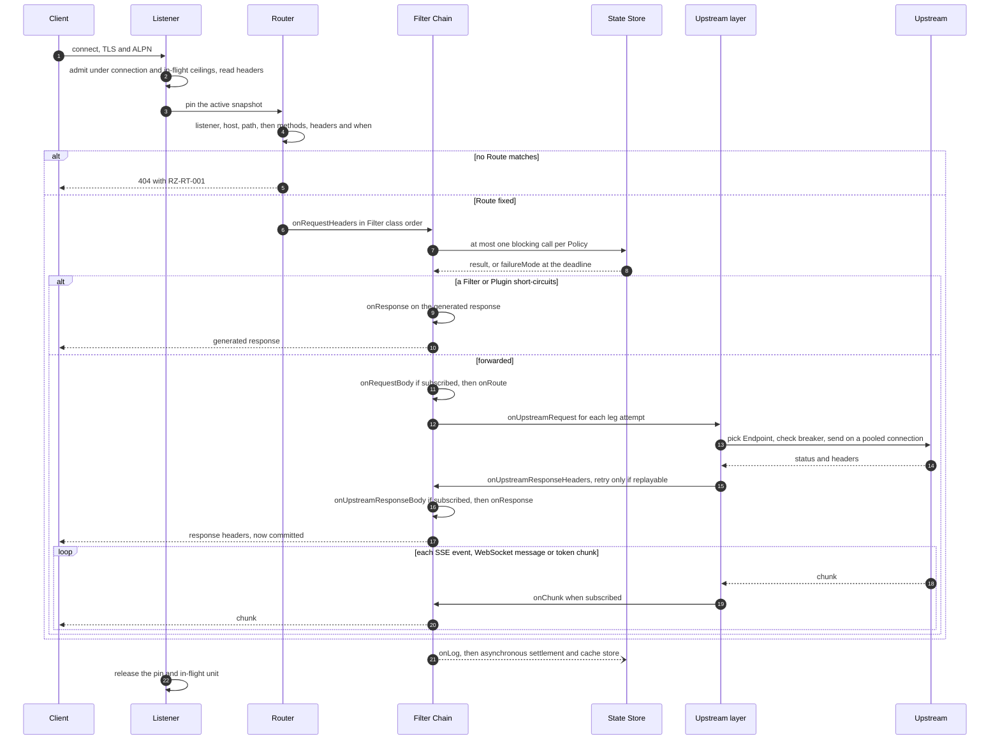
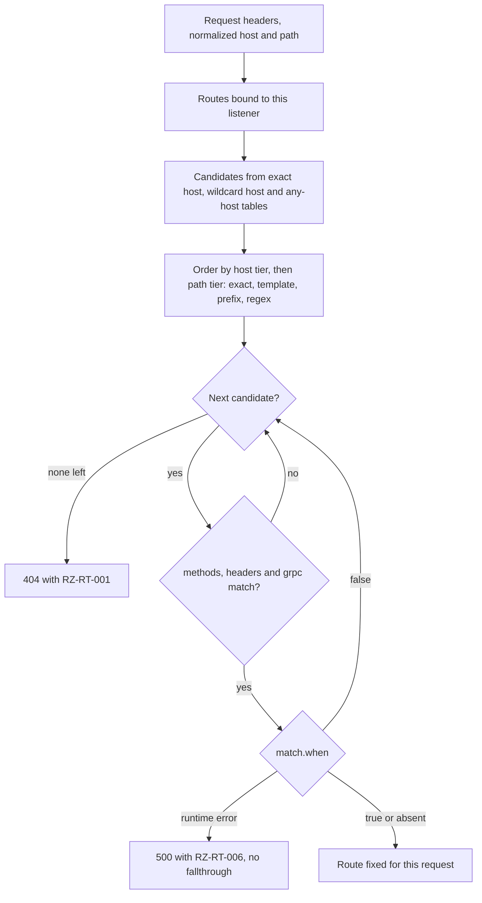
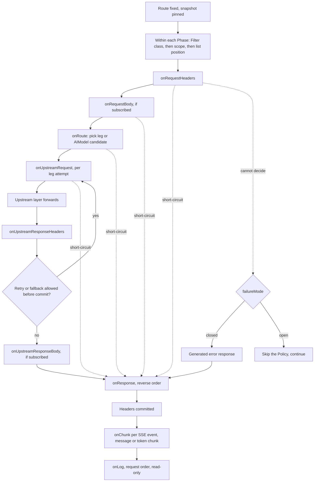
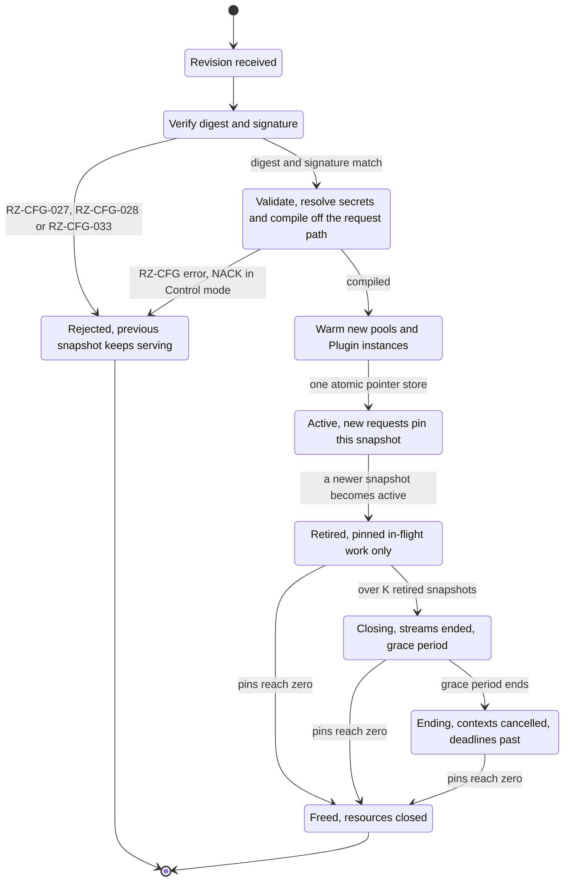

# Data Plane

## Summary

This document specifies Ruralz Gateway (`ruralzd`), the stateless data plane: concurrency bounds, listeners, Route matching, Filter Chain execution through the fixed Phases, Upstream composition and balancing, and configuration snapshot swaps during Hot Reload that drop no in-flight request. It fixes routing precedence, the `transform.request` and `transform.response` `config` schema, the admin API on port 9901, the error format, the `RZ-RT` registry and fail-open or fail-closed behavior per Filter class. Nothing is implemented yet; Ruralz Gateway is Planned (M1).

## Scope and non-goals

In scope: one Node, from socket accept to the last `onLog` call, plus configuration activation on it. "Pack N" cites the binding [foundation pack](../_meta/foundation-pack.md); boundaries come from the [System overview](01-system-overview.md), and kinds and fields from the [Configuration model](02-configuration-model.md), which wins on conflict.

Non-goals, with owners: Policy `config` semantics and retry tuning ([Traffic management and resilience](09-traffic-management-and-resilience.md) and feature documents); Plugin ABI v1 ([WASM plugin system](05-wasm-plugin-system.md)); protocol Phase mappings ([Multi-protocol](07-multi-protocol.md)); AI dialects and Token Budgets ([AI/LLM gateway](06-ai-llm-gateway.md)); the Control Stream ([Control plane and GitOps](04-control-plane-and-gitops.md)); upgrade procedures ([Zero-downtime upgrades and hot reload](../operations/02-zero-downtime-upgrades-and-hot-reload.md)); performance values ([Performance budgets and benchmarking](12-performance-budgets-and-benchmarking.md)).

## Process and concurrency model

A Node is one `ruralzd` process, identified by `node.id` (a ULID; OQ-tech-stack-and-libraries-15), built with `CGO_ENABLED=0` ([ADR-0001](../adr/0001-implementation-language-go.md)) on `net/http` ([ADR-0009](../adr/0009-http-stack-net-http-quic-go.md)). It runs in exactly one configuration mode chosen at boot: a watched Bundle directory, an OCI-pulled Revision or the Control Stream.

### Durable and shared state

Ruralz Gateway keeps no durable local state other than its enrollment identity, its Last-Known-Good configuration and disposable caches (pack 8.11). All shared or durable runtime state (Rate Limits, Quotas, Token Budgets, cache entries, sessions) lives in the State Store, so Nodes join and leave without coordinating.

| State | Location | Lost on restart? |
|---|---|---|
| Enrollment identity | `${RURALZ_DATA_DIR}/identity/` | No |
| Last-Known-Good and candidate | `${RURALZ_DATA_DIR}/lkg/` | No |
| Plugin artifacts | `${RURALZ_DATA_DIR}/cache/oci/sha256/` | Disposable; refetched and verified |
| Snapshots, compiled Plugin code, token buckets, Endpoint health, breakers, pools | Memory | Yes |

This document owns the cache layout. Compiled Plugin code stays in memory only, in one wazero `NewCompilationCache()` and never a cache directory, because no signature covers persisted native code; a restart recompiles verified artifacts ([ADR-0004](../adr/0004-wasm-runtime-wazero.md), [WASM plugin system](05-wasm-plugin-system.md#runtime)). This closes OQ-data-plane-11 with option (c). Pack 8.11 still names compiled modules among disposable caches, a wording left to OQ-wasm-plugin-system-16.

### Goroutines

The goroutine `net/http` or quic-go assigns to each request, HTTP/2 stream or HTTP/3 stream pins the snapshot, matches the Route and runs the Filter Chain synchronously. Every goroutine Ruralz starts recovers panics as cannot decide, a failed step or an ended stream.

| Goroutine | Count | Bound |
|---|---|---|
| Request handler | One per request, HTTP/2 stream or HTTP/3 stream | [Bounded resources](#bounded-resources) |
| Composition step | One per parallel `aggregate` step | `limits.maxCompositionSteps`; one in-flight unit each |
| Stream pump | One per direction of a WebSocket or bidirectional gRPC stream | One in-flight unit each |
| Post-commit writer | Fixed pool | Queue capacity ([Scalability and distributed state](11-scalability-and-distributed-state.md)) |
| Background | Config loader, discovery, health, secret, JWKS, telemetry, admin | Fixed set |

No request waits on another Node or Ruralz Control, and the request path holds no global lock across I/O: the snapshot pointer, pins and counters are atomics; Endpoint sets and the credential index are copy-on-write; local token buckets sit in 256 shards (target), each a short mutex with CLOCK eviction ([ADR-0008](../adr/0008-rate-limiting-local-bucket-and-gcra.md)).

### Plugin host

Plugins run under wazero ([ADR-0004](../adr/0004-wasm-runtime-wazero.md)) with Plugin ABI v1 ([ADR-0005](../adr/0005-plugin-abi-v1.md)). The config loader compiles each digest once, since wazero's cache does not lock during compilation ([source](https://github.com/wazero/wazero/blob/main/cache.go)). `api.Function.Call` is not goroutine-safe, so each call takes its own instance from a bounded, pre-instantiated pool ([source](https://github.com/wazero/wazero/blob/main/api/wasm.go)), or rejects with `RZ-PLG-<NNN>` after at most 1 ms (target). Each instance gets a memory page limit, since the default allows 4 GiB ([source](https://github.com/wazero/wazero/blob/main/config.go)); pool sizing belongs to [WASM plugin system](05-wasm-plugin-system.md).

### Anatomy of a request

*Figure 1: a request through Ruralz Gateway from listener to Upstream and back.*



### Bounded resources

Every queue, buffer, pool, connection and stream has a ceiling, so overload yields a fast `RZ-RT-<NNN>` or `RZ-RL-<NNN>` rejection. `http.Server` fields are set once at start (configurability: OQ-data-plane-1).

| Resource | Ceiling |
|---|---|
| `ReadHeaderTimeout` | 10 s (target) |
| `IdleTimeout` | 120 s (target) |
| Body reads and response writes | 10 s deadlines (target) from admission through `http.ResponseController` ([source](https://pkg.go.dev/net/http#ResponseController)), then the Route `timeout`; server `ReadTimeout` and `WriteTimeout` unset. Expiry resets the HTTP/2 stream or closes the HTTP/1.1 connection, so a blocked handler, even an `RZ-RT-005` one, frees its pin, unit and goroutine |
| Pre-routing responses | `RZ-RT-001`, `RZ-RT-002`, `RZ-RT-005` and `RZ-RT-006` get a 5 s write deadline (target); past 2,000 such writes at once (target), the handler aborts with `http.ErrAbortHandler` without writing |
| Client connections per Node | 20,000 connections (target); a counting `net.Listener` stops calling `Accept` at the ceiling |
| HTTP/2 streams per connection | `HTTP2Config.MaxConcurrentStreams` 250 (target) |
| HTTP/2 unread request data | `HTTP2Config.MaxReceiveBufferPerConnection` 256 KiB and `MaxReceiveBufferPerStream` 64 KiB (target) ([source](https://go.dev/doc/go1.24)) |
| HTTP/2 frame read buffer | `HTTP2Config.MaxReadFrameSize` 16 KiB (target), the protocol minimum; flow control does not cover HEADERS frames ([source](https://raw.githubusercontent.com/golang/go/master/src/net/http/http.go)) |
| Per-connection memory | About 592 KiB before a handler runs (hypothesis): header ceiling, HTTP/2 receive buffer, frame buffer, 16 KiB of serve and frame-reader stacks, 48 KiB of TLS and `bufio` buffers |
| HTTP/3 connections | Each QUIC connection takes 16 of the 20,000 connection slots (target), so at most 1,250 are open; at the ceiling a new QUIC connection is refused before any stream, and its client stays on TCP. Idle QUIC connections close after `IdleTimeout` |
| HTTP/3 streams per connection | 32 incoming bidirectional streams (target); incoming unidirectional streams only for the control and QPACK streams |
| HTTP/3 unread request data | 1 MiB connection receive window (target); QUIC flow control counts every stream byte, HEADERS frames included (RFC 9000) |
| HTTP/3 header reads | quic-go reads a stream's headers before the handler runs ([ADR-0009](../adr/0009-http-stack-net-http-quic-go.md)), so each stream gets a header-read deadline of `ReadHeaderTimeout` from stream open, and expiry resets the stream. Body and write deadlines follow the row above, pending quic-go support (OQ-data-plane-14) |
| HTTP/3 per-connection memory | About 9.25 MiB before a handler runs (hypothesis): 32 streams at the 256 KiB header ceiling, the 1 MiB receive window, and 256 KiB of QUIC, TLS and packet buffers; this equals 16 × 592 KiB |
| Per in-flight unit | Its header block, at most `limits.maxRequestHeaderBytes`, plus 64 KiB of copy buffers (hypothesis) |
| In-flight units per Node | 20,000 (target): one per request, parallel step and stream pump, taken by an atomic add; when full, 503 `RZ-RT-005` at once, never queued |
| Header block | `Server.MaxHeaderBytes` 256 KiB (target) |
| Bodies and buffered bytes | `limits.maxRequestBodyBytes`, `limits.maxResponseBodyBytes`, step `maxBodyBytes`; `limits.maxBufferedBytes` reserved as bytes arrive |
| One streamed chunk | 1 MiB (target), reserved from the stream share while held |
| Plugin memory | Plugin `limits.memoryBytes`, Gateway `limits.maxPluginMemoryBytes` |
| Upstream connections and queue | `circuitBreaker.maxConnections`, `maxPendingRequests` |
| Post-commit writes, `/tap` buffers | Fixed capacity, dropped with a counter |
| Retired snapshots | K = 2 (target), plus at most one closing or ending |

Worst-case Node memory sums connections at 592 KiB (about 11.3 GiB), in-flight units at 320 KiB under the header maximum of OQ-data-plane-1 (about 6.1 GiB), 2,000 pre-routing rejections at 256 KiB (about 0.5 GiB), `maxBufferedBytes`, `maxPluginMemoryBytes` and (K + 2) snapshots: about 19 GiB plus snapshots, fitting a 32 GiB Node (hypothesis) per [Capacity planning](../operations/03-capacity-planning.md), else the connection ceiling is lowered first. A QUIC connection costs at most its 16 slots of 592 KiB (hypothesis), so `http3: true` leaves this sum unchanged.

## Listeners and protocols

Listeners come from `Gateway.spec.listeners` with `protocol` `http` or `https`, a required `port`, `hostnames` and `tls`; Routes bind through `Route.spec.listeners` (default all). Sockets use `SO_REUSEPORT` for Zero-Downtime Upgrades ([ADR-0015](../adr/0015-zero-downtime-upgrades-so-reuseport.md)). A Hot Reload never mutates a running server: a changed listener gets a new socket and server before the swap.

| Protocol | Detection | Implementation | Planned |
|---|---|---|---|
| HTTP/1.1 | Default | `net/http` `Server` | Planned (M1) |
| HTTP/2 over TLS | ALPN `h2` on `https` | `net/http`, `HTTP2Config` | Planned (M1) |
| h2c | Prior knowledge on `http`; no `Upgrade: h2c` | `net/http` `UnencryptedHTTP2` | Planned (M1) |
| HTTP/3 | UDP on the `https` port when `http3: true` | quic-go `http3`, off in FIPS builds | Planned (M3) |
| gRPC, gRPC-Web, Connect | Content-Type | `connectrpc.com/connect` generic handlers | Planned (M3) |
| WebSocket | `Upgrade: websocket` on a matched Route | `coder/websocket` | Planned (M3) |
| SSE | `text/event-stream` response | `http.ResponseController` flushing | Planned (M3) |
| GraphQL | `match.graphql` | `graphql-go-tools` engine | Planned (M3) |
| Kafka, NATS, MQTT ingress | `match.topic` (OQ-configuration-model-11) | `franz-go`, `nats.go`, `paho.golang` | Planned (M4) |

h2c is prior knowledge only ([source](https://go.dev/doc/go1.24)); the `x/net/http2` `Server` is deprecated ([source](https://github.com/golang/go/issues/78064)), so HTTP/2 is configured only through `HTTP2Config`.

A header block above the 256 KiB process ceiling (target) is refused by `net/http` before any handler, with a plain 431. Below it, the handler checks the pinned snapshot's `limits.maxRequestHeaderBytes` and returns 431 `RZ-RT-002` as a problem document; a larger Revision value is capped, as a degraded state.

HTTP/3 uses quic-go, pre-1.0 with `http3` API breaks in v0.63.0, behind an internal interface ([source](https://github.com/quic-go/quic-go/releases/tag/v0.63.0)), with 0-RTT off ([ADR-0009](../adr/0009-http-stack-net-http-quic-go.md)). Its limits are the HTTP/3 rows of [Bounded resources](#bounded-resources); the quic-go settings that enforce them, and its deadline support, are OQ-data-plane-14. Binary upgrades lose in-flight QUIC connections (OQ-system-overview-18), and so does a Hot Reload that replaces an `https` listener with `http3: true`, because the new server holds no state for them (OQ-data-plane-16).

Clients discover HTTP/3 through `Alt-Svc`. With `http3: true`, the `https` listener adds `Alt-Svc: h3=":<port>"; ma=3600` (target), carrying the listener `port`, to every HTTP/1.1 and HTTP/2 response after `onResponse`; without it, clients stay on TCP. HTTPS DNS records are left to operators, and a balancer that maps UDP to another port needs the advertised port changed (OQ-data-plane-15). A FIPS build never advertises HTTP/3. When a Revision turns `http3` off, the header stops at once, and a client holding a cached entry falls back to TCP after a failed QUIC attempt until `ma` expires.

Each `https` listener picks a certificate by SNI from `tls.certificates`; `GetCertificate` reads `secretRef` values from the secret store and other TLS settings from the current snapshot, so reloads and rotations reach new handshakes only.
The Route `timeout` bounds a whole SSE stream or WebSocket, so streaming Routes need a large value. Time-to-first-byte and idle limits are OQ-data-plane-10.

## Router

The Router maps a request to exactly one Route from pre-body data only: listener, host, path, method, headers, gRPC service and method, and CEL `match.when` over `request` (without body), `source` and `now` (pack 4). GraphQL operation matching needs the body (OQ-system-overview-5, Planned (M3)).

### Compiled structure

The config loader compiles one Router per listener into the snapshot:

1. **Host tables.** An exact-host hash map (lowercased, port stripped), a wildcard table of `*.` suffixes by length, and an any-host list. `*.` matches one or more leading labels, never the bare suffix (OQ-data-plane-2).
2. **Path index per host entry.** A segment trie for `exact` and `template`, `prefix` on segment boundaries, and `regex` last, with the standard `regexp` package.
3. **Candidate filters.** `methods`, `headers`, `grpc` (exact `/service/method`, or a `/service/` prefix without `method`) and the compiled `when` ([ADR-0011](../adr/0011-expressions-and-authorization-engines.md)).

Paths are normalized first: unreserved percent-escapes decoded, dot segments removed (RFC 3986), and an encoded slash never splits a segment. Hosts are case-insensitive, paths case-sensitive, and a trailing slash is significant for `exact` and `template`.

### Precedence

Two Routes with identical match criteria are rejected at validation (RZ-CFG-023). Other overlaps resolve by this total order, highest first:

| Rank | Criterion | Order within the criterion |
|---|---|---|
| 1 | Host tier | Exact host, then wildcard host with the longer suffix first, then no `hosts` |
| 2 | Path tier | `exact`, then `template`, then `prefix`, then `regex`, then no `path` |
| 3 | Within `template` | Segment by segment from the left; a literal beats a `{param}` |
| 4 | Within `prefix` | Longer prefix first |
| 5 | Constraint count | More of `methods`, `headers`, `grpc`, `when` set first |
| 6 | Tie-break | `metadata.name` in byte order |

Regex specificity is undecidable, so `regex` paths are ordered only by ranks 5 and 6. The Router picks the first candidate whose remaining criteria match, falling through on a `methods` mismatch; none left gives 404 `RZ-RT-001`. A `match.when` runtime error returns 500 `RZ-RT-006` without fallthrough, so an erroring guard cannot divert traffic to a less protected Route. The span is `ruralz.route.match`.

*Figure 2: Route selection from a request's headers.*



### Worked example: routing precedence

Six Routes share the `https` listener:

| Route | `hosts` | `path` | `methods` |
|---|---|---|---|
| `orders-export` | `api.shop.example` | `exact: /v1/orders/export` | GET |
| `orders-get` | `api.shop.example` | `template: /v1/orders/{orderId}` | GET |
| `orders-summary` | `api.shop.example` | `template: /v1/orders/{orderId}/summary` | GET |
| `orders-any` | `api.shop.example` | `prefix: /v1/orders` | Any |
| `tenant-wild` | `*.shop.example` | `prefix: /v1` | Any |
| `fallback` | Any host | `prefix: /` | Any |

| Request | Winner | Why |
|---|---|---|
| `GET api.shop.example/v1/orders/export` | `orders-export` | Exact beats template (`orderId=export`) |
| `POST api.shop.example/v1/orders/export` | `orders-any` | Both GET Routes fail `methods` |
| `GET api.shop.example/v1/orders/42` | `orders-get` | Template beats prefix |
| `GET api.shop.example/v1/orders/42/summary` | `orders-summary` | Only the four-segment template matches |
| `GET eu.shop.example/v1/orders/42` | `tenant-wild` | The wildcard host matches |
| `GET shop.example/v1/orders` | `fallback` | `*.shop.example` never matches the bare suffix |

## Filter Chain execution

A Filter is a built-in Go implementation and a Plugin a sandboxed WASM one; a Policy configures either. Each Route's effective Filter Chain is resolved at validation by pack 8.12 ([Attachment and precedence](02-configuration-model.md#attachment-and-precedence)) into one ordered array per Phase, plus one per Upstream leg. A Phase with no subscriber costs one nil check.

### Phases

The fixed Phases run in this order: `onRequestHeaders → onRequestBody → onRoute → onUpstreamRequest → onUpstreamResponseHeaders → onUpstreamResponseBody → onResponse → onLog`, plus the streaming hook `onChunk`.

| Phase | Runs | May short-circuit? |
|---|---|---|
| `onRequestHeaders` | Once, after the Route is fixed | Yes |
| `onRequestBody` | Once, if subscribed, within the gate caps | Yes |
| `onRoute` | Once; picks an Upstream leg or `AIModel` candidate | Yes |
| `onUpstreamRequest` | Per leg attempt, including retries and steps | Yes; ends that leg |
| `onUpstreamResponseHeaders` | Per leg attempt | No; may request a retry or Provider Fallback before commit |
| `onUpstreamResponseBody` | Per leg, if subscribed | No |
| `onResponse` | Once, before headers reach the client | No; last status change |
| `onLog` | Always, after the response; read-only | No; failures reach telemetry only |
| `onChunk` | Per chunk, if subscribed | No; may end the stream |

### Ordering

Within a Phase, Policies run by Filter class (cors, auth, authz, admission, validation, cache, upstream-auth, transform, custom), then scope (Gateway, Route, Upstream), then position in `spec.policies` (pack 8.12). Response Phases run in reverse; `onLog` keeps request order. A Policy's `when` is evaluated once, before its first Phase.

### Short-circuit

Any Filter or Plugin in a request Phase (`onRequestHeaders` through `onUpstreamRequest`) MAY produce a response; execution skips to `onResponse` and `onLog`. `onResponse` runs the full response chain on generated responses, so CORS and security headers reach a 401, except `transform.response`, `cache` and `ai.semantic-cache`. In `onUpstreamRequest` a short-circuit ends only that leg, refining pack 4 for multi-leg Routes: a composition step records the generated response as its result, and a non-2xx result fails a non-optional step ([Failures and partial responses](#failures-and-partial-responses)).

*Figure 3: Filter Chain execution with ordering, short-circuit and failureMode.*



### Streaming

Bodies stream unless the gate and tee rules of [Body buffering and limits](02-configuration-model.md#body-buffering-and-limits) require reading them whole. A declared `Content-Length` above `limits.maxRequestBodyBytes` gets 413 `RZ-RT-003` at once; otherwise `limits.maxBufferedBytes` is reserved in 32 KiB increments as bytes arrive (target), and for decoded values when built. A failed reservation fails a gate with 503 `RZ-RT-004`, or a step under its `optional` rule. Gates cannot take the stream share, 25% of `limits.maxBufferedBytes` (target), so gate traffic never ends a stream.

`onChunk` is the streaming hook for three sources, each Planned (M3):

- **SSE.** One chunk per event, Upstream to client, flushed through `http.ResponseController`.
- **WebSocket.** One chunk per reassembled message: client messages run the chain in request order, Upstream messages in response order.
- **LLM token streams.** One chunk per provider event after dialect normalization ([AI/LLM gateway](06-ai-llm-gateway.md)). The Token Budget guard counts output tokens locally and ends the stream past the output cap ([ADR-0014](../adr/0014-ai-api-surface.md), pack 8.9).

A subscribed stream reserves 32 KiB (target) from the stream share before commit, else fails with 503 `RZ-RT-004`; the default 128 MiB share admits about 4,000 (hypothesis). Each chunk is processed on its stream's goroutine and forwarded before the next is read, so a slow reader applies flow control. A larger chunk grows the reservation toward the 1 MiB cap (target), from the stream share, then free general budget; if neither covers it, the stream pauses reading until bytes free up, within the Route `timeout`. A chunk over the cap ends the stream under any `failureMode` (SSE `error` event, WebSocket close 1009, HTTP/2 `RST_STREAM`) with `RZ-RT-013` (cap field: OQ-data-plane-5). Unsubscribed streams copy through one 32 KiB buffer per direction (target); `onChunk` never calls the State Store (pack 8.7).

### Error handling

A Filter returns continue, respond, or cannot decide (a failed or timed-out State Store call or remote dependency, a Plugin trap or limit, or a runtime error in a Policy `config` CEL field), and `failureMode` then applies ([Failure semantics](#failure-semantics)). Other CEL fields follow the Configuration model's [CEL table](02-configuration-model.md#allowed-places). Each failure increments `ruralz_filter_failures_total` (name proposed to [Observability](10-observability.md)) and marks the span `ruralz.filter.<name>`.

### Transform Policies

`transform.request` and `transform.response`, both Planned (M1), rewrite bodies, headers and the query string with CEL and regular expressions instead of a template language. This section authors their `config` schema (pack 3) and submits it, with a CEL row per expression field, to the [Configuration model](02-configuration-model.md#policy) for registration. Both types are gates ([Body buffering and limits](02-configuration-model.md#body-buffering-and-limits)).

| Field | Contents | `transform.request` | `transform.response` |
|---|---|---|---|
| `body` | CEL; a map or list is written as JSON, a string as its bytes | Builds the forwarded request body | Builds the response body |
| `contentType` | String; default `application/json` | Sets `Content-Type` when `body` is set; required for a string result, such as `text/xml` for a SOAP envelope | Same |
| `set[]` | `target`, `name`, `valueExpression` (CEL) | `target` is `header`, `query` or `body`; copies body fields into headers or the query string | `target` is `header` or `body` |
| `remove[]` | `target`, `name` | Drops a header, query parameter or body path | Drops a header or body path |
| `arrayOps[]` | `op` (`move`, `append` or `delete`), `from`, `to` | Array operations on body paths | Same; the Flatmap row |
| `replace[]` | `path`, `pattern`, `replacement`, `literal` | Replaces matches in the string at `path`, or in the raw body when `path` is absent | Same |

A body `name`, `path`, `from` or `to` is a dot path into the JSON body: a numeric segment indexes an array, and `*` matches every element, so `move` from `items.*.sku` to `skus` flattens each item's `sku` into one array. `set[]` creates missing objects; `remove[]`, `move` and `delete` on a missing path do nothing. `pattern` is RE2 syntax, compiled at validation by the standard `regexp` package, which has no backreferences and matches in time linear in the input; `replacement` refers to groups as `$1`; the `${1}` form needs the `$${1}` escape of [Environment substitution](02-configuration-model.md#environment-substitution). With `literal: true`, `pattern` and `replacement` are plain strings.

A Policy applies `body`, then `arrayOps[]`, `set[]`, `remove[]` and `replace[]`, each list in order. Every CEL field reads the body as it reached the Policy, so no entry reads another's output, and a later Policy in the chain sees the rewritten body.

| Type and scope | Phase | CEL variables | Output cap |
|---|---|---|---|
| `transform.request` at Gateway or Route | `onRequestBody`, once | Base, with `request.body` | `limits.maxRequestBodyBytes` |
| `transform.request` at Upstream | `onUpstreamRequest`, per leg attempt, from the same buffered input each time | Base, with `request.body`; `upstream` | `limits.maxRequestBodyBytes` |
| `transform.response` at Gateway or Route | `onResponse`, after any composition merge | Base; `response`, with `body` | `limits.maxResponseBodyBytes` |
| `transform.response` at Upstream | `onUpstreamResponseBody`, per leg | Base; `response`, with `body`; `upstream` | Step `maxBodyBytes`, else `limits.maxResponseBodyBytes` |

*Base* is the Configuration model's set ([Variables](02-configuration-model.md#variables)). `request.body` and `response.body` are JSON as `dyn`; a body whose `Content-Type` is not `application/json` or a `+json` type is null, so only `replace[]` without `path`, header and query operations and a `body` that ignores it apply. Reading an XML response is OQ-data-plane-17.

Limits: each CEL field has the Configuration model's [cost bounds](02-configuration-model.md#limits), 10,000 units at validation (RZ-CFG-015) and 1,000,000 at runtime (target). A `pattern` over 1 KiB (target) or invalid is RZ-CFG-005, and a Policy holds at most 32 entries across its four lists (target). The rewritten body is reserved from `limits.maxBufferedBytes` like a decoded value; the Node recomputes `Content-Length` and drops `Content-Encoding`, since limits count decoded bytes. Transform Policies never call the State Store.

A CEL runtime error, a JSON operation on a null body, a path through a non-object or an output over its cap is cannot decide: under `closed`, 503 `RZ-RT-011` in a request Phase or 502 `RZ-RT-012` in a response Phase; under `open`, the Policy is skipped and the body passes unchanged. A spent buffer budget stays 503 `RZ-RT-004`.

The schema carries these [KrakenD EE parity](../comparison/01-krakend-ee-parity-matrix.md) rows: request body extractor (`set[]`), request and response Go-template manipulation (`body`), response query language (`body` or `set[]` over `response.body`), regular expression replacements (`replace[]`), Flatmap (`arrayOps[]`), prompt templates on a Route to an `ai` Upstream, Planned (M3), and SOAP request envelopes, Planned (M5).

```yaml
apiVersion: ruralz/v1alpha1
kind: Policy
metadata:
  name: orders-shape
spec:
  type: transform.response
  config:
    arrayOps:
      - op: move
        from: items.*.sku
        to: skus
    set:
      - target: header
        name: x-order-total
        valueExpression: 'string(response.body.total)'
    remove:
      - target: body
        name: internal
    replace:
      - path: customer.email
        pattern: '^[^@]+'
        replacement: '***'
```

## Composition engine

A Route with `composition` instead of `upstreams` calls several Upstreams for one request. One step executor runs every mode; each step is an upstream leg with its own Upstream-scoped Policies, retries and breaker, under the Route `timeout`. A Route has at most `limits.maxCompositionSteps` steps (proposed default 16, target); the Node takes one in-flight unit per parallel step before the first.

| Mode | Execution | Response |
|---|---|---|
| `aggregate` (aggregation) | All steps in parallel, one goroutine each | Bodies merged into one JSON object |
| `sequential` | Steps in list order; later steps read earlier results through the CEL variable `steps`; a step whose `when` is false is skipped | The last executed step's response, streamed unless that step sets `target`, `select`, `rename` or `group` |
| `conditional` | The first step whose `when` is true runs; none true returns 404 with `RZ-RT-010` | That step's response, streamed unless transformed |

### Merge rules

Merging applies to `aggregate` steps and to any step that sets `target`, `select`, `rename` or `group`. Such a body passes `target` (unwrap a nested object), `collection: true` (accept a JSON array), `select` (allowlist fields) and `rename`, then merges under `group` or at the top level; when two steps write one key, the later in list order wins. Merged responses are `application/json` with status 200; a non-JSON body that must merge fails the step. Dot-path removals, such as a KrakenD `deny` list, and flatmap array operations belong to a Route-scoped `transform.response`, which runs on the merged body ([Transform Policies](#transform-policies)).

### Failures and partial responses

A step fails on an Upstream error or non-2xx result, a timeout, a CEL runtime error or a body over its `maxBodyBytes`. A failed non-optional step cancels its siblings through their shared context and fails the request: 502 with the `RZ-UP-<NNN>` code of an Upstream cause or `RZ-RT-015` for a CEL error or oversized body, or 503 `RZ-RT-004` when the buffer budget is spent. A failed `optional: true` step is left out, and the response carries `ruralz-partial: true`.

### Workflow composition

The executor models every mode as a step graph, so a workflow (a dependency graph of parallel and sequential stages) needs only declared edges, which the Configuration model lacks (OQ-data-plane-3); meanwhile linear workflows use `sequential` with per-step `when`, Planned (M1).

## Upstream layer

The Upstream layer forwards with its own loop on `http.Transport`, not `httputil.ReverseProxy`, because retries, per-attempt Phases and `onChunk` need per-attempt control.

Endpoints come from `endpoints` or `discovery` (`dns` Planned (M1); `kubernetes` EndpointSlices Planned (M2), client: OQ-tech-stack-and-libraries-23), swapped copy-on-write beside the snapshot, never a new Revision; a failing source keeps the last set and reports a degraded state. `loadBalancing.algorithm` selects `round-robin` (weighted), `least-request` (two random choices), `random` or `ring-hash` over the CEL `hashKey`; `healthCheck.active` probes with jitter and `healthCheck.passive` ejects for `ejectionTime`. When every Endpoint is unhealthy, the Node balances across all and reports a degraded state (threshold: OQ-data-plane-7).

Three deadlines nest: the Route `timeout` bounds the request, the Upstream `timeout` one leg including retries, and `retries.perTryTimeout` one attempt. `retryOn` decides after each attempt under the replay rule: a leg is retried or falls back only if its request body is empty or buffered and no response byte is committed. An open breaker (`consecutiveFailures`, `openDuration`, `failureWhen`) or a full `maxPendingRequests` queue fails the attempt at once with an `RZ-UP-<NNN>` code; each attempt emits `ruralz.upstream.<name>`.

Connection pools are keyed by protocol, TLS settings and Endpoint and carried across Hot Reloads when the key is unchanged; `HTTP2Config.StrictMaxConcurrentRequests` is false ([source](https://go.dev/doc/go1.26)), so an HTTP/2 Upstream's stream limit opens another connection, within `circuitBreaker.maxConnections` ([ADR-0009](../adr/0009-http-stack-net-http-quic-go.md)). `grpc`, `websocket`, `graphql` and `ai` Upstreams are Planned (M3); `kafka`, `nats` and `mqtt` Planned (M4).

## Configuration snapshots and hot reload

A snapshot is the compiled, immutable form of one Revision: Routers, Filter Chains, CEL programs, Plugin pool handles, Upstream settings, literal Consumer API key hashes and TLS settings. Beside it live resolved secrets, Endpoint sets and an index of `secretRef`-held key hashes, each replaced copy-on-write, so rotation never mutates a snapshot. New requests see only the active snapshot, published through one `atomic.Pointer`.

### Activation

The config loader activates a Revision off the request path, in the order of [Compile before swap](01-system-overview.md#compile-before-swap):

1. Verify the full `sha256` digest (RZ-CFG-027; RZ-CFG-028 for a Plugin artifact) and the signature ([ADR-0017](../adr/0017-artifact-signing.md); RZ-CFG-033); a watched directory is unsigned (pack 8.14), and trust policy `off` is a degraded state.
2. Validate, resolve every `secretRef` (RZ-CFG-026), build Routers and chains, compile CEL and Plugins by digest.
3. Carry over unchanged pools, Plugin instances and token buckets by identity and hash; warm only new ones.
4. Publish the snapshot with one atomic pointer store: the Hot Reload.
5. ACK over the Control Stream in Control mode ([ADR-0007](../adr/0007-control-stream-protocol.md)); the ACK means active, not durable.
6. Write the Revision and its canonical source to `${RURALZ_DATA_DIR}/lkg/` as a candidate.
7. Retire the previous snapshot.

A failure before step 4 NACKs in Control mode, logs in file mode, and leaves the running snapshot untouched. Building Routers and chains for 10,000 Routes takes 2 s or less on one core, excluding cold Plugin compilation (target).

### Why no in-flight request is dropped

In-flight requests complete on the snapshot they started on; retirement ends only a request that outlives K + 1 further activations and then a full grace period. A **stream** is an upgraded WebSocket, a bidirectional gRPC call, an SSE response or a response with `onChunk` subscribed; anything else is a **request**, bounded by its Route `timeout`.

1. **One pin per request.** The request goroutine pins the snapshot before routing and keeps it until `onLog`. Pins are cache-line-padded counter stripes: a goroutine loads the pointer, increments its stripe and re-loads the pointer, undoing and retrying if it changed. The retirer swaps the pointer, then waits for the stripes to sum to zero, so no request runs on a freed snapshot.
2. **Close only resources.** The garbage collector reclaims snapshot memory; at zero pins the retirer closes only pools and Plugin instances no newer snapshot shares.
3. **Listeners stay bound.** An added listener opens before the swap; a removed one stops accepting after it while its connections finish.
4. **Bounded retirement.** At most K = 2 retired snapshots are kept (target). When a third would be retired, the oldest becomes closing: its streams end at once (WebSocket close 1001, gRPC trailers with `grpc-status` `UNAVAILABLE`, an SSE end event with a retry hint). After a grace period of 30 s (target) it becomes ending, and anything still pinned ends with `RZ-RT-014`, counted by `ruralz_snapshot_retirement_ended_total` (name proposed to [Observability](10-observability.md)).
5. **Ending protocol.** At pin time each request registers a callback on its pin stripe's retirement context, run on its own goroutine because a handler blocked in I/O cannot reach a panic. At grace end the retirer cancels those contexts; each callback:
   1. Cancels the request's root context, aborting Upstream and State Store I/O.
   2. Under a per-request mutex the handler also takes, sets past read and write deadlines through `http.ResponseController` (before commit, a write deadline 5 s ahead (target) so the handler can write 503 `RZ-RT-014`), resetting the HTTP/2 stream or closing the HTTP/1.1 connection; a hijacked WebSocket is closed directly.
   3. Leaves guest calls to the Plugin `limits.timeout`, enforced by [WASM plugin system](05-wasm-plugin-system.md), since wazero stops a running guest only with `WithCloseOnContextDone`, reported 10 to 20x slower on loop-heavy guests ([source](https://github.com/wazero/wazero/issues/2466)).

   Zero pins are expected within 5 s plus the largest Plugin `limits.timeout` plus 1 s (target); a snapshot pinned longer stays ending as a degraded state, never freed early.
6. **Grace never cut short.** At most one snapshot is closing or ending. The loader keeps only the latest pending Revision and activates it once that snapshot is freed, so a burst of activations delays the last by at most the grace period, the ending bound and compile time (target) (OQ-data-plane-13).

GOAWAY is not used for retirement, since it is connection-wide and lets streams finish (OQ-data-plane-12). Resources close, and a pending Revision compiles, only at zero pins, so no live goroutine reaches a freed snapshot and peak configuration memory is (K + 2) times the snapshot size (hypothesis).

*Figure 4: a configuration snapshot through a Hot Reload.*



### Sources, Last-Known-Good and Drain

In file mode the loader acts on an atomic directory replacement or after a settle debounce, or pulls an OCI Revision by digest (Planned (M2)), and promotes the candidate to Last-Known-Good on activation; in Control mode it promotes when the active digest equals the Cluster's promoted digest. Boot order follows pack 8.2 and System overview's [Last-Known-Good](01-system-overview.md#last-known-good), with a Control-mode boot wait of up to 5 s (target).

A Drain, on SIGTERM, which `ruralz node drain` sends to a local Node (OQ-data-plane-4, option (b)), fails `/readyz`, stops accepting, sends HTTP/2 GOAWAY on every connection and lets in-flight requests finish within a bounded time. A Zero-Downtime Upgrade Drains the old process once a new one on the same ports is ready ([ADR-0015](../adr/0015-zero-downtime-upgrades-so-reuseport.md)). Both are Planned (M1).

## Admin endpoints

The admin listener binds `Gateway.spec.admin.port`, default 9901, on its own `net/http` server. [CLI and API surface](../reference/01-cli-and-api-surface.md) MUST match this table. Bind address and authentication are OQ-system-overview-6; only `/healthz` and `/readyz` MAY be unauthenticated (pack 8.4).

| Path on 9901 | Method | Returns | Authentication | Used by | Planned |
|---|---|---|---|---|---|
| `/healthz` | GET | 200 while the process responds | MAY be open | Liveness probes | Planned (M1) |
| `/readyz` | GET | 200 only with an active validated Revision, every `secretRef` resolved, listeners bound and no Drain; else 503 with JSON reasons; never fails for a lost Control Stream | MAY be open | Readiness probes | Planned (M1) |
| `/metrics` | GET | `ruralz_<component>_<name>_<unit>` metrics (exporter: OQ-tech-stack-and-libraries-16) | Token or mTLS | Scrapers | Planned (M1) |
| `/debug/*`: `/debug/pprof/` | GET | Go runtime profiles, including the goroutine leak profile, GA in Go 1.27 ([source](https://go.dev/doc/go1.27)) | Token or mTLS | Profiling | Planned (M1) |
| `/debug/snapshots` | GET | Active, retired, closing and ending snapshots with digests and pin counts | Token or mTLS | Hot Reload debugging | Planned (M1) |
| `/debug/upstreams` | GET | Endpoint sets, health, ejections and breaker states | Token or mTLS | Incident response | Planned (M1) |
| `/config/dump` | GET | The active Revision in `ruralz.canonical.v1` form with its full digest and the Last-Known-Good digest; `secretRef` shown, secrets omitted | Token or mTLS | `ruralz node dump`, `ruralz bundle diff`, Drift detection | Planned (M1) |
| `/tap` | GET, streaming | Sampled request and response metadata, credentials redacted | Token or mTLS | `ruralz dev tap` | Planned (M1) |

`/debug/*` names every path under `/debug/`; a new one MUST be added here. Admin endpoints never change configuration, so a leaked admin token cannot alter routing.

## Failure semantics

`failureMode` applies when a Filter or Plugin cannot decide (pack 8.10), except for CEL fields with their own rule ([Error handling](#error-handling)). Security types are closed only (RZ-CFG-029). Codes are `RZ-<AREA>-<NNN>` from the area's registry (pack 8.6):

| Filter class | Policy types | Default; allowed | Request Phase, `closed` | Request Phase, `open` | Response Phase before commit |
|---|---|---|---|---|---|
| cors | `cors` | closed; either | 503 `RZ-RT-011` | Skip; no CORS headers | `closed`: 502 `RZ-RT-012`; `open`: skip |
| auth | `auth.jwt`, `auth.api-key`, `auth.basic`, `auth.mtls`; `plugin` with `filterClass: auth` | closed; closed only | 401 `RZ-AUTH-<NNN>`, or `RZ-PLG-<NNN>` on a Plugin trap | Not allowed | Not applicable |
| authz | `authz.*`; `plugin` with `filterClass: authz` | closed; closed only | 403 `RZ-AUTH-<NNN>`, or `RZ-PLG-<NNN>` on a Plugin trap | Not allowed | Not applicable |
| admission | `ratelimit`, `quota`, `ai.token-budget` | open, but closed for `ai.token-budget`; either | 503 `RZ-STS-<NNN>`; `RZ-RL-<NNN>` or `RZ-AI-<NNN>` on a CEL error | Admit unchecked | Not applicable |
| validation | `validation.json-schema`, `ai.guardrail` | closed; either | 503 `RZ-RT-011` or `RZ-AI-<NNN>` | Skip the check | `ai.guardrail`: 502 `RZ-AI-<NNN>` or skip |
| cache | `cache`, `ai.semantic-cache` | open; either | 503 `RZ-STS-<NNN>`, or `RZ-AI-<NNN>` for a failed embedding call (pack 8.7); a `config.key` error always bypasses | Bypass the cache | Store skipped |
| upstream-auth | `auth.upstream-oauth2`, `auth.upstream-sigv4` | closed; closed only | 401 `RZ-AUTH-<NNN>` (pack 8.10; 503 proposed in OQ-data-plane-8) | Not allowed | Not applicable |
| transform | `headers`, `transform.request`, `transform.response` | closed; either | 503 `RZ-RT-011` | Skip | `closed`: 502 `RZ-RT-012`; `open`: skip |
| custom | `plugin` with `filterClass: custom` (the default) | closed; either | 503 `RZ-PLG-<NNN>` | Skip | `closed`: 502 `RZ-PLG-<NNN>`; `open`: skip |

A `plugin` Policy with another `filterClass` takes that class's position and row, with `RZ-PLG-<NNN>` on a trap or limit (pack 8.6); its `failureMode` defaults to `closed`, and `open` is allowed except for auth and authz (pack 10). After commit, an `onChunk` failure ends the stream under `closed` (SSE `error` event, WebSocket close 1011, HTTP/2 `RST_STREAM`) and passes the chunk under `open`. A decision never uses `RZ-STS-<NNN>`. Dependency failures follow System overview's [boundary table](01-system-overview.md#failure-semantics-at-component-boundaries), each a degraded-state metric (P10); a failed Last-Known-Good write is retried while the Node serves.

### Error response format

This document owns the error response format (pack 8.6): an RFC 9457 problem document (`application/problem+json`) with extension members `code` and `requestId`, the request's OpenTelemetry trace ID ([ADR-0010](../adr/0010-telemetry-opentelemetry-first.md)).

```json
{"title": "No matching Route", "status": 404, "code": "RZ-RT-001", "requestId": "4bf92f3577b34da6a3ce929d0e0e4736"}
```

gRPC requests get the matching `grpc-status` and upgraded WebSockets a close code, as [Multi-protocol](07-multi-protocol.md) maps them. The body never echoes request content.

### RZ-RT registry

Codes 011 to 015 go beyond pack 8.6's "before any Upstream" meaning of `RT`; that amendment is OQ-data-plane-9.

| Code | Status | Meaning |
|---|---|---|
| RZ-RT-001 | 404 | No Route matched on this listener |
| RZ-RT-002 | 431 | Request headers exceed `limits.maxRequestHeaderBytes` |
| RZ-RT-003 | 413 | Request body exceeds `limits.maxRequestBodyBytes` |
| RZ-RT-004 | 503 | The buffer budget cannot cover a gate, step body or stream reservation |
| RZ-RT-005 | 503 | The Node in-flight ceiling is full |
| RZ-RT-006 | 500 | `match.when` runtime error; no fallthrough |
| RZ-RT-007 | 504 | Route `timeout` expired before any Upstream attempt |
| RZ-RT-008 | 403 | Rejected by a `cors` Policy |
| RZ-RT-009 | 400 | Rejected by a `validation.json-schema` Policy |
| RZ-RT-010 | 404 | `conditional` composition: no step's `when` is true |
| RZ-RT-011 | 503 | A `cors`, `validation.json-schema`, `headers` or `transform.*` Policy could not decide under `closed` |
| RZ-RT-012 | 502 | A response-Phase Policy failed under `closed` |
| RZ-RT-013 | None; stream ended | A streamed chunk exceeded its cap |
| RZ-RT-014 | 503 before commit; stream ended after | The pinned snapshot's grace period ended |
| RZ-RT-015 | 502 | A composition step failed on a CEL runtime error or a body over `maxBodyBytes` |

## Performance budgets

Latency, allocation, throughput and memory budgets live in [Performance budgets and benchmarking](12-performance-budgets-and-benchmarking.md), which wins on conflict; this section restates none. Its suite also verifies this document's constants: Bounded resources ceilings, K and the grace period.

## Open questions

| ID | Question | Options | Owner | Blocking? |
|---|---|---|---|---|
| OQ-data-plane-1 | Should the Bounded resources defaults be configurable, and should `limits.maxRequestHeaderBytes` have a 256 KiB schema maximum (target)? | (a) Fixed defaults and that maximum (current); (b) fields under `Gateway.spec.listeners[]`; (c) `RURALZ_*` settings | configuration-model | No |
| OQ-data-plane-2 | How is the wildcard host `*.` registered for `Route.spec.match.hosts`? | (a) Schema pattern with one leading `*.` label; (b) a `wildcardHosts` field; (c) exact hosts only | configuration-model | Yes, for Router (M1) |
| OQ-data-plane-3 | How are workflow compositions declared? | (a) `sequential` with per-step `when` (current); (b) a `workflow` mode with dependencies; (c) nested composition by Route reference | data-plane | No |
| OQ-data-plane-5 | What caps one chunk (SSE event, WebSocket message, LLM event)? | (a) The fixed default in Bounded resources (current); (b) a Gateway `limits` field; (c) WebSocket frames without reassembly | multi-protocol | No |
| OQ-data-plane-6 | How does a Node shed load (`RZ-RT-005`)? | (a) The fixed in-flight ceiling (current); (b) a Gateway `limits` field; (c) an adaptive concurrency limiter | data-plane | No |
| OQ-data-plane-7 | Does health panic mode need a threshold? | (a) All-or-nothing (current); (b) a panic percentage field; (c) fail with an `RZ-UP-<NNN>` code | traffic-management-and-resilience | No |
| OQ-data-plane-8 | Should pack 8.10 let a failed `upstream-auth` Policy, not caused by the client, return a status other than 401? | (a) 401 per pack 8.10 (current); (b) amend to 503; (c) amend to 502 | security-and-identity | Yes, pack 8.10 amendment (pack 14); escalation if disputed |
| OQ-data-plane-9 | Which area covers Node-generated failures outside "before any Upstream" (RZ-RT-011 to RZ-RT-015)? | (a) Amend pack 8.6 `RT` to "request and response handling on a Node outside Upstream legs" (current); (b) a new area; (c) `UP` | data-plane | Yes, pack 8.6 amendment (M1) |
| OQ-data-plane-10 | Should streams get time-to-first-byte and idle limits besides the Route `timeout`? | (a) No (current); (b) new stream fields; (c) a fixed idle default | traffic-management-and-resilience | No |
| OQ-data-plane-12 | Should System overview Compile before swap use per-stream closes instead of HTTP/2 GOAWAY for snapshot retirement? | (a) Per-stream close: gRPC trailers `UNAVAILABLE`, `RST_STREAM` (current); (b) GOAWAY as written | system-overview | No |
| OQ-data-plane-13 | Should System overview's "activation never waits" be amended so a grace period is never cut short? | (a) The latest pending Revision waits up to 30 s plus the ending bound and compile time (target) (current); (b) never wait, ending the closing snapshot's pins at once | system-overview | No |
| OQ-data-plane-14 | Which quic-go settings enforce the HTTP/3 Bounded resources rows (stream caps, receive window, header ceiling, idle timeout, connection refusal at the ceiling), and does quic-go `http3` support `http.ResponseController` read and write deadlines and a per-stream header-read deadline? | (a) quic-go settings and deadlines, verified by the HTTP/3 conformance cases (current); (b) an internal per-stream timer that resets streams where deadlines are missing; (c) `http3: true` refused until both are verified | data-plane | Yes, for HTTP/3 (M3) |
| OQ-data-plane-15 | How do clients discover HTTP/3? | (a) `Alt-Svc` on `https` responses with the listener port (current); (b) an advertised port or `ma` field on the listener; (c) HTTPS DNS records only, published by operators | data-plane | Yes, for HTTP/3 (M3) |
| OQ-data-plane-16 | Should a Hot Reload that replaces an `http3` listener keep its QUIC connections? | (a) No; they are lost and clients reconnect (current); (b) keep the UDP socket and QUIC transport when only non-socket settings change; (c) connection-ID steering to the new server | data-plane | No |
| OQ-data-plane-17 | How does `transform.response` read an XML response body for SOAP integration (the XML sub-question of OQ-krakend-ee-parity-matrix-1)? | (a) A `plugin` Policy for XML responses (current); (b) an XML decoder exposing XML bodies to CEL as `dyn`, a Configuration model change | data-plane | Yes, for the SOAP integration row (M5) |

Closed:

- OQ-data-plane-11 with option (c), compiled Plugin code in memory only ([ADR-0004](../adr/0004-wasm-runtime-wazero.md)).
- OQ-data-plane-4 with option (b), local SIGTERM only, decided by [CLI and API surface](../reference/01-cli-and-api-surface.md): `ruralz node drain` signals the local Node.
- OQ-krakend-ee-parity-matrix-1 with option (a), decided here: [Transform Policies](#transform-policies) is one CEL-based schema covering body extraction to headers, CEL-built bodies, CEL queries, regular expression replacement, flatmap array operations and XML request building; only its XML response sub-question stays open, as OQ-data-plane-17.
