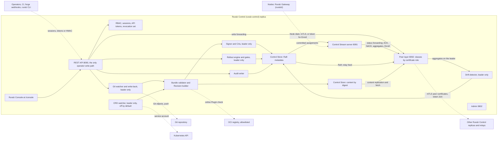
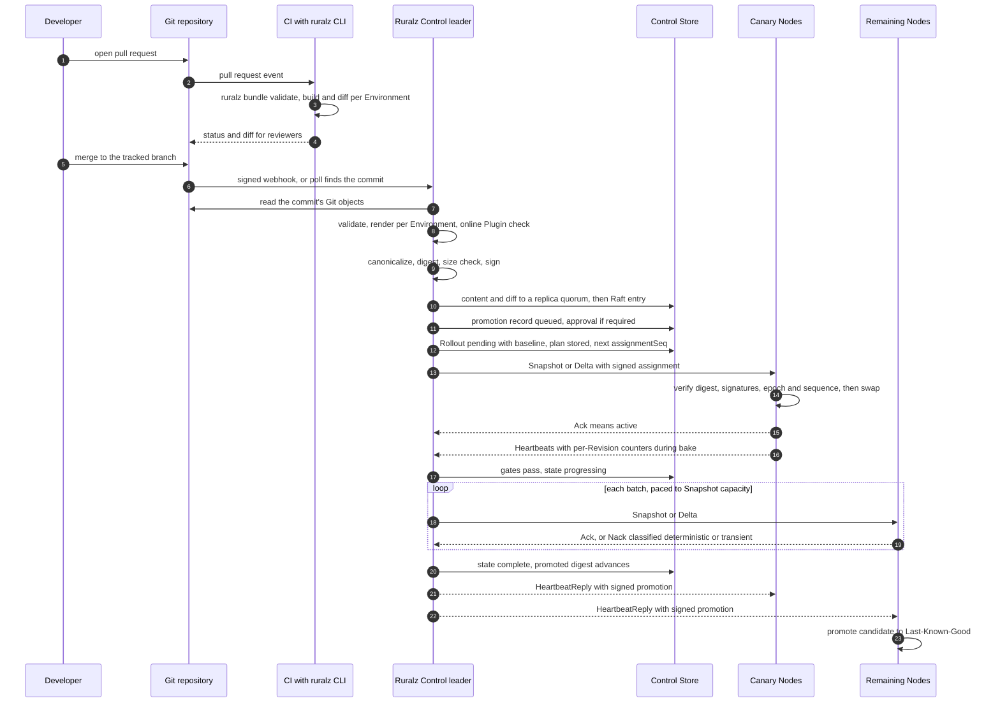
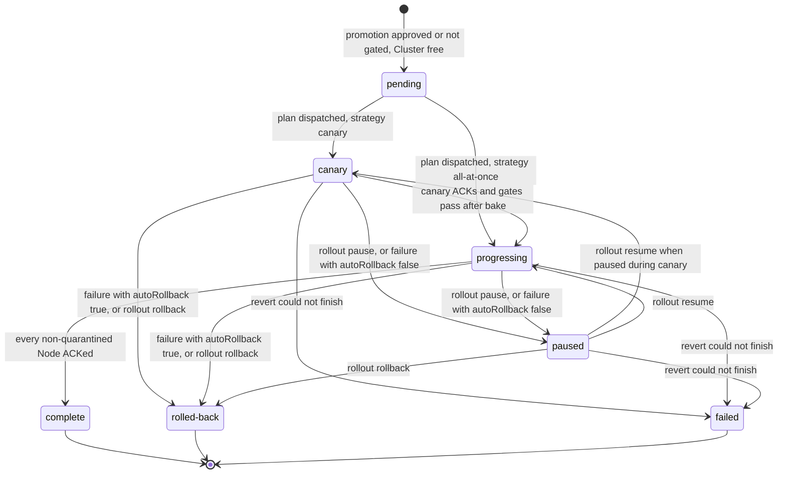
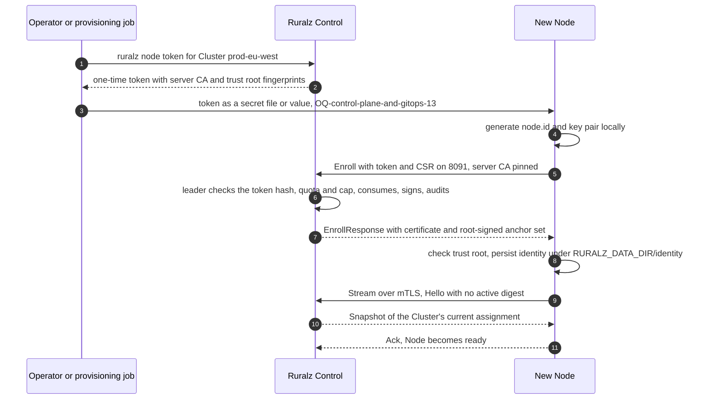
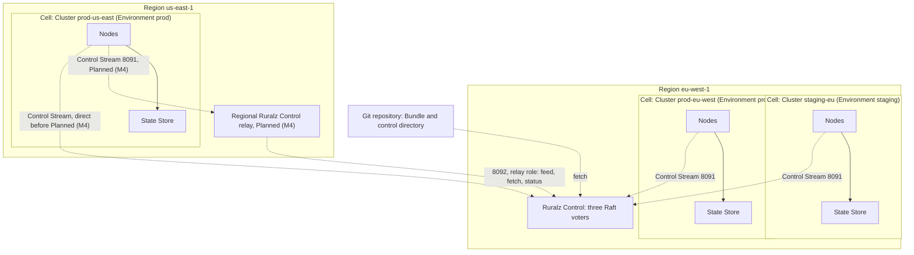

# Control Plane and GitOps

## Summary

This document designs Ruralz Control (`ruralz-control`), the optional control plane behind differentiator (3), built-in control plane + GitOps: signed Revisions from Git, promotions, Rollouts over the Control Stream with ACK/NACK, Enrollment, Drift, Ruralz Console and the Control Store. Nodes keep serving their active Revision during a Ruralz Control outage and boot Last-Known-Good configuration after a restart. Everything is Planned (M2) unless tagged otherwise. Readers: architects, contributors and operators.

## Scope and non-goals

In scope: `ruralz-control` internals, GitOps, Rollouts, the Control Stream ([ADR-0007](../adr/0007-control-stream-protocol.md)), Enrollment, certificates, Drift, Ruralz Console, RBAC, the Control Store ([ADR-0006](../adr/0006-control-store-raft-boltdb.md), proposed), the REST API and the `RZ-CP` registry. "Pack 8.3" names a [foundation pack](../_meta/foundation-pack.md) section.

Non-goals: kinds and fields ([Configuration model](02-configuration-model.md)); Node compile ([Data plane](03-data-plane.md)); the threat model, key usages and certificate names ([Security and identity](08-security-and-identity.md), owner of [ADR-0017](../adr/0017-artifact-signing.md)); CLI flags ([CLI and API surface](../reference/01-cli-and-api-surface.md)); Helm and CRD packaging ([Deployment topologies](../operations/01-deployment-topologies.md), [ADR-0016](../adr/0016-kubernetes-helm-and-crds.md), proposed); runbooks ([High availability and disaster recovery](../operations/04-high-availability-and-disaster-recovery.md)).

## Responsibilities and non-responsibilities

Ruralz Control is never on the request path (P3).

| Ruralz Control does | Ruralz Control never does |
|---|---|
| Builds signed Revisions per Environment from Git, `ruralz bundle push` or opted-in CRDs | Serves or inspects client traffic |
| Runs approved Rollouts with per-Node ACK/NACK, gates and rollback | Dials a Node; Nodes dial 8091 |
| Enrolls, renews and revokes Nodes; distributes trust anchors | Resolves `secretRef` or reads the State Store |
| Publishes each Cluster's promoted digest and Node count | Edits configuration outside its sources |
| Detects Drift; hosts Ruralz Console, REST API, RBAC and audit log | Gates features on a license (P1) |

### Behavior during a Ruralz Control outage

When Ruralz Control is unreachable or loses quorum, every Node keeps serving its active Revision and stays ready indefinitely (pack 8.5). A restarting Node waits up to 5 s for the Control Stream (target), then boots Last-Known-Good configuration and runs detached (pack 8.2).

| Unavailable | Consequence |
|---|---|
| New promotions, approvals and Rollouts | Commits queue |
| In-flight Rollouts and `ruralz rollout rollback` | Held; a new leader resumes the persisted plan |
| Enrollment and renewal | Nodes without Last-Known-Good stay not ready (pack 8.11) |
| Drift detection, Node status, key rotation | Paused until Ruralz Control returns |
| Logins and writes (quorum loss) | Existing sessions and tokens keep reading |
| Node count updates | Nodes keep the last count (pack 8.8) |

## Components

Every replica serves the REST API, Ruralz Console and Control Streams; only the leader (Raft leader or `postgres` lease holder) runs watchers, the Rollout engine, Drift detector, signer and CAs.

*Figure 1: one Ruralz Control replica; dashed edges leave the process.*



### Replica roles

1. Replicas serve their Nodes from committed assignments, subject to [fencing](#fencing-stale-replicas); Enrollment and renewal go to the leader, or fail with `RZ-CP-004`.
2. Followers forward `Ack` and `Nack` at once and heartbeat aggregates every 5 s (target) through a bounded queue that drops the oldest.
3. `clusterNodeCount` counts ready Nodes that ACKed a Revision and stayed connected 10 minutes (target); large decreases publish at once, and increases rise at most 10% per minute, with an alert (target).
4. 8092 authorizes classes by certificate role, at most 64 MiB/s per peer (target): Raft and write forwarding for Raft members; status forwarding and content replication for replicas; status forwarding, content fetch and the [relay feed](#relay-feed) for relays; and a token `Join` (OQ-control-plane-and-gitops-15). The leader re-authorizes forwarded writes as their original principal.

A new leader restarts open gate windows and evaluates no gate until canary Nodes report or one ACK timeout passes.

## GitOps model

Git is the source of truth (P5); Ruralz Console never edits the Control Store directly.

### Repository layout

```text
platform-gateway/
  bundle/                     the Bundle, rooted at ruralz.yaml
    ruralz.yaml               the only Gateway
    routes/  upstreams/  policies/  plugins/  consumers/  ai/
    overlays/
      staging/                patches for Environment staging
      prod/                   patches for Environment prod
  control/                    outside the Bundle, read by Ruralz Control and the CLI;
    environments.yaml         SHOULD need separate forge review
    clusters.yaml
  tests/                      ruralz test run cases
```

Ruralz Control reads Git objects, never a working tree; it and the CLI reject symlinks, gitlinks and LFS pointers (OQ-control-plane-and-gitops-16). `Environment` and `Cluster` stay outside the Bundle (RZ-CFG-017), so adding a Cluster never changes a digest. The Git source and credentials come from process configuration (TB-7; OQ-control-plane-and-gitops-1).

### Branch-to-Environment mapping

This decides OQ-system-overview-11 as trunk-based: one tracked branch feeds every Environment, each rendering the same commit with its overlay and variables.

```yaml
apiVersion: ruralz/v1alpha1
kind: Environment
metadata:
  name: prod
spec:
  overlay: prod                 # selects bundle/overlays/prod/
  promotion:
    from: staging               # the commit must reach complete in staging first
    requireApproval: true       # ruralz rollout approve before any prod Rollout exists
---
apiVersion: ruralz/v1alpha1
kind: Cluster
metadata:
  name: prod-eu-west
spec:
  environment: prod
  region: eu-west-1
  rollout:
    strategy: canary
    canary: {percent: 10, bake: 15m}
    autoRollback: true
```

Promotion moves a commit, never a digest (pack 8.1). Once a commit's Revision reached `complete` in every Cluster of `promotion.from`, the target Environment queues a promotion record (source, Environment, digest), which replaces an older unapproved one.

With `requireApproval`, an `approver` runs `ruralz rollout approve` once per record, for every Cluster; Reject in Ruralz Console or the REST API discards it (CLI verb: OQ-control-plane-and-gitops-17). A change to an `Environment` or `Cluster`, in `control/` or a CRD, that relaxes a gate (dropping `requireApproval` or `promotion.from`, moving a Cluster) is flagged `security` and applies only after approval, never to its own commit.

### Change detection and pull request validation

Forge webhooks at `/api/v1/hooks/git` need a per-source HMAC, are rate-limited (`RZ-CP-018`) and only trigger an authenticated fetch; otherwise Ruralz Control polls every 60 s (target). The Git client is OQ-control-plane-and-gitops-6.

Forge CI renders each pull request per Environment exactly as Ruralz Control does ([Configuration model](02-configuration-model.md#environment-substitution)): `ruralz bundle validate --environments control/environments.yaml` and `ruralz bundle build`, Planned (M1); `ruralz bundle diff` against the Environment's Revision, Planned (M2); and `ruralz test run`. Ruralz Control re-validates every commit; commit status needs forge adapters (OQ-control-plane-and-gitops-7).

### Ruralz Console write-back and other sources

The Bundle editor validates edits with the same pipeline; submit commits an audited branch (author: the user) that reaches Nodes only after merge, or fails with `RZ-CP-012`.

Two sources record a digest in place of a commit, pass `promotion.from` and `requireApproval` exactly like one and show as Drift (mixed sources: OQ-system-overview-8):

- `ruralz bundle push` sends a Bundle and expected digest; Ruralz Control re-renders it (mismatch: RZ-CFG-027) and records the source tree digest. The pusher is the author.
- The CRD source, off unless process configuration binds a namespace to an Environment, records its object set's digest; every Kubernetes user who changed the set is an author. `Environment` and `Cluster` CRDs are read only if process configuration enables them.

Both are refused for an Environment with `requireApproval` unless process configuration overrides it, which is audited.

## Bundle, Revision and Rollout lifecycle

*Figure 2: from pull request to signed Revision to canary Rollout.*



### Building and recording a Revision

Per Environment the builder renders the Bundle with its overlay and `spec.variables`, runs every check ([Configuration model](02-configuration-model.md#validation-and-diff-semantics)), computes the `ruralz.canonical.v1` digest ([ADR-0003](../adr/0003-configuration-format.md)) and applies the [Snapshot size check](#heartbeat-and-backpressure), or records a failed build. Content, source tree and `ruralz.diff.v1` diff reach a content-store quorum before a Raft entry records their digests. Unreferenced Revisions beyond the latest 50 per Environment (target) are deleted.

The online Plugin check dials only allowlisted registries, binds credentials to one host, follows no redirects and stops at 64 MiB or 30 s (target).

### Revision signing and verification

Signing follows [ADR-0017](../adr/0017-artifact-signing.md) and pack 8.14; digest checks are always on.

| Step | Rule |
|---|---|
| Signed content | Revision: digest, Environment, key ID, time. Assignment: Cluster, Environment, digest, `rolloutId`, `storeEpoch`, `assignmentSeq`. Promotion: Cluster, `promotedDigest`, `storeEpoch`, `promotionSeq`. Anchor set: `version`, `storeEpoch`, online keys, server CA fingerprint, Plugin trust policy, optional `compromisedSince` |
| Keys | The leader's online key, encrypted under a key-encryption key, signs everything except anchor sets, which only an offline trust-root key signs (OQ-control-plane-and-gitops-8) |
| Algorithm | ECDSA P-256 with SHA-256 through Go `crypto/ecdsa`, confirmed by the FIPS build's G3 check ([Tech stack](../engineering/01-tech-stack-and-libraries.md#fips-build)) |
| Node verification | Before activation and at Last-Known-Good boot: digest (RZ-CFG-027), both signatures, and the Environment and Cluster from its `EnrollResponse`, else RZ-CFG-033 |
| Anchor sets | `version` is the root signing time; Nodes persist the highest and reject a lower one, or an equal one with other content. The Control-mode Plugin trust policy comes from Ruralz Control's process configuration (pack 8.14, OQ-control-plane-and-gitops-1); without one, signed-Plugin activation fails under `enforce` |
| Rotation | (1) Rotate key (Settings or `/api/v1/trust`, `admin`) creates the new key and exports its public half; after offline root signing, a `security-admin` uploads the anchor set that adds it at a higher `version`, and Ruralz Control publishes it. (2) Once connected Nodes ACKed, Ruralz Control signs with it and re-signs retained Revisions, assignments and promotions at the next sequences, sent as a `Delta` with empty `ops`. (3) The old key retires once those Nodes report the new `signingKeyId` |
| Emergency removal | Starts when a `security-admin` uploads a root-signed anchor set without the key, opening a higher `storeEpoch` and carrying `compromisedSince`; Ruralz Control then re-signs at once, awaiting no ACK. A Node refuses to boot a candidate or Last-Known-Good whose assignment or promotion it accepted from that key after `compromisedSince`, by its own clock, and stays not ready until the Control Stream delivers; older ones boot (OQ-control-plane-and-gitops-24) |

Root rotations form a chain, each link signed by its predecessor; a Node older than the retained chain re-enrolls (OQ-control-plane-and-gitops-10), as does one whose Cluster changes `spec.environment`.

### Rollout plan, batches and gates

`Cluster.spec.rollout` has only `strategy`, `canary.percent`, `canary.bake` and `autoRollback`, so the other pack 8.3 batches and gates are fixed defaults (OQ-control-plane-and-gitops-3). A plan is a content object: sorted `node.id` list, batch boundaries and one digest per batch.

| Plan element | Default |
|---|---|
| Members | Connected Nodes that ACKed any Revision, or all connected Nodes if none has; others are late. ACKs commit as bitmaps every 250 ms (target) |
| `all-at-once` | One batch, no gate window |
| Canary set | `canary.percent` of members rounded up, at least one, by stable hash of `node.id` and Rollout ID |
| Canary gate | For `canary.bake`: no deterministic NACK, every canary Node ACKed and ready, 5xx ratio at most 1 percentage point above baseline (target) |
| Batches | 25%, 25%, then 50% of the rest (target); under `canary`, each gated for max(30 s, 3 × `heartbeatInterval`) (target) |
| Minimum sample | 200 requests per gate (target); a thin canary gate pauses; a thin batch passes with a warning |
| Baseline | Nodes on the previous Revision, else the Cluster's prior 15 minutes (target), stored at creation |
| ACK timeout | 60 s from the last byte sent, then 3 retries before the Node lags and is quarantined (target); Nodes awaiting admission or behind a stale replica are pending |
| Lagging threshold | More than max(1, 5% of the batch) lagging Nodes fails the batch (target) |
| Late or zero Nodes | Late Nodes join the final batch and never lag; an empty plan completes at once |

Gates read per-Revision request, 5xx and rejection counters from heartbeats, deciding OQ-system-overview-9; no single Node's counters decide a multi-Node gate. Ruralz Control reproduces a claimed deterministic NACK; one that does not reproduce counts as transient and quarantines the Node.

With `autoRollback: true`, a deterministic NACK, failed gate or lagging threshold re-delivers the previous Revision wherever the new one activated; with `false`, the Rollout pauses. A revert allows three ACK timeouts per Node (target); unreverted Nodes are quarantined, and more than the lagging threshold means `failed`.

### Rollout states

The states match pack 8.3 exactly: `pending`, `canary`, `progressing`, `paused`, `complete`, `rolled-back` and `failed`, which means only that the revert could not finish and pages an operator. A Rollout exists only after approval and stays `pending`, the pack's queued state, until its plan dispatches. Pack 8.3 lacks the transitions to `failed` (OQ-control-plane-and-gitops-15).

*Figure 3: Rollout states; failures follow `autoRollback`.*



On `complete` the promoted digest advances and matching Nodes promote their candidate to Last-Known-Good (pack 8.2). A reconnecting Node receives the Revision its persisted plan assigns, so reconnects cannot bypass a canary.

### Rolling back in three steps

During `canary`, `progressing` or `paused`:

```bash
ruralz rollout status prod-eu-west                    # 1. find the Cluster's active Rollout
ruralz rollout rollback 01J9ZK3M7Q8R2T4V6X8Y0A1B2C    # 2. re-deliver the previous Revision
ruralz rollout status 01J9ZK3M7Q8R2T4V6X8Y0A1B2C      # 3. confirm the state is rolled-back
```

In Ruralz Console: (1) select the Rollout, (2) choose Roll back, (3) confirm by typing the Cluster name.

A `complete` Rollout is terminal. To revert it, an `operator` passes step-up TOTP and starts a Rollout of the replaced Revision, or chooses Revert in Ruralz Console. The revert skips `promotion.from` and approval but follows `spec.rollout` (OQ-control-plane-and-gitops-18). An older target, or a diff with `security` impact or a Capability grant, gets `RZ-CP-006` until another `approver` approves. A revert never delivers a revoked hash. A Revision never `complete` in the Cluster gets `RZ-CP-017`; one for another Environment, `RZ-CP-016`.

## Control Stream

Every Node dials 8091 and speaks `ruralz.control.v1.ControlStream`, a snapshot plus delta protocol with xDS-style ACK/NACK, not xDS ([ADR-0007](../adr/0007-control-stream-protocol.md)), built with `connectrpc.com/connect` in gRPC mode ([source](https://github.com/connectrpc/connect-go/blob/main/README.md)); `buf breaking` gates the protos (OQ-tech-stack-and-libraries-14).

On 8091, `Enroll` needs a valid token and every other RPC a valid, unrevoked Node certificate, the only source of `node.id`.

| Message | Direction | Key fields | ACK/NACK semantics |
|---|---|---|---|
| `EnrollRequest` (RPC `Enroll`) | Node to Ruralz Control | `token`, `nodeId`, `csr`, `version`, `schemaLevels` | `EnrollResponse`, `RZ-CP-001` or `RZ-CP-002`; token consumed |
| `EnrollResponse` | Ruralz Control to Node | `certificateChain`, `serverCa`, `trustRoot`, `anchorSet`, `cluster`, `environment` | No ACK; the Node checks `trustRoot` against the token |
| `Hello` | Node to Ruralz Control, first on `Stream` | `activeDigest`, `lkgDigest`, `schemaLevels`, `lastNonce`, `storeEpoch`, `assignmentSeq`, anchor-set `version` | `RZ-CP-002`, `RZ-CP-003`, or anchor updates, then `Delta` or `Snapshot` if needed |
| `Snapshot` | Ruralz Control to Node, chunked | `nonce`, `assignment`, `offset`, `totalBytes`, `chunk`, `signature`, `promotion` | Verify, compile, swap, `Ack`; else `Nack`, keeping the active Revision |
| `Delta` | Ruralz Control to Node | `nonce`, `assignment`, `baseDigest`, `ops`, `signature`, `promotion` | Empty `ops` carries only new signatures; a wrong patched digest is `Nack` RZ-CFG-027 |
| `Ack` | Node to Ruralz Control | `nonce`, `digest`, `storeEpoch`, `assignmentSeq` | Means active, not durable; stale nonces are ignored |
| `Nack` | Node to Ruralz Control | `nonce`, `digest`, `code`, `class`, `detail` | Deterministic fails the gate once reproduced; transient is retried |
| `Heartbeat` | Node to Ruralz Control | `activeDigest`, `lkgDigest`, `signingKeyId` per digest, `schemaLevels`, `ready`, `draining`, counters per `rolloutId` | Feeds gates and Drift; three missed (target) mean disconnected |
| `HeartbeatReply` | Ruralz Control to Node | `promotion`, `clusterNodeCount`, `heartbeatInterval` | Level-triggered Last-Known-Good promotion |
| `TrustUpdate` | Ruralz Control to Node | `nonce`, `anchorSet`, `rootSignature` | `Ack` or `Nack`; fenced only by `version` |
| `RenewRequest`, `RenewResponse` | Both ways | `csr` keeping `node.id` and Cluster; `certificateChain` | Forwarded to the leader; `RZ-CP-003` if revoked |
| `Reconnect` | Ruralz Control to Node | `retryAfter`, `reason` (`drain`, `shed`, `rebalance`) | Redial with full jitter after `retryAfter` |

`detail` is truncated to 4 KiB (target). The stream disables `ReadTimeout` and `WriteTimeout` and detects dead peers with HTTP/2 pings ([Tech stack](../engineering/01-tech-stack-and-libraries.md#library-catalog)).

### Enrollment and mTLS

*Figure 4: Enrollment and first delivery.*



`ruralz node token` issues a one-time token for one Cluster, stored hashed, valid 1 hour (target), embedding SHA-256 fingerprints of the 8091 server CA and trust root, so the first dial is pinned. The token is a secret, never in a Bundle, and is ignored once `${RURALZ_DATA_DIR}/identity/` holds a valid identity. Private keys never leave the Node.

An enrolled `node.id` is rejected (`RZ-CP-002`). `Enroll` has a per-source rate limit, a 16 KiB message cap and a lockout after 10 failures in 10 minutes (target). Certificates live 30 days (target) and renew at two thirds, closing OQ-security-and-identity-16 with option (a). `ruralz node revoke` closes the stream and refuses renewal (delivery: OQ-security-and-identity-4). For scale-out (P4), provisioning jobs mint tokens with a Cluster-scoped API token, under a minting quota and Node cap (OQ-control-plane-and-gitops-19, -23).

### Snapshot, delta and version skew

Ruralz Control sends a `Delta` when the change encodes within 1 MiB (target), else a chunked `Snapshot`. No Rollout starts with a field newer than the oldest Node serves (RZ-CFG-024, [Configuration model](02-configuration-model.md#version-skew)).

### Heartbeat and backpressure

Nodes heartbeat every 15 s (target); Ruralz Control MAY raise `heartbeatInterval` under load, never for active-set Nodes. Bounds:

1. One unacknowledged configuration message per Node, `TrustUpdate` included; a newer assignment replaces an unsent one.
2. Snapshot chunks of at most 1 MiB (target) and Deltas are encoded once and shared.
3. At most 32 concurrent Snapshots and 256 MiB in flight per replica (target); a Snapshot larger than that budget is admitted alone, never refused.
4. Messages cap at 2 MiB (target). Snapshot size check: a Node's `totalBytes` limit derives from the configurable size limit, never below the CLI default (OQ-control-plane-and-gitops-25), and `ruralz bundle build` and the builder reject a larger encoding with RZ-CFG-001, so no Revision that Nodes would refuse passes CI or is recorded.
5. A per-stream send queue of 4 messages (target) keeps only the latest state.
6. A per-replica token bucket on new streams answers excess with `Reconnect` or `RZ-CP-010`.
7. Backoff with full jitter, base 1 s, cap 60 s (target).

A deployment targets 10,000 Nodes (target), a replica 5,000 streams and 20 Snapshots/s (hypothesis); paced to that capacity, a 10,000-Node Cluster's largest batch takes at most 5 minutes (target), measured by [Performance budgets and benchmarking](12-performance-budgets-and-benchmarking.md).

## Multi-cluster and multi-region sync

A promotion converges every Cluster of an Environment on one Revision. Values never come from a Cluster (OQ-configuration-model-12, option (a)); Node-local values such as a regional State Store URL use `secretRef`. Clusters take one promotion at a time in lexical order, each after the previous reached `complete` (OQ-control-plane-and-gitops-4); a newer commit waits until the current promotion finishes or stops.

A Rollout ending `rolled-back` or `failed` stops its promotion, leaving a mixed Environment, not Drift; an `operator` may retry it, with new approval under `requireApproval`.

*Figure 5: Environments, Regions and Cells (one Cluster and its State Store).*



Cross-Region latency slows Rollouts, never requests (pack 8.13); Raft voters SHOULD share a Region.

For the regional Ruralz Control, Planned (M4), this document decides the read-only relay of OQ-system-overview-16: no signing key and an allowed-Cluster list. It dials 8092 with a peer certificate of role `relay` and serves 8091 with a server certificate naming its Clusters; a Node accepts it only when its Cluster is named. It forwards reports, fetches content by digest, enforces revocations and follows the [fencing rule](#fencing-stale-replicas). Nodes verify signatures end to end, so a relay cannot forge configuration; the leader drops its reports for other Clusters.

### Relay feed

The relay feed is an 8092 class served by the leader or a non-stale replica. It streams committed entries filtered to the relay's Clusters: plan and assignment state with `storeEpoch` and `assignmentSeq`, signed promotions, revocations, anchor sets and `clusterNodeCount`. It resumes from the relay's last applied index, or sends full state when that index precedes the retained log, and carries the replica's last leader contact. A relay's staleness is that replica's time since leader contact plus the relay's time since hearing the replica, judged against the same election-timeout bound (hypothesis). The queue holds 10,000 entries (target); overflow forces a full resync.

## Drift detection

Drift is any difference between the digest or `/config/dump` a Node reports and the Revision assigned from Git (pack 11), evaluated on every heartbeat aggregate.

| Drift kind | Detected when | Reported as | Reconciliation |
|---|---|---|---|
| Laggard | Active digest differs from the assigned one beyond one ACK timeout | Drift screen, `ruralz node list`, metric | Re-delivery, then quarantine and alert |
| Last-Known-Good | Differs from the promoted digest while the active digest matches | Drift screen, metric | Promotion on the next `HeartbeatReply`, then alert |
| Git divergence | The promoted Revision is not from the commit of the Cluster's last `complete` promotion: a revert, push or CRD source | Drift screen with age, audit event, metric | Alert only, never reverted; severity rises after one hour (target) |
| Local tampering | A Node's hourly (target) re-hash of its active or Last-Known-Good form mismatches | `Nack` RZ-CFG-027, audit event | `Snapshot`; repeats quarantine |

The re-hash replaces a `/config/dump` comparison; operators inspect a Node with `ruralz node dump`. [Observability](10-observability.md) names metrics. The Drift screen also shows failed builds and schema skew (RZ-CFG-024).

## Ruralz Console

Ruralz Console, at `/console` on 8090, calls only the public REST API, so RBAC is enforced server-side. Screens are Planned (M2).

| Screen | Shows | Actions | View | Act |
|---|---|---|---|---|
| Overview | Environments, Clusters, Rollouts, Drift, replica health | None | viewer | None |
| Environments | Promotion chain; queued, mixed or stopped promotions | Approve, reject, retry | viewer | approver; retry: operator |
| Clusters | Strategy, promoted digest, Node count, history | Revert | viewer | operator |
| Nodes | Digests, version, schema level, readiness | Enrollment token, revoke | viewer | security-admin |
| Revisions | Source, signing key, diff impact | Compare | viewer | None |
| Rollouts | State, batches, ACKs, NACK codes, gates | Start, pause, resume, roll back | viewer | operator |
| Drift | Drift and related conditions | Re-deliver, quarantine | viewer | operator |
| Bundle editor | Files, live diagnostics, diff | Submit write-back | viewer | editor |
| Plugins | Digest, ABI, Phases, Capabilities, signatures | None | viewer | None |
| Audit log | Entries, chain verification | Export | auditor | auditor |
| Access | Users, role bindings, API tokens | Create, bind, revoke | admin | admin |
| Settings | Git source, anchor sets, keys, replicas, backups | Rotate key, upload anchor set, join token, backup | viewer | admin; anchor set: security-admin |

### RBAC and SSO

Roles are built in and bound globally, per Environment or per Cluster; anything not granted is denied, and the Act column assigns actions. `operator`, `editor` and `security-admin` include `viewer`; `admin` includes those and `auditor`; no role includes `approver`. Names follow [Security and identity](08-security-and-identity.md), which keeps the audit log from `viewer` (OQ-control-plane-and-gitops-20).

Approvers cannot approve a change they authored, committed, wrote back, pushed, started or requested (`RZ-CP-007`, audited); nobody edits their own bindings. Under `requireApproval`, commit authorship comes only from a verified commit signature whose key is registered to a Ruralz Console user, or from forge adapter merge metadata (OQ-control-plane-and-gitops-7), answering OQ-control-plane-and-gitops-9 with option (b). A commit without a verified signature needs two distinct approvers, so a spoofed email can neither grant nor block an approval.

Planned (M2): local accounts with PBKDF2-HMAC-SHA-256 at 600,000 iterations (target), passing gate G3 ([Tech stack](../engineering/01-tech-stack-and-libraries.md#fips-build)), lockout and TOTP, mandatory for `admin`, `security-admin` and `approver` (OQ-control-plane-and-gitops-21), with step-up for approvals, reverts, trust uploads and Access changes. CI uses scoped, expiring API tokens. Sessions are same-site cookies with CSRF protection, lasting 12 hours or 30 idle minutes (target). Replicas read roles and revocations from replicated state per request, applying revocations within 1 s (target). OIDC and SAML SSO is Planned (M5), per TB-6 (OQ-tech-stack-and-libraries-19), in the one build (P1).

## Control Store and high availability

The Control Store is embedded `hashicorp/raft` with `raft-boltdb/v2` on bbolt over mutual TLS on 8092 ([ADR-0006](../adr/0006-control-store-raft-boltdb.md), proposed).

| Data | Where | Backed up |
|---|---|---|
| Definitions, promotion and Rollout records, Revision metadata, ACK bitmaps, sequences, Enrollment records, token hashes, revocations, encrypted keys, users, bindings, unsealed audit entries | Raft | Yes |
| Revision content, diffs, plans, sealed audit segments | Content store, on a quorum before the referencing entry | Yes |
| Heartbeat aggregates, stream state | Memory; rebuilt by resync | No |

Followers fetch missing content objects, which self-verify, from peers.

### Fencing stale replicas

Assignments carry (`storeEpoch`, `assignmentSeq`) and promotions (`storeEpoch`, `promotionSeq`) inside the leader's signature. Sequences are per-Cluster counters signed before proposal; the FSM rejects an entry unless it is the current value plus one, so a deposed leader cannot commit. Nodes persist the highest accepted pair of each type under `${RURALZ_DATA_DIR}/identity/` and send a transient NACK for a lower one; a rollback takes the next sequence. `storeEpoch` is the `version` of the anchor set that opened the epoch, accepted only from an accepted anchor set, so a new epoch resets sequences inflated by a stolen key. Restores, Control Store moves, emergency removals and server CA replacements each open one. New and late Nodes inherit current entries (pack 8.2).

A replica without word from a leader for one election timeout (hypothesis) is stale: it sends its last committed assignment only to Nodes with no active digest, answers others with nothing and `HeartbeatReply` with its last promotion, and exports a metric. After 30 s stale (target) it sends `Reconnect` (`rebalance`). Relays follow the same rule.

### Sizing and failover

Production runs three voters, or five to survive two failures (target); etcd recommends odd sizes ([source](https://etcd.io/docs/v3.6/faq/)). hashicorp/raft defaults to 1000 ms heartbeat and election timeouts ([source](https://raw.githubusercontent.com/hashicorp/raft/main/config.go)), so failover takes about 1 to 2 s plus election round trips (hypothesis); etcd advises election timeouts of at least ten round trips ([source](https://etcd.io/docs/v3.6/tuning/)), hence one Region. Quorum loss stops writes, logins and Enrollment (`RZ-CP-004`, TB-11).

### Certificates and replica join

| Certificate | Issuer | Lifetime |
|---|---|---|
| Node client, naming `node.id` and Cluster | Node CA | 30 days (target) |
| 8091 server | Server CA, pinned by tokens and anchor sets | 90 days (target) |
| 8092 peer | Peer CA | 90 days (target) |
| Relay, Planned (M4) | Peer CA (role `relay`) on 8092; server CA on 8091 | 90 days (target) |
| 8090 TLS | Server CA or operator-supplied | Operator's choice |

8092 rejects Node CA certificates, and 8091 peer certificates. CA keys are encrypted like the online key. `ruralz control serve` on an empty Control Store generates the CAs or loads supplied ones; `ruralz control join` redeems a one-time `admin` token in `Join`, and the leader signs the replica's certificate and adds a voter.

### Readiness on port 9902

Per pack 8.5, `/healthz` means the process responds; `/readyz` returns 200 once the Control Store loaded, 8090 and 8091 are bound and the replica is not draining, never failing on quorum loss or staleness. `/metrics` and `/debug/*` require authentication as on 9901 (TB-9).

### Backup, restore and `postgres`

`ruralz control backup` writes a Raft snapshot plus referenced content, consistent at one index, encrypted and signed; downloads are audited. `ruralz control restore` runs only from the host CLI into an empty deployment, under three rules: a root-signed anchor set with a new online key opens a higher `storeEpoch` before any delivery; sessions and API tokens are invalidated; and without an operator-supplied revocation list, Node certificates issued before the restore are refused until their Nodes re-enroll, so those Nodes serve detached.

The `postgres` implementation, Planned (M4), keeps everything in PostgreSQL, with leadership as a fenced lease row renewed every 2 s and expiring after 10 s (target). Sequences keep their compare-and-swap in a transaction; moving between Raft and `postgres` opens a new `storeEpoch`. Status forwarding and content placement are OQ-control-plane-and-gitops-22; the driver is OQ-tech-stack-and-libraries-20.

## API summary

The REST API on 8090 is versioned under `/api/v1/` and published as OpenAPI; Ruralz Console, the CLI, CI and provisioning use it. Requests carry a session cookie or API token; errors carry `RZ-CP` or `RZ-CFG` codes. Reads need `viewer`.

Resources are `environments` and `clusters` (read only), `promotions`, `revisions` (content, diff, push by `editor`), `rollouts`, `nodes`, `enrollment-tokens`, `trust`, `drift`, `audit`, `changes` (write-back), `replicas`, `access`, `backup` and `hooks/git` (HMAC). Write roles match the Ruralz Console Act column; `audit`, `access` and `backup` also need that role for reads.

Ports: 8090 REST API, Ruralz Console and webhooks; 8091 Control Stream; 8092 peer layer, unused with `postgres`; 9902 admin. This document owns the `RZ-CP` registry (pack 8.6):

| Code | Meaning |
|---|---|
| RZ-CP-001 | Enrollment token rejected, for any reason |
| RZ-CP-002 | `node.id` taken, or `Hello` mismatches the certificate |
| RZ-CP-003 | Node identity revoked or expired |
| RZ-CP-004 | No quorum, leader or lease |
| RZ-CP-005 | Promotion gate not satisfied |
| RZ-CP-006 | Awaiting approval |
| RZ-CP-007 | RBAC or separation-of-duties denial |
| RZ-CP-008 | Rollout transition not allowed |
| RZ-CP-009 | Another Rollout is active for the Cluster |
| RZ-CP-010 | Shed; retry later |
| RZ-CP-011 | Git fetch or authentication failed |
| RZ-CP-012 | Write-back conflict or push failed |
| RZ-CP-013 | Content quorum write failed |
| RZ-CP-014 | Signing key unavailable |
| RZ-CP-015 | Backup or restore failed |
| RZ-CP-016 | Revision is for another Environment |
| RZ-CP-017 | Revision never `complete` in this Cluster |
| RZ-CP-018 | Webhook signature invalid or rate-limited |

## Audit and security

Every state change is audited, including logins, REST API writes, Enrollment, approvals, CRD changes with their Kubernetes user, and key rotations. Entries record actor, role, action, target, digests, source, result and time, and commit through Raft every 250 ms (target) before the write returns; the leader seals them into hash-chained segments of at most 4 MiB (target). Export is OQ-control-plane-and-gitops-12.

[Security and identity](08-security-and-identity.md) owns the full threat model; the sections above mitigate stolen Node certificates, compromised operator or editor accounts, tampered configuration and reconnect storms. Threats specific to Ruralz Control:

| Threat | Mitigation |
|---|---|
| Stolen Enrollment or provisioning token | One use, 1-hour expiry (target), one Cluster, lockout; minting quota, Node cap |
| Stolen online key | Cannot sign anchor sets; emergency removal opens a higher `storeEpoch`, resetting inflated sequences, and refuses to boot Revisions accepted from the key after `compromisedSince` |
| Stolen key-encryption key | Emergency removal as above, then new Node and server CAs, each opening a root-signed epoch |
| Compromised Git account or spoofed commit email | Branch protection; authorship from verified signatures, else two approvers |
| Malicious Bundle author or CRD writer | Registry allowlist; CRD Revisions namespace-bound, gated by promotion and approval, audited |
| Compromised relay | No signing key; role-limited 8092 classes; reports and names limited to its Clusters; revocable |
| Stale restore | Root-signed epoch; revocation list required |
| Compromised Ruralz Control | Limited to what the online key signs; anchor sets need the offline root |

New crossings, none unauthenticated, map to [System overview](01-system-overview.md#trust-boundaries) boundaries per OQ-control-plane-and-gitops-14: token `Enroll` (TB-5), replica join (TB-11), webhooks, registry and Kubernetes clients, and the relay (TB-13). This document decides OQ-system-overview-9, -11 and -16, OQ-configuration-model-12, and OQ-tech-stack-and-libraries-22 with option (a).

## Open questions

| ID | Question | Options | Owner | Blocking? |
|---|---|---|---|---|
| OQ-control-plane-and-gitops-1 | Where are the Git source, CRD bindings, registry allowlist, webhook secrets and Plugin trust policy set? | (a) Process configuration (proposed); (b) `Environment.spec` | configuration-model | Yes, for Planned (M2) |
| OQ-control-plane-and-gitops-3 | Configurable batches and gates? | (a) Fixed (current); (b) `Cluster.spec.rollout` fields | configuration-model | No |
| OQ-control-plane-and-gitops-4 | Cluster order? | (a) Lexical (current); (b) a field; (c) parallel | configuration-model | No |
| OQ-control-plane-and-gitops-6 | Which Git client? | (a) A pure-Go library; (b) the `git` binary | tech-stack-and-libraries | Yes, for Planned (M2) |
| OQ-control-plane-and-gitops-7 | Forge API integration? | (a) Plain branches (current); (b) GitHub and GitLab adapters | control-plane-and-gitops | No |
| OQ-control-plane-and-gitops-8 | Where are the online and trust-root keys held? | (a) Control Store, root offline; (b) KMS or Vault | control-plane-and-gitops | Yes, for Planned (M2) |
| OQ-control-plane-and-gitops-12 | Audit export format? | (a) OpenTelemetry logs; (b) syslog | observability | No |
| OQ-control-plane-and-gitops-13 | How does a Node get Control mode, address and token? | (a) `RURALZ_CONFIG` URI plus a token file (OQ-system-overview-19); (b) new `RURALZ_*` variables | configuration-model | Yes, for Planned (M2) |
| OQ-control-plane-and-gitops-15 | Should pack 8.4 add the 8092 classes, relay feed included, and pack 8.3 transitions to `failed`? | (a) Amend (proposed); (b) a forwarding port | control-plane-and-gitops | No |
| OQ-control-plane-and-gitops-16 | Codes for a non-allowlisted registry, symlinks, gitlinks and LFS pointers? | (a) New RZ-CFG codes; (b) RZ-CFG-028, RZ-CFG-001 | configuration-model | No |
| OQ-control-plane-and-gitops-17 | CLI verb to reject a promotion? | (a) A `rollout` verb; (b) none | cli-and-api-surface | No |
| OQ-control-plane-and-gitops-18 | Should a revert skip `canary.bake`? | (a) No (current); (b) a field | configuration-model | No |
| OQ-control-plane-and-gitops-21 | Password KDF, and a memory-hard G3 exception? | (a) PBKDF2 (current); (b) argon2id outside FIPS builds | tech-stack-and-libraries | No |
| OQ-control-plane-and-gitops-22 | Status forwarding and content placement under `postgres`, amending pack section 2? | (a) PostgreSQL tables (proposed); (b) 8092 without Raft | control-plane-and-gitops | Yes, for Planned (M4) |
| OQ-control-plane-and-gitops-23 | Node cap and minting quota as fields? | (a) Process configuration (current); (b) `Cluster.spec` fields | configuration-model | No |
| OQ-control-plane-and-gitops-24 | Should ADR-0017 and Security and identity add the `compromisedSince` boot refusal? | (a) Adopt (proposed); (b) no Last-Known-Good from a removed key boots | security-and-identity | No |
| OQ-control-plane-and-gitops-25 | Which setting holds the encoded Snapshot limit? | (a) Derived from the source size limit (proposed); (b) its own setting | configuration-model | Yes, for Planned (M2) |

Closed: OQ-control-plane-and-gitops-9 (b) and -10, -14, -19, -20 (a), answered by Security and identity; -2 (trunk only) and -5 (a newer promotion waits), decided here; -11 (SSO), settled by Security and identity as Planned (M5).
