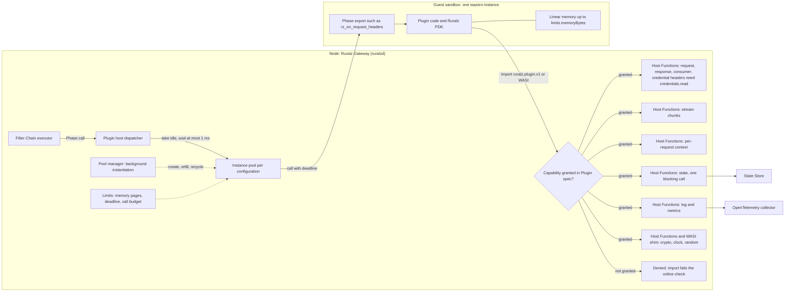
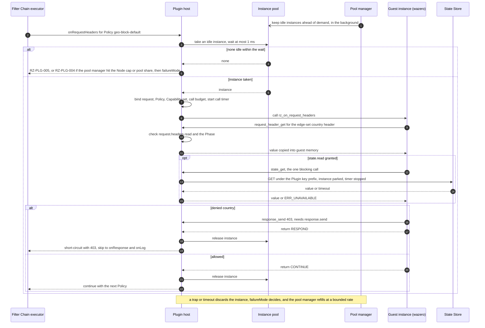
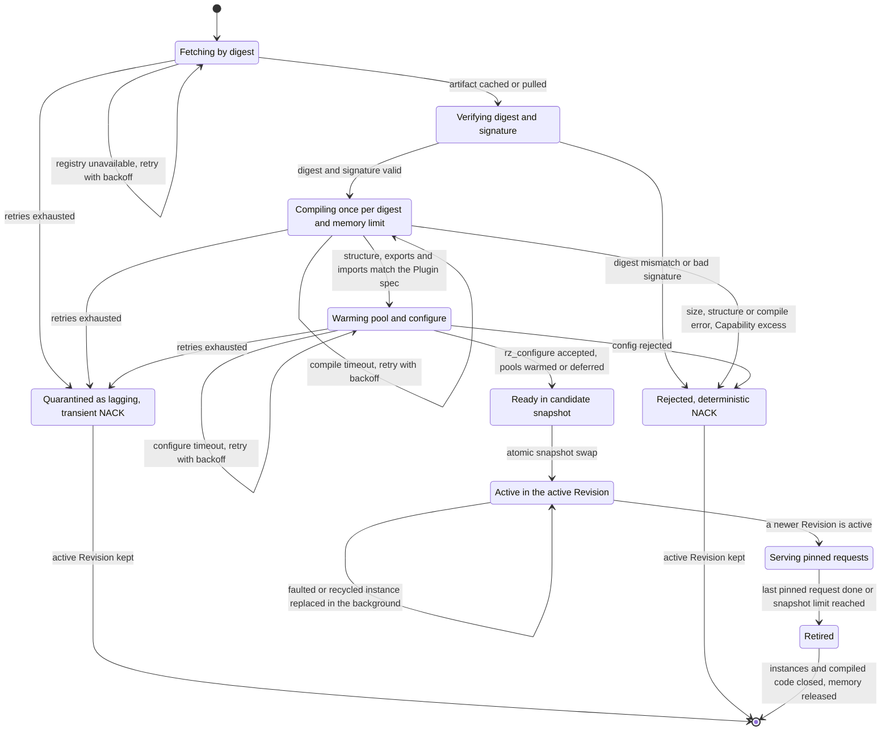

# WASM Plugin System

## Summary

This document designs differentiator (1), the WASM plugin system: how Ruralz Gateway runs sandboxed Plugins on wazero under Plugin ABI v1 (`ruralz.plugin.v1`). It fixes Host Functions, Capabilities, limits, packaging, hot-swap, PDKs, the Plugin threat model and the proxy-wasm stance, for Plugin authors, contributors, architects and security engineers. Nothing is implemented: Plugins are Planned (M2), the proxy-wasm adapter Planned (M4).

## Scope and non-goals

In scope: the Summary's topics, the `RZ-PLG` registry ([foundation pack](../_meta/foundation-pack.md) section 8.6) and the default of Gateway `limits.maxPluginMemoryBytes` (pack section 8.11).

Non-goals:

- Fields, owned by [Configuration model](02-configuration-model.md#plugin); other knobs are Open questions.
- Filter Chain execution ([Data plane](03-data-plane.md)), trust policy names ([Security and identity](08-security-and-identity.md), [ADR-0017](../adr/0017-artifact-signing.md)) and authoritative benchmarks ([Performance budgets and benchmarking](12-performance-budgets-and-benchmarking.md)).
- Hostile third-party code: Plugins are operator-installed; the sandbox bounds faults and over-reach.
- Outbound network, filesystem and environment access; the WebAssembly component model.
- A Revington-hosted marketplace: Plugins live in any OCI registry (P1).

## Goals and prior art

### Goals

| ID | Goal | Principle |
|---|---|---|
| WG-1 | Custom logic in any Phase, including `onChunk`, without Go plugins or Lua ([ADR-0011](../adr/0011-expressions-and-authorization-engines.md)) | P6, P7 |
| WG-2 | A faulty Plugin fails only its own Policy | P6, P9 |
| WG-3 | Pure Go host that builds with `CGO_ENABLED=0` ([ADR-0001](../adr/0001-implementation-language-go.md)) | P4 |
| WG-4 | Deny-by-default Capabilities | P6 |
| WG-5 | Plugins pinned by digest inside the Revision | P5 |
| WG-6 | Hot Reload and Rollouts swap Plugins without dropping requests | P9 |
| WG-7 | Several PDK languages over one sandboxed ABI | P6 |
| WG-8 | A pooled Phase call costs 50 µs or less at p99 (target), SM-6 | P10 |

### Prior art at the 2026-09-23 snapshot

| Product | Custom code model | WASM status | Lesson for Ruralz |
|---|---|---|---|
| KrakenD | Go plugins and Lua; CE 3.0 drops Go plugins ([Vision](../vision/01-vision-and-positioning.md#two-licensing-events-that-frame-2026), pack section 13) | None | A stable ABI avoids toolchain coupling |
| Kong Gateway | Lua, Go, Python and JavaScript PDKs ([source](https://developer.konghq.com/custom-plugins/)) | Beta proxy-wasm removed in 3.11.0.0 ([source](https://developer.konghq.com/gateway/breaking-changes/)) | A secondary beta ABI gets dropped |
| Tyk | Go, JavaScript, Python, Lua and gRPC plugins ([source](https://tyk.io/docs/api-management/plugins/overview)) | None documented | Many runtimes widen attack surface |
| Apache APISIX | Lua plus external runners ([source](https://github.com/apache/apisix)) | Experimental; "only a few APIs are implemented" ([source](https://apisix.apache.org/docs/apisix/wasm/)) | Unsupported imports must fail loudly |
| Envoy Gateway | Wasm, Lua, ExtProc and Dynamic Modules ([source](https://gateway.envoyproxy.io/docs/api/extension_types/)) | Available | Offer one sandboxed path |
| Zuplo | TypeScript policies ([source](https://zuplo.com/api-management.md)) on a custom JavaScript engine ([source](https://zuplo.com/docs/programmable-api/node-modules.md)) | Not applicable | Schedule a TypeScript PDK |
| Extism | PDK conventions for eight languages ([source](https://extism.org/docs/concepts/pdk)) | Host SDK on wazero | Reuse guest conventions, not the stale go-sdk ([source](https://github.com/extism/go-sdk)) |

## Runtime

### wazero on every Node

The runtime is wazero, module `github.com/tetratelabs/wazero` ([ADR-0004](../adr/0004-wasm-runtime-wazero.md)): pure Go, compiler mode on amd64 and arm64 only, interpreter often ten times slower ([source](https://github.com/wazero/wazero/blob/main/README.md); [tech stack](../engineering/01-tech-stack-and-libraries.md#static-builds)). The `ruralz` CLI links the same host. Rules, Planned (M2):

1. **Compile once per digest and memory limit.** The page limit is a runtime setting ([source](https://github.com/wazero/wazero/blob/main/config.go)), so a Node runs one runtime per distinct `limits.memoryBytes`, sharing one in-memory compilation cache ([source](https://github.com/wazero/wazero/blob/main/cache.go)).
2. **Compiled code in memory only.** A persisted wazero cache would run native code no signature covers, so restarts recompile verified artifacts (OQ-data-plane-11, option (c)).
3. **Pools per configuration.** `api.Function.Call` is not goroutine-safe ([source](https://github.com/wazero/wazero/blob/main/api/wasm.go)), so each call takes its own instance of shared compiled code ([source](https://github.com/wazero/wazero/blob/main/runtime.go)). Policies with equal digest, canonical `config` and limits share a pool.
4. **Memory limit per instance.** `limits.memoryBytes` in 64 KiB WebAssembly pages; a declared minimum above it is RZ-CFG-028. The wazero default is 4 GiB ([source](https://github.com/wazero/wazero/blob/main/config.go)).
5. **Deadlines, not fuel.** wazero has no metering ([source](https://github.com/wazero/wazero/issues/422)); close-on-context-done ([source](https://github.com/wazero/wazero/blob/main/config.go)) costs 10 to 20x on loop-heavy guests ([source](https://github.com/wazero/wazero/issues/2466)), and SM-6 includes it. This answers OQ-tech-stack-and-libraries-8 with options (a) and (b).
6. **Instantiate off the request path.** A per-Node pool manager creates, refills and recycles instances, keeping idle at least max(1, 25% of busy) (target). Requests never compile or instantiate; they wait at most 1 ms (target).
7. **Per-Phase acquisition and parking.** An instance serves one Phase call, never the Upstream wait; per-request state stays in `context.use`. During its one State Store call the guest is parked, timer stopped, outside the compute reserve, which never depends on core count. Beyond the parked bound no call is attempted and `state_*` returns `ERR_LIMIT` (`RZ-PLG-010`); an open State client breaker skips the call (pack section 8.7) with `ERR_UNAVAILABLE` (`RZ-STS`).
8. **Discard after a fault.** Faulted instances are destroyed; their refills are rate-limited, and a fault breaker prevents instantiation loops.

### Default limits

`limits.memoryBytes` and `limits.timeout` are the only per-Plugin limit fields (P6); the rest are Node defaults (OQ-wasm-plugin-system-1).

| Limit | Default | Scope and bound | On breach |
|---|---|---|---|
| Linear memory per instance (`limits.memoryBytes`) | 16 MiB (target) | Proposed maximum 256 MiB (target), OQ-wasm-plugin-system-15 | `memory.grow` fails, usually a trap: `RZ-PLG-003` |
| Wall-clock time per call (`limits.timeout`) | 5 ms (target) | Stopped while parked; proposed maximum 1 s (target) | `RZ-PLG-002` |
| Fuel or instruction budget | None: no metering (OQ-wasm-plugin-system-10) | Substitute: 1,000 Host Function calls per call (target) | `ERR_BUDGET`, `RZ-PLG-006` |
| Instance pool size per pool per Node | N = floor(share / `limits.memoryBytes`); at most min(2 × `GOMAXPROCS`, N) computing; in `state.*` pools, compute reserve R = min(ceil(N/4), max(2, ceil(2 × 1-minute peak computing))), parked bound N − R; warm minimum 1 (target) | Share: 25% of the Node cap, 50% for `state.*` pools (target); `limits.memoryBytes` above it is a validation error (OQ-wasm-plugin-system-9) | Wait up to 1 ms (target), then `RZ-PLG-005` |
| Pool manager | max(1, `GOMAXPROCS`/2) workers; fault refills at most 10/s per pool (target) | Per Node | `RZ-PLG-008` |
| Instantiate and configure | 100 ms, `rz_configure` included (target) | `rz_configure` may call only log, clock, random and crypto | Transient NACK, deterministic if the online stage reproduces it; at runtime `RZ-PLG-008` |
| Fault breaker | Faults above 50% of at least 200 calls in 10 s trip it for 5 s (target) | Per pool; half-open: 5% of calls (target) reach the guest | Others take `failureMode`: `RZ-PLG-009`, reason `plugin_pool_degraded` |
| Instance recycling | After 100,000 calls (target) or a fault | Per instance | Transparent |
| Node Plugin memory (Gateway `limits.maxPluginMemoryBytes`) | 2 GiB (target) | Instances reserve their full limit; 10% swap headroom (target) | New instance refused: `RZ-PLG-004` |
| Compiled code per Node | 512 MiB (target), accounted as 4 × Wasm bytes per distinct digest and `limits.memoryBytes` (target) | Active, retained and candidate snapshots | RZ-CFG-028 when the Revision's accounted code alone exceeds it, computed alike everywhere; transient NACK while retained code blocks it or on a measured overrun (OQ-wasm-plugin-system-16) |
| Guest logs | 4 KiB per message, 16 KiB per call, 1 MiB/s (target) | Per Policy | Truncated or dropped, counted |
| Per-request context | 4 KiB per Plugin Policy per request (target) | Freed after `onLog` | `ERR_LIMIT` |
| Artifact size and structure | 32 MiB; 100,000 functions, 50,000 locals each, 16 MiB data (target) | Before compiling | RZ-CFG-028 |
| Cold compilation | 30 s per artifact (target); one at a time, `WithCompilationWorkers` at most max(1, `GOMAXPROCS`/4) ([source](https://github.com/wazero/wazero/blob/main/experimental/compilationworkers.go)) | Uncancellable: at most 1 abandoned per Node (target) | Transient NACK, 2 retries (target); deterministic if the online stage reproduces it |

Full reservation makes the Node cap a hard bound on linear memory. The cap is in the Revision, so audit computes N offline. A Node activating a `state.*` pool whose guaranteed parked bound, N − ceil(N/4), is below 16 (target) logs it and reports `ruralz_node_degraded_info{reason="plugin_parked_bound_low"}` (proposed to [Observability](10-observability.md)). A default 16 MiB pool parks at least 48, about 48,000 calls/s at a 1 ms round trip (hypothesis); busier Nodes need a larger cap.

Compiled size varies with architecture and wazero version, so only accounted size decides RZ-CFG-028. A sampled resident-memory delta per compile above the limit is a transient NACK with `reason="plugin_compiled_code_over_estimate"` (proposed).

### Failure semantics and the RZ-PLG registry

A Plugin failure applies `failureMode` per pack section 8.10; auth and authz `plugin` Policies are closed only (RZ-CFG-029). A negative guest result uses `RZ-STS` only when its State Store call was attempted and failed or timed out, or the open breaker skipped it, returning `ERR_UNAVAILABLE`; after a parked-bound refusal it uses `RZ-PLG-010`, otherwise `RZ-PLG-011`. Traps and limits use `PLG` (pack section 8.6).

| Code | Meaning |
|---|---|
| `RZ-PLG-001` | Guest trap, or a host panic recovered at the boundary |
| `RZ-PLG-002` | Call exceeded its wall-clock deadline |
| `RZ-PLG-003` | Linear memory limit reached |
| `RZ-PLG-004` | No idle instance within the wait; the pool manager was refused at the Node cap or pool share |
| `RZ-PLG-005` | No idle instance within the wait |
| `RZ-PLG-006` | Host Function misuse, a sticky error whatever the guest returns: wrong Phase, exhausted budget, second blocking State Store call, `ERR_DENIED` |
| `RZ-PLG-007` | Invalid guest result, such as `RESPOND` without an accepted `response_send` |
| `RZ-PLG-008` | Background instantiation or `rz_configure` failure; pool marked degraded, never returned to a request |
| `RZ-PLG-009` | Fault breaker open; the guest was not called |
| `RZ-PLG-010` | Parked bound reached; State Store call not attempted, and the guest returned cannot-decide |
| `RZ-PLG-011` | Guest returned cannot-decide without a preceding `ERR_UNAVAILABLE` or parked-bound refusal |

Deterministic failures reproduce from the Revision and fail the gate at once (pack section 8.3): digest mismatch, disagreement with `Plugin.spec`, size, structure or accounted compiled-code limits, compile errors, Capability excess and `config` rejection, all RZ-CFG-028 pending OQ-wasm-plugin-system-9; bad signatures are RZ-CFG-033. Registry outages, timeouts and Node-local compiled-code pressure are transient NACKs, retried, then quarantined (OQ-wasm-plugin-system-14); timeouts become deterministic only when the online stage (`ruralz bundle build`, `ruralz bundle validate --online`, ingest) reproduces them. That stage and activation SHOULD compile, instantiate and run `rz_configure` per Policy.

## Plugin ABI v1

### Contract

Plugin ABI v1 is a capability-based contract with conventions modeled on Extism's PDKs ([source](https://extism.org/docs/concepts/pdk)) ([ADR-0005](../adr/0005-plugin-abi-v1.md)), frozen when it ships, Planned (M2); additions are new Host Functions only (OQ-wasm-plugin-system-13).

| Element | Rule |
|---|---|
| Identifier | `ruralz.plugin.v1` names the ABI and the Host Function import module; no protobuf messages are proposed (OQ-wasm-plugin-system-12) |
| Data passing | `(ptr i32, len i32)` buffers from `rz_alloc`; the host copies and never retains guest pointers |
| Returns | Every Host Function returns `i32`, negative only for errors; numbers are written at an `out` pointer |
| Output buffers | Writes to `(o, c)` return the full length; above `c`, nothing was written and the guest retries. Body and chunk reads return bytes written, 0 at the end |
| Required exports | `rz_abi_version() -> i32` (returns 1), `rz_alloc(len i32) -> i32`, `rz_free(ptr i32)`, `rz_configure(ptr i32, len i32) -> i32` |
| Phase exports | `rz_` plus each Phase in snake case; the set MUST equal `spec.phases` (RZ-CFG-028) |
| Phase result | `0` CONTINUE; `1` RESPOND after an accepted `response_send`; `2` END_STREAM in `onChunk`; negative: cannot decide, so `failureMode` applies |
| Error classes | Advisory, the guest may continue: `ERR_ABSENT`, `ERR_LIMIT`, `ERR_INVALID`, `ERR_UNAVAILABLE`. Sticky: after `ERR_PHASE`, `ERR_BUDGET` or `ERR_DENIED` the call fails with `RZ-PLG-006` whatever the guest returns |
| Configuration | `rz_configure` receives the schema-checked Policy `config` as canonical JSON; non-zero fails activation, or is `RZ-PLG-008` in a refill |
| Requested Capabilities | Derived from imports; a subset of `spec.capabilities`, re-checked with the Phase on every call |

| Constant or encoding | Values |
|---|---|
| Errors | `-1` ERR_ABSENT, `-2` ERR_PHASE, `-3` ERR_BUDGET, `-4` ERR_LIMIT, `-5` ERR_UNAVAILABLE, `-6` ERR_INVALID, `-7` ERR_DENIED |
| `level` | 0 debug, 1 info, 2 warn, 3 error |
| `alg` | 1 SHA-256, 2 SHA-384, 3 SHA-512 |
| `request_info` field | 0 method, 1 scheme, 2 host, 3 path, 4 query, 5 source address, 6 Route |
| `consumer_info` field | 0 name, 1 Tier, 2 tags (JSON array), 3 auth method, 4 claims (JSON object); `ERR_ABSENT` without a Consumer |
| Header list | Repeated little-endian u32 name length, name, u32 value length, value; names lowercased |
| `chunk_read` direction | 0 client to Upstream, 1 Upstream to client |

### Host Function table

Every Host Function requires exactly one Capability, WASI imports follow the shim table, and nothing is ambient; `credentials.read` only widens what header reads return. `(p, l)` is a pointer and length, `(o, c)` an output buffer and capacity.

| Host Function | Parameters | Capability | Valid Phases |
|---|---|---|---|
| `log` | `(level i32, p, l)` | `log.write` | All |
| `clock_now` | `(out i32)`, Unix nanoseconds as i64 | `clock.read` | All |
| `random_bytes` | `(o, c)` | `random.read` | All |
| `request_info` | `(field i32, o, c)` | `request.metadata.read` | All |
| `request_header_get` | `(name p, l, o, c)` | `request.headers.read` | All |
| `request_headers_list` | `(o, c)` | `request.headers.read` | All |
| `request_header_set` | `(name p, l, value p, l)` | `request.headers.write` | `onRequestHeaders`, `onRequestBody`, `onUpstreamRequest` |
| `request_header_remove` | `(name p, l)` | `request.headers.write` | `onRequestHeaders`, `onRequestBody`, `onUpstreamRequest` |
| `request_body_read` | `(offset i64, o, c)` | `request.body.read` | `onRequestBody` |
| `request_body_replace` | `(p, l)` | `request.body.write` | `onRequestBody` |
| `consumer_info` | `(field i32, o, c)` | `consumer.read` | Phases after the auth Filter class |
| `response_header_get` | `(name p, l, o, c)` | `response.headers.read` | `onUpstreamResponseHeaders` onward |
| `response_header_set` | `(name p, l, value p, l)` | `response.headers.write` | `onUpstreamResponseHeaders` to `onResponse` |
| `response_body_read` | `(offset i64, o, c)` | `response.body.read` | `onUpstreamResponseBody` |
| `response_body_replace` | `(p, l)` | `response.body.write` | `onUpstreamResponseBody` |
| `response_send` | `(status i32, body p, l)` | `response.send` | `onRequestHeaders` to `onUpstreamRequest` |
| `chunk_read` | `(o, c, out i32)`, direction written at `out` | `stream.read` | `onChunk` |
| `chunk_replace` | `(p, l)` | `stream.write` | `onChunk` |
| `context_get` | `(key p, l, o, c)` | `context.use` | All |
| `context_set` | `(key p, l, value p, l)` | `context.use` | All except `onLog` |
| `state_get` | `(key p, l, o, c)` | `state.read` | Before commit, never `onChunk` |
| `state_incr` | `(key p, l, delta i64, ttlMillis i64, out i32)` | `state.write` | Before commit, writing the new value; `onLog`, asynchronously; never `onChunk` |
| `metric_add` | `(name p, l, value i64)` | `metrics.write` | All |
| `crypto_digest` | `(alg i32, in p, l, o, c)` | `crypto.use` | All |
| `crypto_hmac` | `(alg i32, key p, l, in p, l, o, c)` | `crypto.use` | All |

Host Function rules:

- **Message writes.** Header names MUST be RFC 9110 tokens, values free of CR, LF and NUL; `Host`, pseudo-headers, hop-by-hop and framing headers are read-only; the host recomputes framing; `response_send` takes status 200 to 599. Violations return `ERR_INVALID`.
- **Credentials.** Per OQ-wasm-plugin-system-3, option (b), credential headers are `authorization`, `proxy-authorization`, `cookie`, each `auth.api-key` Policy's `config.header` in the Revision, and response `set-cookie`. Without `credentials.read`, header gets return `ERR_ABSENT` for them and lists, proxy-wasm header maps included, omit them. Headers set by upstream-auth Filters stay hidden even with it. Guest logs redact known credentials.
- **State Store.** One blocking call per Plugin Policy per request before commit (pack section 8.7), in chain order; a second returns `ERR_BUDGET`. Keys are `rzplg:`, a namespace (OQ-wasm-plugin-system-19), the length-prefixed Policy name and the guest key. Limits (target): 256-byte keys, `ttlMillis` 1 ms to 24 h, 10,000 keys per Policy per Node per minute, one `onLog` write per request; beyond is `ERR_LIMIT`.
- **Metrics.** One family, `ruralz_plugin_guest_events_total{policy, name}`; `name` matches `^[a-z][a-z0-9_]{0,31}$`; a negative value or 17th name returns `ERR_LIMIT`.
- **Cryptography.** FIPS mode does not cover Wasm ([source](https://go.dev/doc/security/fips140)), so FIPS builds (Planned (M5)) offer approved algorithms only through `crypto.use` ([tech stack](../engineering/01-tech-stack-and-libraries.md#fips-build)). Keys MUST NOT appear in plaintext `config` (OQ-wasm-plugin-system-4).
- **Streams.** `onChunk` calls for one request and Policy are serialized per direction.
- **Excluded.** Outbound calls, timers and shared queues (pack section 8.7 rule 6; OQ-wasm-plugin-system-5).

The WASI shim serves `wasi_snapshot_preview1`:

| WASI import | Capability | Shim result |
|---|---|---|
| `args_*`, `environ_*` | None | Success, zero entries |
| `fd_write` to fd 1 or 2 | `log.write` | One guest log line |
| `clock_time_get`, `clock_res_get` | `clock.read` | Host clock |
| `random_get` | `random.read` | Host random source |
| `proc_exit` | None | Trap, `RZ-PLG-001` |
| Other `fd_*`; `path_*`, `sock_*`, `poll_oneoff` | None | `EBADF` for `fd_*`, else `ENOSYS` |

*Figure 1: the host and guest boundary, where every import passes the Capability gate.*



*Figure 2: the Filter Chain invoking a Plugin Phase through Plugin ABI v1.*



## Capabilities and sandboxing

### Deny-by-default

Capabilities are deny-by-default: a Plugin calls only imports whose Capability is in `Plugin.spec.capabilities`; the online check rejects artifacts needing more (RZ-CFG-028).

| Capabilities | Risk | `ruralz bundle audit` finding |
|---|---|---|
| `credentials.read`, `request.body.read` | High | Credential exposure; `credentials.read` is always flagged |
| `request.headers.read` | Medium | None |
| `response.body.read`, `stream.read` | Medium | Payload exposure |
| `response.send` | Medium | Plugin can deny traffic |
| `state.read`, `state.write` | Medium | Adds a State Store round trip |
| `request.headers.write`, `request.body.write`, `consumer.read`, `response.headers.write`, `response.body.write`, `stream.write` | Medium | None |
| `log.write`, `metrics.write` | Low | Exfiltration path with a High-risk read or `state.write` |
| `clock.read`, `random.read`, `request.metadata.read`, `response.headers.read`, `context.use`, `crypto.use` | Low | None |

Additional rules:

- `ruralz bundle audit` also reports unused grants, key-like values in plaintext `config`, warm reservations above 50% of the Node cap (target), `state.*` pools with a guaranteed parked bound below 16 (target), and, as errors, `state.*` pools with N below 4 and enforcing Plugins (`response.send`, body or stream writes) set to `open`, which a fault breaker trip bypasses.
- `ruralz bundle diff` flags `capabilities` and `image` changes, a `credentials.read` grant included, with impact `plugin` and `security` ([Configuration model](02-configuration-model.md#diff-semantics)).
- `phases` fixes scope (RZ-CFG-020); Upstream-scoped Plugin Policies run only in their upstream leg (pack section 8.12).
- Engine-based PDKs (TypeScript, C#) link every binding, so `ruralz plugin build` generates an import shim from declared Capabilities.

### Sandbox layers

| Layer | Isolation it provides |
|---|---|
| Memory | Bounds-checked linear memory per instance, checked accessors |
| Authority | No filesystem, sockets, environment or threads; every effect is a gated import |
| Resources | Page limit, deadline, budget, pool share, parked bound, fault breaker, Node cap |
| Data | No other Policies' state keys, TLS keys, `secretRef` values or upstream-auth credentials; client credential headers only with `credentials.read`; reused instances may retain data (PT-11) |
| Faults | Traps become `RZ-PLG` results and the instance is discarded |

These layers realize TB-2 ([System overview](01-system-overview.md#trust-boundaries)).

## Packaging

### OCI artifact

A Plugin is an OCI artifact referenced by `Plugin.spec.image` with a required `@sha256:` digest (RZ-CFG-021), fetched with `oras-go` and verified with `sigstore-go` ([tech stack catalog](../engineering/01-tech-stack-and-libraries.md#library-catalog)). Fetches reach only allowlisted registry hosts (process configuration), refuse loopback, link-local and private addresses unless allowed, and never send credentials to another host; violations are RZ-CFG-028.

| Part | Media type (proposed) | Content |
|---|---|---|
| Manifest | OCI image manifest, artifact type `application/vnd.ruralz.plugin.v1` | One config and one layer |
| Config | `application/vnd.ruralz.plugin.config.v1+json` | ABI, Phases, Capabilities, `configSchema`, PDK version |
| Layer | `application/wasm` | The guest binary |
| Signature | OCI referrer holding a Sigstore bundle | Publisher identity, keyless OIDC or key |

The inline `Plugin.spec` stays authoritative over the config blob ([Configuration model](02-configuration-model.md#validation-and-diff-semantics)).

### Signing and verification

Publishers sign at `ruralz plugin push` with Sigstore, keyless or with a key, as an OCI referrer (pack section 8.14). The online stage and activation verify offline against local trust roots: `enforce` by default, `warn` in `ruralz dev run`, `off` degraded; failure is RZ-CFG-033. Referrers written by cosign should verify (hypothesis), checked in CI. Air-gapped installs copy artifacts and referrers by digest; registry credentials are OQ-wasm-plugin-system-6.

### Plugin commands

| Command | Role in packaging | Planned |
|---|---|---|
| `ruralz plugin init` | Scaffold a PDK project and tests | Planned (M2) |
| `ruralz plugin build` | Compile, check structure, derive Capabilities, generate shims | Planned (M2) |
| `ruralz plugin test` | Run test cases on the same wazero host as `ruralzd` | Planned (M2) |
| `ruralz plugin push` | Publish to an OCI registry, sign, print the digest | Planned (M2) |
| `ruralz plugin inspect` | Show ABI, Phases, Capabilities, digest and signatures | Planned (M2) |

The example Bundle's `geo-block` uses the Rust PDK, which needs no WASI. Its country header MUST come from a trusted edge that overwrites client values; otherwise use `authz.geoip` (Planned (M2)).

```yaml
apiVersion: ruralz/v1alpha1
kind: Plugin
metadata:
  name: geo-block
spec:
  image: ghcr.io/acme/ruralz-plugins/geo-block:1.4.0@sha256:fc37c2971bb6e82aa12a871aed718818afcf45ab42bd093f0cf52f4ad8045435
  abi: ruralz.plugin.v1
  phases: [onRequestHeaders]
  capabilities: [request.headers.read, response.send, log.write]   # imports beyond these fail activation
  limits: {memoryBytes: 16Mi, timeout: 5ms}                        # the defaults, stated explicitly
  configSchema:
    type: object
    required: [denyCountries]
    properties:
      denyCountries: {type: array, items: {type: string, pattern: "^[A-Z]{2}$"}}
    x-ruralz-validations:
      - rule: "self.denyCountries.size() <= 50"
        message: "at most 50 countries"
---
apiVersion: ruralz/v1alpha1
kind: Policy
metadata:
  name: geo-block-default
spec:
  type: plugin
  plugin: geo-block
  filterClass: authz          # closed only: a trap or timeout rejects with 403
  failureMode: closed
  config:
    denyCountries: ["AQ"]
```

## Hot-swap lifecycle

A Plugin changes only through a new Revision, so every swap rides the Hot Reload of [Compile before swap](01-system-overview.md#compile-before-swap); Plugin hot-swap is Planned (M2).

1. **Fetch.** From the artifact cache or a pull by digest.
2. **Verify.** Digest and Sigstore signature, before compilation.
3. **Compile.** Once per digest and memory limit, after the structure check.
4. **Warm.** Unchanged pools carry over ([Compile before swap](01-system-overview.md#compile-before-swap) step 3). Replacement pools warm to their predecessor's 1-minute peak busy count plus headroom (target), within share and swap headroom, auth and authz first; other new pools warm to 1, or 0 if they do not fit, never a NACK. Replaced pools trim idle instances to max(1, busy) (target). At boot `/readyz` turns 200 only after warming (pack section 8.5).
5. **Swap.** One atomic snapshot swap publishes the new Filter Chains.
6. **Serve pinned.** In-flight requests take later Phases, `onChunk` and `onLog` included, from their snapshot's pools, so none is dropped or sees two versions.
7. **Retire.** At zero pinned requests, or when the K = 2 retired-snapshot limit (target) closes pinned streams, pools and unshared compiled code close; a rollback recompiles from the artifact cache.

Warm minimums that can never fit the cap are a validation error (OQ-wasm-plugin-system-9); other failures before step 5 NACK per [Failure semantics](#failure-semantics-and-the-rz-plg-registry).

*Figure 3: Plugin lifecycle on one Node, from fetch to retire.*



### Canary percentage

In Control mode a Plugin change follows the Cluster's `spec.rollout`: with `strategy: canary`, `canary.percent` of Nodes run it for `canary.bake` while gates (proposed: Plugin trap, timeout and pool-exhaustion rates, OQ-system-overview-9) evaluate; `autoRollback: true` reverts per pack section 8.3.

A per-request canary pairs two `plugin` Policies in separate slots with `when` expressions X and !(X), guarded with `has()` since an erroring `when` runs a `closed` Policy. Auth and authz classes MUST split on authenticated attributes, never client headers. Weighted splits need a field (OQ-wasm-plugin-system-2); file mode has no canary unless CI runs one ([System overview](01-system-overview.md#deployment-modes)).

## SDK matrix

Each PDK wraps Phases and Host Functions, zeroes buffers that held host data and MUST pass the ABI conformance suite. PDKs are Apache-2.0 under `sdk/`; names are proposals.

| Language | Toolchain target | PDK (proposed) | Phases | Milestone | Notes |
|---|---|---|---|---|---|
| Rust | `wasm32` targets | `ruralz-pdk` crate | All, including `onChunk` | Planned (M2) | Reference PDK, no WASI; 16 MiB suggested (hypothesis) |
| Go / TinyGo | TinyGo, or standard Go if it passes conformance | `github.com/ravindu-rev/ruralz/sdk/go` | All, including `onChunk` | Planned (M2) | Scaffold grants WASI's `clock.read`, `random.read`, `log.write`; 32 MiB suggested (hypothesis) |
| TypeScript | JavaScript engine in WASM, per Extism's PDK convention ([source](https://extism.org/docs/concepts/pdk)) | `@ruralz/pdk` | All, including `onChunk` | Planned (M3) | Import shim; 64 MiB suggested (hypothesis) |
| C# | .NET WebAssembly, per Extism's PDK convention ([source](https://extism.org/docs/concepts/pdk)) | `Ruralz.Pdk` | Request and response Phases first | Planned (M4) | Import shim; largest footprint (hypothesis) |
| AssemblyScript, C, Zig | Community PDKs from this specification | None from Ruralz | Any | Not planned | Specification and conformance suite |
| Python | None selected | None | None | Not planned (OQ-wasm-plugin-system-11) | Revisit after M3 |

## Developer experience and test harness

### Inner loop

```bash
ruralz plugin init geo-block
ruralz plugin build
ruralz plugin test
ruralz plugin push ghcr.io/acme/ruralz-plugins/geo-block:1.4.0
ruralz plugin inspect ghcr.io/acme/ruralz-plugins/geo-block:1.4.0
ruralz bundle validate --online ./shop-bundle
ruralz dev run ./shop-bundle
```

`ruralz plugin test` uses production limits; `ruralz dev run` uses Hot Reload and `warn` signatures (OQ-wasm-plugin-system-7). Extra flags are proposals for [CLI and API surface](../reference/01-cli-and-api-surface.md).

### Test harness

| Test type | What it checks | Where it runs |
|---|---|---|
| Phase cases | Declarative inputs and expected actions, mutations and logs | `ruralz plugin test` |
| Host fakes | State Store, clock and random source with injectable failures | `ruralz plugin test` |
| Limit cases | Traps, deadline, memory, budget and parking match `ruralzd` | `ruralz plugin test` |
| ABI conformance | Host Function, encoding and WASI tables; the Go/TinyGo and TypeScript scaffolds activate; a Plugin with only `request.headers.read` cannot read `authorization`; CONTINUE after an advisory error continues, after a sticky one gets `RZ-PLG-006`; no data crosses requests | Ruralz CI, [Testing and quality strategy](../engineering/03-testing-and-quality-strategy.md) |
| Hot Reload case | A request spanning a swap finishes on the old version; a `state.read` swap at 20,000 requests/s (target) yields no `RZ-PLG-005` | Ruralz CI |
| Fuzzing | Malformed pointers, lengths, header writes, memory growth past the limit | Ruralz CI |
| End to end | A Route with the Plugin behind a local `ruralzd` | `ruralz test run` |

### Observability

Calls emit span `ruralz.filter.<name>`. [Observability](10-observability.md) accepted `ruralz_plugin_call_duration_seconds`, `ruralz_plugin_failures_total` (codes include `RZ-PLG-008` to `RZ-PLG-011`), `ruralz_plugin_pool_instances`, `ruralz_plugin_pool_wait_seconds`, `ruralz_plugin_memory_reserved_bytes`, `ruralz_plugin_guest_events_total` and reason `plugin_pool_degraded`, shown while a fault breaker is open; disabled signatures show as `ruralz_node_degraded_info{reason="plugin_signature_off"}`.

## Performance model

One wazero host-call microbenchmark measured 47.62 ns ([source](https://github.com/wazero/wazero/issues/2466)); the only dated Wasmtime comparison is from 2023 ([source](https://00f.net/2023/01/04/webassembly-benchmark-2023/)). Ruralz publishes its own numbers (P10).

| Budget item | Value |
|---|---|
| Phase call overhead, pooled, deadline interruption on, p99 (SM-6) | 50 µs or less (target) |
| Host Function call, excluding copying | 0.2 µs or less (hypothesis) |
| Header-only Plugin Phase with its logic, p99 | 100 µs or less (target) |
| Taking an idle instance without contention | 1 µs or less (hypothesis) |
| Cold compile of a 2 MiB artifact on one core | 1 s or less (hypothesis) |
| Instance creation, `rz_configure` included | 1 ms or less typical, 100 ms at most (hypothesis) |
| Creation throughput, 8 cores, 4 workers | 4,000 per second typical, 40 at the maximum (hypothesis) |
| `state.read` reference pool ramp from 1 to 25 instances | 250 ms or less (target) |
| Compiled code per MiB of Wasm, on amd64 and arm64 | 4 MiB or less (hypothesis), the accounting factor |
| Gateway-added p99 with long guest calls during garbage collection | 1 ms or less (target), benchmarked (OQ-wasm-plugin-system-16) |

[Performance budgets and benchmarking](12-performance-budgets-and-benchmarking.md) owns authoritative values.

### Sizing

By Little's law, busy instances per pool ≈ call rate × (guest time + State Store wait) (hypothesis):

| Plugin | Assumptions | Busy instances |
|---|---|---|
| Header-only | 20,000 requests/s, 3 calls of 20 µs | 1.2 (hypothesis) |
| `state.read` 16 MiB, healthy, 8 cores | 20,000 requests/s, 20 µs plus a 1 ms round trip; N = 64, R = 2, parked bound 62 | 20 parked (hypothesis), 25 with idle headroom; holds |
| `state.read` 16 MiB, healthy, 16 cores | 40,000 requests/s; same N, R and bound | 40 parked (hypothesis); holds |
| `state.read` 16 MiB, healthy, 32 cores | 60,000 requests/s; R = 3, parked bound 61 | 60 parked (hypothesis); holds narrowly; a 4 GiB cap (N = 128) is advised |
| `state.read` 16 MiB, brownout | Round trips reach the 50 ms `stateStoreTimeout` | 1,000 wanted (hypothesis); 62 park, the rest get `RZ-PLG-010` until the breaker opens, then `RZ-STS` |
| `state.read` 64 MiB, healthy, 8 cores | 20,000 requests/s; N = 16, R = 2, parked bound 14 | 20 wanted (hypothesis); the excess gets `RZ-PLG-010`: needs a 4 GiB cap, N = 32 |
| `onChunk` | 1,000 streams × 100 chunks/s × 20 µs | 2 cores (hypothesis) |

The 2 GiB default cap (target) fits a reference Bundle of 20 pools × 4 busy instances × 16 MiB, 1.25 GiB (hypothesis), plus swap headroom; audit flags the 64 MiB `state.*` Plugin (guaranteed parked bound 12). [Capacity planning](../operations/03-capacity-planning.md) SHOULD budget `onChunk` per stream.

## Threat model

This is the Plugin part of the threat model [Security and identity](08-security-and-identity.md) owns, at TB-2, TB-8 and TB-12.

| ID | Threat | Mitigation | Residual risk |
|---|---|---|---|
| PT-1 | Sandbox escape through a wazero defect | Pinned wazero with `govulncheck`; fuzzing; SM-13 | A native-code defect |
| PT-2 | Tampered artifact or mutated tag | Digest on every fetch; Sigstore `enforce` | A compromised publisher |
| PT-3 | Capability over-grant | Import-derived Capabilities; shims; runtime checks; audit; flagged diffs | A granted `credentials.read` exposes credentials; bodies may carry them |
| PT-4 | Auth bypass by a failing Plugin | Auth and authz closed only; audit of `open` enforcing Plugins | Other `open` classes skip on failure |
| PT-5 | CPU loop in a call or `rz_configure` | Deadlines with interruption; discard | One timeout per call |
| PT-6 | Memory exhaustion | Page limits; full reservation; pool share | Refused instances |
| PT-7 | Host work amplification | Call budget; log and metric caps | Bounded cost |
| PT-8 | Pool exhaustion by slow input or State Store brownout | Bounded wait; pool share; parked bound; breaker short-circuit | That pool degrades |
| PT-9 | Compile bomb | Structure limits; compile in CI and at ingest; one bounded worker; retries, then quarantine | Watched directories without CI |
| PT-10 | Exfiltration through logs, metrics or state | Credential headers hidden without `credentials.read`; redaction; combined-Capability audit; TB-12 | Granted reads leak, even across Regions |
| PT-11 | Cross-request leakage through instance reuse | PDKs zero host data; conformance; recycling | A buggy guest (OQ-wasm-plugin-system-18) |
| PT-12 | Side channels between Plugins | None | Not mitigated |
| PT-13 | Signature checks disabled | `off` is explicit and degraded | Operator choice |
| PT-14 | Tampered compiled-code cache | Compiled code never persisted | Restarts recompile |
| PT-15 | Attacker-triggered faults | Bounded refills; ratio breaker, half-open; audit error for `open` enforcing Plugins | During a trip, `open` Plugins are bypassed and `closed` Plugins deny for 95% of traffic (target) |
| PT-16 | State key collision, flooding or displaced settlement | Namespaced keys; limits (OQ-wasm-plugin-system-19) | A Plugin exhausts its own quota |
| PT-17 | Header injection or request smuggling | Write validation; framing recomputed | None known |
| PT-18 | Registry SSRF or credential leak | Host allowlist; address refusal | A compromised allowlisted host |
| PT-19 | Decisions on spoofable input | Trusted-edge rule; authenticated split attributes | Misconfiguration |

## proxy-wasm stance

Decision ([ADR-0005](../adr/0005-plugin-abi-v1.md)): Plugin ABI v1 is the only primary contract, and a proxy-wasm compatibility adapter is Planned (M4); proxy-wasm lacks deny-by-default Capabilities, `onChunk` and the one-round-trip rule. The adapter is Ruralz code: `mosn.io/proxy-wasm-go-host` was last pushed in 2024 ([source](https://github.com/mosn/proxy-wasm-go-host)) on wazero v1.2.1 and `wasmer-go` ([source](https://github.com/mosn/proxy-wasm-go-host/blob/main/go.mod)), and the original repository is gone ([source](https://github.com/tetratelabs/proxy-wasm-go-host)).

| Adapter rule | Statement |
|---|---|
| Mapping | Request callbacks map to `onRequestHeaders` and `onRequestBody`, response callbacks to `onUpstreamResponseHeaders` and `onUpstreamResponseBody`, `proxy_on_configure` ([source](https://apisix.apache.org/docs/apisix/wasm/)) to `rz_configure` |
| Affinity | Stream state lives in guest memory, so each request is pinned to one instance for its context's life; calls are serialized; 1,000 contexts per instance (target) (OQ-wasm-plugin-system-17) |
| Capabilities | Multiplexed imports are checked per call on their selector; property paths pass an allowlist |
| Unsupported imports | Outbound calls, timers and shared queues fail activation with RZ-CFG-028 |
| Limits | The same limits, `RZ-PLG` codes and `failureMode` behavior |
| Identification | OQ-wasm-plugin-system-8: `abi` accepts only `ruralz.plugin.v1` |
| Conformance | The ABI conformance suite plus a proxy-wasm filter corpus |

## Open questions

| ID | Question | Options | Owner | Blocking? |
|---|---|---|---|---|
| OQ-wasm-plugin-system-1 | Should `Plugin.spec.limits` gain pool and budget fields? | (a) Node defaults (current); (b) New fields | configuration-model | No |
| OQ-wasm-plugin-system-2 | How is a weighted per-request canary expressed? | (a) Rollout canary only (current); (b) A Policy weight; (c) A CEL hash | configuration-model | No |
| OQ-wasm-plugin-system-3 | Should credential headers need a separate grant? | (a) All headers; (b) Chosen by Security and identity: `credentials.read`; (c) Redaction | security-and-identity | No (answered) |
| OQ-wasm-plugin-system-4 | How do Plugins use keys, and can JWT signing and GCP authentication (OQ-security-and-identity-11, -12) be Plugins? | (a) No keys; (b) Node-resolved `x-ruralz-secret` `configSchema` fields passed only to `rz_configure` (recommended); (c) Host-held keys | configuration-model | Yes, for Planned (M2) |
| OQ-wasm-plugin-system-5 | Should Plugins make outbound calls? | (a) No (current); (b) An `http.call` Capability | wasm-plugin-system | No |
| OQ-wasm-plugin-system-6 | How do Nodes authenticate to registries and absorb pull fan-out? | (a) Node process configuration; (b) Ruralz Control relays; (c) Both | control-plane-and-gitops | Yes, for Planned (M2) |
| OQ-wasm-plugin-system-7 | May `ruralz dev run` load an unpushed artifact? | (a) No, use a local registry; (b) A local path | cli-and-api-surface | No |
| OQ-wasm-plugin-system-8 | How does a Plugin declare the proxy-wasm ABI? | (a) A new `abi` value; (b) Import detection; (c) A separate kind | configuration-model | Yes, for Planned (M4) |
| OQ-wasm-plugin-system-9 | Do compile, structure, size and `config` failures extend RZ-CFG-028, and which code rejects impossible warm reservations or oversized `limits.memoryBytes`? | (a) Extend RZ-CFG-028, add one code (current); (b) Separate codes | configuration-model | No |
| OQ-wasm-plugin-system-10 | Is a wall-clock limit enough? | (a) Wall clock, budget, fault breaker (current); (b) CPU time; (c) Upstream metering | wasm-plugin-system | No |
| OQ-wasm-plugin-system-11 | Does Ruralz ship a Python PDK? | (a) Not planned (current); (b) Community | wasm-plugin-system | No |
| OQ-wasm-plugin-system-12 | Should pack section 12 and the tech stack drop the `ruralz.plugin.v1` proto package, since Plugin ABI v1 passes no protobuf messages? | (a) Drop it (proposed); (b) Keep it for a future descriptor | tech-stack-and-libraries | Yes, for a pack amendment (section 14) |
| OQ-wasm-plugin-system-13 | How do Nodes advertise their ABI level to Rollouts? | (a) A heartbeat field; (b) A new identifier per addition | control-plane-and-gitops | Yes, for the first addition |
| OQ-wasm-plugin-system-14 | How does a NACK mark registry, timeout or compiled-code pressure failures as transient? | (a) A NACK flag; (b) A separate code | control-plane-and-gitops | Yes, for Planned (M2) |
| OQ-wasm-plugin-system-15 | Will the Configuration model register maxima of 256 MiB and 1 s (target) and grant `response.send` in `geo-block`? | (a) Yes (proposed); (b) Other values | configuration-model | No |
| OQ-wasm-plugin-system-16 | Can wazero cancel compiles or free one module early, can garbage collection preempt guest code, does pack section 8.11 cover compiled code, and how does a Node measure compiled size without a wazero API? | (a) Current: 4 × Wasm bytes decides, a resident-memory delta is advisory; (b) Revise after research | wasm-plugin-system | Yes, for Planned (M2) |
| OQ-wasm-plugin-system-17 | How does adapter pinning interact with recycling and faults? | (a) Recycle only when unpinned; (b) No adapter recycling | wasm-plugin-system | Yes, for Planned (M4) |
| OQ-wasm-plugin-system-18 | Should Security and identity reword "never share memory across requests"? | (a) Reword (proposed); (b) A fresh-instance mode | security-and-identity | No |
| OQ-wasm-plugin-system-19 | How are Plugin State Store writes queued and namespaced? | (a) A sub-queue never displacing settlement (pack section 8.7 amendment), Environment name as namespace (proposed); (b) Shared queue | scalability-and-distributed-state | No |
