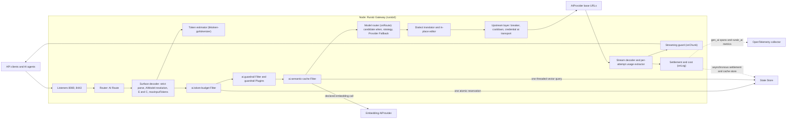
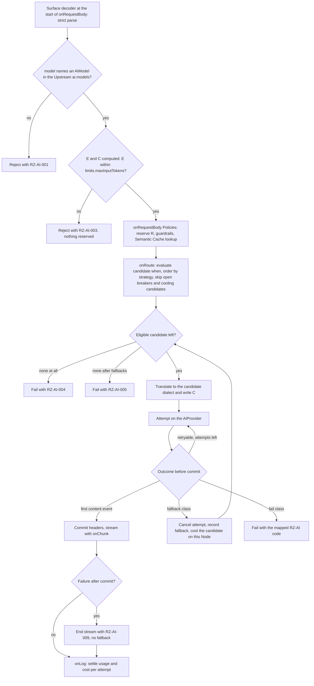
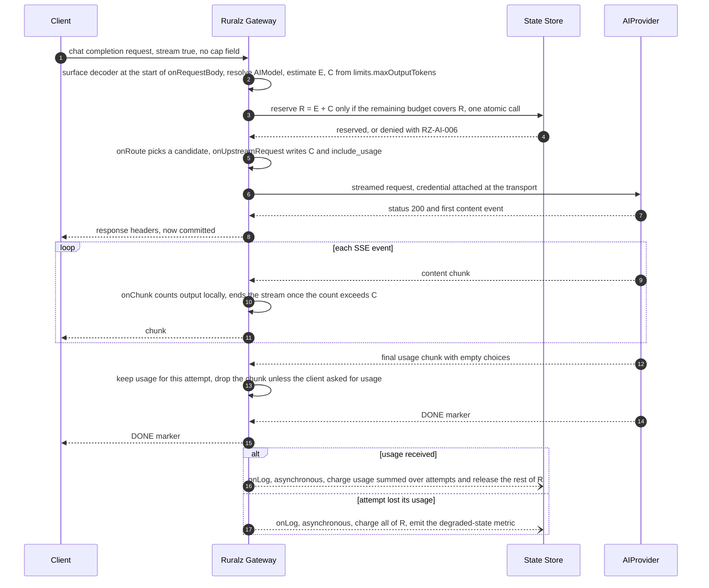
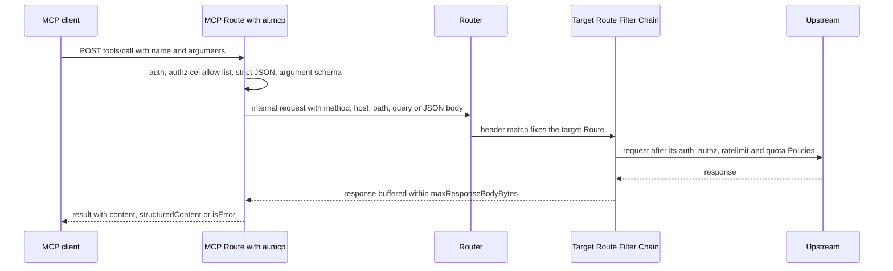

# AI/LLM Gateway

## Summary

This document designs differentiator (2), the AI/LLM gateway inside Ruralz Gateway: `AIProvider` and `AIModel`, an OpenAI-compatible façade beside native passthrough ([ADR-0014](../adr/0014-ai-api-surface.md)), model routing with Provider Fallback, token accounting, Token Budgets, cost attribution, Prompt Cache and Semantic Cache, guardrail hooks, the MCP and A2A stance, `gen_ai` telemetry and data residency routing. Provider-reported usage is authoritative, tokenizer counts are estimates only, and native passthrough edits bytes in place. Nothing is implemented; AI traffic is Planned (M3).

## Scope and non-goals

In scope: runtime behavior of `AIProvider`, `AIModel` and `protocol: ai` Upstreams, `config` semantics of the `ai.*` Policy types the [Configuration model](02-configuration-model.md#policy) registers, and the `RZ-AI` registry. "Pack 8.9" names a [foundation pack](../_meta/foundation-pack.md) section.

Non-goals:

- Kinds and fields, which the Configuration model owns.
- Hosting models, retrieval and evaluations ([Vision and positioning](../vision/01-vision-and-positioning.md) non-goal 4); also fine-tuning and invoicing.
- State Store bounds ([Scalability and distributed state](11-scalability-and-distributed-state.md)), error format ([Data plane](03-data-plane.md)), final metric names ([Observability](10-observability.md)) and the threat model ([Security and identity](08-security-and-identity.md)).
- Image, audio, video, file and batch provider APIs: Not planned; plain `http` Upstreams may carry them.

## Personas and scope

Per P8 ([Principles](../vision/01-vision-and-positioning.md#principles)), AI traffic is API traffic, governed by the same Policies, Consumers, Rate Limits, Quotas and State Store as every Route. Platform engineers start with routing, budgets and cost; developers with Unified API and caching; security engineers with guardrails and security.

### Capabilities and milestones

| Capability | Mechanism | Milestone |
|---|---|---|
| Façade (Chat Completions, embeddings, models) and native passthrough, streaming | `ai.surface` | Planned (M3) |
| Façade Responses API; native Bedrock InvokeModel | Same; OQ-ai-llm-gateway-3 | Planned (M4) |
| Model routing and Provider Fallback | `strategy`, `candidates` | Planned (M3) |
| Token accounting, Token Budgets, Rate Limits and Quotas | `ai.token-budget`, `ratelimit`, `quota` | Planned (M3) |
| Cost tracking and attribution | `pricing`, `ruralz ai cost` | Planned (M3) |
| Prompt Cache passthrough and Semantic Cache | `cache.prompt`, `ai.semantic-cache` | Planned (M3) |
| Guardrail hooks | `ai.guardrail`, `plugin` Policies | Planned (M3) |
| External guardrail detectors | Remote calls | Not planned: waits for OQ-wasm-plugin-system-5 option (b) |
| MCP gateway and MCP Server | Routes, Policies; proposed `ai.mcp` (OQ-ai-llm-gateway-10) | Planned (M3) |
| A2A-aware gateway | Routes, Policies | Planned (M5) |
| `gen_ai` telemetry, AI metrics, data residency routing | OpenTelemetry ([ADR-0010](../adr/0010-telemetry-opentelemetry-first.md)); `region`, candidate `when` | Planned (M3) |

## Unified API

An AI Route is a `Route` whose Upstream has `protocol: ai`: `ai.models` lists the `AIModel` resources clients may name in `model` (or the Bedrock or Gemini path segment), and `ai.surface` selects one of two surfaces ([ADR-0014](../adr/0014-ai-api-surface.md)). AI Routes buffer the request body within `maxRequestBodyBytes` ([Body buffering and limits](02-configuration-model.md#body-buffering-and-limits)), so every attempt stays replayable until commit.

```yaml
apiVersion: ruralz/v1alpha1
kind: Upstream
metadata:
  name: llm
spec:
  protocol: ai
  ai:
    surface: openai                   # OpenAI-compatible façade
    models: [{name: support-chat}]
---
apiVersion: ruralz/v1alpha1
kind: Upstream
metadata:
  name: claude-native
spec:
  protocol: ai
  ai:
    surface: native                   # provider wire format, edited in place
    models: [{name: claude-direct}]   # an AIModel whose candidates all use dialect anthropic
---
apiVersion: ruralz/v1alpha1
kind: Route
metadata:
  name: claude-messages
spec:
  match:
    hosts: ["api.shop.example"]
    path: {exact: /v1/messages}
    methods: [POST]
  policies:
    - name: apikey-partner
    - name: token-budget-daily
  upstreams:
    - name: claude-native
  timeout: 120s
```

### Surface decoder

The `ai` Upstream's surface decoder runs at the start of `onRequestBody`, before any `onRequestBody` Policy, so nothing is reserved for an invalid request (OQ-ai-llm-gateway-15). It parses strictly (`RZ-AI-002`), resolves `model` in `ai.models` (`RZ-AI-001`), computes C, and computes E only when `ai.token-budget`, `limits.maxInputTokens` (`RZ-AI-003`), `strategy: cost` or CEL reads it.

**Strict JSON.** Every `request.body` decode that CEL, a Policy or the decoder reads MUST reject invalid UTF-8 and repeated member names at any depth, compared byte for byte after unescaping, never case-insensitively, so no reader sees a different `model`, cap, `stream` or MCP `method`. A member equal to a recognized field (`model`, a cap field, `stream`, `stream_options`, `n`, `candidateCount`, `method`, `params`, `name`) under Unicode case folding but not exactly is `RZ-AI-002`, with fixtures per native API. Outside `ai` Upstreams this is 400 with an `RZ-RT` code proposed to [Data plane](03-data-plane.md) (OQ-ai-llm-gateway-16).

### OpenAI-compatible façade

With `surface: openai`, the Node accepts Chat Completions, streamed or not, embeddings and the model list. It decodes the body into one internal form, encodes it for the candidate's dialect, and translates the response back into OpenAI chunks ending with `data: [DONE]`; a feature the dialect cannot express, such as Bedrock `guardrailConfig`, is `RZ-AI-002`. A non-streamed response is a buffering gate within `maxResponseBodyBytes`, reserved from `maxBufferedBytes`; larger ones get 502 `RZ-AI-013` (trigger: OQ-ai-llm-gateway-16).

### Native passthrough

With `surface: native`, the client speaks the provider's own API, limited to the operations and query parameters in [Native APIs, caps and events](#native-apis-caps-and-events); others are `RZ-AI-002` before any credential is attached. The Node edits bytes in place and MUST NOT re-serialize the body from a typed schema. The only edits:

| Edit | When | Reason |
|---|---|---|
| Replace `model` or the model path segment | Always | Virtual to provider model |
| Write C into the cap field; remove other cap fields | Always | Token Budget bound (pack 8.9) |
| Set `stream_options.include_usage` | Streamed Chat Completions | Authoritative usage |
| Keep only `content-type`, `accept`, `anthropic-version` and the query parameters the API's row allows | Always, before credentials | No client credential, scope or field mask reaches a provider (opt-ins: OQ-ai-llm-gateway-14) |
| Replace matched strings in place | `ai.guardrail` redaction | No rebuilding |
| Remove explicit cache markers | `cache.prompt.mode: disabled` | Prompt Cache off |

Everything else, including unknown fields, key order and cache markers, passes unchanged; fixtures prove redaction keeps marker positions and `access_token`, `fields` and `key` never reach a provider. All candidates of an `AIModel` behind a native Upstream MUST share one dialect (code: OQ-ai-llm-gateway-3).

### Streaming

The façade streams SSE; native passthrough keeps each provider's framing (SSE, AWS event stream, NDJSON), one `onChunk` call per event, message or line.

For `ai` Upstreams, headers commit at the first content event (per API, below), never at `message_start`, `ping` or a usage-only chunk. Earlier events are held, reserved from `maxBufferedBytes`, and beyond 64 KiB (target) the attempt commits early; fallback on them belongs to `onUpstreamResponseHeaders`, and `onResponse` runs at commit (OQ-ai-llm-gateway-15). `perTryTimeout` bounds the wait, during which the client receives nothing (OQ-data-plane-10).

Gateway-added time to first token for bodies up to 16 KiB, excluding State Store, embedding, provider and estimator time: 1 ms or less at p99 (target); parsing, translation and estimation add per-KiB costs (hypothesis) that an M3 benchmark of `tiktoken-go/tokenizer` and the decoder measures ([Performance budgets and benchmarking](12-performance-budgets-and-benchmarking.md)).

### Components inside a Node

*Figure 1: AI gateway components inside Ruralz Gateway; dashed edges are asynchronous or telemetry.*



## AIProvider, AIModel and dialect translation matrix

An `AIProvider` is one provider account (`dialect`, `baseUrl`, `credentials.apiKey`, `region`, `pricing`). An `AIModel` maps a virtual model to ordered `candidates` (`provider`, `model`, `weight`, `when`) under a `strategy`, with `limits` and `cache` ([AIModel](02-configuration-model.md#aimodel)). Both kinds and `ruralz ai models` are Planned (M3). Wire facts as of 2026-09-23:

| `dialect` | Streaming | Usage fields | Prompt-cache support | Façade translation | Source |
|---|---|---|---|---|---|
| `openai` | SSE `data:` chunks ending `data: [DONE]`; typed events for Responses | Chat: final chunk with `choices: []`, only with `include_usage`; Responses: `response.usage` | Automatic; `prompt_cache_key`; `input_tokens_details.cached_tokens` | Model rewrite; C and `include_usage` written | ([source](https://github.com/openai/openai-python/blob/main/src/openai/types/chat/chat_completion_stream_options_param.py)) ([source](https://developers.openai.com/api/docs/guides/prompt-caching)) |
| `anthropic` | SSE `message_start`, `content_block_*`, `message_delta`, `message_stop`, `ping`, `error` | Input and cache fields in `message_start.message.usage`; cumulative `message_delta.usage` | Explicit `cache_control` (at most 4 breakpoints) or top-level automatic; TTL `5m` or `1h` | System messages to `system`, C to `max_tokens`, `cache_control` kept | ([source](https://platform.claude.com/docs/en/build-with-claude/streaming)) ([source](https://platform.claude.com/docs/en/build-with-claude/prompt-caching)) |
| `gemini` | SSE with `alt=sse` | `usageMetadata`: `promptTokenCount`, `candidatesTokenCount`, `cachedContentTokenCount`, `thoughtsTokenCount`, `toolUsePromptTokenCount` | Implicit (default from 2.5) plus explicit `cachedContents` | Native `generateContent` | ([source](https://ai.google.dev/api/generate-content)) ([source](https://ai.google.dev/gemini-api/docs/caching)) |
| `bedrock` | AWS event stream: `messageStart`, `contentBlockDelta`, `messageStop`, `metadata` | `metadata`: `inputTokens` (uncached only), `outputTokens`, `cacheReadInputTokens`, `cacheWriteInputTokens` | Converse `cachePoint`; InvokeModel `cache_control` for Claude; at most 4 | Converse; `cache_control` becomes `cachePoint` | ([source](https://docs.aws.amazon.com/bedrock/latest/APIReference/API_runtime_ConverseStream.html)) ([source](https://docs.aws.amazon.com/bedrock/latest/userguide/prompt-caching.html)) |
| `mistral` | SSE ending `data: [DONE]` | `usage` in the final message; cached-token field unconfirmed | `prompt_cache_key`; cached tokens billed at 10% | Model rewrite; OpenAI-shaped | ([source](https://docs.mistral.ai/api/)) |
| `ollama` | NDJSON; `stream` defaults to true | Final `done: true` object: `prompt_eval_count`, `eval_count` | None: `cache_control` unavailable on `/v1/messages` | Its `/v1/` surface with `include_usage` ([source](https://docs.ollama.com/api/openai-compatibility)) | ([source](https://docs.ollama.com/api/chat)) ([source](https://docs.ollama.com/api/anthropic-compatibility)) |

### Native APIs, caps and events

Each row allows the listed operations and query parameters, with fixtures for cap, commit event and usage source. A choice count above 1 (`n`, `candidateCount`) is `RZ-AI-002` on every Route.

| API | Operations forwarded | C written to | First content event | Usage source |
|---|---|---|---|---|
| Chat Completions (`openai`, `mistral`) | `POST /v1/chat/completions`, `/v1/embeddings`; `GET /v1/models` | `max_completion_tokens` (`openai`) or `max_tokens` (`mistral`), the other removed | First chunk with a `choices` delta | Final chunk |
| Responses (`openai`) | `POST /v1/responses` | `max_output_tokens` | First `response.*.delta` event | `response.usage` in `response.completed` ([source](https://github.com/openai/openai-python/blob/main/src/openai/types/responses/response_completed_event.py)) |
| Anthropic Messages | `POST /v1/messages`; `GET /v1/models` | `max_tokens`, which also bounds thinking | First `content_block_delta`: text, tool input or thinking | `message_start` plus the last `message_delta.usage` |
| Gemini | `models/{model}:generateContent`, `:streamGenerateContent`, `:embedContent`; `GET models`; query `alt` only | `generationConfig.maxOutputTokens` | First chunk with `candidates[].content.parts` | Last `usageMetadata` |
| Bedrock Converse | `POST /model/{modelId}/converse`, `/converse-stream` | `inferenceConfig.maxTokens` | First `contentBlockDelta` | `metadata` event |
| Bedrock InvokeModel, Planned (M4) | `POST /model/{modelId}/invoke`, `/invoke-with-response-stream`; Claude-family bodies only (OQ-ai-llm-gateway-3) | As Anthropic Messages | As Anthropic Messages | As Anthropic Messages |
| Ollama | `POST /api/chat`, `/api/embed`; `GET /api/tags` | `options.num_predict` | First object with `message` content | Final `done: true` object |

## Model routing

Model routing runs in `onRoute`. Body-dependent criteria choose only among the `AIModel`'s candidates, never another Route (pack section 4):

1. Evaluate each candidate's `when` (CEL over base variables and `ai`; [ADR-0011](../adr/0011-expressions-and-authorization-engines.md)); a runtime error skips it.
2. Order eligible candidates by `strategy`, skipping open breakers and cooling candidates, and attempt the first.

| `strategy` | Order of attempts | Signal |
|---|---|---|
| `fallback` | List order | None |
| `weighted` | First pick random by `weight`, then list order | `weight` |
| `latency` | Ascending time to first token | Node-local decaying average; 5% of first picks explore (hypothesis) |
| `cost` | Ascending estimated cost of E input plus C output tokens | `pricing`, unpriced last; priced candidates MUST share a currency, else list order (code: OQ-ai-llm-gateway-16) |

`retries` and `circuitBreaker` apply per candidate, so a request makes at most (`retries.attempts` + 1) x candidates attempts. Until OQ-ai-llm-gateway-16 registers a cap, Routes with `ai.token-budget` allow 2 attempts (target) and stop Provider Fallback with `RZ-AI-005` once the attempts' usage, counting R for an attempt without usage, reaches R.

### Provider Fallback

Provider Fallback moves a request to the next eligible candidate after a fallback-class failure, only before commit; after commit a failure ends the stream with `RZ-AI-009`, as in Agent Router ([source](https://github.com/envoyproxy/ai-gateway/releases)). Abandoned attempts are cancelled at once ([Settlement](#settlement)).

Fallback trigger matrix ("if exhausted" means no eligible candidate remains, `RZ-AI-005`):

| Error class | Example signals | Retry same candidate | Provider Fallback | Fail to client |
|---|---|---|---|---|
| Connect, TLS or reset before headers | `error.kind` | Yes, per `retryOn` | Yes, after retries | If exhausted |
| Provider rate limit | 429, `anthropic-ratelimit-*`; Bedrock `throttlingException` ([source](https://platform.claude.com/docs/en/api/rate-limits)) ([source](https://docs.aws.amazon.com/bedrock/latest/APIReference/API_runtime_ConverseStream.html)) | No; candidate cools until reset | Yes | If exhausted |
| Provider spend cap | Anthropic `enforced_spend_limit_reached`, no `retry-after` ([source](https://platform.claude.com/docs/en/api/rate-limits)) | No; candidate cools | Yes | If exhausted |
| Provider server error | 5xx | Yes, per `retryOn` | Yes | If exhausted |
| Timeout or stream error before content | `perTryTimeout`, Anthropic `error`, Bedrock `modelStreamErrorException` | No | Yes | If exhausted |
| Provider credential failure | 401 or 403 | No | Yes, alerting with `RZ-AUTH` | If exhausted |
| Context window exceeded | Input too long | No | Yes | If exhausted |
| Invalid request | Other 4xx | No | No | Yes, `RZ-AI-011` |
| Content-policy refusal | Safety block | No | No (OQ-ai-llm-gateway-14) | Yes, `RZ-AI-012` |
| Local decision | `RZ-AI-001`, `RZ-AI-003`, `RZ-AI-006`, `RZ-AI-010` | No | No | Yes, no provider call |
| Failure after commit | Reset, stream error, timeout | No | No | Stream ends, `RZ-AI-009` |

Cooldowns honor `retry-after` and reset headers; they and breakers stay Node-local (P3, P4), so in a brownout each Node pays about one failed attempt per cooldown (hypothesis).

*Figure 2: AIModel routing and Provider Fallback for one request.*



## Token accounting

### Authoritative usage and estimates

These rules implement [ADR-0014](../adr/0014-ai-api-surface.md) and pack 8.9 ([Token Budgets](../_meta/foundation-pack.md#89-token-budgets-adr-0014)):

1. Provider-reported usage is authoritative for settlement, cost and every export.
2. Tokenizer counts serve only E and the streaming guard, and are never billed.
3. C is the client's cap field, else `limits.maxOutputTokens` (larger values: OQ-ai-llm-gateway-1); R = E + C.

`tiktoken-go/tokenizer` embeds OpenAI encodings only ([source](https://pkg.go.dev/github.com/tiktoken-go/tokenizer)); Anthropic publishes no tokenizer ([source](https://platform.claude.com/docs/en/build-with-claude/token-counting)). So E uses `o200k_base` times the candidates' largest per-dialect correction (OQ-ai-llm-gateway-2), with no count endpoint on the request path. The estimator:

- counts incrementally and stops with `RZ-AI-003` once the count exceeds `limits.maxInputTokens`;
- counts as bytes divided by 3 (hypothesis) any pre-tokenized piece over 1 KiB (target) and, after a 256 KiB prefix (target) or a spent per-request CPU budget (target), the rest of the body;
- counts an inline media part as 1,500 tokens (hypothesis) and, on budgeted Routes, sets E to `limits.maxInputTokens` if any part is by reference (OQ-ai-llm-gateway-17).

### Streaming guard

The guard counts output in `onChunk` with the attempted candidate's correction, keeping a running count and a bounded tail for BPE boundaries. It ends the stream with `RZ-AI-008` once the count exceeds C (pack 8.9); a tolerance above C for tokenizer drift is proposed in OQ-ai-llm-gateway-15. Hidden reasoning is never streamed, so only the provider's cap bounds it.

### Streaming final-usage chunk

The extractor reads usage per attempt, in `onChunk` or `onUpstreamResponseBody` (scanning native bodies without buffering), with no State Store call, keeping each field's latest value, since `anthropic` `message_delta.usage` is cumulative. For `openai` Chat Completions the Node sets `include_usage` and hides the final chunk unless requested; "If the stream is interrupted, you may not receive the final usage chunk" ([source](https://github.com/openai/openai-python/blob/main/src/openai/types/chat/chat_completion_stream_options_param.py)). A client disconnect cancels the upstream request at once, since the provider keeps billing output.

*Figure 3: streaming token accounting with the final usage chunk (`openai` dialect, façade surface).*



### Settlement

`onLog` settles asynchronously, one cost record per attempt; rows 1 and 2 apply pack 8.9 per request:

| Outcome | Examples | Charge | Signal |
|---|---|---|---|
| Usage reported | Any attempt | That usage, summed over attempts; rest of R released | `ruralz_ai_settlements_total` |
| Attempt reached the provider, no usage read | Error status, `perTryTimeout`, stream error, interruption, client disconnect before or after commit, `RZ-AI-013` | All of R once per request, plus usage other attempts reported | `ruralz_ai_usage_missing_total` by reason |
| No provider attempt after reservation | Guardrail block, `RZ-AI-004`, Semantic Cache hit | All of R (pack 8.9); proposed: nothing (OQ-ai-llm-gateway-15; hits: OQ-ai-llm-gateway-5) | None |

OQ-ai-llm-gateway-15 also proposes R per attempt lacking usage, nothing without an attempt or for error statuses, and the larger of R and partial usage on interruption; none applies before it closes.

**Overshoot bound.** Under `failureMode: closed`, provider spend overshoots a budget by at most the sum of input-estimate errors across concurrent requests (hypothesis; SM-10 in [Success metrics](../vision/01-vision-and-positioning.md#success-metrics)), plus (attempts - 1) x R per concurrent request ([Model routing](#model-routing); hypothesis), plus, while OQ-ai-llm-gateway-17 is open, hidden reasoning above C on `gemini` and `ollama`. Under `open`, a State Store outage admits unmetered. A dropped settlement (pack 8.7) leaves R charged.

## Token-aware rate limits and budgets

### Token Budget

A Token Budget is an `ai.token-budget` Policy: Filter class admission, Phases `onRequestBody`, `onChunk` and `onLog`, Gateway or Route scope, default `failureMode: closed`. `config.consumerQuota` names a Consumer quota with `unit: tokens`; a reachable `AIModel` without `limits.maxOutputTokens` is RZ-CFG-034.

- **Admission:** one Lua script, using server `TIME`, reserves R only if the window's remaining budget covers it; otherwise 429 `RZ-AI-006` with `retry-after` at the window end.
- **Keys:** the hash tag is `{<SHA-256 of consumer.name>}`, as for `quota` in [Traffic management and resilience](09-traffic-management-and-resilience.md), so a Route's budgets reserve in one script, all or nothing (pack 8.7); settlement adjusts the reserving window, possibly past its limit.
- **Missing quota:** a null Consumer or one without the quota gets 403 `RZ-AI-007`, a decision, never `RZ-STS`.
- **Failures:** `closed` rejects a State Store failure with 503 `RZ-STS` and a CEL error with `RZ-AI-014`; `open` admits unmetered (default: OQ-configuration-model-8).

### Token-aware rate limits

A Consumer quota with `window: 1m` expresses tokens per minute, so per-minute and per-day limits are two Token Budgets in one script. Request floods stop earlier at `ratelimit`, Planned (M1), in `onRequestHeaders`: a local token bucket plus GCRA in the State Store, failing open by default ([ADR-0008](../adr/0008-rate-limiting-local-bucket-and-gcra.md)).

```yaml
apiVersion: ruralz/v1alpha1
kind: Consumer
metadata:
  name: partner-acme
spec:
  tier: gold
  credentials:
    apiKeys:
      - name: primary
        hash: "sha256:d1bec0f9342e5607570b2636ed0256023b13be7d7d4bb45e1bed3cfee80dc1b6"
  quotas:
    - name: minute-tokens
      unit: tokens
      limit: 200000
      window: 1m
    - name: daily-tokens
      unit: tokens
      limit: 2000000
      window: 24h
  tags: [partner, eu]
---
apiVersion: ruralz/v1alpha1
kind: Policy
metadata: {name: token-budget-minute}
spec:
  type: ai.token-budget
  failureMode: closed
  stateStoreTimeout: 30ms
  when: 'consumer != null && "minute-tokens" in consumer.quotas'
  config: {consumerQuota: minute-tokens}
---
apiVersion: ruralz/v1alpha1
kind: Policy
metadata: {name: token-budget-daily}
spec:
  type: ai.token-budget
  failureMode: closed
  stateStoreTimeout: 30ms
  config: {consumerQuota: daily-tokens}
---
apiVersion: ruralz/v1alpha1
kind: Policy
metadata: {name: ratelimit-ai}
spec:
  type: ratelimit
  config:
    key: 'consumer == null ? source.ip : consumer.name'
    limits: [{requests: 20, window: 1s}]
---
apiVersion: ruralz/v1alpha1
kind: Route
metadata:
  name: support-chat
spec:
  match:
    hosts: ["api.shop.example"]
    path: {exact: /v1/chat/completions}
    methods: [POST]
  policies:
    - name: apikey-partner
    - name: ratelimit-ai
    - name: token-budget-minute
    - name: token-budget-daily
  upstreams:
    - name: llm
  timeout: 120s
```

Tier-specific budgets use exclusive `when` expressions on `consumer.tier`. Per-model sub-caps need `ai` in `Policy.spec.when` (OQ-ai-llm-gateway-8); shared or currency budgets are OQ-ai-llm-gateway-7.

## Cost tracking and attribution

Every attempt with provider usage and a matching `pricing.models` entry gets a cost in the `AIProvider`'s `pricing.currency` (ISO 4217):

```text
cost = ( inputTokens           x inputPerMillionTokens
       + cacheReadInputTokens  x cachedInputPerMillionTokens
       + cacheWriteInputTokens x inputPerMillionTokens
       + outputTokens          x outputPerMillionTokens ) / 1,000,000
```

- `inputTokens` counts uncached input, including Gemini `toolUsePromptTokenCount`; cached tokens reported as a subset of prompt tokens are subtracted (fixtures).
- `outputTokens` includes separately reported reasoning, such as Gemini `thoughtsTokenCount`.
- Without `cachedInputPerMillionTokens`, cache reads use the input rate. Cache writes use the input rate until a write price exists (OQ-ai-llm-gateway-6), so records from providers billing writes above input, such as Anthropic ([source](https://platform.claude.com/docs/en/build-with-claude/prompt-caching)) and OpenAI GPT-5.6 and later ([source](https://developers.openai.com/api/docs/guides/prompt-caching)), carry an `approximate` flag.
- Prices are decimal strings in fixed-point arithmetic, never floats; currencies are never converted.

**Versioning.** `pricing.version` is required with `pricing`; a price change is a new Revision whose `ruralz bundle diff` carries impact `ai`. Cost records carry the Revision digest, `AIProvider`, `pricing.version`, currency and provider model, so re-pricing is offline. No Revington service supplies prices.

**Attribution.** Usage records carry Consumer, Tier, Route, `AIModel`, provider, provider model, Revision and currency; metrics omit Consumer. `ruralz ai cost`, Planned (M3), aggregates usage records (OQ-ai-llm-gateway-13). Unpriced requests still record usage and increment `ruralz_ai_unpriced_requests_total`.

## Prompt caching and semantic caching

### Prompt Cache

The Prompt Cache is provider-side, set by `AIModel.spec.cache.prompt.mode` (`passthrough` or `disabled`).

**Guarantee.** Unless `cache.prompt.mode: disabled` is set, native passthrough MUST deliver every Anthropic `cache_control` block, including a top-level automatic one, unchanged in position, `type` and `ttl`, and likewise Bedrock `cachePoint`, `prompt_cache_key` and Gemini `cachedContent` references. Rebuilding bodies from typed schemas has dropped such markers ([source](https://github.com/BerriAI/litellm/issues/41424)). Conformance tests verify it in 100% of cases (target; SM-11).

**Façade.** The façade accepts `cache_control` on content parts and the request, as an extension:

| Target dialect | Façade behavior |
|---|---|
| `anthropic` | Forwarded as `cache_control` on the mapped block |
| `bedrock` (Claude models) | Converted to `cachePoint` |
| `openai`, `mistral` | Dropped, since caching is automatic; a client `prompt_cache_key` is forwarded (isolation: OQ-ai-llm-gateway-19) |
| `gemini` | Dropped; implicit caching applies |
| `ollama` | Dropped; no prompt cache |

Dropped markers increment `ruralz_ai_cache_markers_dropped_total`; `disabled` cannot switch off implicit provider caching.

### Semantic Cache

A Route caches only with an `ai.semantic-cache` Policy (Filter class cache, Route scope, default `failureMode: open`), using the selected `AIModel`'s `cache.semantic`. Requests with tool results or prompts over the embedding limit bypass it.

1. **Embed** through an embedding `AIProvider`, a declared remote call with timeout and `failureMode` (pack 8.7; fields: OQ-ai-llm-gateway-5); under `closed` a failure is `RZ-AI-014`.
2. **Look up** with one threaded command on dedicated connections, never a script (proposed, OQ-ai-llm-gateway-18): `VSIM` with `COUNT 1`, `WITHATTRIBS`, a bounded `EF` and a timestamp `FILTER` on Redis Vector Sets ([source](https://redis.io/docs/latest/commands/vsim/)), or a nearest-neighbor `FT.SEARCH` returning the completion field on valkey-search ([source](https://github.com/valkey-io/valkey-search)). A per-Node cap on concurrent embedding calls and lookups bypasses the cache when reached.
3. **Hit:** at or above `similarityThreshold`, the Filter replays the completion, as SSE if requested; output guardrails check it whole in `onResponse` before commit.
4. **Miss:** the tee copies what the client receives and stores it through the bounded queue, skipping errors, truncated streams and blocks.

**Partitions.** On a Route with an auth-class Policy, every partition includes the principal, as [Security and identity](08-security-and-identity.md) requires against T10 and T13: `consumer.name`, else `auth.method` with `iss` and `sub` or the certificate subject; `config.key` only adds dimensions. Sharing across principals needs the opt-out field of OQ-security-and-identity-25; without an auth-class Policy nothing is cached. Partitions also split by Route, surface, `AIModel`, embedding model, and a digest of tools, response format, guardrail Policies, sampling parameters and C; values off a fixed grid (target) bypass the cache.

**Storage (proposed, OQ-ai-llm-gateway-18).** A principal's keys share one hash tag, so one store script adds the entry and enforces caps of 10,000 entries per partition and of entries and bytes per principal (targets). The timestamp and completion, at most 32 KiB (target), sit in Vector Set attributes or a valkey-search hash with a native TTL; a sorted set orders entries for trimming. Each store refreshes `PEXPIRE` to `cache.semantic.ttl` on the partition's keys, so idle partitions vanish within one TTL, and trims at most 64 entries (target). Stores are skipped and counted for larger completions, at a cap, above a per-Node store rate (target) or above a memory watermark (target), bounding memory by store rate times TTL times entry size (hypothesis). Lookups SHOULD take 5 ms or less at p99 (target).

On valkey-search, each Node issues `FT.CREATE` per `AIModel`, embedding model and dimension at Revision activation; until then, and without vector search (Dragonfly), the Policy acts as a State Store failure. It needs Redis 8.4.6 or newer ([source](https://redis.io/docs/latest/operate/oss_and_stack/stack-with-enterprise/release-notes/redisce/redisos-8.4-release-notes/)), or valkey-search 1.2 on Valkey 9.0.1 or newer ([source](https://github.com/valkey-io/valkey-search/releases)).

## Guardrail hooks

The built-in `ai.guardrail` type (Filter class validation, Gateway or Route scope, default `failureMode: closed`) runs pattern and deny-list detectors (`config`: OQ-ai-llm-gateway-4). Validation-class `plugin` Policies run detectors under Plugin ABI v1 ([ADR-0005](../adr/0005-plugin-abi-v1.md)), which has no outbound calls ([WASM plugin system](05-wasm-plugin-system.md)); external detectors wait for OQ-wasm-plugin-system-5 option (b).

| Phase | Input seen | Actions |
|---|---|---|
| `onRequestBody` | Inline text parts, including tool results | Block (400, `RZ-AI-010`), redact in place before routing and caching, flag |
| `onChunk` | Each output chunk with a bounded sliding window | End the stream (`RZ-AI-010` error event), redact a held-back chunk, flag |
| `onResponse` | Whole non-streamed or replayed completion | Replace with an error before commit, redact, flag |
| `onLog` (Plugins only) | Usage, decisions, sizes | Audit only |

**Coverage.** Built-in detectors inspect only inline text. Inline media, by-reference parts (file IDs, `cachedContent`, stored conversations) and provider server tools fetching remote content escape inspection, so a Route whose `ai.guardrail` blocks rejects them with `RZ-AI-002` unless its `config` allows them (OQ-ai-llm-gateway-4); per-dialect recognition is OQ-ai-llm-gateway-20. Injection through allowed parts or provider-fetched content remains a residual T20 risk.

A block is a decision (`RZ-AI-010`), never `RZ-STS`. A Plugin trap or limit applies `failureMode` with an `RZ-PLG` code, a CEL error with `RZ-AI-014`: under `closed`, 503 in `onRequestBody`, 502 in `onResponse` and a stream end in `onChunk` (pack 8.10). `onChunk` guardrails see partial text, so a late violation truncates a stream (buffered mode: OQ-ai-llm-gateway-4). Provider-side guardrails such as Bedrock `guardrailConfig` pass through natively; Ruralz hosts no classifier and never executes tool calls.

## MCP and A2A stance

MCP and A2A are agent traffic over HTTP (JSON-RPC, SSE), so P7 and P8 apply: Routes, Policies, Consumers and the State Store.

| Capability | Ruralz plan | Milestone |
|---|---|---|
| MCP gateway | Streamable HTTP and SSE servers behind Routes and `http` Upstreams; auth Policies; `authz.cel` allow lists; per-client affinity through `ring-hash` on `consumer.name` ([Sessions and affinity](#mcp-server)) | Planned (M3) |
| MCP Server: tools generated from existing Routes | A proposed `ai.mcp` Policy on its own Route ([MCP Server](#mcp-server)), OQ-ai-llm-gateway-10 option (a) | Planned (M3) |
| stdio MCP servers | A network gateway does not spawn local processes | Not planned |
| A2A traffic as plain HTTP and SSE | Ordinary Routes | Planned (M3) |
| A2A-aware gateway | Agent cards, per-skill authorization, usage attribution | Planned (M5) |

```yaml
apiVersion: ruralz/v1alpha1
kind: Policy
metadata: {name: mcp-tool-allowlist}
spec:
  type: authz.cel
  config:
    rule: >-
      request.body.method in ["initialize", "notifications/initialized", "ping", "tools/list"]
      || (request.body.method == "tools/call"
          && request.body.params.name in ["search_orders", "get_order"])
```

Unknown methods, batches, `GET` streams, `DELETE` and client responses are denied, so resources, prompts, sampling and elicitation need rules. The allow list is no security control until strict JSON ([Surface decoder](#surface-decoder)) covers MCP Routes, since a repeated `params.name` could show CEL one tool and the server another (OQ-ai-llm-gateway-16). A2A-aware features wait for M5 because the wire format still moves: LiteLLM serves A2A 0.3 or 1.0 per agent ([source](https://docs.litellm.ai/docs/a2a)).

### MCP Server

Proposed answer to OQ-ai-llm-gateway-10, option (a), and so to OQ-vision-and-positioning-12: a built-in `ai.mcp` Policy type that turns one Route into an MCP Server whose tools are existing Routes. It is submitted as a pack section 10 amendment through that Open question (pack section 14), and the Configuration model registers its `config` as authored here (OQ-configuration-model-9). Until then it is no registered type, so no example Bundle uses it. KrakenD EE declares each tool with its own input and output schemas and an upstream workflow ([source](https://www.krakend.io/docs/enterprise/ai-gateway/mcp-server/)); `ai.mcp` instead points each tool at a Route, so every call runs that Route's Policies.

| Registry column | Proposed value |
|---|---|
| Filter class | transform, so the MCP Route's auth, authz (such as the tool allow list above), admission and validation Policies run first |
| Phases | `onRequestHeaders` (method and header checks) and `onRequestBody` (JSON-RPC); both short-circuit (pack section 4) |
| Scopes | R only. The Route sets neither `upstreams` nor `composition`; the amendment makes that legal only with `ai.mcp` attached |
| Slot | `mcp` |
| `failureMode` | closed; closed only |
| Planned | Planned (M3) |

| `config` field | Type | Meaning |
|---|---|---|
| `serverName` | string, required | `serverInfo.name` in the `initialize` result |
| `instructions` | string | Optional `instructions` in the `initialize` result |
| `tools` | `orderedMap` keyed by `name`, required | Tools, in `tools/list` order |
| `tools[].name` | string, required | MCP tool name, unique within the Policy |
| `tools[].route` | Route reference, required | Target Route; a missing one is RZ-CFG-009 |
| `tools[].method` | string | HTTP method; default: the target Route's only `match.methods` entry |
| `tools[].description` | string, required | Description the model reads |
| `tools[].inputSchema` | JSON Schema (draft 2020-12) object | Inline schema whose root is `type: object` |
| `tools[].inputSchemaFrom` | `openapi` | The operation schema `ruralz bundle export openapi` emits for that Route and method: template captures, query parameters and the body schema of an attached `validation.json-schema` Policy, materialized into the canonical form at render so the Revision digest covers it |
| `tools[].outputSchema` | JSON Schema object | Optional; listed in `tools/list`, and a 2xx JSON body that validates is also returned as `structuredContent` |

Each tool has exactly one of `inputSchema` or `inputSchemaFrom` (RZ-CFG-005). A target Route qualifies only when a request can match it on headers alone: its `listeners` include the MCP Route's listener, `match.hosts` has an entry without `*.`, `match.path` is `exact` or `template`, and it sets no `headers`, `when`, `grpc`, `graphql` or `topic`. It uses `http` Upstreams or `composition` and carries no `ai.mcp` Policy, so dispatch never nests. Any other target is a new RZ-CFG code (OQ-ai-llm-gateway-10).

**Messages.** `ai.mcp` answers every `POST` with one JSON body, never an SSE stream, decoding it with [strict JSON](#surface-decoder):

| Message | Answer |
|---|---|
| `initialize` | A protocol version from those the release pins, `capabilities.tools.listChanged: false`, `serverInfo` (`serverName`, and the Revision's `rev-<12 hex>` as version) and `instructions`; no `Mcp-Session-Id` |
| `ping` | Empty result |
| `tools/list` | Every tool of the active Revision's compiled table in one page, without `nextCursor`: `name`, `description`, the input schema and any `outputSchema` |
| `tools/call` | Dispatch, below |
| Notifications, such as `notifications/initialized` and `notifications/cancelled` | 202 with no body |
| Any other method | JSON-RPC error -32601 with `RZ-AI-002` in `error.data` |
| `GET` and `DELETE` | 405: there is no server stream and no session to end |
| Malformed JSON, a batch or a non-JSON-RPC body | 400, `RZ-AI-002` |

**Dispatch.** For `tools/call`, `ai.mcp` validates `params.arguments` against the tool's schema (JSON-RPC error -32602 with `RZ-AI-002` for an unknown tool or failing arguments). It then builds an internal request: the tool's method, the first `match.hosts` entry as host, the Route's path with template captures filled from same-named arguments (percent-encoded), and the remaining arguments as query parameters for `GET` and `DELETE`, otherwise as a JSON body. It copies only `Authorization`, the target Route's `auth.api-key` `header`, `traceparent`, the client address and the connection's verified client certificate, so the target Route's auth Policies authenticate the same caller and a tool never grants what that Route would refuse them.

The Router matches the internal request on headers like any request, so its Route is fixed before `onRequestHeaders` (pack section 4) and the MCP Route never re-routes. The target Route's whole Filter Chain runs: Gateway and Route Policies (auth, authz, Rate Limits, Quotas, Token Budgets), Upstream Policies and its own access-log record and child span. The internal request crosses no listener or network, and the earlier of both Routes' `timeout` bounds it; its request path is proposed to [Data plane](03-data-plane.md) under OQ-ai-llm-gateway-10. A `ratelimit` on both Routes counts one call twice, by design.

The target's response is a buffering gate within `maxResponseBodyBytes`. A 2xx response becomes a result whose `content` is one text part holding the body, plus `structuredContent` when `outputSchema` validates it. Any other status, including the target Route's 401, 403 or 429 and its `RZ-*` code, becomes a result with `isError: true` carrying status and body, so the model sees the refusal; an oversized body is `isError` with 502. A client disconnect cancels the internal request.

*Figure 4: `tools/call` dispatch from the MCP Server Route onto a target Route.*



**Sessions and affinity.** The MCP Server is stateless: it never issues `Mcp-Session-Id` and keeps no session state, so any Node answers any message and no affinity applies. During a Rollout, consecutive messages may reach Nodes on different Revisions, so `tools/list` may come from either, and a `tools/call` naming a tool the serving Revision lacks gets -32602. Behind the MCP gateway, sessions belong to the proxied server: `ring-hash` on `consumer.name` keeps a Consumer's sessions on one Endpoint while Endpoints are stable. A session moved by an Endpoint change gets that server's 404, on which the MCP client starts a new session, so no State Store session map is needed.

## AI observability

Telemetry is OpenTelemetry-first ([ADR-0010](../adr/0010-telemetry-opentelemetry-first.md)); each attempt is a `ruralz.upstream.<name>` span with `gen_ai.provider.name` and `gen_ai.usage.*` attributes ([source](https://github.com/open-telemetry/semantic-conventions-genai/blob/main/docs/gen-ai/gen-ai-spans.md)); the server span carries the virtual model and fallback chain; content attributes such as `gen_ai.input.messages` are off by default. They have no tagged release ([source](https://github.com/open-telemetry/semantic-conventions-genai)), so each release pins a commit (OQ-ai-llm-gateway-11) and `ruralz_ai_*` metrics are the stable contract.

[Observability](10-observability.md#ai-metrics) owns AI metric names, types and labels; model labels are `aimodel`, `provider` and `model`. New proposals: `ruralz_ai_abandoned_attempts_total` and `ruralz_ai_failed_attempts_total` (Counter; `provider`, `model`), `ruralz_ai_semantic_cache_store_skipped_total` (Counter; `route`, `reason`), and `reason` values `abandoned`, `error_status` and `oversized` on `ruralz_ai_usage_missing_total`.

The access log adds Consumer, candidate chain, per-attempt usage and cost, and cache and guardrail results, never prompt or completion text.

### RZ-AI error codes

| Code | Meaning | Status or signal |
|---|---|---|
| RZ-AI-001 | `model` is not an `AIModel` in the Upstream's `ai.models` | 404 |
| RZ-AI-002 | Invalid, ambiguous or untranslatable body; disallowed operation, parameter, field, part or server tool | 400 |
| RZ-AI-003 | Estimated input exceeds `limits.maxInputTokens` | 400 |
| RZ-AI-004 | No eligible candidate before any attempt | 503 |
| RZ-AI-005 | Provider Fallback exhausted | 503 when every failure was a rate limit, else 502 |
| RZ-AI-006 | Token Budget cannot cover the reservation | 429 with `retry-after` |
| RZ-AI-007 | Consumer missing or lacks the named token quota | 403 |
| RZ-AI-008 | Streaming guard: local output count exceeded C | Error event, stream ends |
| RZ-AI-009 | Provider failure after commit | Error event, stream ends |
| RZ-AI-010 | Guardrail block | 400 before commit; error event after |
| RZ-AI-011 | Provider rejected the request as invalid | 400 |
| RZ-AI-012 | Provider content-policy refusal | 400 |
| RZ-AI-013 | Non-streamed provider response exceeds `maxResponseBodyBytes` | 502 |
| RZ-AI-014 | An AI Policy could not decide (CEL error, failed declared remote call) under `failureMode: closed` | 503 before commit; 502 in `onResponse`; error event in `onChunk` |

## Security and data residency routing

### Credentials and trust boundaries

Provider keys exist only as `credentials.apiKey` `secretRef` values, never in a Revision, `/config/dump` or a log, and rotate without a Rollout. The Node attaches them at the transport after the last `onUpstreamRequest` Filter, so no Filter, Plugin, CEL expression, `/tap`, log or span sees them; Upstream-scoped Policies on an `ai` Upstream MUST NOT read or set credential headers (code: OQ-ai-llm-gateway-16). Bedrock API keys are bearer tokens governed by `bedrock:CallWithBearerToken` ([source](https://docs.aws.amazon.com/bedrock/latest/userguide/api-keys.html)); SigV4 is OQ-ai-llm-gateway-12.

Per [Trust boundaries](01-system-overview.md#trust-boundaries), on TB-3 every `AIProvider` `baseUrl`, `ollama` included, MUST use TLS, and `http://` fails validation. Semantic Cache entries may hold personal data, so TB-4 needs TLS and authentication. TB-12 carries no prompt content, and `ruralz dev tap`, Planned (M1), SHOULD show AI bodies only as sizes and token counts.

**Shared provider accounts.** Consumers behind one `AIProvider` share its prompt cache and resources, so cached-token counts, time to first token and `cachedContents` IDs can leak across them (T13). Until OQ-ai-llm-gateway-19 closes, isolated tenants use separate accounts, and per-call server tools are `RZ-AI-002` on budgeted Routes.

### Data residency routing

`AIProvider.spec.region` records where a provider processes data. Candidate `when` expressions over Consumer tags route by residency; Provider Fallback never reaches a candidate whose `when` is false, so the request fails with `RZ-AI-004`, or `RZ-AI-005` after a failed attempt, rather than leave its Region, and a null-Consumer guard fails anonymous requests closed. As [Security and identity](08-security-and-identity.md#compliance) requires (T21), residency terms MUST read only Consumer tags, Tier and `route`, never `request`, `auth.claims` or `ai`, which may only narrow them with `&&`; `ruralz bundle audit` reports violations (OQ-ai-llm-gateway-9).

```yaml
apiVersion: ruralz/v1alpha1
kind: AIProvider
metadata:
  name: bedrock-eu
spec:
  dialect: bedrock
  baseUrl: https://bedrock-runtime.eu-central-1.amazonaws.com
  credentials:
    apiKey: {secretRef: {provider: file, name: /etc/ruralz/ai/bedrock-eu-key}}   # Bedrock API key
  region: eu
  pricing:                                  # illustrative values, not vendor quotes
    currency: EUR
    version: "2026-09-01"
    models:
      - model: example.claude-model-id
        inputPerMillionTokens: "2.80"
        outputPerMillionTokens: "14.00"
        cachedInputPerMillionTokens: "0.28"
---
apiVersion: ruralz/v1alpha1
kind: AIModel
metadata:
  name: support-chat
spec:
  strategy: fallback
  candidates:
    - name: eu-primary
      provider: bedrock-eu
      model: example.claude-model-id
      when: 'consumer != null && "eu" in consumer.tags'
    - name: us-primary
      provider: anthropic-prod
      model: claude-sonnet-4-5
      when: 'consumer != null && !("eu" in consumer.tags)'
    - name: us-secondary
      provider: openai-prod
      model: gpt-4.1-mini
      when: 'consumer != null && !("eu" in consumer.tags) && ai.estimatedInputTokens < 100000'
  limits: {maxInputTokens: 32000, maxOutputTokens: 2048}
  cache:
    prompt: {mode: passthrough}
    semantic: {similarityThreshold: 0.92, ttl: 1h}
```

Residency routing covers only the generation provider; access logs and telemetry follow the serving Node's Region, to which operators steer clients (pack 8.13). Against T21, each `ai.semantic-cache` embedding provider MUST be in the Region of the residency class its `when` selects, and a request whose class differs from the Node's Region MUST NOT use the Semantic Cache for lookup or store: it is served uncached or fails closed with an `RZ-AI` code. Until OQ-ai-llm-gateway-9 supplies a Node Region input, a Route whose candidates split on residency MUST NOT attach `ai.semantic-cache`, and `ruralz bundle audit` reports any that does; `support-chat` attaches none.

## Open questions

| ID | Question | Options | Owner | Blocking? |
|---|---|---|---|---|
| OQ-ai-llm-gateway-1 | How is a client cap above `limits.maxOutputTokens` handled? | (a) Clamp C (proposed); (b) reject with 400; (c) accept, as pack 8.9 reads literally | ai-llm-gateway | No |
| OQ-ai-llm-gateway-2 | How are non-OpenAI estimates corrected (also OQ-tech-stack-and-libraries-11, OQ-vision-and-positioning-15)? | (a) Per-`AIProvider` ratio field; (b) count endpoints as declared remote calls; (c) (a), calibrated offline from (b) | ai-llm-gateway | Yes, for Token Budget accuracy (SM-10) |
| OQ-ai-llm-gateway-3 | Which code rejects mixed dialects behind `surface: native`, and may InvokeModel carry Claude-family bodies? | (a) New RZ-CFG code, no InvokeModel; (b) code plus InvokeModel (proposed); (c) runtime rejection only | configuration-model | Yes, for native passthrough |
| OQ-ai-llm-gateway-4 | What is the `ai.guardrail` `config` schema? | (a) `detectors[]`, `action` (`block`, `redact`, `flag`), `streaming` (`incremental`, `buffer`), allowed uninspected parts and server tools (proposed); (b) (a) plus remote detectors; (c) Plugins only | ai-llm-gateway | Yes, for guardrail hooks |
| OQ-ai-llm-gateway-5 | Where is the embedding call declared, what sets the dimension, and are hits charged? | (a) `config.embedding`, hits free (proposed); (b) on `cache.semantic`, hits charged; (c) (a), charging selectable | ai-llm-gateway | Yes, for Semantic Cache |
| OQ-ai-llm-gateway-6 | Should `pricing` gain cache-write and server-tool prices, and `cache.prompt.mode` default to `passthrough`? | (a) Both (proposed); (b) default only; (c) neither | configuration-model | No |
| OQ-ai-llm-gateway-7 | How are shared or currency budgets expressed? | (a) CEL `key` and limit on `ai.token-budget`; (b) quota `unit: currency`; (c) both | ai-llm-gateway | No |
| OQ-ai-llm-gateway-8 | Should CEL gain `ai` in `Policy.spec.when` and `region` in candidate `when`? | (a) Both; (b) `ai` only; (c) neither, use separate Routes | configuration-model | No |
| OQ-ai-llm-gateway-9 | How is residency proven at validation, including embedding, cache, log and telemetry crossings? | (a) Allowed Regions on `AIModel` and embedding, plus a Node Region input (Security and identity chose it); (b) Route constraint; (c) `ruralz bundle audit` of CEL, including client-controlled residency terms | security-and-identity | Yes, for data residency routing |
| OQ-ai-llm-gateway-10 | What surface do the MCP gateway and MCP Server take (answers OQ-vision-and-positioning-12), with per-session affinity? | (a) Routes, `authz.cel` and `consumer.name` affinity for the gateway; a sessionless MCP Server through a built-in `ai.mcp` type ([MCP Server](#mcp-server)), amending pack section 10 and the Route `upstreams` rule, with an internal request path in Data plane and a new RZ-CFG code for unqualified target Routes (proposed); (b) Plugins only; (c) a new kind | ai-llm-gateway | Yes, for MCP Server |
| OQ-ai-llm-gateway-11 | Which `semantic-conventions-genai` commit does each release pin, and may content be captured? | (a) Pin, never capture; (b) pin, opt-in field; (c) `ruralz_ai_*` only | observability | No |
| OQ-ai-llm-gateway-12 | How is Bedrock SigV4 configured (after OQ-tech-stack-and-libraries-17)? | (a) `AIProvider` fields; (b) `auth.upstream-sigv4`; (c) Bedrock API keys only | security-and-identity | Yes, for SigV4 Bedrock |
| OQ-ai-llm-gateway-13 | What data source does `ruralz ai cost` read? | (a) Access-log usage records; (b) metrics; (c) Ruralz Control aggregation | cli-and-api-surface | No |
| OQ-ai-llm-gateway-14 | Should content-policy fallback, client provider keys, or organization, project and beta headers be opt-ins? | (a) None (current); (b) fallback and beta headers; (c) all | security-and-identity | No |
| OQ-ai-llm-gateway-15 | Should pack 8.9 and the System overview adopt the decoder in `onRequestBody`, commit at the first content event, a guard tolerance above C, charging R per attempt that lacks usage with an overshoot term for extra attempts (SM-10), release of R without an attempt or on error statuses, and the larger of R and partial usage on interruption? | (a) Amend both, with System overview Figure 3 (proposed); (b) an ADR amending ADR-0014; (c) keep the text | system-overview | Yes, for token accounting |
| OQ-ai-llm-gateway-16 | Which AI registrations do the Configuration model and Data plane add? | (a) RZ-CFG codes for mixed-currency `cost`, credential-header Policies and `http://` base URLs; an attempt cap; the response-side buffering trigger; strict JSON for CEL `request.body` (proposed); (b) codes only; (c) runtime checks | configuration-model | Yes, for native passthrough and the MCP gateway |
| OQ-ai-llm-gateway-17 | How are non-text and by-reference inputs estimated, and is hidden reasoning capped for `gemini` and `ollama`? | (a) Reject by-reference inputs on budgeted Routes; (b) E set to `limits.maxInputTokens`, a constant per media part (proposed); (c) count endpoints | ai-llm-gateway | Yes, for Token Budget accuracy |
| OQ-ai-llm-gateway-18 | Which lookups, caps, eviction policy and deployment bound the Semantic Cache, given that under `noeviction` a full deployment fails every `closed` Token Budget in the Cell? | (a) Threaded lookups, the caps above, `noeviction`, a memory ceiling with an alert (proposed); (b) a separate State Store deployment for vectors; (c) evict only keys with TTLs | scalability-and-distributed-state | Yes, for Semantic Cache |
| OQ-ai-llm-gateway-19 | How are provider caches, resources and per-call server tools isolated per Consumer on a shared account? | (a) Separate accounts, server tools rejected on budgeted Routes (current); (b) a Consumer-derived `prompt_cache_key`, foreign resource IDs rejected; (c) cached-token counts hidden | security-and-identity | No |
| OQ-ai-llm-gateway-20 | How does the Node recognize server tools and by-reference parts per dialect? | (a) Per-dialect function-tool and inline-part shapes, anything else rejected (proposed); (b) a list of known server tools; (c) a Native APIs table column | ai-llm-gateway | Yes, for guardrail hooks |
