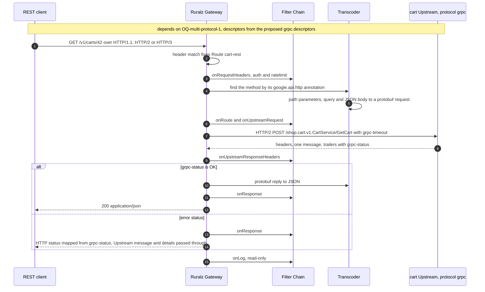
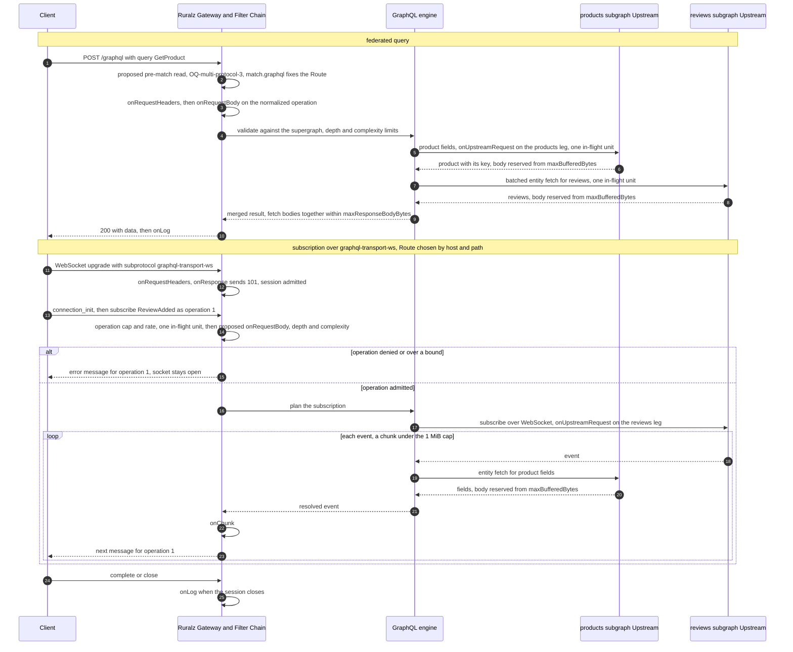
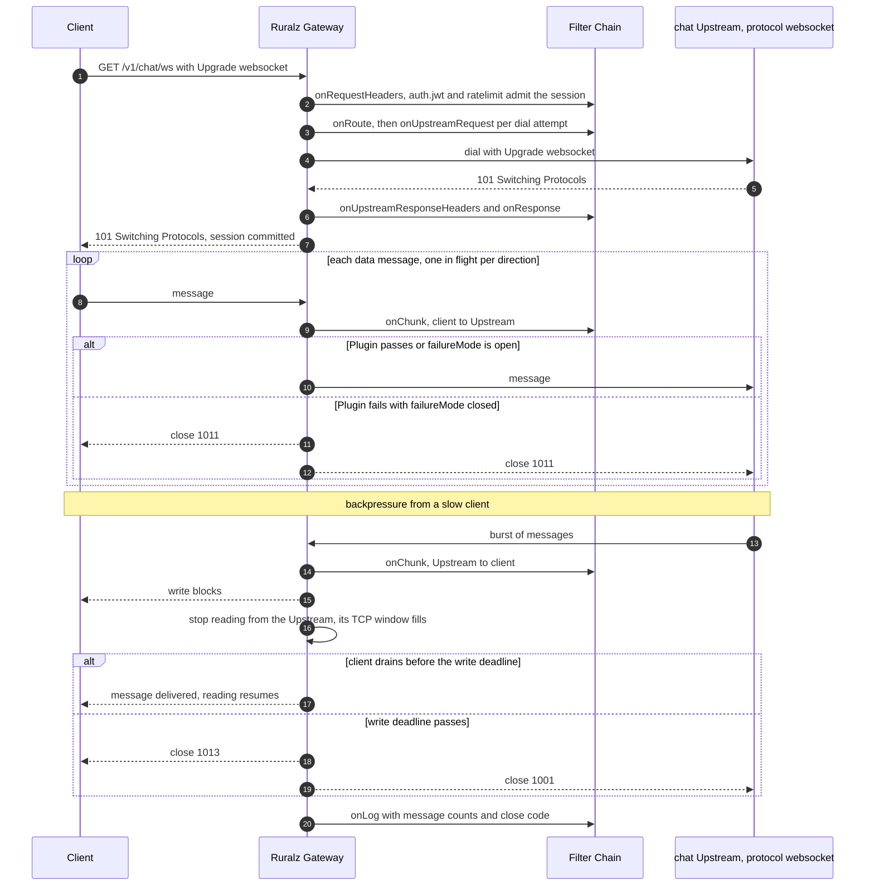
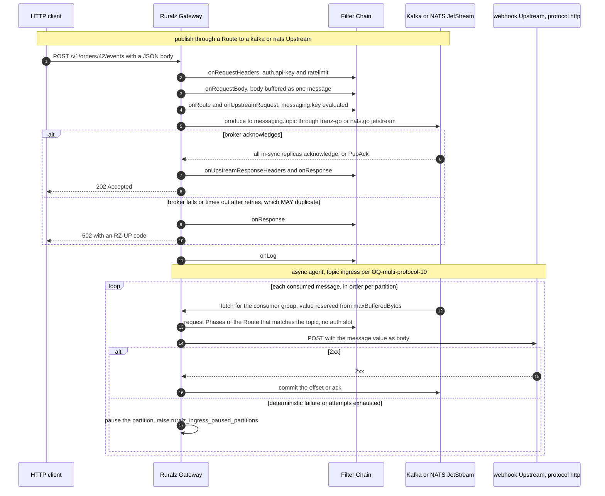

# Multi-Protocol Support

## Summary

This document decides how Ruralz Gateway carries HTTP/1.1, HTTP/2, HTTP/3, gRPC, GraphQL, WebSocket, Server-Sent Events, Kafka, NATS JetStream and MQTT through a `Route` match, an `Upstream` `protocol` and the fixed Filter Chain. It fixes the protocol matrix, libraries, Phase mapping, limits and wire-proxy stance: no Kafka wire proxying before M4; embedded MQTT broker mode Planned (M4). Nothing is implemented yet; read it before designing a non-REST Route.

## Scope and non-goals

In scope: client protocols, [Configuration model](02-configuration-model.md#upstream) `Upstream` protocols, the Phase mapping principle P7 ([Vision and positioning](../vision/01-vision-and-positioning.md#principles)) requires, libraries, limits and termination. "Pack 8.10" names a [foundation pack](../_meta/foundation-pack.md) section.

Non-goals: listeners, the Router, the error format and chunk mechanics ([Data plane](03-data-plane.md)); AI dialects and Token Budgets ([AI/LLM gateway](06-ai-llm-gateway.md), [ADR-0014](../adr/0014-ai-api-surface.md)); authentication semantics ([Security and identity](08-security-and-identity.md)); retries and breakers ([Traffic management and resilience](09-traffic-management-and-resilience.md)); durable event storage (vision non-goal 5); new fields, which become Open questions.

## Protocol matrix

Rows are client protocols, columns `Upstream.spec.protocol` values; `N/A` pairings have no meaning.

| Ingress | `http` | `grpc` | `graphql` | `websocket` | `kafka` | `nats` | `mqtt` | `ai` |
|---|---|---|---|---|---|---|---|---|
| REST and plain HTTP over HTTP/1.1, HTTP/2 or h2c | Planned (M1) | Planned (M3) | Planned (M3) | N/A | Planned (M4) | Planned (M4) | Planned (M4) | Planned (M3) |
| REST and plain HTTP over HTTP/3 | Planned (M3) | Planned (M3) | Planned (M3) | N/A | Planned (M4) | Planned (M4) | Planned (M4) | Planned (M3) |
| gRPC | Planned (M3) | Planned (M3) | Not planned | N/A | Not planned | Not planned | Not planned | N/A |
| gRPC-Web and Connect | Planned (M3) | Planned (M3) | Not planned | N/A | Not planned | Not planned | Not planned | N/A |
| GraphQL query and mutation | Not planned | Not planned | Planned (M3) | N/A | Not planned | Not planned | Not planned | N/A |
| GraphQL subscription | N/A | N/A | Planned (M3) | N/A | Not planned | Not planned | Not planned | N/A |
| WebSocket | N/A | N/A | N/A | Planned (M3) | Not planned | Not planned | Not planned | N/A |
| Server-Sent Events | Planned (M3) | Not planned | Planned (M3) | N/A | Not planned | Not planned | Not planned | Planned (M3) |
| MQTT, embedded broker mode | Planned (M4) | Not planned | Not planned | N/A | Planned (M4) | Planned (M4) | Planned (M4) | N/A |
| Topic consumption from Kafka, NATS or MQTT | Planned (M4) | Not planned | Not planned | N/A | Planned (M4) | Planned (M4) | Planned (M4) | N/A |
| Kafka or NATS wire protocol from clients | N/A | N/A | N/A | N/A | Not planned | Not planned | N/A | N/A |

- REST to `grpc` (transcoding) and gRPC to `http` (reverse) need descriptors from the proposed `grpc.descriptors` (OQ-multi-protocol-1); REST to `graphql` is a fixed-operation adapter (OQ-multi-protocol-4).
- Not planned: GraphQL and gRPC to each other (no schema mapping); MQTT and consumed messages to `grpc` or `graphql` (no message contract, OQ-multi-protocol-10); RPC and sessions to brokers (no per-message Route); SSE from `grpc` (use gRPC-Web or Connect); wire ingress ([stance](#native-wire-proxy-stance)).

## HTTP/1.1, HTTP/2 and HTTP/3

| Aspect | Design |
|---|---|
| Milestone | HTTP/1.1, HTTP/2 and h2c Planned (M1); HTTP/3 Planned (M3) ([ADR-0009](../adr/0009-http-stack-net-http-quic-go.md)) |
| Use cases | REST APIs, webhooks, browsers, and the carrier for gRPC-Web, Connect, GraphQL and SSE; HTTP/3 for lossy networks |
| Kind mapping | `Gateway.spec.listeners[]` with `protocol: http` or `https`, `http3: true` on `https`; `Route.spec.match` on `hosts`, `path`, `methods`, `headers`, `when`; `Upstream.spec.protocol: http` |
| Policy applicability | Every registered Policy type at its registered Phases and scopes (pack 10) |
| Limits | Gateway `limits.maxRequestHeaderBytes`, `maxRequestBodyBytes`, `maxResponseBodyBytes`, `maxBufferedBytes`; Route `timeout` |

### One listener, dispatch after the match

`net/http` serves HTTP/1.1 and HTTP/2 through `Server.Protocols`, h2c by prior knowledge only ([source](https://go.dev/doc/go1.24)), never the deprecated `golang.org/x/net/http2` `Server` or `Transport` ([source](https://github.com/golang/go/issues/78064)). After the header match fixes the Route (pack 4), its match type and Upstream protocol pick the handler:

| Route after the match | Handler | Planned |
|---|---|---|
| `match.grpc` | connect-go generic handler | Planned (M3) |
| `path` match to a `grpc` Upstream | HTTP/JSON transcoder | Planned (M3) |
| `Upgrade: websocket` to a `websocket` or `graphql` Upstream | WebSocket session | Planned (M3) |
| Other requests to a `graphql` Upstream | GraphQL engine | Planned (M3) |
| `kafka`, `nats` or `mqtt` Upstream | Publisher | Planned (M4) |
| Anything else | HTTP reverse proxy; `text/event-stream` flushes per read | Planned (M1); SSE flushing Planned (M3) |

An upgrade to an `http` Upstream (a raw tunnel) is rejected, and a plain request to a `websocket` Upstream gets 426 (codes: OQ-multi-protocol-16).

### HTTP/3

With `http3: true`, `quic-go` `http3` serves the same Routes on UDP 8443; native gRPC and WebSocket need TCP. quic-go is pinned, since pre-1.0 minors such as v0.63.0 break APIs ([source](https://github.com/quic-go/quic-go/releases/tag/v0.63.0)), and off in FIPS builds, since it skips FIPS enforcement for Initial packets ([source](https://github.com/quic-go/quic-go/blob/master/FIPS140.md)); binary upgrades lose QUIC connections ([ADR-0015](../adr/0015-zero-downtime-upgrades-so-reuseport.md)).

### Streams and chunks

`http` Upstreams use HTTP/1.1 in cleartext and HTTP/2 by ALPN over TLS (others: OQ-multi-protocol-12); chunked encoding and DATA frames are never `onChunk` units.

Streams follow the [Data plane](03-data-plane.md#streaming) chunk rule: a subscribed stream reserves 32 KiB (target) from the stream share of `maxBufferedBytes` at admission, else 503 `RZ-RT-004` before commit. Each chunk, one event or message, grows the reservation toward the 1 MiB cap (target); an unreservable chunk pauses reads on its sending side, bounded by the Route `timeout`, and only a chunk over the cap ends the stream (`RZ-RT-013`). Unsubscribed WebSocket and SSE streams copy through 32 KiB (target) buffers, uncapped; gRPC streams and GraphQL subscription operations always reserve, since the pass-through codec and the engine hold messages and events whole.

Each stream, session or long-lived operation holds one in-flight unit (503 `RZ-RT-005` when full) up to the Route `timeout`; OQ-multi-protocol-20 proposes capping them at a share of the Node ceiling. The default stream share holds about 4,000 subscribed streams per Node (hypothesis).

## gRPC

| Aspect | Design |
|---|---|
| Milestone | Planned (M3) |
| Use cases | Service and mobile RPC; browsers through gRPC-Web or Connect; REST clients through transcoding |
| Kind mapping | `Route.spec.match.grpc.service`, optional `method`, or `path` and `methods` for transcoding; `Upstream.spec.protocol: grpc` (`http` for reverse transcoding); descriptors in a proposed `Upstream` `grpc.descriptors` (OQ-multi-protocol-1) |
| Policy applicability | Header-Phase types read metadata as headers; body-Phase types and `cache` only on unary calls (below); `cors` only for browser clients |
| Limits | Unary messages are bodies; stream messages are chunks (proposed, OQ-multi-protocol-17) failing over 1 MiB (target), even native unary calls without descriptors (OQ-multi-protocol-15); `grpc-timeout` clamped by Route `timeout`; native gRPC needs HTTP/2 |

### Libraries and pass-through

`connectrpc.com/connect` serves gRPC, gRPC-Web and Connect on `net/http` ([source](https://github.com/connectrpc/connect-go/blob/main/README.md)); `WithRequestGate` lets `auth.*` reject a call before decompression ([source](https://github.com/connectrpc/connect-go/releases/tag/v1.21.0)). Each call opens one grpc-go client stream; grpc-go's `ServeHTTP` requires HTTP/2, so ingress avoids it ([source](https://github.com/grpc/grpc-go/blob/master/server.go)). The pass-through codec forwards messages as bytes; headers become metadata, trailers pass back, and an unmatched procedure gets `UNIMPLEMENTED` unread (spike: OQ-multi-protocol-2).

### Method types, retries and balancing

Without descriptors the Node cannot tell unary from streaming methods:

| Call | Treated as | Retries |
|---|---|---|
| Connect unary (`application/proto`, `application/json`, GET) | Unary | Replay rule ([System overview](01-system-overview.md#request-lifecycle)) |
| Enveloped call whose descriptors (OQ-multi-protocol-1) prove every matched method unary | Unary | Replay rule |
| Other enveloped calls on HTTP/1.x | Half-duplex server stream: one request message, then responses; a second request message is an error | Before the request message is forwarded |
| Other enveloped calls on HTTP/2 or HTTP/3, including all without descriptors | Bidirectional stream: `onChunk` per message (proposed, OQ-multi-protocol-17); no body Phases or `cache` | Before the first request message is forwarded |

connect-go serves bidirectional handlers only over HTTP/2 (unresearched; spike: OQ-multi-protocol-2), so protocol version also picks the handler ([gRPC proxying](../engineering/01-tech-stack-and-libraries.md#grpc-proxying)).

A unary message is a gate reserved from `maxBufferedBytes`: over `maxRequestBodyBytes` it gets 413 (`RESOURCE_EXHAUSTED`), and unreservable 503 `RZ-RT-004` (`UNAVAILABLE`), before commit.

JSON-codec calls to a `grpc` Upstream need descriptors, else `UNIMPLEMENTED`. Half-close and cancellation propagate; balancing picks an Endpoint per call. Message-less errors carry `grpc-status` in headers, so `retryOn` can test `response != null && "grpc-status" in response.headers && response.headers["grpc-status"] == "14"`.

### Status mapping

connect-go encodes each outcome per protocol, with the `RZ-<AREA>-<NNN>` code in the status message:

| Ruralz outcome | HTTP status | gRPC status |
|---|---|---|
| Authentication failed or undecided | 401 | `UNAUTHENTICATED` |
| Authorization denied or undecided, or Consumer quota missing | 403 | `PERMISSION_DENIED` |
| Rate Limit or Quota exceeded; message over a limit | 429; 413 | `RESOURCE_EXHAUSTED` |
| Closed non-security `failureMode`, Node overload, open breaker, full bulkhead, no Endpoint | 503 | `UNAVAILABLE` (14) |
| Other Upstream leg failure or retries exhausted | 502 | `UNAVAILABLE` |
| Deadline expired | 504 | `DEADLINE_EXCEEDED` |
| No matching Route or procedure | 404 | `UNIMPLEMENTED` |
| Transcoded request that fails to parse (code: OQ-multi-protocol-16) | 400 | `INVALID_ARGUMENT` |

An Upstream's own non-OK `grpc-status` passes through with its message and details; `RZ-UP` codes mark only leg failures (pack 8.6).

### HTTP/JSON transcoding and reflection

A Route matching HTTP criteria to a `grpc` Upstream transcodes unary calls: `google.api.http` annotations name the method, path parameters, query and JSON body build the request, and the reply becomes JSON (protobuf runtime: OQ-tech-stack-and-libraries-14); reverse transcoding applies them the other way.

```yaml
apiVersion: ruralz/v1alpha1
kind: Route
metadata:
  name: cart-rest
spec:
  match:
    hosts: ["api.shop.example"]
    path: {template: "/v1/carts/{cartId}"}
    methods: [GET]
  upstreams:
    - name: cart          # protocol grpc; google.api.http annotations come from descriptors, whose source is OQ-multi-protocol-1
  timeout: 2s
---
apiVersion: ruralz/v1alpha1
kind: Upstream
metadata:
  name: cart
spec:
  protocol: grpc
  endpoints:
    - address: "cart.shop.svc:9000"
  tls:
    sni: cart.shop.svc
    caCertificate: {secretRef: {provider: file, name: /etc/ruralz/ca/ca.crt}}
  grpc:                   # proposed (OQ-multi-protocol-1); not yet a Configuration model field
    descriptors:
      file: protos/cart.binpb   # FileDescriptorSet carrying the google.api.http annotations
      digest: "sha256:92743b066bff8238e590203210b92ddea02e26659db70750d976374a195d257a"
  timeout: 2s
```

Descriptors come from a proposed `Upstream` field, OQ-multi-protocol-1 option (a), submitted for Configuration model registration: `grpc.descriptors` holds exactly one of `file`, a Bundle-relative FileDescriptorSet with its `digest`, or `image`, an OCI reference with a required `@sha256:` digest. The pin sits in the resource, so the Revision digest covers the set, and content that does not hash to it is RZ-CFG-027. It is allowed on `grpc` Upstreams and, for reverse transcoding, on `http` Upstreams. Without it, validation rejects a transcoding Route ([Validation rules](#validation-rules), code: OQ-multi-protocol-13), and a JSON-codec call on a `match.grpc` Route still gets `UNIMPLEMENTED` at runtime.

Server reflection is an ordinary `match.grpc` Route for `grpc.reflection.v1.ServerReflection` to one Upstream; a synthesized view depends on OQ-multi-protocol-1.

*Figure 1: gRPC-JSON transcoding through Ruralz Gateway for the `cart-rest` Route.*



## GraphQL

| Aspect | Design |
|---|---|
| Milestone | Planned (M3) |
| Use cases | One API over several services (federation); pass-through with limits; subscriptions; REST clients calling GraphQL |
| Kind mapping | `Route.spec.match` on `path`, plus `match.graphql` for non-upgrade requests; `Upstream.spec.protocol: graphql` per subgraph or service; federation through proposed `Route.spec.graphql.supergraph` and `graphql.subgraphs` (OQ-multi-protocol-4) |
| Policy applicability | Header-Phase types as for HTTP; `onRequestBody` types see each normalized operation; `cache` only for GET with a persisted-query hash |
| Limits | Rules below; `maxRequestBodyBytes`; subgraph bodies within `maxResponseBodyBytes`; each event a reserved chunk, subscriber or not; subscriptions end at the Route `timeout` |

### Engine

The engine is graphql-go-tools v2 ([ADR-0012](../adr/0012-graphql-engine-graphql-go-tools.md)): federation versions 1 and 2, batched entity calls, and subscriptions over graphql-ws, graphql-transport-ws and SSE ([source](https://github.com/wundergraph/graphql-go-tools)).

Pass-through mode forwards each operation to one `graphql` Upstream, enforcing syntax, depth, alias and field-count limits. Federation mode would plan against a supergraph SDL composed outside Ruralz and pinned by digest (OQ-multi-protocol-4), since the engine has no composition package ([source](https://github.com/wundergraph/graphql-go-tools/tree/master/v2)).

Proposed Route fields, OQ-multi-protocol-4 option (c), submitted for Configuration model registration, declare it. `graphql.supergraph` is a Bundle-relative `file` with its `digest` or a pinned OCI `image`, as for `grpc.descriptors`, so the Revision digest covers the SDL. `graphql.subgraphs` is a map keyed by the supergraph's subgraph name whose `upstream` names a `graphql` Upstream. `graphql` replaces `upstreams`, as `composition` does. A missing supergraph or an unmapped, unknown or non-`graphql` subgraph is rejected ([Validation rules](#validation-rules), code: OQ-multi-protocol-13), offline for a `file` and at the online stage for an `image`. REST-to-GraphQL operations stay open.

```yaml
apiVersion: ruralz/v1alpha1
kind: Route
metadata:
  name: shop-graph
spec:
  match:
    hosts: ["api.shop.example"]
    path: {exact: /graphql}
  graphql:                        # proposed (OQ-multi-protocol-4); replaces upstreams
    supergraph:
      file: graphql/shop.supergraph.graphql   # composed outside Ruralz
      digest: "sha256:e04bceaf835317ff75eca9ee121e1e4b6e78e6a65606ce53cc824b97f613f058"
    subgraphs:                    # map keyed by the supergraph's subgraph name
      - name: products
        upstream: products        # protocol graphql
      - name: reviews
        upstream: reviews
  timeout: 5s
```

### Route selection by operation

`match.graphql` needs the operation before `onRequestHeaders`, but a POST carries it in the body (OQ-system-overview-5). For hosts and paths where a Route uses it, OQ-multi-protocol-3 proposes:

1. Reserve 64 KiB from `maxBufferedBytes` and read a body prefix within 1 s (target): 503 `RZ-RT-004` if unreservable, a new code on timeout (OQ-multi-protocol-16).
2. Extract `operationName`, operation type and `extensions.persistedQuery` (GET: query string). An anonymous operation matches only Routes whose `match.graphql` omits `operationName`; a needed field beyond the prefix returns 413 (code: OQ-multi-protocol-16), never a less specific Route. Clients SHOULD send them before `variables`.
3. Resolve a hash-only persisted query before matching; a miss returns `PersistedQueryNotFound`, so no Node cache chooses the Route.
4. Upgrades never match `match.graphql` Routes.

### Subscriptions

Clients subscribe over WebSocket (`graphql-transport-ws` or `graphql-ws`) or SSE, which runs the request Phases like a query; subgraphs get `graphql-transport-ws` (SSE: OQ-multi-protocol-12). A WebSocket upgrade runs `onRequestHeaders` and `onResponse` as session admission; each `subscribe` is proposed to run `onRequestBody`, the checks below and per-subgraph `onUpstreamRequest`, without the State Store (OQ-multi-protocol-17). A denial sends an `error` for that operation id, keeping the socket; each event runs `onChunk`. `connection_init` credentials are OQ-multi-protocol-7. Bounds (settings: OQ-multi-protocol-5):

- At most 20 concurrent and 10 new operations per second per session (target), counted locally.
- Each active operation takes one in-flight unit from the proposed long-lived share (OQ-multi-protocol-20); one over a bound or refused gets an `error`.
- Each operation reserves 32 KiB (target) at admission, else an `error` (`RZ-RT-004`); each resolved event, with its per-event entity fetch bodies, is reserved toward the 1 MiB cap (target) while held, and one over it ends the operation with an `error` (`RZ-RT-013`). The subgraph subscription read limit is that cap (unresearched; OQ-multi-protocol-12).
- On Routes attaching `ratelimit` or `quota`, which admit only the session, WebSocket queries and mutations get an `error` unless OQ-multi-protocol-17 adds per-operation admission.

### Depth, complexity and persisted queries

| Control | Rule | Proposed default |
|---|---|---|
| Depth | Deepest selection after fragment expansion | 12 levels (target) |
| Aliases | Aliased fields per operation | 30 (target) |
| Complexity | One point per field, multiplied by list-size arguments on its path; an unsized list counts as 10 (target); federation mode only | 5,000 points (target) |
| Automatic persisted queries | Disposable Node-local cache bounded by bytes (P4); documents up to 64 KiB (target) register after authentication and checks | 32 MiB per Node (target) |
| Trusted documents | Only documents in the Revision run (pending OQ-multi-protocol-5); hashes resolve from it | Off; recommended in production |

Checks run per operation before any subgraph call; a rejection is a GraphQL error with an `RZ-RT` code in `extensions.code` (OQ-multi-protocol-16).

*Figure 2: a GraphQL federated query, then a subscription whose events need a second subgraph.*



## WebSocket

| Aspect | Design |
|---|---|
| Milestone | Planned (M3) |
| Use cases | Chat, collaboration, live feeds; many clients sharing one Upstream connection (multiplexer mode) |
| Kind mapping | A Route matching the HTTP/1.1 upgrade; `Upstream.spec.protocol: websocket`; mode (direct or multiplexer) and session settings in a proposed `Upstream` `websocket` object (OQ-multi-protocol-6) |
| Policy applicability | Header-Phase types run once at the upgrade, so `ratelimit` and `quota` admit sessions; `cache` and anything using `onRequestBody` are rejected; data messages run `onChunk` Plugins |
| Limits | A message read by an `onChunk` subscriber is a chunk, 1 MiB (target), close 1009 beyond; session bounded by Route `timeout` |

The library is coder/websocket ([source](https://github.com/coder/websocket)), with `ErrMessageTooBig` since v1.8.14 ([source](https://pkg.go.dev/github.com/coder/websocket?tab=versions)). Extended CONNECT over HTTP/2 or HTTP/3 is Not planned, so listeners never advertise `SETTINGS_ENABLE_CONNECT_PROTOCOL`.

### Session lifecycle

Dial attempts get HTTP retries and breakers, and `onResponse` sending 101 commits the session. Ping, pong and close frames are per hop; a close propagates with its code.

### Backpressure and per-message Policies

In direct mode each direction's goroutine reads, runs `onChunk` and writes one message at a time, so a blocked write stops reads and TCP pushes back. A write blocked past the 30 s deadline (target) closes the client with 1013 and the Upstream with 1001, then both connections after a 5 s close-frame deadline (target). An idle direct session costs about 96 KiB (hypothesis) in buffers and stacks ([Performance budgets and benchmarking](12-performance-budgets-and-benchmarking.md)); compression is off by default.

Under `failureMode: closed` a failing Plugin closes both sides with 1011; under `open` the message passes (pack 8.10).

### Multiplexing

The multiplexer mode, Planned (M3), keeps one Upstream connection per Route and Endpoint per Node, wrapping client messages in envelopes with a session identifier. The proposed `websocket.mode: multiplex` selects it; `direct`, the default, keeps one Upstream connection per client (OQ-multi-protocol-6). The envelope below is fixed by this document, not configurable.

- Dial: the shared connection offers the subprotocol `ruralz.mux.v1`; an Upstream that does not select it fails the dial as a leg failure. Balancing picks the Endpoint per session. The first session on a Route and Endpoint waits for the shared dial before its 101, so it gets direct mode's retries, breakers and 502; later sessions get 101 after their admission Phases. A shared connection closes 60 s (target) after its last session ends.
- Phases: the shared dial runs `onUpstreamRequest` and `onUpstreamResponseHeaders` once, so Upstream-scoped Policies run only there. Each client runs the upgrade Phases and `onChunk`; its identity reaches the Upstream only in the `open` envelope.
- Bounds: each client session takes one in-flight unit; queued outbound bytes are reserved while held, in 32 KiB increments up to 1 MiB per session (target). The shared reader never pauses, so overflow closes only that client with 1013 and `RZ-RT-013`, and a failed reservation or the write deadline closes it with 1013 (code: OQ-multi-protocol-16), each sending a `close` envelope.
- Client to Upstream: envelopes queue on the shared writer one per session, so a slow Upstream pushes back on every client through TCP. A shared write blocked past the 30 s deadline (target) ends the shared connection as a failure (below).

#### Envelope format

Each envelope is one JSON object in one text frame on the shared connection; nothing crosses it unwrapped.

| Field | In | Content |
|---|---|---|
| `type` | All | `open`, `message` or `close` |
| `session` | All | A ULID the Node assigns at the upgrade, unique across Nodes and never reused |
| `route`, `consumer`, `claims`, `path` | `open` | The Route name; the Consumer name, or null; the auth claims the proposed `websocket` object selects (OQ-multi-protocol-6), none by default; the request path with its query |
| `data` | `message` | The client or Upstream message: a text frame as a JSON string, a binary frame base64-encoded |
| `binary` | `message` | `true` when `data` is base64; omitted for text |
| `code`, `reason` | `close` | A WebSocket close code and a reason, truncated to fit a close frame |

```text
{"type": "open", "session": "01K5ZQ8M2V3T9B7C4D6E8F0G1H", "route": "chat-ws", "consumer": "partner-app", "claims": {"sub": "user-42"}, "path": "/v1/chat/ws?room=7"}
{"type": "message", "session": "01K5ZQ8M2V3T9B7C4D6E8F0G1H", "data": "hello"}
{"type": "message", "session": "01K5ZQ8M2V3T9B7C4D6E8F0G1H", "data": "AAEC/w==", "binary": true}
{"type": "close", "session": "01K5ZQ8M2V3T9B7C4D6E8F0G1H", "code": 1000, "reason": ""}
```

- Order: the Node sends `open` before a session's first `message` and `close` last. Only the Node opens sessions; an Upstream `message` or `close` for an unknown or closed session is dropped.
- Size: every multiplexed message is a reserved chunk, subscriber or not, since the Node wraps it whole. The 1 MiB cap (target) applies to the decoded payload in each direction: a client message over it closes that client with 1009 and `RZ-RT-013`, and an Upstream one closes that session the same way. The shared connection's read limit, 1,400 KiB (target), fits a base64 payload at the cap with its fields.
- Protocol errors: a frame that is binary, over the read limit or not a valid envelope, or an Upstream `open`, closes the shared connection with 1002. Every session on a failed or lost shared connection closes with 1011; none moves to a new connection.

| Close starts at | To the client | To the Upstream |
|---|---|---|
| Client close frame | The close is echoed | `close` with the client's code and reason; 1005 when the frame had no code, 1006 when the client connection dropped without one |
| Upstream `close` envelope | A close frame with its code and reason; 1005 as a frame without a code; 1006, 1015 and codes invalid in a close frame as 1011 | Nothing further for that session |
| Node limit, write deadline, `onChunk` failure, retired snapshot or Drain | 1009, 1013, 1011 or 1001, as in direct mode | `close` with the same code and the `RZ` code as `reason` |
| Shared connection failure | 1011 | The shared connection closes, 1002 on a protocol error |

The `chat` example runs in direct mode, the default, until the Configuration model adds `websocket.mode`.

```yaml
apiVersion: ruralz/v1alpha1
kind: Upstream
metadata:
  name: chat
spec:
  protocol: websocket
  endpoints:
    - address: "chat.shop.svc:8080"
  timeout: 5s               # dial and upgrade
---
apiVersion: ruralz/v1alpha1
kind: Route
metadata:
  name: chat-ws
spec:
  match:
    hosts: ["api.shop.example"]
    path: {exact: /v1/chat/ws}
    methods: [GET]
  upstreams:
    - name: chat
  timeout: 1h               # bounds the whole session
```

*Figure 3: WebSocket proxying in direct mode with a per-message Plugin and backpressure from a slow client.*



## Server-Sent Events

| Aspect | Design |
|---|---|
| Milestone | Planned (M3) |
| Use cases | Notifications, LLM token streams and GraphQL subscriptions |
| Kind mapping | An ordinary HTTP Route; `Upstream.spec.protocol: http` answering `text/event-stream`, `ai` for LLM streams or `graphql` for subscriptions |
| Policy applicability | All request-Phase types; `onChunk` per event; response-body gates buffer (below) |
| Limits | An event read by an `onChunk` subscriber is a chunk, 1 MiB (target); the stream ends at the Route `timeout`; each write has a deadline |

`http.ResponseController` provides `Flush` and write deadlines, replacing an SSE library ([source](https://pkg.go.dev/net/http#ResponseController)). SSE is known only at runtime, so validation cannot reject a response-body gate such as `transform.response`; one buffers the stream, answers 502 at `maxResponseBodyBytes` or 504 at the Route `timeout`, and counts `ruralz_sse_buffered_total` ([Observability](10-observability.md)). Otherwise the Node flushes after every Upstream read, parsing events only for `onChunk` subscribers.

`Last-Event-ID` is forwarded so the Upstream can resume; gateway-side replay is Not planned, needing a per-event shared-state write (OQ-multi-protocol-12). A Response Cache tees a stream up to its limit.

## Kafka, NATS JetStream and MQTT

| Aspect | Kafka | NATS JetStream | MQTT |
|---|---|---|---|
| Milestone | Planned (M4) | Planned (M4) | Planned (M4) |
| Use cases | HTTP to a log; topics to HTTP as async agents | The same | External brokers; device ingress |
| Library ([ADR-0013](../adr/0013-messaging-client-libraries.md)) | twmb/franz-go | nats.go `jetstream` | paho.golang `autopaho`; mochi-mqtt broker |
| Kind mapping | Publish: `path` Route; ingress: `match.topic`; `protocol: kafka`, bootstrap `endpoints`, `messaging.topic`, `messaging.key` as record key | `nats`; topic as subject; no key | `mqtt`; no key; embedded PUBLISH matches `match.topic` |
| Acknowledgment | All in-sync replicas, idempotent producer ([source](https://github.com/twmb/franz-go)); proposed `acks` ([Advanced Kafka options](#advanced-kafka-options)) | Stream `PubAck` | `PUBACK` at QoS 1 |
| Consume mapping (OQ-multi-protocol-10) | Consumer group; commit after settle | Durable pull consumer, `Consume()` ([source](https://github.com/nats-io/nats.go/blob/main/jetstream/README.md)); ack after settle | Undecided: without shared subscriptions (unresearched) every Node gets each message |
| Policy applicability | Publish: request-Phase types except `cache`; ingress: [Topic ingress](#topic-ingress) | Same | Same |
| Limits | Publish: value within `maxRequestBodyBytes`, bounded producer buffer; ingress: [Topic ingress](#topic-ingress) | nats-server 2.9.0 or newer ([source](https://github.com/nats-io/nats.go/blob/main/jetstream/README.md)); otherwise as Kafka | paho.golang ignores inbound Receive Maximum ([source](https://github.com/eclipse-paho/paho.golang)); embedded: [broker mode](#embedded-mqtt-broker-mode) |

Broker Upstreams reject balancing and health fields ([Validation rules](#validation-rules)); `timeout` bounds one publish and its acknowledgment. Further `messaging` options are proposed under OQ-multi-protocol-8, broker credentials under OQ-multi-protocol-9.

### Publishing from HTTP

A publish Route's body is always a gate within `maxRequestBodyBytes`, since a message is written whole (OQ-multi-protocol-13). `onUpstreamRequest` evaluates `messaging.key` (a CEL error returns 502); the body becomes the value and the W3C trace context a header.

The Node answers 202 once the broker acknowledges, 502 with an `RZ-UP` code when retries are exhausted, and 503 on a full producer buffer, detected without blocking (code: OQ-multi-protocol-16; spike: OQ-multi-protocol-8). franz-go's default linger became 10 ms in v1.20.0, so Nodes set `ProducerLinger(0)` ([source](https://raw.githubusercontent.com/twmb/franz-go/master/CHANGELOG.md)). A Ruralz retry MAY duplicate or reorder records; consumers deduplicate by application key.

### Advanced Kafka options

Advanced Kafka publisher settings, Planned (M4), live on the same `kafka` `Upstream` through the `messaging` fields below, proposed as OQ-multi-protocol-8 option (a) until the Configuration model adds them; broker credentials stay with OQ-multi-protocol-9, and consumer-side settings (groups, fetch bounds, start offset) with OQ-multi-protocol-10.

| Proposed field | Values and default | Kafka | NATS and MQTT |
|---|---|---|---|
| `messaging.acks` | `all` (default), `leader` or `none` | `all` keeps the idempotent producer; `leader` and `none` need it off (unresearched in franz-go; OQ-multi-protocol-8 spike), and with `none` the 202 means the record was sent, not stored | `all`: JetStream `PubAck` or MQTT QoS 1; `none`: core NATS publish or MQTT QoS 0; `leader` rejected |
| `messaging.headers` | A map of header name to CEL string, evaluated in `onUpstreamRequest` like `key`; a CEL error returns 502 | Record headers, beside the W3C trace context | NATS message headers; MQTT 5 user properties |
| `messaging.compression` | `none` (default), `gzip`, `snappy`, `lz4` or `zstd`, the codecs franz-go supports ([source](https://github.com/twmb/franz-go)) | Producer batch compression | Rejected |
| `messaging.partitioner` | `key-hash` (default) or `round-robin` | `key-hash` hashes `messaging.key`, so one key keeps one partition, and leaves keyless records to franz-go's default spreading (unresearched); `round-robin` ignores the key | Rejected |

A rejected field is a validation error (code: OQ-multi-protocol-13). MQTT retain, a per-broker value-size bound and a deduplication ID stay open in OQ-multi-protocol-8.

```yaml
apiVersion: ruralz/v1alpha1
kind: Upstream
metadata:
  name: orders-events
spec:
  protocol: kafka
  endpoints:                              # bootstrap addresses
    - address: "kafka-0.shop.svc:9093"
    - address: "kafka-1.shop.svc:9093"
  tls:
    caCertificate: {secretRef: {provider: file, name: /etc/ruralz/ca/ca.crt}}
    clientCertificate: {secretRef: {provider: file, name: /etc/ruralz/kafka/tls.crt}}
    clientKey: {secretRef: {provider: file, name: /etc/ruralz/kafka/tls.key}}
  messaging:
    topic: orders.created
    key: "request.pathParams.orderId"     # CEL record key: one order keeps one partition
  retries: {attempts: 2, perTryTimeout: 1s}   # a retry MAY duplicate a record; per-key order holds only without retries
  timeout: 2s
---
apiVersion: ruralz/v1alpha1
kind: Route
metadata:
  name: orders-created
spec:
  match:
    hosts: ["api.shop.example"]
    path: {template: "/v1/orders/{orderId}/events"}
    methods: [POST]
  policies:
    - name: apikey-partner
  upstreams:
    - name: orders-events
  timeout: 3s
```

### Topic ingress

In the async-agent direction, Planned (M4), Nodes consume messages and call Upstreams (declaration: OQ-multi-protocol-10, OQ-configuration-model-11). Each message is a request on the Route whose `match.topic` matches, headers as headers and value as body, running the request Phases (a P7 exception: OQ-multi-protocol-18). Rules apply to the effective Filter Chain (pack 8.12):

- Validation rejects any effective `auth`-slot, `quota`, `cors` or `cache` Policy, since `consumer` is null; authors exclude inherited ones with `excludePolicies`.
- `authz.*`, `validation.json-schema` and `transform.request` read headers and value, and `ratelimit` admits per message. Response-Phase operations of Gateway- and Route-scoped Policies are skipped with a validation warning; a Policy or Plugin using only response Phases is rejected. Upstream-scoped Policies run in their leg.
- A `match.topic` Route cannot serve both topic ingress and embedded PUBLISH (code: OQ-multi-protocol-13) until OQ-multi-protocol-10 separates them. With the embedded broker on, topic-ingress Routes exclude the Gateway `auth`-slot Policy, which therefore cannot set `overridable: false`.

| Limit | Rule |
|---|---|
| Concurrency | One message in flight per Kafka partition, or per JetStream consumer on each Node (target), one in-flight unit each |
| Memory | Fetch buffers bounded per Node (OQ-multi-protocol-10); each value reserved from `maxBufferedBytes` before its request |
| Node backpressure | A `ratelimit` denial (429 `RZ-RL`), `RZ-RT-004`, `RZ-RT-005`, or a request-Phase `failureMode: closed` 503 (`RZ-STS`, `RZ-RT-011`) holds the message, releases its in-flight unit and delays the next fetch with capped backoff, never counting as an attempt or pausing |
| Retries | Timeouts, Upstream 408, 429 and 5xx, and `RZ-UP` leg failures retry with capped backoff, at most 5 attempts (target) |
| Poison message | No matching Route, a value over `maxRequestBodyBytes`, an `authz.*` or validation denial, an `RZ-PLG` trap or limit breach, another Upstream 4xx or a last failed attempt pauses the partition or consumer and raises the `ruralz_ingress_paused_partitions` gauge ([Observability](10-observability.md)); the head message retries every 60 s (target) or on a new Revision; nothing commits silently (OQ-multi-protocol-10) |
| Pause scope | A Kafka pause stalls one partition; a JetStream pause stalls the durable consumer on every Node, as `AckWait` redelivers the held message elsewhere |
| JetStream | `Consume()` runs with `PullMaxMessages(1)`, one message per consumer per Node (target), not the 500-message default, and pulls again only after its callback returns, so no `AckWait` runs in a local queue ([source](https://pkg.go.dev/github.com/nats-io/nats.go/jetstream)) ([source](https://raw.githubusercontent.com/nats-io/nats.go/main/jetstream/pull.go)). The server starts `AckWait` when it sends the message and resets it on `InProgress()` ([source](https://raw.githubusercontent.com/nats-io/nats.docs/master/using-nats/developing-with-nats/js/consumers.md)); Nodes never send `InProgress()` (target), so the rule below bounds every hold. A backpressure hold ends after 60 s (target), letting `AckWait` redeliver (`ruralz_ingress_hold_expiries_total`, proposed), neither an attempt nor a pause. `AckWait` MUST exceed attempts times the Route `timeout` plus backoff and that hold; `MaxDeliver` stays at its unlimited default (-1) ([source](https://raw.githubusercontent.com/nats-io/nats.docs/master/nats-concepts/jetstream/consumers.md)) pending OQ-multi-protocol-10 |

Scaling Nodes rebalances through the broker (franz-go's cooperative-sticky and KIP-848 balancers) without Node-to-Node traffic (P3, P4) ([source](https://github.com/twmb/franz-go)) ([source](https://raw.githubusercontent.com/twmb/franz-go/master/CHANGELOG.md)). On Drain a Node stops fetching, settles, commits and leaves the group.

### Embedded MQTT broker mode

The embedded broker mode, Planned (M4), runs mochi-mqtt's core and auth packages in `ruralzd`: MQTT 5 and 3.1.1, `OnConnectAuthenticate` and `OnACLCheck` hooks, Paho interoperability ([source](https://pkg.go.dev/github.com/mochi-mqtt/server/v2)). It keeps connection-scoped state only (P4, pack 8.11); the OQ-multi-protocol-10 spike confirms each rule:

| Aspect | Rule |
|---|---|
| State | MQTT 5: Session Expiry Interval 0, Retain Available 0; 3.1.1: clean sessions, retain flags dropped; nothing survives a disconnect; a connection keeps its CONNECT snapshot |
| SUBSCRIBE, QoS | `OnACLCheck` refuses SUBSCRIBE, so no Node fans out (downlink: OQ-multi-protocol-19); QoS 2 is refused |
| CONNECT | Proposed (OQ-multi-protocol-18): the Gateway `auth`-slot Policy runs outside any Route's Filter Chain, `route` null in its `when`, as the only credential check (OQ-multi-protocol-7); without one, every CONNECT is refused |
| PUBLISH | A request on the matching `match.topic` Route, the CONNECT identity bound as Consumer, so `quota` applies; `OnACLCheck` applies `authz.*` |
| Limits | `MaximumPacketSize` at most `maxRequestBodyBytes` ([source](https://pkg.go.dev/github.com/mochi-mqtt/server/v2)); one in-flight unit per pending PUBLISH, its payload reserved from `maxBufferedBytes`; either refusal (`RZ-RT-005`, `RZ-RT-004`) answers PUBACK 0x97 (MQTT 5) or a close (3.1.1); `ReceiveMaximum` 16 (target), bounded `MaximumClientWritesPending`; connection ceiling: OQ-multi-protocol-10 |
| Acknowledgment | QoS 1 PUBACK after the Upstream call settles, reason code set in `onResponse`; failed QoS 0 PUBLISHes are dropped and counted |

A message in flight on a lost Node is not resent (at most once). The inline client never carries client traffic, since it bypasses ACL checks ([source](https://github.com/mochi-mqtt/server)).

*Figure 4: an HTTP request published to Kafka or NATS JetStream, then the async-agent direction consuming a topic.*



## Native wire-proxy stance

Ruralz Gateway mediates rather than proxying broker protocols, keeping every message inside the Route and Filter Chain model (P7).

| Protocol | Decision | Reason |
|---|---|---|
| Kafka | No native Kafka wire-protocol proxying before M4 (pack 7, [ADR-0013](../adr/0013-messaging-client-libraries.md)); Not planned in M0 to M5, revisited at M4 (OQ-multi-protocol-11) | A proxy rewrites metadata and coordinator responses, and Phases would see record batches without a per-message Route |
| MQTT | Native ingress only through the embedded broker mode, Planned (M4); transparent proxying Not planned | Terminating MQTT gives each PUBLISH a Route; external brokers are `mqtt` Upstreams |
| NATS | Native client-protocol proxying Not planned | NATS has its own clustering and authorization |
| Other brokers (AMQP, cloud queues) | Not planned in M0 to M5 | No researched library for AMQP, Azure Service Bus, Google Cloud Pub/Sub, Amazon SNS or Amazon SQS (OQ-multi-protocol-14) |

## Filter Chain applicability per protocol

"If subscribed" means an attached Policy or Plugin uses the Phase; `onChunk` runs in each direction. gRPC follows [Method types](#method-types-retries-and-balancing) and WebSocket is direct mode ([Multiplexing](#multiplexing)); streaming AI Routes follow SSE but always run `onRequestBody`.

| Phase | HTTP | gRPC unary | gRPC stream | GraphQL query | GraphQL subscription | WebSocket | SSE | Topic publish | Topic ingress | MQTT embedded broker |
|---|---|---|---|---|---|---|---|---|---|---|
| `onRequestHeaders` | Once | Once, on metadata | Once, on metadata | Once | Once, at upgrade or POST | Once, at upgrade | Once | Once | Per message, no `auth` slot | CONNECT: Gateway `auth` slot, proposed; PUBLISH: the rest |
| `onRequestBody` | If subscribed | If subscribed, with descriptors | Skipped | Normalized operation | SSE: once; WebSocket: per `subscribe`, proposed | Skipped | If subscribed | Always | If subscribed | If subscribed, per PUBLISH |
| `onRoute` | Once | Once | Once | Once | Once | Once | Once | Once | Per message | Per PUBLISH |
| `onUpstreamRequest` | Per attempt | Per attempt | Per attempt, before the first message | Per subgraph fetch | Per subgraph subscription | Per dial attempt | Per attempt | Per attempt | Per attempt | Per attempt |
| `onUpstreamResponseHeaders` | Per attempt | Per attempt | Per attempt | Per subgraph fetch | At subscription start | Per dial attempt | Per attempt | On acknowledgment | Per attempt | Per attempt |
| `onUpstreamResponseBody` | If subscribed | If subscribed, with descriptors | Skipped | Per subgraph fetch, if subscribed | Skipped | Skipped | If subscribed: buffers, 502 at the cap | Skipped | If subscribed | If subscribed |
| `onResponse` | Once | Once | On response headers | Once | Once: SSE headers or 101 | Once, 101 | On response headers | Once, 202 | Skipped, no client | PUBACK reason code; none at QoS 0 |
| `onLog` | Once | Once | At stream end | Once | At session end | At close | At stream end | Once | Per message | Per PUBLISH and at DISCONNECT |
| `onChunk` | Skipped | Skipped | Per message, if subscribed; proposed | Skipped | Per event, if subscribed; proposed | Per data message, if subscribed | Per event, if subscribed | Skipped | Skipped | Skipped |

### Validation rules

Validation rejects an effective Filter Chain whose Policy or Plugin needs a skipped Phase, except the [Topic ingress](#topic-ingress) response-Phase rule (codes: OQ-multi-protocol-13). A GraphQL subscription, known only after parsing, skips `cache` and response-body Policies at runtime.

| Rule | Protocols | Reason |
|---|---|---|
| No `cache` or `onRequestBody` Policy or Plugin | WebSocket | Messages are chunks; nothing is cacheable |
| Body-Phase Policies and Plugins, and `cache`, need descriptors proving every matched method unary | `match.grpc` Routes | Otherwise every enveloped call is a stream (OQ-multi-protocol-1) |
| No response-body gate | Routes to `websocket` Upstreams | A gate would buffer an unbounded stream |
| No effective `auth`-slot, `quota`, `cors` or `cache` Policy; an `overridable: false` one invalidates the Route | Topic-ingress `match.topic` Routes | No per-message credential or Consumer (OQ-multi-protocol-18) |
| No `excludePolicies` entry or Route Policy in slot `auth` | Embedded-PUBLISH Routes | The Gateway `auth` slot runs once at CONNECT, and PUBLISH skips it |
| Not both topic ingress and embedded PUBLISH | `match.topic` Routes | The ingress rule removes the Gateway `auth` slot and the embedded-PUBLISH rule requires it |
| `messaging.key` unset | `nats` and `mqtt` Upstreams | Only Kafka has a record key (OQ-multi-protocol-8) |
| No `loadBalancing`, `healthCheck`, `discovery` or `circuitBreaker.maxConnections` | `kafka`, `nats` and `mqtt` Upstreams | Broker clients balance and connect themselves |
| One protocol across `upstreams`; `composition` steps only to `http` | All Routes | Dispatch is per Route |
| Proposed `grpc.descriptors` on the Upstream | Routes matching HTTP criteria to a `grpc` Upstream; `match.grpc` Routes to an `http` Upstream | Transcoding needs descriptors (OQ-multi-protocol-1) |
| Proposed `graphql.supergraph` set, and each subgraph it names mapped once to a `graphql` Upstream | Routes with `graphql` | Federation plans only against a pinned supergraph (OQ-multi-protocol-4) |

### Termination per protocol

| Event | HTTP and SSE | gRPC | WebSocket | MQTT embedded broker |
|---|---|---|---|---|
| Closed `failureMode` in `onChunk` after commit | SSE `error` event, then end | `RST_STREAM` on HTTP/2 through `panic(http.ErrAbortHandler)`; a trailer status on gRPC-Web and Connect | Close 1011 | Not applicable: PUBLISHes run request Phases |
| Chunk or packet over the cap | SSE `error` event, `RZ-RT-013` | `RESOURCE_EXHAUSTED` in trailers, `RZ-RT-013`, refining Data plane's `RST_STREAM` (OQ-multi-protocol-17) | Close 1009, `RZ-RT-013` | Over `MaximumPacketSize`: connection closed; unreservable: PUBACK 0x97 or close, `RZ-RT-004` |
| Upstream failure mid-stream | Error event with an `RZ-UP` or `RZ-AI` code | `UNAVAILABLE` in trailers | Close 1011 | MQTT 5: PUBACK failure reason code; 3.1.1: connection closed |
| Retired snapshot or Drain | SSE end with a `retry` hint; HTTP/2 GOAWAY | GOAWAY; pinned streams end with `UNAVAILABLE` | Close 1001 | MQTT 5: DISCONNECT 0x8B; 3.1.1: connection closed |

Sessions keep their snapshot until it retires ([System overview](01-system-overview.md#compile-before-swap)); clients then reconnect.

## Open questions

| ID | Question | Options | Owner | Blocking? |
|---|---|---|---|---|
| OQ-multi-protocol-1 | Where do gRPC descriptors come from, deterministic per digest (OQ-tech-stack-and-libraries-21)? | (a) A digest-pinned set named by a new `Upstream` field (proposed, [HTTP/JSON transcoding](#httpjson-transcoding-and-reflection)): `grpc.descriptors`, a FileDescriptorSet `file` with `digest` or a pinned OCI `image`, on `grpc` and, for reverse transcoding, `http` Upstreams; (b) Compile-time reflection; (c) Both, reflection only in `ruralz dev run` | multi-protocol | Yes, for gRPC |
| OQ-multi-protocol-2 | Does connect-go pass-through hold for trailers, deadlines, stream types, errors and half-duplex HTTP/1.1 streams (OQ-tech-stack-and-libraries-21)? | (a) Generic handlers (proposed); (b) Raw HTTP/2 proxy | multi-protocol | Yes, for gRPC |
| OQ-multi-protocol-3 | How does `match.graphql` select a Route before `onRequestHeaders` (answers OQ-system-overview-5)? | (a) Bounded prefix read (proposed); (b) Query string or hash only; (c) An `onRoute` leg selector | multi-protocol | Yes, for Data plane |
| OQ-multi-protocol-4 | How are subgraphs, the supergraph and REST-to-GraphQL operations declared with deterministic digests? | (a) A `federation` composition mode; (b) `Route.spec.graphql` fields; (c) An external supergraph pinned by digest (proposed, [Engine](#engine)): `Route.spec.graphql.supergraph`, a `file` with `digest` or a pinned OCI `image`, and `graphql.subgraphs`, mapping each subgraph name to a `graphql` Upstream; REST-to-GraphQL operations undecided; (d) Composition in Ruralz Control | multi-protocol | Yes, for federation |
| OQ-multi-protocol-5 | How are the GraphQL limits and per-session bounds configured? | (a) A validation-class type (proposed); (b) Route fields; (c) A Plugin | multi-protocol | Yes, for GraphQL limits |
| OQ-multi-protocol-6 | Where do the WebSocket mode, timeouts, compression and multiplexer settings live? The envelope is fixed in [Multiplexing](#multiplexing) | (a) An `Upstream` `websocket` object (proposed): `mode: direct \| multiplex` (default `direct`), `claims` (auth claims copied into the `open` envelope), `writeTimeout` and `compression`; (b) Node defaults, direct mode only; (c) A Policy type | multi-protocol | Yes, for the multiplexer |
| OQ-multi-protocol-7 | How do browser WebSocket sessions and MQTT CONNECT present credentials to `auth.*`? | (a) Map the carrier into what `auth.*` reads; (b) Cookies and passwords only; (c) A Plugin | security-and-identity | Yes, for the embedded broker |
| OQ-multi-protocol-8 | Which `messaging` options are needed: acknowledgment mode (covering core NATS and MQTT QoS), headers, compression, partitioner, retain, a per-broker value-size bound, a retry-stable deduplication ID (unresearched)? Spikes: non-blocking franz-go produce; `acks` below `all` without idempotence | (a) New `messaging` fields (proposed, [Advanced Kafka options](#advanced-kafka-options)): `acks: all \| leader \| none`, `headers` (CEL map), and Kafka-only `compression: none \| gzip \| snappy \| lz4 \| zstd` and `partitioner: key-hash \| round-robin`; retain, the value-size bound and the deduplication ID undecided; (b) A Policy type; (c) Fixed defaults | multi-protocol | Yes, for event publishing |
| OQ-multi-protocol-9 | How do Nodes authenticate to brokers beyond mutual TLS? | (a) `SecretValue` fields under `messaging`; (b) An `Upstream` credentials object; (c) Mutual TLS only | security-and-identity | Yes, for event publishing |
| OQ-multi-protocol-10 | How is event ingress declared (answers OQ-configuration-model-11): sources, groups, fetch bounds, poison action and resume (dead-letter or skip-and-count before M4; JetStream `MaxDeliver` or `Term`), the `RZ-PLG` poison split, MQTT listener and connection ceiling, shared subscriptions (unresearched), mixed Routes? Spike: held PUBACK blocking reads (fallback: PUBACK on receipt) | (a) A Gateway event-source list and `mqtt` listener protocol (proposed); (b) `messaging` consumer groups; (c) A new kind | multi-protocol | Yes, for topic ingress |
| OQ-multi-protocol-11 | Should native Kafka wire proxying follow the M4 review? | (a) Not planned (current); (b) Produce-only, Planned (M5); (c) An external proxy | multi-protocol | No |
| OQ-multi-protocol-12 | Which Upstream-side choices need fields: h2c or HTTP/3, gRPC health, subgraph subscription transport and read limit? Tech stack SSE row: forwarding only | (a) New `Upstream` fields; (b) Inferred defaults (current); (c) Plugins | multi-protocol | No |
| OQ-multi-protocol-13 | Which RZ-CFG registrations cover these validation rules, the topic-ingress `overridable: false` and response-Phase cases, and a broker body-gate row? | (a) New codes and row; (b) Widen RZ-CFG-020 | configuration-model | No |
| OQ-multi-protocol-14 | Should AMQP (consumer and producer), Azure Service Bus, Google Cloud Pub/Sub, Amazon SNS or Amazon SQS join `Upstream.spec.protocol`? | (a) Not planned in M0 to M5 (current); (b) New values by ADR; (c) Plugins | multi-protocol | No |
| OQ-multi-protocol-15 | Should the 1 MiB (target) chunk cap be configurable? Fixed, it rejects larger gRPC stream messages | (a) Fixed (current); (b) A Gateway `limits` field; (c) A per-Upstream field | configuration-model | Yes, for gRPC streaming |
| OQ-multi-protocol-16 | Which codes cover unparsable transcoded bodies, upgrades to `http`, plain requests to `websocket` Upstreams, GraphQL prefix misses, timeouts and rejections, SSE buffered timeouts, multiplexer closes and full producer buffers (an `RZ-UP` bulkhead code)? | (a) New codes; (b) Reuse RZ-RT-003 and RZ-RT-009 | data-plane; `RZ-UP`: traffic-management-and-resilience | Yes, for gRPC and GraphQL |
| OQ-multi-protocol-17 | Pack section 4 amendment: `onChunk` per gRPC message and GraphQL event; `onRequestBody`, `onUpstreamRequest` and admission per GraphQL WebSocket operation; gRPC trailer statuses | (a) Amend (proposed); (b) Plugins only; (c) No WebSocket subscriptions with body-Phase Policies | multi-protocol | Yes, for gRPC and GraphQL |
| OQ-multi-protocol-18 | Should an ADR record the P7 exception for per-message routing and its pack 8.12 interaction, with a pack section 4 amendment for a Route-less `onRequestHeaders` at MQTT CONNECT? | (a) Yes (proposed); (b) A session Route at CONNECT, PUBLISH as `onChunk`, conforming to P7; (c) No per-message routing; (d) Exempt slot `auth` on `match.topic` Routes, which an `overridable: false` Gateway baseline blocks, and allow mixed Routes | vision-and-positioning | Yes, for event ingress |
| OQ-multi-protocol-19 | Should the embedded broker offer persistent sessions, retained messages or SUBSCRIBE? | (a) No (current); (b) State Store-backed, under pack 8.7 limits; (c) A bridge from an external broker | multi-protocol | No |
| OQ-multi-protocol-20 | Should long-lived in-flight units hold at most a share of the Node ceiling (a new OQ-data-plane-6 option)? | (a) 50% (target), refused with 503 `RZ-RT-005` before commit or a GraphQL `error` (proposed); (b) The shared ceiling (current); (c) A Gateway `limits` field | data-plane | Yes, for M3 streaming |
