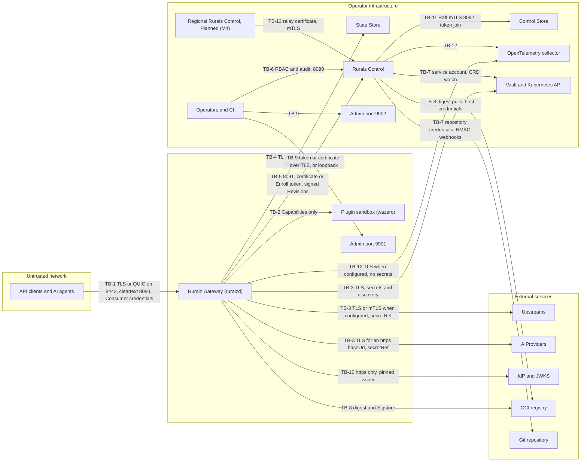
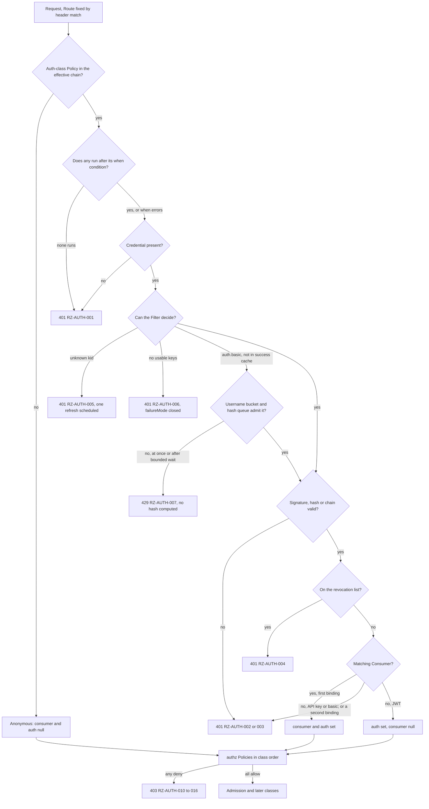
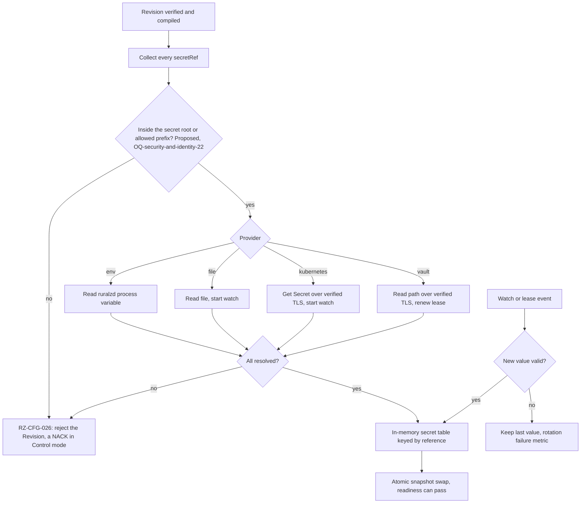

# Security and Identity

## Summary

This document defines how Ruralz protects traffic, identities, secrets and configuration, from the threat model through authorization with CEL, OPA and Cedar to audit events. It owns the `RZ-AUTH` registry, ADR-0011 and ADR-0017. Nothing is implemented yet: every capability is Planned (Mx). Read it before exposing a Node or granting a Plugin a Capability.

## Scope and non-goals

In scope: every section below, including transport and identity for every hop, `auth.*` and `authz.*` runtime semantics and artifact trust policies ([ADR-0017](../adr/0017-artifact-signing.md)). "Pack" means the [foundation pack](../_meta/foundation-pack.md); `ruralz bundle audit` is Planned (M2).

Non-goals:

- Kinds and fields ([Configuration model](02-configuration-model.md)).
- Capability identifiers ([WASM plugin system](05-wasm-plugin-system.md)); Control Stream, Enrollment and RBAC APIs ([Control plane and GitOps](04-control-plane-and-gitops.md), [ADR-0007](../adr/0007-control-stream-protocol.md)).
- Guardrail detectors and residency routing ([AI/LLM gateway](06-ai-llm-gateway.md), [ADR-0014](../adr/0014-ai-api-surface.md)).
- Producing release signatures and SBOMs ([Release, versioning and compatibility](../engineering/04-release-versioning-and-compatibility.md)).
- Curated WAF rule sets, a [product non-goal](../vision/01-vision-and-positioning.md#product-non-goals).

## Threat model and trust boundaries

Per P6 (sandboxed custom code) and P9 (fail static) of [Vision and positioning](../vision/01-vision-and-positioning.md#principles), authentication and authorization fail closed. Assets: credentials, Revisions (holding key hashes), Plugin artifacts, secrets, keys, Enrollment identities, backups, State Store contents, audit log. Adversaries: clients, Plugin publishers, Bundle authors, insiders, network attackers, and compromised Upstreams, providers, relays or Nodes.

*Figure 1: trust boundaries between clients, Ruralz Gateway, Upstreams, Ruralz Control and State Store, labeled with System overview IDs.*



| ID | Threat | Boundary | Mitigation |
|---|---|---|---|
| T1 | Credential guessing, username enumeration, hashing CPU exhaustion, targeted throttling | TB-1 | 128-bit keys; bounded [throttle](#pre-authentication-throttling) with a bucket per presented username; residuals, including the `auth.basic` capacity bound, in OQ-security-and-identity-15 |
| T2 | JWT forgery, leaked IdP key | TB-1, TB-10 | [JWT and OIDC](#jwt-and-oidc); `kid` [revocation](#revocation) entries that last until the key leaves the issuer's JWKS, pending OQ-security-and-identity-4 |
| T3 | Spoofed or unavailable JWKS | TB-10 | `https`, pinned issuer, bounded key lifetime |
| T4 | Path confusion | TB-1 | One normalized path |
| T5 | Address or certificate spoofing | TB-1 | [Client address](#ip-filtering-and-geoip) rule; per-Route `auth.mtls` verification |
| T6 | Revision or Plugin tampering, replay, retagging | TB-5, TB-8 | [Signed Revisions](#signed-revisions-and-plugin-artifacts) |
| T7 | Rogue enrollment | TB-5 | [Enrollment](#enrollment) |
| T8 | Sandbox escape, over-grant, credential harvesting | TB-2 | [Plugin sandbox](#plugin-sandbox) |
| T9 | Secret leakage; spoofed or compromised secret provider | All | [Secrets](#secrets) rule 2; verified TLS; least-privilege provider access |
| T10 | State Store eavesdropping or tampering (poisoned caches, reset limits), cross-user hits | TB-4 | Required credentials, TLS when configured, principal in cache keys; entry MAC (OQ-security-and-identity-22) |
| T11 | Stolen session, insider change | TB-6 | [RBAC](#operator-identity-sso-and-rbac), approvals, audit |
| T12 | Resource exhaustion | TB-1 | [Request hardening](#request-hardening) |
| T13 | Cross-tenant leakage via Semantic Cache, Prompt Cache or provider resources | TB-1, TB-3 | Planned (M3): principal in cache keys; OQ-ai-llm-gateway-19 answer |
| T14 | Admin exposure, stolen scrape credential, Pod sidecars reading admin paths over shared loopback | TB-9 | [Admin ports](#admin-ports): a credential on every interface, loopback included; separate metrics token |
| T15 | Compromised Git account, forged webhook | TB-7 | Branch protection, HMAC, commit signatures |
| T16 | Rogue Ruralz Control replica | TB-11 | Separate peer CA |
| T17 | Relay or stale replica withholding revocations or forging `Ack`s | TB-13 | Signed mark exposes withholding within 30 s (target); forged `Ack`s residual (OQ-security-and-identity-4) |
| T18 | Secret exfiltration, SSRF by a Bundle author | TB-3, TB-10 | [Secrets](#secrets) rules 5 to 7; secret-to-host binding residual (OQ-security-and-identity-22) |
| T19 | Offline guessing of leaked key hashes | TB-8 | Private registries, key length; keyed hashing under OQ-security-and-identity-23 (b) |
| T20 | Prompt injection, exfiltration through a model | TB-3 | Partial detection (`ai.guardrail`, validation Plugins); residual bounded by least-privilege tool authorization (`authz.cel`), response URL checks and no privileged action on model output, Planned (M3) |
| T21 | Residency violation in generation, caches or telemetry | TB-3, TB-4, TB-12 | [Compliance](#compliance) fail-closed rule; client steering residual |
| T22 | Authentication skipped by `when` | TB-1 | [Authentication](#authentication) rule 1 |

IDs are stable; component documents cite them and MUST NOT add an unauthenticated crossing. For OQ-control-plane-and-gitops-14, option (a): token `Enroll` maps to TB-5, token replica `Join` to TB-11, webhooks and Ruralz Control's Kubernetes client to TB-7, its registry client to TB-8, the relay to TB-13, and Node calls to Vault and the Kubernetes API to TB-3. This widens TB-3, TB-5, TB-7, TB-8 and TB-11 and pack 8.4's 8091 and 8092 rows, which need the amendment in OQ-security-and-identity-31.

## Transport security

Every TLS hop verifies the server certificate; no field disables it. Cleartext, where the table allows it (amending TB-1, TB-3, TB-4 and TB-12: OQ-security-and-identity-29), is a degraded state and audit finding. Per TB-4, a Node rejects a non-loopback State Store URL without credentials (code: OQ-security-and-identity-30).

| Hop | Protocol | Peer authentication | Planned |
|---|---|---|---|
| Client, TCP 8443 | TLS 1.3 by default; `tls.minVersion: "1.2"` allowed | Server certificate; client certificate for `auth.mtls` | Planned (M1) |
| Client, UDP 8443 | HTTP/3, TLS 1.3 | As above | Planned (M3) |
| Client, 8080 | Cleartext, SHOULD serve only redirects or traffic behind a TLS-terminating load balancer | Consumer credentials | Planned (M1) |
| Upstream, `AIProvider`, State Store, OTLP (TB-3, TB-4, TB-12) | TLS 1.2 or newer with `Upstream.spec.tls`, an `https` URL or `rediss://`; else cleartext | Server verified; optional client certificate; State Store credentials | Planned (M1) |
| Vault, Kubernetes API (TB-3, TB-7) | TLS 1.2 or newer, never cleartext | Server verified; Vault authentication (OQ-security-and-identity-10); namespace-scoped service account | Planned (M2) |
| IdP (TB-10) | TLS 1.2 or newer; `jwksUrl` and `tokenUrl` MUST be `https` (code: OQ-security-and-identity-18) | Server verified | Planned (M1) |
| Admin 9901, 9902 (TB-9) | TLS when configured | [Admin ports](#admin-ports) | 9901 Planned (M1); 9902 Planned (M2) |
| 8091 (TB-5) | TLS 1.3; client certificate required for every RPC except `Enroll`, which uses server-authenticated TLS with a pinned server CA and a one-time token (proposed: OQ-security-and-identity-31) | Node certificate or token | Planned (M2) |
| 8092 (TB-11) | mTLS, TLS 1.3 only, except token `Join` from a replica without a peer certificate (proposed: OQ-control-plane-and-gitops-15, OQ-security-and-identity-31) | Disjoint CAs, so a Node key cannot join Raft; `Join` redeems a one-time `admin` token over a pinned server CA | Planned (M2) |
| Relay (TB-13) | mTLS, TLS 1.3 only | Relay certificate | Planned (M4) |
| 8090 (TB-6) | TLS 1.3 by default | Sessions or API tokens | Planned (M2) |

TLS 1.2 suites are fixed to ECDHE with AES-GCM or ChaCha20-Poly1305. Go 1.26 enables hybrid post-quantum key exchange by default ([source](https://go.dev/doc/go1.26)). 0-RTT is off, since early data can be replayed.

### Mutual TLS

A listener requests an unverified client certificate when any of its Routes attaches `auth.mtls`. A Hot Reload changing this mode sends GOAWAY, closes idle connections and sets `Connection: close` on busy HTTP/1.1 ones; an `auth.mtls` Route reached over a connection that requested none, coalesced HTTP/2 included, returns 421. The Filter verifies the chain against its own anchors, caching per connection, Policy and snapshot, so a removed CA stops matching at the next swap. Values such as `source.clientCertSubject` stay null unless the Route's own `auth.mtls` verified them (fields: OQ-security-and-identity-3).

### Certificate rotation

Listener and upstream certificates from `file`, Planned (M1), or `kubernetes`, Planned (M2), rotate by watch without a Rollout, keeping the last value on failure (`ruralz_config_secret_rotation_failures_total`). Enrollment certificates (30 days, target) and Ruralz Control certificates renew at two thirds; signing keys arrive in a root-signed `TrustUpdate` before use ([Control plane and GitOps](04-control-plane-and-gitops.md#revision-signing-and-verification)); all Planned (M2).

### HTTP/3

HTTP/3, Planned (M3), uses `http3: true` on an `https` listener with the same certificates and Policies. FIPS builds turn it off, because quic-go skips FIPS enforcement for Initial packet protection and the Retry integrity tag ([source](https://github.com/quic-go/quic-go/blob/master/FIPS140.md)).

### FIPS build

The FIPS build, Planned (M5), is the same source built with `GOFIPS140` as separate artifacts ([Tech stack and libraries](../engineering/01-tech-stack-and-libraries.md#fips-build), [ADR-0001](../adr/0001-implementation-language-go.md)): `GOFIPS140=v1.0.0` (CMVP #5247) until v1.26.0 leaves "Pending Review", with `GODEBUG=fips140=on`, never `only` ([source](https://go.dev/doc/security/fips140)). HTTP/3 and hybrid key exchange are off, only approved `alg` values register, and Plugins get cryptography only through a crypto Host Function Capability, since FIPS mode does not cover Wasm. P1 and [ADR-0002](../adr/0002-apache-2-license-no-feature-gating.md) apply: same license and features.

## Authentication

Client authentication runs in `onRequestHeaders`, Filter class `auth`. The four client types share slot `auth`, are `failureMode: closed` only and never call the State Store. Two runtime rules close skip paths:

1. If `when` skips every auth-class Policy in a Route's chain, the request fails with 401 RZ-AUTH-001, so a public path uses `excludePolicies` (proposed to Configuration model and Data plane).
2. A second Consumer binding fails with 401 RZ-AUTH-002.

A `when` that errors makes a closed Policy run ([Configuration model](02-configuration-model.md#cel-expressions-and-allowed-places)); auth `when` conditions SHOULD NOT read values an Upstream may reinterpret, such as `X-HTTP-Method-Override`.

| Type | Verification | Consumer binding | Planned |
|---|---|---|---|
| `auth.jwt` | Signature with keys from each issuer's `jwksUrl`; `iss`, `aud`, required `exp`, `nbf` | `credentials.jwt` by issuer plus `subject` or `claims` | Planned (M1) |
| `auth.api-key` | SHA-256 of the key in `config.header`, looked up by digest | `credentials.apiKeys` | Planned (M1) |
| `auth.basic` | PBKDF2 behind the [throttle](#pre-authentication-throttling) | Field missing (OQ-security-and-identity-2) | Planned (M1) |
| `auth.mtls` | Chain and subject rules | Field missing (OQ-security-and-identity-3) | Planned (M1) |

### JWT and OIDC

- The token's `iss` selects exactly one `config.issuers[]` entry, which MUST set `audiences` and an `https` `jwksUrl`.
- `alg` MUST be RS256, PS256, ES256 or EdDSA; imported KrakenD HS256 gets fidelity `manual`; `jku`, `x5u`, `jwk` and `x5c` are ignored (fields: OQ-security-and-identity-1).
- A token without `exp`, or with `exp` beyond the maximum lifetime (24 hours (target) until OQ-security-and-identity-1 adds a per-issuer value), fails with RZ-AUTH-003.
- When compiling a Revision, Nodes prefetch issuers, 16 at once, within 5 s (target), reuse unchanged issuers' keys and activate even if a fetch fails.
- Keys live for `max-age` clamped to 5 minutes to 6 hours, or 1 hour when absent or `no-cache` (target), refresh at half-life and, after failed refreshes, serve degraded until expiry (TB-10), then RZ-AUTH-006.
- An unknown `kid` fails with RZ-AUTH-005 and triggers at most one refresh per issuer per 30 s (target), honoring `Retry-After`; a `kid` [revocation](#revocation) entry evicts a leaked key and blocks every later load of it until the entry is removed.
- jwx v4.5.0 or newer fixes GHSA-4cf7-xm37-g63h ([source](https://github.com/lestrrat-go/jwx/releases/tag/v4.5.0)). For OQ-tech-stack-and-libraries-6, option (b): go-oidc, with go-jose/v4 ([source](https://github.com/coreos/go-oidc/blob/v3/go.mod)), stays in Ruralz Control.

*Figure 2: the authentication decision for a request.*



### Accepting more than one credential type

For OQ-configuration-model-13, option (a): distinct slots with complementary `when` conditions. The Route MUST exclude any Gateway slot-`auth` Policy, so the pattern fails where that Policy is `overridable: false`; if a `when` errors, both run and rule 2 applies.

```yaml
apiVersion: ruralz/v1alpha1
kind: Policy
metadata: {name: auth-either-apikey}
spec:
  type: auth.api-key
  slot: auth-apikey                 # explicit slot, so it does not replace the JWT Policy
  when: '"x-api-key" in request.headers'
  config: {header: x-api-key}
---
apiVersion: ruralz/v1alpha1
kind: Policy
metadata: {name: auth-either-jwt}
spec:
  type: auth.jwt
  slot: auth-jwt
  when: '!("x-api-key" in request.headers)'   # exactly one of the two runs
  config:
    issuers:
      - issuer: https://auth.shop.example
        jwksUrl: https://auth.shop.example/.well-known/jwks.json
        audiences: [shop-api]
---
apiVersion: ruralz/v1alpha1
kind: Route
metadata: {name: partner-orders}
spec:
  match: {hosts: ["api.shop.example"], path: {prefix: "/v1/partner/"}}
  policies: [{name: auth-either-apikey}, {name: auth-either-jwt}]
  excludePolicies: [{name: jwt-default}]    # the Gateway slot-auth Policy would otherwise stack
  upstreams: [{name: orders}]
```

### Upstream authentication

`auth.upstream-oauth2`, Planned (M1), runs the client credentials grant, refreshing at two thirds of the token lifetime (target). A miss runs one single-flight fetch per Policy and Node within the request deadline and a proposed 2 s `timeout` (target); failure is 401 RZ-AUTH-020.

`auth.upstream-sigv4`, Planned (M2), records signing parameters in `onUpstreamRequest`; the Node signs at the transport on every attempt, after every Filter, Plugin and dialect translation (hook: OQ-security-and-identity-28). The body is buffered within `limits.maxRequestBodyBytes` or sent as UNSIGNED-PAYLOAD where accepted (OQ-security-and-identity-18). For OQ-ai-llm-gateway-12, option (b): this type on the `ai` Upstream, signing only `bedrock` dialect legs.

### KrakenD authentication parity

Every mechanism is free; the [KrakenD EE parity matrix](../comparison/01-krakend-ee-parity-matrix.md) wins on conflict.

| KrakenD feature | Ruralz mechanism | Planned |
|---|---|---|
| JWT, OpenID Connect, OAuth2 | `auth.jwt`; `oauthClients` binding | Planned (M1) |
| JWT token signing | Built-in type; never keys in Plugin `config` | Planned (M2), pending OQ-security-and-identity-11 |
| Client credentials | `auth.upstream-oauth2` | Planned (M1) |
| Basic authentication | `auth.basic` | Planned (M1) |
| API keys | `auth.api-key` | Planned (M1) |
| Token revocation bloom filter | Signed revocation list on every Node | Planned (M2) |
| Revoke Server | Ruralz Control revocation API | Planned (M2) |
| Multiple identity providers per endpoint <!-- alias-ok --> | Several `issuers[]` | Planned (M1) |
| mTLS | `auth.mtls`; `Upstream.spec.tls` | Planned (M1) |
| NTLM authentication | Not planned: it authenticates a TCP connection, breaking pooling, and uses non-FIPS MD4 and HMAC-MD5 (P1) | Not planned |
| Google GCP authentication | JWT-bearer grant in `auth.upstream-oauth2` | Planned (M2), pending OQ-security-and-identity-12 |
| AWS SigV4 authentication | `auth.upstream-sigv4` | Planned (M2) |

### RZ-AUTH decision codes

Client messages are generic; metric names are proposed to [Observability](10-observability.md).

| Code | Status | Meaning |
|---|---|---|
| RZ-AUTH-001 | 401 | Credential missing, or every auth-class Policy skipped |
| RZ-AUTH-002 | 401 | Credential invalid, no matching Consumer, or a second binding |
| RZ-AUTH-003 | 401 | Token expired, not yet valid, without or over-long `exp`, or wrong issuer or audience |
| RZ-AUTH-004 | 401 | Credential revoked |
| RZ-AUTH-005 | 401 | Unknown `kid` |
| RZ-AUTH-006 | 401 | No usable keys for the issuer |
| RZ-AUTH-007 | 429 | Authentication throttled |
| RZ-AUTH-010 to RZ-AUTH-014 | 403 | Denied by `authz.cel`, `authz.opa`, `authz.cedar`, `authz.ip` or `authz.geoip` |
| RZ-AUTH-015 | 403 | Authorization could not decide |
| RZ-AUTH-016 | 401 or 403 | Rejected by a `plugin` Policy of class `auth` (401) or `authz` (403) |
| RZ-AUTH-020 | 401 | Upstream credential not obtained or signed (status: OQ-security-and-identity-9) |

## Authorization

Authorization runs in Filter class `authz`. Each type's slot defaults to its name, so Policies stack and all must allow; a deny returns 403 and an evaluation error RZ-AUTH-015. [ADR-0011](../adr/0011-expressions-and-authorization-engines.md) fixes CEL inline, OPA and Cedar as pluggable engines, and no Lua.

| Engine | When to use | Cost per request | Guardrails | Planned |
|---|---|---|---|---|
| CEL, `authz.cel` | Short rules over claims, Consumer, Tier, method and path; the default | Compiled per Revision; under 2 µs at p99 (target) | RZ-CFG-015; runtime `CostLimit` ([source](https://github.com/cel-expr/cel-go/blob/master/cel/options.go)) | Planned (M1) |
| OPA (Rego), `authz.opa` | Large or shared data-driven rule sets | `PrepareForEval` per Revision ([source](https://github.com/open-policy-agent/opa/blob/main/v1/rego/rego.go)); under 100 µs at p99 (hypothesis) | Deadline; only allowlisted pure built-ins, so no `http.send`; 16 MiB data per Policy (target) | Planned (M2) |
| Cedar, `authz.cedar` | Principal, action and resource models with hierarchies | In process; under 100 µs at p99 (hypothesis) | 1,000 policies and 10,000 entities per Policy (target); no schema validator in cedar-go ([source](https://github.com/cedar-policy/cedar-go/blob/main/README.md)) | Planned (M2) |

Identical engines compile once, by digest. A Revision-wide ceiling of 64 MiB of compiled engine memory and 50,000 entities (target), reported per snapshot, counts toward snapshot size, so peak engine memory is (K + 2) = 4 times it, 256 MiB (hypothesis) ([System overview](01-system-overview.md#compile-before-swap)); compilation counts against the 2 s compile time budget. `ruralz bundle validate` checks the ceiling (code: OQ-security-and-identity-30), or, with OCI delivery (OQ-security-and-identity-13), Ruralz Control ingest and Node activation, NACKing a violation. CEL SHOULD come first; cedar-go has had no commits since 2026-06-01 ([source](https://github.com/cedar-policy/cedar-go)), so OPA is the fallback.

```yaml
apiVersion: ruralz/v1alpha1
kind: Policy
metadata: {name: authz-gold-only}
spec:
  type: authz.cel
  config:
    rule: 'consumer != null && consumer.tier == "gold"'   # Tier gate with existing fields
```

### IP filtering and GeoIP

`authz.ip`, Planned (M1), filters by CIDR on `source.ip`; `authz.geoip`, Planned (M2), by country from a local MaxMind-format database (reader: OQ-tech-stack-and-libraries-24; schemas: OQ-security-and-identity-18).

**Client address**, Planned (M1): `source.ip` is the TCP or QUIC peer unless that peer is in the trusted-proxy CIDR list; then it is the rightmost `X-Forwarded-For` or `Forwarded` address outside the list, from at most 16 parsed (target), or the PROXY protocol v2 source on opted-in listeners. Forwarding headers from untrusted peers are overwritten, never appended. Until OQ-security-and-identity-6 adds the fields, deployments behind a load balancer SHOULD NOT rely on `source.ip` controls, which collapse to one key.

## Consumers and tiers

A `Consumer` is a Bundle caller identity with credentials, a Tier, Quotas and tags ([Configuration model](02-configuration-model.md#consumer)); authentication binds at most one, readable as `consumer`.

| Rule | Statement |
|---|---|
| Binding | API keys by digest; JWTs by issuer plus `subject` or `claims`; OAuth clients by `client_id`, else `azp`, when `iss` is in that Consumer's `credentials.jwt` (OQ-security-and-identity-24); a double match needs an error (OQ-security-and-identity-1) |
| Keys | SHA-256 digests only; `secretRef`-held keys are hashed at load and rejected under 22 base64url characters (OQ-security-and-identity-23). Keys SHOULD carry 128 random bits; OCI registries holding Revisions MUST be private |
| Tier | A label Policies read; it grants nothing |
| Upstream identity | An Upstream `headers` Policy `set` overwrites client identity headers |
| Cache partitioning | Proposed to `cache` and `ai.semantic-cache` owners: authenticated Routes key by principal, so entries grow with principals (hypothesis); sharing needs a field (OQ-security-and-identity-25) |

```yaml
apiVersion: ruralz/v1alpha1
kind: Consumer
metadata: {name: partner-beta}
spec:
  tier: gold
  credentials:
    apiKeys:                         # rotation: two named keys during an overlap window
      - name: primary-2026-09
        hash: "sha256:d1bec0f9342e5607570b2636ed0256023b13be7d7d4bb45e1bed3cfee80dc1b6"
      - name: primary-2026-06        # removed after the overlap window
        secretRef: {provider: kubernetes, name: beta-keys, key: previous}
```

Every key change is a Revision; urgent removal uses [Revocation](#revocation). For OQ-configuration-model-17, the Bundle stays the only Consumer source through Planned (M3).

## Secrets

`secretRef` is the only way a secret enters Ruralz: a literal in a `SecretValue` field is RZ-CFG-012. Providers `env` (rotation needs a restart) and `file` (preferred on Kubernetes) are Planned (M1); `kubernetes` (`get` and `watch` in the Node's namespace, limited by `resourceNames`) and `vault` (Node authentication: OQ-security-and-identity-10) are Planned (M2).

Components MUST follow rules 1 to 4; rules 5 to 7 are proposed (OQ-security-and-identity-22), and until then `ruralz bundle audit` only reports violations.

1. Only Nodes resolve Bundle secrets; Ruralz Control and the CLI see references.
2. Resolved values never appear in a Revision, diff, Last-Known-Good, `/config/dump`, log, trace, metric label or `/tap`, which also redacts credential headers.
3. An unresolvable reference is RZ-CFG-026: the Node rejects the Revision (a NACK in Control mode) and keeps its active one.
4. After a cold start, `/readyz` waits for every reference, so TLS keys and the State Store URL SHOULD use `file` or `env`. For OQ-configuration-model-15 and -5: no persistence through Planned (M3); `vault` for cloud managers.
5. A `file` reference resolves only under `RURALZ_SECRET_ROOT`, default `/etc/ruralz`, and `env` only for `RURALZ_STATE_STORE_URL` and `RURALZ_SECRET_*`. A Node refuses to start if the root contains `${RURALZ_DATA_DIR}`, `RURALZ_ADMIN_TLS_DIR`, an admin or Enrollment token file or the Vault credential.
6. Every Node connection for the Bundle (`jwksUrl`, `tokenUrl`, `baseUrl`, Endpoints, discovery results) refuses 0.0.0.0/8, ::/128, 127.0.0.0/8, ::1, 169.254.0.0/16, fe80::/10 and fd00:ec2::254, IPv4-mapped and NAT64 forms included, at connect time and on each redirect hop, unless `RURALZ_FETCH_ALLOW` lists them (for example sidecars or a loopback `ollama`). It never follows `https` to `http` or a `tokenUrl` redirect, and ignores proxy variables unless allowlisted.
7. Adding a `secretRef` or changing a secret's destination has diff impact `security`.

*Figure 3: secret resolution through `secretRef` on activation and rotation.*



## Request hardening

These controls are always on and Planned (M1) unless noted ([System overview](01-system-overview.md#design-principles)); [Data plane](03-data-plane.md) owns parsing.

| Concern | Control |
|---|---|
| Oversized requests | RZ-RT-002 over `limits.maxRequestHeaderBytes`; RZ-RT-003 over `maxRequestBodyBytes`, counted decoded |
| Header floods | 256 fields (target), counted after the parse `maxRequestHeaderBytes` bounds; Go 1.27 adds `Server.MaxHeaderValueCount` ([source](https://go.dev/doc/go1.27)) (OQ-security-and-identity-20) |
| Slow clients | Header-read and idle timeouts (OQ-security-and-identity-17) |
| Request smuggling | Conflicting framing rejected; hop-by-hop headers removed |
| Path confusion | One normalized path for Router, CEL, `authz.*` and upstream; only a later `transform.request` rewrites it (OQ-security-and-identity-21) |
| Credential forwarding | `auth.api-key` and `auth.basic` strip their credential; `auth.jwt` forwards it |
| gRPC | Planned (M3): connect-go `WithRequestGate` authenticates before decompression ([source](https://github.com/connectrpc/connect-go/releases/tag/v1.21.0)) |
| Browser protections | `cors`; security headers in a non-overridable Gateway `headers` Policy |

### Pre-authentication throttling

Rate Limits run after `auth` and never see failed attempts, so a throttle, Planned (M1) and local to each Node, covers `auth.basic` verifications that miss the success cache; API keys rely on entropy.

| Element | Rule |
|---|---|
| Success cache | Keyed by HMAC-SHA-256 of username and password under a per-process key; each entry records the Consumer credential digest it matched. An entry lasts 60 s after its last hit and at most 15 minutes from verification, less up to 20% jitter (target); 64 shards, 10,000 entries per Node (target). A hit skips throttle and hash |
| Cache on change | A hit still passes the [revocation](#revocation) check (Figure 2, E to F), so a revocation advance evicts nothing. A snapshot swap keeps each entry whose username and credential digest are unchanged, and evicts only changed or removed credentials |
| Username bucket | One per presented username, declared or not, keyed by HMAC-SHA-256 of the username under the per-process key, in one 64-shard LRU of 100,000 (target); burst 10, refill 1 per second (target). A bucket is created only after the hash queue admits an attempt, at most 100 per second per Node (target) |
| Undeclared usernames | The same bucket rules, plus a dummy hash at the default iteration count through the same queue, so neither timing nor status reveals whether a username exists |
| Hash queue | max(1, `GOMAXPROCS`/4) slots, which cap the Node's hash rate; 4 × slots waiters, 1 s deadline (target) |
| Delay | An empty bucket holds at most 2 waiters, 1,024 per Node, for up to 2 s (target) |
| Refusal | Hash-queue overflow, the bucket-creation cap and delay overflow each return 429 RZ-AUTH-007 with `Retry-After` before any hash, for declared and undeclared usernames alike, counted by cause |
| Source key | Address, IPv6 as /64, 10 failures per minute (target); off until OQ-security-and-identity-6 closes |

**Cost.** At 600,000 iterations a slot verifies 10 to 20 credentials per second (hypothesis), so hashing uses at most a quarter of the cores when `GOMAXPROCS` is 4 or more, otherwise one core.

**Capacity.** A client calling at least once per 60 s is re-verified about once per maximum age, so a Node sustains about slots × 10 to 20 × 800 distinct active `auth.basic` credentials (hypothesis): 8,000 to 16,000 on one slot, capped at the 10,000-entry cache (target), which is sized to one slot's rate. A client calling less often pays one hash per call. Beyond that bound, legitimate clients get RZ-AUTH-007 with no attack, so `auth.basic` suits low-cardinality clients, and high-cardinality callers SHOULD use API keys or JWT.

**Ramp.** Hot Reloads and Rollouts keep unchanged entries. A restart or Zero-Downtime Upgrade starts with an empty cache and LRU, since the key is per process, so each active client needs one hash; the ramp runs at the lower of the hash rate and the 100 per second creation cap (target). With 1,000 active clients on an 8-core Node (2 slots), it takes about 25 to 50 s (hypothesis), and callers beyond the queue get RZ-AUTH-007 with `Retry-After` meanwhile. Restarting one Node at a time behind a load balancer bounds the burst to that Node's share.

**Eviction.** At 100 new usernames per second, evicting a live bucket takes 1,000 s (hypothesis), 100 times its refill; an evicted bucket returns full, adding at most 10 guesses per username per 1,000 s (hypothesis).

Residuals (T1, OQ-security-and-identity-15): no fixed lockout, but a flood shares the username's rate with its owner, exempt only through the success cache; spraying across usernames is bounded only by the hash queue, shown by per-cause refusal counters proposed to Observability; credentials stored at a non-default iteration count differ in timing from the dummy hash; the capacity bound and the restart ramp above.

## Revocation

Ruralz Control delivers one signed revocation list to every Node of a Cluster, checked in memory, outside the Revision digest: a proposed exception to pack 8.1 and 8.4 (OQ-security-and-identity-4). Until then, entries are unavailable.

| What is revoked | Mechanism | Propagation | Planned |
|---|---|---|---|
| A JWT by `jti`; a subject's older tokens; an IdP key by (issuer, `kid`), forcing a JWKS refetch; an API key hash or `auth.basic` username; a client certificate by issuer and serial (CRL: OQ-security-and-identity-3) | Signed entry, REST API | 5 s or less at p99 with a fresh mark (target) | Planned (M2), pending OQ-security-and-identity-4 (usernames: -2) |
| An API key, file mode | Removed; CI and Hot Reload | No Ruralz target | Planned (M1) |
| An API key, Control mode | Removed; Rollout | 30 s or less at p95 for 100 Nodes, `all-at-once` (target) (SM-9) | Planned (M2) |
| An Enrollment identity | `ruralz node revoke` | 5 s or less at p99 (target) | Planned (M2) |
| An operator session or token | Raft-replicated set | 1 s or less on connected replicas (target) | Planned (M2) |
| A Plugin publisher | Trust policy change; RZ-CFG-033 | Next activation | Planned (M2) |

- **Integrity.** The leader signs each entry with a monotonic sequence, and a high-water mark (sequence, Cluster, issue time) every 10 s (target) and on each entry; followers and relays forward both unchanged. A gap, or a mark older than 30 s with clocks within 5 s (target), is a degraded state and Drift.
- **API keys.** A Revision holding a revoked hash reaches only Nodes reporting a covering sequence. Once the removing Revision is `complete`, Ruralz Control tombstones older Revisions holding the hash as rollback targets (the last 10 `complete` per Cluster, target; OQ-security-and-identity-27) and collects the entry when no Node reports such a digest.
- **Expiry.** A `jti` entry MUST carry the token's `exp`, capped at the maximum lifetime, and expires then; a cut-off expires after that lifetime and meanwhile refuses the subject's tokens without `iat`.
- **Keys.** A `kid` entry never expires on its own, because a leaked key keeps minting fresh tokens. Nodes refuse to load a revoked (issuer, `kid`) from any JWKS fetch and report whether the issuer still serves it; while any Node sees it served, the Cluster is in a degraded state and alerts. An operator MAY remove the entry; Ruralz Control collects it only after no Node has seen the key in that issuer's JWKS for the 6-hour key clamp plus the maximum lifetime, 30 hours (target). Both emit `credential.revoked`.
- **Cap.** 100,000 entries per Cluster (target), 1,000 of them reserved for `kid` entries (target) so other entries never crowd them out, alerting at 80% (target); at the cap new entries are refused and audited. Tombstoning relieves API-key entries; replacing a subject's `jti` entries with one cut-off relieves the rest.
- **Quorum loss.** A revoked session keeps reading until it expires, at most 12 hours (target).
- **Persistence.** A detached restart forgets entries (OQ-security-and-identity-5); file mode reads a watched entry file.

## Plugin sandbox

Plugins are a Node's only third-party code, so the sandbox is the whole TB-2 defense ([WASM plugin system](05-wasm-plugin-system.md), [ADR-0004](../adr/0004-wasm-runtime-wazero.md), [ADR-0005](../adr/0005-plugin-abi-v1.md)). Every control is Planned (M2).

| Control | Design |
|---|---|
| Isolation | wazero; the host is reachable only through Plugin ABI v1 Host Functions |
| Capabilities | Deny by default; RZ-CFG-028 for requests beyond `Plugin.spec.capabilities` |
| Credential headers | Hidden unless a separate, flagged credential Capability is granted (OQ-wasm-plugin-system-3, option (b)) |
| Memory | `limits.memoryBytes` via `WithMemoryLimitPages`, since wazero defaults to 4 GiB ([source](https://github.com/wazero/wazero/blob/main/config.go)); `limits.maxPluginMemoryBytes` caps the Node |
| CPU time | Context deadlines, since wazero has no fuel metering ([source](https://github.com/wazero/wazero/issues/422)) |
| Supply chain | Digest-pinned `image`, Sigstore `enforce`, flagged Capability diffs |
| Failure | Traps fail the Policy (`RZ-PLG`); auth and authz classes closed only |
| Secrets and network | None in Plugin ABI v1 (OQ-wasm-plugin-system-4, -5); no literal keys in `config` |

An instance serves one call at a time, shares no memory across pools and is recycled after 100,000 calls (target); Plugins MUST NOT keep request data in globals (OQ-wasm-plugin-system-18). Unpatched sandbox escapes older than 30 days stay at zero (target) (SM-13).

## Control plane security

Ruralz Control holds the keys to every Cluster, so it denies by default ([Control plane and GitOps](04-control-plane-and-gitops.md)).

### Operator identity, SSO and RBAC

Local accounts, TOTP, sessions and the seven roles follow [RBAC and SSO](04-control-plane-and-gitops.md#rbac-and-sso), Planned (M2); OIDC and SAML SSO for Ruralz Console is Planned (M5), free. Added rules:

- Nobody edits their own bindings or approves their own change.
- `auditor` reads the audit log without write roles; for OQ-control-plane-and-gitops-20, option (a), `viewer` gets none.
- `ruralz bundle push` skips review, so it is off by default under `requireApproval`.

### Enrollment

Tokens, the `Enroll` lockout and certificates follow [Enrollment and mTLS](04-control-plane-and-gitops.md#enrollment-and-mtls); private keys never leave the Node, and certificates name `node.id` and the Cluster, scoping delivery. For OQ-control-plane-and-gitops-19 and -10, option (a): Cluster-scoped minting; expired Nodes re-enroll, since a grace window extends stolen identities.

### Signed Revisions and Plugin artifacts

[ADR-0017](../adr/0017-artifact-signing.md) fixes what is signed; these trust policies are Planned (M2).

| Trust policy | Contents | Lives in | Default |
|---|---|---|---|
| Anchor sets | Online signing keys signed by the offline root, plus the Plugin trust policy | Enrollment and root-signed `TrustUpdate` | Always verified |
| OCI Revision trust policy | Exact keyless issuer and subject pairs, or keys | Node process configuration (OQ-security-and-identity-8) | `enforce` |
| Plugin trust policy | Publisher identities or keys | Ruralz Control process configuration; Node's in file mode | `enforce`; `warn` in `ruralz dev run` |

Under `enforce`, an empty trust policy rejects everything (RZ-CFG-033); identity patterns are opt-in. Verification is offline (pack 8.14); trust policies never live in a Bundle. For OQ-control-plane-and-gitops-9, option (b): verify commit signatures where approvals depend on authorship. For OQ-control-plane-and-gitops-24, option (a): after an emergency key removal, a Node refuses to boot a candidate or Last-Known-Good accepted from that key after `compromisedSince`, staying not ready until the Control Stream delivers; older ones boot.

Proposed (OQ-security-and-identity-26): `ruralz bundle push` adds signed Environment and sequence annotations; file-mode Nodes reject other Environments and sequences below a high-water mark kept in `${RURALZ_DATA_DIR}/lkg/`, and a rollback re-pushes with a new sequence. Until then, Nodes check only digest and signature.

### Admin ports

For OQ-system-overview-6: 9901 and 9902 bind all interfaces for kubelet probes; only `/healthz` and `/readyz` are unauthenticated. OQ-security-and-identity-7 proposes `RURALZ_ADMIN_METRICS_TOKEN_FILE` (`/metrics` only), `RURALZ_ADMIN_TOKEN_FILE` (all paths) and `RURALZ_ADMIN_TLS_DIR`, whose client CA also admits certificates (TB-9). `/metrics` needs the metrics token, the operator token or an admitted client certificate on every interface, loopback included, because every container in a Pod, sidecars included, shares loopback. If no admin credential is configured, only `/healthz` and `/readyz` answer and every other path returns 401. Tokens are compared in constant time and accepted only over TLS or loopback; without the operator token, `/tap`, `/config/dump` and `/debug/*` are off. `/tap` and `/config/dump` use is logged.

### Audit log

Every state change is audited, Raft-committed before the write returns and hash-chained ([Audit and security](04-control-plane-and-gitops.md#audit-and-security)). Chain heads MUST be exported off-box, so OQ-control-plane-and-gitops-12 should block Planned (M2); a restore appends a fork record.

### Release supply chain

[Release, versioning and compatibility](../engineering/04-release-versioning-and-compatibility.md) implements, all Planned (M1): signed images, a CycloneDX SBOM per artifact as an attestation, and SLSA Build Level 3 provenance.

## Compliance

Every audit event carries time, actor, role, source address, target, outcome and any Revision digest, never a secret. All are Planned (M2) except `sso.config.changed`, Planned (M5).

| Event | Emitted when |
|---|---|
| `session.created`, `token.created` | An operator signs in; an API token is issued |
| `session.failed` | Sign-in failures, aggregated per minute |
| `session.revoked` | A session or token is revoked |
| `rbac.binding.changed` | A role binding changes |
| `source.changed`, `crd.changed` | A Git source, credential reference or CRD changes |
| `revision.recorded`, `revision.pushed` | A Revision is built and signed, or pushed by `ruralz bundle push` |
| `revision.rejected` | Validation or a digest check fails |
| `revision.tombstoned` | A Revision stops being a rollback target |
| `writeback.submitted` | A Ruralz Console write-back is submitted |
| `rollout.changed` | A Rollout changes state or is approved |
| `node.token.issued` | An Enrollment token is issued |
| `node.enrolled` | A Node enrolls |
| `node.revoked` | `ruralz node revoke` runs |
| `credential.revoked` | A revocation entry is added, collected, removed by an operator or refused |
| `trust-policy.changed` | A trust policy, anchor set or signing key changes |
| `signature.failed` | A signature fails at ingest or on a Node |
| `control.backup.created`, `control.restored` | A backup completes or is downloaded; a restore completes |
| `sso.config.changed` | An SSO provider setting changes |

Data-plane decisions are telemetry, not audit events. Other evidence:

- FIPS 140-3: the [FIPS build](#fips-build).
- Data residency, Planned (M3): for OQ-ai-llm-gateway-9, option (a), allowed Regions on `AIModel` and embedding providers plus a named Node Region input. A request whose `AIModel` excludes the serving Node's Region fails closed with an `RZ-AI` code before any provider call, so no content is generated, embedded, cached or logged; `ai.semantic-cache` embedding providers MUST share that Region. Residual (T21): access-log metadata stays in the serving Region, and operators steer clients.
- Vulnerabilities: a published security policy, SM-13 and OQ-vision-and-positioning-6 (Cyber Resilience Act).
- Degradation metrics: fail-open Rate Limits ([ADR-0008](../adr/0008-rate-limiting-local-bucket-and-gcra.md)), cleartext hops, stale JWKS or marks.

## Open questions

| ID | Question | Options | Owner | Blocking? |
|---|---|---|---|---|
| OQ-security-and-identity-1 | Which extra `auth.jwt` and `auth.api-key` fields? | (a) Algorithms, clock skew, required claims, per-issuer maximum token lifetime (default 24 hours (target)), duplicate-binding error; (b) Fixed defaults | security-and-identity | Yes, Planned (M1) |
| OQ-security-and-identity-2 | How are `auth.basic` credentials held? | (a) `credentials.basic`, PBKDF2-HMAC-SHA-256 at 600,000 to 1,000,000 iterations (target); (b) `apiKeys`; (c) Plugin | security-and-identity | Yes, for `auth.basic` |
| OQ-security-and-identity-3 | Which `auth.mtls` fields and Consumer binding? | (a) Policy CA, subject rules, CRL; (b) Listener CA | security-and-identity | Yes, for `auth.mtls` |
| OQ-security-and-identity-4 | How do revocations bypass the Revision? | (a) Signed entries and high-water mark, Node-signed `Ack`s, watched file, amending pack 8.1 and 8.4 (proposed); (b) State Store; (c) Revisions only | security-and-identity, control-plane-and-gitops | Yes, Planned (M2) |
| OQ-security-and-identity-5 | Do revocations survive a detached restart? | (a) No; (b) Persisted, amending pack 8.11 | security-and-identity | Yes, Planned (M2) |
| OQ-security-and-identity-6 | How are trusted proxies declared? | (a) CIDR list; (b) PROXY protocol v2; (c) Both (proposed) | configuration-model (fields), security-and-identity (semantics) | Yes, for `source.ip` users |
| OQ-security-and-identity-7 | Which settings hold admin credentials? | (a) Three `RURALZ_ADMIN_*` settings, amending pack section 2 (proposed); (b) Gateway fields | security-and-identity | Yes, Planned (M1) |
| OQ-security-and-identity-8 | Where do file-mode trust policies live? | (a) Process setting; (b) Flags | control-plane-and-gitops | Yes, Planned (M2) |
| OQ-security-and-identity-9 | Status for failed upstream auth (merges OQ-data-plane-8)? | (a) 401; (b) 503, amending pack 8.10 (proposed); (c) 502 | security-and-identity | Yes |
| OQ-security-and-identity-10 | How does a Node authenticate to Vault? | (a) Kubernetes; (b) AppRole; (c) Token file | security-and-identity | Yes, for `vault` |
| OQ-security-and-identity-11 | How is JWT signing served? | (a) Plugin with signing Host Function; (b) Built-in type, amending pack section 10 (proposed) | security-and-identity | Yes, Planned (M2) |
| OQ-security-and-identity-12 | How is GCP authentication served? | (a) Plugin; (b) JWT-bearer fields (proposed); (c) New type | security-and-identity | Yes, Planned (M2) |
| OQ-security-and-identity-13 | How do OPA and Cedar get policies? | (a) Inline; (b) OCI; (c) Both | security-and-identity | Yes, Planned (M2) |
| OQ-security-and-identity-14 | Should `authz.geoip` enrich upstream requests? | (a) No; (b) Header; (c) `source.country` | security-and-identity | No |
| OQ-security-and-identity-15 | Are the throttle defaults and residuals acceptable: flood-shared rates, spraying, N × 1 guess per second per username across N Nodes (target), about 8,000 to 16,000 active `auth.basic` clients per hash slot capped at 10,000 per Node (hypothesis), and a post-restart ramp of one hash per active client? | (a) Local throttle (current); (b) Pre-auth `ratelimit` position | security-and-identity | Yes, for `auth.basic` |
| OQ-security-and-identity-17 | Which fields set client timeouts? | (a) Gateway `limits`; (b) Fixed | data-plane | No |
| OQ-security-and-identity-18 | Which schemas are registered? | (a) `authz.ip`, `authz.geoip` lists; `auth.upstream-sigv4` region, service and payload mode; upstream-auth `timeout`; `https` pattern for `jwksUrl` and `tokenUrl` (proposed); (b) Other | configuration-model | Yes, per type |
| OQ-security-and-identity-19 | One switch requiring TLS everywhere? | (a) No (current); (b) Gateway field | configuration-model | No |
| OQ-security-and-identity-20 | Record a `go1.27` build-tag file? | (a) Yes (proposed); (b) Wait | tech-stack-and-libraries | No |
| OQ-security-and-identity-21 | Reject encoded NUL and backslashes? | (a) Yes (proposed); (b) No | data-plane | Yes, Planned (M1) |
| OQ-security-and-identity-22 | How are secrets and Node connections restricted? | (a) `RURALZ_SECRET_ROOT`, `RURALZ_SECRET_` prefix, `RURALZ_FETCH_ALLOW`, `security` impact class, secret-to-destination binding, State Store entry MAC key, amending pack sections 2 and 5 (proposed); (b) Guidance | configuration-model, security-and-identity | Yes, Planned (M1) |
| OQ-security-and-identity-23 | Keyed digests; short-key code? | (a) SHA-256, RZ-CFG code (current); (b) HMAC-SHA-256 | configuration-model | No |
| OQ-security-and-identity-24 | How does `oauthClients` name its issuer? | (a) The Consumer's `jwt` issuer (current); (b) Field | configuration-model | Yes, Planned (M1) |
| OQ-security-and-identity-25 | Which field shares cache entries across principals? | (a) None; (b) Flag | configuration-model | No |
| OQ-security-and-identity-26 | Which signed annotations bind an OCI Revision? | (a) Environment and sequence, amending pack 8.11 and 8.14 and System overview file-mode rollback (proposed); (b) Digest | security-and-identity | Yes, Planned (M2) |
| OQ-security-and-identity-27 | Codes for cap overflow and tombstoned rollbacks; target count? | (a) Two `RZ-CP` codes, 10 targets (proposed); (b) Existing codes | control-plane-and-gitops | Yes, Planned (M2) |
| OQ-security-and-identity-28 | Where does transport-time signing live? | (a) Hook after the last `onUpstreamRequest` Filter, amending pack sections 8.12 and 10 (proposed); (b) Forbid later mutation | security-and-identity | Yes, for `auth.upstream-sigv4` |
| OQ-security-and-identity-29 | Should TB-1, TB-3, TB-4 and TB-12 read "TLS when configured; cleartext reported"? | (a) Yes (proposed); (b) Require TLS | system-overview | No |
| OQ-security-and-identity-30 | Which codes reject the engine ceiling and an uncredentialed State Store URL? | (a) New RZ-CFG codes (proposed); (b) RZ-CFG-015 and RZ-CFG-026 | configuration-model | Yes, Planned (M2) |
| OQ-security-and-identity-31 | Should pack 8.4 (the 8091 and 8092 rows, and the Control Stream row of section 2) and System overview TB-5 read "mTLS with a per-Node enrollment certificate; `Enroll` only: server-authenticated TLS, pinned server CA, one-time token", 8092 and TB-11 add token `Join`, and TB-3, TB-7 and TB-8 add Vault and the Kubernetes API, Git webhooks and the Ruralz Control Kubernetes client, and Ruralz Control's OCI registry client? | (a) Amend (proposed); (b) New TB IDs | system-overview | Yes, Planned (M2) |

OQ-security-and-identity-16 is closed. Answered above: OQ-system-overview-6; OQ-configuration-model-5, -13, -15, -17; OQ-tech-stack-and-libraries-6; OQ-control-plane-and-gitops-9, -10, -14, -19, -20, -24; OQ-wasm-plugin-system-3, -18; OQ-ai-llm-gateway-9, -12. Recommended, pending host documents: OQ-ai-llm-gateway-14 (b); OQ-ai-llm-gateway-19 (b), plus (c) for untrusted tenants; OQ-multi-protocol-7, -9 (a); OQ-observability-4, -7 (b); OQ-release-versioning-and-compatibility-5 (a). For OQ-tech-stack-and-libraries-24, option (a); -17 and -19 need the same research addendum, with OIDC only as the -19 fallback.
