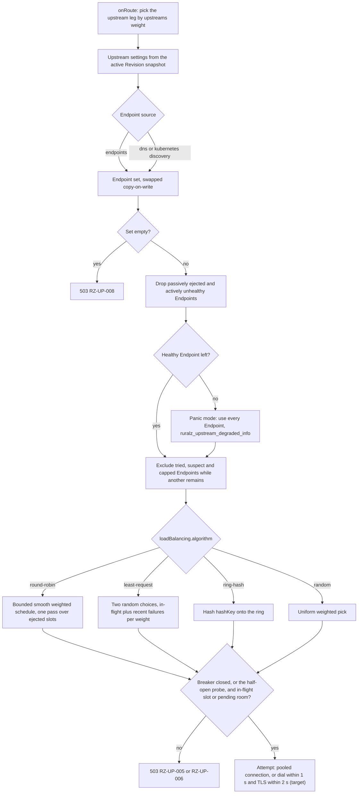
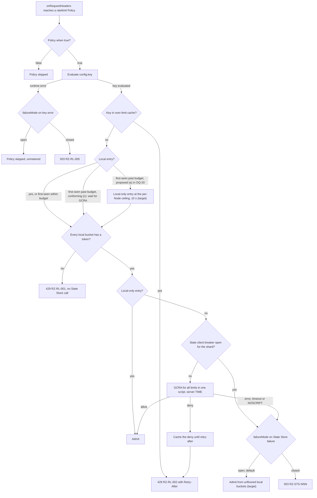
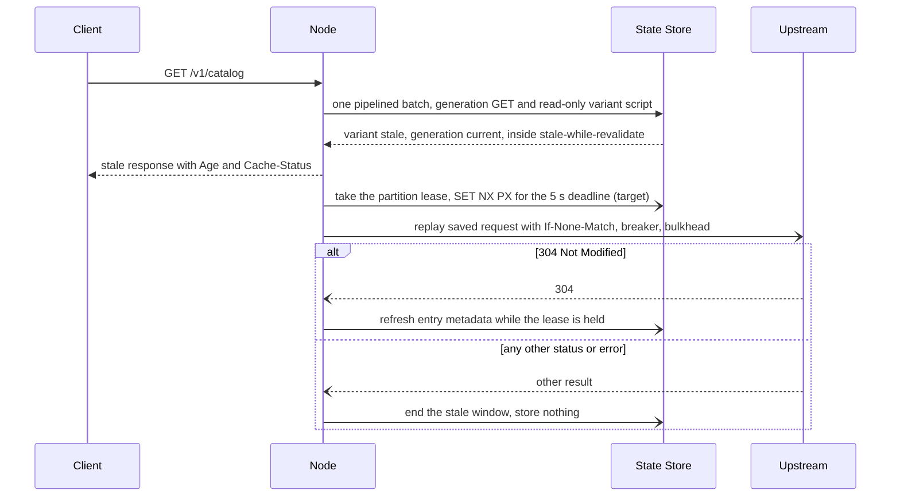

# Traffic Management and Resilience

## Summary

This document fixes how a Ruralz Gateway Node selects and ejects Endpoints, bounds time and retries, breaks circuits, enforces Rate Limits and Quotas, serves the Response Cache and sheds overload. It defines runtime behavior for `Upstream` resilience fields and the `ratelimit`, `quota` and `cache` Policy types, and owns the `RZ-UP` and `RZ-RL` registries. Rate limiting follows [ADR-0008](../adr/0008-rate-limiting-local-bucket-and-gcra.md): local token bucket, then State Store GCRA, failing open by default. Architects, operators and contributors should read it.

## Scope and non-goals

In scope: the Summary's subjects, including `config` of `ratelimit`, `quota` and `cache` ([Configuration model](02-configuration-model.md#policy)), plus `Route.spec.timeout`, weighted `upstreams`, IETF RateLimit headers and the KrakenD EE traffic mapping. "Pack 8.8" is a [foundation pack](../_meta/foundation-pack.md) section. Nothing here is implemented.

Non-goals, with owners: kinds and fields ([Configuration model](02-configuration-model.md)); precedence, error format, buffer budgets ([Data plane](03-data-plane.md)); accuracy bounds, State Store sizing, Cells ([Scalability and distributed state](11-scalability-and-distributed-state.md)); Token Budgets ([ADR-0014](../adr/0014-ai-api-surface.md)), Provider Fallback ([AI/LLM gateway](06-ai-llm-gateway.md)); `authz.ip`, `authz.geoip`, pre-authentication limits ([Security and identity](08-security-and-identity.md)); streams ([Multi-protocol](07-multi-protocol.md)); authoritative numbers ([Performance budgets and benchmarking](12-performance-budgets-and-benchmarking.md), which wins).

## Load balancing

Endpoint selection runs per attempt, between `onRoute` and `onUpstreamRequest`, on Node-local state, Planned (M1) for `http` Upstreams. A Route picks one of its `upstreams` per request by `weight`; the Upstream picks an Endpoint by `loadBalancing.algorithm`, weighted by `endpoints[].weight` or SRV weights.

| Algorithm | Selection | Best for |
|---|---|---|
| `round-robin` | Smooth weighted rotation over a precomputed schedule | Uniform, short requests |
| `least-request` | Two random candidates; fewer in-flight per weight wins, counting failures of the last 1 s (target) | Mixed latency; proposed default |
| `ring-hash` | Required CEL `hashKey` onto a ring, skipping ejected or tried Endpoints | Cache affinity |
| `random` | Uniform weighted pick | Very large Endpoint sets |

A `round-robin` schedule holds min(65,536, 64 × Endpoints) 4-byte slots, weights normalized to fit: 768 bytes for 3 Endpoints, at most 256 KiB (target). A `ring-hash` ring holds min(65,536, 1,024 × Endpoints) 16-byte virtual nodes, at most 1 MiB (target), hash per OQ-traffic-management-and-resilience-15; other algorithms keep arrays linear in Endpoints. Structures rebuild off the request path at most every 10 s per Upstream, 8 at a time per Node, and swap copy-on-write (target). A pick skips ejected slots for one pass, then applies panic mode.

A Node's balancer structures share a 256 MiB budget (target), planned when a Revision compiles, not per rebuild. One count v of virtual nodes per Endpoint serves every ring: v = clamp(floor((256 MiB − schedules − 16 MiB copy-on-write reserve) / (16 B × Endpoints summed over rings)), 64, 1,024) (target). Every ring builds at v; if v = 64 does not fit, rings fall back to weighted `random`, largest first, with degraded reason `balancer_budget`, proposed to [Observability](10-observability.md). Endpoint-set changes recompute v, lowering it at once when the plan overflows and raising it only when it can double (target), so one discovery update rarely reshapes every ring. 2,000 `round-robin` Upstreams of 3 Endpoints take about 1.5 MiB; 1,000 rings of 64 Endpoints, 1 GiB at full size, all build at v = 244, about 238 MiB (hypothesis). Reporting, a field and Data plane's Node memory sum are OQ-traffic-management-and-resilience-23.

Health, ejection and breaker state survive Hot Reloads.

*Figure 1: load-balancing Endpoint selection for one attempt on an upstream leg.*



## Service discovery

| Source | Fields | Behavior | Planned |
|---|---|---|---|
| Static | `endpoints[].address`, `weight` | Host names resolve every 30 s (target), keeping the last good answer | Planned (M1) |
| DNS | `discovery.type: dns`, `service`, `port` | Numeric `port`: A and AAAA; named: SRV `_<port>._tcp.<service>`. Every 30 s, 10% jitter (target) | Planned (M1) |
| Kubernetes | `discovery.type: kubernetes`, `service`, `namespace`, `port` | EndpointSlice watch (client: OQ-tech-stack-and-libraries-23) | Planned (M2) |

Kubernetes discovery uses serving, non-terminating Endpoints, or terminating ones when all terminate ([source](https://kubernetes.io/docs/concepts/services-networking/endpoint-slices/)).

On lookup failure or an unreachable Kubernetes API the Node keeps its last set, raises `ruralz_upstream_degraded_info` (reason `discovery_stale`) and retries with full-jitter backoff from 1 s to 60 s (target). NXDOMAIN or an empty answer counts as a resolver failure until 3 consecutive refreshes repeat it (target); only an EndpointSlice with zero serving Endpoints empties the set at once (`RZ-UP-008`). Registry-specific clients are Not planned: each adds a dependency to every build; SRV-capable registries use `discovery.type: dns`.

## Health checking and outlier detection

Each Node judges health alone (P3 in [Vision and positioning](../vision/01-vision-and-positioning.md#principles)), Planned (M1):

| Mechanism | Fields | Rule |
|---|---|---|
| Passive ejection, on by default | `healthCheck.passive.consecutiveErrors`, `ejectionTime` | That many attempts matching `circuitBreaker.failureWhen` eject the Endpoint for `ejectionTime` times its ejection count, at most 10 (target) |
| Active checks, when set | `healthCheck.active.path`, `interval`, `timeout`, `healthyThreshold`, `unhealthyThreshold` | `GET path` every `interval`, 10% jitter (target); 200 to 399 within `timeout` succeeds; new Endpoints start healthy |

At most 50% of Endpoints are passively ejected at once (target), so a bad deploy cannot empty the set; active removals, connect errors (dial timeouts, ping closes) and timeouts on suspect Endpoints bypass the cap, so a lost zone leaves rotation. With no healthy Endpoint the Node uses all (panic mode, reason `panic`); for OQ-data-plane-7 this document recommends all-or-nothing panic at M1, with a threshold field in OQ-traffic-management-and-resilience-7. `ruralz_upstream_ejections_total` (reason `passive` or `active`) is defined in [Observability](10-observability.md).

An attempt without response headers after 1 s is stalled (target). An Endpoint holding a stalled attempt and sending no response headers for 1 s is suspect until it sends some: selection skips it while another Endpoint remains, and an attempt timeout on it ejects it at once. So any black-holed Endpoint, pooled or not, `http` or gRPC, stops getting attempts within about 1 s (target).

Go leaves HTTP/2 health checks off by default ([source](https://pkg.go.dev/golang.org/x/net/http2#Server)), so Nodes set `HTTP2Config` pings: a connection silent for 1 s gets one, and 5 s without an answer closes it (target), resetting its streams (non-idempotent ones get 502 `RZ-UP-004`). A 2 s garbage-collection pause or two TCP retransmission timeouts thus suspend new attempts but reset nothing: no false positives below 5 s (hypothesis). Its field is OQ-traffic-management-and-resilience-6.

gRPC Upstreams, Planned (M3), use stall detection, not keepalive: a default grpc-go server answers frequent client pings with GOAWAY `too_many_pings` ([source](https://github.com/grpc/grpc-go/blob/master/internal/transport/http2_server.go)); keepalive is OQ-traffic-management-and-resilience-24. In-flight attempts on a black-holed gRPC connection run to `perTryTimeout`, 7.5 s by default (hypothesis), and end as 504 `RZ-UP-003`, since default `retryOn` omits `timeout`.

Probe slots per Node are min(256, ceil(probes per second × `timeout`)) (target), shared across Upstreams; skipped probes count in `ruralz_upstream_probes_skipped_total` and, above 10% for 1 minute, raise degraded reason `probes_skipped` (target), both proposed to Observability. Beyond about 1,280 Endpoints per Node at `interval: 10s`, `timeout: 2s` (target), zone loss rests on stalls, ejection and the dial timeout. gRPC checks use `grpc.health.v1`, Planned (M3).

## Timeouts, deadlines, retries and hedging

### Deadlines

Each bound is clamped by the one above:

| Bound | Field | On expiry |
|---|---|---|
| Request, streamed body included | `Route.spec.timeout` | `RZ-RT-007` before any attempt, `RZ-UP-003` during one, `RZ-UP-009` after commit |
| Leg, attempts and backoff included, to the final attempt's response headers | `Upstream.spec.timeout` | `RZ-UP-003` |
| Attempt, to the last response header byte | `retries.perTryTimeout` | Error kind `timeout`; `retryOn` decides |
| Dial; TLS handshake | Fixed 1 s; 2 s (target); fields per OQ-traffic-management-and-resilience-6 | Error kind `connect`; `tls` |
| State Store round trip | `Policy.spec.stateStoreTimeout`, clamped by the Route's largest (pack 8.7) | `failureMode` |

Only attempt, leg or Route deadlines yield kind `timeout`, so a black-holed Endpoint fails fast as `connect` and retries elsewhere. After commit only the Route `timeout` and the idle limit below bound the body, so an SSE or `ai` Upstream with `timeout: 3s` never ends a stream. gRPC carries the remaining deadline in `grpc-timeout`. Proposed defaults (OQ-traffic-management-and-resilience-6):

| Field | Proposed default |
|---|---|
| `Route.spec.timeout` | 15 s; 1 h for WebSocket, GraphQL subscription and gRPC streaming Routes, and Routes whose upstream legs use `protocol: ai` (target) |
| `Upstream.spec.timeout` | The Route's `timeout` (target) |
| `retries.perTryTimeout` | Leg time left divided by (retries left + 1) (target) |
| `retries.attempts` | 1 retry |
| `retries.retryOn` | GET, HEAD, OPTIONS, PUT and DELETE: `connect` or `reset` errors, or 503; other methods: `connect` errors only |
| `circuitBreaker.failureWhen` | `error != null \|\| response.status in [502, 503, 504]` |
| `circuitBreaker` limits | `maxConnections` 1,024, `maxPendingRequests` 256, `consecutiveFailures` 5, `openDuration` 30 s (target) |
| `healthCheck.passive` | `consecutiveErrors` 5, `ejectionTime` 30 s (target) |

For OQ-data-plane-10 this document recommends a fixed 60 s idle limit between chunks (target).

### Retries

`retries.attempts` counts retries, so `attempts: 2` allows three attempts. A retry needs `retryOn` true (a runtime error means no retry) and all of:

1. A replayable body, empty or buffered within the `onRequestBody` cap, and nothing committed.
2. Attempts and deadline left.
3. A breaker not open, and retry budget room.
4. Any Upstream `Retry-After` at most 10 s (target) and ending before the leg deadline; a longer one means no retry.

Backoff is full-jitter exponential from 25 ms to 250 ms (target), or a longer `Retry-After`; each retry reruns `onUpstreamRequest`. A leg whose last attempt got a response returns it unchanged; otherwise the [code selection rule](#error-codes-this-document-owns) applies.

### Retry budget

Each Node keeps a retry budget per Upstream: in-flight retries, backoff included, MUST NOT exceed max(3, 20% of in-flight originals) (target). Over budget, the original failure returns and `ruralz_upstream_retry_budget_exhausted_total` increments. From 15 originals in flight, amplification is at most 1.2 times (target). Budget fields are OQ-traffic-management-and-resilience-5.

### Hedging

A hedge sends a second attempt to another Endpoint after a delay, for idempotent methods with replayable bodies only; the first response wins, the loser is cancelled, and hedges count against the retry budget. Planned (M4), once OQ-traffic-management-and-resilience-5 adds a delay field.

*Figure 2: retry loop per upstream leg and circuit breaker per Upstream per Node.*

```mermaid
stateDiagram-v2
    state "Retry loop, per upstream leg" as RetryLoop {
        [*] --> Attempt
        Attempt --> Returned: retryOn false or runtime error
        Attempt --> Evaluate: retryOn true
        Evaluate --> Backoff: attempts, budget, deadline, replayable body, breaker not open, Retry-After fits
        Evaluate --> Exhausted: any condition fails
        Backoff --> Attempt: jittered delay, untried Endpoint
        Returned --> [*]
        Exhausted --> [*]
    }
    state "Circuit breaker, per Upstream per Node" as Breaker {
        state "Half-open" as HalfOpen
        [*] --> Closed
        Closed --> Open: consecutiveFailures failed legs and at least 50% of at least 20 legs in 10 s (target); connect errors only past 50% ejected (target)
        Open --> HalfOpen: jittered openDuration elapsed
        HalfOpen --> Closed: 3 consecutive probe successes (target)
        HalfOpen --> Open: a probe fails
    }
```



## Circuit breakers

Each Node keeps one breaker and one in-flight ceiling per Upstream, Planned (M1); ejection isolates Endpoints. The breaker counts legs whose final result matches `failureWhen`; a connect error counts only while over 50% of Endpoints are ejected (target), so a bad Endpoint or lost zone never opens it.

| Field | Role | When exceeded |
|---|---|---|
| `consecutiveFailures` | Opens the breaker once that many consecutive legs failed and at least 50% of at least 20 legs in a rolling 10 s window (target) | 503 `RZ-UP-005` at once, no retry |
| `openDuration` | Open time, jittered ±20% (target) | Half-open: one probe at a time, other attempts get 503 `RZ-UP-005`; 3 consecutive successes close it, a failure reopens (target) |
| `failureWhen` | CEL failure class, such as 429; a runtime error counts as failure | Not applicable |
| `maxConnections` | In-flight attempts per Upstream per Node, a semaphore taken before `RoundTrip`, so HTTP/2 streams count | Attempts wait |
| `maxPendingRequests` | Waiters for that semaphore, each bounded by its attempt context | 503 `RZ-UP-006` at once |

At 10% independent failures, a 20-leg window reaches 50% with probability about 7 × 10^-6 (hypothesis). Below 20 legs per 10 s per Node the breaker never opens, whatever `consecutiveFailures` says: at 100 Nodes, any Upstream under about 200 legs per second (hypothesis). Passive ejection, the retry budget and `maxPendingRequests` protect those; guard fields such as `minimumLegs` are OQ-traffic-management-and-resilience-5, blocking for M1.

An Endpoint holds at most max(8, min(2 × its weighted share, 50%) of `maxConnections`) in-flight attempts; once stalled attempts hold 50%, selection skips every Endpoint holding one (target). At 1,000 attempts per second per Node over two equal zones, one black-holed, its dials hold about 500 slots for 1 s, and pooled HTTP/2 or gRPC attempts the about 500 sent before detection, until the ping close or `perTryTimeout`; healthy traffic at 50 ms needs about 25, so neither reaches `RZ-UP-006` (hypothesis). Since detection takes about 1 s, `maxConnections` SHOULD exceed attempts per second per Node (target), or a zone of several Endpoints can fill the slots first.

Streaming and WebSocket legs hold a slot for life, up to the Route `timeout`, so the default allows 1,024 streams per Upstream and Node (target); stream Routes SHOULD use their own Upstream.

`ruralz_upstream_breaker_state_info` is defined in [Observability](10-observability.md). Post-close ramp, locality and slow start are OQ-traffic-management-and-resilience-8.

## Rate limiting

A Rate Limit is a `ratelimit` Policy: admission class, `onRequestHeaders`, Gateway or Route scope, default `failureMode: open`, Planned (M1). `config.key` (CEL) partitions traffic; every `config.limits[]` entry must allow `requests` per `window`, plus a burst of `requests`. Route limits stack on Gateway limits (pack 8.12). Limits apply per Cell, so R Regions allow R × each limit. Auth runs first.

Notation: N_published is the Node count Ruralz Control publishes (`HeartbeatReply` `clusterNodeCount`); N_serving, or N, counts serving Nodes; N_frozen is the count frozen by a Ruralz Control outage; TAT is the GCRA theoretical arrival time per key; τ is the GCRA burst tolerance (one `window` today); B is the Cell-wide first-seen call budget.

### Algorithm choice

[ADR-0008](../adr/0008-rate-limiting-local-bucket-and-gcra.md) chooses a hybrid over the algorithms other gateways use:

| Algorithm | Accuracy | State Store cost per request | Multi-Node behavior | Burst handling | Used by |
|---|---|---|---|---|---|
| Fixed window counter | Up to 2 × limit across a boundary | One `INCR` | Per Node unless counters are shared | Full limit per window | Kong ([source](https://developer.konghq.com/plugins/rate-limiting/reference/)), Tyk ([source](https://tyk.io/docs/api-management/rate-limit/)) |
| Sliding window counter | Approximate; Cloudflare measured 0.003% wrong decisions | Two counters | Counters per location | Smoothed | Cloudflare ([source](https://blog.cloudflare.com/counting-things-a-lot-of-different-things/)), Kong Advanced ([source](https://developer.konghq.com/plugins/rate-limiting-advanced/reference/)) |
| Token bucket | Exact within one store | Tokens and refill time | Local, or one shared bucket | Bucket size | Stripe ([source](https://stripe.com/blog/rate-limiters)), Envoy local ([source](https://www.envoyproxy.io/docs/envoy/latest/configuration/http/http_filters/local_rate_limit_filter)) |
| GCRA | Exact within one store | One timestamp (TAT) per key | Global when shared | τ; τ = window allows 2 × limit | redis_rate ([source](https://github.com/go-redis/redis_rate)), Brandur ([source](https://brandur.org/rate-limiting)) |
| Local bucket plus GCRA (chosen) | GCRA for spread keys; per-Node ceiling for a pinned client | None for local denials, else one script | Bucket shields hot keys; GCRA enforces the Cell limit | Ceiling per Node; τ globally | Envoy local plus global ([source](https://www.envoyproxy.io/docs/envoy/latest/intro/arch_overview/other_features/global_rate_limiting)) |

### Decision path

1. `when` false skips the Policy. A `config.key` runtime error applies `failureMode` with no bucket: `open` admits unmetered; `closed` returns 503 `RZ-RL-005`.
2. A key whose last GCRA answer was a deny is denied from a per-Node over-limit cache until its retry-after ([source](https://github.com/envoyproxy/ratelimit)).
3. A key with no local entry is first-seen and spends one unit of a per-Node budget shared by all Policies: min(500, B / N_published) per second with a count, else 200 (target), with B = 20,000 per Cell, 20% of one State Store shard (hypothesis). Within budget it gets full buckets; past it, as OQ-traffic-management-and-resilience-20 proposes, a 10 s local-only entry (target) at the per-Node ceiling, capacity and refill alike, without GCRA.
4. Each `limits[]` entry has a local token bucket at its per-Node ceiling; all must hold a token, else 429 `RZ-RL-001`. A local-only key is then admitted, within the N × ceiling bound of pack 8.8.
5. Otherwise one `EVALSHA` runs GCRA for every limit with server `TIME`, updating TATs only if all allow; a deny is 429 `RZ-RL-002`. Nodes `SCRIPT LOAD` every script, quota and cache included, at connect, reconnect and failover; `NOSCRIPT` applies `failureMode` and schedules a reload, so no request makes a second round trip (pack 8.7 rule 1).
6. A failed call or an open State client breaker applies `failureMode`: `open` admits within the local buckets; `closed` returns 503 `RZ-STS-<NNN>` ([Scalability and distributed state](11-scalability-and-distributed-state.md)).

Local-only admission departs from pack 8.8, which runs GCRA for every locally admitted request; this document proposes it as a pack 8.8 amendment, OQ-traffic-management-and-resilience-20. Until that closes, option (c), wait for GCRA, is the conforming behavior, and first-seen calls are bounded only by offered load. Under option (a), per Cell they are at most min(B × N_serving / N_published, 500 × N_serving) per second: B at steady state, 50,000 when 100 Nodes serve on a published 10 (hypothesis). Without a count, as in file mode, the bound is 200 × N, 200,000 at 1,000 Nodes (hypothesis); large file-mode Clusters SHOULD run Control mode or size the State Store for it.

A Node new from scale-out, a restart or a Zero-Downtime Upgrade starts empty and warms at its budget: 50,000 active keys take about 250 s at N_published = 100, 100 s on a lagging 10 (hypothesis). Meanwhile past-budget keys wait for GCRA under option (c), or, under option (a), are admitted at the per-Node ceiling without GCRA. Passing the key table and count through the upgrade handover is OQ-traffic-management-and-resilience-22.

Keys are `rz:rl:<policy>:<requests>/<window>:{<SHA-256 of the key value>}`; the tag keeps a partition in one slot, so consumptive calls with equal keys share one script (pack 8.7), and `PEXPIRE` at TAT − now + τ drops idle keys (burst field: OQ-traffic-management-and-resilience-1). A Policy on several Routes shares one counter; add `route.name` to `config.key` for per-Route limits. A changed limit starts fresh GCRA state, briefly allowing up to 2 × limit.

Buckets, local-only and over-limit entries share a Node-wide budget of 1,048,576 entries, about 64 MiB (target), in the CLOCK-evicted shards of [Data plane](03-data-plane.md), surviving Hot Reloads. Local-only entries get their own 131,072-entry segment (target), so a key-rotation flood never evicts a key with a GCRA answer.

A key reaches the State Store at most min(offered, N × ceiling) times per window. A State Store shard serves about 100,000 calls per second (hypothesis; Valkey 8 measured 1.19 million `SET`, not `EVAL`, per second, [source](https://valkey.io/blog/unlock-one-million-rps-part2/)); hotter keys, such as a busy service limit's, need local-only enforcement (OQ-traffic-management-and-resilience-1). The State client breaker is per shard per Node; a GCRA round trip takes 1 ms at p99 within a zone (hypothesis).

*Figure 3: rate-limit decision, local token bucket first, then GCRA in the State Store.*



### Per-Node ceiling

The ceiling is declared on the Policy (OQ-traffic-management-and-resilience-1, blocking for M1, option (a) recommended), else derived from N_published in Control mode; a Control-mode Node without a count uses the full limit, degraded reason `node_count_unknown` ([Observability](10-observability.md)). File mode without a declared ceiling uses the full limit (pack 8.8), not degraded. Pack 8.8 derives limit / N; this document proposes min(`requests`, max(10, ceil(2 × `requests` / N_published))) (target), pending OQ-traffic-management-and-resilience-16: the factor 2 absorbs uneven spread, the floor serves pinned clients.

The floor alone breaks the fail-open bound (10 per `1s` on 100 Nodes admits 1,000 per second), so while GCRA fails each bucket is clamped to max(1, 2 × `requests` / N_published) tokens per epoch-aligned window, without carry-over; windows over 1 minute refill in 60 steps (target). An aligned window then admits N_serving / N_published × 2 × limit, at least one token per Node; declared ceilings admit N_serving × ceiling, file mode without one N × limit (target). A Control-mode Node without a count clamps to max(1, `requests` / 100) per window (target), so N_countless such Nodes admit N_countless × that: 100 per second per client for `ratelimit-free` (10 per `1s`) once a quorum loss and restart leave 100 Nodes count-less, 10 × the limit (hypothesis). This document recommends OQ-traffic-management-and-resilience-19 option (c), a persisted count used flagged stale after a restart.

[Control plane and GitOps](04-control-plane-and-gitops.md#replica-roles) counts ready Nodes that ACKed a Revision and stayed connected 10 minutes (target); large decreases publish at once, increases at most 10% per minute. Nodes keep it in memory while Ruralz Control is down, but pack 8.11 does not persist it. As a larger N tightens ceilings, the lag is unsafe: scaling 10 to 100 Nodes keeps N_serving / N_published up to 10 for about 34 minutes (hypothesis), sending hot keys to GCRA 10 times as often and letting fail-open admit 20 × limit.

If the Ruralz Control leader or Raft quorum is lost, the count freezes at N_frozen while stale replicas still serve new Nodes. Autoscaled Control-mode Clusters SHOULD declare ceilings until OQ-traffic-management-and-resilience-19 closes.

### Service and tiered limits

A service limit uses a constant `key`; a tiered limit is one Policy per Tier, guarded by `when`:

```yaml
apiVersion: ruralz/v1alpha1
kind: Policy
metadata: {name: ratelimit-gold}
spec:
  type: ratelimit
  when: 'consumer != null && consumer.tier == "gold"'
  config:
    key: "consumer.name"
    limits:
      - {requests: 100, window: 1s}
      - {requests: 5000, window: 1m}
---
apiVersion: ruralz/v1alpha1
kind: Policy
metadata: {name: ratelimit-free}
spec:
  type: ratelimit
  when: 'consumer == null || consumer.tier != "gold"'
  config:
    key: 'consumer == null ? source.ip : consumer.name'
    limits:
      - {requests: 10, window: 1s}
```

A tier table in one Policy is OQ-traffic-management-and-resilience-4; IPv6 prefix keys are OQ-traffic-management-and-resilience-18.

### RateLimit response headers

Ruralz Gateway will emit Internet-Draft `draft-ietf-httpapi-ratelimit-headers-11` fields as RFC 9651 Structured Field lists, Planned (M1) ([source](https://datatracker.ietf.org/doc/html/draft-ietf-httpapi-ratelimit-headers)):

| Field | Content | When |
|---|---|---|
| `RateLimit-Policy` | Per applied limit: the Policy name as a String (`.1`, `.2` for several limits), `q` = `requests` or the quota `limit`, `w` = `window` in seconds, rounded up | 429 responses (`RZ-RL-001` to `RZ-RL-003`) |
| `RateLimit` | The denied limit: `r` remaining, `t` seconds until it admits | Same |
| `Retry-After` | Equal to `t`, taking precedence over `RateLimit` as the draft requires | Every 429 |

`RZ-RL-001` gives `r=0` and `t` until the local bucket refills; `RZ-RL-002` the GCRA or cached retry-after; `RZ-RL-003` `r=0` and `t` to the jittered window end. `q` is the sustained rate; τ of one window allows 2 × `q` in one window. `pk`, which would disclose a client address or Consumer name, and `qu` are omitted, as is every field for `ai.token-budget`. Admitted responses wait on OQ-traffic-management-and-resilience-2, and `X-RateLimit-*` on OQ-traffic-management-and-resilience-3.

```text
HTTP/1.1 429 Too Many Requests
Content-Type: application/problem+json
RateLimit-Policy: "ratelimit-global";q=1000;w=1, "ratelimit-gold.1";q=100;w=1, "ratelimit-gold.2";q=5000;w=60
RateLimit: "ratelimit-gold.1";r=0;t=1
Retry-After: 1
```

## Quotas

A Quota is a long-window Consumer allowance (a Consumer quota's `limit` per `window`), checked before commit and settled asynchronously:

| Unit | Policy | Admission | Settlement | Planned |
|---|---|---|---|---|
| `requests` | `quota` (`config.consumerQuota`, `config.key`) | `onRequestHeaders`: one atomic script reserves one unit if the window has room | `onLog`: refunds after a later Filter rejection or `RZ-UP-005`, `RZ-UP-006` or `RZ-UP-008`; cache hits are charged | Planned (M1) |
| `tokens` (LLM input plus output) | `ai.token-budget` (`config.consumerQuota`) | `onRequestBody`: reserves estimated input plus output cap C (pack 8.9) | `onLog`: charges provider-reported usage, releases the rest; missing usage charges all of R with a degraded-state metric (pack 8.9) | Planned (M3) |

Windows are fixed and epoch-aligned in UTC: `24h` resets at midnight, `720h` every 30 days. Each key and window costs one counter, `rz:qt:<consumerQuota>:<window>:<window start>:{<SHA-256 of the key value>}`, expiring one window after it closes. Policies naming one Consumer quota share its counter, charged once per request; renaming a Consumer resets usage under the default `key`. Scripts get every key in `KEYS`, so the Node passes the window keys for its clock and the nearer neighbor, and the script picks by server `TIME`, tolerating skew up to half the window (target). Quotas apply per Cell; calendar months and weighted costs are OQ-traffic-management-and-resilience-10.

```yaml
apiVersion: ruralz/v1alpha1
kind: Consumer
metadata: {name: partner-acme}
spec:
  tier: gold
  credentials:
    apiKeys:
      - name: primary
        hash: "sha256:d1bec0f9342e5607570b2636ed0256023b13be7d7d4bb45e1bed3cfee80dc1b6"
  quotas:
    - {name: monthly-requests, unit: requests, limit: 3000000, window: 720h}
    - {name: daily-tokens, unit: tokens, limit: 2000000, window: 24h}
---
apiVersion: ruralz/v1alpha1
kind: Policy
metadata: {name: quota-monthly}
spec:
  type: quota
  config:
    consumerQuota: monthly-requests
```

An exhausted quota returns 429 `RZ-RL-003` with `Retry-After` at the window end plus up to 1% of the window, at most 60 s (target). Nodes cache the denial, keyed with the limit, for at most 60 s (target), so a raised limit applies at once and refunds within 60 s, at one script per minute per key per Node, about 17 per second at 1,000 Nodes (hypothesis). Before exhaustion each request costs one script: 20,000 per second on one key take 20% of a State Store shard (hypothesis), unless a `ratelimit` sharing the script (pack 8.7) bounds it. A null Consumer, or one lacking the quota, gets 403 `RZ-RL-004`.

Dropped refunds only over-charge. For OQ-configuration-model-8 this document recommends option (a): `quota` fails open, `ai.token-budget` closed, since unmetered tokens are provider spend.

## Response caching

The Response Cache is the `cache` Policy: Route scope, lookup in `onRequestHeaders` after auth, authz and admission, store in `onResponse`, default `failureMode: open`, Planned (M1). It is an RFC 9111 shared cache plus RFC 5861 `stale-while-revalidate` and `stale-if-error`.

| Rule | Behavior |
|---|---|
| Methods | GET, and HEAD from GET entries |
| Layout | With U the SHA-256 of scheme, host, path and normalized query, and P that of the partition key value: a generation key `rz:rc:{<U>}:gen`, expiring 26 h after its last bump (target), and per partition a tag `{<U>:<P>}` holding `Vary` names, a fill lease and at most 8 variants (target) |
| Storable | Explicit freshness; no `no-store`, `no-cache` (never stored at M1), `private`, `Vary: *` or `Set-Cookie`; with `Authorization`, only under `public`, `s-maxage` or `must-revalidate` |
| Principal | `auth.*` Routes key per principal unless `config.key` replaces it (Tier example below; OQ-security-and-identity-25) |
| Freshness | `s-maxage`, `max-age`, then `Expires`, at most 24 h, stale windows at most 1 h (target); hits carry `Age` and `Cache-Status` (RFC 9211) |
| Stale limits | `must-revalidate`, `proxy-revalidate` and `s-maxage` (implying `proxy-revalidate`, RFC 9111 section 5.2.2.10) forbid stale (section 4.2.4), overriding RFC 5861 |
| Request directives | `no-cache` or `max-age=0` revalidates; `no-store` bypasses; `only-if-cached` misses with 504 |
| Revalidation | `If-None-Match` or `If-Modified-Since`; 304 refreshes metadata |
| Invalidation | A non-error response to an unsafe method on a `cache` Route bumps the URI's generation key after commit, in that Cell: one script sets it to the server `TIME` in microseconds, never a reused value, and `PEXPIRE` 26 h (target). Every variant outlives no generation it predates, so a missing key reads as generation 0. Hot-entry layers may serve the old generation 1 s longer (target) |
| Size | From a tee, up to 128 KiB (target), within the Node buffer budget |

A hit skips `onRequestBody`, so validation rejects an effective Filter Chain combining `cache` with an `onRequestBody` authz, validation, or `plugin` auth or authz Policy (`RZ-CFG` code: OQ-traffic-management-and-resilience-21).

A lookup is one pipelined batch of two read-only calls (pack 8.7 rule 3): a `GET` of the generation key, through the hot-entry layer below, and a partition-slot script returning the variant selected by `Vary` names cached per URI in a bounded LRU, with its stored generation. A hit needs matching names and generation, else the Node misses and learns the names. Per-principal partitions thus spread over shards instead of one slot.

Stores use the post-commit queue (pack 8.7), with TTL of freshness plus the larger stale window. A store is one script that takes the partition's fill lease with `SET NX PX` for 1 s (target) and writes only while holding it, tagging the variant with the lookup's generation, so a store racing an invalidation never hits, however long the fetch took. A cold miss costs up to N origin fetches (hypothesis) but one store per lease.

Generation bumps get a reserved 10% of that queue and one retry (target); a drop counts in `ruralz_state_writes_dropped_total` (`kind` `cache_invalidate`, defined in [Observability](10-observability.md)) and leaves the old variant up to 25 h (target). RFC 9111 section 4.4 invalidates after any unsafe method (OQ-traffic-management-and-resilience-11).

The State Store holding limit keys MUST run `maxmemory-policy noeviction`, so when full it refuses writes: Rate Limits fail open and every `ai.token-budget` returns 503 Cell-wide. Until OQ-traffic-management-and-resilience-11 closes (blocking for M1), the entry size cap and three rules protect limits:

1. A 64 MiB per-Node hot-entry layer keeps, by LRU, entries and generation keys read twice within 1 s, for at most 1 s (target): a hot entry or URI costs at most N reads per second, about 131 MB/s for 128 KiB at 1,000 Nodes, 10% of a 10 Gb/s shard link (hypothesis).
2. Nodes read `INFO memory` from each shard off the request path every 10 s, or every 1 s above 50% of `maxmemory`, N reads per second per shard at most (target). They skip stores to a shard above 70%, and a Node seeing growth over 10% of `maxmemory` between two reads stops storing there until growth between reads falls under 2% (target).
3. Between reads, each Node caps store bytes per shard at c = min(2% of `maxmemory` per 10 s / N_c, 4 MiB per second), with N_c = N_published, or 1,000 without a count (target). The Cell adds at most N_serving × c × the read interval: 2% × N_serving / N_c of `maxmemory` per 10 s read, a tenth of that per 1 s read. From a read under 50%, the shard stays under 100% while N_serving / N_c stays under 25 (hypothesis): a 10-fold count lag adds 20%, an autoscale from 2 to 40 Nodes 40%, and 1,000 count-less file-mode Nodes 2% on any shard size (hypothesis). The fallback slows cache fill in small file-mode Clusters; a declared count is option (c) of OQ-traffic-management-and-resilience-11.

Where N_serving can exceed 25 × N_c, as when a Control-mode Cluster may scale more than 25-fold during a Ruralz Control outage, operators MUST use OQ-traffic-management-and-resilience-11 option (a) or leave `cache` off. Nodes warn at startup when a Revision puts `cache` and a limit Policy type on one State Store.

Generation keys, about 90 bytes each (hypothesis), skip rules 2 and 3 because invalidations must not drop: 1,000 distinct written URIs per second hold about 8.4 GB (hypothesis). Shards MUST be sized for them, or `cache` goes on a Route matching only safe methods, leaving invalidation to TTLs.

Without rule 3, 10,000 misses per second of 128 KiB, about 1.3 GB/s, would fill a 16 GiB shard's 30% headroom in under 4 s (hypothesis). Keys never evict and entries and generation keys live up to 26 h (target), so recovery means waiting out TTLs or purging `rz:rc:` keys with the State Store's own tools. OQ-traffic-management-and-resilience-11 option (a), a separate State Store, is recommended whenever `ai.token-budget` and `cache` share a Cell.

`ruralz_cache_store_skipped_total` reasons are `size_limit`, `buffer_budget` and `memory` ([Observability](10-observability.md)); rules 2 and 3 count as `memory`. A hit first reserves its size from `limits.maxBufferedBytes`, else bypasses.

A store saves the upstream request as the request Phases left it, minus upstream credentials. Under `stale-while-revalidate` the Node serves stale at once and queues a revalidation for four workers draining a 256-entry queue that drops when full (target). A worker takes the partition's lease for the 5 s deadline (target), so one Node revalidates, and replays the request through upstream-leg Policies, breaker and bulkhead. A 304 refreshes metadata while the lease is held; any other result ends the stale window unstored, since the replay skipped the Route's response Phases. `stale-if-error` serves stale when the Upstream fails or its breaker is open.

Concurrent misses for one key on one Node, up to 4,096 keys (target), reuse the first fetch like a hit through their own response chain, if storable with matching `Vary`-selected values; otherwise each fetches itself.

```yaml
apiVersion: ruralz/v1alpha1
kind: Policy
metadata: {name: cache-catalog}
spec:
  type: cache
  config:
    key: 'consumer == null ? "anonymous" : consumer.tier'   # one partition per Tier
```

*Figure 4: a Response Cache lookup that serves a stale entry and revalidates in the background.*



## Traffic shaping

Weighted splits and blue-green use `upstreams[].weight` per request; header, cookie or query canaries use a higher-ranked Route with `match.headers` or `match.when`; spike arrest is a short-`window` `ratelimit`; the bulkhead is `circuitBreaker.maxConnections`. All are Planned (M1). Splits stick only through a client-sent header or cookie (percentage-sticky: OQ-traffic-management-and-resilience-17). Mirroring, which KrakenD has in both editions ([source](https://www.krakend.io/features/)), is OQ-traffic-management-and-resilience-12.

```yaml
apiVersion: ruralz/v1alpha1
kind: Route
metadata: {name: orders-split}
spec:
  match:
    hosts: ["api.shop.example"]
    path: {prefix: "/v1/orders"}
  upstreams:
    - {name: orders-v1, weight: 95}
    - {name: orders-v2, weight: 5}
  timeout: 3s
```

### KrakenD EE routing and traffic features

Every KrakenD EE-only routing and traffic feature in the 2026-09-23 snapshot ([source](https://www.krakend.io/features/)) maps to a free mechanism:

| KrakenD EE feature | Ruralz mechanism | Planned |
|---|---|---|
| Catch-all fallback | A Route matching only `when: "true"`, last only if it is the sole Route without `hosts` and `path` or sorts last by `metadata.name` ([Data plane](03-data-plane.md#precedence)) | Planned (M1) |
| Header and query string based dynamic routing | `match.headers`, `match.when` over `request.query`, or `conditional` composition | Planned (M1) |
| Conditional routing | `composition.mode: conditional` with CEL ([ADR-0011](../adr/0011-expressions-and-authorization-engines.md)) | Planned (M1) |
| Wildcard routes | `match.path` `prefix`, `template` or `regex`; wildcard hosts per OQ-data-plane-2 | Planned (M1) |
| URL rewrite | Composition step `path` or `pathExpression`; plain `upstreams` per OQ-traffic-management-and-resilience-13 | Planned (M1) |
| Virtual hosts | `match.hosts` with listener `hostnames` | Planned (M1) |
| Configurable client redirects | Upstream 3xx pass through; Route-issued redirects use a `plugin` Policy; built-in fields per OQ-traffic-management-and-resilience-13 | Planned (M2) |
| Customizable HTTP circuit breaker | `circuitBreaker` with CEL `failureWhen`; KrakenD's `max_errors` ([source](https://www.krakend.io/docs/backends/circuit-breaker/)) imports as `consecutiveFailures`, fidelity `approximate` because of the volume guard | Planned (M1) |
| Service rate limit | `ratelimit` with a constant `config.key` | Planned (M1) |
| Tiered rate limit | One `ratelimit` per Tier guarded by `when` | Planned (M1) |
| Stateful rate limit (Redis backed) | GCRA in the `redis` driver | Planned (M1) |
| IP filtering | `authz.ip` ([Security and identity](08-security-and-identity.md)) | Planned (M1) |
| MaxMind GeoIP | `authz.geoip` | Planned (M2) |

## Overload protection

Every protection is a bounded resource that rejects fast: [Data plane](03-data-plane.md) owns the Node ceilings (503 `RZ-RT-004`, `RZ-RT-005`); the failure matrix lists the rest. Tier-priority shedding (Stripe sheds non-critical traffic first, [source](https://stripe.com/blog/rate-limiters)) and adaptive concurrency are OQ-traffic-management-and-resilience-14.

## Failure matrix

"Open" admits or bypasses; "closed" rejects. Symbols follow the notation under [Rate limiting](#rate-limiting). [Observability](10-observability.md) maps these rows to metrics; failover and Cell loss show only as call errors (OQ-observability-18).

| Dependency failure | Affected mechanism | Default behavior | Fail-open or fail-closed | Configurable |
|---|---|---|---|---|
| State Store slow or unreachable | `ratelimit` | Admit from unfloored buckets: N_serving / N_published × 2 × limit per aligned window, one token per Node at least; declared ceilings N_serving × ceiling; file mode without one N × limit (target) | Open | `failureMode` |
| State Store slow or unreachable | `quota`, `cache`, `ai.token-budget` | `quota` admits unmetered; `cache` bypasses; `ai.token-budget` gives 503 `RZ-STS-<NNN>` | Open; Closed for `ai.token-budget` | `failureMode` |
| One State Store shard failing, breaker open | Policies with keys there | `failureMode` at once, no deadline paid | Open; Closed for `ai.token-budget` | `failureMode` |
| Hot constant key saturates a shard | `ratelimit`; co-tenant keys | Up to N × ceiling calls per window; above about 100,000 per second (hypothesis) the shard's breaker opens on every Node, and co-tenants apply `failureMode` | Open; Closed for `ai.token-budget` | Declared ceiling; OQ-traffic-management-and-resilience-1 |
| Key-rotation flood, new keys | `ratelimit` | Under option (a) (proposed), first-seen calls at most min(B × N_serving / N_published, 500 × N_serving) per second, 200 × N without a count (target), later keys local-only up to N × ceiling each; under option (c), bounded only by offered load; established keys keep their segment | Open | OQ-traffic-management-and-resilience-20 |
| New or restarted Node, established keys | `ratelimit` | Warm in about 250 s for 50,000 keys at 100 Nodes (hypothesis); past-budget keys wait for GCRA until OQ-traffic-management-and-resilience-20 closes, or, under option (a) (proposed), admit at the per-Node ceiling without GCRA | Open | OQ-traffic-management-and-resilience-20, -22 |
| Hot URI, partition or entry | `cache`; its shard; limit keys there | Generation keys and hot variants cost at most N reads per second, 1% of a shard at 1,000 Nodes (hypothesis); partitions spread over shards; one store per lease; cold misses up to N fetches | Open | OQ-traffic-management-and-resilience-11 |
| State Store out of memory | Limit scripts; cache stores | Stores skip above 70%, read every 1 s above 50%, and are capped at N_serving × c × the read interval: 20% per 10 s under a 10-fold count lag, 2% from 1,000 count-less Nodes; past 25 × N_c Nodes this can overshoot, hence the MUST under Response caching (hypothesis). Generation keys add about 8.4 GB at 1,000 written URIs per second (hypothesis). Once full, limits fail open and `ai.token-budget` returns 503 Cell-wide for up to 26 h (target) or until a purge | Open; Closed for `ai.token-budget` | `failureMode`; OQ-traffic-management-and-resilience-11 |
| State Store evicts keys (not `noeviction`) | `ratelimit`, `quota`, `ai.token-budget` | Silent resets, unbounded over-admission; reason `state_store_eviction_policy` | Open | No; `noeviction` is REQUIRED |
| `memory` driver, several Nodes | `ratelimit`, `quota`, `ai.token-budget` | Limits multiply by N; the Node warns (pack 8.8), reason `state_store_memory_multi_node` | Open | Gateway `stateStore` |
| Post-commit queue full | Post-commit writes | Drop and count; invalidations get a reserved slice, else stale up to 25 h (target) | Open | No |
| State Store failover | `ratelimit` | About 100 ms of lag (hypothesis) rolls TATs back: up to lag × limit / window extra, 100 at 1,000 per second; about 15 s of failover (hypothesis) gets `failureMode` | Open | No |
| State Store failover | `quota` | Reservations in the lag are lost: up to lag × admitted rate per key extra, 100 at 1,000 requests per second (hypothesis) | Open | No |
| State Store failover | `ai.token-budget` | Lost reservations and settlements: over-spend up to lag × reserved tokens per second per key (hypothesis); 503 meanwhile | Closed | `failureMode` |
| Region or Cell lost | `ratelimit`, `quota`, `cache` | Survivors count alone: up to R × each limit; other Cells miss invalidations | Open | No |
| Scale-out within the count qualification window | Derived ceiling; first-seen budget | 10 to 100 Nodes fail open at up to 20 × limit and, under option (a) (proposed), make 50,000 first-seen calls per second for about 34 minutes (hypothesis); cache stores add up to 20% of `maxmemory` per 10 s read (hypothesis) | Open | Declared ceiling; OQ-traffic-management-and-resilience-19 |
| Ruralz Control unreachable, or no Node count yet (Control mode) | Derived ceiling | Last count kept in memory; a Node restarted meanwhile has none: full-limit ceiling, fail-open clamp max(1, `requests` / 100) per window, 200 first-seen calls per second (target), `node_count_unknown`; N_countless such Nodes fail open at N_countless × the clamp, 10 × limit for `ratelimit-free` on 100 restarted Nodes (hypothesis) | Open | Declared ceiling; OQ-traffic-management-and-resilience-19 |
| Ruralz Control leader or Raft quorum lost | Derived ceiling | Count frozen at N_frozen while new Nodes still get Revisions: fail-open admits N_serving / N_frozen × 2 × limit, 20 × limit for a 1 h outage after a 10 to 100 scale-out; cache stores add 2% × N_serving / N_frozen of `maxmemory` per 10 s read, unsafe past 25-fold (hypothesis) | Open | Declared ceiling; OQ-traffic-management-and-resilience-19 |
| File mode, no declared ceiling | Ceiling | Full limit per Node, so up to N × limit (pack 8.8); not degraded | Open | Declared ceiling |
| Nodes lost | Derived ceiling | Large decreases publish at once ([Control plane and GitOps](04-control-plane-and-gitops.md#replica-roles)); keys under-admit until then | Closed | No |
| Endpoint or zone refusing connections, or dial timeout | Load balancing | Retry elsewhere; eject after `consecutiveErrors`, past the cap; breaker counts it only past 50% ejected (target) | Open | `retries`, `healthCheck` |
| Zone lost, black-holed: new dials | Load balancing | Dials fail at 1 s (target) as connect errors, retry elsewhere and eject in about 1 s, holding about 500 of 1,024 slots over two zones (hypothesis) | Open | `healthCheck`, `retries` |
| Zone lost, black-holed: pooled HTTP/2 connections | Load balancing | Endpoints turn suspect in about 1 s; the 5 s ping close resets their streams, which retry, and ejects them (target). Two equal zones at 1,000 attempts per second hold about 500 of 1,024 slots; the stall bound keeps at least 512 free (hypothesis) | Open; Closed for non-idempotent methods (502 `RZ-UP-004`) | `retryOn`, `healthCheck` |
| Zone lost, black-holed: pooled gRPC connections | Load balancing | Endpoints turn suspect in about 1 s (target); in-flight attempts run to `perTryTimeout`, 7.5 s, and return 504 `RZ-UP-003`, about 500 per Node at 1,000 attempts per second over two zones; the first timeout ejects them; no `RZ-UP-006` while `maxConnections` exceeds attempts per second (hypothesis) | Closed for in-flight attempts | `retries.perTryTimeout`; OQ-traffic-management-and-resilience-24 |
| Endpoint reset, or 5 s without a ping answer | Load balancing | Idempotent methods retry; others get 502 `RZ-UP-004`; shorter stalls only suspend new attempts (target) | Closed for non-idempotent methods | `retryOn` |
| Upstream TLS failure or handshake timeout | Upstream layer | 502 `RZ-UP-002`, no retry | Closed | `retryOn`, `tls` |
| Every Endpoint unhealthy, or none left | Load balancing | Panic mode; an empty set gives 503 `RZ-UP-008` | Open; Closed when empty | OQ-traffic-management-and-resilience-7 |
| Discovery source down, NXDOMAIN or empty answer | Discovery | Keep the last set, `discovery_stale`; NXDOMAIN until 3 refreshes repeat it (target) | Open | No |
| Breaker open, or bulkhead full | Circuit breaker | 503 `RZ-UP-005` or `RZ-UP-006` | Closed | `circuitBreaker` |
| Low-traffic Upstream failing | Circuit breaker | Under 20 legs per 10 s per Node (target) the breaker stays closed; ejection, retry budget and `maxPendingRequests` bound it | Closed per failed request | OQ-traffic-management-and-resilience-5 |
| Timeout, or retry budget exhausted | Retries | Retry if allowed, else code selection | Closed | `timeout` fields; OQ-traffic-management-and-resilience-5 |
| Upstream fails, stale entry exists | `cache` | Serve stale within `stale-if-error`, unless a stale limit forbids it | Open | Upstream `Cache-Control` |
| Upstream fails after commit | Streaming | End the stream with `RZ-UP-009` | Closed | No |
| CEL error in `hashKey`, `retryOn` or `failureWhen` | Upstream | Random Endpoint; no retry; counted as failure | Open for `hashKey`, else Closed | No |
| CEL error in `Policy.spec.when` | Any Policy | `closed` runs the Policy; `open` skips it ([Configuration model](02-configuration-model.md)) | Per `failureMode` | `failureMode` |
| CEL error in a `ratelimit` or `quota` `config.key` | `ratelimit`, `quota` | Admit unmetered | Open | `failureMode` (closed: 503 `RZ-RL-005`) |
| CEL error in a `cache` `config.key` | `cache` | Bypass the cache | Open | No (Configuration model) |

### Error codes this document owns

Pack 8.6 assigns `UP` and `RL` here ([body format](03-data-plane.md#error-response-format)). A leg ending without a response takes the first matching code:

1. The leg or Route deadline expired, or the final attempt hit `perTryTimeout`: 504 `RZ-UP-003`.
2. A retry ran and the last attempt ended in a connect, tls or reset error: 502 `RZ-UP-007`, naming that kind.
3. Otherwise the last error kind: `RZ-UP-001` connect, `RZ-UP-002` tls, `RZ-UP-004` reset.

| Code | Status | Meaning |
|---|---|---|
| RZ-UP-001 | 502 | Connect failed or dial timed out, no retry |
| RZ-UP-002 | 502 | TLS handshake or verification failed or timed out, no retry |
| RZ-UP-003 | 504 | Deadline expired, or the final attempt timed out |
| RZ-UP-004 | 502 | Reset or protocol error before a response, no retry |
| RZ-UP-005 | 503 | Circuit breaker open, or half-open with its probe in flight |
| RZ-UP-006 | 503 | In-flight ceiling and pending queue full |
| RZ-UP-007 | 502 | Retries ran and the last attempt got no response |
| RZ-UP-008 | 503 | Endpoint set empty |
| RZ-UP-009 | Not applicable | Upstream failed after commit; the stream ended with an error |
| RZ-UP-010 | 502 | Buffered plain `upstreams` response over its cap (area per OQ-data-plane-9) |
| RZ-RL-001 | 429 | Denied by a local token bucket |
| RZ-RL-002 | 429 | Denied by GCRA or the over-limit cache |
| RZ-RL-003 | 429 | Consumer quota exhausted |
| RZ-RL-004 | 403 | Consumer missing or lacks the named quota |
| RZ-RL-005 | 503 | `config.key` CEL error under `failureMode: closed` |

## Open questions

| ID | Question | Options | Owner | Blocking? |
|---|---|---|---|---|
| OQ-traffic-management-and-resilience-1 | Which `ratelimit` fields set the per-Node ceiling and burst, and enforce keys hotter than a State Store shard? | (a) `config.perNodeCeiling`, `config.burst` (recommended); (b) a headroom multiplier; (c) a `localOnly` mode | traffic-management-and-resilience | Yes, per-Node ceiling (M1) |
| OQ-traffic-management-and-resilience-2 | How are RateLimit fields written on admitted responses? | (a) `onResponse` on both types; (b) 429 only; (c) Data plane appends them | configuration-model | Yes, header contract (M1) |
| OQ-traffic-management-and-resilience-3 | Should header output be selectable? | (a) `config.responseHeaders`; (b) `ietf` only; (c) also `X-RateLimit-*` | traffic-management-and-resilience | No |
| OQ-traffic-management-and-resilience-4 | Should one `ratelimit` hold a limit table per Tier? | (a) `config.limits[].when`; (b) a `tiers` map; (c) one Policy per Tier (current) | traffic-management-and-resilience | No |
| OQ-traffic-management-and-resilience-5 | Which fields configure backoff, the retry budget, hedging and breaker guards? | (a) `retries.backoff`, `budget`, `hedgeDelay`; `circuitBreaker.failureRatio`, `minimumLegs`, `halfOpenSuccesses`; (b) fixed, no hedging (current) | configuration-model | Yes, breaker `minimumLegs` (M1); hedging (M4) |
| OQ-traffic-management-and-resilience-6 | Are the Deadlines defaults right, and are dial, handshake, ping and stall timeouts fields? | (a) As proposed; (b) no default retries; (c) per-protocol Route timeouts (recommended); any with (d) `Upstream.spec.connectTimeout`, `tls.handshakeTimeout`, `healthCheck.pingTimeout`, `healthCheck.stallTimeout` | configuration-model | Yes, canonical form (M1) |
| OQ-traffic-management-and-resilience-7 | Should the ejection cap and panic threshold be fields? | (a) `healthCheck.passive.maxEjectionPercent`, a panic percentage; (b) fixed (current) | traffic-management-and-resilience | No |
| OQ-traffic-management-and-resilience-8 | Should balancing prefer same-zone Endpoints and ramp new ones? | (a) `loadBalancing.locality`, `slowStart`; (b) slow start only; (c) neither | traffic-management-and-resilience | No |
| OQ-traffic-management-and-resilience-9 | DNS refresh from 1,000 Nodes over 200 Upstreams is about 13,300 queries per second (hypothesis): tunable or relayed? | (a) `discovery.refreshInterval`; (b) fixed (current); (c) Control Stream relay | configuration-model | No |
| OQ-traffic-management-and-resilience-10 | Do Quotas need calendar windows and weighted costs? | (a) `calendar: month`, `config.cost`; (b) cost only; (c) fixed windows (current) | configuration-model | No |
| OQ-traffic-management-and-resilience-11 | How is the Response Cache isolated from limit keys, must all unsafe methods invalidate, and does `s-maxage` forbid stale? | (a) A separate State Store (recommended beside `ai.token-budget`); (b) a per-Policy entry cap; (c) interim rules as fields, a TTL cap, a purge; any with `s-maxage` as `proxy-revalidate` (current) | configuration-model | Yes, Response Cache (M1) |
| OQ-traffic-management-and-resilience-12 | How is mirroring declared? | (a) `Route.spec.mirror`, Planned (M2); (b) a fire-and-forget step; (c) a Plugin | configuration-model | No |
| OQ-traffic-management-and-resilience-13 | How are redirects and plain `upstreams` rewrites declared? | (a) `Route.spec.redirect`, `upstreams[].pathRewrite`; (b) `plugin` and composition `path` (current) | configuration-model | Yes, built-in redirects (M2) |
| OQ-traffic-management-and-resilience-14 | Should shedding honor Tier priority? | (a) Tier-ordered; (b) adaptive concurrency; (c) OQ-data-plane-6 only | data-plane | No |
| OQ-traffic-management-and-resilience-15 | Which hash does `ring-hash` use? | (a) Standard library; (b) third party, after a Tech stack row | tech-stack-and-libraries | No |
| OQ-traffic-management-and-resilience-16 | Which ceiling derivation and fail-open refill replace pack 8.8's limit / N? | (a) limit / N; (b) 2× headroom, floor 10, step refill per aligned window (recommended); (c) declared multiplier only | scalability-and-distributed-state | Yes, pack 8.8 amendment (M1) |
| OQ-traffic-management-and-resilience-17 | How is a percentage-sticky split declared? | (a) A hash key on `upstreams`; (b) a CEL hash; (c) a cookie-setting Plugin | configuration-model | No |
| OQ-traffic-management-and-resilience-18 | Should keys aggregate IPv6 sources to a prefix? | (a) A CEL /64 function; (b) a `config` prefix length; (c) no (current) | traffic-management-and-resilience | No |
| OQ-traffic-management-and-resilience-19 | Which Node count should derived ceilings and the first-seen budget use, and what does a Node without one do? | (a) `clusterNodeCount` and declared ceilings; without a count, full limit and 200 first-seen calls per second (current); (b) a count from each Node's first ACK, raised at once, lowered slowly; (c) pass it through the upgrade handover and persist it under `${RURALZ_DATA_DIR}` (pack 8.11 amendment; recommended); (d) a 60 s hold for small decreases (target) | control-plane-and-gitops, with scalability-and-distributed-state | Yes, cross-document amendment (M1) |
| OQ-traffic-management-and-resilience-20 | May first-seen keys past the budget skip GCRA while the State Store is healthy? | (a) Local-only entries at the per-Node ceiling, in their own segment (proposed); (b) 429 `RZ-RL-001`; (c) wait for GCRA (conforming until closed) | scalability-and-distributed-state | Yes, pack 8.8 amendment (M1) |
| OQ-traffic-management-and-resilience-21 | How does `cache` coexist with `onRequestBody` authz, validation or Plugin auth? | (a) Reject with a new `RZ-CFG` code (proposed); (b) bypass lookups as a degraded state | configuration-model | Yes, Response Cache (M1) |
| OQ-traffic-management-and-resilience-22 | Should the upgrade handover pass the rate-limit key table and the Node count to the new process? | (a) Both; (b) the count only; (c) neither (current) | zero-downtime-upgrades-and-hot-reload | No |
| OQ-traffic-management-and-resilience-23 | How is the 256 MiB balancer budget (target) reported and sized? | (a) A warning and a new `RZ-CFG` code when static Endpoints exceed half; (b) warning only; any with (c) a Gateway `limits` field, counted in Data plane's worst-case Node memory sum | data-plane | No |
| OQ-traffic-management-and-resilience-24 | Which grpc-go client keepalive do gRPC Upstreams use, given server ping enforcement and a client minimum interval that no research file yet records? | (a) None, stall detection only (current); (b) keepalive at the library minimum after a research row; (c) a per-Upstream field | tech-stack-and-libraries | No |
