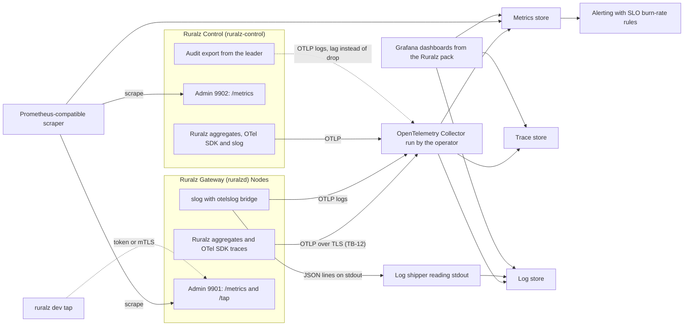
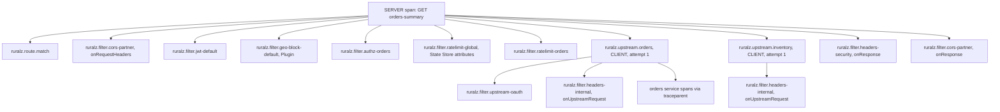

# Observability

## Summary

This document fixes how Ruralz Gateway and Ruralz Control report what they do: metrics, spans with W3C Trace Context propagation, logs, AI telemetry on the OpenTelemetry `gen_ai` conventions, Grafana dashboards, alerts, SLOs for Performance Budget values, debugging tools, and cardinality and overhead budgets. Telemetry is OpenTelemetry-first ([ADR-0010](../adr/0010-telemetry-opentelemetry-first.md)), never blocks a request and carries no secrets or payloads. Operators and contributors read it before wiring collectors or adding instruments.

## Scope and non-goals

In scope: every metric, span and log record `ruralzd` and `ruralz-control` emit, with budgets, Grafana dashboards, alerts, SLOs and debugging tools. "Pack 8.7" names a [foundation pack](../_meta/foundation-pack.md) section. Only three `Gateway.spec.telemetry` fields of the [Configuration model](02-configuration-model.md) (`otlp.endpoint`, `traceSampling`, `accessLog.when`) are used; other settings are [Open questions](#open-questions).

Non-goals: storing or querying telemetry (the operator's Collector and stores); time series in Ruralz Console; Performance Budget values, owned by [Performance budgets and benchmarking](12-performance-budgets-and-benchmarking.md), which wins on conflict; and the admin endpoint list, owned by [Data plane](03-data-plane.md#admin-endpoints).

## Observability principles

P10 requires OpenTelemetry signals and a metric for every degraded state; P3 forbids request-path coordination ([Vision and positioning](../vision/01-vision-and-positioning.md#principles)). Component documents MUST NOT break these rules without an ADR.

| ID | Rule | Consequence |
|---|---|---|
| O1 | OpenTelemetry first: traces and metrics through the OpenTelemetry Go SDK, logs through `log/slog` and the `otelslog` bridge ([ADR-0010](../adr/0010-telemetry-opentelemetry-first.md)) | One layer feeds OTLP and `/metrics` |
| O2 | Telemetry never blocks, slows or fails a request | Bounded span and log queues drop with a counter (TB-12); only the audit export lags instead (OQ-observability-19) |
| O3 | Every degraded state is a metric | `ruralz_node_degraded_info` with a fixed `reason` |
| O4 | No secrets, credentials or payloads in any signal | No resolved secret, credential header, query string (`url.full`, `url.query`) or body reaches a signal or `/tap` (threat T9, [Security and identity](08-security-and-identity.md)) |
| O5 | Bounded cardinality | Label values are Revision-bounded names or enumerations admitted at compile time, except Plugin guest event names ([Cardinality budget](#cardinality-budget)) |
| O6 | One correlation key | (`trace_id`, server `span_id`) links logs, spans and exemplars; `requestId` carries the trace ID ([Data plane](03-data-plane.md#error-response-format)); the span ID is OQ-observability-13 |
| O7 | Pay only for what is attached or sampled | Unsampled requests create no spans; `/tap` without a subscriber costs one atomic load |
| O8 | Self-hosted and air-gapped | No phone-home; the FIPS build (Planned (M5)) emits the same signals (P1) |

The Go SDK's traces and metrics are stable; its Logs API is a release candidate, expected stable in v1.47.0 ([source](https://github.com/open-telemetry/opentelemetry-go/blob/main/README.md)) ([source](https://github.com/open-telemetry/opentelemetry-go/releases/tag/v1.47.0-rc.1)), so logs keep the bridge. For OQ-tech-stack-and-libraries-16 this document recommends one `/metrics` exporter reading the OTLP aggregates, with a CI golden test for identical names.

Metric values live in Ruralz-owned aggregates, not SDK synchronous instruments, kept by name across Hot Reloads and read by both exporters, so each operation aggregates once and Ruralz ends series (SDK interface: OQ-observability-16). Only hot families shard: listener-scoped and enumeration-only families, at most 1,000 counter or gauge series and 64 histogram label sets (target), into S = min(`GOMAXPROCS` at start, 8) shards (target) padded to 64-byte cache lines. The stripe is assigned round robin per connection at accept, offset by the stream ID when multiplexed, and kept in the pooled request context; no runtime internal is read. Other label sets use one unpadded atomic per value.

### Telemetry pipeline

A Node pushes OTLP only when `Gateway.spec.telemetry.otlp.endpoint` is set; otherwise `/metrics` on 9901 still serves metrics, logs go to stdout as JSON lines, and trace context propagates without spans. OTLP across TB-12 MUST use TLS ([System overview](01-system-overview.md)) until OQ-security-and-identity-29 rewords TB-12. A cleartext endpoint, same-host included, breaks TB-12: the Node still exports, reports a cleartext `telemetry` hop and raises `cleartext_hop` (loopback exception: OQ-observability-20). Ruralz Control takes OTLP settings from process configuration (OQ-observability-11) and serves `/metrics` on 9902. Spans and logs pass through Ruralz bounded queues that never block, counting `queue_full`; a worker calls the SDK exporter, counting `export_error` per record of a failed batch.

*Figure 1: telemetry pipeline to OpenTelemetry collectors and stores; dashed edges are optional.*



Resource attributes are `service.name`, `service.version`, `service.instance.id` (`node.id` or replica) and, in Control mode, Cluster and Environment, never the active Revision. Providers rebuild once after Enrollment; aggregates carry over, so counters never reset.

```yaml
apiVersion: ruralz/v1alpha1
kind: Gateway
metadata:
  name: edge
spec:
  listeners:
    - name: http
      protocol: http
      port: 8080
  admin:
    port: 9901                      # /metrics, /tap, /debug/* (token or mTLS)
  telemetry:
    otlp:
      endpoint: ${OTEL_EXPORTER_OTLP_ENDPOINT:-https://otel-collector.observability:4317}   # TLS per TB-12; http:// is a reported cleartext hop
    traceSampling: 0.01             # root ratio when no parent decision arrives
    accessLog:
      when: 'response.status >= 400 || duration > duration("1s")'   # CEL; errors and slow requests only
```

## Metrics catalog

### Naming and label rules

- Names follow `ruralz_<component>_<name>_<unit>` (pack 2): base units, a counted noun for gauges, `total` for counters, `ratio` for fractions, `info` for 1-or-0 gauges. Instruments register UCUM units; `/metrics` MUST NOT append suffixes.
- `route`, `upstream`, `policy`, `plugin` and `listener` are resource or listener names (`route="_unmatched"` without a match); `phase` is a Phase; `code` a registered `RZ` code; `status_class` `1xx` to `5xx`; `protocol` `http1`, `http2`, `http3`, `grpc`, `websocket` or `sse` (the last four Planned (M3)), or `kafka`, `nats` or `mqtt` (Planned (M4)). Other labels are enumerations in their row or a named registry.
- Never a label: Consumer, credential, client address, method, path, query, host, trace ID, `node.id` or any user-supplied string other than Plugin guest event names (O5). Tier is allowed (Bundle-bounded).
- Histograms use five sets of 13 boundaries (16 series per label set); every SLO threshold is a boundary:

```yaml
fast:    [0.00001, 0.000025, 0.00005, 0.0001, 0.00015, 0.00025, 0.0005, 0.001, 0.0025, 0.005, 0.01, 0.025, 0.1]  # s, in-Node work
request: [0.001, 0.005, 0.01, 0.025, 0.05, 0.1, 0.25, 0.5, 1, 2.5, 5, 10, 60]   # s, requests, attempts, handshakes, Raft commits
control: [0.01, 0.05, 0.1, 0.25, 0.5, 1, 2, 5, 10, 30, 60, 120, 3600]          # s, activations, sessions, Rollouts, AI requests
bytes:   [64, 256, 1024, 4096, 16384, 65536, 262144, 1048576, 4194304, 16777216, 67108864, 268435456, 1073741824]
ratio:   [0.5, 0.75, 0.9, 0.95, 0.98, 0.99, 1, 1.01, 1.02, 1.05, 1.1, 1.25, 1.5]  # estimate divided by actual
```

### Ruralz Gateway metrics

Rows are Planned (M1) except `ruralz_plugin_*`, `ruralz_node_detached_seconds`, `ruralz_node_revocation_mark_age_seconds` and `ruralz_node_control_stream_reconnects_total`, Planned (M2); `ruralz_http_session_duration_seconds` and `ruralz_sse_buffered_total`, Planned (M3); and `ruralz_ingress_paused_partitions`, Planned (M4). Other documents' proposed names are accepted, renaming [Traffic management and resilience](09-traffic-management-and-resilience.md)'s `ruralz_upstream_endpoint_ejections_total` to `ruralz_upstream_ejections_total`.

| Metric | Type | Unit | Labels | Meaning or values |
|---|---|---|---|---|
| `ruralz_http_requests_total` | Counter | requests | `route`, `status_class` | Includes sessions |
| `ruralz_http_listener_requests_total` | Counter | requests | `listener`, `protocol`, `status_class`, `origin` | SLI of SLO-GW-1 |
| `ruralz_http_node_responses_total` | Counter | responses | `code` | Node-generated responses |
| `ruralz_http_request_duration_seconds` | Histogram, request | seconds | `route` | Unary exchange |
| `ruralz_http_session_duration_seconds` | Histogram, control | seconds | `listener`, `protocol` | Session lifetime |
| `ruralz_http_gateway_duration_seconds` | Histogram, fast | seconds | `listener` | SLI of SLO-GW-2, SLO-GW-3 |
| `ruralz_http_gateway_duration_skipped_total` | Counter | requests | `reason` | interval_overflow |
| `ruralz_http_request_body_bytes`, `ruralz_http_response_body_bytes` | Histogram, bytes | bytes | `listener` | Body sizes |
| `ruralz_http_active_requests` | Gauge | requests | `listener` | In flight |
| `ruralz_listener_open_connections` | Gauge | connections | `listener`, `protocol` | Open connections |
| `ruralz_listener_connections_total` | Counter | connections | `listener`, `protocol`, `result` | accepted, tls_failure, refused |
| `ruralz_listener_tls_handshake_duration_seconds` | Histogram, request | seconds | `listener` | TLS handshake; QUIC from Planned (M3) |
| `ruralz_filter_duration_seconds` | Histogram, fast | seconds | `policy`, `phase` | One Filter or Plugin call |
| `ruralz_filter_short_circuits_total` | Counter | responses | `policy`, `phase`, `status_class` | Policy responses |
| `ruralz_filter_failures_total` | Counter | failures | `policy`, `phase`, `mode` | open, closed |
| `ruralz_auth_decisions_total` | Counter | decisions | `policy`, `result`, `code` | allow, deny |
| `ruralz_auth_jwks_age_seconds`, `ruralz_auth_upstream_token_age_seconds` | Gauge | seconds | `policy` | Key and token age |
| `ruralz_auth_upstream_refresh_failures_total` | Counter | failures | `policy` | Token fetches |
| `ruralz_security_cleartext_hops` | Gauge | hops | `hop` | client, upstream, state_store, telemetry, admin |
| `ruralz_ratelimit_decisions_total` | Counter | decisions | `policy`, `result` | allow, deny_local, deny_global, fail_open ([ADR-0008](../adr/0008-rate-limiting-local-bucket-and-gcra.md)) |
| `ruralz_ratelimit_bucket_evictions_total` | Counter | entries | `policy` | Local keys evicted |
| `ruralz_quota_decisions_total` | Counter | decisions | `policy`, `result` | allow, deny, no_quota, fail_open |
| `ruralz_cache_requests_total` | Counter | requests | `route`, `result` | hit, miss, bypass, stale, stale_error |
| `ruralz_cache_store_skipped_total` | Counter | stores | `policy`, `reason` | size_limit, buffer_budget, memory |
| `ruralz_upstream_attempts_total` | Counter | attempts | `upstream`, `status_class`, `error` | none, connect, timeout, reset, tls |
| `ruralz_upstream_attempt_duration_seconds` | Histogram, request | seconds | `upstream` | Connect to last byte |
| `ruralz_upstream_retries_total`, `ruralz_upstream_retry_budget_exhausted_total` | Counter | retries | `upstream` | Made; skipped |
| `ruralz_upstream_breaker_state_info` | Gauge | info | `upstream`, `state` | closed, open, half_open |
| `ruralz_upstream_ejections_total` | Counter | ejections | `upstream`, `reason` | passive, active |
| `ruralz_upstream_healthy_endpoints` | Gauge | endpoints | `upstream` | Eligible Endpoints |
| `ruralz_upstream_degraded_info` | Gauge | info | `upstream`, `reason` | panic, discovery_stale |
| `ruralz_upstream_cel_errors_total` | Counter | errors | `upstream`, `field` | hashKey, retryOn, failureWhen |
| `ruralz_upstream_pool_connections` | Gauge | connections | `upstream`, `state` | idle, active |
| `ruralz_state_call_duration_seconds` | Histogram, fast | seconds | `op` | SLI of SLO-GW-5 |
| `ruralz_state_calls_total` | Counter | calls | `op`, `result` | ok, error, timeout, skipped |
| `ruralz_state_ops_total`, `ruralz_state_writes_dropped_total` | Counter | operations, writes | `kind` | In round trips; dropped by a full post-commit queue |
| `ruralz_state_write_queue_items` | Gauge | items | none | Queue depth |
| `ruralz_plugin_call_duration_seconds`, `ruralz_plugin_call_overhead_seconds` | Histogram, fast | seconds | `policy`, `phase` | Whole call; host time around the guest call, SLI of SLO-GW-4 |
| `ruralz_plugin_pool_wait_seconds` | Histogram, fast | seconds | `policy` | Instance wait |
| `ruralz_plugin_failures_total` | Counter | failures | `policy`, `code` | Traps, limits, denials |
| `ruralz_plugin_pool_instances` | Gauge | instances | `policy`, `state` | idle, busy |
| `ruralz_plugin_memory_reserved_bytes` | Gauge | bytes | `plugin` | Against the Node cap |
| `ruralz_plugin_guest_events_total` | Counter | events | `policy`, `name` | Guest `metric_add`, at most 16 names (target) |
| `ruralz_sse_buffered_total` | Counter | responses | `route` | SSE buffered for a gate |
| `ruralz_ingress_paused_partitions` | Gauge | partitions | `route`, `protocol` | Paused by poison messages |
| `ruralz_config_revision_info` | Gauge | info | `revision`, `role` | active, lkg |
| `ruralz_config_activations_total` | Counter | activations | `result`, `code` | activated, rejected |
| `ruralz_config_activation_duration_seconds` | Histogram, control | seconds | `stage`, `size_class` | SLI of SLO-GW-6 |
| `ruralz_config_retired_snapshots` | Gauge | snapshots | none | Pinned retired |
| `ruralz_snapshot_retirement_ended_total` | Counter | requests | none | Ended by `RZ-RT-014` |
| `ruralz_config_secret_rotation_failures_total` | Counter | failures | `provider` | env, file, kubernetes, vault |
| `ruralz_node_degraded_info` | Gauge | info | `reason` | [Degraded states](#degraded-states) |
| `ruralz_node_buffered_bytes` | Gauge | bytes | none | Of `limits.maxBufferedBytes` |
| `ruralz_node_detached_seconds`, `ruralz_node_revocation_mark_age_seconds` | Gauge | seconds | none | Since Control Stream loss; revocation mark age |
| `ruralz_node_control_stream_reconnects_total` | Counter | reconnects | `result` | success, failure |
| `ruralz_runtime_goroutines`, `ruralz_runtime_heap_bytes`, `ruralz_runtime_gc_cycles_total` | Gauge; Counter for cycles | goroutines, bytes, cycles | none | Live goroutines, live heap, GC cycles |
| `ruralz_telemetry_spans_total`, `ruralz_telemetry_spans_dropped_total` | Counter | spans | `reason` when dropped | Offered to export; queue_full, export_error |
| `ruralz_telemetry_traces_unsampled_total` | Counter | traces | `reason` | rate_cap_root, rate_cap_parent |
| `ruralz_telemetry_logs_total`, `ruralz_telemetry_logs_dropped_total` | Counter | records | `stream`; `reason` when dropped | access, process; queue_full, export_error |
| `ruralz_telemetry_folded_label_sets` | Gauge | label sets | `instrument` | Folded into `_overflow` |
| `ruralz_telemetry_series` | Gauge | series | `state` | live, retiring |
| `ruralz_tap_events_dropped_total` | Counter | events | none | Slow `/tap` subscribers |

`origin` is `upstream`, `node`, or `dependency` for Node-generated Upstream or `AIProvider` failures (`RZ-UP` codes, `RZ-AI-004`, `RZ-AI-005`, `RZ-AI-013`). `stage` is verify, plugin_compile, compile, swap or total; `size_class` is le1000, le10000 or gt10000 Routes. `op` is gcra, quota, budget, cache_get, semantic_get, script_multi (merged consumptive calls), pipeline (a read batch, pack 8.7 rule 3), or a write kind: cache_set, semantic_set, cache_invalidate, refund or settle. `kind` is a write kind for dropped writes, any single-operation `op` otherwise.

Both binaries read `ruralz_runtime_*` from `runtime/metrics` (SDK names: OQ-observability-15). [WASM plugin system](05-wasm-plugin-system.md#observability)'s proposed names and reasons are accepted; `ruralz_plugin_call_overhead_seconds`, added for SM-6, spans instance checkout to guest entry and guest return to call end.

### Gateway-added time

`ruralz_http_gateway_duration_seconds` is wall-clock time minus the union of excluded intervals: client reads and writes, upstream I/O, State Store round trips and declared remote calls (pack 8.7 rule 6). Upstream I/O is time blocked on the Upstream (pooled-connection wait, dial, TLS, awaiting headers, blocked body reads and writes); Filters and copy work during a leg stay gateway-added. Intervals merge on insert, so parallel `aggregate` legs count once; a request keeps at most 32 (target) in a pooled buffer, beyond which it is skipped and counted. Unary exchanges end at the last byte, `text/event-stream` responses at header commit; sessions are not measured. The access log reuses it, within the Metrics CPU budget, matching SM-4 and SM-5 ([Vision and positioning](../vision/01-vision-and-positioning.md#success-metrics)).

### Degraded states

Reasons are Planned (M1) unless tagged.

| `reason` | Raised while |
|---|---|
| `detached` | The Control Stream is lost; Planned (M2) |
| `lkg_boot` | Booted Last-Known-Good; no source answered |
| `lkg_write_failed` | Last-Known-Good writes keep failing |
| `revision_signature_off`, `plugin_signature_off` | Revision or Plugin verification is `off` ([ADR-0017](../adr/0017-artifact-signing.md)); Planned (M2) |
| `plugin_pool_degraded` | A pool is degraded after `RZ-PLG-008`; Planned (M2) |
| `state_store_memory_fallback` | No State Store, Node count unknown |
| `state_store_memory_multi_node` | `memory` in a multi-Node Cluster (pack 8.8); Planned (M2) |
| `state_store_unauthenticated` | The resolved `stateStore.url` carries no credentials |
| `state_store_breaker_open` | The State client breaker is open |
| `state_store_eviction_policy` | The State Store is not `noeviction` |
| `semantic_cache_unsupported` | No vector commands; Planned (M3) |
| `upstream_panic`, `discovery_stale` | An Upstream is in panic mode; keeps its last Endpoint set |
| `header_limit_capped` | The header limit exceeds the process ceiling |
| `secret_rotation_failed`, `jwks_stale` | A secret rotation or JWKS fetch fails; the last value serves |
| `cleartext_hop` | `ruralz_security_cleartext_hops` is above 0 |
| `node_count_unknown` | A derived Rate Limit ceiling lacks the published Node count; Planned (M2) |
| `revocation_sequence_gap` | A revocation sequence gap, or a mark older than 30 s (target); Planned (M2) |
| `telemetry_export_failing` | OTLP export fails past one interval |

File mode without a declared ceiling uses the full limit (pack 8.8), which is not degraded. [Failure matrix](09-traffic-management-and-resilience.md#failure-matrix) rows map to these reasons, call results, `fail_open`, `memory` skips, dropped writes, bucket evictions, Upstream metrics and, for lost Nodes, `ruralz_control_cluster_nodes`; failover and Cell loss show only as call errors (OQ-observability-18).

## Tracing

### Propagation

Ruralz Gateway uses W3C Trace Context on every hop:

1. It extracts `traceparent` and `tracestate`; a valid `traceparent` parents the server span, otherwise a trace starts.
2. It decides sampling once: a valid parent's flag, else `Gateway.spec.telemetry.traceSampling` (default: OQ-observability-1, 0.01 assumed). Two per-Node token buckets admit sampled traces (target): root at 1,000 per second, parent at 500, bursts equal to rates, so client-forced sampling cannot starve root sampling. A request over its bucket is unsampled and counted, never dropped.
3. It injects `traceparent`, with its decision, and `tracestate` into every upstream leg: HTTP from Planned (M1), gRPC from Planned (M3), Kafka, NATS and MQTT 5 from Planned (M4).
4. It returns the trace ID as `requestId` in every problem document.

Trace and span IDs, needed even unsampled, come from a lock-free per-connection random source. The root cap is twice the default rate at an assumed 50,000 requests per second per Node (hypothesis; OQ-observability-17); at 15 spans per trace (Figure 2) both caps allow 22,500 spans per second (target). Untrusted clients' flags are OQ-observability-4. Baggage is never propagated.

### Span model

A sampled request has a server span `<method> <route>` (`_OTHER` for methods outside RFC 9110 and PATCH) and children named per pack 2.

| Span | Kind | Created | Key attributes |
|---|---|---|---|
| Server span | SERVER | Once per request | HTTP conventions minus `url.full` and `url.query`; Route, listener, Revision, Consumer, Tier, `RZ` code |
| `ruralz.route.match` | INTERNAL | Before `onRequestHeaders` | Matched Route or `_unmatched` |
| `ruralz.filter.<name>` | INTERNAL | Once per Policy Phase call | Type, Phase, outcome, `failureMode` applied, State Store `op` and duration |
| `ruralz.upstream.<name>` | CLIENT | Once per leg attempt | Attempt, Endpoint, status or error, composition step |

- Children follow pack 8.12 order; upstream-scoped Policies are children of their leg's span.
- `headers` and `transform` run, and create spans, only in the Phases their config uses ([Configuration model](02-configuration-model.md#worked-example)).
- `onChunk` creates one span per subscribed Policy per stream, with chunk count and time; a `failureMode: closed` ending adds a span event.
- `onLog` creates no span.
- State Store calls are attributes of the calling Filter's span; a shared round trip is recorded on the first Filter's span and named by the others in `ruralz.state.batch`.

*Figure 2: the 15 Ruralz spans of one sampled request to the Configuration model's `orders-summary` Route, which aggregates two Upstreams.*



gRPC, WebSocket and SSE sessions (Planned (M3)) produce one server span per call or session, never per message. Ruralz Control emits server spans for REST API requests and Control Stream RPCs and an INTERNAL `rollout batch` span per batch, with no `ruralz.*` names.

## Logging and access logs

### Process logs

Both binaries log through `log/slog` as JSON lines on stdout and, with an OTLP endpoint, as OTLP logs through the bridge and a bounded processor that drops with a counter. `RURALZ_LOG_LEVEL` (`debug`, `info`, `warn`, `error`; default `info`) never changes a Revision (pack 2). Records carry time, level, component, `node.id` or replica, the active Revision, trace and span IDs, and error codes. Changing the level live is OQ-observability-6.

### Access logs

A Node writes one access log record per request in `onLog`, or per session at close; `Gateway.spec.telemetry.accessLog.when` (CEL over the base variables, `response`, `upstream` and `duration`) selects them, and a runtime error writes the entry. Without it every request is logged, possibly tens of MB per second per Node (hypothesis), so busy Nodes SHOULD set an errors-only `when`. The request goroutine evaluates `when` and fills a pooled record for a worker to encode; a full queue drops with a counter. Destination, format and sampling are OQ-observability-3.

| Field | Content |
|---|---|
| `time` | Request start, RFC 3339 with microseconds |
| `trace_id`, `span_id`, `sampled` | Server span context (O6) |
| `node_id`, `revision` | `node.id`; the pinned Revision as `rev-<12 hex>` |
| `listener`, `protocol`, `route` | Listener name and protocol; matched Route or `_unmatched` |
| `method`, `host`, `path`, `truncated` | No query string; `host` and `path` cut at 256 and 1,024 bytes (target), flagged in `truncated` |
| `status`, `code` | Final status, gRPC status or WebSocket close code; the `RZ` code |
| `duration`, `request_bytes`, `response_bytes` | Total time or session lifetime; body bytes |
| `gateway_duration`, `upstream_duration`, `state_store_duration` | Gateway-added time; upstream I/O; State Store round trips |
| `client_address` | `source.ip` after trusted-proxy handling; masking is OQ-observability-7 |
| `user_agent`, `tls_version` | Truncated `User-Agent`; TLS version |
| `consumer`, `tier`, `auth_method` | When authenticated |
| `upstream`, `endpoint`, `attempts` | Last upstream leg |
| `short_circuit`, `failure_modes` | Policy and Phase that responded; undecided Policies with `failureMode` applied |
| `cache` | Response Cache or Semantic Cache result |
| `messages_in`, `messages_out` | Session message counts |
| `ai` | AI fields ([AI observability](#ai-observability)) |

Bodies, header values, query strings, secrets and prompt or completion text never appear (O4).

## AI observability

AI telemetry, Planned (M3), follows the OpenTelemetry `gen_ai` semantic conventions and [AI/LLM gateway](06-ai-llm-gateway.md#ai-observability) under [ADR-0014](../adr/0014-ai-api-surface.md). Each `AIModel` candidate attempt against an `AIProvider` is a `ruralz.upstream.<name>` span, so Provider Fallback shows as sibling attempts; the server span carries the virtual model.

### `gen_ai` attributes and stability

Candidate spans carry `gen_ai.provider.name`, `gen_ai.usage.input_tokens`, `gen_ai.usage.output_tokens`, `gen_ai.usage.cache_read.input_tokens`, `gen_ai.usage.cache_write.input_tokens` and `gen_ai.usage.reasoning.output_tokens` ([source](https://github.com/open-telemetry/semantic-conventions-genai/blob/main/docs/gen-ai/gen-ai-spans.md)), never content attributes such as `gen_ai.input.messages`.

The conventions left the main repository in semantic-conventions v1.42.0 ([source](https://github.com/open-telemetry/semantic-conventions/releases/tag/v1.42.0)); the new repository has no tagged release ([source](https://github.com/open-telemetry/semantic-conventions-genai)) and marks its documents Development ([source](https://github.com/open-telemetry/semantic-conventions-genai/tree/main/docs/gen-ai)). For OQ-ai-llm-gateway-11 this document chooses option (a): each release pins one commit, named in its release notes, and never captures content (OQ-observability-8). The `ruralz_ai_*` metrics are the stable contract.

### AI metrics

"Model labels" are `aimodel`, `provider` (the `AIProvider` name) and `model`. Only token, cost and Semantic Cache counters carry `route`. No AI metric carries a Consumer label; per-Consumer usage lives in access logs and usage records, which `ruralz ai cost` (Planned (M3)) aggregates.

| Metric | Type | Unit | Labels | Mirrors, meaning or values |
|---|---|---|---|---|
| `ruralz_ai_tokens_total` | Counter | tokens | `route`, model labels, `type` | `gen_ai.client.inference.usage.*` ([source](https://github.com/open-telemetry/semantic-conventions-genai/blob/main/docs/gen-ai/gen-ai-token-metrics.md)); input, cache_read, cache_write, output, reasoning |
| `ruralz_ai_cost_total` | Counter | currency units | `route`, model labels, `tier`, `currency` | Priced usage |
| `ruralz_ai_unpriced_requests_total` | Counter | requests | model labels | No pricing row |
| `ruralz_ai_request_duration_seconds` | Histogram, control | seconds | model labels | `gen_ai.client.operation.duration` ([source](https://github.com/open-telemetry/semantic-conventions-genai/blob/main/docs/gen-ai/gen-ai-metrics.md)) |
| `ruralz_ai_time_to_first_token_seconds` | Histogram, request | seconds | model labels | `gen_ai.client.operation.time_to_first_chunk` ([source](https://github.com/open-telemetry/semantic-conventions-genai/blob/main/docs/gen-ai/gen-ai-metrics.md)) |
| `ruralz_ai_time_per_output_chunk_seconds` | Histogram, request | seconds | model labels | `gen_ai.client.operation.time_per_output_chunk` ([source](https://github.com/open-telemetry/semantic-conventions-genai/blob/main/docs/gen-ai/gen-ai-metrics.md)); added here |
| `ruralz_ai_fallbacks_total` | Counter | fallbacks | `aimodel`, `from`, `to`, `error_class` | `AIProvider` names; connect, rate_limit, spend_cap, server_error, pre_content, credential, context_window |
| `ruralz_ai_failed_attempts_total`, `ruralz_ai_abandoned_attempts_total` | Counter | attempts | `provider`, `model` | Error status or abandoned, no usage |
| `ruralz_ai_budget_decisions_total` | Counter | decisions | `policy`, `result` | reserved, denied, no_quota, fail_closed, fail_open |
| `ruralz_ai_settlements_total` | Counter | settlements | `provider`, `model` | Attempts settled with reported usage |
| `ruralz_ai_usage_missing_total` | Counter | requests | `provider`, `model`, `reason` | disconnect, interrupted, none_reported, abandoned, error_status, oversized |
| `ruralz_ai_estimate_error_ratio` | Histogram, ratio | ratio | `provider`, `model` | Estimate divided by actual input |
| `ruralz_ai_semantic_cache_requests_total` | Counter | requests | `route`, `result` | hit, miss, bypass |
| `ruralz_ai_semantic_cache_store_skipped_total` | Counter | stores | `route`, `reason` | error, truncated, blocked, size_limit, queue_full |
| `ruralz_ai_guardrail_decisions_total` | Counter | decisions | `policy`, `phase`, `action` | block, redact, flag |
| `ruralz_ai_cache_markers_dropped_total` | Counter | markers | model labels | Prompt Cache markers lost |

The access log `ai` object adds the virtual model, candidates, usage, cost, `pricing.version`, cache, settlement and guardrail results.

## Grafana dashboards and SLOs

### Grafana dashboard pack

Ruralz ships Grafana dashboards, Planned (M1) unless tagged, as Apache-2.0 JSON in the monorepo and in the Helm chart from Planned (M2) ([ADR-0016](../adr/0016-kubernetes-helm-and-crds.md), proposed), with alert rules generated from the catalog. CI fails on a panel using an unlisted metric and parses every rule with a PromQL parser.

| Grafana dashboard | Main panels |
|---|---|
| Ruralz Gateway overview | Rate, errors by origin, gateway-added latency, degraded states |
| Route detail | Per-Route rate, errors, duration, cache, exemplars |
| Policies and Filter Chain | Duration, short-circuits, failures, auth |
| Upstreams and resilience | Attempts, retries, breakers, Endpoints, ejections, pools |
| State Store, Rate Limits and Quotas | Round trips, breaker, fail-open, dropped writes |
| Node runtime and configuration | Runtime, buffers, activations, snapshots, cleartext hops |
| Telemetry health | Drops, capped traces, folded and retiring series |
| SLO burn rates | Budget remaining and burn rate per SLO |
| Plugins | Call latency and overhead, pool wait, failures, memory; Planned (M2) |
| Ruralz Control and Rollouts | Rollouts, NACKs, Drift, leader, Node count, audit lag; Planned (M2) |
| AI gateway | Tokens, cost, time to first token, fallbacks, budgets; Planned (M3) |

### SLO definitions

An SLO is a production objective; a Performance Budget is the lab ceiling on the same metric and threshold, owned and verified in CI by [Performance budgets and benchmarking](12-performance-budgets-and-benchmarking.md) and tied to an SLO ID below; windows are 30 days.

| SLO ID | SLI | Objective | Seed and tie |
|---|---|---|---|
| SLO-GW-1 | 1 − `ruralz_http_listener_requests_total{status_class="5xx", origin="node"}` / all of it | 99.95% (target) | Proposed here |
| SLO-GW-2 | `ruralz_http_gateway_duration_seconds` bucket `le="0.001"` / `_count` | 99% (target) | SM-4 (1 ms p99, target) |
| SLO-GW-3 | Same metric, bucket `le="0.00015"` / `_count` | 50% (target) | SM-5 (150 µs p50, target) |
| SLO-GW-4 | `ruralz_plugin_call_overhead_seconds` bucket `le="0.00005"` / `_count` | 99% (target) | SM-6 (50 µs p99, target), same metric |
| SLO-GW-5 | `ruralz_state_call_duration_seconds{op="gcra"}` bucket `le="0.001"` / `_count`, `script_multi` excluded | 99% (hypothesis) | System overview same-zone GCRA seed (1 ms p99, hypothesis) |
| SLO-GW-6 | `ruralz_config_activation_duration_seconds{stage="compile", size_class!="gt10000"}` bucket `le="2"` / `_count` | 99% (target) | System overview seed: 10,000 Routes in 2 s on one core (target) |
| SLO-GW-7 | 1 − dropped / produced, summing the `ruralz_telemetry_spans_*` and `ruralz_telemetry_logs_*` counters | 99.9% (target) | Proposed here; without OTLP, logs only |
| SLO-AI-1 | 1 − M / (`ruralz_ai_settlements_total` + M), M being `ruralz_ai_usage_missing_total{reason=~"none_reported\|interrupted\|oversized"}`, both summed over `provider` and `model` | 99% (hypothesis) | Proposed here |
| SLO-CP-1 | `ruralz_control_rollout_duration_seconds{strategy="all-at-once", size_class="le100"}` bucket `le="30"` / `_count` | 95% (target) | SM-9 (30 s p95, target); Plugins cached in the lab only |
| SLO-CP-2 | 1 − `ruralz_control_api_requests_total{status_class="5xx"}` / all of it | 99.9% (target) | Proposed here |

For SLO-AI-1, `disconnect`, `abandoned` and `error_status` are not lost usage and leave both terms.

### Alert rules

```yaml
# Burn-rate rules cover every SLO objective of 90% or more (target): page when the 1 h and
# 5 min windows both burn at 14 times the budget rate, ticket at 6 times over 6 h and 30 min (target).
# max by (cluster) over leader series avoids double counts and stale pages.
groups:
  - name: ruralz
    rules:
      - alert: RuralzNodeDegradedPage          # Grafana dashboard: Ruralz Gateway overview
        expr: ruralz_node_degraded_info{reason=~"state_store_breaker_open|upstream_panic"} == 1
        for: 5m                                # (target)
        labels: {severity: page}
      - alert: RuralzNodeDegraded
        expr: ruralz_node_degraded_info{reason!~"state_store_breaker_open|upstream_panic"} == 1
        for: 5m                                # (target)
        labels: {severity: ticket}
      - alert: RuralzGatewayP50                # SLO-GW-3 threshold rule
        expr: sum(rate(ruralz_http_gateway_duration_seconds_bucket{le="0.00015"}[1h])) / sum(rate(ruralz_http_gateway_duration_seconds_count[1h])) < 0.5   # 50% objective (target)
        for: 30m                               # (target)
        labels: {severity: ticket}
      - alert: RuralzStateWritesDropped        # State Store, Rate Limits and Quotas
        expr: rate(ruralz_state_writes_dropped_total[5m]) > 0
        for: 10m                               # (target)
        labels: {severity: ticket}
      - alert: RuralzSeriesFolded              # Telemetry health; new folding only, since large Bundles fold by design
        expr: delta(ruralz_telemetry_folded_label_sets[15m]) > 0
        labels: {severity: ticket}
      - alert: RuralzAIProviderCredential      # AI gateway; provider credential failures (RZ-AUTH)
        expr: increase(ruralz_ai_fallbacks_total{error_class="credential"}[15m]) > 0
        labels: {severity: ticket}
      - alert: RuralzControlNoLeader           # Ruralz Control and Rollouts, as are the rules below
        expr: max by (job) (ruralz_control_leader_info) < 1 or absent(ruralz_control_leader_info)   # one job per Ruralz Control deployment
        for: 1m                                # (target)
        labels: {severity: page}
      - alert: RuralzControlReplicaStale
        expr: ruralz_control_leader_contact_age_seconds > 10   # 10 s (target): ten default election timeouts, below the 30 s Reconnect threshold
        labels: {severity: ticket}
        annotations:
          description: "Stale replica: serves only Nodes without an active digest; at 30 s stale (target) it sends Reconnect and its Nodes move"
      - alert: RuralzClusterNodesRising
        expr: max by (cluster) (ruralz_control_cluster_nodes) > 1.25 * max by (cluster) (ruralz_control_cluster_nodes offset 1h)   # 25% in 1 hour (target)
        labels: {severity: ticket}
      - alert: RuralzTampering
        expr: max by (cluster) (ruralz_control_drift_nodes{kind="tampering"}) > 0 or max by (cluster) (increase(ruralz_control_nacks_total{code="RZ-CFG-027"}[1h])) > 0
        labels: {severity: page}
      - alert: RuralzRolloutFailed
        expr: max by (cluster) (increase(ruralz_control_rollouts_total{state="failed"}[15m])) > 0
        labels: {severity: page}
      - alert: RuralzNodeQuarantined
        expr: max by (cluster) (ruralz_control_quarantined_nodes) > 0
        for: 15m                               # (target)
        labels: {severity: ticket}
      - alert: RuralzDriftPersistent
        expr: max by (cluster) (ruralz_control_drift_nodes{kind=~"laggard|lkg"}) > 0 or max by (cluster) (ruralz_control_git_divergence_seconds) > 3600   # 1 hour (target)
        for: 30m                               # (target)
        labels: {severity: ticket}
      - alert: RuralzAuditExportLagging
        expr: max(ruralz_control_audit_export_lag_entries) > 10000   # (target)
        for: 15m                               # (target)
        labels: {severity: ticket}
```

## Debugging tools

Tools, Planned (M1) unless tagged, use the admin ports ([Data plane](03-data-plane.md#admin-endpoints)) or the CLI. Only `/tap` and running profiles cost the request path; mutex and block profiling run only during a `?seconds=` request.

| Tool | Answers |
|---|---|
| `requestId` lookup | Access log records by trace ID, then the sampled trace |
| `ruralz dev tap` over `/tap` | Live sampled, redacted request metadata |
| `/debug/pprof/` | CPU, heap, goroutine, mutex and block profiles; on 9902 Planned (M2) |
| `/debug/snapshots`, `/debug/upstreams` | Pinned snapshots; Endpoint health and breakers |
| `ruralz node dump`, `ruralz bundle diff` | The active Revision without secrets; its diff from a Bundle |
| `ruralz bundle render --effective --route` | The resolved Filter Chain and its expected spans |
| `ruralz node list`, `ruralz rollout status` | Digests per Node; batches, NACK codes, lagging Nodes; Planned (M2) |

Only a sampled `traceparent` forces a trace, within the parent cap. A trace ID response header is OQ-observability-9.

## Control plane observability

Ruralz Control (Planned (M2)) exports signals like a Node, with the same aggregates and limits. Every replica exports replica series (R); only the leader exports leader series (L). L counters restart with a new start time after failover, which `rate()` and `increase()` tolerate, so nothing extra reaches Raft; L gauges come from Control Store records or heartbeat aggregates, returning after resync. Nodes send digests and counters on heartbeats ([ADR-0007](../adr/0007-control-stream-protocol.md)); Ruralz Control never scrapes Nodes.

| Metric | Type | Unit | Labels | From | Meaning or values |
|---|---|---|---|---|---|
| `ruralz_control_rollouts_total` | Counter | rollouts | `cluster`, `state` | L | complete, rolled-back, failed |
| `ruralz_control_rollout_state_info` | Gauge | info | `cluster`, `state` | L | Current Rollout state |
| `ruralz_control_rollout_duration_seconds` | Histogram, control | seconds | `cluster`, `strategy`, `size_class` | L | all-at-once, canary; le100, le1000, gt1000 Nodes |
| `ruralz_control_nacks_total` | Counter | nacks | `cluster`, `kind`, `code` | L | deterministic, transient |
| `ruralz_control_drift_nodes` | Gauge | nodes | `cluster`, `kind` | L | laggard, lkg, tampering |
| `ruralz_control_quarantined_nodes`, `ruralz_control_cluster_nodes` | Gauge | nodes | `cluster` | L | Quarantined; published `clusterNodeCount` |
| `ruralz_control_git_divergence_seconds` | Gauge | seconds | `cluster` | L | Git divergence age |
| `ruralz_control_schema_skew_nodes` | Gauge | nodes | `cluster` | L | RZ-CFG-024, not Drift |
| `ruralz_control_build_failures_total` | Counter | failures | `environment`, `code` | L | Failed branch heads |
| `ruralz_control_enrollments_total` | Counter | enrollments | `result` | L | issued, rejected, revoked |
| `ruralz_control_audit_events_total` | Counter | events | `action`, `result` | L | Action registry; success, failure |
| `ruralz_control_audit_export_lag_entries` | Gauge | entries | none | L | Committed, not exported |
| `ruralz_control_connected_nodes` | Gauge | nodes | `cluster` | R | Streams to this replica |
| `ruralz_control_stream_reconnects_total` | Counter | reconnects | `result` | R | accepted, shed |
| `ruralz_control_heartbeat_aggregates_dropped_total` | Counter | aggregates | none | R | Dropped before forwarding |
| `ruralz_control_api_requests_total` | Counter | requests | `operation`, `status_class` | R | Operation registry |
| `ruralz_control_auth_failures_total` | Counter | events | none | R | Sign-in failures over the cap |
| `ruralz_control_leader_info` | Gauge | info | none | R | Raft leader or `postgres` lease holder |
| `ruralz_control_leader_contact_age_seconds` | Gauge | seconds | none | R | Staleness: stale above one election timeout ([fencing](04-control-plane-and-gitops.md#fencing-stale-replicas)) |
| `ruralz_control_raft_commit_duration_seconds` | Histogram, request | seconds | none | R | Raft commit time |

The action and operation registries belong to [Control plane and GitOps](04-control-plane-and-gitops.md#drift-detection); these names fill its Drift metric deferral.

For OQ-control-plane-and-gitops-12 this document chooses option (a), OpenTelemetry logs, with the Control Store's committed audit log as the queue. The leader exports batches keyed by Raft index and advances a Raft-recorded high-water mark, at most once per second (target), to the highest contiguously acknowledged index; an OTLP partial success counts as failure. Export retries, so it lags and never drops, unlike TB-12 (OQ-observability-19); a new leader resumes from the mark, so delivery is at least once, deduplicated on the Raft index attribute. `/api/v1/audit` stays authoritative.

## Cardinality and overhead budgets

### Overhead per signal

Budgets are per request, defaults minus telemetry off, on the reference hardware of [Performance budgets and benchmarking](12-performance-budgets-and-benchmarking.md), access-logging every request. Memory is RSS above the 96 MiB idle budget (target) in [Tech stack and libraries](../engineering/01-tech-stack-and-libraries.md) (OQ-observability-17).

| Signal | CPU per request | Allocations per request | Memory per Node |
|---|---|---|---|
| Metrics | 2 µs or less (target) | 0 (target) | 24 MiB or less (target) |
| Tracing, unsampled | 1 µs or less (target) | 2 or fewer (target) | None (target) |
| Tracing, sampled trace of 15 spans | 30 µs or less, export excluded (target) | 60 or fewer (target) | 8,192-span queue, 8 MiB or less (target) |
| Access log, logged request | 2 µs or less at p99, `when` included (target) | 8 or fewer (target) | 8,192-record queue, 4 MiB or less (target) |
| Process logs at `info` | None (target) | 0 (target) | 1 MiB or less (target) |
| `/tap`, no subscriber | Under 10 ns (target) | 0 (target) | None (target) |
| `/tap`, one subscriber | 2 µs or less per event (target) | 1 per event (target) | 1 MiB each, at most 4 (target) |
| All telemetry at defaults | 5% or less of Node CPU at half saturation (target) | Within the performance budget (target) | 40 MiB or less, no `/tap` subscriber (target) |

Estimates, each checked by an M1 benchmark (hypothesis): 15 metric operations in the SM-4 scenario and 40 for 10 Filters; 4 allocations per span; 8 for the example `when`. Sampled traces average 0.01 × 30 µs = 0.3 µs per request and at most 1,500 × 30 µs, 4.5% of one core, at both caps (target); the span queue then holds 0.36 s (hypothesis), so longer Collector stalls burn SLO-GW-7. Worker encoding and export count toward the 5% row (hypothesis).

Metrics memory, checked by an M1 heap and contention benchmark at 4 P and 32 P, assumes 120 bytes per counter or gauge series and 300 per histogram label set, 64 × S and 192 × S more when sharded, and 120 per exported series in a collection (hypothesis). At the Node limit of 125,000 series, half histogram buckets, the unsharded part is about 22.6 MiB; the capped sharded set adds 0.3 MiB at 4 P (S = 4) and 0.6 MiB at 32 P (S = 8), so Metrics stays near 23 MiB and All telemetry near 36 MiB (hypothesis).

### Cardinality budget

Under O5 the compiler admits label sets in deterministic order (kind, then `metadata.name` bytes) within admission limits (target) of 6,000 per counter or gauge family, 2,000 per histogram family and 100,000 series per Revision; the rest fold into `_overflow`, identically on every Node. Listener and enumeration families, including SLO SLIs, are admitted first and never fold. The compiler reserves 16 `ruralz_plugin_guest_events_total` series per Plugin Policy; names bind first come at runtime, may differ between Nodes and never fold further, since the Plugin ABI refuses a 17th.

A label set only retired or closing snapshots reference is retiring; with K = 2 retired plus one closing snapshot ([Data plane](03-data-plane.md#configuration-snapshots-and-hot-reload)), streams can pin four disjoint Route name sets for hours. A Node-wide ceiling of 25,000 retiring series (target) caps a Node at 125,000 series: beyond it the oldest retiring sets fold into `_overflow`, values and late records included; per-Revision admission ignores retiring sets, so live folding stays identical on every Node. A retiring set is released when its last snapshot is freed; a returning name restarts from 0.

A CI test of 1,000 Hot Reloads, each renaming every Route, MUST keep `ruralz_telemetry_series{state="retiring"}` within 25,000 (target), fold only retiring sets, return to the single-Revision count once old snapshots are freed, and see at most 2 `ruralz_config_revision_info` series.

For 1,000 Routes, 300 Upstreams, 300 Policy and Phase pairs, 50 Plugin Policies and 100 AI model label sets, the worst case per Node is about 65,600 series (hypothesis):

| Families | Series |
|---|---|
| Route duration histogram; Route status counter | 16,000; 5,005 (hypothesis) |
| Filter, upstream attempt, Plugin and AI histograms | 4,800; 4,800; 1,600; 6,400 (hypothesis) |
| AI token and cost counters at their limits; other AI counters | 12,000; 800 (hypothesis) |
| Cache counters (400 cached Routes, 100 Semantic Cache Routes); Plugin guest events | 2,800; 800 (hypothesis) |
| Upstream-scoped; Policy-scoped; other and fixed families | 3,600; 4,000; 3,000 (hypothesis) |

With the Route histogram at its limit it is about 81,600: about 8.2 million series per 100-Node Cluster, at most 12.5 million with every retiring ceiling full (hypothesis). Beyond the limits, traces and logs carry per-Route detail (OQ-observability-10, OQ-observability-12).

## Open questions

| ID | Question | Options | Owner | Blocking? |
|---|---|---|---|---|
| OQ-observability-1 | Which schema default should `traceSampling` have? | (a) 0.01 (proposed); (b) 0.05, the Configuration model example | configuration-model | No |
| OQ-observability-2 | How does OTLP export get TLS client settings and authentication (cleartext itself: OQ-security-and-identity-29, owner system-overview)? | (a) `telemetry.otlp` fields; (b) a Collector sidecar | configuration-model | Yes, for TLS export (M1) |
| OQ-observability-3 | Should access log destination, format and sampling be configurable? | (a) No (current); (b) `accessLog` fields | configuration-model | No |
| OQ-observability-4 | Should a Node honor an untrusted client's sampled flag? | (a) Yes, capped (current); (b) trusted proxies only | security-and-identity | No |
| OQ-observability-5 | Are per-Route sampling overrides needed? | (a) No (current); (b) a `Route` field | configuration-model | No |
| OQ-observability-6 | How is the log level changed live? | (a) Restart (current); (b) an admin path | data-plane | No |
| OQ-observability-7 | How is the client address stored in access logs? | (a) Full (current); (b) truncated; (c) keyed hash | security-and-identity | No |
| OQ-observability-8 | Should `gen_ai` content capture ever be allowed? | (a) Never (current); (b) opt-in with redaction | ai-llm-gateway | No |
| OQ-observability-9 | Should responses carry the trace ID in a header? | (a) No (current); (b) `traceparent`; (c) a Gateway field | data-plane | No |
| OQ-observability-10 | Should admission limits, trace caps and queues be configurable? | (a) No (current); (b) `telemetry` fields | configuration-model | No |
| OQ-observability-11 | How does Ruralz Control name its OTLP and log settings? | (a) `RURALZ_*` variables; (b) its configuration file | control-plane-and-gitops | No |
| OQ-observability-12 | How are Routes aggregated beyond the admission limit? | (a) `_overflow` (current); (b) by a Route label | observability | No |
| OQ-observability-13 | How does `requestId` tell apart requests sharing a trace ID? | (a) `<trace-id>-<span-id>`; (b) a `spanId` member | data-plane | No |
| OQ-observability-14 | Should heartbeats add latency histograms for Rollout gates, beside the request, 5xx and rejection counters they carry? | (a) No (current); (b) Yes | control-plane-and-gitops | No |
| OQ-observability-15 | May Go runtime metrics keep SDK names outside pack 2? | (a) No, `ruralz_runtime_*` (current); (b) pack amendment | tech-stack-and-libraries | No |
| OQ-observability-16 | Which OpenTelemetry Go SDK interface exports Ruralz aggregates and ends series, at what cost? | (a) External producer; (b) callback instruments; (c) Ruralz encoders, needing an ADR-0010 amendment | tech-stack-and-libraries | Yes, for M1 metrics |
| OQ-observability-17 | Do 50,000 requests per second (hypothesis), 96 MiB idle RSS and 40 MiB of telemetry (target) fit together? | (a) Adopt as seeds; (b) lower admission limits or the retiring ceiling; (c) raise the idle budget | performance-budgets-and-benchmarking | No |
| OQ-observability-18 | How is a State Store failover rollback or lost Cell reported? | (a) State Store monitoring (current); (b) Ruralz Control | scalability-and-distributed-state | No |
| OQ-observability-19 | Should TB-12 in System overview exempt the audit export, which retries from the Control Store and never drops? | (a) Failure column "Drop on failure; audit export lags" (proposed); (b) a separate boundary | system-overview | Yes, for Planned (M2) |
| OQ-observability-20 | Should TB-12 allow unreported cleartext OTLP to a loopback address or Unix socket, checked on the resolved address? | (a) Yes (proposed; see OQ-security-and-identity-29); (b) No (current) | system-overview | No |
