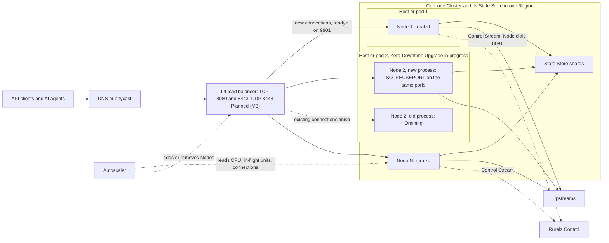
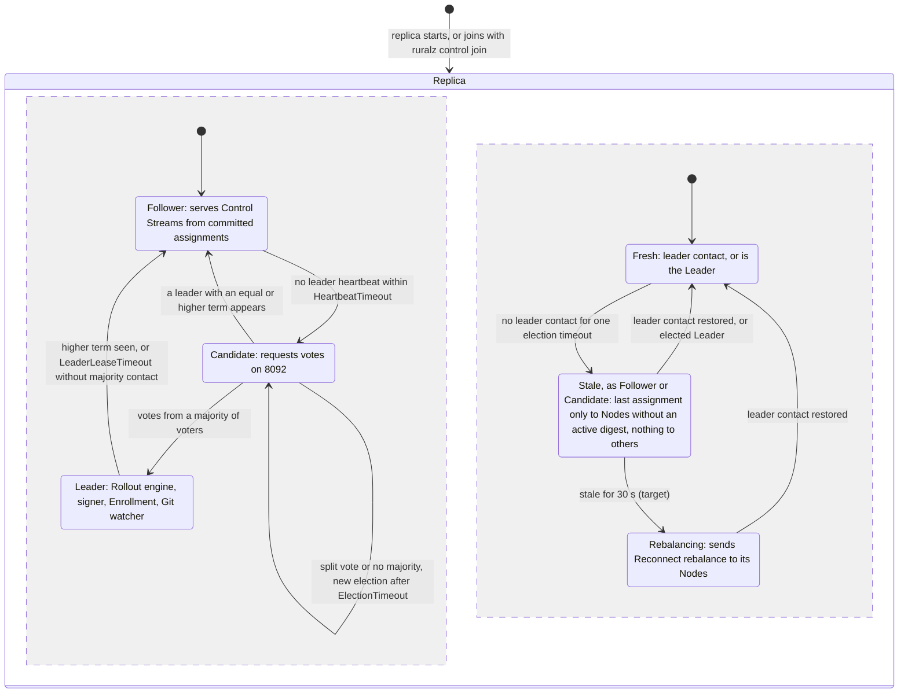
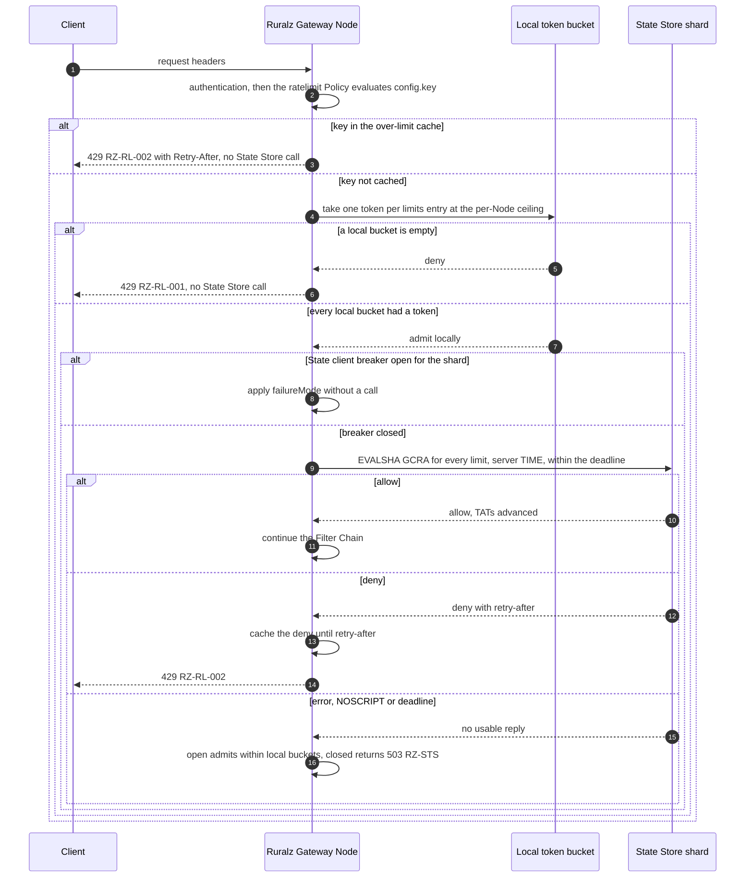
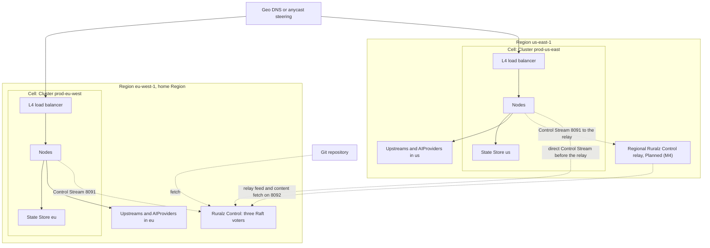

# Scalability and Distributed State

## Summary

This document fixes how Ruralz scales out and where shared state lives: per-Node memory, distributed state with numeric accuracy bounds, Cells as blast-radius units, multi-Region rules, per-Node limits, the `RZ-STS` registry and verifying chaos experiments. Nothing is implemented; everything is Planned (M1) to Planned (M4). Read it before sizing a Cluster, a State Store or a second Region.

## Scope and non-goals

In scope: the stateless Ruralz Gateway contract; scaling and high availability of Ruralz Gateway, Ruralz Control and the State Store; shared state and its accuracy bounds ([pack 8.8](../_meta/foundation-pack.md#88-rate-limiting-adr-0008), [pack 8.7](../_meta/foundation-pack.md#87-state-store-round-trips)); the post-commit queue [Data plane](03-data-plane.md#goroutines) defers here; the `RZ-STS` registry; Cells, Regions, limits and chaos experiments.

Non-goals: Rate Limit, Quota and Response Cache semantics ([Traffic management and resilience](09-traffic-management-and-resilience.md)); Token Budget and Semantic Cache semantics ([AI/LLM gateway](06-ai-llm-gateway.md)); Control Stream and Control Store internals ([Control plane and GitOps](04-control-plane-and-gitops.md)); performance values ([Performance budgets](12-performance-budgets-and-benchmarking.md)); runbooks ([High availability and disaster recovery](../operations/04-high-availability-and-disaster-recovery.md)); fields ([Configuration model](02-configuration-model.md)).

## Guarantees and principles

Guarantees derive from `P1` to `P10` ([Vision and positioning](../vision/01-vision-and-positioning.md#principles)); [Chaos experiments](#chaos-experiments) verify them.

| ID | Guarantee | Principle | Verified by |
|---|---|---|---|
| SG-1 | No request waits on another Node, Ruralz Control or the Control Store | P3 | CE-7, CE-8 |
| SG-2 | Before commit, each Policy makes at most one blocking State Store round trip, within its `stateStoreTimeout` and the request deadline | P3, pack 8.7 | CE-3, CE-4 |
| SG-3 | Losing a Node loses only its in-flight requests, connections and the state [Stateless data plane](#stateless-data-plane) lists, with the effects stated there | P4 | CE-1, CE-2 |
| SG-4 | A State Store outage costs a request at most one deadline, nothing once the breaker opens, and degrades only its Cell | P9, pack 8.13 | CE-3, CE-5 |
| SG-5 | A Ruralz Control outage never changes what a Node serves; restarted Nodes boot Last-Known-Good | P2, P9 | CE-7, CE-8 |
| SG-6 | No request crosses a Region to reach a State Store | pack 8.13 | CE-11 |
| SG-7 | Every per-Node structure has a ceiling, and every accuracy bound is a tagged number | P10 | CE-6, CE-9 |
| SG-8 | Every degraded state, such as fail-open decisions or dropped writes, is a metric | P10 | All |

Non-guarantees: limits are exact only inside one Cell; long-lived connections never migrate between Nodes; Ruralz never replicates State Store data between Cells; Nodes never gossip, their only Cluster-wide input being the published Node count (P4).

## Stateless data plane

A Node persists only its enrollment identity, Last-Known-Good and disposable caches under `${RURALZ_DATA_DIR}` (pack 8.11); under OQ-scalability-and-distributed-state-11 it would also persist the last Node count, used flagged stale. This table inventories all in-memory per-Node state; new state needs a row before shipping.

| Per-Node state | Bound | Rebuilt from | Why losing it is safe |
|---|---|---|---|
| Active snapshot | (K + 2) times snapshot size at peak (hypothesis) | Last-Known-Good, Control Stream, Bundle or OCI pull | Equal digests behave equally |
| Retired snapshots and pins | K = 2 (target) | Nothing | They serve only in-flight requests |
| Resolved `secretRef` values, hashed-key index | One copy per reference | Secret providers | `/readyz` fails until all resolve |
| Local token buckets, over-limit cache, local-only entries | 1,048,576 entries, about 64 MiB (target) | Refilled full; denials relearned | GCRA holds Cell-wide state; at most one extra ceiling per key (target) |
| First-seen budget, Plugin key-rate and Semantic Cache concurrency counters | One counter each | Reset at start | Warm-up restarts; each limit still applies |
| Published Node count | One integer | Persisted count (proposed), then the next `HeartbeatReply` | Without either, derived ceilings use the full limit, fail-open clamp max(1, `requests` / 100) (target), reason `node_count_unknown` |
| State client connections, per-shard breakers, script SHAs | The [State client](#state-client-and-rz-sts-error-codes) bounds (target) | Redial and `SCRIPT LOAD` | Breakers restart closed; failing calls reopen them within 5 s (target) |
| Per-shard `INFO memory` readings and store byte budgets | One each per shard | First read after start | Stores skip until then (target): no unmetered bytes |
| AI candidate latency averages, cooldowns, breakers | Per `AIModel` candidate | Live traffic, 5% exploration (hypothesis) | About one failed attempt per cooldown per Node (hypothesis) |
| Endpoint sets, health, ejections, breakers, retry budgets, connection pools | Per Upstream; `circuitBreaker.maxConnections` | Discovery, traffic, checks, new dials | A black-holed Endpoint is re-ejected in about 1 s; dial within 1 s, TLS within 2 s (target) |
| Plugin instance pools, compiled code | Gateway `limits.maxPluginMemoryBytes`; code 512 MiB, [in memory only](05-wasm-plugin-system.md#default-limits) (target) | OCI artifact by digest | Recompiling costs only warm-up |
| JWKS keys, upstream OAuth2 tokens | Per issuer or Policy | `jwksUrl`, `tokenUrl` | A Node that cannot refetch fails closed alone (P9) |
| Response Cache hot-entry layer, miss coalescing, revalidation queue, `Vary`-name LRU | 64 MiB; 4,096 keys, 256 entries, 65,536 URIs (target) | State Store; relearned on misses | Extra origin fetches and misses only |
| Quota denial cache | 65,536 entries, CLOCK eviction, 60 s each (target) | Next Quota script | An evicted or lost denial costs one more script, which re-reads the counter |
| Post-commit write queue | 64,000 items, 85 MiB (target) | Nothing | Dropped-write bounds apply; never an under-charge |
| Span and access-log queues, `/tap` buffers | 8,192 spans; 8,192 records and 4 MiB; fixed `/tap` capacity (target) | Nothing | Drops are counted; metrics restart as counter resets; taps end |
| Streaming output-token counts | One per stream | Nothing | A crash skips settlement, leaving R charged |
| Client connections and streams | 20,000 per Node (target) | Client reconnects | Drain sends GOAWAY and close 1001 first |
| Control Stream session | One stream | `Hello` with the active digest | Ruralz Control answers with nothing, a delta or a snapshot |
| Signed revocation list | One list, at most 100,000 entries per Cluster (target) | Control Stream; watched entry file in file mode | Not safe while detached: a restarted detached Node forgets revocations until Ruralz Control returns (OQ-security-and-identity-5); Planned (M2) |
| `auth.basic` success cache and username buckets | 10,000 and 100,000 entries (target) | Re-verification at the hash rate | No credential skips the hash; a 25 to 50 s ramp (hypothesis) refuses some callers with RZ-AUTH-007 |
| Trace-sampling token buckets | Two per Node (target) | Refilled at start | At worst one burst of extra sampled traces |
| Automatic persisted query cache | 32 MiB (target) | Clients re-register | Clients retry with the full document |
| Event-ingress fetch buffers, uncommitted offsets, unacked messages | Share of `maxBufferedBytes` | Broker redelivery | At-least-once: an Upstream may see a message twice |

So a Node can be killed at any instant: the worst outcomes are an over-charged Quota or Token Budget, a few extra admissions per key, a re-verification ramp for `auth.basic`, redelivered ingress messages and, while detached, forgotten revocations (OQ-security-and-identity-5).

## Horizontal scaling

### Scale unit

The Node is the scale unit: a Cluster adds Nodes without peer coordination (P4) until its [Cell](#cells-and-blast-radius) ceiling saturates, then a new Cluster forms another Cell. Run one `ruralzd` per network namespace with container CPU limits, which Go 1.25 reads for `GOMAXPROCS` ([source](https://go.dev/doc/go1.25)), and `GOMEMLIMIT` at about 90% of the memory limit (target) ([source](https://go.dev/doc/gc-guide)).

### SO_REUSEPORT and listeners

Ruralz uses `SO_REUSEPORT` only for the Zero-Downtime Upgrade of [ADR-0015](../adr/0015-zero-downtime-upgrades-so-reuseport.md): a new `ruralzd` binds the same ports and the old process Drains. All binders need the same effective user ID ([source](https://man7.org/linux/man-pages/man7/socket.7.html)), and `SO_ATTACH_REUSEPORT_CBPF` steering empties the closing accept queue. It is no scaling mechanism: two Nodes per network namespace are Not planned; a bigger host scales one Node vertically.

### L4 load balancing

Nodes sit behind an L4 load balancer, DNS or anycast, which keeps TLS, ALPN and client certificates intact for Ruralz Gateway to terminate.

| Rule | Reason |
|---|---|
| Health-check `/readyz` on 9901 | It fails during Drain, never for a lost Control Stream or State Store (pack 8.5) |
| UDP 8443 for `http3: true`, Planned (M3), needs a UDP balancer | QUIC connections are lost on upgrade (OQ-system-overview-18) |
| No stickiness | Any Node serves any request |
| Balancer idle timeout above the Node's 120 s (target) | The Node closes idle connections first |

Long-lived multiplexed connections pin load to their accepting Node; a maximum connection age is OQ-scalability-and-distributed-state-6.

*Figure 1: one Cluster behind an L4 load balancer; dashed edges are off the request path.*



### Autoscaling signals

Scale out on the first signal over its threshold; scale in only when all are under half of it. Autoscaler minimums MUST hold the pre-provisioned and headroom Node count (target) of [Home Region loss](#topologies) and [Ruralz Control availability](#ruralz-control-availability).

| Signal | Metric | Scale-out threshold |
|---|---|---|
| CPU | Container CPU utilization | 80% × (Z − 1) / Z over 2 minutes for Z zones: 40% at two, 53% at three, 60% at four (target) |
| In-flight units | `ruralz_http_active_requests` (requests only) against 20,000 | 50% of the ceiling (target) |
| Client connections | `ruralz_listener_open_connections` against 20,000 | 50% of the ceiling (target) |
| Buffered bytes | `ruralz_node_buffered_bytes` against `limits.maxBufferedBytes` | 50% of the budget (target) |
| Gateway-added latency | `ruralz_http_gateway_duration_seconds` p99 | Over its Performance Budget for 5 minutes (target) |

State Store saturation is a Cell sizing signal: more Nodes add State Store load.

### Warm-up

A new Node is ready (pack 8.5) with cold state: its rate-limit key table warms at the [first-seen budget](09-traffic-management-and-resilience.md#decision-path), and Upstream pools dial on demand, so balancers SHOULD slow-start new Nodes over 30 to 60 s (target).

Scale-out also moves the Node count, which [Control plane and GitOps](04-control-plane-and-gitops.md#replica-roles) raises at most 10% per minute after a 10-minute qualification (target), so derived ceilings lag ([bounds](#consistency-and-accuracy-bounds)). Until OQ-traffic-management-and-resilience-19 closes, autoscaled Control-mode Clusters SHOULD declare per-Node ceilings (field: OQ-traffic-management-and-resilience-1). A declared ceiling c fails open at N_serving × c, so c SHOULD be at most `requests` / N_max, the largest autoscaled Node count (target).

Scale-in is a Drain: `/readyz` fails, GOAWAY goes out and WebSockets close with 1001 ([source](https://www.iana.org/assignments/websocket/websocket.xhtml)), jittered across the drain window. Kubernetes' `terminationGracePeriodSeconds`, 30 s by default ([source](https://kubernetes.io/docs/concepts/workloads/pods/pod-lifecycle/)), MUST exceed the preStop wait plus the exit bound ([Drain deadline plus flush](../operations/02-zero-downtime-upgrades-and-hot-reload.md#drain-timeline-defaults)) (target).

### Scaling Ruralz Control and the State Store

Ruralz Control scales by replicas of about 5,000 [Control Streams](04-control-plane-and-gitops.md#heartbeat-and-backpressure) each, up to 10,000 Nodes (target); deployments SHOULD run at least ceil(N / 5,000) + 1 replicas across zones (hypothesis), so losing one never exceeds stream capacity, with three or five voters.

The State Store scales by shards. Hash tags keep a partition in one slot, so consumptive calls with equal tags share one script (pack 8.7); a [hot key](#distributed-rate-limits) cannot be split.

## High availability

### Ruralz Gateway availability

A Cluster SHOULD run at least three Nodes in at least two zones (target), sized so that losing the largest zone keeps survivors under 80% CPU (target), which the zone-derived threshold of [Autoscaling signals](#autoscaling-signals) enforces for equal zones. `/readyz` checks and client retries handle Node failure.

### Ruralz Control availability

During a Ruralz Control outage or quorum loss ([Control plane and GitOps](04-control-plane-and-gitops.md#behavior-during-a-ruralz-control-outage)), running Nodes keep their active Revision and stay ready (reason `detached`); restarted Nodes wait up to 5 s for the Control Stream (target), then boot Last-Known-Good; Rollouts and Enrollment are held; the published Node count freezes.

A Ruralz Control restart, failover or lost replica must not collapse the count: after a reconnect storm every stream is under 10 minutes old (target), and a near-zero count sends derived ceilings to the full limit, multiplying hot-key GCRA calls. Only qualified Nodes, keyed by `node.id` in committed state, missing three heartbeats (target) may lower it, and only once the replica holding their aggregates has been up and fresh for a 5-minute reconnect grace (target), matching CE-10; a replica loss or leader failover (CE-7) restarts the grace (proposed, OQ-scalability-and-distributed-state-14).

New Nodes without Last-Known-Good stay not ready until they enroll (pack 8.11), so autoscaling adds nothing during a long outage; Clusters SHOULD keep 30% headroom above peak (target) (OQ-scalability-and-distributed-state-7).

The Control Store is embedded `hashicorp/raft` with `raft-boltdb/v2` on bbolt ([ADR-0006](../adr/0006-control-store-raft-boltdb.md), proposed), with three voters, or five to survive two failures (target), as etcd advises ([source](https://etcd.io/docs/v3.6/faq/)). With default timeouts of 1000 ms ([source](https://raw.githubusercontent.com/hashicorp/raft/main/config.go)), leader failover takes about 1 to 2 s plus election round trips (hypothesis).

*Figure 2: one Ruralz Control replica's Raft and fencing states.*



[Fencing](04-control-plane-and-gitops.md#fencing-stale-replicas) also runs beside Candidate, so a voter campaigning in a minority partition still rebalances its Nodes after 30 s (target). Without a voter majority, writes, logins and Enrollment stop (`RZ-CP-004`). Voters SHOULD share one Region, since etcd advises election timeouts of at least ten round trips ([source](https://etcd.io/docs/v3.6/tuning/)).

### State Store availability

The State Store is the only shared request-path dependency:

| Rule | Level | Reason |
|---|---|---|
| A primary with a replica and automatic failover across zones | SHOULD | A lone primary's restart fails every Rate Limit open and `closed` Token Budget shut |
| `maxmemory-policy noeviction` where limit, Quota or Token Budget keys live | MUST | Eviction silently resets counters; Nodes raise `state_store_eviction_policy` |
| Persistence where Quota or Token Budget windows exceed one day | SHOULD | A restart otherwise resets long windows (OQ-scalability-and-distributed-state-13) |
| TLS and authentication outside loopback (TB-4) | MUST | Cache entries may hold personal data |
| `SCRIPT LOAD` at connect, reconnect and failover | MUST (Node) | `NOSCRIPT` applies `failureMode`; no second round trip |
| No Active-Active or cross-Region replication of limit keys | MUST NOT | Redis Active-Active replicates non-counter strings last-write-wins ([source](https://redis.io/docs/latest/operate/rs/databases/active-active/develop/data-types/strings/)), and a GCRA TAT is not a counter |

A failover loses the newest TATs and reservations to replication lag, and the Cell applies `failureMode` for about 15 s (hypothesis) ([failure matrix](09-traffic-management-and-resilience.md#failure-matrix)), and [reconnect pacing](#state-client-and-rz-sts-error-codes) keeps redials from stretching it. `redis` topologies are OQ-scalability-and-distributed-state-2; failover reporting is OQ-scalability-and-distributed-state-12.

## Distributed state catalog

"Cell" consistency means one State Store deployment in one Region; nothing is consistent across Cells.

| State | Store | Consistency | Algorithm | Failure mode |
|---|---|---|---|---|
| Rate Limit TATs (`ratelimit`), `rz:rl:` | State Store | Atomic per key; Cell-wide; failover may lose recent writes | Local bucket at the per-Node ceiling, then GCRA in one Lua `EVAL` with server `TIME` ([ADR-0008](../adr/0008-rate-limiting-local-bucket-and-gcra.md)) | `open` (default): local buckets only; `closed`: `RZ-STS` |
| Local buckets, over-limit cache | Node memory | Node-local | Token bucket per key; CLOCK eviction in 256 shards (target) | Lost on restart; bounded by GCRA |
| Quota counters (`quota`), `rz:qt:` | State Store | Atomic reserve per key and aligned window | Script reserves one unit; `onLog` refunds | `open` (default): unmetered; `closed`: 503; dropped refund over-charges |
| Token Budget counters (`ai.token-budget`), `rz:qt:` | State Store | Atomic per `consumerQuota` key and window; a Route's budgets reserve all or nothing | Reserve R = E + C if covered; settle provider usage at `onLog` ([ADR-0014](../adr/0014-ai-api-surface.md)) | `closed` (default): 503; dropped settlement leaves R charged |
| Response Cache (`cache`), `rz:rc:` | State Store | Eventual; valid only with the current generation key | RFC 9111, fill lease, generation bump on unsafe methods | `open` (default): bypass; dropped bump: stale up to 25 h (target) |
| Semantic Cache (`ai.semantic-cache`) | State Store deployment, dedicated connections (pack 7) | Eventual; approximate nearest neighbor per partition | Embedding plus similarity threshold ([AI/LLM gateway](06-ai-llm-gateway.md#semantic-cache)) | `open` (default): bypass; no vector commands: `RZ-STS-005` under `closed` |
| Plugin state, `rzplg:<Environment name>:` (proposed) | State Store via Host Functions, Planned (M2) | Atomic per key; Plugin-defined | One blocking call per Plugin Policy; one `onLog` write | The Plugin Policy's `failureMode` |
| Published Node count | Control Store, via `HeartbeatReply` | Lagging: 10-minute qualification, rises at most 10% per minute (target); never lowered by Ruralz Control restarts, failovers or lost streams, nor within a 5-minute reconnect grace (proposed) | Qualified Nodes, keyed by `node.id` | Frozen during a Ruralz Control outage; persisted flagged stale (proposed) |
| Assignments, Rollout plans, promoted digests | Control Store (Raft) | Linearizable writes; followers fenced by `storeEpoch` and sequences | Raft log ([ADR-0006](../adr/0006-control-store-raft-boltdb.md)) | Quorum loss stops writes; Nodes keep serving |
| Revision content, audit segments | Control Store content store | Digest-addressed; on a quorum first | Content addressing | Fetched from a peer; mismatch is `RZ-CFG-027` |
| Last-Known-Good | Node disk | Per Node; promoted at the promoted digest | Level-triggered promotion (pack 8.2) | Missing in Control mode: not ready |

### Distributed rate limits

A Rate Limit pairs a local token bucket per Node with GCRA in the State Store ([ADR-0008](../adr/0008-rate-limiting-local-bucket-and-gcra.md)), the hybrid Envoy recommends ([source](https://www.envoyproxy.io/docs/envoy/latest/intro/arch_overview/other_features/global_rate_limiting)). The local bucket denies a pinned client without a round trip, shields the State Store from hot keys, and is the only limiter left while the State Store fails.

*Figure 3: local token bucket, then GCRA in the State Store.*



**Per-request GCRA.** For OQ-system-overview-15, GCRA runs per admitted request through Planned (M3), as pack 8.8 fixes, keeping the Cell limit exact for every key with a GCRA answer while the State Store is healthy: under option (c) of OQ-traffic-management-and-resilience-20, conforming until OQ-scalability-and-distributed-state-11 closes, every key except `config.localOnly` hot keys (proposed). Under option (a), a first-seen key past the budget B runs local-only for 10 s (target) with its own [bound](#consistency-and-accuracy-bounds), and first-seen calls stay at most min(B × N_serving / N_published, 500 × N_serving) per second per Cell (target) ([decision path](09-traffic-management-and-resilience.md#decision-path)). Leases, as in Doorman ([source](https://github.com/youtube/doorman)), trade accuracy for fewer calls (OQ-scalability-and-distributed-state-1).

**Hot keys.** A key reaches the State Store at most min(offered, 2 × N_serving × ceiling) times per window (target) ([ADR-0008](../adr/0008-rate-limiting-local-bucket-and-gcra.md)); denials come from the over-limit cache, as in envoyproxy/ratelimit ([source](https://github.com/envoyproxy/ratelimit)). Since each locally admitted request runs GCRA (pack 8.8), a derived ceiling allows 2 × `requests` × N_serving / N_published calls per window. A key whose `requests` exceed 25% of one shard's calls, about 25,000 per second (hypothesis), SHOULD set [Traffic's](09-traffic-management-and-resilience.md#per-node-ceiling) `config.localOnly` once OQ-scalability-and-distributed-state-11 amends pack 8.8 (proposed); until then it needs a declared per-Node ceiling, a split `config.key` or its own Cell. GCRA keys thus stay under 2 × 25% = 50% of a shard, leaving margin under the 70% script CPU target for a count lagging 40% (hypothesis). A `config.localOnly` key would never run GCRA, admitting at most N_serving × ceiling per window, even healthy (target), amending pack 8.8; validation warnings are OQ-scalability-and-distributed-state-15.

**Pack amendments.** OQ-scalability-and-distributed-state-11 carries the options recommended here, amending packs 8.8 and 8.11; their owners close them with it.

### Distributed caches

The Response Cache and Semantic Cache share the Cell's State Store deployment with limit keys; under `noeviction` a full deployment refuses writes, so Rate Limits fail open and every `closed` Token Budget in the Cell returns 503 ([Response caching](09-traffic-management-and-resilience.md#response-caching)). Both skip stores above memory watermarks.

A separate cache deployment isolates them (OQ-traffic-management-and-resilience-11 (a)), but `Gateway.spec.stateStore` holds one connection; OQ-scalability-and-distributed-state-3 proposes a second. Until then, a Cell whose State Store holds `ai.token-budget` keys MUST NOT attach `cache` or `ai.semantic-cache`, and where N_serving can exceed 25 × N_c (hypothesis), `cache` MUST stay off; Nodes warn at startup when `cache` and a limit Policy type share a State Store. For OQ-ai-llm-gateway-18 this document decides option (a) in Cells without `ai.token-budget`, and (b) once the second connection exists; its owner closes it at conformance.

Client-side caching stays off, as Redis advises for continuously incremented keys ([source](https://redis.io/docs/latest/develop/reference/client-side-caching/)); enabling it for cache reads later MUST cap each connection at 16 MiB and each Node at 64 MiB (target).

### Distributed sessions

Ruralz has no server-side session store:

| Session kind | Where state lives | When its Node is lost |
|---|---|---|
| Client identity | The credential | Nothing lost |
| Long-lived connections | The accepting Node | Clients reconnect; SSE resumes through `Last-Event-ID` ([source](https://html.spec.whatwg.org/multipage/server-sent-events.html)) |
| Upstream affinity | `ring-hash` on a CEL `hashKey` | Another Node picks the same Endpoint |
| Plugin-held sessions, Planned (M2) | State Store keys `rzplg:` | Any Node reads them |
| Ruralz Console sessions | Control Store | Any replica serves them |

Cookie affinity or a session Policy type is OQ-scalability-and-distributed-state-8; MCP session affinity is OQ-ai-llm-gateway-10.

### Post-commit write queue

The queue, Planned (M1), holds 64,000 items and 85 MiB (target) in four classes capped in items and bytes; a full class drops only its own writes. This answers OQ-wasm-plugin-system-19 with option (a): this sub-queue, plus the Environment name as `rzplg:` namespace, a pack 8.7 amendment in OQ-scalability-and-distributed-state-11. Sizes are fixed (OQ-scalability-and-distributed-state-4).

| Class | Capacity | Drain turn | On full |
|---|---|---|---|
| Quota refunds, Token Budget settlement | 32,000 items and 16 MiB (target) | First | Drop; over-charge, never under-charge |
| Cache invalidations | 6,400 items and 1 MiB, the reserved 10% (target) | Second | One retry, then drop |
| Cache stores | 16,000 items and 64 MiB of payload (target) | Third, 4 of 5 turns (target) | Drop; counted as a skipped store |
| Plugin writes | 9,600 items and 4 MiB (target) | Third, 1 of 5 turns (target) | Drop per Plugin Policy |

Eight writers per Node cycle through the turns, skipping empty classes, 64 writes per batch (target): an invalidation waits at most one settlement batch plus one in progress, and Plugin writes get one batch in 15 under saturation (target). A Plugin write is a `state_incr` of an i64 on a key of at most 256 bytes ([WASM plugin system](05-wasm-plugin-system.md)); larger values would first need a per-value cap. Writes to a shard with an open breaker drop at once; on Drain the Node flushes for up to 5 s (target). Drops increment `ruralz_state_writes_dropped_total` by `kind`.

### State client and RZ-STS error codes

The State client, Planned (M1), is `rueidis` with auto-pipelining ([source](https://github.com/redis/rueidis)). Per Node it keeps 2 pipelined connections per shard plus up to 8 dedicated ones opened lazily (target), and at most 8,192 blocking calls in flight (target), each counted until its reply or a connection reset, not its caller's timeout; an excess call is skipped under `failureMode`. A per-shard breaker opens when 50% of at least 20 calls in 5 s fail, or after 5 consecutive connect failures; it half-opens after a uniform 1 to 3 s delay, admits one probe at a time and closes after 3 successes (target). Reconnects back off with full jitter, base 100 ms, cap 5 s, at most 4 connects per second per shard per Node (target).

Pack 8.6 assigns `STS` here: a State Store call failed or timed out under `failureMode: closed`, never a decision. Before commit, codes take pack 8.10's status in the [Data plane](03-data-plane.md#error-response-format) format: in a request Phase 503, or 401 for a `plugin` Policy of Filter class auth and 403 for class authz; in a response Phase, where a Plugin may call `state_get`, 502 replaces the response.

| Code | Status | Meaning |
|---|---|---|
| RZ-STS-001 | Per pack 8.10 | The call exceeded `stateStoreTimeout` or the remaining per-request deadline |
| RZ-STS-002 | Per pack 8.10 | Connection error, error reply (such as out of memory or `NOSCRIPT`) or unparsable reply |
| RZ-STS-003 | Per pack 8.10 | Skipped: the shard's State client breaker was open |
| RZ-STS-004 | Per pack 8.10 | Not attempted: the per-request deadline was spent or the in-flight ceiling full |
| RZ-STS-005 | Per pack 8.10 | The deployment lacks a command set the Policy needs, such as vector search |

## Consistency and accuracy bounds

Bounds hold per Cell. N_serving counts serving Nodes, N_published is the published count, N_frozen one frozen by a Ruralz Control outage, N_countless the Control-mode Nodes without a count, "ceiling" one `limits[]` entry's per-Node ceiling and `requests` its Cell-wide limit per `window`.

**Global quota accuracy bound (target).** For a `quota` Policy (`unit: requests`) in one Cell, with a healthy State Store, no failover and no pending layout switch, admission is at most `limit` per window, 0% over-admission (target), as each unit is reserved atomically. The failover and layout-switch rows below add to it. Token Quotas (`ai.token-budget`) follow the Token Budget rows; across R Cells the total is at most R × these (target). Dropped refunds only under-admit, raising `RuralzStateWritesDropped` ([Observability](10-observability.md)).

| Mechanism | Condition | Bound |
|---|---|---|
| Rate Limit | Healthy State Store, key with a GCRA answer | `requests` per `window` sustained, 2 × `requests` in one window with τ of one window (target) |
| Rate Limit | Healthy, first-seen key past the budget, OQ-traffic-management-and-resilience-20 (a) (proposed) | At most N_serving × ceiling per window during its 10 s local-only entry (target) |
| Rate Limit | Client pinned to one Node | One ceiling per window: under-admission only (target) |
| Rate Limit | `config.localOnly` Policy's hot key, OQ-scalability-and-distributed-state-11 (proposed) | At most N_serving × ceiling per window, healthy or not (target) |
| Rate Limit, fail-open | Declared ceiling | At most N_serving × ceiling per window, pack 8.8 (target) |
| Rate Limit, fail-open | Derived ceiling, OQ-traffic-management-and-resilience-16 (b) | At most N_serving × max(1, 2 × `requests` / N_published) per aligned window (target): 10 per `1s` admits 100 per second on 100 Nodes, 1,000 on 1,000 (target) |
| Rate Limit, fail-open | Scale-out while the count lags | That formula: 20 × `requests` for about 34 minutes from 10 to 100 Nodes (hypothesis) |
| Rate Limit, fail-open | Control-mode Node without a count | N_countless × max(1, `requests` / 100) per window, plus the counted Nodes' share (target): 10 × `requests` from 100 restarted Nodes at 10 per second (hypothesis) |
| Rate Limit, fail-open | Count frozen by a Ruralz Control outage | At most N_serving × max(1, 2 × `requests` / N_frozen) per window; 20 × `requests` after a 10 to 100 scale-out (hypothesis) |
| Rate Limit, fail-open | File mode without a ceiling | At most N_serving × `requests` per window (target) |
| Every limit | `memory` driver, several Nodes | N_serving × each limit; Nodes warn (pack 8.8) (target) |
| Rate Limit, Quota | Failover with replication lag L | L × the key's admitted rate extra, 100 at 1,000 per second and 100 ms lag; a key first written within the lag restarts with a full τ, up to `requests` extra (hypothesis) |
| Rate Limit | Node restart | At most one extra ceiling per key per restarted Node (target) |
| Quota | State Store failing, `open` | Unmetered; such Routes SHOULD also carry a `ratelimit` |
| Quota | Dropped refunds | Over-charge by the drops only (target) |
| Quota, Token Budget | Cell evacuation or active-standby failover | One extra `limit` per receiving Cell per open window, up to 720 h (target) |
| Token Budget | Healthy, `closed` | Overshoot at most the sum of input-estimate errors across concurrent requests, plus (attempts − 1) × R per concurrent request, plus hidden reasoning above C on `gemini` and `ollama` while OQ-ai-llm-gateway-17 is open; SM-10, owned by [AI/LLM gateway](06-ai-llm-gateway.md#settlement) (hypothesis) |
| Token Budget | Dropped settlement or crash | Over-charge of R minus usage each (target) |
| Token Budget | Failover with lag L | Over-spend up to L × reserved tokens per second per key (hypothesis) |
| Response Cache | Dropped invalidation | Stale variant up to 25 h (target) |
| Caches | Dropped store or failing State Store | Misses only (target) |
| Quota layout switch | Node without the switch signal | Up to 2 × `limit` for one window per such Node ([Release, versioning and compatibility](../engineering/04-release-versioning-and-compatibility.md#state-store-layout-changes)) (hypothesis) |

Scripts read server `TIME`, so Node clock skew up to half a window does not matter (target). For OQ-release-versioning-and-compatibility-9 this document recommends option (a), a Control Stream field, so the layout-switch bound applies only to detached Nodes.

## Multi-region

Multi-region is Planned (M4); single-Region Cells work from Planned (M1). Pack 8.13 fixes the rules: no request crosses a Region to reach a State Store, and each Region's Nodes resolve their own `stateStore.url` through `secretRef`, so Regions share one Revision.

### Topologies

| Topology | Layout | State behavior |
|---|---|---|
| Single Region | One or more Cells and the voters | Exact per-Cell limits |
| Active-active | One Cell per Region, one Environment, geo steering | R × each limit |
| Active-standby | A warm Cell in a second Region after DNS failover | Counters start empty: one extra limit per open window (target) |
| Region-pinned tenants | Consumers steered to a home Region by hostname | Exact per tenant |
| File-mode Regions | Each Region pulls one signed Revision from an OCI mirror | As active-active |

**Home Region loss.** Voters share the home Region (pack 8.13), so losing it stops Enrollment and Rollouts everywhere (`RZ-CP-004`). Survivors serve their active Revisions but new Nodes stay not ready, so each active-active Region SHOULD be pre-provisioned for R / (R − 1) times its peak share (target): 100% of global peak each with two Regions. Nodes that may be rescheduled MUST keep `${RURALZ_DATA_DIR}` on persistent storage, since an `emptyDir` pod loses its identity and Last-Known-Good (OQ-scalability-and-distributed-state-7).

Divided shares stay as rendered, so moved Consumers get only the surviving share until Ruralz Control returns. Recovery runs `ruralz control restore` from a `ruralz control backup` in a surviving Region, which opens a new `storeEpoch` and may make Nodes re-enroll ([backup and restore](04-control-plane-and-gitops.md#backup-restore-and-postgres)); runbooks: [High availability and disaster recovery](../operations/04-high-availability-and-disaster-recovery.md).

*Figure 4: multi-region topology; no State Store edge crosses a Region.*



### Regional versus global quotas

A shared Revision gives every Region the same `limit`, enforced alone, as AWS API Gateway throttles per Region ([source](https://docs.aws.amazon.com/apigateway/latest/developerguide/api-gateway-request-throttling.html)) and Cloudflare keeps no global counters ([source](https://developers.cloudflare.com/waf/rate-limiting-rules/request-rate/)).

| Pattern | How | Accuracy | Status |
|---|---|---|---|
| Regional (default) | Nothing to configure | At most R × `limit` globally (target) | Planned (M4) |
| Divided | One Environment per Region renders the Consumer quota `limit` from `${VAR}` | At most the sum of shares (target); shares never borrow | Planned (M4) |
| Home Region | Region-pinned tenants | Exact in the home Cell (target) | Planned (M4) |
| Leased global budget | A home Region leases allowances to others | Bounded by lease size and refresh | OQ-scalability-and-distributed-state-5 |

Per-Cell enforcement is Planned (M1) and Environment variables Planned (M2).

A divided Quota: the Bundle's `consumers/partner-acme.yaml`, plus its enforcing Policy:

```yaml
apiVersion: ruralz/v1alpha1
kind: Consumer
metadata:
  name: partner-acme
  labels:
    partner: acme
spec:
  tier: gold
  credentials:
    apiKeys:
      - name: primary
        hash: "sha256:d1bec0f9342e5607570b2636ed0256023b13be7d7d4bb45e1bed3cfee80dc1b6"
    jwt:
      - issuer: https://login.acme.example
        subject: acme-integration
  quotas:
    - name: daily-tokens                     # unchanged: token-budget-partner names it
      unit: tokens
      limit: 2000000
      window: 24h
    - name: daily-requests
      unit: requests
      limit: ${PARTNER_ACME_DAILY_REQUESTS}   # rendered per Environment, one Environment per Region
      window: 24h
  tags: [partner, eu]
---
apiVersion: ruralz/v1alpha1
kind: Policy
metadata: {name: quota-partner-daily}      # attach to the partner Routes
spec:
  type: quota
  config:
    consumerQuota: daily-requests            # the Consumer quota with unit requests
```

`control/environments.yaml` and `control/clusters.yaml`, outside the Bundle, are applied to Ruralz Control:

```yaml
apiVersion: ruralz/v1alpha1
kind: Environment
metadata:
  name: prod-eu
spec:
  overlay: prod
  variables:
    PARTNER_ACME_DAILY_REQUESTS: "600000"    # 60% of a 1,000,000 global allowance
---
apiVersion: ruralz/v1alpha1
kind: Environment
metadata:
  name: prod-us
spec:
  overlay: prod
  variables:
    PARTNER_ACME_DAILY_REQUESTS: "400000"
---
apiVersion: ruralz/v1alpha1
kind: Cluster
metadata:
  name: prod-us-east
spec:
  environment: prod-us
  region: us-east-1
```

Each Environment renders its own Revision, so Regions promote separately.

### Geo and data-residency routing

Geo DNS, anycast or clients choose the Region, a router AWS advises keeping simple ([source](https://docs.aws.amazon.com/wellarchitected/latest/reducing-scope-of-impact-with-cell-based-architecture/cell-routing.html)). Inside Ruralz:

1. Counters and cache entries stay in the Cell's State Store.
2. `authz.geoip`, Planned (M2), refuses clients by country before any State Store call.
3. Provider Fallback never leaves the residency class ([AI/LLM gateway](06-ai-llm-gateway.md#data-residency-routing)); a Route splitting candidates on residency MUST NOT attach `ai.semantic-cache` until OQ-ai-llm-gateway-9 closes.
4. Upstreams cross Regions only through configured Endpoints.
5. Telemetry and access logs follow the serving Node's Region.

### Cross-region configuration sync

One Revision per Environment reaches every Region over the Control Stream ([ADR-0007](../adr/0007-control-stream-protocol.md)). Remote Nodes dial the home Region until a read-only regional relay, Planned (M4), serves them ([relay feed](04-control-plane-and-gitops.md#relay-feed), answering OQ-system-overview-16; its 8092 feed awaits the pack 8.4 amendment of OQ-control-plane-and-gitops-15). Nodes verify signatures end to end, so a relay cannot forge configuration.

Clusters of one Environment promote one at a time, so a bad Revision passing one Region's canary meets the next.

### Latency budgets

| Path | Budget |
|---|---|
| Same-zone State Store GCRA round trip, p99 | 1 ms or less (hypothesis), SLO-GW-5 in [Observability](10-observability.md) |
| Cross-zone State Store round trip in one Region, p99 | 2 ms or less (hypothesis) |
| `stateStoreTimeout` on latency-sensitive Policies | 5 to 10 ms, at least five times the p99 (target) |
| State Store round trip across Regions | Not allowed (pack 8.13) |
| Raft round trip between voters | About 100 ms or less (hypothesis) |
| Control Stream across Regions | Rollouts only, no request-path budget |

## Cells and blast radius

A Cell (pack 8.13) is the bulkhead AWS extends to cell-based architecture ([source](https://docs.aws.amazon.com/wellarchitected/latest/reducing-scope-of-impact-with-cell-based-architecture/reducing-scope-of-impact-with-cell-based-architecture.html)). Every Node of a Cluster MUST resolve the same State Store, so a Cluster lives in its `Cluster.spec.region`; detecting violations is OQ-scalability-and-distributed-state-9.

### Cell sizing

AWS advises capped cell sizes with a known maximum throughput ([source](https://docs.aws.amazon.com/wellarchitected/latest/reducing-scope-of-impact-with-cell-based-architecture/cell-sizing.html)). A Cell that would exceed a ceiling splits in two:

| Ceiling | Value |
|---|---|
| Nodes per Cell | 1,000 (target) |
| State Store shards per Cell | 16 (target) |
| State Store calls per second per Cell | 800,000, [50%](../operations/03-capacity-planning.md#state-store-sizing) of 16 shards at about 100,000 each (hypothesis); Valkey 8 measured 1.19 million `SET` per second ([source](https://valkey.io/blog/unlock-one-million-rps-part2/)) |
| State Store memory per shard | 70% of `maxmemory` steady state (target) |
| Tenants per Cell | At most 10% of tenants in deployments of ten or more Cells (target) |

### Failure containment

| Failure | Blast radius |
|---|---|
| One Node or zone | Its in-flight requests and connections; a zonal primary until failover |
| State Store slow, down or full | One Cell: Rate Limits open, Quotas unmetered, caches bypassed, `closed` Token Budgets reject |
| Hot key | One shard: every Node's breaker for it opens and co-tenant keys apply `failureMode` |
| Ruralz Control down or quorum lost | Management of every Cell it serves; no request errors; fail-open accuracy degrades by N_serving / N_frozen |
| Region lost | Its Cells; survivors count alone, up to R × each limit |
| Home Region lost | Its Cells and Ruralz Control everywhere: survivors keep only pre-provisioned capacity and Divided shares ([Home Region loss](#topologies)) |
| Bad Revision | The canary Nodes of one Cluster |

Evacuating a Cell shifts DNS or anycast weight; receiving Cells start with empty counters, allowing one extra limit per open window, provider spend included ([bounds](#consistency-and-accuracy-bounds)). Spend-bearing Quotas SHOULD use Region-pinned tenants or the Divided pattern; carrying counters over is OQ-scalability-and-distributed-state-16.

## Limits and bottlenecks

### Per-Node limits

[Benchmarking](12-performance-budgets-and-benchmarking.md) verifies every value.

| Limit | Per-Node value | Owner | When reached |
|---|---|---|---|
| Client connections | 20,000 (target) | [Data plane](03-data-plane.md#bounded-resources) | Stops calling `Accept` |
| In-flight units | 20,000 (target) | Data plane | 503 `RZ-RT-005` |
| Buffered bytes | 512 MiB proposed default (target) | [Configuration model](02-configuration-model.md#body-buffering-and-limits) | 503 `RZ-RT-004`; tees skip |
| Rate-limit key table | 1,048,576 entries, about 64 MiB (target) | [Traffic management](09-traffic-management-and-resilience.md#decision-path) | CLOCK eviction |
| Local-only key segment | 131,072 entries (target) | Traffic management | CLOCK eviction |
| Quota denial cache | 65,536 entries, about 4 MiB (target) | This document | CLOCK eviction |
| First-seen GCRA budget | min(500, B / N_published) per second, else 200 (target) | Traffic management | Keys wait for GCRA |
| Balancer structures | 256 MiB (target) | Traffic management | Weighted `random` fallback |
| Response Cache hot-entry layer | 64 MiB (target) | Traffic management | LRU eviction |
| Post-commit write queue | 64,000 items and 85 MiB: 16, 1, 64 and 4 MiB per class (target) | This document | Drop per class |
| State Store calls in flight | 8,192 (target) | This document | `failureMode` without a call |
| State Store connections per shard | 2 pipelined plus 8 dedicated (target) | This document | Dedicated calls skipped |

Data plane sums worst-case Node memory at about 19 GiB plus snapshots on a 32 GiB Node (hypothesis); these limits add at most about 475 MiB: keys 64, balancers 256, hot-entry layer 64, queue 85 and Quota denials 4 MiB (target).

### Cell and Cluster bottlenecks

| Resource | Capacity | Symptom | Mitigation |
|---|---|---|---|
| Shard script throughput | About 100,000 calls per second (hypothesis) | Breakers open | More shards, declared ceilings, shared scripts |
| One hot key | One shard; up to 2 × `requests` calls per window | Every Node's breaker for it opens | `config.localOnly` (proposed) above 25% of a shard, about 25,000 per second (hypothesis) |
| Connections per shard | 10 × N_serving, 10,000 at 1,000 Nodes (hypothesis) | Refused connections | Server client limit above 10 × N_serving, a MUST above 900 Nodes (target) |
| First-seen budget B | 20,000 calls per second per Cell (hypothesis) | New keys wait | Control mode; OQ-traffic-management-and-resilience-20 |
| Ruralz Control streams | About 5,000 per replica (hypothesis) | `Reconnect` with `shed` | ceil(N / 5,000) + 1 replicas (hypothesis) |
| Node-count lag | Plus 10% per minute (target) | Over-admission after scale-out, 20 × `requests` fail-open (hypothesis) | Declared ceilings |

At 5,000 State Store calls per second per Node (hypothesis), the 800,000-call ceiling binds at 160 Nodes, before the Node ceiling; [Capacity planning](../operations/03-capacity-planning.md) derives coefficients from benchmarks (P10).

## Chaos experiments

Each runs against at least 10 Nodes (target) under open-loop load, since closed-loop generators hide latency ([source](https://grafana.com/docs/k6/latest/using-k6/scenarios/concepts/open-vs-closed/)), and gates its milestone (tooling: OQ-scalability-and-distributed-state-10).

| ID | Fault | Pass criteria | Milestone |
|---|---|---|---|
| CE-1 | SIGKILL one Node at 50% load (target) | Errors only on its in-flight requests; no Quota under-charge | Planned (M1) |
| CE-2 | SIGTERM a Node holding HTTP/2, WebSocket and SSE connections | Zero failed new requests; reconnects spread over the drain | Planned (M1) for HTTP/1.1 and HTTP/2; WebSockets and SSE Planned (M3) |
| CE-3 | 200 ms added to every State Store call (target) | p99 rises at most one timeout, then within 10% once breakers open (target) | Planned (M1) |
| CE-4 | State Store black-holed for 60 s (target) | Per key within the fail-open derived and declared ceiling bounds (target); `closed` Token Budgets get `RZ-STS-001`, then `RZ-STS-003` | Planned (M1) |
| CE-5 | State Store primary killed under at least 100 Nodes (target) | Every Node reconnected within 10 s and `failureMode` for at most 15 s (target); extra admissions within the lag bound | Planned (M1) |
| CE-6 | State Store filled to `maxmemory` | Stores skip above 70% (target); no limit key evicted | Planned (M1) |
| CE-7 | Ruralz Control leader killed mid-Rollout | Zero request errors; the Rollout resumes; the published count drops at most 10% (target); no State client breaker opens | Planned (M2) |
| CE-8 | Raft quorum removed, then 10% of Nodes restarted (target), State Store then black-holed | Zero request errors before the black-hole; restarts boot Last-Known-Good within 30 s (target); admission within the countless-Node and frozen-count bounds | Planned (M2) |
| CE-9 | Scale from 10 to 100 Nodes in 2 minutes (target), State Store black-holed | Per key within the lagging-count bound, 20 × `requests` for about 34 minutes (hypothesis) | Planned (M2) |
| CE-10 | Every Ruralz Control replica restarted at once | All Nodes reconnect within 5 minutes (target); the published count drops at most 10% (target); no State client breaker opens | Planned (M2) |
| CE-11 | One Region cut off with its State Store and relay | No cross-Region State Store dial | Planned (M4) |
| CE-12 | Hot key offered 1,000,000 calls per second, 10 times one shard (hypothesis): `requests` just under 25,000 per second, then above it as `config.localOnly`, proposed (hypothesis) | GCRA calls at most 2 × N_serving × ceiling per window, none when `config.localOnly`; shard script CPU under 70% (target); no co-tenant breaker opens | Planned (M1) |
| CE-13 | 200 concurrent AI streams, usage dropped on 5% (target) | Overshoot within the healthy `closed` Token Budget bound (hypothesis); no under-charge | Planned (M3) |
| CE-14 | `ai.semantic-cache` without vector commands | Bypass under `open`; `RZ-STS-005` under `closed` | Planned (M3) |
| CE-15 | Key-rotation flood, 100,000 new keys per second (target) | Per key at most N_serving × ceiling per window; first-seen calls within budget; no key with a GCRA answer evicted | Planned (M1) |
| CE-16 | Cache stores saturate the post-commit queue during invalidations | Zero `cache_invalidate` drops; Plugin writes drain (target) | Planned (M1) |
| CE-17 | Home Region lost with every voter, autoscaler enabled after an off-peak scale-in period | The surviving Region serves full peak on pre-provisioned Nodes (target); restarts boot Last-Known-Good | Planned (M4) |

## Pointers to related documents

- [Performance budgets](12-performance-budgets-and-benchmarking.md): every Performance Budget value; it wins on conflict.
- [Benchmarking](12-performance-budgets-and-benchmarking.md): the open-loop suite measuring GCRA cost and per-Node limits.
- [Capacity planning](../operations/03-capacity-planning.md): Node and State Store sizing from these limits.
- [Zero-downtime upgrades](../operations/02-zero-downtime-upgrades-and-hot-reload.md): the `SO_REUSEPORT` handover and Drain order.
- [High availability and disaster recovery](../operations/04-high-availability-and-disaster-recovery.md): runbooks and Region failover; [Deployment topologies](../operations/01-deployment-topologies.md): Cell layouts.

## Open questions

| ID | Question | Options | Owner | Blocking? |
|---|---|---|---|---|
| OQ-scalability-and-distributed-state-1 | Should GCRA move to leased allowances (after OQ-system-overview-15)? | (a) Per request (current); (b) leases for keys over a shard threshold, Planned (M4); (c) leases for all keys | scalability-and-distributed-state | No |
| OQ-scalability-and-distributed-state-2 | Which `redis` topologies are Planned (M1), and how does `stateStore.url` express them? | (a) Standalone with replicas, and sharded; (b) also Sentinel; (c) standalone only | configuration-model | Yes, State Store (M1) |
| OQ-scalability-and-distributed-state-3 | How does a Gateway name a second State Store deployment for caches? | (a) A cache connection under `Gateway.spec.stateStore`; (b) a per-Policy reference; (c) none | configuration-model | Yes, Response Cache (M1) and Semantic Cache (M3) |
| OQ-scalability-and-distributed-state-4 | Should queue classes and State client bounds be configurable? | (a) Fixed (current); (b) Gateway `limits` fields; (c) `RURALZ_*` settings | configuration-model | No |
| OQ-scalability-and-distributed-state-5 | How does a Consumer get one exact global Quota across Regions? | (a) Divided Environments or home Regions (current); (b) home-Region leases, Planned (M4); (c) CRDT counters | scalability-and-distributed-state | No |
| OQ-scalability-and-distributed-state-6 | Should Nodes cap HTTP/2 connection age to rebalance behind L4? | (a) No (current); (b) GOAWAY after 10 minutes with jitter (target); (c) a listener field | data-plane | No |
| OQ-scalability-and-distributed-state-7 | How does a Cluster add capacity during a long Ruralz Control outage? | (a) 30% headroom (target); (b) OCI seeding (OQ-system-overview-12); (c) Last-Known-Good in images; any with `${RURALZ_DATA_DIR}` persistent where Nodes may be rescheduled (current) | high-availability-and-disaster-recovery | No |
| OQ-scalability-and-distributed-state-8 | Should Ruralz offer built-in session affinity or a session store? | (a) No: `ring-hash` and Plugins (current); (b) cookie affinity; (c) a session Policy type | traffic-management-and-resilience | No |
| OQ-scalability-and-distributed-state-9 | Can Nodes detect a Cluster resolving different State Stores? | (a) Operator discipline (current); (b) a State Store identity in heartbeats, flagged as Drift | control-plane-and-gitops | No |
| OQ-scalability-and-distributed-state-10 | Which fault-injection tooling runs the chaos experiments? | (a) A TCP fault proxy and signals in the harness; (b) a Kubernetes chaos framework after research | testing-and-quality-strategy | Yes, chaos experiments (M1) |
| OQ-scalability-and-distributed-state-11 | Do packs 8.8 and 8.11 adopt OQ-traffic-management-and-resilience-16 (b), -20 (a), -19 (c) and Traffic's `config.localOnly`, a key without GCRA bounded by N_serving × ceiling per window (target), and pack 8.7 the `rzplg:` namespace of OQ-wasm-plugin-system-19 (a)? | (a) All (recommended); (b) -16 only; (c) as written | scalability-and-distributed-state | Yes, pack 8.7, 8.8 and 8.11 amendment (M1) |
| OQ-scalability-and-distributed-state-12 | How are State Store failover and lost Cells reported (OQ-observability-18)? | (a) State Store monitoring (current); (b) Nodes report replication-offset jumps; (c) Ruralz Control aggregates Cell health | observability | No |
| OQ-scalability-and-distributed-state-13 | Must the State Store holding Quota and Token Budget counters persist? | (a) SHOULD for windows over one day (current); (b) MUST, checked at startup; (c) operator choice | scalability-and-distributed-state | No |
| OQ-scalability-and-distributed-state-14 | Must the published Node count ignore Ruralz Control restarts, failovers and lost streams? | (a) Only qualified Nodes missing three heartbeats lower it, counted after a 5-minute reconnect grace (target), qualification kept per `node.id` in committed state (recommended); (b) as written | control-plane-and-gitops | Yes, derived ceilings (M2) |
| OQ-scalability-and-distributed-state-15 | Should validation warn about a constant `ratelimit` key whose `requests` exceeds 25% of one shard's calls, about 25,000 per second (hypothesis)? | (a) A warning with a new `RZ-CFG` code; (b) documentation only (current) | configuration-model | No |
| OQ-scalability-and-distributed-state-16 | Should counters follow clients evacuated to another Cell? | (a) No: one extra limit per open window (current); (b) an export and import tool; (c) Region-pinned tenants only for spend-bearing Quotas | scalability-and-distributed-state | No |
