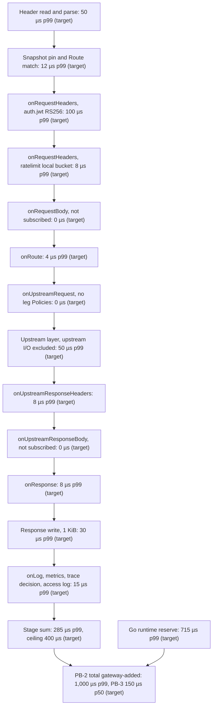
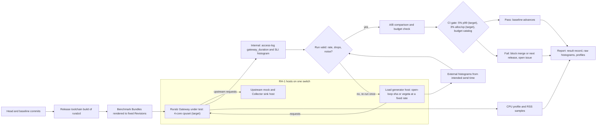

# Performance Budgets and Benchmarking

## Summary

This document owns every Ruralz Performance Budget: the latency, throughput, allocation, memory, startup and Hot Reload ceilings that Ruralz Gateway and Ruralz Control must meet on stated reference hardware, each tagged (target) or (hypothesis). It fixes the per-stage latency budget of the Filter Chain, the reference hardware, the benchmark scenarios and open-loop method, the CI regression gates, the profiling playbook and the reports that tie budgets to the SLOs of [Observability](10-observability.md). Nothing is implemented: each budget becomes a gate in the milestone that ships its component, from Planned (M1). Contributors, architects and operators read it before changing a hot path, sizing a Node or publishing a number.

## Scope and non-goals

In scope: budget values, reference hardware, scenarios, load tools, measurement rules, regression thresholds, delegated constants, profiling and reporting. "Pack 8.7" names a section of the [foundation pack](../_meta/foundation-pack.md). Values here win on conflict with [System overview](01-system-overview.md), [Data plane](03-data-plane.md#performance-budgets), [WASM plugin system](05-wasm-plugin-system.md#performance-model), [Observability](10-observability.md) and [Scalability and distributed state](11-scalability-and-distributed-state.md).

It answers OQ-observability-17 in [Memory budget](#memory-budget), and OQ-testing-and-quality-strategy-2 and -10 in [Benchmark suite and CI gating](#benchmark-suite-and-ci-gating); their owners close them at conformance.

Non-goals, with owners:

- SLO objectives, metric names and alert rules: [Observability](10-observability.md#slo-definitions).
- CI stages, jobs and gate placement: [Testing and quality strategy](../engineering/03-testing-and-quality-strategy.md#benchmarks-and-regression-gates); the placements below are proposals (OQ-performance-budgets-and-benchmarking-3).
- Sizing formulas: [Capacity planning](../operations/03-capacity-planning.md), from the results published here.
- Accuracy bounds of shared state: [Scalability and distributed state](11-scalability-and-distributed-state.md#consistency-and-accuracy-bounds).
- Kinds and fields: the [Configuration model](02-configuration-model.md); benchmark Bundles use only its fields.

## Budget philosophy

These rules turn P10 ([Vision and positioning](../vision/01-vision-and-positioning.md#principles)) into budgets a pull request can fail.

| ID | Rule | Consequence |
|---|---|---|
| BP-1 | A value is a (target) we commit to, a (hypothesis) an estimate rests on, or a cited measurement | The first benchmark that measures a hypothesis turns it into a target or changes the design |
| BP-2 | Latency budgets count gateway-added time only: wall-clock time minus client, upstream and State Store I/O and declared remote calls ([Gateway-added time](10-observability.md#gateway-added-time)) | Upstream and State Store latency get separate budgets |
| BP-3 | A Performance Budget is the lab ceiling on the metric and threshold of a production SLO, where one exists | Each budget names that SLO, a related one, or none |
| BP-4 | Budgets compose: stage p50 values sum to at most the end-to-end p50, and stage p99 values plus a runtime reserve sum to at most the end-to-end p99 | Percentiles do not add, so the sums plan a budget and the end-to-end values gate it |
| BP-5 | Pay only for what is attached: an unsubscribed Phase costs one nil check ([System overview](01-system-overview.md#design-principles)) | Scenarios add one feature at a time |
| BP-6 | Latency holds at a stated load, never at saturation, as Envoy's benchmarking guidance advises ([source](https://www.envoyproxy.io/docs/envoy/latest/faq/performance/how_to_benchmark_envoy)) | Every latency budget names its offered rate |
| BP-7 | A budget gates from the milestone that ships its component; changing a value is a `perf` pull request here with benchmark evidence, and loosening SM-4, SM-5 or SM-6 also needs the Vision owner | Budgets move deliberately, never by drift |

### Seed targets

The binding seeds, from which the rest derives, are PB-1, PB-4, PB-5, PB-6 and PB-7:

| Seed | Value |
|---|---|
| Gateway-added p99, plain proxying at 10k rps per core | 1 ms or less (target) |
| Plain proxying on 4 vCPU | At least 50k rps (target) |
| WASM Plugin call, p99 | 50 µs or less (target) |
| Base RSS | 100 MB plus about 2 KB per Route (target) |
| Hot Reload of 5,000 Routes | 500 ms or less (target) |

### Budget catalog and SLO ties

| ID | Performance Budget | Value | Measured by | SLO in [Observability](10-observability.md#slo-definitions) | Milestone |
|---|---|---|---|---|---|
| PB-1 | Gateway-added p99, S1 at 10,000 rps per core on RH-1 | 1 ms or less (target) | Access-log `gateway_duration`; `ruralz_http_gateway_duration_seconds` | SLO-GW-2 | Planned (M1) |
| PB-2 | Gateway-added p99, S2 at half saturation (SM-4) | 1 ms or less (target) | Same | SLO-GW-2 | Planned (M1) |
| PB-3 | Gateway-added p50, S2 at half saturation (SM-5) | 150 µs or less (target) | Same | SLO-GW-3 | Planned (M1) |
| PB-4 | S1 saturation throughput on 4 vCPU | 50,000 rps or more (target) | Rate ladder | None | Planned (M1) |
| PB-5 | Plugin Phase call overhead, pooled, p99 (SM-6) | 50 µs or less (target) | `ruralz_plugin_call_overhead_seconds` | SLO-GW-4 | Planned (M2) |
| PB-6 | Base RSS with R Routes in the active Revision | 100 MB + 2 KB × R or less (target) | RSS after idle settle | None | Planned (M1) |
| PB-7 | Hot Reload of 5,000 Routes on an idle Node | 500 ms or less (target) | `ruralz_config_activation_duration_seconds{stage="total"}` | Related: SLO-GW-6, compile stage only | Planned (M1) |
| PB-8 | Ruralz-owned allocations per S1 request, `net/http` excluded | 30 or fewer (target) | `testing.AllocsPerRun` around Router and Filter Chain executor | None | Planned (M1) |
| PB-9 | Same-zone GCRA round trip p99, S5 | 1 ms or less (hypothesis) | `ruralz_state_call_duration_seconds{op="gcra"}` | SLO-GW-5 | Planned (M1) |
| PB-10 | Telemetry CPU at defaults, half saturation | 5% or less of Node CPU (target) | S2 with telemetry on and off | Related: SLO-GW-7 watches drops | Planned (M1) |
| PB-11 | Goodput in O1b at 150% offered load | 90% or more of saturation, excess only as `RZ-RT-005` (target) | Generator; `ruralz_http_node_responses_total` | Related: SLO-GW-1, which `RZ-RT-005` burns | Planned (M1) |
| PB-12 | Gateway-added time to first token, bodies up to 16 KiB, p99, excluding State Store, embedding, provider and estimator time | 1 ms or less (target) | `ruralz_http_gateway_duration_seconds` in S6n, ending at header commit | None (OQ-performance-budgets-and-benchmarking-9) | Planned (M3) |
| PB-13 | Rollout convergence, 100 Nodes, `all-at-once`, p95 (SM-9) | 30 s or less (target) | `ruralz_control_rollout_duration_seconds` | SLO-CP-1 | Planned (M2) |
| PB-14 | Cross-zone GCRA round trip p99, S5x | 2 ms or less (hypothesis) | As PB-9 | SLO-GW-5 population: OQ-performance-budgets-and-benchmarking-12 | Planned (M1) |
| PB-15 | Gateway-added p99, S2 at 60% of saturation | 1 ms or less (target) | As PB-2 | SLO-GW-2 | Planned (M1) |
| PB-16 | Gateway-added p99, S2 at 80% of saturation | 2 ms or less (target) | As PB-2 | Related: SLO-GW-2 burns (OQ-performance-budgets-and-benchmarking-13) | Planned (M1) |

PB-12 restates the [AI/LLM gateway](06-ai-llm-gateway.md#streaming) value, PB-13 [SM-9](../vision/01-vision-and-positioning.md#success-metrics), and PB-14 the [cross-zone round trip](11-scalability-and-distributed-state.md#latency-budgets) paid outside the primary's zone. PB-15 covers the four-zone [autoscaling threshold](11-scalability-and-distributed-state.md#autoscaling-signals), PB-16 zone-loss survivors, whose load burns SLO-GW-2.

## Per-stage latency budget

The table splits PB-2 and PB-3 (S2), and PB-1 (S1, without the S2 Filters), into gateway-added CPU microseconds on RH-1 at half saturation, excluding blocked time; stage names follow pack 2's spans. The `onRoute`, `onUpstreamResponseHeaders` and `onResponse` rows are built-in engine work at that Phase boundary, not Filter work. A Route above the 400 µs stage ceiling (target) gets its own measured budget.

| Stage | Work in S2, or when attached | p50 µs | p99 µs | Ruralz-owned allocations |
|---|---|---|---|---|
| Header read and parse | HTTP/1.1 in `net/http` ([ADR-0009](../adr/0009-http-stack-net-http-quic-go.md)) | 12 (target) | 50 (target) | 0, `net/http` internals excluded (target) |
| Snapshot pin and Route match | Pin stripe, host table, path trie | 3 (target) | 12 (target) | 0 (target) |
| `onRequestHeaders`: `auth.jwt` | RS256 with a 2,048-bit key from the cached JWKS | 45 (target) | 100 (target) | Reported, not gated (hypothesis) |
| `onRequestHeaders`: `ratelimit` | Local token bucket shard, then GCRA on the `memory` driver ([ADR-0008](../adr/0008-rate-limiting-local-bucket-and-gcra.md)) | 2 (target) | 8 (target) | 0 (target) |
| `onRequestHeaders`: other Filters | `cors`, `authz.cel` or `authz.ip`, when attached | 2 each (target) | 5 each (target) | 0 each (target) |
| `onRequestBody` | One nil check; `validation.json-schema` on 1 KiB when attached | 0; 25 attached (target) | 0; 80 attached (target) | 0 (target) |
| `onRoute` | Single Upstream leg selected | 1 (target) | 4 (target) | 0 (target) |
| `onUpstreamRequest` | None; `headers` setting two values when attached | 0; 2 attached (target) | 0; 8 attached (target) | 0; 2 attached (target) |
| Upstream layer | Endpoint pick, breaker, pooled connection, request write | 12 (target) | 50 (target) | 6 (target) |
| `onUpstreamResponseHeaders` | Breaker and retry accounting | 2 (target) | 8 (target) | 0 (target) |
| `onUpstreamResponseBody` | None; `transform.response` on 1 KiB when attached | 0; 30 attached (target) | 0; 100 attached (target) | 0 (target) |
| `onResponse` | Header finalization; `cors` response side when attached | 2 (target) | 8 (target) | 2 (target) |
| Response write | 1 KiB through the 32 KiB buffer | 8 (target) | 30 (target) | 2 (target) |
| `onLog` | Metrics, trace decision, one access-log record ([ADR-0010](../adr/0010-telemetry-opentelemetry-first.md)) | 5 (target) | 15 (target) | 10: 0 metrics, 2 tracing, 8 access log (target) |
| `onChunk` | One built-in Filter per chunk, such as the Token Budget guard and its count | 3 per chunk (target) | 15 per chunk (target) | 0 (target) |
| Streaming chunk, all-in (S6) | Upstream read and wakeup 3 (hypothesis), SSE parse 1, `onChunk` 3, client write and flush 3 (hypothesis), bookkeeping 2 | 12 per chunk (target) | 40 per chunk (target) | 0 (target) |
| Token estimate (S6) | `tiktoken-go/tokenizer`, M3 tokenizer benchmark | 25 per KiB (hypothesis) | 50 per KiB (hypothesis) | Reported |
| `RZ-RT-005` rejection (O1) | Header decode, admission check, 503 write; mean CPU 16 or less, component benchmark (target) | 12 (target) | 40 (target) | 2 (target) |
| Plugin Phase call | S4, pooled, deadline interruption on ([ADR-0004](../adr/0004-wasm-runtime-wazero.md), [ADR-0005](../adr/0005-plugin-abi-v1.md)) | 20 overhead (target) | 50 overhead, 100 with guest logic (target) | Buffer copies (target) |
| Go runtime reserve | GC assists, scheduler delay and queueing | 58 (target) | 715 (target) | Not applicable |
| Total, S2 | Sum of the S2 rows plus the reserve | 150 (target) | 1,000 (target) | S1 rows sum to 20 of PB-8's 30 (target) |

Rules for the table:

1. The S2 stage p99 values sum to 285 µs (target); the sum MUST stay at or below 400 µs (target), so the reserve keeps at least 600 µs (target) for the Go tail latency that [Vision and positioning](../vision/01-vision-and-positioning.md#where-ruralz-does-not-lead) names as a risk.
2. The TLS 1.3 handshake costs 1 ms or less of CPU at p99 with ECDSA P-256 (target), measured in S3 and C2.
3. Restated: CEL expressions under 2 µs at p99 (target) ([Configuration model](02-configuration-model.md#limits)); `authz.opa` and `authz.cedar` under 100 µs (hypothesis), Planned (M2) ([Security and identity](08-security-and-identity.md)).

```text
S1 stage sums: 45 µs at p50 and 177 µs at p99, leaving PB-1 823 µs of reserve          (target)
RS256: about 40 µs of CPU, measured in M1; algorithm: OQ-performance-budgets-and-benchmarking-8 (hypothesis)
Token estimate of a 16 KiB prompt: about 400 µs, which is why PB-12 excludes it        (hypothesis)
```

*Figure 1: the S2 per-stage latency budget in microseconds at p99, with the Go runtime reserve that closes PB-2.*



## Throughput and resources per core

### Reference hardware

Latency, throughput and memory budgets gate on RH-1 only; PB-13, the F2 rows and SM-10 measure fan-out and accounting, not CPU, so they gate on Testing's dedicated general runners.

| ID | Role | Specification | Use |
|---|---|---|---|
| RH-1 | Reference machine | Bare-metal linux/amd64, one socket, 16 or more physical cores at a fixed 3.0 GHz or more, turbo, deep C-states and SMT off, 64 GiB of RAM, a 25 Gbit/s NIC, the current Linux LTS kernel (target) | `ruralzd` in a cgroup v2 cpuset of 4 cores on the NIC's NUMA node, `GOMAXPROCS=4`; interrupts elsewhere |
| RH-1L, RH-1U, RH-1S | Load generator; mock and Collector sink; State Store | Same specification and switch; round trip p99 of 50 µs or less (hypothesis) | RH-1S runs one Valkey primary in a 4-core cpuset (target) |
| RH-2 | linux/arm64 ([tech stack](../engineering/01-tech-stack-and-libraries.md#static-builds)) | Same rules | Reported; gating is OQ-performance-budgets-and-benchmarking-4 |
| RH-3 | Reproduction profile | A cloud VM with 4 dedicated vCPUs (target) | Published, never gated |

Results record the CPU microarchitecture and never compare across generations: Green Tea GC gains about 10% more on Ice Lake and Zen 4 or newer ([source](https://go.dev/doc/go1.26)). With SMT off, "per core" and "per vCPU" name one figure. The seeds measure 4 vCPU together:

```text
10,000 rps per core = 40,000 rps on the 4-core cpuset, not a single-core Node          (target)
A single core at 80% utilization would push p99 past 1 ms from queueing alone          (hypothesis)
```

### Throughput targets

Saturation is the highest open-loop step whose achieved rate stays within 0.5% of the offered rate, with end-to-end p99 of 10 ms or less and errors at 0.01% or less (target).

| Scenario | Saturation on 4 vCPU | Per vCPU | Latency point | Milestone |
|---|---|---|---|---|
| S1 plain proxying | 50,000 rps or more (target), PB-4 | 12,500 rps or more (target) | PB-1 at 40,000 rps (target) | Planned (M1) |
| S2 reference scenario | 32,000 rps or more (target) | 8,000 rps or more (target) | PB-2, PB-3 at 16,000; PB-15 at 19,200; PB-16 at 25,600 rps (target) | Planned (M1) |
| S3 HTTP/2 over TLS 1.3 | 28,000 rps or more (target) | 7,000 rps or more (target) | 1 ms p99 at half saturation (target) | Planned (M1); HTTP/3 variant Planned (M3) |
| S4 one header-only Plugin | 36,000 rps or more (target) | 9,000 rps or more (target) | PB-5 at half saturation (target) | Planned (M2) |
| S5 GCRA in a `redis` State Store | 40,000 rps or more (target) | 10,000 rps or more (target) | PB-9 at half saturation (hypothesis) | Planned (M1) |
| S6 AI streaming | 1,000 streams at 100 chunks per second on 1.2 vCPU or less (target) | Reported | PB-12 in S6n (target) | Planned (M3) |
| S7 gRPC unary (`connectrpc.com/connect`) | 30,000 rps or more (target) | 7,500 rps or more (target) | 1 ms p99 at half saturation (target) | Planned (M3) |
| S8 event ingress | Reported | Reported | Set with the event protocols | Planned (M4) |

```text
S4 per 10,000 rps: 0.8 vCPU S1 work + 0.2 Phase call overhead + 0.1 guest logic = 1.1 vCPU (target)
                   4 vCPU / 1.1 × 10,000 ≈ 36,000 rps (target)
S6: 1,000 streams × 100 chunks/s × 12 µs = 1.2 vCPU (target); an onChunk Plugin adds 20 µs per chunk (target)
S3 per request: S2's 125 µs + TLS 1.3 record encrypt and decrypt 4 µs     (hypothesis)
                + HTTP/2 framing, HPACK and flow control 5 µs            (hypothesis)
                + stream handoff and serialized writes 8 µs              (hypothesis)
                = 142 µs; multiplexing's saved syscalls are not credited             (hypothesis)
                4 vCPU / 142 µs ≈ 28,169 → 28,000 rps or more, below S2's 32,000     (target)
```

G1 measures the per-shard GCRA figure behind Scalability's [Cell sizing](11-scalability-and-distributed-state.md#cell-sizing), about 100,000 calls per second (hypothesis): no published EVAL throughput exists, and Valkey 8's 1.19 million `SET` per second is a different command mix ([source](https://valkey.io/blog/unlock-one-million-rps-part2/)). Under P10, S1's 12,500 rps per vCPU (target) becomes a claim only when a published run meets it.

### Resources per core

At the S1 latency point of 40,000 rps on RH-1 (target):

| Resource | Budget |
|---|---|
| CPU per 10,000 rps, S1 | 0.8 vCPU or less (target) |
| CPU per 10,000 rps, S2 | 1.25 vCPU or less (target) |
| CPU per 10,000 rps, S3 | 1.42 vCPU or less (target) |
| Garbage collector CPU share | 10% or less of Node CPU at `GOGC=100` (target) |
| Telemetry CPU at defaults | 5% or less of Node CPU, PB-10 (target) |
| Loaded RSS with 256 keep-alive connections | 256 MiB or less (target) |
| Upstream requests on pooled connections | 99.9% or more after warm-up (target) |
| New TLS 1.3 handshakes, ECDSA P-256 | 2,000 or more per second per vCPU (hypothesis) |

## Memory budget

RSS comes from cgroup accounting, live heap from `ruralz_runtime_heap_bytes`. "Idle settle" means no connections for 120 s (target); at `GOGC=100` the runtime keeps freed heap up to about the heap goal, twice the live heap (hypothesis), so each RSS slope is twice its live slope.

| Component | Budget | Basis |
|---|---|---|
| Idle RSS, no Revision, telemetry at defaults | 89 MiB or less (target) | Replaces [Tech stack](../engineering/01-tech-stack-and-libraries.md#library-catalog)'s 96 MiB (OQ-performance-budgets-and-benchmarking-5) |
| Base RSS with R Routes (PB-6) | 100 MB + 2 KB × R or less (target) | Seed; 100 to 17,000 Routes |
| Sharded label sets, 4 stripes | Up to 5.4 MiB of RSS, 2.7 MiB live (target): listener and enumeration 0.6 MiB, Gateway Policies 0.9 MiB, 2 KiB per Route and per Upstream for the first 1,000 of each | Half of [Observability](10-observability.md#overhead-per-signal)'s 8-stripe figures (hypothesis), OQ-performance-budgets-and-benchmarking-10 |
| Live heap per Route | 1 KB or less: compiled snapshot 0.5 KB, unsharded label sets 0.5 KB (target) | A histogram label set and a counter series, 300 and 120 bytes (hypothesis) |
| RSS slope, 1,000 to 17,000 Routes | 2 KB or less per Route, twice the live slope (target) | Fitted over R1 |
| Peak configuration memory during a Hot Reload | (K + 2) × the snapshot, K = 2 (target) | [Data plane](03-data-plane.md#configuration-snapshots-and-hot-reload) hypothesis; R1 |
| Telemetry | 40 MiB or less live, up to 80 MiB of RSS (target) | Observability |
| Idle cleartext or pooled upstream connection | 24 KiB or less (target) | About 24 KB per idle Go WebSocket, derived ([source](https://www.freecodecamp.org/news/million-websockets-and-go-cc58418460bb/)) |
| Idle TLS connection; WebSocket session, Planned (M3) | 96 KiB or less (target) | 20,000 fit in about 1.9 GiB (target) |
| In-flight request | Header block plus 64 KiB of copy buffers (hypothesis) | [Data plane](03-data-plane.md#bounded-resources); O1 |
| Loaded RSS, S1 at 40,000 rps, 256 connections | 256 MiB or less (target) | Sum below |
| Container memory for 20,000 TLS connections | 2.2 GiB or more (target), without Plugins or full state tables | 20,000 × 96 KiB plus 256 MiB |
| Plugin memory; state tables at their ceilings | 2 GiB default cap, compiled code 512 MiB or less; about 475 MiB (target) | [WASM plugin system](05-wasm-plugin-system.md#default-limits); [Scalability](11-scalability-and-distributed-state.md#per-node-limits) |
| Worst-case Node | About 19 GiB plus snapshots, fitting 32 GiB (hypothesis) | Data plane; the sum of measured per-ceiling results (target) |

PB-6 closes at every checked size, with at least 1 MB of margin (target):

```text
PB-6 allowance      100,000,000 + 2,000 × R bytes                               (target)
Idle base           89 MiB = 93,323,264 bytes                                   (target)
Fixed sharded sets  0.6 + 0.9 MiB = 1,572,864 bytes; base B = 94,896,128        (target)
Route sharded sets  2,048 × min(R, 1,000) bytes                                 (hypothesis)
Upstream sharded    2,048 × min(R/10, 1,000) bytes, R/10 Upstreams in the ladder (hypothesis)
RSS slope           2 × (500 snapshot + 500 label sets) = 2,000 bytes per Route  (target)
R = 0        B                                                =  94,896,128 <= 100,000,000 (target)
R = 1,000    B + 2,048,000 +   204,800 +  2,000,000           =  99,148,928 <= 102,000,000 (target)
R = 10,000   B + 2,048,000 + 2,048,000 + 20,000,000           = 118,992,128 <= 120,000,000 (target)
R = 17,000   B + 2,048,000 + 2,048,000 + 34,000,000           = 132,992,128 <= 134,000,000 (target)
```

Budget runs use `GOGC=100` without `GOMEMLIMIT`, as the M1 telemetry benchmarks assume ([source](https://go.dev/doc/gc-guide)). An informational run holds C1 over TLS plus S2 in a 2.5 GiB container with `GOMEMLIMIT` at 90% (target), so the limit binds, and reports GC CPU.

**OQ-observability-17.** This document chooses option (a) with one change: idle RSS drops from 96 to 89 MiB (target) to fit the 100 MB seed with every sharded label set (OQ-performance-budgets-and-benchmarking-5); the loaded-RSS row and the block below check that the seeds fit together. Observability's 50,000 rps per Node (hypothesis) matches PB-4. A documented `GOMEMLIMIT`, option (d), stays deployment guidance ([Scalability](11-scalability-and-distributed-state.md#scale-unit)).

```text
Loaded RSS, S1 at 40,000 rps on 4 vCPU: 89 MiB idle + 80 MiB telemetry               (target)
  + 6 MiB for 256 client + 6 MiB for 256 upstream connections                         (target)
  + 75 MiB in-flight buffers and GC headroom = 256 MiB                                 (target)
```

## Startup and reload time by configuration size

The ladder uses synthetic Bundles of R Routes, R/10 Upstreams and R/20 Policies plus one Gateway: exact and template paths, `auth.jwt` and `ratelimit` at the Gateway, `authz.cel` on one Route in twenty, no Plugins, and under the 20,000-resource default limit (target) of the [Configuration model](02-configuration-model.md#restricted-yaml-profile). R1 alternates two Revisions that differ in every Route's `timeout` and in one Upstream in ten's Endpoint, so every Route recompiles and the swap warms R/100 new pools.

| Routes (resources) | Cold start to `/readyz` 200, rendered YAML | Cold start from Last-Known-Good | Hot Reload, idle Node | Snapshot live heap | Peak configuration memory |
|---|---|---|---|---|---|
| 100 (116) | 300 ms or less (target) | 200 ms or less (target) | 50 ms or less (target) | 50 KB or less (target) | 200 KB or less (target) |
| 1,000 (1,151) | 600 ms or less (target) | 300 ms or less (target) | 125 ms or less (target) | 500 KB or less (target) | 2 MB or less (target) |
| 5,000 (5,751) | 1.6 s or less (target) | 700 ms or less (target) | 500 ms or less, PB-7 (target) | 2.5 MB or less (target) | 10 MB or less (target) |
| 10,000 (11,501) | 3 s or less (target) | 1.3 s or less (target) | 1 s or less (target) | 5 MB or less (target) | 20 MB or less (target) |
| 17,000 (19,551) | 5 s or less (target) | 2.2 s or less (target) | 1.7 s or less (target) | 8.5 MB or less (target) | 34 MB or less (target) |

Cold start counts process start and listener binding, 150 ms or less (target), plus loading; a Last-Known-Good start re-runs checks from reference resolution ([Configuration model](02-configuration-model.md#validation-and-diff-semantics)). The pack 8.2 boot wait and external secret providers are excluded.

### Hot Reload stages

The stages match the `stage` label of `ruralz_config_activation_duration_seconds` and the steps of [Compile before swap](01-system-overview.md#compile-before-swap). For 5,000 Routes (target), idle RH-1 Node:

| Stage | Work | Budget |
|---|---|---|
| `verify` | Full sha256 digest and signature check | 25 ms or less (target) |
| `compile` | Decode and re-validate, about 40 µs per resource (hypothesis); build Routers, Filter Chains and CEL at 100 µs or less per Route (target); resolve changed secrets | 400 ms or less (target) |
| `plugin_compile` | None in the ladder | 0 ms (target) |
| `swap` | Warm the 50 new pools, then one atomic pointer store | 25 ms or less (target) |
| `total` | PB-7, with 50 ms of margin (target) | 500 ms or less (target) |

```text
compile, 5,000 Routes:   5,751 × 40 µs + 5,000 × 100 µs = 730 ms of work / W = 2 ≈ 365 ms   (target)
one core, 10,000 Routes: 11,501 × 40 µs + 10,000 × 100 µs ≈ 1.46 s, inside SLO-GW-6's 2 s (target)
under S1 at half saturation, 5,000 Routes: reload 1 s or less (target),
                         gateway-added p99 1.5 ms or less (hypothesis)
```

The loader's W = max(1, `GOMAXPROCS`/2) workers yield at least every 100 µs of work (target), so requests never wait behind a compile slice (OQ-performance-budgets-and-benchmarking-6). A 2 MiB Plugin's cold compile takes up to 1 s on one core (hypothesis) ([WASM plugin system](05-wasm-plugin-system.md#performance-model)), so `plugin_compile` is outside PB-7 and SLO-GW-6.

### Control-plane scale timing

[Control plane and GitOps](04-control-plane-and-gitops.md#heartbeat-and-backpressure) sets these values:

| Measurement | Budget | Verified by |
|---|---|---|
| SM-9 Rollout convergence, 100 Nodes (PB-13) | 30 s or less at p95 (target) | F1 |
| Largest batch of a 10,000-Node Cluster | 5 minutes or less (target) | F2 |
| Control Streams per replica before shedding | 5,000 (hypothesis) | F2 |
| Snapshots per second per replica | 20 (hypothesis) | F2 |
| All Nodes reconnected after every replica restarts ([CE-10](11-scalability-and-distributed-state.md#chaos-experiments)) | 5 minutes or less (target) | CE-10 at 10 Nodes in Testing's Chaos job; F2 at 10,000 |

## Benchmark methodology

### Scenarios

Each scenario runs one Revision rendered from a checked-in Bundle, so equal digests mean equal configuration (pack 8.1). Telemetry stays at defaults, with `traceSampling` 0.01 set explicitly (default: OQ-observability-1), OTLP export to RH-1U and every request access-logged.

| ID | Workload | Filter Chain | Protocol | Milestone |
|---|---|---|---|---|
| S1 | GET, 1 KiB response from the mock, 256 keep-alive connections (target) | None | HTTP/1.1 on 8080 | Planned (M1) |
| S2 | As S1; the SM-4 and SM-5 reference scenario ([Vision](../vision/01-vision-and-positioning.md#success-metrics)) | `auth.jwt` and `ratelimit` at the Gateway, `memory` driver | HTTP/1.1 on 8080 | Planned (M1) |
| S3 | As S2 with 64 connections of up to 64 streams (target) | As S2 | HTTP/2 over TLS 1.3 on 8443 | Planned (M1); HTTP/3 Planned (M3) |
| S4 | As S1 | A header-only Rust PDK Plugin in `onRequestHeaders` | HTTP/1.1 | Planned (M2) |
| S5 | As S1 | `ratelimit` on the `redis` driver, Valkey on RH-1S | HTTP/1.1 | Planned (M1) |
| S5x | As S5, 500 µs ± 100 µs of normal delay added each way on RH-1S (target), tool per OQ-testing-and-quality-strategy-3 | As S5, with `stateStoreTimeout: 10ms` (target) | HTTP/1.1 | Planned (M1) |
| S6 | Mock `openai` provider, 100 chunks per second on 1,000 streams, 16 KiB prompts (target); passes only with zero `RZ-UP-006` | `ai.token-budget`, `memory` driver | SSE | Planned (M3) |
| S6n | S6 without `ai.token-budget`, `limits.maxInputTokens` or a `cost` strategy, so no estimate runs (hypothesis) | None | SSE | Planned (M3) |
| S7 | Unary calls with a 1 KiB message (target) | None | gRPC on 8443 | Planned (M3) |
| S8 | Kafka, NATS and MQTT ingress | None | Event protocols | Planned (M4) |

| ID | Workload | Pass criteria | Milestone |
|---|---|---|---|
| O1 | S3's chain on 120 connections of 250 streams (target). O1a: mock delay 1 s, 30,000 rps, 150% of what the in-flight ceiling admits. O1b: no delay, 42,000 rps, 150% of S3 saturation | Admitted plus `RZ-RT-005` within 0.5% of offered; zero `RZ-UP-006`; active requests plateau at 20,000; O1a rejects at p99 of 1 ms or less; O1b meets PB-11 (target) | Planned (M1) |
| O2 | S5 on 12,000 of C1's connections at 24,000 rps (target), `stateStoreTimeout: 1s`; a fault proxy delays every State Store reply 500 ms, without errors | Calls in flight plateau at 8,192; the excess is skipped, counted in `ruralz_state_calls_total`; bounded goroutines; skipped requests add 1 ms or less at p99 (target) | Planned (M1) |
| C1 | 20,000 idle connections (target), cleartext and TLS runs | Within the connection memory rows | Planned (M1) |
| C2 | S3 at half saturation, then 10,000 new TLS connections within 2 s (target) | Existing p99 of 5 ms or less; handshake p99 of 1 s or less (target), OQ-performance-budgets-and-benchmarking-14 | Planned (M1) |
| R1 | The reload ladder, idle and under S1 at half saturation | Size-class and stage tables | Planned (M1) |
| G1 | Valkey on RH-1S, open-loop GCRA `EVALSHA` calls through the State client until p99 exceeds 1 ms or script CPU reaches 70% (target); a variant opens 10 connections per emulated Node for 1,000 Nodes | Per-shard calls per second at 70% script CPU | Planned (M1) |
| F1 | SM-9: 100 `ruralzd` processes (target), three Ruralz Control replicas | PB-13 | Planned (M2) |
| F2 | A Control Stream driver emulating 10,000 Nodes (mTLS, 15 s heartbeats (target), ACK after simulated activation) against three replicas; then one replica stops, leaving two at 5,000 each (target); then one replica takes streams until it sheds | [Control-plane scale timing](#control-plane-scale-timing), from `ruralz_control_connected_nodes` and `ruralz_control_stream_reconnects_total{result="shed"}`; after the stop, no survivor sheds and every Node reconnects within 5 minutes (target); the shedding onset replaces the 5,000 hypothesis | Planned (M2) |

```text
O1b goodput G, with C = 4 vCPU, offered O, admitted cost s, mean rejection cost r (target):
      G = (C − O × r) / (s − r)                                                       (target)
      = (4,000,000 − 42,000 × 16) / (142 − 16) µs ≈ 26,413 rps                        (target)
      = 94% of 28,000 rps, PB-11 met; 15,587 rejections/s                             (target)
      PB-11 still holds at r = 24 µs: 2,992,000 / 118 ≈ 25,356 rps, 90.6%           (hypothesis)
O1a: 20,000 × 142 µs + 10,000 × 16 µs = 3.0 vCPU of 4 → rejections never queue        (target)
O1a upstream: 20,000 attempts in flight on one mock Endpoint, whose share is       (target)
      50% of maxConnections 65,536 = 32,768 → zero RZ-UP-006; the mock holds      (target)
      20,000 connections and the local port range leaves 20,000 ports free            (target)
O1b queueing: the fixed ceiling admits 20,000 units, so admitted requests wait about (target)
      20,000 / 26,413 rps ≈ 0.76 s until an adaptive limiter lands (OQ-data-plane-6)  (hypothesis)
      (PB-11 and shedding: OQ-performance-budgets-and-benchmarking-11)
O2:  8,192 calls / 0.5 s = 16,384 calls/s held; the other 7,616/s are skipped           (target)
      (CE-3's 200 ms would need 41,000 calls/s to fill 8,192 (hypothesis);
      the 1 s timeout keeps the breaker closed)                                     (target)
S5x: 500 µs ± 100 µs normal delay each way → injected round trip mean 1 ms,        (hypothesis)
      p99 1 + 2.33 × 0.14 ≈ 1.33 ms; + RH-1 50 µs + script ≈ 1.5 ms ≤ PB-14 2 ms    (hypothesis)
      stateStoreTimeout 10 ms, five times PB-14                                       (target)
```

The S2 Bundle ([Configuration model](02-configuration-model.md) fields only) carries the scenario rules in comments:

```yaml
# S1 drops the Gateway policies; S3, S7, O1 and C2 add an https listener on 8443.
apiVersion: ruralz/v1alpha1
kind: Gateway
metadata:
  name: bench
spec:
  listeners:
    - name: http
      protocol: http
      port: 8080
  admin:
    port: 9901
  telemetry:
    otlp: {endpoint: "https://otel-sink.bench.example:4317"}   # TLS client settings: OQ-observability-2
    traceSampling: 0.01              # (target), set explicitly; accessLog.when unset: every request is logged
  stateStore:
    driver: memory                   # GCRA in process, no round trip: SM-4's "no State Store Policy";
                                     # this GCRA counts as gateway-added CPU
  policies:
    - name: jwt-bench
    - name: ratelimit-bench
---
apiVersion: ruralz/v1alpha1
kind: Upstream
metadata:
  name: mock
spec:
  protocol: http
  endpoints:
    - address: "upstream-mock.bench.example:8080"
  loadBalancing: {algorithm: round-robin}
  circuitBreaker:                    # defaults cap one Endpoint at 512 attempts (hypothesis)
    maxConnections: 65536            # above S1's 50,000 attempts/s; one Endpoint's 50%: 32,768 (target)
    maxPendingRequests: 1024         # S6's provider Upstream sets the same values (target)
  timeout: 2s                        # (target)
---
apiVersion: ruralz/v1alpha1
kind: Route
metadata:
  name: bench-1k
spec:
  match:
    path: {exact: /bench/1k}
    methods: [GET]
  upstreams:
    - name: mock
  timeout: 5s                        # (target)
---
apiVersion: ruralz/v1alpha1
kind: Policy
metadata:
  name: jwt-bench
spec:
  type: auth.jwt                     # generator rotates 10,000 tokens (target) from two keys; no verified-token cache
  config:
    issuers:
      - issuer: https://idp.bench.example
        jwksUrl: https://idp.bench.example/.well-known/jwks.json
        audiences: [bench]
---
apiVersion: ruralz/v1alpha1
kind: Policy
metadata:
  name: ratelimit-bench
spec:
  type: ratelimit
  config:
    key: 'request.headers["x-bench-key"]'   # the generator cycles 100,000 values uniformly (target)
    limits: [{requests: 20000, window: 1s}] # under 25,000/s per key (target); never denies at the offered rate
# At 40,000 rps each key sees about 0.4 requests/s (hypothesis), so S5 runs GCRA on every request and denies none.
# S5 and O2 overlays set stateStore {driver: redis, url: secretRef env RURALZ_STATE_STORE_URL};
# O2's overlay also sets the Policy's stateStoreTimeout: 1s; S5x's sets 10ms (target).
# A Zipf variant keeps its hottest key under 25,000 calls/s (target); single-key runs belong to CE-12.
```

The Zipf variant stays below Scalability's [`localOnly` threshold](11-scalability-and-distributed-state.md#distributed-rate-limits).

### Open-loop load and coordinated omission

A closed-loop generator starts a request only after the previous one finishes, so it slows down with the system and never records the requests it failed to send: coordinated omission ([source](https://grafana.com/docs/k6/latest/using-k6/scenarios/concepts/open-vs-closed/)). wrk2's README shows a corrected p99 of 10.52 ms against 5.43 ms uncorrected ([source](https://github.com/giltene/wrk2)).

Every Ruralz macro run is open-loop:

- The generator offers a fixed arrival rate and measures each latency from the intended send time.
- Tools: oha, MIT-licensed at v1.16.0, is primary for HTTP/1.1, HTTP/2 and HTTP/3, with a fixed rate (`-q`) and `--latency-correction` ([source](https://github.com/hatoo/oha)) ([source](https://github.com/hatoo/oha/releases)); vegeta, MIT-licensed and open-loop through `-rate`, cross-checks S1 ([source](https://github.com/tsenart/vegeta)); fortio, Apache-2.0 with a fixed `-qps` and gRPC, drives S7 ([source](https://github.com/fortio/fortio)). Catalog rows: OQ-performance-budgets-and-benchmarking-1.
- HdrHistogram's `recordValueWithExpectedInterval` back-fills samples when a tool records raw service times ([source](https://github.com/HdrHistogram/HdrHistogram)).
- A run is valid only if the achieved rate stays within 0.5% of the offered rate (target), counting `RZ-RT-005` in O1, the generator and mock stay below 70% CPU (target), and the mock's p99 beyond its configured delay stays at 200 µs or less (target).

### Warm-up, duration and percentiles

- **Warm-up.** Each run first offers its rate for 60 s (target), discarded, extended in 30 s steps up to 180 s until the p99 of three consecutive 10 s windows varies by 5% or less (target); extensions draw on the Latency job's nightly reserve.
- **Duration.** Five measured runs of 180 s per scenario and commit (target), interleaved with the baseline in A, B, A, B order on the same hosts.
- **Offered rates.** Fixed, such as S1 at 40,000 and S2 at 16,000 rps (target), so a ladder result never moves a baseline.
- **Percentiles.** p50, p90, p99, p99.9 and maximum, per run and pooled, from HdrHistogram at three significant digits; an S2 run holds about 2.9 million samples (hypothesis).
- **Rate ladder.** Open-loop steps of 5% of the expected saturation from 50% to 110%, 60 s each (target).

### Measurement points

Both views gate, because each misses something the other sees:

1. **External.** End-to-end p99 through the Node, head against baseline, including kernel queue time the Node never sees; a direct-to-mock run is a floor check, never subtracted, since percentiles do not subtract.
2. **Internal.** The access log's `gateway_duration` gives exact per-request gateway-added time, and `ruralz_http_gateway_duration_seconds` has bounds at 1 ms and 150 µs (target), so PB-2 and PB-3 gate exactly at the SLO-GW-2 and SLO-GW-3 thresholds. Any `ruralz_telemetry_logs_dropped_total` increase invalidates a run.

### Reproducibility

- Each result records the hardware fingerprint, kernel, sysctls including the local port range, NIC settings, cpuset, `GOMAXPROCS`, `GOGC`, `GOMEMLIMIT`, the toolchain (go1.27.1, pack 7; [ADR-0001](../adr/0001-implementation-language-go.md)), commit, Revision digest, tool versions and command lines.
- Hosts run nothing else; a pre-run check confirms fixed frequency, no throttling and the round trip.
- Baseline p99 values across five runs MUST vary by a coefficient of variation of 2% or less (target), or the comparison is inconclusive.
- Anyone can re-run every scenario on RH-3; floor-toolchain builds (Go 1.26 with `GOEXPERIMENT=jsonv2`, [Version floor](../engineering/01-tech-stack-and-libraries.md#version-floor)) report for information only.

### Competitor baseline plan

The comparative bench suite (F-18) is Planned (M4), pack 2's bench suite milestone. It runs KrakenD CE, Envoy, Apache APISIX and Kong on RH-1 with the same cpuset, mock, scenarios and generator as Ruralz, following Envoy's guidance: open-loop load, worker or thread count matched to the 4 cores, features absent from the comparison disabled, TLS and HTTP/2 settings aligned, and latency never measured at maximum load ([source](https://www.envoyproxy.io/docs/envoy/latest/faq/performance/how_to_benchmark_envoy)).

| Product | Build at the snapshot | S1 plain proxying | S2 equivalent | S5 equivalent |
|---|---|---|---|---|
| KrakenD CE | v2.13.11, released 2026-09-08 ([source](https://github.com/krakend/krakend-ce/releases)) | Yes | JWT through CE `auth/validator` ([source](https://www.krakend.io/docs/authorization/jwt-validation/)) and the per-Node CE token bucket `qos/ratelimit/router` ([source](https://www.krakend.io/docs/endpoints/rate-limit/)) | Not run: Redis-backed limits are Enterprise-only ([source](https://www.krakend.io/docs/enterprise/throttling/endpoint-redis-rate-limit/)) |
| Envoy | The release current at the M4 run, recorded in the report ([source](https://www.envoyproxy.io/docs/envoy/latest/faq/performance/how_fast_is_envoy)) | Yes | Local rate limit filter ([source](https://www.envoyproxy.io/docs/envoy/latest/configuration/http/http_filters/local_rate_limit_filter)); JWT configuration awaits research (OQ-performance-budgets-and-benchmarking-7) | The external rate limit service on Redis ([source](https://github.com/envoyproxy/ratelimit)) |
| Apache APISIX | 3.18.0, released 2026-08-20 ([source](https://apisix.apache.org/blog/2026/08/20/release-apache-apisix-3.18.0/)) | Yes | `limit-count` with the `local` policy ([source](https://apisix.apache.org/docs/apisix/plugins/limit-count/)); JWT configuration awaits research | `limit-count` with the `redis` policy ([source](https://apisix.apache.org/docs/apisix/plugins/limit-count/)) |
| Kong | Kong/kong 3.9.3, the latest GitHub release ([source](https://github.com/Kong/kong/releases)); a community reply names `kong:3.9.1` and says unlicensed 3.10 and later behaves as expired ([source](https://github.com/Kong/kong/discussions/14628)); the report records the image | Yes | `rate-limiting` with `policy: local` ([source](https://developer.konghq.com/plugins/rate-limiting/reference/)); JWT configuration awaits research | `rate-limiting` with the `redis` policy ([source](https://developer.konghq.com/plugins/rate-limiting/)) |

Only open-source editions run, so every baseline is reproducible without a license. Ruralz also runs with access logs off (`accessLog.when: 'false'`), since logging defaults differ; every configuration is published.

## Benchmark suite and CI gating

### Suite layers

Every layer runs in a stage or `nightly` job of [Testing and quality strategy](../engineering/03-testing-and-quality-strategy.md#test-pyramid); `release` re-runs them all.

| Layer | Contents | Runs on | Milestone |
|---|---|---|---|
| Microbenchmarks | `go test -bench -benchmem`; `testing.AllocsPerRun` around Router, Filter Chain executor, CEL, canonicalization, validation and the Plugin Phase call | Shared runners, `pr-full` | Planned (M1); Plugin Phase call Planned (M2) |
| Component benchmarks | Loader compile ladder, JWT per algorithm, token bucket shards, `RZ-RT-005` rejection, metric aggregates at 4 P and 32 P (target); tokenizer, Planned (M3) | RH-1, `nightly` Latency job | Planned (M1) |
| Scenarios | S1 to S8, S5x, S6n, O1, O2, C1, C2, R1, G1, constants tests | RH-1 hosts, Latency job: S1 and S2 nightly, the rest in the slot rotation | Planned (M1) to Planned (M4) |
| Control-plane scale and accounting | F1 (SM-9), F2, SM-10 | Dedicated general runners, `nightly` Scale job (F2: OQ-performance-budgets-and-benchmarking-3) | Planned (M2) to Planned (M3) |
| Soak | S2 at half saturation for 2 hours (target): RSS drift of 2% or less after 10 minutes, flat goroutines (target) | RH-1, `release` | Planned (M1) |
| Competitor baselines | [Competitor baseline plan](#competitor-baseline-plan) | RH-1, `release` | Planned (M4) |

The Latency job runs alone on RH-1 within Testing's 3-hour limit (target):

```text
A slot holds at most one A/B scenario, filled with single runs judged on absolute criteria.
A/B scenario: 10 runs × (60 s warm-up + 180 s measured)                    40 min (target)
Single run with absolute criteria, no A/B pair: 60 s warm-up + 180 s          4 min (target)
Ladder: 60 s warm-up + 13 steps of 60 s, 50% to 110% of expected saturation 14 min (target)

Nightly     S1 and S2 A/B 80 + component benchmarks 15 + one slot 75      170 min (target)
Reserve     warm-up extensions and re-runs of single invalid runs          10 min (target)
Worst case  80 + 15 + 75 + 10                                             180 min (target)
When the reserve is spent, a run still unsettled after 60 s of warm-up is invalid (target);
its scenario, or an inconclusive A/B comparison, re-queues into the next night's slot.

Slot  Contents                                                           Minutes (target)
1     S3 A/B 40; O1a, O1b 8; C2 4; S3 ladder 14                                66 (target)
2     S5 A/B 40; O2 4; G1 15; S5 ladder 14                                     73 (target)
3     S5x A/B 40; C1 cleartext and TLS 10; PB-15 and PB-16 runs 8              58 (target)
4     S1 and S2 ladders 28; R1 idle and loaded 16; constants runs 25           69 (target)
5     S4 A/B 40; S4 ladder 14; Plugin constants runs 12 (M2)                   66 (target)
6     S6 A/B 40 (M3)                                                           40 (target)
7     S6n A/B 40 (M3)                                                          40 (target)
8     S7 A/B 40; S7 ladder 14 (M3)                                             54 (target)
9     S3 HTTP/3 variant A/B 40 (M3)                                            40 (target)
Rotation: every item runs every four nights at M1, five at M2, nine at M3 (target).
The 2-hour soak (target) exceeds a slot, so it runs in release only.
```

### Regression policy and gates

A change fails when it regresses p99 latency by more than 5% (target) or alloc/op by more than 3% (target) against its gate's baseline, or when it exceeds any budget in the [Budget catalog and SLO ties](#budget-catalog-and-slo-ties).

| Gate | Stage and job | Baseline | Fails when | Milestone |
|---|---|---|---|---|
| alloc/op | `pr-full` | Merge base, interleaved, 10 runs each (target), `GOGC=off`, fixed `GOMAXPROCS` | Median alloc/op above the base by more than 3% (target), or PB-8 exceeded | Planned (M1) |
| Macro p99 | Latency job, each scenario on its night; `release` | The same scenario's previous run, re-run interleaved; for `release`, the previous release | Median-of-runs p99, external or internal, above the baseline by more than 5% (target), with four of five pairs slower | Planned (M1) |
| Absolute budgets and criteria | Latency job; `release` | Budget catalog, throughput targets, scenario criteria, constants table | Any missed | Planned (M1) |
| Size and idle RSS | `pr-full` | Fixed values | Stripped binary above 160 MiB or idle RSS above 89 MiB (target) | Planned (M1) |
| Control-plane scale and accounting | Scale job; `release` | PB-13, the F2 rows, SM-10 | Any missed | Planned (M2) to Planned (M3) |

The 3% alloc/op threshold is deliberately strict: at PB-8's 30 allocations (target), one extra allocation is 3.3% and fails. A failing `pr-full` gate blocks merge; a failing `nightly` gate opens an issue and blocks the next release ([Repository layout and conventions](../engineering/02-repository-layout-and-conventions.md)). An override needs recorded maintainer approval; loosening a value edits this document (BP-7).

*Figure 2: the benchmark pipeline from load generator to CI gate and report.*



### Statistics and runners

For OQ-testing-and-quality-strategy-2 this document chooses option (c): alloc/op on shared runners, because allocation counts do not depend on the machine under `GOGC=off` with fixed `GOMAXPROCS`, and latency only on RH-1 bare metal. Comparisons use medians across interleaved runs plus the four-of-five pair rule, which needs no distribution assumption. An inconclusive run (noise above 2%) (target) re-runs once in the next night's slot, then opens an issue; the statistics tool awaits a catalog row (OQ-performance-budgets-and-benchmarking-1).

For OQ-testing-and-quality-strategy-10 this document chooses option (a): 100 `ruralzd` processes, each in its own network namespace as [Scalability and distributed state](11-scalability-and-distributed-state.md#scale-unit) requires, on four dedicated runners (target), with three Ruralz Control replicas on separate runners. SM-9 measures control-plane fan-out, so no request traffic runs, and kind is excluded because Kubernetes scheduling adds noise.

### Constants the suite verifies

Constants delegated by [Data plane](03-data-plane.md#performance-budgets), [Scalability](11-scalability-and-distributed-state.md#per-node-limits) and [WASM plugin system](05-wasm-plugin-system.md#performance-model):

| Constant | Value | Owner | Test and pass criterion |
|---|---|---|---|
| Client connections; in-flight units | 20,000 each (target) | Data plane | C1 and C2 hold all; O1 plateaus, never queues |
| HTTP/2 streams per connection; header block; streamed chunk | 250; 256 KiB; 1 MiB (target) | Data plane | Frame-limit run: stream 251 refused, plain 431, `RZ-RT-013` |
| Pre-routing writes | 2,000, 5 s deadline (target) | Data plane | 2,500 clients never reading `RZ-RT-001`: extra handlers abort |
| Per-connection memory | About 592 KiB (hypothesis) | Data plane | Slow-header and HTTP/2-window flood, 20,000 connections |
| Retired snapshots; grace period | K = 2; 30 s (target) | Data plane | Ten activations per second (target) under S2: zero failed unary requests, peak within (K + 2) × snapshot |
| Buffered bytes | 512 MiB (target) | Configuration model | Body flood: `RZ-RT-004`, no OOM |
| Rate-limit key table; local-only segment; first-seen budget | 1,048,576 entries, about 64 MiB; 131,072; min(500, B / N_published) per second (target) | [Traffic management and resilience](09-traffic-management-and-resilience.md#decision-path) | CE-15; CE-12 with `localOnly` keys |
| Balancer structures; hot-entry layer | 256 MiB; 64 MiB (target) | Traffic management and resilience | `ring-hash` Upstream ladder; cache key flood |
| Quota denial cache | 65,536 entries, about 4 MiB (target) | Scalability and distributed state | 100,000 denied Quota keys |
| Post-commit write queue | 64,000 items and 85 MiB (target) | Scalability and distributed state | CE-16 |
| State Store calls in flight; connections per shard | 8,192; 2 plus 8 (target) | Scalability and distributed state | O2; G1 and O2 connection counts |
| Span and access-log queues | 8,192 spans; 8,192 records and 4 MiB (target) | Observability | S2 at both trace caps |
| Plugin instance wait | 1 ms (target) | WASM plugin system | S4 burst at twice the busy count: wait p99 within 1 ms, then `RZ-PLG` |
| `state.read` pool ramp; long guest calls during GC | 1 to 25 instances in 250 ms; gateway-added p99 of 1 ms or less (target) | WASM plugin system | S4 variants: a load step; a long-running guest |

### Milestone plan

| Milestone | Joins the suite |
|---|---|
| Planned (M1) | S1, S2, S3, S5, S5x; O1, O2, C1, C2, R1, G1; microbenchmarks; alloc/op, size and idle RSS gates; soak; constants tests except Plugin rows |
| Planned (M2) | S4 and PB-5 (SM-6); F1 (SM-9), F2; Plugin constants rows; `authz.opa` and `authz.cedar` costs; reload with Plugins |
| Planned (M3) | S6, S6n (PB-12), the tokenizer benchmark, S7, the HTTP/3 variant of S3; WebSocket and SSE session memory; SM-10 |
| Planned (M4) | Competitor baselines; S8; the `default.pgo` build ([tech stack](../engineering/01-tech-stack-and-libraries.md#version-floor)) |
| Planned (M5) | The FIPS build, with P1's feature set, runs every scenario but HTTP/3 under the same budgets (target), except S3 and C2 handshakes, reported until measured since they may cost more (hypothesis) |

## Profiling playbook

### From symptom to profile

| Symptom | First signal | Capture | Usual cause |
|---|---|---|---|
| p99 over budget while CPU stays below half | `ruralz_http_gateway_duration_seconds`, `ruralz_runtime_gc_cycles_total` | CPU and goroutine profiles under the same load | GC assists, lock waits, scheduler delay |
| CPU per request above its budget | Resources per core | 30-second CPU profile, diffed against the release baseline | New work on the hot path |
| alloc/op gate failure | The gate's benchmark | `-benchmem` and a heap profile by `alloc_objects` | A value newly escaping to the heap |
| RSS or goroutine growth | `ruralz_runtime_heap_bytes`, `ruralz_runtime_goroutines` | Two `inuse_space` heap profiles 10 minutes apart; goroutine profile | Retained snapshots, label sets or pools; blocked handlers |
| Throughput stops scaling with cores | `ruralz_filter_duration_seconds` at 32 P (target) | Mutex and block profiles | Shared shards, pools or counters |
| Plugin calls over PB-5 | `ruralz_plugin_call_overhead_seconds`, `ruralz_plugin_pool_wait_seconds` | CPU profile showing wazero frames | Pool too small, loop-heavy guest |

### Capturing profiles

Profiles come from `/debug/pprof/` on admin port 9901 ([Data plane](03-data-plane.md#admin-endpoints)), which requires a token or mTLS (TB-9; bind and scheme: OQ-system-overview-6). Mutex and block profiling run only during a `?seconds=` request ([Observability](10-observability.md#debugging-tools)).

```bash
# 30-second CPU profile from one Node under load; a bearer token is shown, mTLS works too
curl -sS -H "Authorization: Bearer ${ADMIN_TOKEN}" -o cpu.pprof \
  "https://node-1.ops.internal:9901/debug/pprof/profile?seconds=30"
go tool pprof -top -nodecount=30 cpu.pprof
go tool pprof -diff_base=release-baseline-cpu.pprof -top cpu.pprof

# Heap: live bytes, then allocation sites
curl -sS -H "Authorization: Bearer ${ADMIN_TOKEN}" -o heap.pprof \
  "https://node-1.ops.internal:9901/debug/pprof/heap"
go tool pprof -sample_index=inuse_space -top heap.pprof
go tool pprof -sample_index=alloc_objects -top heap.pprof

# Contention, sampled only for the requested window
curl -sS -H "Authorization: Bearer ${ADMIN_TOKEN}" -o mutex.pprof \
  "https://node-1.ops.internal:9901/debug/pprof/mutex?seconds=30"

# Allocation benchmarks as the alloc/op gate runs them
GOGC=off go test -run '^$' -bench . -benchmem -count 10 ./internal/...
```

Profile one Node at a time; CPU profiling costs about 5% of its CPU (hypothesis). Heap profiles can hold request data, so reports publish CPU profiles only.

### GOGC and GOMEMLIMIT

- `GOGC` defaults to 100; the heap target is live heap plus (live heap + GC roots) × `GOGC`/100, and doubling `GOGC` roughly halves GC CPU cost ([source](https://go.dev/doc/gc-guide)) ([source](https://pkg.go.dev/runtime)).
- `GOMEMLIMIT` is a soft limit; GC CPU is capped at roughly 50% over 2 × `GOMAXPROCS` CPU-seconds, containers keep 5 to 10% headroom, and `GOGC=off` with a limit suits only a process that owns its memory ([source](https://go.dev/doc/gc-guide)).
- Since Go 1.25, `GOMAXPROCS` follows cgroup CPU limits ([source](https://go.dev/doc/go1.25)); Go 1.26 makes Green Tea GC the default, expecting 10 to 40% less GC overhead ([source](https://go.dev/doc/go1.26)).

Ruralz rules:

1. Budgets are verified at `GOGC=100` without `GOMEMLIMIT`; operators SHOULD set `GOMEMLIMIT` to about 90% of the container limit (target), as [Scalability](11-scalability-and-distributed-state.md#scale-unit) advises.
2. When GC CPU exceeds 10% of Node CPU (target) and memory allows, raise `GOGC` to 200 and confirm with S2.
3. Operators SHOULD NOT set `GOGC=off`: without `GOMEMLIMIT` the heap never collects and the process is OOM-killed; with it, an overloaded Node spends up to the GC CPU cap collecting (hypothesis).

### Profile-guided optimization

`default.pgo` for `cmd/ruralzd` is Planned (M4). Go reports 2 to 14% gains, with CPU pprof profiles driving inlining ([source](https://go.dev/doc/pgo)). The profile merges the previous release's S2 and S4 CPU profiles; the PGO build passes the same gates, and no budget assumes its gain.

## Reporting

### Result record

Every run writes one machine-readable record:

| Field | Content |
|---|---|
| Identity | Scenario, commit, baseline, Revision digest, toolchain |
| Environment | Hardware profile and microarchitecture, kernel, cpuset, `GOMAXPROCS`, `GOGC`, `GOMEMLIMIT` |
| Load | Tool, version, command line, offered and achieved rate, connections, key cardinality and distribution, injected delay distribution |
| Latency | External and internal percentiles, raw HdrHistogram logs |
| Resources | CPU per request, GC CPU share, RSS at load and at idle settle, live heap, alloc/op |
| Validity and budgets | Rate error, generator and mock CPU, drops, noise, verdict; each budget's value, result, SLO and verdict |

### Publication

- Nightly and release runs publish records, raw histograms and CPU profiles from this repository (P10), Planned (M1); release notes list every budget with its result.
- Other documents quote Ruralz performance only as a tagged target or a published result.
- [Market landscape](../comparison/02-market-landscape-and-table-stakes.md) F-7 is the S1 and S2 nightly and release publication (SM-4, SM-5), Planned (M1); F-18 covers S1, S2, S5 and S6 competitor baselines, Planned (M4), S6 products pending OQ-performance-budgets-and-benchmarking-7.
- Competitor results carry version, edition and configuration, and never rank products overall.

### Production comparison

Operators compare budgets and SLOs on the same metrics in the SLO burn rates Grafana dashboard ([Observability](10-observability.md#grafana-dashboard-pack)); a production p99 above a budget at comparable load means a regression or an environment difference. [Capacity planning](../operations/03-capacity-planning.md) takes CPU per request, connection and Route memory, S6's per-chunk CPU and G1's per-shard calls from the latest release record.

## Open questions

| ID | Question | Options | Owner | Blocking? |
|---|---|---|---|---|
| OQ-performance-budgets-and-benchmarking-1 | Which load tools (oha, vegeta, fortio, wrk2) and A/B statistics tool get tech stack catalog rows? | (a) oha, vegeta, fortio, then a researched statistics tool (proposed); (b) wrk2 as primary; (c) a Ruralz Go generator | tech-stack-and-libraries | Yes, for the M1 macro gate |
| OQ-performance-budgets-and-benchmarking-2 | How is RH-1 provisioned and funded? | (a) Revington-owned bare metal; (b) rented bare metal; (c) cloud VMs, more repetitions | performance-budgets-and-benchmarking | Yes, for the M1 macro gate |
| OQ-performance-budgets-and-benchmarking-3 | Does Testing adopt these gate placements: the interleaved re-run baseline, the Latency job's nine-slot rotation (items at most nine nights apart, replacing weekly) with component benchmarks, the `release` soak and F2 in the Scale job? | (a) All (proposed); (b) previous nightly result, S1 and S2 only | testing-and-quality-strategy | Yes, for the M2 F2 gate |
| OQ-performance-budgets-and-benchmarking-4 | When does linux/arm64 (RH-2) gate? | (a) From M2 (proposed); (b) from M1 | testing-and-quality-strategy | No |
| OQ-performance-budgets-and-benchmarking-5 | Tech stack and Testing state a 96 MiB idle RSS gate; this document sets 89 MiB (target) to fit the 100 MB seed with every sharded label set. Do they align? | (a) Align to 89 MiB (proposed); (b) restate the seed in binary units | tech-stack-and-libraries | No |
| OQ-performance-budgets-and-benchmarking-6 | Does the config loader adopt W = max(1, `GOMAXPROCS`/2) workers yielding every 100 µs (target)? | (a) Yes, fixed (proposed); (b) all cores at boot; (c) a field | data-plane | Yes, for PB-7 (M1) |
| OQ-performance-budgets-and-benchmarking-7 | Which JWT configuration of Envoy, APISIX and Kong matches S2, and which AI gateways run S6 for F-18? | (a) Research addendum, then S2 and S6 baselines (proposed); (b) S1 and S5 only | performance-budgets-and-benchmarking | Yes, for the M4 S2 baselines |
| OQ-performance-budgets-and-benchmarking-8 | Which JWT algorithm defines SM-4, whose cost it dominates? | (a) RS256, 2,048-bit (current); (b) ES256; (c) both, gating the slower | vision-and-positioning | No |
| OQ-performance-budgets-and-benchmarking-9 | Should Observability add a time-to-first-token SLO (PB-12) and an estimator duration metric? | (a) Both; (b) lab budget on S6n only (current) | observability | No |
| OQ-performance-budgets-and-benchmarking-10 | Sharded label sets cost about 2 KiB per Route and per Upstream at 8 stripes, 5.4 MiB in all (hypothesis); should PB-6 scale with stripes? | (a) No, the 89 MiB base holds 4 stripes (current); (b) a per-stripe allowance | observability | No |
| OQ-performance-budgets-and-benchmarking-11 | How does PB-11 change with load shedding (OQ-data-plane-6), given about 0.76 s of queueing in O1b (hypothesis)? | (a) Fixed in-flight ceiling (current); (b) revise with an adaptive limiter | data-plane | No |
| OQ-performance-budgets-and-benchmarking-12 | Should SLO-GW-5 carry a zone label so it and PB-9 measure one population, and should a gauge count in-flight State Store calls for O2? | (a) Both (proposed); (b) neither; O2 derives in-flight calls from rates | observability | No |
| OQ-performance-budgets-and-benchmarking-13 | PB-16 allows 2 ms (target) at survivor load; must zone sizing drop to 60% of saturation, where PB-15 proves 1 ms? | (a) Accept the SLO-GW-2 burn during a zone loss (current); (b) size survivors to 60%; (c) exclude declared zone losses | scalability-and-distributed-state | No |
| OQ-performance-budgets-and-benchmarking-14 | Should listeners bound concurrent TLS handshakes so C2's existing traffic holds its p99? | (a) `GOMAXPROCS` at once (proposed); (b) none; (c) a listener field | data-plane | No |
