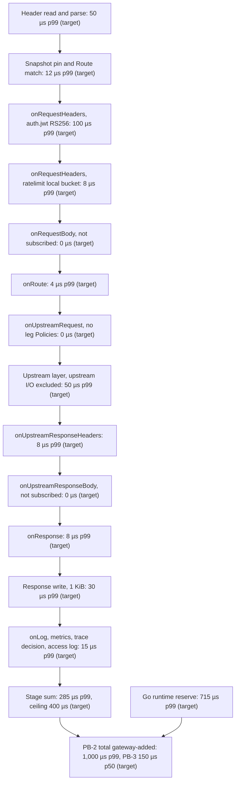
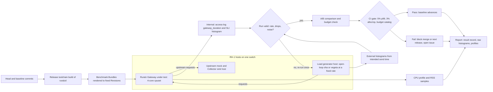

# Performance Budgets and Benchmarking

## Summary

This document owns every Ruralz Performance Budget: the latency, throughput, allocation, memory, startup and Hot Reload ceilings that Ruralz Gateway and Ruralz Control must meet on stated reference hardware, each tagged (target) or (hypothesis). It fixes the per-stage latency budget of the Filter Chain, the reference hardware, the benchmark scenarios and open-loop method, the CI regression gates, the profiling playbook and the reports that tie budgets to the SLOs of [Observability](10-observability.md). Nothing is implemented: each budget becomes a gate in the milestone that ships its component, from Planned (M1). Contributors, architects and operators read it before changing a hot path, sizing a Node or publishing a number.

## Scope and non-goals

In scope: budget values, reference hardware, scenarios, load tools, measurement rules, regression thresholds, constants other documents ask this suite to verify, profiling and reporting. "Pack 8.7" names a section of the [foundation pack](../_meta/foundation-pack.md). Values here win on conflict with [System overview](01-system-overview.md), [Data plane](03-data-plane.md#performance-budgets), [WASM plugin system](05-wasm-plugin-system.md#performance-model), [Observability](10-observability.md) and [Scalability and distributed state](11-scalability-and-distributed-state.md), which defer to this document.

This document answers three Open questions it owns: OQ-observability-17 in [Memory budget](#memory-budget), and OQ-testing-and-quality-strategy-2 and OQ-testing-and-quality-strategy-10 in [Benchmark suite and CI gating](#benchmark-suite-and-ci-gating). Their owners close them at conformance.

Non-goals, with owners:

- SLO objectives, metric names and alert rules: [Observability](10-observability.md#slo-definitions).
- Which CI stage runs each gate: [Testing and quality strategy](../engineering/03-testing-and-quality-strategy.md#benchmarks-and-regression-gates); this document supplies values, hardware, tools and thresholds.
- Sizing formulas for Nodes and State Stores: [Capacity planning](../operations/03-capacity-planning.md), which derives its coefficients from the results published here.
- Accuracy bounds of shared state: [Scalability and distributed state](11-scalability-and-distributed-state.md#consistency-and-accuracy-bounds).
- Kinds and fields: the [Configuration model](02-configuration-model.md); the benchmark Bundles use only its fields.

## Budget philosophy

These rules turn P10 ([Vision and positioning](../vision/01-vision-and-positioning.md#principles)) into budgets a pull request can fail.

| ID | Rule | Consequence |
|---|---|---|
| BP-1 | A value is a (target) we commit to, a (hypothesis) an estimate rests on, or a cited measurement | The first benchmark that measures a hypothesis turns it into a target or changes the design |
| BP-2 | Latency budgets count gateway-added time only: wall-clock time minus client I/O, upstream I/O, State Store round trips and declared remote calls ([Gateway-added time](10-observability.md#gateway-added-time)) | Upstream and State Store latency get separate budgets |
| BP-3 | A Performance Budget is the lab ceiling on the same metric and threshold as a production SLO | Each budget names its SLO, or says that none exists yet |
| BP-4 | Budgets compose: stage p50 values sum to at most the end-to-end p50, and stage p99 values plus a runtime reserve sum to at most the end-to-end p99 | Percentiles do not add, so the sums plan a budget and the end-to-end values gate it |
| BP-5 | Pay only for what is attached: an unsubscribed Phase costs one nil check ([System overview](01-system-overview.md#design-principles)) | Scenarios add one feature at a time |
| BP-6 | Latency holds at a stated load, never at saturation, as Envoy's benchmarking guidance advises ([source](https://www.envoyproxy.io/docs/envoy/latest/faq/performance/how_to_benchmark_envoy)) | Every latency budget names its offered rate |
| BP-7 | A budget gates from the milestone that ships its component; changing a value is a pull request to this document with benchmark evidence (commit type `perf`), and loosening SM-4, SM-5 or SM-6 also needs the Vision owner | Budgets move deliberately, never by drift |

### Seed targets

The rest of the document derives from these binding seeds.

| Seed | Value |
|---|---|
| Gateway-added p99 for plain proxying at 10k rps per core | 1 ms or less (target) |
| Plain proxying throughput on 4 vCPU | At least 50k rps (target) |
| WASM Plugin Phase call, pooled instance, deadline interruption on, p99 | 50 µs or less (target) |
| Base RSS of a Node | 100 MB or less plus about 2 KB per Route (target) |
| Hot Reload of 5,000 Routes | 500 ms or less (target) |

### Budget catalog and SLO ties

Scenario IDs S1 to S8 are defined in [Scenarios](#scenarios); RH-1 is the reference machine of [Reference hardware](#reference-hardware).

| ID | Performance Budget | Value | Measured by | SLO in [Observability](10-observability.md#slo-definitions) | Milestone |
|---|---|---|---|---|---|
| PB-1 | Gateway-added p99, S1 plain proxying at 10,000 rps per core on RH-1 | 1 ms or less (target) | Access-log `gateway_duration`; `ruralz_http_gateway_duration_seconds` | SLO-GW-2 | Planned (M1) |
| PB-2 | Gateway-added p99, S2 reference scenario at half saturation (SM-4) | 1 ms or less (target) | Same | SLO-GW-2 | Planned (M1) |
| PB-3 | Gateway-added p50, S2 at half saturation (SM-5) | 150 µs or less (target) | Same | SLO-GW-3 | Planned (M1) |
| PB-4 | S1 saturation throughput on 4 vCPU | 50,000 rps or more (target) | Load generator rate ladder | None; feeds Capacity planning and the CPU autoscaling signal | Planned (M1) |
| PB-5 | Plugin Phase call overhead, pooled, p99 (SM-6) | 50 µs or less (target) | `ruralz_plugin_call_overhead_seconds` | SLO-GW-4 | Planned (M2) |
| PB-6 | Base RSS with R Routes in the active Revision | 100 MB + 2 KB × R or less (target) | RSS after idle settle | None; Node runtime and configuration Grafana dashboard | Planned (M1) |
| PB-7 | Hot Reload of 5,000 Routes on an idle Node | 500 ms or less (target) | `ruralz_config_activation_duration_seconds{stage="total"}` | SLO-GW-6 covers its compile stage | Planned (M1) |
| PB-8 | Ruralz-owned allocations per S1 request, `net/http` internals excluded | 30 or fewer (target) | `testing.AllocsPerRun` around Router and Filter Chain executor | None; lab only | Planned (M1) |
| PB-9 | Same-zone GCRA round trip p99 | 1 ms or less (hypothesis) | `ruralz_state_call_duration_seconds{op="gcra"}` | SLO-GW-5 | Planned (M1) |
| PB-10 | Telemetry CPU at defaults, half saturation | 5% or less of Node CPU (target) | S2 with telemetry on and off | SLO-GW-7 watches its drops | Planned (M1) |
| PB-11 | Goodput with S1 offered at 150% of saturation | 90% or more of saturation throughput, excess rejected only as `RZ-RT-005` (target) | Load generator | SLO-GW-1 | Planned (M1) |
| PB-12 | Gateway-added time to first token, AI Route, bodies up to 16 KiB, p99 | 1 ms or less (target) | Differential time to first byte, S6 | None yet (OQ-performance-budgets-and-benchmarking-9) | Planned (M3) |
| PB-13 | Rollout convergence, 100 Nodes, `all-at-once`, Plugins cached, p95 (SM-9) | 30 s or less (target) | `ruralz_control_rollout_duration_seconds` | SLO-CP-1 | Planned (M2) |

PB-12 restates the [AI/LLM gateway](06-ai-llm-gateway.md) value and PB-13 the [Vision and positioning](../vision/01-vision-and-positioning.md#success-metrics) value; both are verified here.

## Per-stage latency budget

The table splits PB-2 and PB-3 (scenario S2) into stages, and PB-1 (S1) by dropping the two S2 Filters. Values are gateway-added microseconds on RH-1 at half saturation for S2: CPU work only, excluding time blocked on the client, an Upstream or the State Store. Stage names follow the spans of pack 2.

| Stage | Work in S2, or when attached | p50 µs | p99 µs | Ruralz-owned allocations |
|---|---|---|---|---|
| Header read and parse | HTTP/1.1 request line and headers in `net/http` ([ADR-0009](../adr/0009-http-stack-net-http-quic-go.md)), blocked reads excluded | 12 (target) | 50 (target) | 0, `net/http` internals excluded (target) |
| Snapshot pin and Route match | Pin stripe, host table and path trie (`ruralz.route.match`), no `when` | 3 (target) | 12 (target) | 0 (target) |
| `onRequestHeaders`: `auth.jwt` | RS256 verification with a 2,048-bit key from the cached JWKS | 45 (target) | 100 (target) | Reported, not gated; library allocations dominate (hypothesis) |
| `onRequestHeaders`: `ratelimit` | Local token bucket shard, then GCRA on the `memory` driver ([ADR-0008](../adr/0008-rate-limiting-local-bucket-and-gcra.md)) | 2 (target) | 8 (target) | 0 (target) |
| `onRequestHeaders`: other Filters | Not in S2; `cors`, `authz.cel` or `authz.ip` each, when attached | 2 each (target) | 5 each (target) | 0 each (target) |
| `onRequestBody` | Not subscribed in S2: one nil check; `validation.json-schema` on 1 KiB when attached | 0; 25 attached (target) | 0; 80 attached (target) | 0 (target) |
| `onRoute` | Single Upstream leg selected | 1 (target) | 4 (target) | 0 (target) |
| `onUpstreamRequest` | No upstream-leg Policy in S2; `headers` setting two values when attached | 0; 2 attached (target) | 0; 8 attached (target) | 0; 2 attached (target) |
| Upstream layer | Endpoint pick, breaker check, pooled connection, request write (`ruralz.upstream.<name>`), upstream I/O excluded | 12 (target) | 50 (target) | 6 (target) |
| `onUpstreamResponseHeaders` | Breaker and retry accounting | 2 (target) | 8 (target) | 0 (target) |
| `onUpstreamResponseBody` | Not subscribed in S2; `transform.response` on 1 KiB when attached | 0; 30 attached (target) | 0; 100 attached (target) | 0 (target) |
| `onResponse` | Response header finalization; `cors` response side when attached | 2 (target) | 8 (target) | 2 (target) |
| Response write | 1 KiB copied through the 32 KiB buffer, blocked writes excluded | 8 (target) | 30 (target) | 2 (target) |
| `onLog` | Metrics, unsampled trace decision, one access-log record ([ADR-0010](../adr/0010-telemetry-opentelemetry-first.md)) | 5 (target) | 15 (target) | 10: 0 metrics, 2 tracing, 8 access log (target) |
| `onChunk` | Not in S2; per chunk, one subscribed built-in Filter such as the Token Budget guard | 3 per chunk (target) | 15 per chunk (target) | 0 (target) |
| Plugin Phase call | S4: any Phase, pooled instance, deadline interruption on ([ADR-0004](../adr/0004-wasm-runtime-wazero.md), [ADR-0005](../adr/0005-plugin-abi-v1.md)) | 20 overhead (target) | 50 overhead, 100 with header-only guest logic (target) | Buffer copies only, reported (target) |
| Go runtime reserve | GC assists, scheduler delay and queueing at half saturation | 58 (target) | 715 (target) | Not applicable |
| Total, S2 | Sum of the S2 rows plus the reserve | 150 (target) | 1,000 (target) | S1 rows sum to 20 of PB-8's 30 (target) |

Rules for the table:

1. The S2 stage p99 values sum to 285 µs (target); the sum MUST stay at or below 400 µs (target), so the reserve keeps at least 600 µs (target) for the Go tail latency that [Vision and positioning](../vision/01-vision-and-positioning.md#where-ruralz-does-not-lead) names as a risk.
2. S1 drops the `auth.jwt` and `ratelimit` rows: its stages sum to 45 µs at p50 and 177 µs at p99 (target), and PB-1 leaves 823 µs (target) of reserve for the higher utilization of 10,000 rps per core.
3. Every attached Filter beyond S2 spends reserve, visible per Policy and Phase in `ruralz_filter_duration_seconds`; a Route whose rows exceed the 400 µs stage ceiling (target) is reported with its own measured budget.
4. The TLS 1.3 handshake is per connection: 1 ms or less of CPU at p99 with an ECDSA P-256 certificate (target), measured in S3, outside S1 and S2, which reuse connections.
5. Per-call budgets restated from features: CEL match and key expressions under 2 µs at p99 (target) ([Configuration model](02-configuration-model.md#limits)); `authz.opa` and `authz.cedar` under 100 µs at p99 (hypothesis), Planned (M2) ([Security and identity](08-security-and-identity.md)).

The costliest row, RS256, assumes RSA-2048 verification plus JOSE parsing costs about 40 µs of CPU (hypothesis), which an M1 component benchmark measures; the SM-4 algorithm is OQ-performance-budgets-and-benchmarking-8.

*Figure 1: the S2 per-stage latency budget in microseconds at p99, with the Go runtime reserve that closes PB-2.*



## Throughput and resources per core

### Reference hardware

Budgets hold on RH-1 only; the other profiles report results that never gate.

| ID | Role | Specification | Use |
|---|---|---|---|
| RH-1 | Reference machine for every latency, throughput and memory budget | Bare-metal linux/amd64 host, one socket, at least 16 physical cores at a fixed clock of 3.0 GHz or more with turbo boost and deep C-states off, SMT off, 64 GiB of RAM, a 25 Gbit/s NIC, the current Linux LTS kernel (target) | `ruralzd` runs in a cgroup v2 cpuset of 4 physical cores on the NIC's NUMA node with `GOMAXPROCS=4`; NIC interrupts are pinned to other cores |
| RH-1L, RH-1U | Load generator host; Upstream mock and OpenTelemetry Collector sink host | Same specification, same top-of-rack switch; host-to-host round trip p99 of 50 µs or less (hypothesis) | The generator and mock never share CPUs with the Node |
| RH-2 | linux/arm64 counterpart, a production platform ([tech stack](../engineering/01-tech-stack-and-libraries.md#static-builds)) | Bare-metal linux/arm64 host with the same memory, NIC and cpuset rules | Reported nightly from Planned (M1); gating is OQ-performance-budgets-and-benchmarking-4 |
| RH-3 | Reproduction profile for users | A general-purpose cloud VM with 4 dedicated vCPUs, same scripts | Published beside RH-1, never gated |

A vCPU is one logical CPU of the cpuset; SMT is off on RH-1, so "per core" and "per vCPU" name the same figure, while SMT hosts such as RH-3 score lower (hypothesis). The seeds measure 4 vCPU together: 10,000 rps per core means 40,000 rps on the cpuset (target), not a single-core Node, where queueing at 80% utilization alone would push p99 past 1 ms (hypothesis).

### Throughput targets

Saturation is the highest open-loop step whose achieved rate stays within 0.5% of the offered rate, with end-to-end p99 of 10 ms or less and errors at 0.01% or less (target).

| Scenario | Saturation on 4 vCPU | Per vCPU | Latency point | Milestone |
|---|---|---|---|---|
| S1 plain proxying | 50,000 rps or more (target), PB-4 | 12,500 rps or more (target) | PB-1 at 40,000 rps (target) | Planned (M1) |
| S2 reference scenario | 32,000 rps or more (target) | 8,000 rps or more (target) | PB-2 and PB-3 at half saturation (target) | Planned (M1) |
| S3 HTTP/2 over TLS 1.3 | 40,000 rps or more (target) | 10,000 rps or more (target) | p99 of 1 ms or less at half saturation (target) | Planned (M1); HTTP/3 variant Planned (M3) |
| S4 one header-only Plugin | 40,000 rps or more (target) | 10,000 rps or more (target) | PB-5 at half saturation (target) | Planned (M2) |
| S5 GCRA in a `redis` State Store | 40,000 rps or more on the Node (target); about 100,000 GCRA calls per second per shard (hypothesis) | 10,000 rps or more (target) | PB-9 at half saturation (hypothesis) | Planned (M1) |
| S6 AI streaming | 1,000 streams at 100 chunks per second on 0.5 vCPU or less (target) | Reported | PB-12 (target) | Planned (M3) |
| S7 gRPC unary through `connectrpc.com/connect` | 30,000 rps or more (target) | 7,500 rps or more (target) | p99 of 1 ms or less at half saturation (target) | Planned (M3) |
| S8 event ingress | Reported with first measurements | Reported | Budgets set with the event protocols | Planned (M4) |

S5's per-shard figure is a hypothesis: no published EVAL throughput exists, and Valkey 8's 1.19 million `SET` per second on 16 vCPU is a different command mix ([source](https://valkey.io/blog/unlock-one-million-rps-part2/)).

### Resources per core

At the S1 latency point of 40,000 rps on RH-1 (target):

| Resource | Budget |
|---|---|
| CPU per 10,000 rps, S1 | 0.8 vCPU or less (target) |
| CPU per 10,000 rps, S2 | 1.25 vCPU or less (target) |
| Garbage collector CPU share | 10% or less of Node CPU at `GOGC=100` (target) |
| Telemetry CPU at defaults | 5% or less of Node CPU, PB-10 (target) |
| Loaded RSS with 256 keep-alive connections | 256 MiB or less (target), see [Memory budget](#memory-budget) |
| Upstream requests on pooled connections | 99.9% or more after warm-up (target) |
| New TLS 1.3 handshakes, ECDSA P-256 | 2,000 or more per second per vCPU (hypothesis) |

### Published context

Other gateways' figures are context, not baselines: they differ in hardware, payload, plugins, TLS and load model ([source](https://www.krakend.io/docs/benchmarks/aws/)) ([source](https://github.com/Kong/kong-gateway-performance-benchmark)).

| Product | Published figure | Conditions and caveats |
|---|---|---|
| Kong Gateway 3.16 | 144,273.5 rps, p99 4.5 ms, no plugins, one route ([source](https://developer.konghq.com/gateway/performance/benchmarks/)) | 16 vCPU, k6 with the load model unstated ([source](https://github.com/Kong/kong-gateway-performance-benchmark)); about 1.1 vCPU per 10,000 rps if saturated, a derived figure ([source](https://developer.konghq.com/gateway/performance/benchmarks/)) |
| Envoy | "we do not currently publish any official benchmarks" ([source](https://www.envoyproxy.io/docs/envoy/latest/faq/performance/how_fast_is_envoy)) | An Istio 1.24 sidecar used about 0.20 vCPU per 1,000 rps with mTLS and telemetry ([source](https://istio.io/latest/docs/ops/deployment/performance-and-scalability/)) |
| KrakenD | 10,126 req/s on 8 vCPU ([source](https://www.krakend.io/docs/benchmarks/)) | 2016 runs with closed-loop `hey` ([source](https://www.krakend.io/docs/benchmarks/aws/)) and a pre-2.0 configuration ([source](https://www.krakend.io/docs/benchmarks/local/)); the homepage claims "80K+ requests/second on commodity hardware" ([source](https://www.krakend.io/)) |
| Apache APISIX | 140,000 QPS at 0.2 ms on an 8-core AWS server ([source](https://github.com/apache/apisix)) | No version or date; the benchmark page uses closed-loop wrk and shows charts only ([source](https://apisix.apache.org/docs/apisix/benchmark/)) |

Under P10, S1's 12,500 rps per vCPU (target) becomes a claim only when a published run meets it.

## Memory budget

RSS comes from the process's cgroup memory accounting and live heap from `ruralz_runtime_heap_bytes`; "idle settle" means no connections for 120 s (target), so freed pages are returned. PB-6 compares bytes: 100,000,000 plus 2,000 per Route (target).

| Component | Budget | Basis |
|---|---|---|
| Idle RSS, no Revision, telemetry at defaults | 95 MiB or less (target) | Replaces the 96 MiB of [Tech stack and libraries](../engineering/01-tech-stack-and-libraries.md#library-catalog), above the 100 MB seed (target) (OQ-performance-budgets-and-benchmarking-5) |
| Base RSS with R Routes (PB-6) | 100 MB + 2 KB × R or less (target) | Seed; measured at idle settle for 100 to 17,000 Routes |
| Per-Route slope between 1,000 and 17,000 Routes | 2 KB or less (target) | Router entries, chain arrays, CEL programs and unsharded label sets, fitted over the reload ladder |
| Sharded label sets of the first 1,000 admitted Routes | 2 MiB or less at 4 stripes (target), inside the base | About 2 KiB per Route and Upstream at 8 stripes (hypothesis), per [Observability](10-observability.md#overhead-per-signal) (OQ-performance-budgets-and-benchmarking-10) |
| Peak configuration memory during a Hot Reload | (K + 2) × the snapshot, K = 2 (target) | [Data plane](03-data-plane.md#configuration-snapshots-and-hot-reload) hypothesis, verified by the reload ladder |
| Telemetry | 40 MiB or less of live heap, up to 80 MiB of RSS at `GOGC=100` (target) | [Observability](10-observability.md#overhead-per-signal) |
| Idle HTTP/1.1 keep-alive connection, cleartext | 24 KiB or less (target) | Idiomatic Go held about 24 KB per idle WebSocket connection, a derived figure ([source](https://www.freecodecamp.org/news/million-websockets-and-go-cc58418460bb/)) |
| Idle HTTP/1.1 or HTTP/2 connection over TLS | 96 KiB or less (target) | 20,000 fit in about 1.9 GiB (target) |
| Idle WebSocket direct session | 96 KiB or less (target), Planned (M3) | Verifies the [Multi-protocol](07-multi-protocol.md) hypothesis |
| In-flight request | Its header block plus 64 KiB of pooled copy buffers (hypothesis) | [Data plane](03-data-plane.md#bounded-resources); measured by O1 |
| Loaded RSS, S1 at 40,000 rps with 256 connections | 256 MiB or less (target) | Idle base, telemetry RSS, connections, in-flight buffers and GC headroom |
| Plugin memory | Gateway `limits.maxPluginMemoryBytes`, default 2 GiB, fully reserved; compiled code 512 MiB or less (target) | [WASM plugin system](05-wasm-plugin-system.md#default-limits) |
| Per-Node state tables at their ceilings | About 475 MiB (target) | [Scalability and distributed state](11-scalability-and-distributed-state.md#per-node-limits) |
| Worst-case Node | About 19 GiB plus snapshots, fitting a 32 GiB Node (hypothesis) | Data plane |

Budget runs use `GOGC=100` without `GOMEMLIMIT`, as the M1 telemetry benchmarks assume, so the heap target is about twice the live heap ([source](https://go.dev/doc/gc-guide)). An informational run adds `GOMEMLIMIT` at 90% of a 512 MiB container limit (target).

**OQ-observability-17.** This document chooses option (a): the seeds stand, and the loaded-RSS row is the check that they fit together. At 40,000 rps on 4 vCPU (target), a Node spends at most 95 MiB idle, 80 MiB on telemetry, about 6 MiB on 256 idle connections and about 75 MiB on in-flight buffers and GC headroom, within 256 MiB (target). Observability's 50,000 rps per Node assumption (hypothesis) matches PB-4 on 4 vCPU. A documented `GOMEMLIMIT`, option (d), stays deployment guidance ([Scalability and distributed state](11-scalability-and-distributed-state.md#scale-unit)).

## Startup and reload time by configuration size

The ladder uses synthetic Bundles of R Routes, R/10 Upstreams and R/20 Policies plus one Gateway: exact and template paths on one host, `auth.jwt` and `ratelimit` at the Gateway, `authz.cel` on one Route in twenty, and no Plugins. The largest class stays under the 20,000-resource default limit of the [Configuration model](02-configuration-model.md#restricted-yaml-profile).

| Routes (resources) | Cold start to `/readyz` 200, file mode, rendered YAML | Cold start from Last-Known-Good | Hot Reload, idle Node | Snapshot size | Peak configuration memory |
|---|---|---|---|---|---|
| 100 (116) | 300 ms or less (target) | 200 ms or less (target) | 50 ms or less (target) | 200 KB or less (target) | 1 MB or less (target) |
| 1,000 (1,151) | 600 ms or less (target) | 300 ms or less (target) | 125 ms or less (target) | 2 MB or less (target) | 8 MB or less (target) |
| 5,000 (5,751) | 1.6 s or less (target) | 700 ms or less (target) | 500 ms or less, PB-7 (target) | 10 MB or less (target) | 40 MB or less (target) |
| 10,000 (11,501) | 3 s or less (target) | 1.3 s or less (target) | 1 s or less (target) | 20 MB or less (target) | 80 MB or less (target) |
| 17,000 (19,551) | 5 s or less (target) | 2.2 s or less (target) | 1.7 s or less (target) | 34 MB or less (target) | 136 MB or less (target) |

Cold start counts process start, library initialization and listener binding, 150 ms or less (target), plus loading. File mode parses a rendered Bundle; a Last-Known-Good start decodes canonical JSON and re-runs checks from reference resolution, as a Control-mode Node does ([Configuration model](02-configuration-model.md#validation-and-diff-semantics)). The Control-mode boot wait of pack 8.2 and external secret providers are excluded.

### Hot Reload stages

The stages match the `stage` label of `ruralz_config_activation_duration_seconds` and the steps of [Compile before swap](01-system-overview.md#compile-before-swap). For 5,000 Routes on an idle RH-1 Node:

| Stage | Work | Budget |
|---|---|---|
| `verify` | Full sha256 digest and signature check over the canonical content | 25 ms or less (target) |
| `compile` | Decode and re-validate about 40 µs per resource (hypothesis); build Routers, Filter Chains and CEL programs at 100 µs or less per Route on one core (target); resolve changed `file` and `env` secrets | 400 ms or less (target) |
| `plugin_compile` | None in the ladder; see below | 0 ms (target) |
| `swap` | Warm new pools, then one atomic pointer store | 25 ms or less (target) |
| `total` | PB-7, with 50 ms of margin (target) | 500 ms or less (target) |

The loader compiles with W = max(1, `GOMAXPROCS`/2) workers that yield at least every 100 µs of work (target), so requests never wait behind a long compile slice (OQ-performance-budgets-and-benchmarking-6). At 100 µs per Route on one core (target), 10,000 Routes take 1 s of single-core compile time, inside the 2 s of SLO-GW-6 (target). Under S1 load at half saturation, a 5,000-Route reload completes in 1 s or less and gateway-added p99 over the reload window stays at 1.5 ms or less (target).

New Plugins dominate a reload: a cold compile of a 2 MiB artifact takes 1 s or less on one core (hypothesis), one at a time ([WASM plugin system](05-wasm-plugin-system.md#performance-model)), so `plugin_compile` is reported apart and excluded from PB-7 and SLO-GW-6.

### Fleet-level timing

| Measurement | Budget | Owner of the mechanism |
|---|---|---|
| SM-9 Rollout convergence, 100 Nodes (PB-13) | 30 s or less at p95 (target) | [Control plane and GitOps](04-control-plane-and-gitops.md) |
| Largest batch of a 10,000-Node Cluster | 5 minutes or less (target) | Control plane and GitOps |
| Control Streams per Ruralz Control replica | 5,000 (hypothesis) | Control plane and GitOps |
| All Nodes reconnected after every replica restarts (CE-10) | 5 minutes or less (target) | [Scalability and distributed state](11-scalability-and-distributed-state.md#chaos-experiments) |

## Benchmark methodology

### Scenarios

Every scenario runs one Revision rendered from a checked-in benchmark Bundle, so equal digests mean equal configuration (pack 8.1). Telemetry stays at defaults: metrics on, `traceSampling` 0.01, OTLP export to the Collector sink on RH-1U and an access-log record for every request.

| ID | Workload | Filter Chain | Protocol | Milestone |
|---|---|---|---|---|
| S1 | GET, 1 KiB response from the mock, 256 keep-alive connections (target) | None | HTTP/1.1 cleartext on 8080 | Planned (M1) |
| S2 | As S1; the SM-4 and SM-5 reference scenario ([Vision and positioning](../vision/01-vision-and-positioning.md#success-metrics)) | `auth.jwt` and `ratelimit` at the Gateway, `memory` driver | HTTP/1.1 cleartext on 8080 | Planned (M1) |
| S3 | As S2 with 64 connections of up to 64 streams (target) | As S2 | HTTP/2 over TLS 1.3 on 8443 | Planned (M1); HTTP/3 on UDP 8443 Planned (M3) |
| S4 | As S1 | One `plugin` Policy: a header-only Rust PDK Plugin in `onRequestHeaders` | HTTP/1.1 cleartext | Planned (M2) |
| S5 | As S1 | `ratelimit` on the `redis` driver, a Valkey primary in the same zone | HTTP/1.1 cleartext | Planned (M1) |
| S6 | Mock `openai` provider streaming 100 chunks per second on 1,000 streams (target), 16 KiB prompts (target) | `ai.token-budget` with its local stream guard | SSE over HTTP/1.1 | Planned (M3) |
| S7 | Unary calls with a 1 KiB message (target) | None | gRPC on 8443 | Planned (M3) |
| S8 | Kafka, NATS and MQTT ingress | None | Event protocols | Planned (M4) |

Scale scenarios complete the set: C1 holds 20,000 idle keep-alive connections, O1 offers S1 at 150% of saturation (target) for PB-11, R1 runs the reload ladder, and F1 runs SM-9.

The S2 benchmark Bundle uses only [Configuration model](02-configuration-model.md) fields; S1 drops the Gateway `policies`, and S3 and S7 add an `https` listener on 8443 whose certificate comes from a `file` `secretRef`:

```yaml
apiVersion: ruralz/v1alpha1
kind: Gateway
metadata:
  name: bench
spec:
  listeners:
    - name: http
      protocol: http
      port: 8080
  admin:
    port: 9901
  telemetry:
    otlp: {endpoint: "https://otel-sink.bench.example:4317"}
    traceSampling: 0.01              # accessLog.when unset: every request is logged
  stateStore:
    driver: memory                   # S2 keeps the bucket and GCRA in process
  policies:
    - name: jwt-bench
    - name: ratelimit-bench
---
apiVersion: ruralz/v1alpha1
kind: Upstream
metadata:
  name: mock
spec:
  protocol: http
  endpoints:
    - address: "upstream-mock.bench.example:8080"
  loadBalancing: {algorithm: round-robin}
  timeout: 2s
---
apiVersion: ruralz/v1alpha1
kind: Route
metadata:
  name: bench-1k
spec:
  match:
    path: {exact: /bench/1k}
    methods: [GET]
  upstreams:
    - name: mock
  timeout: 5s
---
apiVersion: ruralz/v1alpha1
kind: Policy
metadata:
  name: jwt-bench
spec:
  type: auth.jwt
  config:
    issuers:
      - issuer: https://idp.bench.example
        jwksUrl: https://idp.bench.example/.well-known/jwks.json
        audiences: [bench]
---
apiVersion: ruralz/v1alpha1
kind: Policy
metadata:
  name: ratelimit-bench
spec:
  type: ratelimit
  config:
    key: "source.ip"
    limits: [{requests: 1000000, window: 1s}]   # never denies: S2 measures the cost, not the decision
```

### Open-loop load and coordinated omission

A closed-loop generator starts a request only after the previous one finishes, so it slows down with the system and never records the requests it failed to send: coordinated omission ([source](https://grafana.com/docs/k6/latest/using-k6/scenarios/concepts/open-vs-closed/)). The error is large: wrk2's README shows a corrected p99 of 10.52 ms against 5.43 ms uncorrected on a quiet run, and 1.27 s against 6.04 ms with a 1.4 s stall ([source](https://github.com/giltene/wrk2)).

Every Ruralz macro run is open-loop:

- The generator offers a fixed arrival rate and measures each latency from the intended send time.
- Tools: oha, MIT-licensed at v1.16.0, is primary for HTTP/1.1, HTTP/2 and the HTTP/3 variant, with a fixed rate (`-q`) and `--latency-correction` ([source](https://github.com/hatoo/oha)) ([source](https://github.com/hatoo/oha/releases)); vegeta, MIT-licensed and open-loop through `-rate`, cross-checks S1 ([source](https://github.com/tsenart/vegeta)); fortio, Apache-2.0 with a fixed `-qps` and gRPC, drives S7 ([source](https://github.com/fortio/fortio)). Catalog rows: OQ-performance-budgets-and-benchmarking-1.
- Histograms are HdrHistogram, whose `recordValueWithExpectedInterval` back-fills samples when a tool records raw service times ([source](https://github.com/HdrHistogram/HdrHistogram)).
- A run is valid only if the achieved rate stays within 0.5% of the offered rate (target), the generator and the mock each stay below 70% CPU (target), and the mock's own p99 stays at 200 µs or less (target).

### Warm-up, duration and percentiles

- **Warm-up.** Each run first offers its rate for 60 s (target), discarded, to fill pools, grow goroutine stacks and reach a steady GC cycle; it extends in 30 s steps, up to 180 s, until the p99 of three consecutive 10 s windows varies by 5% or less (target).
- **Duration.** Five measured runs of 180 s each per scenario and commit (target), interleaved with the baseline commit on the same hosts in A, B, A, B order.
- **Percentiles.** p50, p90, p99, p99.9 and maximum, per run and pooled, from HdrHistogram at three significant digits. At the S2 point each run records about 2.9 million samples (hypothesis), enough for a stable p99.9.
- **Rate ladder.** Saturation searches open-loop steps of 5% of the expected saturation, 60 s each (target).

### Measurement points

Both views gate, because each misses something the other sees:

1. **External.** The generator's end-to-end latency through the Node minus its latency direct to the mock at the same rate, which includes kernel accept-queue and socket-buffer time the Node never observes.
2. **Internal.** The access log's `gateway_duration` gives exact per-request gateway-added time, and `ruralz_http_gateway_duration_seconds` has bucket bounds at 1 ms and 150 µs (target), so PB-2 and PB-3 pass or fail exactly at the SLO-GW-2 and SLO-GW-3 thresholds. A run with any `ruralz_telemetry_logs_dropped_total` increase is invalid.

### Reproducibility

- Each result records the hardware fingerprint, kernel, sysctls, NIC settings, cpuset, `GOMAXPROCS`, `GOGC`, `GOMEMLIMIT`, the toolchain (release builds pin go1.27.1, pack 7; [ADR-0001](../adr/0001-implementation-language-go.md)), commit, Revision digest, tool versions and full command lines.
- Hosts run nothing else; a pre-run check confirms fixed CPU frequency, no throttling and the host-to-host round trip.
- The noise ceiling: the five baseline runs' p99 values MUST have a coefficient of variation of 2% or less (target), or the comparison is inconclusive.
- Anyone can re-run every scenario on RH-3 with the same scripts.
- Floor-toolchain builds (Go 1.26 with `GOEXPERIMENT=jsonv2`, [Version floor](../engineering/01-tech-stack-and-libraries.md#version-floor)) are measured for information only.

### Competitor baseline plan

The comparative bench suite is Planned (M4), the bench suite milestone of pack 2. It runs KrakenD CE, Envoy, Apache APISIX and Kong on RH-1 with the same cpuset, mock, scenarios and generator as Ruralz, following Envoy's guidance: open-loop load, worker or thread count matched to the 4 cores, features absent from the comparison disabled, TLS and HTTP/2 settings aligned, and latency never measured at maximum load ([source](https://www.envoyproxy.io/docs/envoy/latest/faq/performance/how_to_benchmark_envoy)).

| Product | Build at the snapshot | S1 plain proxying | S2 equivalent | S5 equivalent |
|---|---|---|---|---|
| KrakenD CE | v2.13.11, released 2026-09-08 ([source](https://github.com/krakend/krakend-ce/releases)) | Yes | JWT through CE `auth/validator` ([source](https://www.krakend.io/docs/authorization/jwt-validation/)) and the per-Node CE token bucket `qos/ratelimit/router` ([source](https://www.krakend.io/docs/endpoints/rate-limit/)) | Not run: Redis-backed limits are Enterprise-only ([source](https://www.krakend.io/docs/enterprise/throttling/endpoint-redis-rate-limit/)) |
| Envoy | The release current at the M4 run, recorded in the report ([source](https://www.envoyproxy.io/docs/envoy/latest/faq/performance/how_fast_is_envoy)) | Yes | Local rate limit filter ([source](https://www.envoyproxy.io/docs/envoy/latest/configuration/http/http_filters/local_rate_limit_filter)); JWT configuration awaits research (OQ-performance-budgets-and-benchmarking-7) | The external rate limit service on Redis ([source](https://github.com/envoyproxy/ratelimit)) |
| Apache APISIX | 3.18.0, released 2026-08-20 ([source](https://apisix.apache.org/blog/2026/08/20/release-apache-apisix-3.18.0/)) | Yes | `limit-count` with the `local` policy ([source](https://apisix.apache.org/docs/apisix/plugins/limit-count/)); JWT configuration awaits research | `limit-count` with the `redis` policy ([source](https://apisix.apache.org/docs/apisix/plugins/limit-count/)) |
| Kong | Kong/kong 3.9.3, the last open-source release ([source](https://github.com/Kong/kong/releases)), because 3.10 and later run without a license as if it had expired ([source](https://github.com/Kong/kong/discussions/14628)) | Yes | `rate-limiting` with `policy: local` ([source](https://developer.konghq.com/plugins/rate-limiting/reference/)); JWT configuration awaits research | `rate-limiting` with the `redis` policy ([source](https://developer.konghq.com/plugins/rate-limiting/)) |

Only open-source editions run, so every baseline is reproducible without a license. Ruralz also runs a comparison profile with access logs off (`accessLog.when: 'false'`), since logging defaults differ. Each product's configuration is published with its results.

## Benchmark suite and CI gating

### Suite layers

| Layer | Contents | Runs on | Milestone |
|---|---|---|---|
| Microbenchmarks | `go test -bench -benchmem`; `testing.AllocsPerRun` around Router, Filter Chain executor, CEL, canonicalization, validation and the Plugin Phase call | Shared runners, `pr-full` | Planned (M1); Plugin Phase call Planned (M2) |
| Component benchmarks | Loader compile ladder, JWT verification per algorithm, token bucket shards, metric aggregates at 4 P and 32 P ([Observability](10-observability.md#overhead-per-signal)) | RH-1, `nightly` | Planned (M1) |
| Macro scenarios | S1 to S8 | RH-1 hosts: S1 and S2 `nightly`, the rest weekly; `release` | Planned (M1) to Planned (M4) |
| Scale | C1, O1, R1, F1 (SM-9), SM-10 | Dedicated runners, `nightly` scale job | Planned (M1) to Planned (M3) |
| Soak | S2 at half saturation for 2 hours: RSS drift of 2% or less after 10 minutes, flat goroutine count (target) | RH-1, weekly | Planned (M1) |
| Competitor baselines | [Competitor baseline plan](#competitor-baseline-plan) | RH-1, each release | Planned (M4) |

### Regression policy and gates

A change fails when it regresses p99 latency by more than 5% (target) or alloc/op by more than 3% (target) against its gate's baseline, or when it exceeds any budget in the [Budget catalog and SLO ties](#budget-catalog-and-slo-ties).

| Gate | Stage | Baseline | Fails when | Milestone |
|---|---|---|---|---|
| alloc/op | `pr-full` | Merge base, interleaved with the head, 10 runs each (target), `GOGC=off`, fixed `GOMAXPROCS` | Median alloc/op above the base by more than 3% (target), or PB-8 exceeded | Planned (M1) |
| Macro p99 | `nightly` latency job for S1 and S2, weekly for the rest; `release` | The previous nightly commit re-run interleaved on the same hosts; for `release`, the previous release | Median-of-runs p99, external or internal, above the baseline by more than 5% (target), with at least four of five pairs slower | Planned (M1) |
| Absolute budgets | `nightly`; `release` | The budget catalog | Any budget exceeded in the pooled result | Planned (M1) |
| Saturation ladders | Weekly; `release` | Throughput targets | Saturation below its target (target) | Planned (M1) |
| Size and idle RSS | `pr-full` | Fixed values | Stripped binary above 160 MiB or idle RSS above 95 MiB (target) | Planned (M1) |
| Reload ladder | `nightly` | Size-class table | Any class above its budget | Planned (M1) |
| Scale | `nightly` scale job | PB-11, PB-13, SM-10, C1 | Any budget exceeded | Planned (M1) to Planned (M3) |

The nightly latency job thus runs about 80 minutes of interleaved S1 and S2 runs (target), inside the 3-hour job limit of Testing and quality strategy (target). The 3% alloc/op threshold is deliberately strict: at the 30 allocations of PB-8 (target), one extra allocation on the pass-through path is 3.3% and fails. A failing `pr-full` gate blocks merge; a failing `nightly` gate opens an issue and blocks the next release ([Repository layout and conventions](../engineering/02-repository-layout-and-conventions.md)). An override needs maintainer approval recorded with the benchmark report; loosening a value edits this document (BP-7).

*Figure 2: the benchmark pipeline from load generator to CI gate and report.*



### Statistics and runners

For OQ-testing-and-quality-strategy-2 this document chooses option (c): alloc/op on shared runners, because allocation counts do not depend on the machine under `GOGC=off` with fixed `GOMAXPROCS`, and latency only on RH-1 bare metal. Comparisons use medians across interleaved runs plus the four-of-five pair rule, which needs no distribution assumption. An inconclusive run (noise above 2%) (target) re-runs once, then opens an issue; the statistics tool itself awaits a research-backed catalog row (OQ-performance-budgets-and-benchmarking-1).

For OQ-testing-and-quality-strategy-10 this document chooses option (a): 100 `ruralzd` processes, each in its own network namespace as [Scalability and distributed state](11-scalability-and-distributed-state.md#scale-unit) requires, on four dedicated runners (target), with three Ruralz Control replicas on separate runners. SM-9 measures control-plane fan-out, so no request traffic runs, and kind is excluded because Kubernetes scheduling adds noise.

### Constants the suite verifies

[Data plane](03-data-plane.md#performance-budgets) and [Scalability and distributed state](11-scalability-and-distributed-state.md#per-node-limits) ask this suite to verify their ceilings:

| Constant | Value | Owner | Test |
|---|---|---|---|
| Client connections per Node | 20,000 (target) | Data plane | C1: all held, memory within the idle-connection budgets |
| In-flight units per Node | 20,000 (target) | Data plane | O1: `RZ-RT-005` at the ceiling, never queued |
| Retired snapshots and grace period | K = 2 and 30 s (target) | Data plane | Ten activations per second (target) under S2: zero failed unary requests, peak memory within (K + 2) × snapshot |
| Plugin instance wait | 1 ms (target) | WASM plugin system | S4 burst at twice the pool's busy count |
| Rate-limit key table | 1,048,576 entries, about 64 MiB (target) | Scalability and distributed state | CE-15 key flood memory |
| Post-commit write queue | 64,000 items and 85 MiB (target) | Scalability and distributed state | Cache-store saturation, CE-16 |
| State Store calls in flight | 8,192 (target) | Scalability and distributed state | S5 with 200 ms added latency (target), CE-3 |
| Span and access-log queues | 8,192 spans; 8,192 records and 4 MiB (target) | Observability | S2 at both trace caps |

### Milestone plan

| Milestone | Joins the suite |
|---|---|
| Planned (M1) | S1, S2, S3, S5; microbenchmarks and alloc/op gate; size and idle RSS gate; reload ladder; C1, O1, soak |
| Planned (M2) | S4 and PB-5 (SM-6); F1 (SM-9); `authz.opa` and `authz.cedar` costs; reload with Plugins |
| Planned (M3) | S6 (PB-12), S7, the HTTP/3 variant of S3; WebSocket and SSE session memory; SM-10 |
| Planned (M4) | Competitor baselines; S8; the `default.pgo` build ([tech stack](../engineering/01-tech-stack-and-libraries.md#version-floor)) |
| Planned (M5) | The FIPS build runs every gate with the same budgets (P1), except the HTTP/3 variant, which is off in FIPS builds |

## Profiling playbook

### From symptom to profile

| Symptom | First signal | Capture | Usual cause |
|---|---|---|---|
| p99 over budget while CPU stays below half | `ruralz_http_gateway_duration_seconds`, `ruralz_runtime_gc_cycles_total` | CPU and goroutine profiles under the same load | GC assists, lock waits, scheduler delay |
| CPU per 10,000 requests per second above its budget | Resources per core | 30-second CPU profile, diffed against the release baseline profile | New work on the hot path |
| alloc/op gate failure | The gate's benchmark | `-benchmem` and a heap profile by `alloc_objects` | A value newly escaping to the heap |
| RSS growth | `ruralz_runtime_heap_bytes` and RSS | Two heap profiles by `inuse_space`, 10 minutes apart | Retained snapshots, label sets or pools |
| Goroutine growth | `ruralz_runtime_goroutines` | Goroutine profile; pinned snapshots on `/debug/snapshots` | Blocked handlers, long-pinned streams |
| Throughput stops scaling with cores | `ruralz_filter_duration_seconds` rising at 32 P | Mutex and block profiles for a `?seconds=` window | Shared shards, pools or counters |
| Plugin calls over PB-5 | `ruralz_plugin_call_overhead_seconds`, `ruralz_plugin_pool_wait_seconds` | CPU profile showing wazero frames | Pool too small, loop-heavy guest ([WASM plugin system](05-wasm-plugin-system.md#default-limits)) |

### Capturing profiles

Profiles come from `/debug/pprof/` on admin port 9901 ([Data plane](03-data-plane.md#admin-endpoints)), which requires a token or mTLS (TB-9; bind and scheme: OQ-system-overview-6). Mutex and block profiling run only during a `?seconds=` request ([Observability](10-observability.md#debugging-tools)).

```bash
# 30-second CPU profile from one Node under load; a bearer token is shown, mTLS works too
curl -sS -H "Authorization: Bearer ${ADMIN_TOKEN}" -o cpu.pprof \
  "https://node-1.ops.internal:9901/debug/pprof/profile?seconds=30"
go tool pprof -top -nodecount=30 cpu.pprof
go tool pprof -diff_base=release-baseline-cpu.pprof -top cpu.pprof

# Heap: live bytes, then allocation sites
curl -sS -H "Authorization: Bearer ${ADMIN_TOKEN}" -o heap.pprof \
  "https://node-1.ops.internal:9901/debug/pprof/heap"
go tool pprof -sample_index=inuse_space -top heap.pprof
go tool pprof -sample_index=alloc_objects -top heap.pprof

# Contention, sampled only for the requested window
curl -sS -H "Authorization: Bearer ${ADMIN_TOKEN}" -o mutex.pprof \
  "https://node-1.ops.internal:9901/debug/pprof/mutex?seconds=30"

# Allocation benchmarks as the alloc/op gate runs them
GOGC=off go test -run '^$' -bench . -benchmem -count 10 ./internal/...
```

Profile one Node at a time; CPU profiling costs about 5% of its CPU while it runs (hypothesis). Heap profiles can hold request data, so they stay internal; published reports attach CPU profiles only.

### GOGC and GOMEMLIMIT

Go facts behind the reserve row and the memory budget:

- `GOGC` defaults to 100; the heap target is live heap plus (live heap + GC roots) × `GOGC`/100, and doubling `GOGC` roughly halves GC CPU cost ([source](https://go.dev/doc/gc-guide)) ([source](https://pkg.go.dev/runtime)).
- `GOMEMLIMIT` is a soft limit; the runtime caps GC CPU at roughly 50% over a window of 2 × `GOMAXPROCS` CPU-seconds, containers should keep 5 to 10% headroom, and `GOGC=off` with a limit suits only a process that owns its memory ([source](https://go.dev/doc/gc-guide)).
- Since Go 1.25, `GOMAXPROCS` follows cgroup CPU bandwidth limits ([source](https://go.dev/doc/go1.25)); benchmarks still set it explicitly.
- Green Tea GC is the default in Go 1.26, with an expected 10 to 40% reduction in GC overhead ([source](https://go.dev/doc/go1.26)); release builds use go1.27.1, so every budget is measured with it.

Ruralz rules:

1. Budgets are verified at `GOGC=100` without `GOMEMLIMIT`; operators SHOULD set `GOMEMLIMIT` to about 90% of the container memory limit (target), as [Scalability and distributed state](11-scalability-and-distributed-state.md#scale-unit) advises.
2. When GC CPU exceeds 10% of Node CPU (target) and memory headroom exists, raise `GOGC` to 200 and confirm with S2 before rollout.
3. Operators SHOULD NOT set `GOGC=off`: under overload a Node's memory nears its limit, and the runtime would then spend up to its GC CPU cap collecting (hypothesis).

### Profile-guided optimization

`default.pgo` for `cmd/ruralzd` is Planned (M4). Go reports 2 to 14% gains across representative programs, with CPU pprof profiles driving inlining ([source](https://go.dev/doc/pgo)). The profile merges S2 and S4 CPU profiles from the previous release on RH-1; the PGO build passes the same gates, and its gain is reported, never assumed in a budget.

## Reporting

### Result record

Every run writes one machine-readable record, stored with the CI artifacts:

| Field | Content |
|---|---|
| Identity | Scenario ID, commit, baseline commit, full Revision digest, toolchain |
| Environment | Hardware profile (RH-1, RH-2 or RH-3) and fingerprint, kernel, cpuset, `GOMAXPROCS`, `GOGC`, `GOMEMLIMIT` |
| Load | Tool, version, command line, offered and achieved rate, connections, warm-up and measured durations |
| Latency | External and internal p50, p90, p99, p99.9 and maximum per run and pooled, with raw HdrHistogram logs |
| Resources | CPU per 10,000 requests per second, GC CPU share, RSS at load and at idle settle, live heap, alloc/op |
| Validity | Rate error, generator and mock CPU, access-log drops, noise, verdict |
| Budgets | Each Performance Budget ID with its value, the measured result, its SLO ID and pass or fail |

### Publication

- Nightly and release runs publish their records, raw histograms and CPU profiles from this repository (P10), Planned (M1); the release notes list every budget with its measured result.
- Other documents quote Ruralz performance only as a tagged target or a link to a published result.
- [Market landscape and table stakes](../comparison/02-market-landscape-and-table-stakes.md) items F-7 and F-18 point here: comparative results publish next to the cited vendor claims, Planned (M4).
- Competitor results carry each product's version, edition and full configuration, invite corrections through the repository's issues, and state results per scenario, never a general ranking.

### Production comparison

Budgets are lab ceilings and SLOs production objectives on the same metrics, so operators compare them on the SLO burn rates Grafana dashboard ([Observability](10-observability.md#grafana-dashboard-pack)). A production p99 above a budget at comparable load and chain points to a regression or an environment difference; the playbook applies. [Capacity planning](../operations/03-capacity-planning.md) takes CPU per 10,000 requests per second, per-connection memory and per-Route memory from the latest release record.

## Open questions

| ID | Question | Options | Owner | Blocking? |
|---|---|---|---|---|
| OQ-performance-budgets-and-benchmarking-1 | Which load and statistics tools get tech stack catalog rows: oha, vegeta, fortio, wrk2 (license not researched) and an A/B statistics tool? | (a) oha, vegeta, fortio, then a statistics tool after research (proposed); (b) wrk2 as primary after research; (c) a Ruralz Go generator | tech-stack-and-libraries | Yes, for the M1 macro gate |
| OQ-performance-budgets-and-benchmarking-2 | How is RH-1 provisioned and who funds it? | (a) Revington-owned bare metal; (b) rented bare-metal cloud hosts; (c) cloud VMs with more repetitions | performance-budgets-and-benchmarking | Yes, for the M1 macro gate |
| OQ-performance-budgets-and-benchmarking-3 | Should Testing and quality strategy adopt this document's interleaved re-run of the macro baseline instead of the previous nightly result? | (a) Re-run interleaved (proposed); (b) previous result | testing-and-quality-strategy | No |
| OQ-performance-budgets-and-benchmarking-4 | When does linux/arm64 (RH-2) gate? | (a) Report only in M1, gate from M2 (proposed); (b) gate from M1 | testing-and-quality-strategy | No |
| OQ-performance-budgets-and-benchmarking-5 | Tech stack and Testing and quality strategy state a 96 MiB idle RSS gate; this document sets 95 MiB (target) to fit the 100 MB seed. Do they align? | (a) Align to 95 MiB (proposed); (b) restate the seed in binary units | tech-stack-and-libraries | No |
| OQ-performance-budgets-and-benchmarking-6 | Does the config loader adopt W = max(1, `GOMAXPROCS`/2) workers yielding every 100 µs (target)? | (a) Yes, a fixed Node default (proposed); (b) all cores at boot, W at runtime; (c) a configurable field | data-plane | Yes, for PB-7 (M1) |
| OQ-performance-budgets-and-benchmarking-7 | Which JWT configuration of Envoy, APISIX and Kong matches S2, given that no research covers their JWT features? | (a) Research addendum, then S2 baselines (proposed); (b) run S1 and S5 only | performance-budgets-and-benchmarking | Yes, for the M4 S2 baselines |
| OQ-performance-budgets-and-benchmarking-8 | Which JWT algorithm defines SM-4, since its cost dominates the reference scenario? | (a) RS256 with a 2,048-bit key (current); (b) ES256; (c) both, gating the slower | vision-and-positioning | No |
| OQ-performance-budgets-and-benchmarking-9 | Should Observability add an SLO for gateway-added time to first token (PB-12)? | (a) A new SLO on a streaming histogram; (b) lab budget only | observability | No |
| OQ-performance-budgets-and-benchmarking-10 | Sharded label sets cost about 2 KiB per Route at 8 stripes (hypothesis); should the per-Route budget scale with stripes? | (a) Keep 2 KB, counting the first 1,000 Routes' sharding in the base (current); (b) a per-stripe allowance | observability | No |
| OQ-performance-budgets-and-benchmarking-11 | How does the overload budget PB-11 interact with load shedding (OQ-data-plane-6)? | (a) Fixed in-flight ceiling (current); (b) revise PB-11 when an adaptive limiter lands | data-plane | No |
