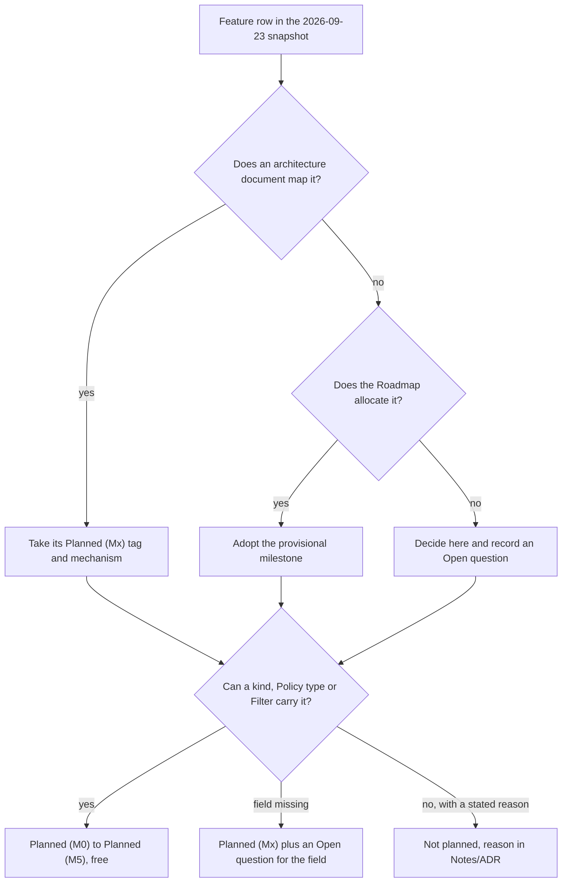
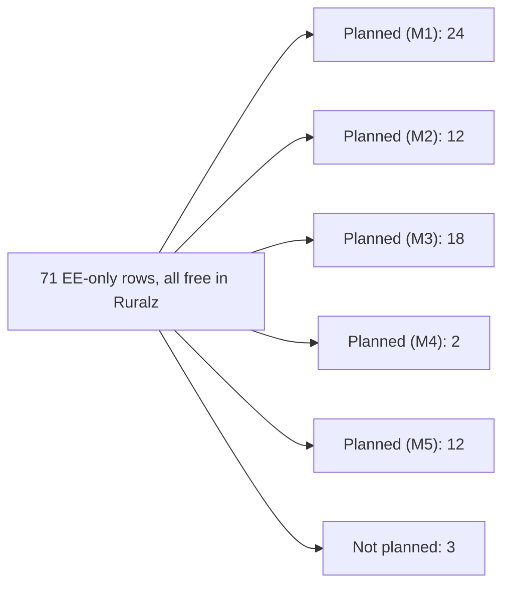

# KrakenD Enterprise Parity Matrix

## Summary

This document maps all 153 rows of the KrakenD feature snapshot (2026-09-23, KrakenD EE 2.13) to Ruralz. Each of the 71 Enterprise-only rows is free in Ruralz with a milestone, except three rows marked Not planned with a reason: Lua advanced helpers, NTLM authentication and the New Relic native SDK. Across all rows, 140 are Planned (M0) to Planned (M5) and 13 are Not planned. Each row names the kind, Policy type or Filter that carries it. The document also lists what Ruralz adds beyond parity and maps KrakenD EE support offerings to commercial support and Ruralz Cloud. Evaluators use it to judge fit; architects use it to trace rows to owning documents. Nothing is implemented yet.

## Scope and non-goals

In scope: every feature row of the [KrakenD parity research](../_meta/research/krakend-parity.md), grouped in its ten categories; the Ruralz status, mechanism and rationale of each row; capabilities KrakenD lacks in both editions; Not planned rows and partial parity; the KrakenD EE support and services offerings; and counts per category and status. This matrix decides row allocations: the [Roadmap](../roadmap/01-roadmap-and-milestones.md#how-parity-is-counted) and [Vision and positioning](../vision/01-vision-and-positioning.md#versus-krakend-ee-what-becomes-free) both defer to it on conflict. Terms follow the binding [foundation pack](../_meta/foundation-pack.md#13-krakend-parity-anchor), whose section 13 makes this document the owner of KrakenD EE parity.

Non-goals:

- Migration mechanics, the `ruralz bundle import krakend` mapping and fidelity levels (`exact`, `equivalent`, `approximate`, `manual`), owned by [Migration from KrakenD](03-migration-from-krakend.md).
- Field and Policy type design, owned by the [Configuration model](../architecture/02-configuration-model.md); a missing field becomes an Open question here, never an invented field.
- Other competitors, owned by [Market landscape and table stakes](02-market-landscape-and-table-stakes.md).
- Performance comparisons, owned by [Performance budgets and benchmarking](../architecture/12-performance-budgets-and-benchmarking.md), whose M4 bench suite publishes KrakenD CE baselines.
- Calendar dates, which no milestone carries (OQ-roadmap-and-milestones-2), and KrakenD pricing, which the research did not capture.

## Method and snapshot

The source is the public KrakenD feature table at krakend.io/features ([source](https://www.krakend.io/features/)), fetched on the snapshot date 2026-09-23 and recorded row by row in the [KrakenD parity research](../_meta/research/krakend-parity.md). Behavior behind each row comes from the [KrakenD configuration model research](../_meta/research/krakend-config-model.md), which walked the v2.13 JSON Schema ([source](https://www.krakend.io/schema/v2.13/krakend.json)).

| Item | Value |
|---|---|
| Source | krakend.io/features ([source](https://www.krakend.io/features/)) and the enterprise overview ([source](https://www.krakend.io/enterprise/)) |
| Snapshot date | 2026-09-23; every KrakenD fact below is as of this date |
| Edition | KrakenD EE 2.13, released 2026-03-12 ([source](https://www.krakend.io/blog/krakend-ee-2.13-release-notes/)); KrakenD CE v2.13.11, released 2026-09-08 ([source](https://github.com/krakend/krakend-ce/releases)) |
| Rows | 153 feature rows: 71 EE-only and 82 available in both editions |
| Categories | The ten categories of the features page, one H2 each; the page's "Authorization and authentication" is spelled "Authentication and authorization" here |
| Announced change | KrakenD CE 3.0 drops Go plugins, announced 2026-06-04 ([source](https://www.krakend.io/blog/dropping-plugins-support-on-community/)) and merged into `dev-3.0` on 2026-09-21 ([source](https://github.com/krakend/krakend-ce/pull/1106)); CE 3.0 had no release tag at the snapshot |

Rules applied to every row:

1. The Feature cell copies the research row verbatim, so the verify-docs coverage check can match all 153 rows.
2. The KrakenD CE and KrakenD EE cells come from the features page. Where the JSON Schema and the features page disagree on an edition, as the research records for several namespaces, the features page wins.
3. The Ruralz status comes from the Planned tag of the owning architecture document. Rows no architecture document maps take the Roadmap's provisional allocation, and rows neither covers are decided here with an Open question.
4. The Ruralz mechanism names only kinds, fields, Policy types and Filters of the [Configuration model](../architecture/02-configuration-model.md#kind-catalog). Where a row needs a field that does not exist yet, the mechanism names the kind that would carry it and the Notes/ADR cell names the Open question.
5. A Not planned row always states its reason. At most 10 EE-only rows may be Not planned, per SM-3 in [Vision and positioning](../vision/01-vision-and-positioning.md#success-metrics).
6. Every Planned row is free under Apache-2.0 in the single public build ([ADR-0002](../adr/0002-apache-2-license-no-feature-gating.md), P1). KrakenD EE, by contrast, will not start without a valid license file ([source](https://www.krakend.io/docs/enterprise/overview/license-file/)).

*Figure 1: how each snapshot row receives its Ruralz status.*

The snapshot is refreshed on the cadence OQ-vision-and-positioning-8 decides; a refresh re-runs these rules and records moved rows in the Summary counts.

## Legend

Each category section holds one table with the columns Feature, KrakenD CE, KrakenD EE, Ruralz status, Ruralz mechanism and Notes/ADR.

| Column | Values | Meaning |
|---|---|---|
| KrakenD CE, KrakenD EE | Yes | The edition offers the feature at the snapshot |
| KrakenD CE, KrakenD EE | Partial | The edition offers part of it; reserved for refreshes, since the snapshot page is binary |
| KrakenD CE, KrakenD EE | No | The edition lacks it; a row with CE No and EE Yes is an EE-only row |
| KrakenD CE, KrakenD EE | N/A | The feature has no meaning for that edition; unused at this snapshot |
| Ruralz status | Planned (M0) to Planned (M5) | The milestone whose exit delivers the row, free in every build; nothing is implemented yet |
| Ruralz status | Not planned | Out of M0 to M5 for the reason in Notes/ADR |
| Ruralz mechanism | Kinds, fields, Policy types | Kinds in `PascalCase` (`Route`), fields as `spec` paths (`match.hosts`), Policy types as registered strings (`ratelimit`) |
| Notes/ADR | Text | "Partial parity" marks a planned row narrower than the KrakenD feature; OQ IDs name the open decision |

| Milestone | Pack name |
|---|---|
| M0 | Foundations |
| M1 | Core parity |
| M2 | WASM + Control/GitOps |
| M3 | AI gateway + gRPC/GraphQL/WS/SSE + HTTP/3 |
| M4 | Event protocols + multi-region + bench suite |
| M5 | Long-tail parity (SSO/SAML for Console, FIPS build, monetization hooks) |

A **Policy** is configuration; a **Filter** (built-in Go) or a **Plugin** (WASM) implements it. Evaluators can read the Ruralz status column alone; architects follow the mechanism into the owning document.

## CI/CD, GitOps and development tools

KrakenD columns: ([source](https://www.krakend.io/features/)). Nine of the 17 rows are EE-only; Ruralz ships every tool as a free `ruralz` CLI command or through Ruralz Console, as the [CLI mapping](../reference/01-cli-and-api-surface.md#krakend-ee-tool-mapping) fixes. GitOps itself, which KrakenD lacks, is in [Beyond parity](#beyond-parity).

| Feature | KrakenD CE | KrakenD EE | Ruralz status | Ruralz mechanism | Notes/ADR |
|---|---|---|---|---|---|
| KrakenD Designer | Yes | Yes | Planned (M2) | Ruralz Console Bundle editor over `Route`, `Upstream` and `Policy` files with live diagnostics and Git write-back | The Designer is stateless ([source](https://www.krakend.io/features/)); [Ruralz Console](../architecture/04-control-plane-and-gitops.md#ruralz-console) |
| Audit configuration | Yes | Yes | Planned (M2) | `ruralz bundle audit` reports findings such as a `Route` without an auth Policy or broad `Plugin` Capabilities | Runs on the rendered Bundle |
| Syntax validation and linting | Yes | Yes | Planned (M1) | `ruralz bundle validate` checks every kind against the published JSON Schema with source-mapped `RZ-CFG` diagnostics | KrakenD lints JSON only ([source](https://www.krakend.io/docs/configuration/supported-formats/)); [ADR-0003](../adr/0003-configuration-format.md) |
| Flexible configuration | Yes | Yes | Planned (M1) | `overlays/<env>/` strategic merge and `${VAR}` substitution, selected by `Environment` `spec.overlay` and `spec.variables` | No template language; import reads a rendered KrakenD file ([source](https://www.krakend.io/docs/configuration/flexible-config/)) |
| Extended flexible configuration | No | Yes | Planned (M1) | Multi-file Bundle union in lexical order plus one overlay per render, with `Environment` variables | Replaces `$ref` and settings files ([source](https://www.krakend.io/docs/enterprise/configuration/flexible-config/)) |
| Multi-format configuration | Yes | Yes | Planned (M1) | YAML 1.2 and JSON through one loader for every kind, yielding one Revision digest | Partial parity: TOML, HCL and properties files are rejected ([source](https://www.krakend.io/docs/configuration/supported-formats/)); ADR-0003 |
| Hot-reload in development | Yes | Yes | Planned (M1) | `ruralz dev run` watches a Bundle; the Node swaps its compiled `Route` snapshot atomically (Hot Reload) | KrakenD restarts the process and advises against it in production ([source](https://www.krakend.io/docs/developer/hot-reload/)) |
| IDE integration | Yes | Yes | Planned (M0) | Published JSON Schema, draft 2020-12 authoring view, for all ten kinds from `Gateway` to `Cluster` | Existing YAML language servers apply; ADR-0003 |
| Plugin builder | Yes | Yes | Planned (M2) | `ruralz plugin build` compiles a `Plugin` to WASM for Plugin ABI v1 | KrakenD plugins must match its Go version ([source](https://www.krakend.io/docs/extending/http-server-plugins/)); [ADR-0005](../adr/0005-plugin-abi-v1.md) |
| Plugin generator | No | Yes | Planned (M2) | `ruralz plugin init` scaffolds a `Plugin` project with a PDK | Rust and TinyGo PDKs first ([WASM plugin system](../architecture/05-wasm-plugin-system.md)) |
| End-to-end testing tool | No | Yes | Planned (M2) | `ruralz test run` sends declarative request cases to a local `ruralzd` or a URL and checks each `Route` response | Test cases live outside the Bundle |
| OpenAPI importer | No | Yes | Planned (M2) | `ruralz bundle import openapi` generates `Route` and `Upstream` resources from OpenAPI 3.x | Output is an ordinary Bundle |
| OpenAPI exporter | No | Yes | Planned (M2) | `ruralz bundle export openapi` emits OpenAPI 3.x for a rendered Bundle's HTTP `Route` resources | KrakenD feeds it from `documentation/openapi` settings ([source](https://www.krakend.io/docs/enterprise/developer/openapi/)) |
| OpenAPI server | No | Yes | Planned (M5) | Ruralz Gateway serving the exported document for a `Route` set | Design per OQ-vision-and-positioning-11; until then publish the exported file |
| Postman collection generation | No | Yes | Planned (M2) | `ruralz bundle export postman` emits a collection for the same `Route` resources | ([source](https://www.krakend.io/docs/enterprise/developer/postman/)) |
| DOT image generator | No | Yes | Planned (M2) | `ruralz bundle export dot` emits a Graphviz graph of `Route`, `Policy` and `Upstream` resources | Output is DOT text |
| Dump to disk | No | Yes | Planned (M1) | `ruralz node dump` saves a Node's active Revision, every `Route`, `Policy` and `Upstream`, from `/config/dump` with secrets omitted | `ruralz bundle render` also writes a rendered Bundle |

## Request and response transformation

KrakenD columns: ([source](https://www.krakend.io/features/)). Ten of the 25 rows are EE-only. Ruralz carries them with `Route` composition ([Data plane](../architecture/03-data-plane.md#composition-engine)), CEL ([ADR-0011](../adr/0011-expressions-and-authorization-engines.md)) and the `transform.request` and `transform.response` types, whose `config` schema is still unauthored (OQ-krakend-ee-parity-matrix-1). There is no template language and no Lua.

| Feature | KrakenD CE | KrakenD EE | Ruralz status | Ruralz mechanism | Notes/ADR |
|---|---|---|---|---|---|
| Backend For Frontend <!-- alias-ok --> | Yes | Yes | Planned (M1) | `Route` `composition.mode: aggregate` merges several `Upstream` legs into one JSON response | Per-client shaping with step `select` and `group` |
| Aggregation | Yes | Yes | Planned (M1) | `composition.mode: aggregate` runs steps in parallel and merges bodies under `group` | A failed `optional` step yields a partial response |
| Data transformation | Yes | Yes | Planned (M1) | Composition step fields `target`, `select`, `rename`, `group` and `collection` | Same shape as KrakenD's field operations ([source](https://www.krakend.io/docs/backends/data-manipulation/)) |
| HTTP Cache headers (for CDN) | Yes | Yes | Planned (M1) | `headers` Policy `response.set[]` writes `Cache-Control` | KrakenD `cache_ttl` also only sets the header ([source](https://www.krakend.io/schema/v2.13/krakend.json)) |
| Automatic output encoding | Yes | Yes | Planned (M1) | A `Route` passes Upstream bytes through; `composition` merges emit JSON | Partial parity: XML, YAML and negotiated output per OQ-krakend-ee-parity-matrix-2 |
| Faster JSON decoding (fastjson) | No | Yes | Planned (M5) | The JSON decoder behind `composition` merges, `transform.response` and `validation.json-schema` | A decoder choice, weighed in OQ-krakend-ee-parity-matrix-11 |
| Flatmap | Yes | Yes | Planned (M1) | `transform.response` array operations | `config` per OQ-krakend-ee-parity-matrix-1 ([source](https://www.krakend.io/docs/backends/flatmap/)) |
| Gzip compression | No | Yes | Planned (M5) | A built-in compression Filter registered as a new Policy type | Type per OQ-krakend-ee-parity-matrix-3 |
| Request body extractor | No | Yes | Planned (M1) | `transform.request` copies body fields into headers or the query string | New in EE 2.13 ([source](https://www.krakend.io/docs/enterprise/endpoints/request-body-extractor/)); OQ-krakend-ee-parity-matrix-1 |
| Request manipulation using Go templates | No | Yes | Planned (M1) | `transform.request` builds the Upstream body with CEL | No Go templates ([source](https://www.krakend.io/docs/enterprise/backends/body-generator/)); OQ-krakend-ee-parity-matrix-1 |
| Response manipulation using Go templates | No | Yes | Planned (M1) | `transform.response` builds the client body with CEL | ([source](https://www.krakend.io/docs/enterprise/backends/response-body-generator/)); OQ-krakend-ee-parity-matrix-1 |
| Response manipulation with query language | No | Yes | Planned (M1) | `transform.response` CEL expressions over `response.body` | CEL replaces JMESPath ([source](https://www.krakend.io/docs/enterprise/endpoints/jmespath/)) |
| Regular expression replacements | No | Yes | Planned (M1) | `transform.response` literal and regular expression replacement | ([source](https://www.krakend.io/docs/enterprise/endpoints/content-replacer/)); OQ-krakend-ee-parity-matrix-1 |
| Conditional request and responses (CEL) | Yes | Yes | Planned (M1) | `Policy.spec.when`, `authz.cel` `config.rule` and composition step `when` | cel-go, cost-checked at validation; ADR-0011 |
| Lua scripting | Yes | Yes | Not planned | CEL fields and `plugin` Policies instead | No Lua runtime (ADR-0011); KrakenD compiles Lua on every execution ([source](https://www.krakend.io/docs/deploying/server-dimensioning/)) |
| Lua advanced helpers | No | Yes | Not planned | CEL strings and encoders extensions, or a `plugin` Policy | Follows the Lua row (ADR-0011); EE-only helpers ([source](https://www.krakend.io/docs/endpoints/lua/)) |
| Custom Go plugins | Yes | Yes | Not planned | A WASM `Plugin` attached by a `plugin` Policy replaces them | Vision non-goal 3; CE 3.0 drops Go plugins ([source](https://www.krakend.io/blog/dropping-plugins-support-on-community/)) |
| JSON Schema response validation | No | Yes | Planned (M5) | `validation.json-schema` extended to response Phases; a validation-class `plugin` Policy meanwhile | Phase extension per OQ-krakend-ee-parity-matrix-3 ([source](https://www.krakend.io/docs/enterprise/endpoints/response-schema-validator/)) |
| JSON Schema request validation | Yes | Yes | Planned (M1) | `validation.json-schema` in `onRequestBody`, draft 2020-12 | Validator row in [Tech stack](../engineering/01-tech-stack-and-libraries.md) |
| Martian (DSL) | Yes | Yes | Planned (M1) | `headers`, `transform.request` and `transform.response` Policies | Partial parity: same operations, no DSL ([source](https://www.krakend.io/docs/backends/martian/)) |
| Multistrategy error handling | Yes | Yes | Planned (M1) | Upstream statuses pass through; composition step `optional`; the `RZ-<AREA>-<NNN>` error format | KrakenD error detail options ([source](https://www.krakend.io/docs/backends/detailed-errors/)) |
| Cache | Yes | Yes | Planned (M1) | `cache` Policy (Response Cache) in the State Store, partitioned by CEL `config.key` | Shared by all Nodes of a Cell; KrakenD's cache is in memory ([source](https://www.krakend.io/docs/backends/caching/)) |
| Sequential proxy | Yes | Yes | Planned (M1) | `composition.mode: sequential`; later steps read earlier results through CEL `steps` | Results reach steps only through CEL |
| Mocked data | Yes | Yes | Planned (M2) | A `plugin` Policy that short-circuits a request Phase with a static response | Built-in static responses per OQ-krakend-ee-parity-matrix-3 |
| Workflows | No | Yes | Planned (M1) | `composition.mode: sequential` with per-step `when` for linear workflows | Dependency graphs per OQ-data-plane-3 ([source](https://www.krakend.io/docs/enterprise/endpoints/workflows/)) |

## Security

KrakenD columns: ([source](https://www.krakend.io/features/)). Two of the 11 rows are EE-only: the FIPS module and the Security Policies Engine. Browser protections become one Gateway `headers` Policy with `overridable: false`, so no Route can drop them ([Security and identity](../architecture/08-security-and-identity.md)).

| Feature | KrakenD CE | KrakenD EE | Ruralz status | Ruralz mechanism | Notes/ADR |
|---|---|---|---|---|---|
| FIPS-140-2 cryptography module | No | Yes | Planned (M5) | `GOFIPS140` build flavor of `ruralzd` with the same `Gateway` listeners and Policy types | Same features and license (P1); HTTP/3 off, per OQ-tech-stack-and-libraries-9 ([FIPS build](../engineering/01-tech-stack-and-libraries.md#fips-build)) |
| Security Policies Engine | No | Yes | Planned (M2) | `authz.cel`, Planned (M1); `authz.opa` and `authz.cedar` | Partial parity: request Phases only. Macros such as `geoIP()` map to CEL variables and `authz.geoip` ([source](https://www.krakend.io/docs/enterprise/security-policies/advanced-policy-macros/)); ADR-0011 |
| TLS for HTTPS and HTTP/2 | Yes | Yes | Planned (M1) | `Gateway` `listeners[].tls` with `minVersion` and `certificates` chosen by SNI; HTTP/2 by ALPN | [ADR-0009](../adr/0009-http-stack-net-http-quic-go.md) |
| Zero-trust parameter forwarding | Yes | Yes | Planned (M1) | Upstream-scoped `headers` Policies; `auth.api-key` and `auth.basic` strip their credential | Partial parity: KrakenD forwards no client headers by default ([source](https://www.krakend.io/schema/v2.13/krakend.json)); allowlist per OQ-krakend-ee-parity-matrix-5 |
| Restrict connections by host | Yes | Yes | Planned (M1) | `Gateway` listener `hostnames` and `Route` `match.hosts` | An unmatched host reaches no Route |
| Clickjacking protection | Yes | Yes | Planned (M1) | Gateway `headers` Policy with `overridable: false` sets `X-Frame-Options` | KrakenD security headers ([source](https://www.krakend.io/docs/service-settings/security/)) |
| MIME-Sniffing prevention | Yes | Yes | Planned (M1) | The same `headers` Policy sets `X-Content-Type-Options` | Applies to generated responses too |
| Cross-site scripting (XSS) protection | Yes | Yes | Planned (M1) | The same `headers` Policy sets `Content-Security-Policy` | Applies to generated responses too |
| HTTP Strict Transport Security (HSTS) | Yes | Yes | Planned (M1) | The same `headers` Policy sets `Strict-Transport-Security` | A Route cannot drop it |
| HTTP Public Key Pinning (HPKP) | Yes | Yes | Planned (M1) | The same `headers` Policy can set `Public-Key-Pins` | Any header value is expressible |
| CORS | Yes | Yes | Planned (M1) | `cors` Policy with `allowOrigins` and `allowMethods`, first in the chain | Preflights skip authentication |

## Routing

KrakenD columns: ([source](https://www.krakend.io/features/)). Seven of the 10 rows are EE-only; [Traffic management and resilience](../architecture/09-traffic-management-and-resilience.md#krakend-ee-routing-and-traffic-features) maps each to `Route` matching or composition.

| Feature | KrakenD CE | KrakenD EE | Ruralz status | Ruralz mechanism | Notes/ADR |
|---|---|---|---|---|---|
| Noop proxy | Yes | Yes | Planned (M1) | A `Route` with `upstreams` streams bodies unchanged | Pass-through is the default |
| Traffic shadowing/mirroring | Yes | Yes | Planned (M2) | `Route` mirroring to a second `Upstream` | Declaration per OQ-traffic-management-and-resilience-12 |
| JWT claim-based routing | Yes | Yes | Planned (M1) | `composition.mode: conditional` with step `when` over `auth.claims` after `auth.jwt` | The header match stays claim-free |
| Catchall (fallback upstream) | No | Yes | Planned (M1) | A lowest-ranked `Route` whose only criterion is `match.when: "true"` | Ranked by Data plane precedence |
| Header and query string based dynamic routing | No | Yes | Planned (M1) | `Route` `match.headers`, `match.when` over `request.query`, or `conditional` composition | CEL `match.when` sees no body |
| Conditional routing | No | Yes | Planned (M1) | `composition.mode: conditional` with CEL step `when` | ADR-0011; KrakenD skips legs by condition ([source](https://www.krakend.io/docs/enterprise/backends/conditional/)) |
| Wildcard routes | No | Yes | Planned (M1) | `Route` `match.path` with `prefix`, `template` or `regex` | Wildcard hosts per OQ-data-plane-2 |
| URL rewrite | No | Yes | Planned (M1) | Composition step `path` or `pathExpression` | Plain `upstreams` rewrites per OQ-traffic-management-and-resilience-13 |
| Virtual hosts | No | Yes | Planned (M1) | `Route` `match.hosts` with listener `hostnames` | ([source](https://www.krakend.io/docs/enterprise/service-settings/virtual-hosts/)) |
| Configurable client redirects | No | Yes | Planned (M2) | Upstream 3xx responses pass through; Route-issued redirects use a `plugin` Policy | Built-in fields per OQ-traffic-management-and-resilience-13 |

## Authentication and authorization

KrakenD columns: ([source](https://www.krakend.io/features/)). Seven of the 12 rows are EE-only. Client authentication types share slot `auth` and fail closed; [Security and identity](../architecture/08-security-and-identity.md#krakend-authentication-parity) owns the mapping and its semantics.

| Feature | KrakenD CE | KrakenD EE | Ruralz status | Ruralz mechanism | Notes/ADR |
|---|---|---|---|---|---|
| JWT, OpenID Connect, OAuth2 | Yes | Yes | Planned (M1) | `auth.jwt` with `issuers[]` (`issuer`, `jwksUrl`, `audiences`); `Consumer` `jwt` and `oauthClients` bindings | RS256, PS256, ES256 and EdDSA; imported HS256 is fidelity `manual` |
| JWT token signing | Yes | Yes | Planned (M2) | A built-in signing Policy type; keys never sit in `plugin` `config` | Type per OQ-security-and-identity-11 ([source](https://www.krakend.io/docs/authorization/jwt-signing/)) |
| Client credentials | Yes | Yes | Planned (M1) | `auth.upstream-oauth2` (`tokenUrl`, `clientId`, `clientSecret`, `scopes`) on an `Upstream` | ([source](https://www.krakend.io/docs/authorization/client-credentials/)) |
| Basic authentication | No | Yes | Planned (M1) | `auth.basic` binding a `Consumer` | Credential storage per OQ-security-and-identity-2 |
| API keys | No | Yes | Planned (M1) | `auth.api-key` (`header`) matched by hash against `Consumer` `credentials.apiKeys` | KrakenD keeps keys inline, plain or hashed ([source](https://www.krakend.io/docs/enterprise/authentication/api-keys/)) |
| Token revocation bloom filter | Yes | Yes | Planned (M2) | A signed revocation list that `auth.*` Policies check on every Node | KrakenD's filter does not synchronize ([source](https://www.krakend.io/docs/authorization/revoking-tokens/)); OQ-security-and-identity-4 |
| Revoke Server | No | Yes | Planned (M2) | Ruralz Control revocation API feeding that list, enforced by `auth.jwt` | File-mode delivery per OQ-security-and-identity-4 |
| Multiple identity providers per endpoint | No | Yes | Planned (M1) | Several `issuers[]` entries in one `auth.jwt` Policy | JWT or API key on one Route: distinct slots with complementary `when` |
| mTLS | Yes | Yes | Planned (M1) | `auth.mtls` for clients; `Upstream.spec.tls` `clientCertificate` toward Upstreams | `auth.mtls` fields per OQ-security-and-identity-3 |
| NTLM authentication | No | Yes | Not planned | No `Policy` type; an `Upstream` uses `auth.upstream-oauth2` or mTLS instead | NTLM authenticates a TCP connection, breaking pooling, and needs non-FIPS MD4 and HMAC-MD5 ([source](https://www.krakend.io/docs/enterprise/authentication/ntlm/)) |
| Google GCP authentication | No | Yes | Planned (M2) | JWT-bearer grant in `auth.upstream-oauth2` | Fields per OQ-security-and-identity-12 ([source](https://www.krakend.io/docs/enterprise/authentication/gcloud/)) |
| AWS SigV4 authentication | No | Yes | Planned (M2) | `auth.upstream-sigv4` on an `Upstream`, signing at the transport on every attempt | Signer per OQ-tech-stack-and-libraries-17 ([source](https://www.krakend.io/docs/enterprise/authentication/aws-sigv4/)) |

## AI gateway

KrakenD columns: ([source](https://www.krakend.io/features/)). All 11 rows are EE-only; KrakenD added the AI Gateway in EE 2.10 ([source](https://www.krakend.io/blog/krakend-ee-2.10-release-notes/)) and the `ai/llm` namespace in EE 2.11 ([source](https://www.krakend.io/blog/krakend-ee-2.11-release-notes/)). In Ruralz every row is free and Planned (M3) under [AI/LLM gateway](../architecture/06-ai-llm-gateway.md) and [ADR-0014](../adr/0014-ai-api-surface.md): LLM providers are Upstreams governed by the same Policies, Consumers and State Store (P8).

| Feature | KrakenD CE | KrakenD EE | Ruralz status | Ruralz mechanism | Notes/ADR |
|---|---|---|---|---|---|
| AI Gateway core | No | Yes | Planned (M3) | `AIProvider`, `AIModel` and an `Upstream` with `protocol: ai` and `ai.surface` | OpenAI-compatible façade plus native passthrough; ADR-0014 |
| AI Security | No | Yes | Planned (M3) | `ai.guardrail`, `auth.*` and `authz.cel` Policies on AI Routes; `AIProvider` `region` for residency | Detector schema per OQ-ai-llm-gateway-4 |
| AI Budget Control | No | Yes | Planned (M3) | `ai.token-budget` against `Consumer` `quotas` with `unit: tokens` | Reserves, then settles on provider-reported usage; KrakenD charges a body or header weight ([source](https://www.krakend.io/docs/enterprise/ai-gateway/budget-control/)) |
| AI Governance | No | Yes | Planned (M3) | `AIProvider` `pricing` with `ruralz ai cost`; `gen_ai` telemetry per `AIModel` | The snapshot does not detail this row ([source](https://www.krakend.io/docs/ai-gateway/)) |
| Unified LLM interface and prompt templates | No | Yes | Planned (M3) | `ai.surface: openai` façade; prompts shaped by `transform.request` or a `plugin` Policy | KrakenD uses Go templates ([source](https://www.krakend.io/docs/enterprise/ai-gateway/unified-llm-interface/)); OQ-krakend-ee-parity-matrix-1 |
| LLM routing, multi-routing, and aggregation | No | Yes | Planned (M3) | `AIModel` `strategy` (`weighted`, `latency`, `cost`, `fallback`) and `candidates[].when`; Provider Fallback | Aggregation per OQ-krakend-ee-parity-matrix-7; KrakenD routes through conditional legs ([source](https://www.krakend.io/docs/enterprise/ai-gateway/llm-routing/)) |
| OpenAI integration | No | Yes | Planned (M3) | `AIProvider` `dialect: openai` | ([source](https://www.krakend.io/docs/enterprise/ai-gateway/openai/)) |
| Google Gemini integration | No | Yes | Planned (M3) | `AIProvider` `dialect: gemini` | Native passthrough keeps the Gemini path model segment |
| Mistral integration | No | Yes | Planned (M3) | `AIProvider` `dialect: mistral` | Façade translation |
| Anthropic integration | No | Yes | Planned (M3) | `AIProvider` `dialect: anthropic`; `AIModel` `cache.prompt.mode: passthrough` | Prompt Cache markers survive native passthrough (SM-11) |
| AWS Bedrock integration | No | Yes | Planned (M3) | `AIProvider` `dialect: bedrock` with `auth.upstream-sigv4` on the `ai` Upstream | Added in EE 2.13 ([source](https://www.krakend.io/blog/krakend-ee-2.13-release-notes/)); OQ-ai-llm-gateway-12 |

## Services connectivity

KrakenD columns: ([source](https://www.krakend.io/features/)). Eleven of the 26 rows are EE-only, all Planned. Ruralz carries protocols natively through `Route` matching and `Upstream.spec.protocol` (P7, [Multi-protocol](../architecture/07-multi-protocol.md)); the seven Not planned rows are cloud queues and functions with no researched Go library, which OQ-multi-protocol-14 option (a) keeps out of M0 to M5.

| Feature | KrakenD CE | KrakenD EE | Ruralz status | Ruralz mechanism | Notes/ADR |
|---|---|---|---|---|---|
| MCP Gateway | Yes | Yes | Planned (M3) | `Route` to MCP servers on `http` Upstreams with auth Policies and `authz.cel` tool allow lists | Per-session affinity per OQ-ai-llm-gateway-10 ([MCP stance](../architecture/06-ai-llm-gateway.md#mcp-and-a2a-stance)) |
| MCP Server | No | Yes | Planned (M3) | MCP tools generated from existing `Route` resources | Surface per OQ-ai-llm-gateway-10 ([source](https://www.krakend.io/docs/enterprise/ai-gateway/mcp-server/)) |
| Protocol translation | Yes | Yes | Planned (M3) | REST `Route` to `grpc` (transcoding) or `graphql` Upstreams; HTTP publish to `kafka`, `nats` or `mqtt` Upstreams, Planned (M4) | Descriptors per OQ-multi-protocol-1 |
| Streaming and Server-Sent Events (SSE) | No | Yes | Planned (M3) | SSE responses stream through `onChunk`, where Policies such as `ai.guardrail` act per event | KrakenD SSE is proxy-only ([source](https://www.krakend.io/docs/enterprise/endpoints/streaming/)) |
| gRPC Server | No | Yes | Planned (M3) | `Route` `match.grpc` serving gRPC, gRPC-Web and Connect | ([source](https://www.krakend.io/docs/enterprise/grpc/server/)) |
| gRPC Client | No | Yes | Planned (M3) | `Upstream` `protocol: grpc` | ([source](https://www.krakend.io/docs/enterprise/backends/grpc/)) |
| Static web server | No | Yes | Planned (M5) | A built-in static-content Filter behind a `Route`, registered as a new Policy type | Plugins get no filesystem access; type per OQ-krakend-ee-parity-matrix-3 |
| Service discovery | Yes | Yes | Planned (M1) | `Upstream` `discovery` `dns`; `kubernetes` EndpointSlices, Planned (M2) | Informers avoid DNS TTL lag |
| GraphQL | Yes | Yes | Planned (M3) | `Upstream` `protocol: graphql`, `Route` `match.graphql`, federation versions 1 and 2 | KrakenD CE adapts REST to GraphQL ([source](https://www.krakend.io/docs/backends/graphql/)); [ADR-0012](../adr/0012-graphql-engine-graphql-go-tools.md) |
| Load balancing | Yes | Yes | Planned (M1) | `Upstream` `loadBalancing.algorithm`: `round-robin`, `least-request`, `ring-hash` or `random` | With active and passive health checks |
| Async agents | Yes | Yes | Planned (M4) | Topic ingress through `Route` `match.topic` from `kafka`, `nats` or `mqtt` Upstreams | Partial parity: no AMQP source ([source](https://www.krakend.io/docs/async/amqp/)); OQ-configuration-model-11 |
| Kafka async agents | No | Yes | Planned (M4) | `Route` `match.topic` consuming through a `kafka` `Upstream` | [ADR-0013](../adr/0013-messaging-client-libraries.md); ingress per OQ-multi-protocol-10 |
| Lambda functions | Yes | Yes | Not planned | No `lambda` value in `Upstream.spec.protocol` | No researched invocation path; OQ-krakend-ee-parity-matrix-10 ([source](https://www.krakend.io/docs/backends/lambda/)) |
| SOAP integration | No | Yes | Planned (M5) | `transform.request` and `transform.response` build and read XML envelopes for an `http` `Upstream` | ([source](https://www.krakend.io/docs/enterprise/backends/soap/)); OQ-krakend-ee-parity-matrix-1 |
| WebSockets multiplexer | No | Yes | Planned (M3) | `Upstream` `protocol: websocket` with one shared connection per Route and Endpoint | Envelope per OQ-multi-protocol-6 ([source](https://www.krakend.io/docs/enterprise/websockets/)) |
| Direct WebSockets | No | Yes | Planned (M3) | `Upgrade: websocket` on a `Route` to a `websocket` `Upstream`; `onChunk` per message | Session memory of 96 KiB or less (target) |
| Intermediary web proxy | No | Yes | Planned (M5) | `Upstream` egress through an HTTP proxy | Field per OQ-krakend-ee-parity-matrix-6; KrakenD's `proxy_address` is EE ([source](https://www.krakend.io/docs/backends/http-client/)) |
| AMQP/RabbitMQ consumer | Yes | Yes | Not planned | No `amqp` value in `Upstream.spec.protocol` | No researched library; OQ-multi-protocol-14 ([source](https://www.krakend.io/docs/backends/amqp-consumer/)) |
| AMQP/RabbitMQ producer | Yes | Yes | Not planned | No `amqp` value in `Upstream.spec.protocol`; `kafka`, `nats` or `mqtt` Upstreams instead | No researched library; OQ-multi-protocol-14 |
| Azure Service Bus topic and subscription | Yes | Yes | Not planned | No matching value in `Upstream.spec.protocol` | No researched library; OQ-multi-protocol-14 |
| Google Cloud Pub/Sub | Yes | Yes | Not planned | No matching value in `Upstream.spec.protocol` | No researched library; OQ-multi-protocol-14 ([source](https://www.krakend.io/docs/backends/pubsub/)) |
| NATS | Yes | Yes | Planned (M4) | `Upstream` `protocol: nats` (JetStream) with `messaging.topic` | ADR-0013 |
| Apache Kafka | Yes | Yes | Planned (M4) | `Upstream` `protocol: kafka` with `messaging.topic` and CEL `messaging.key` | No Kafka wire proxying ([stance](../architecture/07-multi-protocol.md#native-wire-proxy-stance)) |
| Advanced Apache Kafka | No | Yes | Planned (M4) | The same `kafka` `Upstream` with further `messaging` options | Options per OQ-multi-protocol-8, credentials per OQ-multi-protocol-9 |
| Amazon SNS | Yes | Yes | Not planned | No matching value in `Upstream.spec.protocol` | No researched library; OQ-multi-protocol-14 |
| Amazon SQS | Yes | Yes | Not planned | No matching value in `Upstream.spec.protocol` | No researched library; OQ-multi-protocol-14 |

## Traffic management

KrakenD columns: ([source](https://www.krakend.io/features/)). Six of the 13 rows are EE-only, including the Redis-backed limits. Ruralz rate limiting is a local token bucket at a per-Node ceiling plus GCRA in the State Store, failing open by default ([ADR-0008](../adr/0008-rate-limiting-local-bucket-and-gcra.md)); KrakenD's stateless limits apply per instance ([source](https://www.krakend.io/docs/throttling/cluster/)).

| Feature | KrakenD CE | KrakenD EE | Ruralz status | Ruralz mechanism | Notes/ADR |
|---|---|---|---|---|---|
| Concurrent calls | Yes | Yes | Planned (M4) | Request hedging on the `Upstream` leg for idempotent, replayable requests | Fields per OQ-traffic-management-and-resilience-5 |
| Circuit breaker | Yes | Yes | Planned (M1) | `Upstream` `circuitBreaker` (`consecutiveFailures`, `openDuration`, `maxConnections`) | An open breaker fails fast with an `RZ-UP` code |
| Customizable HTTP circuit breaker | No | Yes | Planned (M1) | `circuitBreaker.failureWhen` CEL over `response.status` and `error` | KrakenD `max_errors` imports as `consecutiveFailures` ([source](https://www.krakend.io/docs/backends/circuit-breaker/)) |
| Spike arrest and burst | Yes | Yes | Planned (M1) | `ratelimit` `limits[]` with a short `window` | Burst field per OQ-traffic-management-and-resilience-1 |
| Bot detector | Yes | Yes | Planned (M1) | `authz.cel` `config.rule` matching `request.headers["user-agent"]` | ([source](https://www.krakend.io/docs/throttling/botdetector/)) |
| Granular timeouts | Yes | Yes | Planned (M1) | `Route` `timeout`, `Upstream` `timeout`, `retries.perTryTimeout` and Policy `stateStoreTimeout` | Deadlines nest per request, leg and attempt |
| Service rate limit | No | Yes | Planned (M1) | Gateway-scoped `ratelimit` with a constant `config.key` | ([source](https://www.krakend.io/docs/enterprise/service-settings/service-rate-limit/)) |
| Tiered rate limit | No | Yes | Planned (M1) | One `ratelimit` per Tier guarded by `Policy.spec.when` on `consumer.tier` | One Policy per Tier, per OQ-traffic-management-and-resilience-4 ([source](https://www.krakend.io/docs/enterprise/service-settings/tiered-rate-limit/)) |
| Endpoint rate limit | Yes | Yes | Planned (M1) | Route-scoped `ratelimit` with `limits[]` (`requests`, `window`) | Local bucket plus GCRA; ADR-0008 |
| Stateful rate limit (Redis backed) | No | Yes | Planned (M1) | `ratelimit` with GCRA on the `redis` State Store driver | Fails open by default; KrakenD blocks on Redis failure by default ([source](https://www.krakend.io/docs/enterprise/throttling/global-rate-limit/)) |
| Proxy rate limit | Yes | Yes | Planned (M1) | `ratelimit` with a constant key on each `Route` reaching the `Upstream`; `circuitBreaker.maxPendingRequests` | Partial parity: Upstream-scoped `ratelimit` per OQ-krakend-ee-parity-matrix-4 |
| IP filtering | No | Yes | Planned (M1) | `authz.ip` by CIDR on `source.ip` | Trusted proxies per OQ-security-and-identity-6 |
| MaxMind GeoIP | No | Yes | Planned (M2) | `authz.geoip` by ISO 3166 country from a local MaxMind-format database | Reader per OQ-tech-stack-and-libraries-24 |

## Observability

KrakenD columns: ([source](https://www.krakend.io/features/)). Five of the 25 rows are EE-only. Ruralz is OpenTelemetry-first ([ADR-0010](../adr/0010-telemetry-opentelemetry-first.md)): a Node exports OTLP to the operator's OpenTelemetry Collector, which owns delivery to any vendor, so vendor rows map to one mechanism and no vendor SDK is linked ([Observability](../architecture/10-observability.md#grafana-dashboards-and-slos)).

| Feature | KrakenD CE | KrakenD EE | Ruralz status | Ruralz mechanism | Notes/ADR |
|---|---|---|---|---|---|
| OpenTelemetry | Yes | Yes | Planned (M1) | `Gateway` `telemetry.otlp.endpoint` and `traceSampling`; spans `ruralz.filter.<name>` and `ruralz.upstream.<name>` | ADR-0010 |
| OpenTelemetry SaaS authentication | No | Yes | Planned (M5) | Authenticated OTLP export from `Gateway` `telemetry.otlp` | Settings per OQ-observability-2 ([source](https://www.krakend.io/docs/enterprise/telemetry/opentelemetry-security/)) |
| Granular OpenTelemetry | Yes | Yes | Planned (M1) | Spans per Filter and per upstream leg; `Gateway` `traceSampling` | Partial parity: per-Route sampling per OQ-observability-5 ([source](https://www.krakend.io/docs/telemetry/opentelemetry-by-endpoint/)) |
| Exporter override for OpenTelemetry | No | Yes | Planned (M5) | Per-`Route` export selection within `Gateway` `telemetry` | OQ-krakend-ee-parity-matrix-9 |
| Logging | Yes | Yes | Planned (M1) | `slog` JSON lines on stdout; OTLP logs when `Gateway` `telemetry.otlp` is set | Level from `RURALZ_LOG_LEVEL` |
| Advanced logging | No | Yes | Planned (M5) | Per-`Upstream` log records beside the access log | OQ-krakend-ee-parity-matrix-9 ([source](https://www.krakend.io/docs/logging/)) |
| Graylog/GELF logging | Yes | Yes | Planned (M1) | OTLP logs from `Gateway` `telemetry.otlp` through the Collector | No native GELF writer (ADR-0010) |
| Custom access log | No | Yes | Planned (M1) | `Gateway` `telemetry.accessLog.when` selects records written in `onLog` | Format and destination per OQ-observability-3 |
| Extended metrics | Yes | Yes | Planned (M1) | `ruralz_<component>_<name>_<unit>` metrics labeled by `Route` and `Upstream` | ([source](https://www.krakend.io/docs/telemetry/extended-metrics/)) |
| Jaeger tracing | Yes | Yes | Planned (M1) | OTLP traces from `Gateway` `telemetry.otlp` | Delivered through the Collector |
| AWS X-Ray metrics and traces | Yes | Yes | Planned (M1) | OTLP traces and metrics from `Gateway` `telemetry.otlp` | Delivered through the Collector |
| Zipkin tracing | Yes | Yes | Planned (M1) | OTLP traces from `Gateway` `telemetry.otlp` | Delivered through the Collector |
| Elastic Logstash | Yes | Yes | Planned (M1) | JSON access log records on stdout, or OTLP logs | ([source](https://www.krakend.io/docs/logging/logstash/)) |
| ELK Stack dashboard | Yes | Yes | Not planned | Access log records keyed by `Route`, `Consumer` and `Upstream` feed any log store | Ruralz ships Grafana dashboards only; a Kibana view is community work |
| Prometheus | Yes | Yes | Planned (M1) | `/metrics` on admin port 9901 with `Route` and `Upstream` labels | Exporter per OQ-tech-stack-and-libraries-16 |
| InfluxDB metrics | Yes | Yes | Planned (M1) | OTLP metrics from `Gateway` `telemetry.otlp` | KrakenD pushes natively; Ruralz does not ([source](https://www.krakend.io/docs/telemetry/influxdb-native/)) |
| Grafana dashboard | Yes | Yes | Planned (M1) | Grafana dashboard pack over `Route`, `Upstream` and `Policy` metrics | Plugin panels Planned (M2); AI panels Planned (M3) |
| Google Cloud operations suite | Yes | Yes | Planned (M1) | OTLP export from `Gateway` `telemetry.otlp` | Delivered through the Collector |
| Datadog | Yes | Yes | Planned (M1) | OTLP export from `Gateway` `telemetry.otlp` | Delivered through the Collector |
| Auth0/Okta | Yes | Yes | Planned (M1) | `auth.jwt` `issuers[]` entry with the provider's `issuer` and `jwksUrl` | An identity row listed under observability in the snapshot |
| Keycloak | Yes | Yes | Planned (M1) | `auth.jwt` `issuers[]` entry for the realm | Any OIDC issuer works the same way |
| Azure Active Directory | Yes | Yes | Planned (M1) | `auth.jwt` `issuers[]` entry for the tenant | Any OIDC issuer works the same way |
| New Relic (through OpenTelemetry) | Yes | Yes | Planned (M1) | OTLP export from `Gateway` `telemetry.otlp` | Delivered through the Collector |
| New Relic (native SDK) | No | Yes | Not planned | OTLP export from `Gateway` `telemetry.otlp` instead | No vendor SDKs (ADR-0010) ([source](https://www.krakend.io/docs/enterprise/telemetry/newrelic/)) |
| Azure OpenTelemetry Collector | Yes | Yes | Planned (M1) | OTLP export from `Gateway` `telemetry.otlp` | The Collector is operator-run |

## API governance and monetization

KrakenD columns: ([source](https://www.krakend.io/features/)). All three rows are EE-only. Ruralz governs with Consumers, Quotas and non-overridable Gateway Policies, and monetization stays a hook, not a billing engine ([product non-goals](../vision/01-vision-and-positioning.md#product-non-goals), non-goal 2).

| Feature | KrakenD CE | KrakenD EE | Ruralz status | Ruralz mechanism | Notes/ADR |
|---|---|---|---|---|---|
| API monetization (Moesif integration) | No | Yes | Planned (M5) | Monetization hooks over usage records per `Consumer`, `Route` and `AIModel` | No vendor-specific code; surface per OQ-krakend-ee-parity-matrix-8 ([source](https://www.krakend.io/docs/enterprise/governance/moesif/)) |
| API governance | No | Yes | Planned (M1) | `quota` against `Consumer` `quotas` (`unit: requests`), `ratelimit`, and Gateway Policies with `overridable: false` | Moved from the Roadmap's M5 allocation (OQ-krakend-ee-parity-matrix-12) ([source](https://www.krakend.io/docs/enterprise/governance/quota/)) |
| Token quota enforcement and quota management | No | Yes | Planned (M3) | `ai.token-budget` against `Consumer` `quotas` with `unit: tokens`; request quotas through `quota` | Calendar windows per OQ-traffic-management-and-resilience-10 |

## Beyond parity

KrakenD has no WASM plugin runtime, no control plane, no console beyond the stateless Designer, no GraphQL federation and no HTTP/3 in either edition ([source](https://www.krakend.io/features/)). These rows are free Ruralz capabilities with no counterpart row in the snapshot; they carry the four differentiators of [Vision and positioning](../vision/01-vision-and-positioning.md#the-four-differentiators).

| Capability | KrakenD at the snapshot | Ruralz mechanism | Ruralz status |
|---|---|---|---|
| Sandboxed WASM Plugins in any Phase, including `onChunk` | Go plugins, EE-only from CE 3.0, and Lua ([source](https://www.krakend.io/blog/dropping-plugins-support-on-community/)) | `Plugin` on Plugin ABI v1 with deny-by-default Capabilities, wazero ([ADR-0004](../adr/0004-wasm-runtime-wazero.md), ADR-0005) | Planned (M2); proxy-wasm adapter Planned (M4) |
| Signed Plugin and Revision artifacts | No row | Digest pinning and Sigstore signatures ([ADR-0017](../adr/0017-artifact-signing.md)) | Planned (M2) |
| Control plane with canary Rollouts and automatic rollback | No control plane; configuration changes need a restart ([source](https://www.krakend.io/docs/deploying/)) | Ruralz Control, `Cluster` `spec.rollout`, Control Stream with ACK and NACK ([ADR-0007](../adr/0007-control-stream-protocol.md)) | Planned (M2) |
| Web console with RBAC, audit log and Drift detection | Stateless Designer only | Ruralz Console over the REST API | Planned (M2); SSO and SAML Planned (M5) |
| Hot Reload in production | Restart required ([source](https://www.krakend.io/docs/developer/hot-reload/)) | Atomic snapshot swap of the compiled `Route` set; Last-Known-Good boot | Planned (M1) |
| Effective Filter Chain diff | No row | `ruralz bundle diff` with an effective layer per `Route` and Phase | Planned (M1) |
| Kubernetes CRDs and Helm chart | No row | CRDs `ruralz.io/v1alpha1` mirroring every kind ([ADR-0016](../adr/0016-kubernetes-helm-and-crds.md), proposed) | Planned (M2) |
| OPA and Cedar authorization | CEL-only Security Policies Engine ([source](https://www.krakend.io/docs/enterprise/security-policies/)) | `authz.opa`, `authz.cedar` (ADR-0011) | Planned (M2) |
| Fail-open distributed Rate Limits with bounded over-admission | Redis-backed limits are EE-only and block when Redis fails by default ([source](https://www.krakend.io/docs/enterprise/throttling/global-rate-limit/)) | `ratelimit` with a per-Node ceiling (ADR-0008) | Planned (M1) |
| GraphQL federation versions 1 and 2 and subscriptions | No federation ([source](https://www.krakend.io/features/)) | `graphql` Upstreams (ADR-0012) | Planned (M3) |
| HTTP/3 | Not offered ([source](https://www.krakend.io/features/)) | `Gateway` `listeners[].http3` on quic-go (ADR-0009) | Planned (M3); off in FIPS builds |
| Token Budgets with atomic reservation and provider-reported settlement | Quotas charge a declared weight ([source](https://www.krakend.io/docs/enterprise/ai-gateway/budget-control/)) | `ai.token-budget` (ADR-0014) | Planned (M3) |
| Semantic Cache and Prompt Cache passthrough | No row | `ai.semantic-cache`; `AIModel` `cache.prompt` with native passthrough | Planned (M3) |
| Embedded MQTT broker and topic ingress for Kafka, NATS and MQTT | Async agents for AMQP and, in EE, Kafka | `Route` `match.topic`; `mqtt` Upstreams ([ADR-0013](../adr/0013-messaging-client-libraries.md)) | Planned (M4) |
| Multi-region Cells with regional Ruralz Control | KrakenD instances share only a configuration file ([source](https://www.krakend.io/docs/deploying/clustering/)) | One `Cluster` and State Store per Region | Planned (M4) |
| A2A-aware gateway | No row | Agent cards and per-skill authorization on `Route` resources | Planned (M5) |

## Gaps and non-goals

### Not planned rows

Thirteen rows are Not planned; three are EE-only, within the SM-3 limit of 10 or fewer (target). Each stays reviewable at every snapshot refresh.

| Feature | Category | EE-only | Reason | Alternative |
|---|---|---|---|---|
| Lua scripting | Request and response transformation | No | No Lua runtime ([ADR-0011](../adr/0011-expressions-and-authorization-engines.md)); it duplicates the Plugin path | CEL fields or a WASM `Plugin` |
| Lua advanced helpers | Request and response transformation | Yes | Follows the Lua decision | CEL extensions or a `Plugin` |
| Custom Go plugins | Request and response transformation | No | No Go `plugin` or shared-object loading (vision non-goal 3), avoiding the toolchain coupling KrakenD cited ([source](https://www.krakend.io/blog/dropping-plugins-support-on-community/)) | A WASM `Plugin`, Planned (M2) |
| NTLM authentication | Authentication and authorization | Yes | Connection-bound authentication breaks pooling; MD4 and HMAC-MD5 fail the FIPS build | `auth.upstream-oauth2` or mTLS toward the `Upstream` |
| Lambda functions | Services connectivity | No | No researched invocation library or protocol value | An `http` `Upstream` to an HTTP-reachable function (OQ-krakend-ee-parity-matrix-10) |
| AMQP/RabbitMQ consumer, AMQP/RabbitMQ producer, Azure Service Bus topic and subscription, Google Cloud Pub/Sub, Amazon SNS, Amazon SQS | Services connectivity | No | No researched Go library; OQ-multi-protocol-14 option (a) keeps them out of M0 to M5 | `kafka`, `nats` or `mqtt` Upstreams, or a bridge |
| ELK Stack dashboard | Observability | No | Ruralz ships Grafana dashboards only | JSON access logs in any log store |
| New Relic (native SDK) | Observability | Yes | OpenTelemetry-first; no vendor SDKs ([ADR-0010](../adr/0010-telemetry-opentelemetry-first.md)) | OTLP through the Collector |

### Partial parity

Eight planned rows are narrower than the KrakenD feature; each Notes/ADR cell says how. Multi-format configuration accepts YAML and JSON only. Automatic output encoding keeps Upstream bytes or emits JSON. Martian (DSL) maps its operations but not its language. Zero-trust parameter forwarding forwards headers unless a Policy removes them. Async agents have no AMQP source. Proxy rate limit attaches to Routes, not Upstreams. Granular OpenTelemetry samples per Node, not per Route. Security Policies Engine rules run in request Phases; response-context rules use a `plugin` Policy. The transformation rows depend on the unauthored `transform.*` `config` schema (OQ-krakend-ee-parity-matrix-1).

### Non-goals of this matrix

- **No license behavior parity.** KrakenD EE stops when its license file expires ([source](https://www.krakend.io/docs/enterprise/overview/license-file/)); Ruralz has no license key, license file or entitlement check (P1, [ADR-0002](../adr/0002-apache-2-license-no-feature-gating.md)).
- **No performance claims.** KrakenD's published benchmarks use the pre-2.0 `"version": 1` format ([source](https://www.krakend.io/docs/benchmarks/local/)); comparative numbers wait for the M4 bench suite.
- **No full API management suite.** A developer portal, catalog and billing engine remain separate products (vision non-goal 2).

### Enterprise support and services

The KrakenD enterprise page lists support and services beside the EE features ([source](https://www.krakend.io/enterprise/)). Ruralz sells only two things, commercial support and Ruralz Cloud, and neither delivers a private feature ([Vision and positioning](../vision/01-vision-and-positioning.md#managed-cloud)). Ruralz Cloud has not launched and carries no milestone (OQ-vision-and-positioning-3). The counterparts below state the intended scope of each channel; contract terms are Revington's and outside these documents.

| KrakenD EE offering | Ruralz counterpart | Channel | Rule |
|---|---|---|---|
| Direct assistance from core engineers | Maintainer escalation in support contracts | Commercial support | Fixes land upstream under Apache-2.0 |
| Dedicated success engineer | Named contact | Commercial support | No private builds |
| SLA-backed commercial support | Response-time SLAs on self-hosted and Ruralz Cloud deployments | Commercial support | Priced by service, never by feature |
| Plugin development services | Custom `Plugin` development on Plugin ABI v1 | Commercial support | The customer owns its Plugin; generally useful Filters land upstream |
| SRE and operations consulting | Topology, Cell and State Store sizing reviews | Commercial support | Uses public runbooks and metrics |
| Training and certification | Operator and Plugin author training | Commercial support | Course material stays public documentation |
| Code reviews and configuration audits | Bundle reviews backed by `ruralz bundle audit` | Commercial support | The audit command itself is free, Planned (M2) |
| Architecture reviews | Design reviews against these documents | Commercial support | Recommendations use public features only |
| Performance optimization | Tuning against Performance Budget scenarios | Commercial support | Benchmarks are reproducible from the repository (P10) |
| Onboarding assistance | Migration help with `ruralz bundle import krakend` | Commercial support | The importer is free, Planned (M2) |
| Security fixes and updates as standard | Public advisories and patched releases for every user | Project, free | Fixes ship in public releases; contracts buy help, not private patches |
| Pricing not linked to API count or throughput | Ruralz Cloud pricing for operations, availability, Regions and support | Ruralz Cloud | Unit per OQ-vision-and-positioning-1; never per feature |

## Summary counts

Counts per category and per Ruralz status; each row and the Total row sum across, and the category rows sum to the Total row.

| Category | Planned (M0) | Planned (M1) | Planned (M2) | Planned (M3) | Planned (M4) | Planned (M5) | Not planned | Total | EE-only rows |
|---|---|---|---|---|---|---|---|---|---|
| CI/CD, GitOps and development tools | 1 | 6 | 9 | 0 | 0 | 1 | 0 | 17 | 9 |
| Request and response transformation | 0 | 18 | 1 | 0 | 0 | 3 | 3 | 25 | 10 |
| Security | 0 | 9 | 1 | 0 | 0 | 1 | 0 | 11 | 2 |
| Routing | 0 | 8 | 2 | 0 | 0 | 0 | 0 | 10 | 7 |
| Authentication and authorization | 0 | 6 | 5 | 0 | 0 | 0 | 1 | 12 | 7 |
| AI gateway | 0 | 0 | 0 | 11 | 0 | 0 | 0 | 11 | 11 |
| Services connectivity | 0 | 2 | 0 | 9 | 5 | 3 | 7 | 26 | 11 |
| Traffic management | 0 | 11 | 1 | 0 | 1 | 0 | 0 | 13 | 6 |
| Observability | 0 | 20 | 0 | 0 | 0 | 3 | 2 | 25 | 5 |
| API governance and monetization | 0 | 1 | 0 | 1 | 0 | 1 | 0 | 3 | 3 |
| Total | 1 | 81 | 19 | 21 | 6 | 12 | 13 | 153 | 71 |

The 71 EE-only rows by milestone, with the cumulative share of EE-only rows implemented at each exit:

| Milestone | EE-only rows added | Cumulative EE-only rows | Cumulative share | Roadmap allocation before this matrix |
|---|---|---|---|---|
| M0 Foundations | 0 | 0 | 0% (target) | 0 |
| M1 Core parity | 24 | 24 | 34% (target) | 23 |
| M2 WASM + Control/GitOps | 12 | 36 | 51% (target) | 12 |
| M3 AI gateway + gRPC/GraphQL/WS/SSE + HTTP/3 | 18 | 54 | 76% (target) | 18 |
| M4 Event protocols + multi-region + bench suite | 2 | 56 | 79% (target) | 2 |
| M5 Long-tail parity | 12 | 68 | 96% (target) | 13 |
| Marked Not planned | 3 | 71 | N/A | 3 |

*Figure 2: the 71 EE-only rows by Ruralz status.*

Decisions these counts record:

- **OQ-roadmap-and-milestones-1:** option (a) for every provisional allocation (the M1 transformation, access log and workflow rows and the M5 long-tail rows), except API governance, moved from M5 to M1 under option (b) because `quota` and `Consumer` `quotas` are Planned (M1). The Roadmap's M1 figure becomes 24 and its M5 figure 12 (OQ-krakend-ee-parity-matrix-12).
- **OQ-vision-and-positioning-5:** the vision's EE summary table agrees with these rows; this matrix governs row by row.
- **SM-2:** 100% of EE-only rows carry a milestone or a reasoned Not planned (target). **SM-3:** 3 EE-only rows are Not planned, within the limit of 10 (target).

## Open questions

| ID | Question | Options | Owner | Blocking? |
|---|---|---|---|---|
| OQ-krakend-ee-parity-matrix-1 | Which document authors the `transform.request` and `transform.response` `config` schema, and does it cover body extraction to headers, CEL-built bodies, CEL queries, regular expression replacement, flatmap array operations and SOAP envelopes? | (a) Data plane authors one CEL-based schema covering all six (proposed); (b) field moves only, the rest `plugin` Policies, turning several rows Not planned; (c) more registered types | data-plane | Yes, for the M1 transformation rows |
| OQ-krakend-ee-parity-matrix-2 | Should Ruralz re-encode responses to XML, YAML or a negotiated format, as KrakenD's automatic output encoding does? | (a) No: pass-through and JSON merges (current); (b) an encoding option in `transform.response`; (c) a `plugin` Policy | data-plane | No |
| OQ-krakend-ee-parity-matrix-3 | Which built-in types, each a pack section 10 amendment, serve gzip compression, the static web server, response JSON Schema validation and static (mocked) responses? | (a) A compression type, a static-content type, and `validation.json-schema` in `onResponse` (proposed); (b) `plugin` Policies only, marking the static web server Not planned; (c) a mix decided per row | configuration-model | Yes, for the M5 transformation and connectivity rows |
| OQ-krakend-ee-parity-matrix-4 | Should `ratelimit` be allowed at Upstream scope for KrakenD's proxy rate limit? | (a) No: a Route-scoped `ratelimit` with a constant key plus `circuitBreaker.maxPendingRequests` (current); (b) Upstream scope, amending pack section 10 | traffic-management-and-resilience | No |
| OQ-krakend-ee-parity-matrix-5 | How does a `headers` Policy express KrakenD's zero-trust forwarding, an allowlist of client headers and query strings? | (a) Remove and allowlist fields in `headers` `config` (proposed); (b) `transform.request`; (c) a `plugin` Policy | security-and-identity | No |
| OQ-krakend-ee-parity-matrix-6 | Where does an `Upstream` declare an egress HTTP proxy for the intermediary web proxy row? | (a) A new `Upstream.spec` field; (b) a Node process setting; (c) Not planned | configuration-model | Yes, for the M5 intermediary web proxy row |
| OQ-krakend-ee-parity-matrix-7 | Can one Route aggregate completions from several `AIModel` resources through `composition` over `ai` Upstreams, and how do streamed completions merge? | (a) Buffered aggregation only, no streaming (proposed); (b) Not planned; (c) a `plugin` Policy | ai-llm-gateway | No |
| OQ-krakend-ee-parity-matrix-8 | What surface do monetization hooks take without a Revington-operated service (P1)? | (a) Usage records in access logs and OTLP metrics per `Consumer`, `Route` and `AIModel` (proposed); (b) a signed usage export from Ruralz Control; (c) a `plugin` Policy at `onLog` | observability | Yes, for the M5 API monetization row |
| OQ-krakend-ee-parity-matrix-9 | Do OQ-observability-2, -3 and -5 cover OTLP authentication, exporter override and custom access logs, and do per-`Upstream` log records need fields for advanced logging? | (a) Resolve those three, then add per-leg access log fields (proposed); (b) Collector-side routing only, marking exporter override Not planned; (c) a `plugin` Policy at `onLog` | observability | Yes, for the M5 observability rows |
| OQ-krakend-ee-parity-matrix-10 | Should AWS Lambda invocation get a mechanism or stay Not planned? | (a) Not planned (current); (b) an `http` `Upstream` with `auth.upstream-sigv4` after research on the invocation API; (c) a `lambda` protocol value by ADR | multi-protocol | No |
| OQ-krakend-ee-parity-matrix-11 | Is faster JSON decoding a parity row or a Performance Budget, and which decoder would it need? | (a) Keep the row, met when the transform and merge budgets pass (proposed); (b) Not planned, with the budget as the commitment; (c) a tech stack catalog row for a faster decoder | performance-budgets-and-benchmarking | No |
| OQ-krakend-ee-parity-matrix-12 | Should the Roadmap adopt this matrix's allocation, with API governance at M1 and 12 EE-only rows at M5? | (a) Adopt and update the M1 and M5 parity figures (proposed); (b) keep API governance at M5 for a broader governance feature | roadmap-and-milestones | No |
