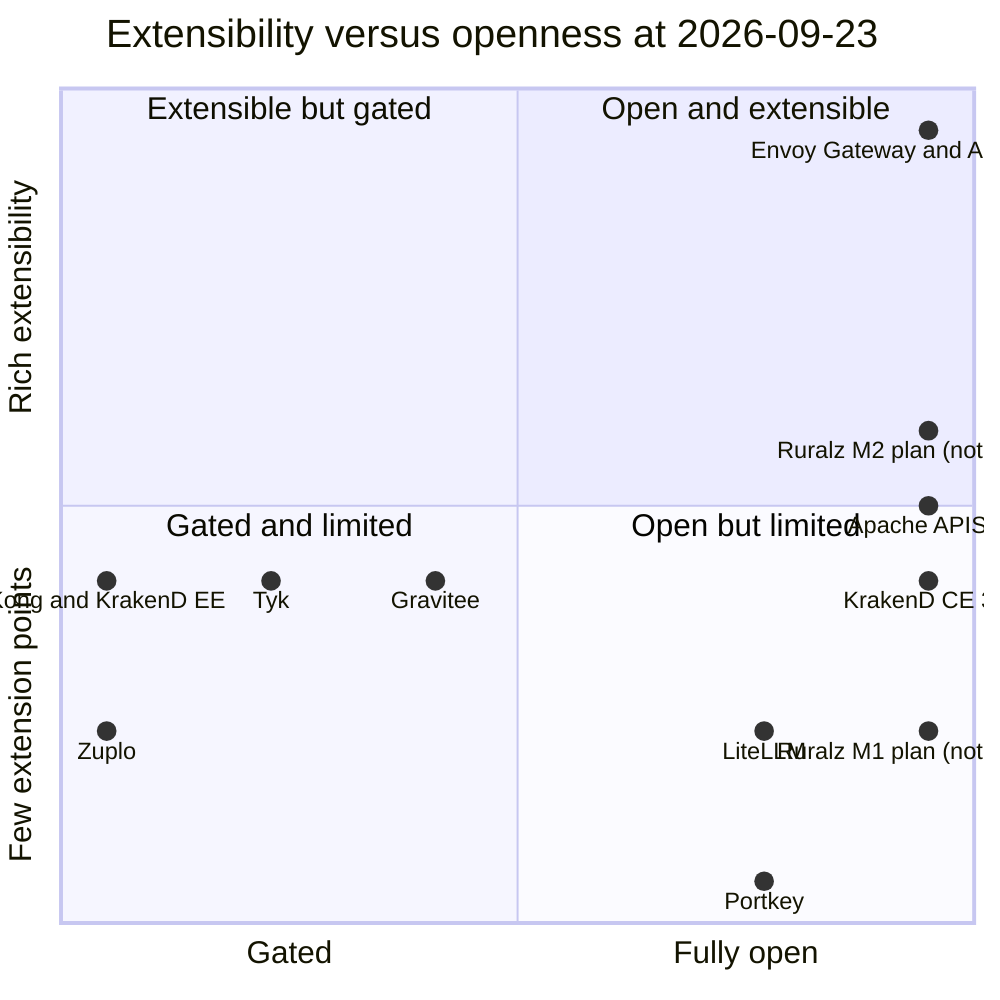

# Market Landscape and Table Stakes

## Summary

This document maps the API and AI gateway market as of 2026-09-23. It profiles nine competitors, lists table stakes, tests the four differentiators, records 2025 to 2026 licensing events and maps each finding to a milestone. It concludes that no license gating (P1) is the strongest positioning advantage, separate from the four differentiators; that built-in control plane + GitOps is the strongest differentiator; that the WASM and AI claims must be framed narrowly; and that the MCP Server surface is undecided, Ruralz Console SSO/SAML lags at `M5`, gRPC waits for `M3` and Gateway API conformance is deferred. Evaluators and architects should read it. Nothing described for Ruralz is implemented.

## Scope and non-goals

In scope: Kong, Tyk, Apache APISIX, Envoy Gateway with Envoy AI Gateway, Zuplo, Gravitee, KrakenD, Portkey and LiteLLM, plus short notes on adjacent products; a table-stakes matrix; a reality check of the four differentiators from the [Vision and positioning](../vision/01-vision-and-positioning.md#the-four-differentiators) document; licensing events from 2025 to 2026; and their consequences for milestones `M0` to `M5`. Terms follow the frozen [foundation pack](../_meta/foundation-pack.md).

Non-goals:

- Row-by-row KrakenD Enterprise Edition (EE) parity, owned by the [KrakenD EE parity matrix](01-krakend-ee-parity-matrix.md).
- Migration mechanics, owned by [Migration from KrakenD](03-migration-from-krakend.md).
- Dates and exit criteria, owned by the [Roadmap and milestones](../roadmap/01-roadmap-and-milestones.md).
- Authoritative Ruralz performance values, owned by [Performance budgets and benchmarking](../architecture/12-performance-budgets-and-benchmarking.md).
- Pricing for Ruralz Cloud, which stays OQ-vision-and-positioning-1.

## Method and snapshot date

The snapshot date is **2026-09-23**: every competitor fact below is stated as of that day, matching the foundation pack. Nothing here was measured by Ruralz.

### Sources

Every competitor, vendor or license claim cites a URL that appears in one of five research files. Each file was compiled from primary sources fetched on 2026-09-23: vendor documentation, release notes, GitHub releases and the GitHub REST API, changelogs and pricing pages. Secondary sources appear only where a research file flags them, and this document repeats the flag.

| Research file | Covers |
|---|---|
| [KrakenD parity](../_meta/research/krakend-parity.md) | KrakenD Community Edition (CE) and EE feature matrix, 153 rows, EE 2.13 |
| [Kong, Tyk and APISIX](../_meta/research/competitors-kong-tyk-apisix.md) | Kong Gateway, Tyk, Apache APISIX and API7 |
| [Envoy, Zuplo and Gravitee](../_meta/research/competitors-envoy-zuplo-gravitee.md) | Envoy Gateway, Agent Router (formerly Envoy AI Gateway), Zuplo, Gravitee, Traefik, NGINX Gateway Fabric, Gateway API conformance |
| [AI gateways](../_meta/research/ai-gateways.md) | Portkey, LiteLLM, Kong AI Gateway, Cloudflare AI Gateway, Helicone, KrakenD AI Gateway, Tyk AI Studio, provider APIs |
| [Licensing landscape](../_meta/research/licensing-landscape.md) | Relicensing events, edition splits, monetization, DCO and trademark models |

### Rules applied

| Rule | How it is applied |
|---|---|
| Selection | The nine competitors cover enterprise-edition gateways (Kong, Tyk, KrakenD), foundation projects (APISIX, Envoy Gateway), open core (Gravitee), SaaS (Zuplo) and AI-only gateways (Portkey, LiteLLM) |
| Editions | "Free" and "Paid" follow the vendor's own edition, license or pricing page, never marketing summaries |
| Absence | "Not found" means the research sources do not document the capability; it is not proof of absence |
| Conflicts | Where sources disagree, both are named: first-party against first-party (Kong free mode, Kong 3.16 date, Tyk 5.15.0 date) and first-party against third-party (Portkey license) |
| Numbers | Vendor performance figures are vendor claims with the vendor URL on the same line; Ruralz figures carry (target) or (hypothesis) |
| Ruralz status | Every Ruralz capability is `Planned (Mx)` or `Not planned` with a reason; where part of its scope is undecided, the cell also names the owning open question |
| Refresh | The cadence is OQ-vision-and-positioning-8, still open; this document proposes a refresh at each milestone exit as one answer to it |

### Matrix legend

| Value | Meaning |
|---|---|
| Free | Available in the free or open-source edition, or on a vendor's $0 plan |
| Paid | Needs a commercial edition, license key, license file or paid plan |
| Partial | Covers part of the row; the cell names the part |
| Documented, edition not stated | The research documents the capability but not which edition, license or pricing plan includes it; cells shorten this to "edition not stated" |
| Experimental | Flagged experimental, beta or pre-release by the vendor |
| Removed | Shipped earlier and removed |
| Not found | Not documented in the research sources |
| N/A | Outside the product's scope, for example protocol rows for AI-only gateways |

## Competitor profiles

Each profile states the current release, the edition split, then what the product sets as a buyer expectation and where Ruralz differs.

### Kong

Kong Gateway Enterprise 3.16.0.0 shipped on 2026-09-15 according to the version-support policy, with 3.10 and 3.14 as long-term support lines ([source](https://developer.konghq.com/gateway/version-support-policy/)); the 3.16 release blog is dated 2026-09-22 ([source](https://konghq.com/blog/product-releases/kong-api-gateway-3-16)), and this document uses 2026-09-15. The `Kong/kong` repository is Apache-2.0 ([source](https://github.com/Kong/kong)), but its releases stop at 3.9.x ([source](https://github.com/Kong/kong/releases)).

- **Edition split:** Kong's 3.10 release-note text, quoted in discussion #14628, says free mode "is no longer available" and that running without a license behaves like an expired license ([source](https://github.com/Kong/kong/discussions/14628)); the breaking-changes page still calls it deprecated ([source](https://developer.konghq.com/gateway/breaking-changes/)). Since 3.15 an expired license makes the Admin API read-only while traffic continues ([source](https://developer.konghq.com/gateway/breaking-changes/)).
- **Extensibility:** Lua PDK plus Go, Python and JavaScript PDKs ([source](https://developer.konghq.com/custom-plugins/)). A proxy-wasm beta arrived in 3.4 ([source](https://konghq.com/blog/product-releases/webassembly-in-kong-gateway-3-4)) and was removed in 3.11.0.0 ([source](https://developer.konghq.com/gateway/breaking-changes/)).
- **AI:** the plugin hub lists 23 AI plugins ([source](https://developer.konghq.com/plugins/?category=ai)). AI load balancing, token rate limiting, the semantic cache and MCP proxying are AI Gateway Enterprise ([source](https://developer.konghq.com/plugins/ai-proxy-advanced/)) ([source](https://developer.konghq.com/plugins/ai-rate-limiting-advanced/)) ([source](https://developer.konghq.com/plugins/ai-semantic-cache/)) ([source](https://developer.konghq.com/plugins/ai-mcp-proxy/)). Kong AI Gateway 2.0 reached GA on 2026-09-01 as a separate product available in Konnect, and AI plugins become opt-in in 3.18 ([source](https://konghq.com/blog/product-releases/kong-ai-gateway-2-0-ga)); the GA post does not state self-hosted licensing.
- **Control plane:** decK is open source ([source](https://github.com/Kong/deck/releases)); Konnect is a commercial SaaS priced per gateway, with RBAC in Plus and SSO and audit logging in Enterprise ([source](https://konghq.com/pricing)).
- **Protocols:** `grpc` and `grpcs` are listed as route protocols, with no edition stated ([source](https://developer.konghq.com/plugins/ai-mcp-proxy/)); the gRPC-Web plugin is in the open-source repository ([source](https://github.com/Kong/kong/tree/master/kong/plugins)); `proxy_listen` has no HTTP/3 flag ([source](https://developer.konghq.com/gateway/configuration/)); Kafka needs the Enterprise `kafka-consume` plugin or the separate Kong Event Gateway ([source](https://developer.konghq.com/plugins/kafka-consume/)) ([source](https://developer.konghq.com/event-gateway/architecture/)).
- **Performance claim:** 144,273.5 RPS at p99 4.5 ms with no plugins on a c5.4xlarge, vendor-measured ([source](https://developer.konghq.com/gateway/performance/benchmarks/)).

Kong sets the bar for AI plugin breadth, but its free path is frozen at 3.9.x. Ruralz plans the same AI categories in one Apache-2.0 build, Planned (M3) ([ADR-0002](../adr/0002-apache-2-license-no-feature-gating.md)).

### Tyk

Tyk Gateway 5.15.0 is current; the release-notes page dates it 2026-09-01 and the overview page 2026-07-07, and 5.13.2 is the long-term support line ([source](https://tyk.io/docs/developer-support/release-notes/gateway)) ([source](https://tyk.io/docs/developer-support/release-notes/overview)).

- **Edition split:** the gateway repository is MPL-2.0 except the commercial `ee` folder ([source](https://github.com/TykTechnologies/tyk)). The Tyk Dashboard and Developer Portal form the commercial platform, and SSO, RBAC and multi-region deployments sit on paid plans ([source](https://tyk.io/pricing/)).
- **Closed tooling:** Tyk Operator and Tyk Sync became closed source in 2024-10 ([source](https://github.com/TykTechnologies/tyk-operator)) ([source](https://github.com/TykTechnologies/tyk-sync)), and Operator 1.0 exits without a license key ([source](https://tyk.io/docs/5.6/product-stack/tyk-operator/release-notes/operator-1.0/)).
- **Extensibility:** Go native plugins are recommended, alongside JavaScript (Goja), Python, Lua and gRPC in any language; the plugin docs mention no WASM ([source](https://tyk.io/docs/api-management/plugins/overview)).
- **AI:** the MCP Gateway ships in the gateway under all licenses since 5.13, while REST-to-MCP conversion is Enterprise ([source](https://tyk.io/docs/ai-management/mcp-gateway/overview)). LLM features live in Tyk AI Studio, AGPL-3.0 for the Community Edition, where the Model Router and budgets are Enterprise ([source](https://github.com/TykTechnologies/ai-studio)) ([source](https://tyk.io/docs/ai-management/ai-studio/core-concepts)); the two pages disagree on the budget edition.
- **Protocols:** GraphQL proxying, Universal Data Graph and Federation v1, with setup documented through the Tyk Dashboard ([source](https://tyk.io/docs/api-management/graphql)); event protocols only through Enterprise Tyk Streams ([source](https://tyk.io/docs/api-management/event-driven-apis)).
- **Rate limiting:** the widest algorithm menu among Kong, Tyk and APISIX: rolling window, sentinel, fixed window, DRL and smoothing ([source](https://tyk.io/docs/tyk-oss-gateway/configuration)).

Tyk is the reference for GraphQL federation and rate-limit choice. Its control plane, Kubernetes operator and config promotion tool are all paid, which is the gap Ruralz Control, Planned (M2), targets.

### Apache APISIX

APISIX 3.18.0 shipped on 2026-08-20, the fourth minor release of 2026 ([source](https://apisix.apache.org/blog/archive/)). It is an Apache Software Foundation top-level project under Apache-2.0, including every AI plugin ([source](https://github.com/apache/apisix)) ([source](https://apisix.apache.org/)).

- **Extensibility:** Lua natively, plugin runners for Java, Go, Python and Node.js, and experimental proxy-wasm where "only a few APIs are implemented" ([source](https://apisix.apache.org/docs/apisix/wasm/)).
- **AI:** multi-provider load balancing with fallback strategies ([source](https://apisix.apache.org/docs/apisix/plugins/ai-proxy-multi/)), token rate limiting ([source](https://apisix.apache.org/docs/apisix/plugins/ai-rate-limiting/)), and in 3.18 a semantic `ai-cache`, Redis-backed distributed token counters and Lakera guardrails ([source](https://apisix.apache.org/blog/2026/08/20/release-apache-apisix-3.18.0/)). MCP support is a deprecated stdio bridge ([source](https://apisix.apache.org/docs/apisix/plugins/mcp-bridge/)), and no budget plugin appears in the changelog ([source](https://raw.githubusercontent.com/apache/apisix/master/CHANGELOG.md)).
- **Control plane:** an embedded web UI has been on by default since 3.13 ([source](https://apisix.apache.org/docs/apisix/dashboard/)), and the Apache-2.0 ADC CLI offers `sync`, `diff`, `dump` and `lint` ([source](https://github.com/api7/adc)). Multi-cluster management, SSO, an immutable audit log and FIPS 140-2 are in the commercial API7 Gateway, licensed per CPU core ([source](https://docs.api7.ai/api7-gateway/enterprise-features/overview)) ([source](https://api7.ai/pricing)).
- **Protocols:** experimental downstream HTTP/3 ([source](https://apisix.apache.org/docs/apisix/http3/)); gRPC, gRPC-Web, WebSocket, MQTT proxying and TCP/UDP ([source](https://github.com/apache/apisix)); Kafka pub-sub over WebSocket with fetch only and no consumer groups ([source](https://apisix.apache.org/docs/apisix/pubsub/kafka/)).
- **Performance claim:** 140,000 QPS on an 8-core AWS server, with no version or date given ([source](https://github.com/apache/apisix)).

APISIX gives AI features away, so Ruralz cannot win on "free AI" against it. Ruralz plans to compete on a free multi-cluster control plane (Ruralz Control, Planned (M2)), production-grade WASM Plugins, Planned (M2), and one Policy model for AI and API traffic, Planned (M3).

### Envoy Gateway with Envoy AI Gateway

Envoy Gateway v1.9.1 shipped on 2026-08-28 under Apache-2.0 ([source](https://github.com/envoyproxy/gateway/releases)) ([source](https://github.com/envoyproxy/gateway)). On 2026-09-09 Envoy AI Gateway became **Agent Router**, a project of the Agentic AI Foundation under the Linux Foundation, still built on Envoy Gateway and still Apache-2.0 ([source](https://theagentrouter.ai/blog/envoy-ai-gateway-is-now-agent-router/)) ([source](https://github.com/theagentrouter/agent-router)).

- **Control plane:** a Kubernetes-native control plane translates Gateway API and Envoy Gateway resources into Envoy configuration ([source](https://gateway.envoyproxy.io/docs/concepts/)); the standalone mode for VMs is labeled "experimental" and not for production ([source](https://gateway.envoyproxy.io/docs/tasks/operations/standalone-deployment-mode/)). The research found no built-in web UI, rollout engine or developer portal.
- **Extensibility:** `EnvoyExtensionPolicy` attaches Wasm, Lua, ExtProc and Dynamic Modules ([source](https://gateway.envoyproxy.io/docs/api/extension_types/)); Dynamic Modules load local shared objects under a `v1alpha1` API ([source](https://gateway.envoyproxy.io/docs/tasks/extensibility/dynamic-modules/)).
- **Rate limiting:** global limits run through the Envoy Ratelimit service, which requires Redis ([source](https://gateway.envoyproxy.io/docs/tasks/traffic/global-rate-limit/)).
- **AI:** Agent Router v1.1.0 (2026-08-21) is current and adds `/tokenize` token counting and failover before the first token ([source](https://github.com/theagentrouter/agent-router/releases/tag/v1.1.0)). v1.0.0 (2026-06-23) put 16 providers behind one OpenAI-compatible API with an MCP gateway, token-aware rate limiting, provider fallback and OpenTelemetry tracing ([source](https://github.com/theagentrouter/agent-router/releases/tag/v1.0.0)). `QuotaPolicy` caps cumulative token cost with a CEL expression and attaches by `targetRefs` ([source](https://theagentrouter.ai/docs/capabilities/traffic/quota-policy/)); usage-based limits charge actual usage after the response completes ([source](https://theagentrouter.ai/docs/capabilities/traffic/usage-based-ratelimiting/)).
- **Kubernetes:** Gateway API v1.6.1 conformance ([source](https://gateway-api.sigs.k8s.io/implementations/)).
- **Performance claim:** Tetrate, which is affiliated with the project, reports about 2 ms of gateway overhead in a Broadcom validation ([source](https://tetrate.io/learn/ai/ai-gateway-benchmarks)).

Envoy Gateway is the strongest open alternative on extensibility and conformance. Its weak spots for Ruralz's audience are operation outside Kubernetes and the lack of a console and rollout engine.

### Zuplo

Zuplo is a proprietary SaaS gateway; only its Zudoku developer portal is open source (MIT, v0.87.0 on 2026-09-15) ([source](https://github.com/zuplo/zudoku)). Plans run from Free at $0 with 100K requests a month, through Builder at $25 a month, to Enterprise from $1,000 a month ([source](https://zuplo.com/pricing)).

- **Extensibility:** "Every policy is just a TypeScript function", shipped through Git ([source](https://zuplo.com/api-management.md)); the runtime is a custom JavaScript engine, not Node.js ([source](https://zuplo.com/docs/programmable-api/node-modules.md)).
- **Rate limiting:** a sliding window enforced globally across edge locations ([source](https://zuplo.com/docs/rate-limiting/how-it-works.md)).
- **AI:** budgets for spend, tokens and requests at gateway, team and app level, each Block or Warn ([source](https://zuplo.com/docs/ai-gateway/usage-limits.md)); routing to four providers through one OpenAI-compatible API, semantic caching and prompt-injection blocking ([source](https://zuplo.com/ai-gateway.md)). The AI Gateway, MCP Gateway and portal are on every plan ([source](https://zuplo.com/pricing)).
- **Deployment:** managed edge, managed dedicated, and self-hosted hybrid, where Zuplo compiles the project and the customer runs the image ([source](https://zuplo.com/docs/self-hosted/overview.md)); self-hosting, SSO, RBAC and audit logs are Enterprise only ([source](https://zuplo.com/pricing)).
- **Protocols:** WebSocket and MCP handlers, but no gRPC handler in the docs index ([source](https://zuplo.com/docs/llms.txt)).
- **Performance claim:** "sub-50ms latency", with no methodology ([source](https://zuplo.com/solutions/scale-and-reliable.md)).

Zuplo sets the developer-experience bar: Git-driven policies, built-in monetization ([source](https://zuplo.com/docs/articles/monetization.md)) and hierarchical AI budgets. Ruralz rejects its model of charging for self-hosting.

### Gravitee

Gravitee APIM's Community Edition is Apache-2.0, with 4.12.20 tagged on 2026-09-21 ([source](https://github.com/gravitee-io/gravitee-api-management)); Enterprise Edition features need a license ([source](https://documentation.gravitee.io/apim/introduction/enterprise-edition.md)). The Gravitee Gamma platform, first released on 2026-06-26, unifies LLM, MCP and A2A traffic and adds a Cedar-syntax authorization language ([source](https://documentation.gravitee.io/gravitee-gamma/platform-management/gamma-release-notes.md)).

- **Edition split:** audit trail, custom roles, enterprise OIDC SSO, GeoIP, SSE, Webhook and WebSocket entrypoints, Kafka and MQTT5 connectors, and the A2A, LLM and MCP proxies are Enterprise only ([source](https://documentation.gravitee.io/apim/introduction/enterprise-edition.md)). The pricing page lists no free plan; API Management starts at $2,500 a month ([source](https://www.gravitee.io/pricing)).
- **Extensibility:** Java plugin policies ([source](https://documentation.gravitee.io/apim/plugins/customization.md)).
- **Events:** the Kafka Gateway speaks the Kafka wire protocol and "is treated like a traditional Kafka broker" by clients ([source](https://documentation.gravitee.io/apim/kafka-gateway.md)), with Kafka-specific policies ([source](https://documentation.gravitee.io/apim/kafka-gateway/create-and-configure-kafka-apis/configure-kafka-apis/policies.md)).
- **AI:** the Token Rate Limit policy defaults to `ASYNC_MODE`, which may overshoot, and exposes explicit block and pass-through strategies ([source](https://documentation.gravitee.io/gravitee-gamma/agent-management/build/llm-proxies/configure-an-llm-proxy/design/add-the-token-rate-limit-policy.md)).
- **Kubernetes:** the Gravitee Kubernetes Operator reports Gateway API v1.6.1 conformance ([source](https://gateway-api.sigs.k8s.io/implementations/)).
- **Performance claim:** 80.8k RPS at p99 9.05 ms on 16 vCPU with API keys, published 2025-03-31 ([source](https://www.gravitee.io/blog/api-event-stream-management-performance-testing)).

Gravitee is the reference for native Kafka mediation and for explicit fail strategies on token limits, but it gates AI and event protocols. Ruralz plans AI traffic, Planned (M3), and event protocols, Planned (M4), without an edition split, but no Kafka wire-protocol gateway (Not planned, OQ-multi-protocol-11).

### KrakenD

KrakenD EE 2.13 was released on 2026-03-12, and the feature matrix of 153 rows marks each feature CE or EE ([source](https://www.krakend.io/features/)) ([source](https://www.krakend.io/blog/krakend-ee-2.13-release-notes/)). KrakenD CE is Apache-2.0 ([source](https://github.com/krakend/krakend-ce)).

- **Edition split:** the AI Gateway, gRPC, SSE, WebSockets, API keys, stateful rate limiting, the Security Policies Engine, OpenAPI tooling, IP filtering, GeoIP and FIPS are EE only ([source](https://www.krakend.io/features/)). EE does not start without a valid license file and shuts down when it expires ([source](https://www.krakend.io/docs/enterprise/overview/license-file/)).
- **Extensibility:** Lua, CEL and Martian in both editions; on 2026-06-04 KrakenD announced that CE 3.0 drops Go plugins while EE keeps them ([source](https://www.krakend.io/blog/dropping-plugins-support-on-community/)), and pull request #1106 merged the change into `dev-3.0` on 2026-09-21 ([source](https://github.com/krakend/krakend-ce/pull/1106)).
- **AI:** introduced in EE 2.10 on 2025-06-04 with token quotas ([source](https://www.krakend.io/blog/krakend-ee-2.10-release-notes/)), extended in 2.11 with the `ai/llm` namespace ([source](https://www.krakend.io/blog/krakend-ee-2.11-release-notes/)) and in 2.12 with an MCP Gateway and MCP Server ([source](https://www.krakend.io/blog/krakend-ee-2.12-release-notes/)). The feature matrix lists the MCP Gateway in both editions and the MCP Server as EE only ([source](https://www.krakend.io/features/)).
- **Missing in both editions:** WASM, a control plane, a console beyond the stateless Designer, GraphQL federation and HTTP/3 ([source](https://www.krakend.io/features/)).

KrakenD is Ruralz's positioning anchor. The [parity matrix](01-krakend-ee-parity-matrix.md) owns every EE row, and `ruralz bundle import krakend` is Planned (M2).

### Portkey

Portkey's gateway is MIT-licensed; its last stable tag is v1.15.2 (2026-01-12), and a `2.0.0` pre-release branch carries version 2.2.3 ([source](https://api.github.com/repos/Portkey-AI/gateway/releases)) ([source](https://api.github.com/repos/Portkey-AI/gateway/license)) ([source](https://github.com/Portkey-AI/gateway/tree/2.0.0)). Tetrate describes the core as Apache 2.0, which conflicts with the repository's MIT file ([source](https://raw.githubusercontent.com/Portkey-AI/gateway/main/LICENSE)) ([source](https://tetrate.io/learn/ai/portkey-palo-alto-acquisition)).

- **Open-sourcing:** on 2026-03-24 Portkey merged its production gateway into the open repository ([source](https://github.com/Portkey-AI/gateway/discussions/1576)), naming usage policies, a model catalog, an MCP registry and OAuth support ([source](https://www.globenewswire.com/news-release/2026/03/24/3261574/0/en/portkey-s-gateway-is-now-fully-open-source-processing-over-1-trillion-tokens-every-day.html)).
- **Features:** the README claims 1,600+ models across 45+ providers, 40+ guardrails and an MCP Gateway; semantic caching is "Available in hosted and enterprise versions" only ([source](https://github.com/Portkey-AI/gateway)).
- **Ownership:** Palo Alto Networks announced the acquisition on 2026-04-30 and closed it on 2026-05-29, making Portkey the AI gateway for Prisma AIRS; neither release mentions open source ([source](https://www.paloaltonetworks.com/company/press/2026/palo-alto-networks-to-acquire-portkey-to-secure-the-rise-of-ai-agents)) ([source](https://www.paloaltonetworks.com/company/press/2026/palo-alto-networks-completes-acquisition-of-portkey-to-secure-ai-agents)).
- **Known issue:** open issue #1579 reports `cache_control` blocks stripped on Vertex AI Anthropic routes ([source](https://github.com/Portkey-AI/gateway/issues/1579)).

Portkey shows both the demand for an open AI gateway and its fragility under a new owner. Ruralz's answer is Apache-2.0 everywhere plus the stewardship question OQ-vision-and-positioning-9.

### LiteLLM

LiteLLM v1.102.1 was the stable release on 2026-09-23 ([source](https://api.github.com/repos/BerriAI/litellm/releases?per_page=5)); stable releases ship weekly and the support policy covers only the latest one ([source](https://docs.litellm.ai/docs/proxy/release_cycle)). The code is MIT except the `enterprise/` directory ([source](https://github.com/BerriAI/litellm/blob/main/LICENSE)).

- **Budgets and keys:** virtual keys need PostgreSQL; `max_budget` in USD, `tpm_limit` and `rpm_limit` apply per key, user or team ([source](https://docs.litellm.ai/docs/proxy/virtual_keys)), with spend written after each call ([source](https://docs.litellm.ai/docs/proxy/cost_tracking)).
- **Reliability:** separate fallback classes for general errors, context-window overflow and content-policy refusals ([source](https://docs.litellm.ai/docs/proxy/reliability)).
- **Caching:** exact caches on Redis, S3, GCS or disk, and semantic caches on Redis, Valkey or Qdrant ([source](https://docs.litellm.ai/docs/proxy/caching)).
- **Agents:** MCP over Streamable HTTP, SSE and stdio ([source](https://docs.litellm.ai/docs/mcp)), and an A2A Agent Gateway since v1.80.8 ([source](https://docs.litellm.ai/docs/a2a)) ([source](https://docs.litellm.ai/release_notes/v1.80.8-stable/v1-80-8)).
- **Edition split:** SSO, audit logs and RBAC are enterprise features ([source](https://docs.litellm.ai/docs/enterprise)), as is per-key guardrail control ([source](https://docs.litellm.ai/docs/proxy/guardrails/quick_start)).
- **Known issue:** open issue #41424 reports `cache_control` dropped on the Anthropic-to-Responses bridge, so users pay cache writes and get no reads ([source](https://github.com/BerriAI/litellm/issues/41424)).
- **Competitor claim:** a Kong benchmark reports Kong at 859% higher throughput than LiteLLM 1.63.7 ([source](https://konghq.com/blog/engineering/ai-gateway-benchmark-kong-ai-gateway-portkey-litellm)).

LiteLLM sets the AI feature checklist (budgets, fallbacks, semantic cache, MCP, A2A) but is not an API gateway. Ruralz plans to govern the same traffic under the `Policy` model it uses for every Route, Planned (M3).

### Adjacent products

These products shape expectations but are outside the nine profiles.

| Product | Relevant facts |
|---|---|
| Traefik Proxy and Hub | Proxy is MIT ([source](https://github.com/traefik/traefik)); its plugin catalog documents Yaegi-interpreted Go plugins, and WASM support was not confirmed (research gap) ([source](https://plugins.traefik.io/install)); the central control plane, AI Gateway add-on and FIPS are paid in Hub ([source](https://traefik.io/pricing)) |
| NGINX Gateway Fabric | Apache-2.0 ([source](https://github.com/nginx/nginx-gateway-fabric)), Gateway API v1.6.1, and F5 AI Guardrails through a `PayloadProcessor` resource in v2.7.0 ([source](https://github.com/nginx/nginx-gateway-fabric/blob/v2.7.0/CHANGELOG.md)) ([source](https://github.com/nginx/nginx-gateway-fabric/pull/5697)) |
| Cloudflare AI Gateway | Proprietary SaaS with dollar spend limits since 2026-06-05; semantic caching is planned, not available ([source](https://developers.cloudflare.com/ai-gateway/changelog/)) ([source](https://developers.cloudflare.com/ai-gateway/features/caching/)) |
| Helicone | In maintenance mode since joining Mintlify ([source](https://www.helicone.ai/blog/joining-mintlify)) ([source](https://github.com/Helicone/helicone)) |
| AISIX (API7) | Apache-2.0 Rust AI gateway; budgets and spend caps only in commercial AISIX Cloud ([source](https://github.com/api7/aisix)) ([source](https://api7.ai/pricing)) |

## Table-stakes matrix

A table stake is a capability whose absence removes a gateway from an evaluation. The first table covers API gateway rows for the seven API gateways; the second covers AI gateway rows and adds Portkey and LiteLLM. The Ruralz column shows milestone tags or `Not planned`, plus the owning open question where part of the scope is undecided. Kong "Free" cells apply only to the Apache-2.0 3.9.x line, because unlicensed 3.10+ behaves as an expired license ([source](https://github.com/Kong/kong/discussions/14628)).

### API gateway rows

| Capability | Kong | Tyk | APISIX | Envoy Gateway | Zuplo | Gravitee | KrakenD | Ruralz | Sources |
|---|---|---|---|---|---|---|---|---|---|
| Distributed rate limiting | Free fixed window; sliding window Paid | Free (Redis) | Free (Redis) | Free (Redis) | Global sliding window; plan not stated | Free policy; store edition not stated | Local Free; Redis-backed Paid | Planned (M1) | Kong ([source](https://developer.konghq.com/plugins/rate-limiting-advanced/)); Tyk ([source](https://tyk.io/docs/tyk-oss-gateway/configuration)); APISIX ([source](https://apisix.apache.org/docs/apisix/plugins/limit-count/)); Envoy ([source](https://gateway.envoyproxy.io/docs/tasks/traffic/global-rate-limit/)); Zuplo ([source](https://zuplo.com/docs/rate-limiting/how-it-works.md)); Gravitee ([source](https://documentation.gravitee.io/apim/release-information/release-notes/apim-4.12)); KrakenD ([source](https://www.krakend.io/features/)) |
| OpenTelemetry | Free (plugin in the open-source repo) | Free (traces 5.2, metrics 5.13) | Partial: traces only | Not found | Not found; AI trace export to Galileo and Comet Opik, protocol not stated | Partial: Kafka-native APIs | Free | Planned (M1) | Kong ([source](https://github.com/Kong/kong/tree/master/kong/plugins)); Tyk ([source](https://tyk.io/docs/5.2/product-stack/tyk-gateway/advanced-configurations/distributed-tracing/open-telemetry/open-telemetry-overview/)) ([source](https://tyk.io/docs/developer-support/release-notes/gateway)); APISIX ([source](https://apisix.apache.org/docs/apisix/plugins/opentelemetry/)); Zuplo ([source](https://zuplo.com/ai-gateway.md)); Gravitee ([source](https://documentation.gravitee.io/apim/release-information/release-notes/apim-4.12)); KrakenD ([source](https://www.krakend.io/features/)) |
| gRPC proxying | Route protocol, edition not stated; gRPC-Web plugin in the open-source repo | Free | Free, with transcoding | Free (GRPCRoute) | Not found | Not found | Paid (EE) | Planned (M3) | Kong ([source](https://developer.konghq.com/plugins/ai-mcp-proxy/)) ([source](https://github.com/Kong/kong/tree/master/kong/plugins)); Tyk ([source](https://tyk.io/docs/tyk-oss-gateway/configuration)); APISIX ([source](https://github.com/apache/apisix)); Envoy ([source](https://github.com/envoyproxy/gateway/releases/tag/v1.9.0)); Zuplo ([source](https://zuplo.com/docs/llms.txt)); KrakenD ([source](https://www.krakend.io/features/)) |
| WebSocket and SSE | WebSocket, edition not stated; SSE via Paid Kafka plugin | Free WebSocket; SSE in MCP and Streams | Free WebSocket; SSE replay in `ai-cache` | Not found | WebSocket handler, edition not stated | Paid (EE entrypoints) | Paid (EE) | Planned (M3) | Kong ([source](https://developer.konghq.com/plugins/websocket-validator/)) ([source](https://developer.konghq.com/plugins/kafka-consume/)); Tyk ([source](https://tyk.io/docs/api-management/graphql)) ([source](https://tyk.io/docs/ai-management/mcp-gateway/overview)); APISIX ([source](https://github.com/apache/apisix)) ([source](https://apisix.apache.org/docs/apisix/next/plugins/ai-cache/)); Zuplo ([source](https://zuplo.com/docs/llms.txt)); Gravitee ([source](https://documentation.gravitee.io/apim/introduction/enterprise-edition.md)); KrakenD ([source](https://www.krakend.io/features/)) |
| GraphQL federation | Not found; GraphQL rate limiting Paid | Federation v1, set up in the Tyk Dashboard | Not found; GraphQL limits and cache Free | Not found | Not found; GraphQL policies exist | Not found | Not found; GraphQL proxy Free | Planned (M3), federation 1 and 2 | Kong ([source](https://developer.konghq.com/plugins/graphql-rate-limiting-advanced/)); Tyk ([source](https://tyk.io/docs/api-management/graphql)); APISIX ([source](https://raw.githubusercontent.com/apache/apisix/master/CHANGELOG.md)); Zuplo ([source](https://zuplo.com/docs/llms.txt)); KrakenD ([source](https://www.krakend.io/features/)) |
| HTTP/3 downstream | Not found (no listener flag) | Not found | Experimental | Settings type exists; maturity not stated | Not found | Not found | Not found in either edition | Planned (M3) | Kong ([source](https://developer.konghq.com/gateway/configuration/)) ([source](https://github.com/Kong/kong/discussions/8983)); Tyk ([source](https://tyk.io/docs/tyk-oss-gateway/configuration)); APISIX ([source](https://apisix.apache.org/docs/apisix/http3/)); Envoy ([source](https://gateway.envoyproxy.io/docs/api/extension_types/)); KrakenD ([source](https://www.krakend.io/features/)) |
| Event protocols (Kafka, MQTT, NATS) | Paid (`kafka-consume`, Event Gateway) | Paid (Tyk Streams) | Partial Free: MQTT proxy, Kafka fetch over WebSocket | Not found | Not found | Paid (native Kafka gateway, MQTT5) | Partial Free: async agents and Kafka, NATS, AMQP, Pub/Sub, Service Bus, SNS and SQS connectors; Kafka async agents and advanced Kafka Paid (EE) | Kafka, NATS, MQTT Planned (M4); wire-protocol ingress and AMQP or cloud queues Not planned (OQ-multi-protocol-11, OQ-multi-protocol-14) | Kong ([source](https://developer.konghq.com/plugins/kafka-consume/)) ([source](https://developer.konghq.com/event-gateway/architecture/)); Tyk ([source](https://tyk.io/docs/api-management/event-driven-apis)); APISIX ([source](https://github.com/apache/apisix)) ([source](https://apisix.apache.org/docs/apisix/pubsub/kafka/)); Gravitee ([source](https://documentation.gravitee.io/apim/kafka-gateway.md)) ([source](https://documentation.gravitee.io/apim/introduction/enterprise-edition.md)); KrakenD ([source](https://www.krakend.io/features/)) |
| Declarative config and GitOps CLI | Free (decK) | Paid (Tyk Sync closed source) | Free (ADC) | Free (Kubernetes resources) | Free plan (GitHub only) | Kubernetes Operator, edition not stated | Free (linting, audit, flexible config) | Planned (M1); Rollouts Planned (M2) | Kong ([source](https://github.com/Kong/deck/releases)); Tyk ([source](https://github.com/TykTechnologies/tyk-sync)); APISIX ([source](https://github.com/api7/adc)); Envoy ([source](https://gateway.envoyproxy.io/docs/concepts/)); Zuplo ([source](https://zuplo.com/pricing)); Gravitee ([source](https://gateway-api.sigs.k8s.io/implementations/)); KrakenD ([source](https://www.krakend.io/features/)) |
| Control plane with web console | Paid (Konnect) | Paid (Tyk Dashboard) | Free single-cluster web UI; multi-cluster Paid (API7) | Free, Kubernetes only; no web UI found | Vendor-hosted on every plan | Partial: audit and custom roles Paid | Not found (Designer only) | Planned (M2) | Kong ([source](https://konghq.com/pricing)); Tyk ([source](https://tyk.io/pricing/)); APISIX ([source](https://apisix.apache.org/docs/apisix/dashboard/)) ([source](https://docs.api7.ai/api7-gateway/enterprise-features/overview)); Envoy ([source](https://gateway.envoyproxy.io/docs/concepts/)); Zuplo ([source](https://zuplo.com/docs/self-hosted/overview.md)) ([source](https://zuplo.com/pricing)); Gravitee ([source](https://documentation.gravitee.io/apim/introduction/enterprise-edition.md)); KrakenD ([source](https://www.krakend.io/features/)) |
| Admin SSO, RBAC and audit log | Paid (RBAC in Plus; SSO and audit in Enterprise) | Paid (SSO and RBAC on paid plans) | Paid (API7); open source has two fixed admin roles | Not found | Paid (Enterprise add-ons) | Paid (EE) | N/A (no console) | RBAC and audit log Planned (M2); SSO Planned (M5) | Kong ([source](https://konghq.com/pricing)); Tyk ([source](https://tyk.io/pricing/)); APISIX ([source](https://docs.api7.ai/api7-gateway/enterprise-features/overview)); Zuplo ([source](https://zuplo.com/pricing)); Gravitee ([source](https://documentation.gravitee.io/apim/introduction/enterprise-edition.md)); KrakenD ([source](https://www.krakend.io/features/)) |
| WASM plugins | Removed (3.11) | Not found | Experimental | Free | Not found (TypeScript) | Not found (Java) | Not found in either edition | Planned (M2); proxy-wasm adapter Planned (M4) | Kong ([source](https://developer.konghq.com/gateway/breaking-changes/)); Tyk ([source](https://tyk.io/docs/api-management/plugins/overview)); APISIX ([source](https://apisix.apache.org/docs/apisix/wasm/)); Envoy ([source](https://gateway.envoyproxy.io/docs/api/extension_types/)); Zuplo ([source](https://zuplo.com/api-management.md)); Gravitee ([source](https://documentation.gravitee.io/apim/plugins/customization.md)); KrakenD ([source](https://www.krakend.io/features/)) |
| Gateway API conformance | v1.6.2 (Kong Operator) | Not found | Not found | v1.6.1 | Not found | v1.6.1 (Kubernetes Operator) | Not found | Not planned: deferred by ADR-0016 (proposed) | All ([source](https://gateway-api.sigs.k8s.io/implementations/)) |
| FIPS build | Paid (3.16, FIPS 140-3) | Not found | Paid (API7, FIPS 140-2) | Not found | Not found | Not found | Paid (EE) | Planned (M5) | Kong ([source](https://konghq.com/blog/product-releases/kong-api-gateway-3-16)); APISIX ([source](https://docs.api7.ai/api7-gateway/enterprise-features/overview)); KrakenD ([source](https://www.krakend.io/features/)) |
| All features without a license key | No: unlicensed 3.10+ behaves as expired (the breaking-changes page still says deprecated) | No: `ee` folder and Tyk Dashboard are commercial | Yes; API7 extras Paid | Yes | No: proprietary SaaS | No: EE needs a license | No: EE needs a license file | Planned (M0): no license keys | Kong ([source](https://github.com/Kong/kong/discussions/14628)) ([source](https://developer.konghq.com/gateway/breaking-changes/)); Tyk ([source](https://github.com/TykTechnologies/tyk)); APISIX ([source](https://github.com/apache/apisix)); Envoy ([source](https://github.com/envoyproxy/gateway)); Zuplo ([source](https://zuplo.com/pricing)); Gravitee ([source](https://documentation.gravitee.io/apim/introduction/enterprise-edition.md)); KrakenD ([source](https://www.krakend.io/docs/enterprise/overview/license-file/)) |

### AI gateway rows

| Capability | Kong | Tyk | APISIX | Agent Router | Zuplo | Gravitee | KrakenD | Portkey | LiteLLM | Ruralz | Sources |
|---|---|---|---|---|---|---|---|---|---|---|---|
| OpenAI-compatible façade | Free code in open-source repo; 3.10+ edition not stated | Partial: multi-vendor LLM proxy, Free (AI Studio CE); OpenAI compatibility not stated | Free | Free | Free plan | Paid (LLM Proxy) | Paid (EE) | Free | Free | Planned (M3) | Kong ([source](https://developer.konghq.com/plugins/ai-proxy/)); Tyk ([source](https://github.com/TykTechnologies/ai-studio)); APISIX ([source](https://apisix.apache.org/docs/apisix/plugins/ai-proxy-multi/)); Agent Router ([source](https://github.com/theagentrouter/agent-router/releases/tag/v1.0.0)); Zuplo ([source](https://zuplo.com/ai-gateway.md)) ([source](https://zuplo.com/pricing)); Gravitee ([source](https://documentation.gravitee.io/apim/introduction/enterprise-edition.md)); KrakenD ([source](https://www.krakend.io/docs/enterprise/ai-gateway/llm-routing/)); Portkey ([source](https://github.com/Portkey-AI/gateway)); LiteLLM ([source](https://github.com/BerriAI/litellm/blob/main/LICENSE)) |
| Native provider passthrough | Native formats need 3.10+; edition not stated | Not found | Partial: Anthropic Messages and Bedrock as upstream providers (3.17), Free; client-facing native surface not stated | Partial: Anthropic APIs | Not found | Not found | Paid (no-op passthrough) | Free; open `cache_control` issue | Free; open `cache_control` issue | Planned (M3) | Kong ([source](https://developer.konghq.com/plugins/ai-proxy/)); APISIX ([source](https://raw.githubusercontent.com/apache/apisix/master/CHANGELOG.md)); Agent Router ([source](https://theagentrouter.ai/release-notes/)); KrakenD ([source](https://www.krakend.io/docs/enterprise/ai-gateway/llm-routing/)); Portkey ([source](https://github.com/Portkey-AI/gateway/issues/1579)); LiteLLM ([source](https://github.com/BerriAI/litellm/issues/41424)) |
| Provider fallback and load balancing | Paid | Paid (Model Router); core failover edition not stated | Free | Free | Fallback policy, edition not stated | Not found | Partial: multi-routing, Paid (EE); fallback not found | Not found in research (OQ-market-landscape-and-table-stakes-5) | Free | Planned (M3) | Kong ([source](https://developer.konghq.com/plugins/ai-proxy-advanced/)); Tyk ([source](https://tyk.io/docs/ai-management/ai-studio/core-concepts)) ([source](https://github.com/TykTechnologies/ai-studio/pull/564)); APISIX ([source](https://apisix.apache.org/docs/apisix/plugins/ai-proxy-multi/)); Agent Router ([source](https://theagentrouter.ai/docs/capabilities/traffic/provider-fallback/)); Zuplo ([source](https://zuplo.com/docs/policies/overview)); KrakenD ([source](https://www.krakend.io/features/)); LiteLLM ([source](https://docs.litellm.ai/docs/proxy/reliability)) |
| Token-based limits | Paid | Documented, edition not stated | Free | Free | Free plan | Paid (LLM Proxy) | Paid (EE) | Not found; "usage policies" named without a unit | Free | Planned (M3) | Kong ([source](https://developer.konghq.com/plugins/ai-rate-limiting-advanced/)); Tyk ([source](https://tyk.io/docs/ai-management/ai-studio/overview)); APISIX ([source](https://apisix.apache.org/docs/apisix/plugins/ai-rate-limiting/)); Agent Router ([source](https://theagentrouter.ai/docs/capabilities/traffic/quota-policy/)); Zuplo ([source](https://zuplo.com/docs/ai-gateway/usage-limits.md)) ([source](https://zuplo.com/pricing)); Gravitee ([source](https://documentation.gravitee.io/gravitee-gamma/agent-management/build/llm-proxies/configure-an-llm-proxy/design/add-the-token-rate-limit-policy.md)) ([source](https://documentation.gravitee.io/apim/introduction/enterprise-edition.md)); KrakenD ([source](https://www.krakend.io/docs/enterprise/ai-gateway/budget-control/)); Portkey ([source](https://www.globenewswire.com/news-release/2026/03/24/3261574/0/en/portkey-s-gateway-is-now-fully-open-source-processing-over-1-trillion-tokens-every-day.html)); LiteLLM ([source](https://docs.litellm.ai/docs/proxy/virtual_keys)) |
| Currency spend budgets | Paid (`cost` strategy) | Paid (EE per README) | Not found; AISIX Cloud Paid | Not found | Free plan | Not found | Partial: weighted token quotas, Paid (EE) | Not found | Free (`max_budget`) | Token Budgets Planned (M3); currency unit per OQ-ai-llm-gateway-7; cost reporting through `ruralz ai cost`, Planned (M3) | Kong ([source](https://developer.konghq.com/plugins/ai-rate-limiting-advanced/)); Tyk ([source](https://github.com/TykTechnologies/ai-studio)); APISIX ([source](https://github.com/api7/aisix)); Zuplo ([source](https://zuplo.com/docs/ai-gateway/usage-limits.md)) ([source](https://zuplo.com/pricing)); KrakenD ([source](https://www.krakend.io/docs/enterprise/ai-gateway/budget-control/)); LiteLLM ([source](https://docs.litellm.ai/docs/proxy/virtual_keys)) |
| Semantic cache | Paid | Not found | Free (3.18) | Not found | Available, edition not stated | Not found | Not found | Paid (hosted and enterprise only) | Free | Planned (M3) | Kong ([source](https://developer.konghq.com/plugins/ai-semantic-cache/)); Tyk ([source](https://github.com/TykTechnologies/ai-studio)); APISIX ([source](https://apisix.apache.org/docs/apisix/next/plugins/ai-cache/)); Zuplo ([source](https://zuplo.com/ai-gateway.md)); Portkey ([source](https://github.com/Portkey-AI/gateway)); LiteLLM ([source](https://docs.litellm.ai/docs/proxy/caching)) |
| Guardrails | Many plugins; edition per plugin | Free (CE and EE) | Free | Partial: body redaction | Available (prompt injection, PII masking) | Not found | Paid (AI Security, EE) | Free (40+ guardrails) | Free; per-key control Paid | Planned (M3) | Kong ([source](https://developer.konghq.com/plugins/?category=ai)); Tyk ([source](https://tyk.io/docs/ai-management/ai-studio/core-concepts)); APISIX ([source](https://apisix.apache.org/blog/2026/08/20/release-apache-apisix-3.18.0/)); Agent Router ([source](https://theagentrouter.ai/release-notes/)); Zuplo ([source](https://zuplo.com/ai-gateway.md)); KrakenD ([source](https://www.krakend.io/features/)); Portkey ([source](https://github.com/Portkey-AI/gateway)); LiteLLM ([source](https://docs.litellm.ai/docs/proxy/guardrails/quick_start)) |
| MCP gateway | Paid (3.12+) | Free | Deprecated stdio bridge | Free | Free plan (1K tool calls a month) | Paid (MCP Proxy) | Free (both editions) | Free | Free | Planned (M3): Routes, auth Policies and an `authz.cel` tool allow list, which is no security control until strict JSON covers MCP Routes (OQ-ai-llm-gateway-16); per-session affinity per OQ-ai-llm-gateway-10 | Kong ([source](https://developer.konghq.com/plugins/ai-mcp-proxy/)); Tyk ([source](https://tyk.io/docs/ai-management/mcp-gateway/overview)); APISIX ([source](https://apisix.apache.org/docs/apisix/plugins/mcp-bridge/)); Agent Router ([source](https://github.com/theagentrouter/agent-router/releases/tag/v1.0.0)); Zuplo ([source](https://zuplo.com/pricing)); Gravitee ([source](https://documentation.gravitee.io/apim/introduction/enterprise-edition.md)); KrakenD ([source](https://www.krakend.io/features/)); Portkey ([source](https://www.globenewswire.com/news-release/2026/03/24/3261574/0/en/portkey-s-gateway-is-now-fully-open-source-processing-over-1-trillion-tokens-every-day.html)); LiteLLM ([source](https://docs.litellm.ai/docs/mcp)) |
| MCP Server (tools generated from existing APIs) | Paid (conversion modes, 3.12+) | Paid (REST-to-MCP conversion) | Not found | Not found | MCP server handler, edition not stated | Paid (MCP Tool Server) | Paid (EE) | Not found | Not found | Planned (M3); surface per OQ-ai-llm-gateway-10, which answers OQ-vision-and-positioning-12 | Kong ([source](https://developer.konghq.com/plugins/ai-mcp-proxy/)); Tyk ([source](https://tyk.io/docs/ai-management/mcp-gateway/overview)); Zuplo ([source](https://zuplo.com/docs/llms.txt)); Gravitee ([source](https://documentation.gravitee.io/apim/introduction/enterprise-edition.md)); KrakenD ([source](https://www.krakend.io/features/)) ([source](https://www.krakend.io/blog/krakend-ee-2.12-release-notes/)) |
| A2A proxy | AI A2A Proxy, edition not stated | Not found | Not found; AISIX has one | Not found | Not found | Paid (A2A Proxy) | Not found | Not found | Free | Plain HTTP and SSE Routes, Planned (M3); A2A-aware gateway, Planned (M5) | Kong ([source](https://developer.konghq.com/plugins/?category=ai)); APISIX ([source](https://github.com/api7/aisix)); Agent Router ([source](https://theagentrouter.ai/release-notes/)); Gravitee ([source](https://documentation.gravitee.io/apim/introduction/enterprise-edition.md)); LiteLLM ([source](https://docs.litellm.ai/docs/a2a)) |

### Reading the matrix

- **Free in most columns:** distributed rate limiting (four of the seven API gateway columns confirmed free, Kong for fixed windows only, and six counting Zuplo and Gravitee, whose plan or store edition is not stated) and a declarative GitOps CLI (five of seven), both Planned (M1). Ruralz gains nothing by shipping them and loses evaluations without them.
- **Table stake and parity row at once:** gRPC proxying is free in at most four of the seven API gateway columns (Tyk, APISIX and Envoy Gateway, plus Kong with no stated edition), Not found for Zuplo and Gravitee, and Paid at KrakenD EE. It is Planned (M3), so `M1` and `M2` evaluations that require gRPC will exclude Ruralz (F-14, OQ-market-landscape-and-table-stakes-7).
- **Paid almost everywhere:** admin SSO, RBAC and audit log is paid in five of the seven API gateway columns (Kong, Tyk, APISIX through API7, Zuplo, Gravitee). This is where "fully free" is most visible to buyers.
- **Crowded AI rows:** an OpenAI-compatible façade, token limits and the MCP gateway are free in at least three products each, so Ruralz's AI claim cannot be "free AI gateway" alone.
- **Rare rows:** WASM without a beta or experimental label (Envoy Gateway only; its production maturity is maintainer judgment, see OQ-market-landscape-and-table-stakes-5), GraphQL federation (Tyk only) and HTTP/3 (experimental in APISIX, maturity not stated for Envoy Gateway) are the rows where Ruralz can lead if the milestones land.
- **Gaps in the Ruralz column:** gRPC waits for `M3`; the currency unit for Token Budgets is open (OQ-ai-llm-gateway-7); event protocols exclude Kafka and NATS wire-protocol ingress and AMQP or cloud queues (OQ-multi-protocol-11, OQ-multi-protocol-14); the MCP Server surface is open (OQ-ai-llm-gateway-10), while the MCP gateway and A2A over plain HTTP and SSE Routes are Planned (M3) and the A2A-aware gateway is Planned (M5) ([AI/LLM gateway](../architecture/06-ai-llm-gateway.md#mcp-and-a2a-stance)); and Gateway API conformance is deferred by ADR-0016 (proposed) ([ADR-0016](../adr/0016-kubernetes-helm-and-crds.md)).

## Differentiator reality check

The vision document fixes four differentiators ([Vision and positioning](../vision/01-vision-and-positioning.md#the-four-differentiators)). This section asks, for each, who already ships part of it and what is left for Ruralz to claim.

| # | Differentiator | Who already does part | What is missing or gated | Ruralz plan | Verdict |
|---|---|---|---|---|---|
| 1 | WASM plugin system | proxy-wasm in Kong (beta from 3.4, removed in 3.11.0.0) ([source](https://konghq.com/blog/product-releases/webassembly-in-kong-gateway-3-4)) ([source](https://developer.konghq.com/gateway/breaking-changes/)); proxy-wasm in APISIX, experimental ([source](https://apisix.apache.org/docs/apisix/wasm/)); Wasm in Envoy through `EnvoyExtensionPolicy` ([source](https://gateway.envoyproxy.io/docs/api/extension_types/)) | Envoy Gateway runs outside Kubernetes only in an experimental mode ([source](https://gateway.envoyproxy.io/docs/tasks/operations/standalone-deployment-mode/)); Traefik's plugin catalog documents Yaegi-interpreted Go plugins, and WASM support was not found (research gap, OQ-market-landscape-and-table-stakes-5) ([source](https://plugins.traefik.io/install)); KrakenD has no WASM and moves Go plugins to EE ([source](https://www.krakend.io/blog/dropping-plugins-support-on-community/)) | Plugin ABI v1 with deny-by-default Capabilities, OCI digests and Sigstore signing ([ADR-0005](../adr/0005-plugin-abi-v1.md), [ADR-0017](../adr/0017-artifact-signing.md)), Planned (M2); proxy-wasm adapter Planned (M4). Ruralz-side gap: ABI v1 is custom, so the Plugin ecosystem starts at zero, and existing proxy-wasm filters run only through the adapter | Partly differentiated, subject to the open Traefik check. Claim digest-pinned, Sigstore-signed Plugins with deny-by-default Capabilities in every Phase, including `onChunk`, and no Kubernetes dependency, Planned (M2); not "first WASM gateway", and not a claim that other Go gateways lack WASM |
| 2 | AI/LLM gateway | AI gateways including KrakenD EE 2.10+ ([source](https://www.krakend.io/blog/krakend-ee-2.10-release-notes/)); Kong AI Gateway ([source](https://developer.konghq.com/ai-gateway/)); APISIX AI plugins ([source](https://apisix.apache.org/blog/2026/08/20/release-apache-apisix-3.18.0/)); Agent Router ([source](https://github.com/theagentrouter/agent-router)); Gravitee EE LLM Proxy ([source](https://documentation.gravitee.io/apim/introduction/enterprise-edition.md)); Zuplo ([source](https://zuplo.com/ai-gateway.md)); Portkey ([source](https://github.com/Portkey-AI/gateway)); LiteLLM ([source](https://docs.litellm.ai/docs/proxy/virtual_keys)) | Admission accuracy: Kong reflects cost only on the next request ([source](https://developer.konghq.com/plugins/ai-rate-limiting-advanced/)); Agent Router charges usage-based limits after the response completes ([source](https://theagentrouter.ai/docs/capabilities/traffic/usage-based-ratelimiting/)); LiteLLM writes spend after each call ([source](https://docs.litellm.ai/docs/proxy/cost_tracking)); Gravitee's default `ASYNC_MODE` may overshoot ([source](https://documentation.gravitee.io/gravitee-gamma/agent-management/build/llm-proxies/configure-an-llm-proxy/design/add-the-token-rate-limit-policy.md)); open issues report translating layers dropping `cache_control` ([source](https://github.com/BerriAI/litellm/issues/41424)) ([source](https://github.com/Portkey-AI/gateway/issues/1579)) | `AIProvider`, `AIModel`, Token Budget admission by one atomic reservation of estimated input plus the output cap in `onRequestBody`, before the upstream call (pack section 8.9), façade plus native passthrough ([ADR-0014](../adr/0014-ai-api-surface.md)), Semantic Cache, Planned (M3) | Not differentiated as a category. Differentiated on one Policy model for API and AI traffic; the absence of an edition split is P1, not this differentiator. Reservation-based admission is a potential differentiator if SM-10 is met, contingent on OQ-vision-and-positioning-15 and OQ-configuration-model-8; it trades overshoot for false rejections (see below) |
| 3 | built-in control plane + GitOps | Konnect and Tyk Dashboard control planes, both commercial ([source](https://konghq.com/pricing)) ([source](https://tyk.io/pricing/)); API7 Gateway multi-cluster, commercial ([source](https://docs.api7.ai/api7-gateway/enterprise-features/overview)); Envoy Gateway, free and Kubernetes-native ([source](https://gateway.envoyproxy.io/docs/concepts/)); decK and ADC CLIs ([source](https://github.com/Kong/deck/releases)) ([source](https://github.com/api7/adc)) | Every sampled console that offers SSO or audit is paid; Tyk Sync and Tyk Operator are closed source ([source](https://github.com/TykTechnologies/tyk-sync)) ([source](https://github.com/TykTechnologies/tyk-operator)); KrakenD has no control plane ([source](https://www.krakend.io/features/)) | Ruralz Control and Ruralz Console with Rollouts, RBAC, audit log and Drift detection, self-hosted in or outside Kubernetes, Planned (M2); SSO/SAML Planned (M5) | Strongest differentiator, provided `M2` ships it complete |
| 4 | multi-protocol native | Tyk GraphQL federation (v1) ([source](https://tyk.io/docs/api-management/graphql)) and Gravitee native Kafka, EE only ([source](https://documentation.gravitee.io/apim/kafka-gateway.md)) ([source](https://documentation.gravitee.io/apim/introduction/enterprise-edition.md)); APISIX MQTT proxy and experimental HTTP/3 ([source](https://github.com/apache/apisix)) ([source](https://apisix.apache.org/docs/apisix/http3/)); Kong Event Gateway in Konnect ([source](https://developer.konghq.com/event-gateway/architecture/)); KrakenD CE Kafka, NATS, AMQP and cloud pub/sub connectors ([source](https://www.krakend.io/features/)) | The research found no product documenting GraphQL federation v2, production downstream HTTP/3 and event protocols together in one free build ([source](https://tyk.io/docs/api-management/graphql)) ([source](https://www.krakend.io/features/)) | gRPC, GraphQL with federation 1 and 2 ([ADR-0012](../adr/0012-graphql-engine-graphql-go-tools.md)), WebSocket, SSE and HTTP/3 Planned (M3), with HTTP/3 off in FIPS builds pending OQ-tech-stack-and-libraries-9; Kafka, NATS and MQTT Planned (M4). Ruralz-side gap: no Kafka wire-protocol gateway (Not planned, OQ-multi-protocol-11) and no AMQP or cloud-queue connectors (Not planned in M0 to M5, OQ-multi-protocol-14) ([Multi-protocol](../architecture/07-multi-protocol.md#native-wire-proxy-stance)) | Differentiated on breadth across HTTP/3, gRPC, GraphQL federation and Kafka, NATS and MQTT in one edition; each protocol alone exists elsewhere, and KrakenD CE covers more broker types for free. FIPS-required buyers do not get HTTP/3 |

**The cost of reservation.** Reserving R, estimated input plus the full output cap C, limits overshoot to input-estimate error (hypothesis), but it rejects requests that post-response charging would admit while reservations of C are outstanding, and it holds budget that the response may never use. In the SM-10 scenario of the [Vision and positioning](../vision/01-vision-and-positioning.md#success-metrics) document, 200 streams each reserving about 2,000 + 4,096 tokens need about 1.22M tokens against B = 1,000,000, so only about 164 streams can hold reservations at once (hypothesis). C is the client's `max_tokens` when the client sends one (pack section 8.9), so a low `limits.maxOutputTokens` shrinks R only for requests that omit `max_tokens`, unless OQ-ai-llm-gateway-1 resolves to clamping C (option a, proposed). In the SM-10 scenario every client sends `max_tokens`, so client-side cap discipline and estimate accuracy (OQ-vision-and-positioning-15) decide how many streams fit, and the default `failureMode` is still OQ-configuration-model-8. How APISIX, Zuplo and KrakenD EE admit token requests was not researched (OQ-market-landscape-and-table-stakes-5).

### Extensibility and openness

*Figure 1: competitive positioning by extensibility and openness as of 2026-09-23, scored with the rubric below; Ruralz points are plans, not shipped products.*

Openness reuses the rubric of the vision document's market chart ([Vision and positioning](../vision/01-vision-and-positioning.md#the-market)): 0 for a proprietary or key-gated core, otherwise 1.0 minus 0.2 per category sold only in a paid layer, out of five: control plane, console with SSO or audit, AI, streaming and event protocols, and extensibility. Tyk loses four (control plane, console, AI and streaming), Gravitee three (console, AI and event protocols), LiteLLM one (console) and Portkey one (AI, for semantic caching and governance). Extensibility adds 0.4 for a production WASM sandbox (0.1 if beta or experimental, 0 if removed or absent), 0.2 for out-of-process extensions in any language, 0.2 for in-process scripts or compiled plugins, and 0.2 for an inline expression language. Points sit at 0.05 + 0.9 × score, and scores are maintainer judgment from the cited evidence, not measurement.

Two judgments need flagging. Envoy Gateway earns the full 0.4 because its Wasm support carries no beta or experimental label, but the research does not document its maturity (OQ-market-landscape-and-table-stakes-5). Kong earns no out-of-process credit because the research does not say whether its Go, Python and JavaScript PDKs run out of process; if they do, Kong scores 0.6 and plots at [0.05, 0.59].

| Product | Openness | Extensibility | Evidence for extensibility |
|---|---|---|---|
| Ruralz M1 plan | 1.0 | 0.2 | CEL through `authz.cel`, Planned (M1); no Lua or Go plugins (vision non-goal 3) |
| Ruralz M2 plan | 1.0 | 0.6 | Adds WASM Plugins, Planned (M2); no out-of-process extension point (OQ-market-landscape-and-table-stakes-3) |
| Envoy Gateway and Agent Router | 1.0 | 1.0 | Wasm, ExtProc, Lua and Dynamic Modules ([source](https://gateway.envoyproxy.io/docs/api/extension_types/)); CEL authorization in v1.9.0 ([source](https://github.com/envoyproxy/gateway/releases/tag/v1.9.0)) |
| Apache APISIX | 1.0 | 0.5 | Experimental proxy-wasm ([source](https://apisix.apache.org/docs/apisix/wasm/)); Lua and external plugin runners ([source](https://github.com/apache/apisix)) |
| KrakenD CE 3.0 | 1.0 | 0.4 | Lua and CEL; Go plugins removed ([source](https://www.krakend.io/features/)) ([source](https://www.krakend.io/blog/dropping-plugins-support-on-community/)) |
| KrakenD EE | 0 | 0.4 | Lua, Go plugins and CEL; no WASM ([source](https://www.krakend.io/features/)) |
| Kong | 0 | 0.4 | Lua and other-language PDKs ([source](https://developer.konghq.com/custom-plugins/)); CEL plugin configuration in 3.16 ([source](https://konghq.com/blog/product-releases/kong-api-gateway-3-16)); WASM removed ([source](https://developer.konghq.com/gateway/breaking-changes/)) |
| Tyk | 0.2 | 0.4 | Go, JavaScript, Python and Lua in process; gRPC plugins in any language ([source](https://tyk.io/docs/api-management/plugins/overview)) |
| Gravitee | 0.4 | 0.4 | Java plugin policies ([source](https://documentation.gravitee.io/apim/plugins/customization.md)); Expression Language limits ([source](https://documentation.gravitee.io/gravitee-gamma/agent-management/build/llm-proxies/configure-an-llm-proxy/design/add-the-token-rate-limit-policy.md)) |
| Zuplo | 0 | 0.2 | TypeScript policies ([source](https://zuplo.com/api-management.md)) |
| Portkey | 0.8 | 0 | No extension mechanism documented; semantic caching and governance are hosted or enterprise only ([source](https://github.com/Portkey-AI/gateway)) |
| LiteLLM | 0.8 | 0.2 | Generic guardrail API call-out ([source](https://docs.litellm.ai/docs/proxy/guardrails/quick_start)); SSO, audit and RBAC are enterprise ([source](https://docs.litellm.ai/docs/enterprise)) |

By this rubric Envoy Gateway leads on both axes and the Ruralz M2 plan does not. Ruralz's case against Envoy Gateway therefore rests on self-hosting in or outside Kubernetes with Ruralz Control and Ruralz Console, Planned (M2), and one Policy model for API and AI traffic, Planned (M3), not on the number of extension mechanisms.

## Licensing landscape 2025 to 2026

The table lists licensing, edition and ownership events that change what buyers can run for free. Earlier context, such as the 2023 HashiCorp move to BSL 1.1 ([source](https://www.hashicorp.com/blog/hashicorp-adopts-business-source-license)) and the 2024-10 closing of Tyk Operator ([source](https://github.com/TykTechnologies/tyk-operator)), is in the [Vision and positioning](../vision/01-vision-and-positioning.md) timeline.

| Date | Event | Why it matters for Ruralz | Source |
|---|---|---|---|
| 2025-02-27 | IBM closes its acquisition of HashiCorp, whose products moved to BSL 1.1 in 2023 | Relicensed infrastructure keeps changing hands | ([source](https://techcrunch.com/2025/02/27/ibm-closes-6-4b-hashicorp-acquisition/)) |
| 2025-03-27 | Kong Gateway 3.10 deprecates free mode, quoted elsewhere as "no longer available"; open-source releases stop at 3.9.x | Kong's Enterprise gateway now needs a license beyond 3.9.x | ([source](https://developer.konghq.com/gateway/version-support-policy/)) ([source](https://github.com/Kong/kong/discussions/14628)) ([source](https://developer.konghq.com/gateway/breaking-changes/)) |
| 2025-04-23 | OpenTofu, the BSL-era Terraform fork, enters the CNCF Sandbox | Foundation stewardship is the community's answer to relicensing | ([source](https://www.cncf.io/projects/opentofu/)) |
| 2025-05-01 | Redis 8.0 adds AGPLv3 beside RSALv2 and SSPLv1 | Nodes reach a Redis State Store over the network through the `redis` driver, so the server's license never reaches Ruralz binaries; operators who run Redis 8 choose among RSALv2, SSPLv1 and AGPLv3 terms, and Valkey stays BSD-3-Clause | ([source](https://redis.io/blog/agplv3/)) ([source](https://redis.io/legal/licenses/)) |
| 2025-06-04 | KrakenD EE 2.10 launches the AI Gateway and token quotas as Enterprise only | The positioning anchor puts the whole AI category behind a license | ([source](https://www.krakend.io/blog/krakend-ee-2.10-release-notes/)) |
| 2025-10-21 | Valkey 9.0 reaches GA under BSD-3-Clause | A permissive State Store server remains available | ([source](https://www.linuxfoundation.org/press/valkey-9.0-delivers-performance-and-resiliency-for-real-time-workloads)) ([source](https://www.linuxfoundation.org/press/linux-foundation-launches-open-source-valkey-community)) |
| 2026-03-03 | Helicone joins Mintlify and enters maintenance mode | AI gateway consolidation begins | ([source](https://www.helicone.ai/blog/joining-mintlify)) |
| 2026-03-12 | Tyk AI Studio is open-sourced as an AGPL-3.0 Community Edition that requires the Tyk CLA | Copyleft plus a CLA, where Ruralz uses Apache-2.0 plus a DCO | ([source](https://tyk.io/blog/ai-studio-is-going-open-source-and-why-the-ai-control-plane-must-be-extensible/)) ([source](https://github.com/TykTechnologies/ai-studio)) |
| 2026-03-24 | Portkey merges its production gateway into its MIT repository | An open AI gateway with enterprise-only semantic caching | ([source](https://github.com/Portkey-AI/gateway/discussions/1576)) |
| 2026-05-19 | Valkey 9.1 ships with Valkey Search 1.2 | A BSD-licensed vector search option for the Semantic Cache | ([source](https://www.linuxfoundation.org/press/valkey-enhances-efficiency-security-and-modular-performance-with-9.1-release-and-new-ecosystem-integrations)) ([source](https://github.com/valkey-io/valkey-search)) |
| 2026-05-29 | Palo Alto Networks completes its acquisition of Portkey, announced on 2026-04-30 | Portkey, an MIT-licensed AI gateway, now belongs to a security vendor | ([source](https://www.paloaltonetworks.com/company/press/2026/palo-alto-networks-completes-acquisition-of-portkey-to-secure-ai-agents)) ([source](https://www.paloaltonetworks.com/company/press/2026/palo-alto-networks-to-acquire-portkey-to-secure-the-rise-of-ai-agents)) |
| 2026-06-04 | KrakenD announces that CE 3.0 drops Go plugins while EE keeps them | The free edition loses its compiled extension point | ([source](https://www.krakend.io/blog/dropping-plugins-support-on-community/)) |
| 2026-07-02 | Kong 3.15: an expired license makes the Admin API read-only | License state now changes runtime behavior | ([source](https://developer.konghq.com/gateway/breaking-changes/)) ([source](https://developer.konghq.com/gateway/version-support-policy/)) |
| 2026-09-01 | Kong AI Gateway 2.0 reaches GA as a separate product; AI plugins become opt-in from 3.18 | AI moves toward its own product line, available in commercial Konnect; self-hosted licensing is not stated | ([source](https://konghq.com/blog/product-releases/kong-ai-gateway-2-0-ga)) ([source](https://konghq.com/pricing)) |
| 2026-09-09 | Envoy AI Gateway becomes Agent Router under the Agentic AI Foundation, still Apache-2.0 | Neutral-foundation governance for an open AI gateway | ([source](https://theagentrouter.ai/blog/envoy-ai-gateway-is-now-agent-router/)) ([source](https://www.linuxfoundation.org/press/linux-foundation-announces-the-formation-of-the-agentic-ai-foundation)) |
| 2026-09-11 | EU Cyber Resilience Act reporting starts for manufacturers | Supply-chain obligations for Revington, whose CRA role is OQ-vision-and-positioning-6 (see [Managed cloud](../vision/01-vision-and-positioning.md#managed-cloud)) | ([source](https://digital-strategy.ec.europa.eu/en/policies/cra-reporting)) |
| 2026-09-21 | KrakenD pull request #1106 merges Go plugin removal into `dev-3.0` | The CE 3.0 change is now in code | ([source](https://github.com/krakend/krakend-ce/pull/1106)) |

Four patterns follow from the table:

1. **Extension points and AI move into paid editions.** KrakenD moved Go plugins to EE and launched its AI Gateway as EE-only, and Kong is splitting AI into its own product.
2. **License gates harden.** Kong went from a free mode to read-only on expiry, and KrakenD EE stops without a license file ([source](https://www.krakend.io/docs/enterprise/overview/license-file/)).
3. **Open AI gateways consolidate.** Portkey has a new owner and Helicone is in maintenance, while Agent Router moved to a neutral foundation.
4. **Relicensers choose copyleft, not permissive terms.** Three of the five relicensers in the licensing research, Redis, Elastic and Grafana, settled on AGPLv3, and none returned to a permissive license ([source](https://redis.io/blog/agplv3/)) ([source](https://www.elastic.co/blog/elasticsearch-is-open-source-again)) ([source](https://grafana.com/blog/grafana-loki-tempo-relicensing-to-agplv3/)).

Ruralz's answer is Apache-2.0 for every component with no feature gating ([ADR-0002](../adr/0002-apache-2-license-no-feature-gating.md)). The licensing research corrects an earlier assumption: a DCO does not legally prevent Revington from shipping later releases under different terms, because Apache-2.0 lets any redistributor license Derivative Works differently ([source](https://www.apache.org/licenses/LICENSE-2.0)). The commitment therefore rests on principle P1, ADR-0002 and the stewardship question OQ-vision-and-positioning-9, and evaluators should weigh it that way.

## Implications for milestones

Each finding below maps to the milestone where it changes Ruralz scope or priority. Findings without a URL on the row summarize the matrix row, profile or licensing event named in them, where the sources are cited. Milestone scope and exit criteria stay with the [Roadmap and milestones](../roadmap/01-roadmap-and-milestones.md).

| ID | Finding | Implication for Ruralz | Milestone |
|---|---|---|---|
| F-1 | License gating is the norm: Kong 3.10+, KrakenD EE, Zuplo self-hosting, Gravitee EE and Tyk's `ee` folder (matrix row "All features without a license key") | No license gating (P1) is the primary positioning advantage and is separate from the four differentiators; the license audit behind SM-1 and ADR-0002 MUST exist before feature code. Apache-2.0 rather than the AGPLv3 that relicensers chose (licensing pattern 4) is a deliberate choice recorded in [ADR-0002](../adr/0002-apache-2-license-no-feature-gating.md) | M0 |
| F-2 | Open AI gateways consolidate, and a DCO alone does not bind future licensing (licensing landscape, Portkey and Helicone rows) | Decide the trademark policy and stewardship early (OQ-vision-and-positioning-2, OQ-vision-and-positioning-9) so the "fully free" claim is credible | M0 |
| F-3 | Distributed rate limiting (four of seven confirmed, Kong for fixed windows only, and six counting Zuplo and Gravitee, whose plan or store edition is not stated) and declarative GitOps CLIs (five of seven) are free in most sampled API gateways, and OpenTelemetry is free in Kong, Tyk and KrakenD (matrix rows of the same names) | `ratelimit` on the State Store ([ADR-0008](../adr/0008-rate-limiting-local-bucket-and-gcra.md)), OpenTelemetry, `ruralz bundle validate` and `ruralz bundle diff` are entry requirements, not differentiators | M1 |
| F-4 | KrakenD EE charges for API keys, stateful rate limiting and IP filtering ([source](https://www.krakend.io/features/)) | `auth.api-key`, `ratelimit` and `authz.ip` close the most visible parity rows first | M1 |
| F-5 | The licensing research's 2026 baseline (analysis) expects signed releases and SBOM attestations ([source](https://docs.github.com/en/actions/concepts/security/artifact-attestations)), and CRA reporting began on 2026-09-11 ([source](https://digital-strategy.ec.europa.eu/en/policies/cra-reporting)) | Signed images and SBOMs from `M1` (target), per SM-12 | M1 |
| F-6 | LiteLLM ships stable releases weekly ([source](https://docs.litellm.ai/docs/proxy/release_cycle)), Kong has released quarterly since March 2025 ([source](https://developer.konghq.com/gateway/version-support-policy/)), and APISIX shipped four minor releases in 2026 ([source](https://apisix.apache.org/blog/archive/)) | Proposed answer to OQ-vision-and-positioning-8: refresh this snapshot at every milestone exit, starting with `M1` | M1 |
| F-7 | Vendors publish their own benchmarks, such as Kong at 144,273.5 RPS at p99 4.5 ms, a vendor claim ([source](https://developer.konghq.com/gateway/performance/benchmarks/)), and P10 requires every Ruralz performance figure to be a tagged target or a reproducible benchmark | The reference-scenario benchmark behind SM-4 (gateway-added p99 of 1 ms or less (target)) and SM-5 (p50 of 150 µs or less (target)) runs in CI and publishes results from this repository; owner [Performance budgets and benchmarking](../architecture/12-performance-budgets-and-benchmarking.md) | M1 |
| F-8 | Kong removed its WASM beta, APISIX's is experimental, Envoy Gateway's is Kubernetes-bound, and Traefik WASM is unconfirmed (differentiator row 1) | Ship Plugin ABI v1 with `ruralz plugin init`, `ruralz plugin test` and signing; frame the claim as digest-pinned, signed Plugins with deny-by-default Capabilities and no Kubernetes dependency | M2 |
| F-9 | Every sampled console with SSO or audit is paid (matrix row "Admin SSO, RBAC and audit log") | Ruralz Control and Ruralz Console with RBAC and audit log are the headline of `M2`; SSO at `M5` lags buyers (OQ-market-landscape-and-table-stakes-1) | M2 |
| F-10 | Kong Operator, Envoy Gateway and the Gravitee Kubernetes Operator report Gateway API v1.6.x (matrix row "Gateway API conformance") | Ship the Helm chart and CRDs; conformance stays deferred by ADR-0016 (proposed) ([ADR-0016](../adr/0016-kubernetes-helm-and-crds.md), OQ-vision-and-positioning-4) and is a known evaluation gap | M2 |
| F-11 | Kong, Agent Router and LiteLLM charge tokens after the response, and Gravitee's default `ASYNC_MODE` may overshoot (differentiator row 2); how APISIX, Zuplo and KrakenD EE admit token requests was not researched | Token Budget admission by one atomic reservation of estimated input plus the output cap in `onRequestBody`, before the upstream call (pack section 8.9), with the SM-10 overshoot bound (hypothesis), is a candidate measurable differentiator, contingent on OQ-vision-and-positioning-15 and OQ-configuration-model-8. It trades overshoot for rejections while reservations are outstanding, so resolve OQ-ai-llm-gateway-1 before `M3` design freezes, and AI/LLM gateway guidance on client `max_tokens` and on `limits.maxOutputTokens`, contingent on OQ-ai-llm-gateway-1, belongs in `M3` | M3 |
| F-12 | Open issues show translating proxies dropping `cache_control` (LiteLLM and Portkey profiles) | Native passthrough with Prompt Cache marker preservation in 100% of test cases (target), per SM-11 | M3 |
| F-13 | The MCP gateway is table stakes for AI gateways, MCP Servers are mostly paid, and A2A proxies appear at Kong, LiteLLM and Gravitee EE (matrix rows "MCP gateway", "MCP Server" and "A2A proxy") | Keep the MCP gateway and A2A over plain HTTP and SSE Routes at Planned (M3), and resolve the MCP Server surface (OQ-ai-llm-gateway-10, which answers OQ-vision-and-positioning-12) before `M3` design freezes; the A2A-aware gateway is Planned (M5) ([AI/LLM gateway](../architecture/06-ai-llm-gateway.md#mcp-and-a2a-stance)), and moving it earlier is OQ-market-landscape-and-table-stakes-2 | M3 |
| F-14 | gRPC proxying is free in Tyk, APISIX and Envoy Gateway and listed as a Kong route protocol with no stated edition (matrix row "gRPC proxying") | Known evaluation gap: Ruralz cannot enter gRPC-dependent evaluations before `M3` (OQ-market-landscape-and-table-stakes-7) | M3 |
| F-15 | LiteLLM (`max_budget`) and Zuplo offer currency spend budgets, and Kong's `cost` strategy is paid (matrix row "Currency spend budgets") | Decide OQ-ai-llm-gateway-7 before `M3` design freezes; until then Ruralz offers token budgets plus cost reporting through `ruralz ai cost`, Planned (M3) | M3 |
| F-16 | HTTP/3 is experimental or unverified in the sample, and only Tyk documents GraphQL federation (matrix rows "HTTP/3 downstream" and "GraphQL federation") | HTTP/3 and federation 1 and 2 are genuine leads if they ship on time; HTTP/3 is off in FIPS builds pending OQ-tech-stack-and-libraries-9, so FIPS-required buyers do not get it | M3 |
| F-17 | Event protocols are paid (Tyk Streams, Gravitee, Kong Event Gateway) or partial and free (APISIX MQTT proxy and Kafka fetch; KrakenD CE Kafka, NATS, AMQP and cloud pub/sub connectors, with Kafka async agents and advanced Kafka in EE) (matrix row "Event protocols") | Kafka, NATS and MQTT publish and topic-ingress Routes and the MQTT embedded broker mode, with Policy applicability per the [Multi-protocol](../architecture/07-multi-protocol.md#topic-ingress) Phase mapping (topic ingress rejects `auth`-slot, `quota`, `cors` and `cache` Policies), covering KrakenD's EE Kafka async agents, Planned (M4). Kafka and NATS wire-protocol ingress (Gravitee's model) is Not planned (OQ-multi-protocol-11), and AMQP, Pub/Sub, SQS, SNS and Service Bus connectors are Not planned in `M0` to `M5`, a KrakenD CE gap (OQ-multi-protocol-14) ([Multi-protocol](../architecture/07-multi-protocol.md#native-wire-proxy-stance)) | M4 |
| F-18 | Vendors compare AI gateways with their own benchmarks, such as Kong's comparison with Portkey and LiteLLM ([source](https://konghq.com/blog/engineering/ai-gateway-benchmark-kong-ai-gateway-portkey-litellm)) | The comparative bench suite publishes results next to the cited vendor claims, per P10; owner [Performance budgets and benchmarking](../architecture/12-performance-budgets-and-benchmarking.md) | M4 |
| F-19 | FIPS is paid at KrakenD EE, Kong 3.16, API7 and Traefik Hub (matrix row "FIPS build"; Traefik adjacent row) | A FIPS build with the same license and features, except HTTP/3, which is off in FIPS builds pending OQ-tech-stack-and-libraries-9; the conflict with P1 is OQ-market-landscape-and-table-stakes-8 | M5 |
| F-20 | KrakenD EE sells a Moesif monetization integration ([source](https://www.krakend.io/features/)), Zuplo bills through Stripe ([source](https://zuplo.com/docs/articles/monetization.md)), and Kong 3.16 adds an OpenMeter Entitlement Enforcement plugin, edition not stated ([source](https://konghq.com/blog/product-releases/kong-api-gateway-3-16)) | Monetization hooks, with no billing engine (vision non-goal 2) | M5 |

## Open questions

| ID | Question | Options | Owner | Blocking? |
|---|---|---|---|---|
| OQ-market-landscape-and-table-stakes-1 | Should Ruralz Console SSO move earlier than `M5`, given that every sampled console with SSO charges for it? | Keep Planned (M5); OIDC at `M2` and SAML at `M5`; all of it at `M3` | control-plane-and-gitops | No |
| OQ-market-landscape-and-table-stakes-2 | Should the A2A-aware gateway (agent cards, per-skill authorization, usage attribution), Planned (M5) in the [AI/LLM gateway](../architecture/06-ai-llm-gateway.md#mcp-and-a2a-stance) stance, move earlier, given that Kong, LiteLLM and Gravitee EE ship A2A proxies? A2A over plain HTTP and SSE Routes stays Planned (M3) either way | Keep Planned (M5); move to `M4`; ship A2A-aware features as Plugins first | ai-llm-gateway | No |
| OQ-market-landscape-and-table-stakes-3 | Should Ruralz add an out-of-process extension point beside WASM Plugins and CEL, as Envoy Gateway (ExtProc), Tyk (gRPC) and APISIX (plugin runners) offer? | Not planned; a registered Policy type; a Plugin Host Function | wasm-plugin-system | No |
| OQ-market-landscape-and-table-stakes-4 | Market input to OQ-ai-llm-gateway-7, which owns currency budgets: LiteLLM and Zuplo offer currency spend budgets, so should that question's answer include a currency unit? This row closes when OQ-ai-llm-gateway-7 does | Defer to the options of OQ-ai-llm-gateway-7 | ai-llm-gateway | No |
| OQ-market-landscape-and-table-stakes-5 | Which research gaps must close before this document leaves draft? Kong WebSocket edition; Kong gRPC route edition; Kong `ai-proxy` edition on 3.10+; whether Kong's Go, Python and JavaScript PDKs run out of process; Traefik Proxy WASM support; Envoy Gateway HTTP/3 and Wasm maturity; Envoy Gateway OpenTelemetry; Gravitee Proxy Reactor licensing; the Tyk AI Studio budget edition; Portkey fallback and token limits; Kong AI Gateway 2.0 licensing, self-hosted and in Konnect; how APISIX, Zuplo and KrakenD EE admit token requests | Re-research before review; keep "Not found" with a dated caveat | ruralz-core | Yes, for leaving draft |
| OQ-market-landscape-and-table-stakes-6 | Both positioning charts score vendors that ship separately licensed distributions per distribution (KrakenD CE and EE; APISIX and API7 in the vision document) and score one product with a paid layer as one open-core product with deductions (Tyk, Gravitee). Should every vendor be scored the same way? | Keep the current split rule; per distribution for every vendor in both documents; one product per vendor in both documents | vision-and-positioning | No |
| OQ-market-landscape-and-table-stakes-7 | gRPC proxying is Planned (M3), so `M1` and `M2` evaluations that require gRPC exclude Ruralz. Should part of it arrive earlier? | Keep Planned (M3); earlier gRPC passthrough over HTTP/2, with gRPC-aware Policies at `M3` | multi-protocol | No |
| OQ-market-landscape-and-table-stakes-8 | Foundation amendment: pack section 1, P1 and vision product non-goal 8 promise one feature set in every public build, including the FIPS build, while pack section 8.4 turns HTTP/3 off in FIPS builds (OQ-tech-stack-and-libraries-9). Which rule wins? | Amend the pack, P1 and non-goal 8 to exempt HTTP/3 from the FIPS build; ship HTTP/3 in the FIPS build with a caveat (OQ-tech-stack-and-libraries-9 option b) | ruralz-core | Yes, for the FIPS build |
