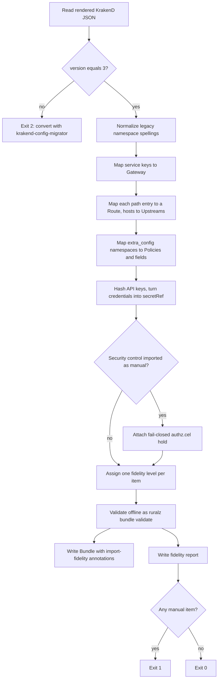
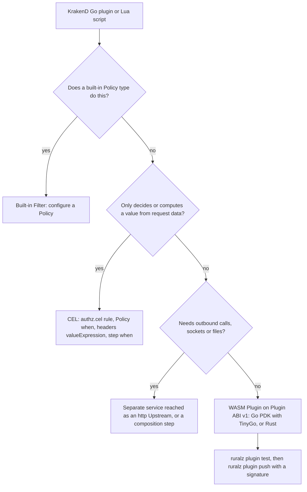
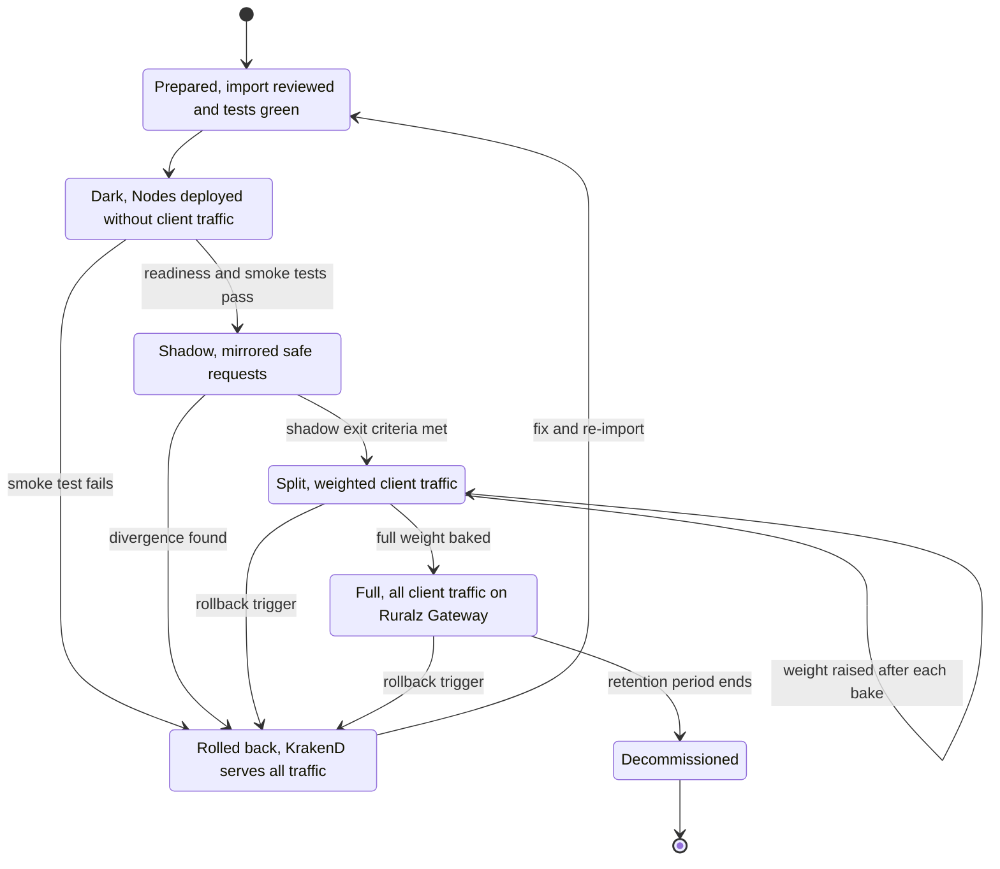

# Migration from KrakenD

## Summary

This is the migration guide from KrakenD Community Edition (CE) and Enterprise Edition (EE) to Ruralz. It maps every top-level KrakenD configuration key and every `extra_config` namespace of the v2.13 schema to Ruralz kinds, fields and Policy types. It defines the four fidelity levels that `ruralz bundle import krakend`, Planned (M2), reports and what each guarantees, sets the two plugin migration paths, gives an ordered cutover runbook with shadow traffic, side-by-side cutover and rollback, and lists the gaps. Evaluators use it to size a migration; operators use it to run one. Nothing is implemented yet.

## Scope and non-goals

In scope: KrakenD CE v2.13.11 ([source](https://github.com/krakend/krakend-ce/releases)) and KrakenD EE 2.13 ([source](https://www.krakend.io/blog/krakend-ee-2.13-release-notes/)) configurations as of the 2026-09-23 snapshot, described by the v2.13 JSON Schema ([source](https://www.krakend.io/schema/v2.13/krakend.json)); the concept and key mapping; the design of `ruralz bundle import krakend` (input, naming, fidelity report, exit status); porting Go plugins and Lua; the cutover runbook; and migration gaps. The [Configuration model](../architecture/02-configuration-model.md#coming-from-krakend) fixes the core mapping and delegates level definitions and the full mapping to this document. Every Ruralz capability named here is a design with a `Planned (Mx)` tag; nothing is implemented, and every statement about what the importer "emits" or a Node "does" describes the planned behavior.

Non-goals:

- **Parity decisions.** Whether and when Ruralz offers a KrakenD feature is owned by the [KrakenD EE parity matrix](01-krakend-ee-parity-matrix.md); this document follows its Ruralz status column and never changes a row.
- **Field design.** Kinds, fields and Policy types belong to the [Configuration model](../architecture/02-configuration-model.md#kind-catalog). Where a KrakenD setting needs a field that does not exist, the mapping says so and an Open question proposes it; no field is invented here.
- **Pre-2.0 KrakenD configurations.** Configurations older than syntax version 3 are first converted with KrakenD's own `krakend-config-migrator` ([source](https://www.krakend.io/docs/configuration/migrating/)).
- **KrakenD CE 3.0 beyond Go plugin removal.** CE 3.0 had no release tag at the snapshot, and the research did not investigate other configuration changes on its branch ([source](https://github.com/krakend/krakend-ce/pull/1106)).
- **Performance comparisons.** KrakenD's published benchmarks use the pre-2.0 `"version": 1` format ([source](https://www.krakend.io/docs/benchmarks/local/)); comparative numbers wait for the [Performance budgets and benchmarking](../architecture/12-performance-budgets-and-benchmarking.md) bench suite, Planned (M4).
- **Commercial migration help.** Migration assistance is a commercial support offering whose importer stays free ([parity matrix](01-krakend-ee-parity-matrix.md#enterprise-support-and-services)).

KrakenD vocabulary appears verbatim where it names KrakenD objects: a KrakenD "endpoint" is a Ruralz `Route` and a KrakenD "backend" is a Ruralz `Upstream` plus, when a request fans out, a composition step. Lines that quote those KrakenD terms carry the alias escape comment. <!-- alias-ok -->

*Figure 1: the migration path from a KrakenD configuration to a decommissioned KrakenD, with the rollback edge back to KrakenD.*

```mermaid
flowchart LR
    kd["KrakenD configuration rendered to JSON"] --> imp["ruralz bundle import krakend"]
    imp --> b["Bundle: Gateway, Route, Upstream, Policy, Consumer"]
    imp --> rep["Fidelity report"]
    rep --> fix["Resolve manual items, review approximate items"]
    fix --> b
    b --> val["ruralz bundle validate and ruralz bundle audit"]
    val --> tst["ruralz test run against KrakenD and Ruralz Gateway"]
    tst --> dark["Ruralz Gateway Nodes deployed dark"]
    dark --> sh["Shadow traffic"]
    sh --> cut["Side-by-side cutover by weight"]
    cut --> done["KrakenD decommissioned"]
    sh -.->|"rollback"| kdl["KrakenD serves all traffic"]
    cut -.->|"rollback"| kdl
```



## Concept mapping

A KrakenD configuration is one file with a service object at the root, an `endpoints` array, one or more backends per endpoint, and `extra_config` namespaces at service, endpoint, backend, workflow and async-agent scope ([source](https://www.krakend.io/schema/v2.13/krakend.json)). A Ruralz Bundle is a directory of resources: one `Gateway`, one `Route` per published path and method, named `Upstream` resources, and named `Policy` resources attached by reference ([Configuration model](../architecture/02-configuration-model.md#resource-model)). A `Policy` is configuration; a built-in Filter or a WASM Plugin implements it. <!-- alias-ok -->

### Core concepts

| KrakenD concept | Ruralz concept | Planned | Notes |
|---|---|---|---|
| Service (root object of the file) | `Gateway` in `ruralz.yaml` | Planned (M1) | Exactly one per Bundle (RZ-CFG-016) |
| One configuration file | Bundle directory rendered into a Revision per Environment | Planned (M1) | Content-addressed, verified by digest ([ADR-0003](../adr/0003-configuration-format.md)) |
| endpoint (a published path and method) | `Route` with `match.path` and `match.methods` | Planned (M1) | One Route per endpoint entry <!-- alias-ok --> |
| backend | `Upstream` for the target service, plus a composition step when the Route fans out or rewrites | Planned (M1) | Upstreams are named and shared across Routes <!-- alias-ok --> |
| `host` list of a backend | `Upstream.spec.endpoints[].address` | Planned (M1) | A Ruralz Endpoint is an address, never a published path <!-- alias-ok --> |
| `extra_config` namespace | A `Policy` of one registered `type`, or a field of `Gateway`, `Route` or `Upstream` | Planned (M1) to Planned (M5) | Mapping per namespace below |
| Aggregation of several backends | `Route` `composition.mode: aggregate` | Planned (M1) | Steps merge under `group` <!-- alias-ok --> |
| Sequential proxy | `composition.mode: sequential` | Planned (M1) | Earlier results reach later steps through CEL `steps` |
| `group`, `target`, `allow`, `mapping`, `is_collection` | Step `group`, `target`, `select`, `rename`, `collection` | Planned (M1) | Same shape ([source](https://www.krakend.io/docs/backends/data-manipulation/)) |
| Workflow | `composition.mode: sequential` with step `when` | Planned (M1) | Linear workflows only ([parity matrix](01-krakend-ee-parity-matrix.md#request-and-response-transformation)) |
| Flexible Configuration templates | `overlays/<env>/` and `${VAR}` substitution per `Environment` | Planned (M1) | No template language; the importer reads the rendered file |
| `KRAKEND_<KEY>` environment overrides | `${VAR}` at render time, or `secretRef` with `provider: env` at runtime | Planned (M1) | Overrides apply only to keys already in the file ([source](https://www.krakend.io/docs/configuration/environment-vars/)) |
| Restart or blue/green deploy to change configuration | Hot Reload of a new Revision; Rollouts in Control mode | Planned (M1); Rollouts Planned (M2) | KrakenD needs a restart per change ([source](https://www.krakend.io/docs/deploying/)) |
| Several KrakenD nodes with the same file | A `Cluster` of Nodes sharing one Revision | Planned (M1) file mode; Planned (M2) Control mode | KrakenD nodes share only the file ([source](https://www.krakend.io/docs/deploying/clustering/)) |
| Go plugins (`.so`) | WASM `Plugin` attached by a `plugin` Policy, or a built-in Filter | Planned (M2) | [Plugin migration](#plugin-migration) |
| Lua scripts | CEL fields or a WASM `Plugin` | Planned (M1) CEL; Planned (M2) Plugins | No Lua runtime ([ADR-0011](../adr/0011-expressions-and-authorization-engines.md)) |
| CEL in `validation/cel` and `security/policies` | `authz.cel` `config.rule`, `Policy.spec.when`, step `when` | Planned (M1) | cel-go, cost-checked at validation |
| API keys listed in the file | One `Consumer` per key with a hashed `credentials.apiKeys` entry and an `auth.api-key` Policy | Planned (M1) | Keys are stored hashed, never plain |
| Tier header in rate limits and quotas | `Consumer.spec.tier` read by `Policy.spec.when`, or a CEL `when` over `request.headers` | Planned (M1) | [Namespace table](#extra_config-namespaces) |
| Named Redis connection pools | Gateway `stateStore` (`driver: redis`) | Planned (M1) | One State Store per Cell |
| Quota processors | `quota` Policy against `Consumer` `quotas`; `ai.token-budget` for tokens | Planned (M1); tokens Planned (M3) | Weighted costs are partial parity |
| Async agents | `Route` `match.topic` with a `kafka`, `nats` or `mqtt` `Upstream` | Planned (M4) | Ingress declaration per OQ-configuration-model-11 |
| `/__health/` on the service port | `/healthz` and `/readyz` on the `ruralzd` admin port | Planned (M1) | Load balancer checks move to the admin port |
| `/__stats/` and extended metrics | `/metrics` on the admin port and OTLP export | Planned (M1) | Metric names `ruralz_<component>_<name>_<unit>` |
| `/__debug/` and `/__echo/` | `ruralz dev tap` over `/tap` on the admin port | Planned (M1) | Redacted traffic metadata |
| `/__catchall` | A lowest-ranked `Route` matching only `match.when: "true"` | Planned (M1) | [Traffic management](../architecture/09-traffic-management-and-resilience.md#krakend-ee-routing-and-traffic-features) |
| EE license file | None: no license key, file or entitlement check | Planned (M1) | KrakenD EE will not start without one ([source](https://www.krakend.io/docs/enterprise/overview/license-file/)); P1, [ADR-0002](../adr/0002-apache-2-license-no-feature-gating.md) |

### Top-level keys

The v2.13 schema has 36 root properties, of which only `version` is required ([source](https://www.krakend.io/schema/v2.13/krakend.json)). Every one maps as follows; the Fidelity column uses the levels defined in [Import tool fidelity levels](#import-tool-fidelity-levels).

| KrakenD key | Ruralz target | Fidelity | Notes |
|---|---|---|---|
| `version` | Checked, not emitted | `exact` | Must be `3`; any other value exits 2 and names `krakend-config-migrator` ([source](https://www.krakend.io/docs/configuration/migrating/)) |
| `name` | `Gateway` `metadata.name`, converted to an RFC 1123 label | `approximate` | KrakenD uses it in telemetry; a Ruralz telemetry service name has no field (OQ-migration-from-krakend-4) |
| `port` | `Gateway` `listeners[]` entry with `protocol: http` (or `https` when `tls` is enabled) and `port` | `exact` | Default `8080` in both products |
| `listen_ip` | None | `manual` | No listener bind-address field (OQ-migration-from-krakend-2) |
| `timeout` | `Route` `timeout` on every Route that does not override it | `equivalent` | KrakenD's timeout covers the whole pipe including all backends, like the Ruralz whole-request deadline <!-- alias-ok --> |
| `cache_ttl` | Route-scoped `headers` Policy with `response.set[]` writing `cache-control: public, max-age=<seconds>` | `approximate` | KrakenD only sets the header and caches nothing because of it ([source](https://www.krakend.io/schema/v2.13/krakend.json)); the Policy writes it on every response of the Route |
| `output_encoding` | Default for every Route without its own value | Per value, see [Endpoint objects and their targets](#endpoint-objects-and-their-targets) | `json` and `no-op` import; other encodings per OQ-krakend-ee-parity-matrix-2 <!-- alias-ok --> |
| `host` | `Upstream.spec.endpoints[]` for every backend without its own `host` | `equivalent` | A scheme of `https` needs an Upstream TLS block (OQ-migration-from-krakend-5) <!-- alias-ok --> |
| `endpoints` | One `Route` per entry | Per entry | [Endpoint objects and their targets](#endpoint-objects-and-their-targets) <!-- alias-ok --> |
| `extra_config` | Gateway-scoped Policies and `Gateway` fields | Per namespace | [extra_config namespaces](#extra_config-namespaces) |
| `async_agent` | `Route` `match.topic` with a `kafka` Upstream, Planned (M4) | `manual` | Ingress declaration per OQ-configuration-model-11; the AMQP driver is Not planned |
| `tls` | `Gateway` `listeners[]` entry with `protocol: https`, `tls.minVersion` and `tls.certificates` (`secretRef` with `provider: file` for each key pair path) | `equivalent`; `approximate` when `max_version`, `cipher_suites`, `curve_preferences` or `disable_system_ca_pool` differ from Ruralz defaults | `enable_mtls` with `ca_certs` becomes a Gateway `auth.mtls` Policy, whose fields are pending (OQ-security-and-identity-3), so it imports `manual` with a hold ([rules](#rules-that-hold-at-every-level)) |
| `client_tls` | `Upstream.spec.tls` (`caCertificate`, `clientCertificate`, `clientKey`) on every generated Upstream | `approximate` | Per-Upstream in Ruralz; cipher and version settings have no Upstream field |
| `plugin` | None; each loaded plugin becomes a report item | `manual` | [Plugin migration](#plugin-migration) |
| `debug_endpoint` | None; use `ruralz dev tap` | `manual` | `/__debug/` is not recreated <!-- alias-ok --> |
| `echo_endpoint` | None; use `ruralz dev tap` | `manual` | `/__echo/` is not recreated <!-- alias-ok --> |
| `disable_rest` | `match.path` with `exact`, `prefix`, `template` or `regex` | `equivalent` | Ruralz path matching has no RESTful-only restriction |
| `sequential_start` | None | `approximate` | Only orders async agent registration; no Ruralz counterpart is needed |
| `use_h2c` | None | `manual` | No listener field enables h2c (OQ-migration-from-krakend-2) |
| `dns_cache_ttl` | `Upstream` `discovery.type: dns` | `approximate` | No DNS refresh field; Data plane defaults apply |
| `max_header_bytes` | `Gateway` `limits.maxRequestHeaderBytes` | `exact` | The importer writes KrakenD's value, default `1000000`, explicitly |
| `max_shutdown_wait_time` | None in the Bundle | `manual` | The Drain bound is process-level ([Zero-downtime upgrades and hot reload](../operations/02-zero-downtime-upgrades-and-hot-reload.md)) |
| `read_timeout`, `read_header_timeout`, `write_timeout`, `idle_timeout` | None | `manual` | No listener timeout fields (OQ-migration-from-krakend-2) |
| `dialer_timeout`, `dialer_keep_alive`, `dialer_fallback_delay` | None | `approximate` | Connection tuning has no Upstream fields (OQ-migration-from-krakend-3) |
| `idle_connection_timeout`, `response_header_timeout`, `expect_continue_timeout` | None; `Upstream` `timeout` and `retries.perTryTimeout` bound attempts | `approximate` | OQ-migration-from-krakend-3 |
| `max_idle_connections`, `max_idle_connections_per_host` | None; `circuitBreaker.maxConnections` caps connections | `approximate` | OQ-migration-from-krakend-3 |
| `disable_keep_alives`, `disable_compression` | None | `approximate` | OQ-migration-from-krakend-3 |

### Endpoint objects and their targets

An endpoint entry requires `endpoint` and `backend`; a backend requires only `url_pattern` ([source](https://www.krakend.io/schema/v2.13/krakend.json)). The importer emits one `Route` per endpoint entry and one `Upstream` per distinct combination of host list, service discovery settings, TLS and backend-scope namespaces, so backends that share a host share an Upstream. <!-- alias-ok -->

| KrakenD field | Ruralz target | Fidelity | Notes |
|---|---|---|---|
| endpoint `endpoint` | `match.path.template` when the path holds `{placeholders}`, else `match.path.exact` | `exact` | Case-sensitive in KrakenD ([source](https://www.krakend.io/schema/v2.13/krakend.json)); Ruralz matching rules belong to [Data plane](../architecture/03-data-plane.md) <!-- alias-ok --> |
| endpoint `method` | `match.methods: [<method>]` | `exact` | One method per entry, default `GET` ([source](https://www.krakend.io/docs/endpoints/)) <!-- alias-ok --> |
| endpoint `output_encoding: no-op` | `Route` with plain `upstreams`; bytes stream unchanged | `exact` | Proxy-only in KrakenD <!-- alias-ok --> |
| endpoint `output_encoding: json` or `fast-json` | Plain `upstreams` for one backend without manipulation; `composition.mode: aggregate` otherwise | `equivalent` | JSON key order and whitespace may differ <!-- alias-ok --> |
| endpoint `output_encoding: json-collection` | `composition.mode: aggregate` with step `collection: true` | `approximate` | Array framing follows the Ruralz merge <!-- alias-ok --> |
| endpoint `output_encoding` `xml`, `yaml`, `negotiate`, `string` | None | `manual` | No re-encoding (OQ-krakend-ee-parity-matrix-2) <!-- alias-ok --> |
| endpoint `concurrent_calls` above 1 | None; hedging on the Upstream leg, Planned (M4) | `approximate` | Ruralz sends one request per leg (partial parity) <!-- alias-ok --> |
| endpoint `timeout` | `Route` `timeout` | `equivalent` | Whole-request deadline <!-- alias-ok --> |
| endpoint `cache_ttl` | Route-scoped `headers` Policy, as the root key | `approximate` | A zero value uses the root value in KrakenD, and the importer resolves it <!-- alias-ok --> |
| endpoint `input_headers`, `input_query_strings` | None yet; allowlist per OQ-krakend-ee-parity-matrix-5 | `manual`, security-flagged | KrakenD forwards nothing by default; Ruralz forwards client headers and query strings unless a Policy removes them (OQ-migration-from-krakend-7) <!-- alias-ok --> |
| endpoint `backend` | `upstreams` or `composition.steps` | Per backend | See the backend rows <!-- alias-ok --> |
| endpoint `extra_config` | Route-scoped Policies | Per namespace | Same slots as Gateway Policies, so a Route `cors` Policy replaces the Gateway one <!-- alias-ok --> |
| backend `url_pattern` equal to the endpoint path | Plain `upstreams` | `exact` | No rewrite needed <!-- alias-ok --> |
| backend `url_pattern` that rewrites the path | A composition step with `path`, or `pathExpression` using `request.pathParams` | `equivalent` for `GET` and `HEAD`; `approximate` for methods with a body | Plain `upstreams` rewrites per OQ-traffic-management-and-resilience-13; body forwarding per OQ-migration-from-krakend-16 <!-- alias-ok --> |
| backend `host` | `Upstream.spec.endpoints[].address` (host and port; scheme dropped) | `equivalent` for one host; `approximate` for several | KrakenD's balancing algorithm is not documented in the cited sources; Ruralz uses the Upstream `loadBalancing` default <!-- alias-ok --> |
| backend `method` | Step `method`, or pass-through | `exact` | Default: the incoming method <!-- alias-ok --> |
| backend `encoding` `json`, `safejson`, `fast-json` | Merge input for composition | `equivalent` | Same JSON semantics <!-- alias-ok --> |
| backend `encoding: no-op` | Plain `upstreams` | `exact` | <!-- alias-ok --> |
| backend `encoding` `xml`, `rss`, `string`, `yaml` | None | `manual` | CEL sees bodies only as JSON (OQ-krakend-ee-parity-matrix-1) <!-- alias-ok --> |
| backend `group` | Step `group` | `equivalent` | <!-- alias-ok --> |
| backend `target` | Step `target` | `equivalent` | <!-- alias-ok --> |
| backend `allow` | Step `select` | `equivalent` for top-level fields; `approximate` for dot-notation paths | Nested paths per OQ-migration-from-krakend-6 <!-- alias-ok --> |
| backend `deny` | None | `manual` | No denylist field (OQ-migration-from-krakend-6) <!-- alias-ok --> |
| backend `mapping` | Step `rename` | `equivalent` | <!-- alias-ok --> |
| backend `is_collection` | Step `collection` | `equivalent` | The research notes an unclear schema default, so the importer writes the value it reads ([source](https://www.krakend.io/schema/v2.13/krakend.json)) <!-- alias-ok --> |
| backend `sd: static` | `Upstream.spec.endpoints` | `exact` | <!-- alias-ok --> |
| backend `sd` `dns` or `dns-shared` | `Upstream` `discovery.type: dns` | `approximate` | `dns-shared` has no separate mode <!-- alias-ok --> |
| backend `sd_scheme` | Upstream TLS block when `https` | `equivalent` | OQ-migration-from-krakend-5 <!-- alias-ok --> |
| backend `disable_host_sanitize` | None needed | `exact` | Addresses are written without a scheme <!-- alias-ok --> |
| backend `input_headers`, `input_query_strings` | As the endpoint rows | `manual`, security-flagged | <!-- alias-ok --> |
| backend `extra_config` | Upstream-scoped Policies or `Upstream` fields | Per namespace | Upstream-scoped Policies run only in that upstream leg <!-- alias-ok --> |
| endpoint `proxy.sequential` | `composition.mode: sequential` | `equivalent` | <!-- alias-ok --> |
| endpoint `proxy.sequential_propagated_params` and `{resp0_field}` placeholders | Step `pathExpression` over `steps.<name>.body` | `equivalent` | The importer rewrites each placeholder to a CEL expression |
| endpoint `proxy.combiner` | None | `manual` | Custom merge logic becomes a `plugin` Policy |
| endpoint `proxy.static` | A `plugin` Policy that short-circuits with a static response | `manual` | Built-in static responses per OQ-krakend-ee-parity-matrix-3 |
| `proxy.flatmap_filter` | `transform.response` | `manual` | `config` schema per OQ-krakend-ee-parity-matrix-1 ([source](https://www.krakend.io/docs/backends/flatmap/)) |
| endpoint `proxy.max_payload` | `Gateway` `limits.maxRequestBodyBytes` | `approximate` | Ruralz has one Gateway-wide limit; the importer writes the largest value and reports each endpoint that set a smaller one <!-- alias-ok --> |
| endpoint `proxy.decompress_gzip` | None | `manual` | Compression type per OQ-krakend-ee-parity-matrix-3 |
| backend `proxy.shadow` | `Route` mirroring, Planned (M2) | `manual` | Declaration per OQ-traffic-management-and-resilience-12 <!-- alias-ok --> |

### extra_config namespaces

The catalog below covers every namespace of the v2.13 schema as recorded by the research, with one row per namespace and scope where their mappings differ, 85 rows in all. Scope letters follow the research: S service, E endpoint, B backend, W workflow, A async agent ([source](https://www.krakend.io/schema/v2.13/krakend.json)). Edition markings in the schema and on the features page disagree for several namespaces ([source](https://www.krakend.io/features/)); editions do not change the mapping, since every Ruralz target is free (P1). The importer accepts both legacy spellings, `github_com/...` and `github.com/...`, and normalizes them to the v2 names, because KrakenD CE still registers both as aliases ([source](https://github.com/krakend/krakend-ce/blob/master/cmd/krakend-ce/main.go)). <!-- alias-ok -->

| Namespace | Scope | Ruralz target | Fidelity | Notes |
|---|---|---|---|---|
| `auth/validator` | E | `auth.jwt` Policy on the `Route` with `issuers[]` (`issuer`, `jwksUrl`, `audiences`); role and scope checks become an `authz.cel` rule over `auth.claims`, Planned (M1) | `equivalent` for RS256, PS256, ES256 and EdDSA key sets; `manual` with a hold for HS256 or inline keys | [Security and identity](../architecture/08-security-and-identity.md#jwt-and-oidc) ([source](https://www.krakend.io/docs/authorization/jwt-validation/)) |
| `auth/validator` | S | None: Nodes fetch and cache issuer keys under Security and identity rules | `approximate` | KrakenD holds the global key-set client and cache settings here |
| `auth/validator` `propagate_claims` | E | Upstream-scoped `headers` Policy with `request.set[].valueExpression` over `auth.claims` | `equivalent` | Named in KrakenD's LLM routing guide ([source](https://www.krakend.io/docs/enterprise/ai-gateway/llm-routing/)) |
| `auth/signer` | E | A built-in JWT signing type, not yet in the registry, Planned (M2) | `manual` | OQ-security-and-identity-11 ([source](https://www.krakend.io/docs/authorization/jwt-signing/)) |
| `auth/revoker` | S | Signed revocation list checked by `auth.*` Policies, Planned (M2) | `manual` | Revoked entries are not migrated; KrakenD's bloom filter does not synchronize ([source](https://www.krakend.io/docs/authorization/revoking-tokens/)) |
| `auth/client-credentials` | B | `auth.upstream-oauth2` on the `Upstream` (`tokenUrl`, `clientId`, `clientSecret` as `secretRef`, `scopes`), Planned (M1) | `equivalent` | The secret moves to a `secretRef` the operator provisions ([source](https://www.krakend.io/docs/authorization/client-credentials/)) <!-- alias-ok --> |
| `auth/api-keys` | S | One `Consumer` per `keys[]` entry with `credentials.apiKeys[].hash`, and a Gateway `auth.api-key` Policy with `config.header` from `identifier`, Planned (M1) | `equivalent` for `hash: plain`; `manual` with a hold for `fnv128`, `sha1` or a `salt` | Plain keys are hashed at import and never written; `roles` become Consumer `tags`; `strategy: query_string` has no field (OQ-migration-from-krakend-1); hashed keys need reissue (OQ-migration-from-krakend-13) ([source](https://www.krakend.io/docs/enterprise/authentication/api-keys/)) |
| `auth/api-keys` | E | `authz.cel` rule over `consumer.tags` for `roles`; a `ratelimit` keyed on `consumer.name` for `client_max_rate` | `equivalent` for roles; `approximate` for the per-key limit | Algorithm differs ([ADR-0008](../adr/0008-rate-limiting-local-bucket-and-gcra.md)) |
| `auth/basic` | S, E | `auth.basic`, Planned (M1) | `manual` with a hold | Consumer binding field pending (OQ-security-and-identity-2) ([source](https://www.krakend.io/docs/enterprise/authentication/basic-authentication/)) |
| `auth/aws-sigv4` | B | `auth.upstream-sigv4` on the `Upstream`, Planned (M2) | `manual` | No registered `config` fields yet (OQ-migration-from-krakend-1) ([source](https://www.krakend.io/docs/enterprise/authentication/aws-sigv4/)) <!-- alias-ok --> |
| `auth/gcp` | B | JWT-bearer grant in `auth.upstream-oauth2`, Planned (M2) | `manual` | Fields per OQ-security-and-identity-12 ([source](https://www.krakend.io/docs/enterprise/authentication/gcloud/)) <!-- alias-ok --> |
| `auth/ntlm` | B | None: Not planned | `manual` | [Migration gaps](#migration-gaps) ([source](https://www.krakend.io/docs/enterprise/authentication/ntlm/)) <!-- alias-ok --> |
| `security/policies` | E, B, W | `authz.cel` `config.rule` for `req` and `jwt` contexts, Planned (M1); `authz.opa` or `authz.cedar` when rules outgrow CEL, Planned (M2) | `approximate` for plain CEL; `manual` with a hold for `resp` rules, `geoIP()` and hash or `uuid()` macros | Variables are rewritten to `request` and `auth.claims`; the `error` body and status have no field (OQ-migration-from-krakend-15) ([source](https://www.krakend.io/docs/enterprise/security-policies/)) <!-- alias-ok --> |
| `qos/ratelimit/router` | E | Route `ratelimit` with `limits[]` (`requests` from `max_rate`, `window` from `every`) and a constant `config.key` such as `route.name`; `client_max_rate` becomes a second `ratelimit` keyed on the same client attribute (`source.ip` or a `request.headers` entry) | `approximate` | KrakenD limits apply per instance ([source](https://www.krakend.io/docs/throttling/cluster/)); Ruralz enforces one Cluster-wide limit ([OQ-migration-from-krakend-12](#open-questions)); `capacity` maps to a burst field pending OQ-traffic-management-and-resilience-1 |
| `qos/ratelimit/router/redis` | E | Route `ratelimit` on the `redis` State Store driver | `approximate` | The importer sets `failureMode: closed` unless `on_failure_allow` is true, keeping KrakenD's default of blocking when Redis fails ([source](https://www.krakend.io/docs/enterprise/throttling/global-rate-limit/)) |
| `qos/ratelimit/service` | S | Gateway `ratelimit` with a constant `config.key` | `approximate` | Per-instance in KrakenD ([source](https://www.krakend.io/docs/enterprise/service-settings/service-rate-limit/)); a constant key is one State Store hot key ([parity matrix](01-krakend-ee-parity-matrix.md#traffic-management)) |
| `qos/ratelimit/service/redis` | S | Gateway `ratelimit` with a constant key on the `redis` driver | `approximate` | `failureMode` as for the router variant |
| `qos/ratelimit/tiered` | S, E | One `ratelimit` per tier, each guarded by `Policy.spec.when` over `request.headers["<tier_key>"]` or `consumer.tier`, with mutually exclusive expressions so the first-match rule holds | `equivalent` for `literal` tiers; `approximate` for the `*` catch-all; `manual` for `tier_value_as: policy` | KrakenD picks the first matching tier ([source](https://www.krakend.io/docs/enterprise/service-settings/tiered-rate-limit/)) |
| `qos/ratelimit/proxy` | B | Route `ratelimit` with a constant key on every Route reaching the `Upstream`; `circuitBreaker.maxPendingRequests` | `approximate` | Upstream scope per OQ-krakend-ee-parity-matrix-4 ([source](https://www.krakend.io/docs/backends/rate-limit/)) <!-- alias-ok --> |
| `qos/circuit-breaker` | B | `Upstream` `circuitBreaker`: `max_errors` to `consecutiveFailures`, `timeout` to `openDuration` | `approximate` | `interval` has no field; the volume guard differs ([Traffic management](../architecture/09-traffic-management-and-resilience.md#krakend-ee-routing-and-traffic-features)) ([source](https://www.krakend.io/docs/backends/circuit-breaker/)) |
| `qos/circuit-breaker/http` | B | `circuitBreaker.failureWhen` CEL over `response.status` | `approximate` | ([source](https://www.krakend.io/docs/enterprise/backends/http-circuit-breaker/)) |
| `qos/http-cache` | B | Route `cache` Policy (Response Cache) in the State Store; `shared` selects a constant or per-Consumer `config.key` | `approximate` | KrakenD caches in memory per instance; `max_items` and `max_size` have no field ([source](https://www.krakend.io/docs/backends/caching/)) |
| `governance/processors` | S | Gateway `stateStore` plus `Consumer` `quotas` (`unit: requests`, `limit`, `window`) | `approximate` | Calendar units per OQ-traffic-management-and-resilience-10; `on_failure_allow` sets `failureMode` ([source](https://www.krakend.io/docs/enterprise/governance/quota/)) |
| `governance/quota` | S, E, B | `quota` Policy with `consumerQuota`; `weight_key` charging becomes `ai.token-budget` for LLM tokens, Planned (M3) | `approximate` when tiers map to imported Consumers; `manual` otherwise | Weighted costs are partial parity (OQ-traffic-management-and-resilience-10); quota counters are not migrated |
| `redis` | S | Gateway `stateStore` with `driver: redis` and `url` as `secretRef` | `approximate` | Several named pools collapse into one State Store; `pool_size`, `max_retries` and `dial_timeout` have no fields ([source](https://www.krakend.io/docs/enterprise/service-settings/redis-connection-pools/)) |
| `security/bot-detector` | S, E | `authz.cel` `config.rule` matching `request.headers["user-agent"]` | `approximate` | Long pattern lists can exceed the CEL cost bound and then need a `plugin` Policy ([source](https://www.krakend.io/docs/throttling/botdetector/)) |
| `security/cors` | S, E | `cors` Policy with `allowOrigins` and `allowMethods`, Gateway or Route scope | `equivalent` when only those are set; `approximate` otherwise | Headers, max age, credentials and private network fields wait for registration (OQ-migration-from-krakend-1) ([source](https://www.krakend.io/docs/service-settings/cors/)) |
| `security/http` | S, E | Gateway `headers` Policy with `overridable: false` and `response.set[]` for each security header | `equivalent` | HSTS, HPKP, clickjacking and similar headers ([source](https://www.krakend.io/docs/service-settings/security/)) |
| `router` | S | `max_payload` to `limits.maxRequestBodyBytes`; `logger_skip_paths` and `disable_access_log` to `telemetry.accessLog.when`; `health_path` to 9901 `/readyz` | `approximate` | `trusted_proxies` and `remote_ip_headers` per OQ-security-and-identity-6; `return_error_msg` follows the Ruralz error format ([source](https://www.krakend.io/docs/service-settings/router-options/)) |
| `server/virtualhost` | S | `Route` `match.hosts` with listener `hostnames` | `equivalent` | ([source](https://www.krakend.io/docs/enterprise/service-settings/virtual-hosts/)) |
| `server/static-filesystem` | S | Built-in static-content type, Planned (M5) | `manual` | OQ-krakend-ee-parity-matrix-3 ([source](https://www.krakend.io/docs/enterprise/endpoints/serve-static-content/)) |
| `grpc` | S | `Route` `match.grpc` and `grpc` Upstreams, Planned (M3) | `manual` | Descriptor source per OQ-multi-protocol-1 ([source](https://www.krakend.io/docs/enterprise/grpc/server/)) |
| `websocket` | E | `websocket` Upstream, Planned (M3) | `manual` before M3; then `equivalent` for direct mode and `manual` for the multiplexer | Envelope per OQ-multi-protocol-6 ([source](https://www.krakend.io/docs/enterprise/websockets/)) |
| `backend/conditional` | B | `composition.mode: conditional`: `header` strategy to a step `when` over `request.headers`, `policy` to a CEL `when`, `fallback` to a last step with `when: "true"` | `equivalent` for `header` and `fallback`; `approximate` for `policy` | ([source](https://www.krakend.io/docs/enterprise/backends/conditional/)) <!-- alias-ok --> |
| `proxy` | E, B, W | Composition modes and steps | Per sub-key | Sub-keys in [Endpoint objects and their targets](#endpoint-objects-and-their-targets) <!-- alias-ok --> |
| `modifier/lua-endpoint` | S, E | CEL or a WASM Plugin | `manual` with a hold when the script can reject | [Lua to CEL or WASM Plugins](#lua-to-cel-or-wasm-plugins) ([source](https://www.krakend.io/docs/endpoints/lua/)) |
| `modifier/lua-proxy` | E, W | CEL or a WASM Plugin | `manual` with a hold when the script can reject | Same |
| `modifier/lua-backend` | B | CEL, a composition step `when`, or an Upstream-scoped WASM Plugin | `manual` with a hold when the script can reject | Same <!-- alias-ok --> |
| `modifier/martian` | B | Header modifiers to Upstream-scoped `headers` Policies; body and query modifiers to `transform.request` | `equivalent` for header set; `manual` otherwise | No DSL ([source](https://www.krakend.io/docs/backends/martian/)) |
| `modifier/jmespath` | E, B, W | `transform.response` CEL over `response.body` | `manual` | OQ-krakend-ee-parity-matrix-1 ([source](https://www.krakend.io/docs/enterprise/endpoints/jmespath/)) |
| `modifier/request-body-generator` | E, B, W | `transform.request` building the body with CEL | `manual` | Go templates are rewritten by hand ([source](https://www.krakend.io/docs/enterprise/backends/body-generator/)) |
| `modifier/body-generator` | B | As `modifier/request-body-generator` | `manual` | Alias with the same schema |
| `modifier/response-body-generator` | E, B, W | `transform.response` | `manual` | ([source](https://www.krakend.io/docs/enterprise/backends/response-body-generator/)) |
| `modifier/response-body` | E, B | `transform.response` literal or regular expression replacement | `manual` | ([source](https://www.krakend.io/docs/enterprise/endpoints/content-replacer/)) |
| `modifier/request-body-extractor` and its `/early` variant | S, E | `transform.request` copying body fields to headers or the query string | `manual` | New in 2.13 ([source](https://www.krakend.io/docs/enterprise/endpoints/request-body-extractor/)) |
| `modifier/response-headers` | S | Gateway `headers` Policy `response.set[]` | `equivalent` for set operations; `approximate` otherwise | ([source](https://www.krakend.io/docs/enterprise/service-settings/response-headers-modifier/)) |
| `validation/cel` | E, W | `authz.cel` `config.rule` on the `Route` | `approximate` | Variables are rewritten; the rejection status follows Ruralz authz codes ([source](https://www.krakend.io/docs/endpoints/common-expression-language-cel/)) |
| `validation/cel` | B | A validation-class `plugin` Policy at Upstream scope | `manual` with a hold | Response checks have no built-in type <!-- alias-ok --> |
| `validation/json-schema` | E, W | `validation.json-schema` Policy on the `Route`, Planned (M1) | `manual` with a hold until the schema field is registered, then `equivalent` | OQ-migration-from-krakend-1 ([source](https://www.krakend.io/docs/endpoints/json-schema/)) |
| `validation/response-json-schema` | E, B | `validation.json-schema` in response Phases, Planned (M5) | `manual` | OQ-krakend-ee-parity-matrix-3 ([source](https://www.krakend.io/docs/enterprise/endpoints/response-schema-validator/)) |
| `workflow` | B | `composition.mode: sequential` with step `when` | `approximate` for linear workflows; `manual` for nested workflows | Nesting is unlimited in KrakenD ([source](https://www.krakend.io/docs/enterprise/endpoints/workflows/)) |
| `backend/http` | B | Upstream statuses pass through; step `optional` | `approximate` | `return_error_code` and `return_error_details` differ from the `RZ-<AREA>-<NNN>` format ([source](https://www.krakend.io/docs/backends/detailed-errors/)) <!-- alias-ok --> |
| `backend/http/client` | B | `client_tls` to `Upstream.spec.tls`; `no_redirect: true` is the Ruralz default, since 3xx responses pass through | `equivalent` | `proxy_address` per OQ-krakend-ee-parity-matrix-6, Planned (M5) ([source](https://www.krakend.io/docs/backends/http-client/)) <!-- alias-ok --> |
| `backend/graphql` | B | `graphql` Upstream, Planned (M3); REST-to-GraphQL request building through `transform.request` | `manual` | ([source](https://www.krakend.io/docs/backends/graphql/)) <!-- alias-ok --> |
| `backend/grpc` | B | `grpc` Upstream, Planned (M3) | `manual` | Transcoding descriptors per OQ-multi-protocol-1 ([source](https://www.krakend.io/docs/enterprise/backends/grpc/)) <!-- alias-ok --> |
| `backend/lambda` | B | None: Not planned | `manual` | OQ-krakend-ee-parity-matrix-10 ([source](https://www.krakend.io/docs/backends/lambda/)) <!-- alias-ok --> |
| `backend/amqp/consumer` | B | None: Not planned | `manual` | OQ-multi-protocol-14 ([source](https://www.krakend.io/docs/backends/amqp-consumer/)) <!-- alias-ok --> |
| `backend/amqp/producer` | B | None: Not planned | `manual` | OQ-multi-protocol-14 <!-- alias-ok --> |
| `backend/pubsub/publisher` | B | `kafka` or `nats` Upstream by the host's URL scheme, Planned (M4); other brokers Not planned | `manual` | ([source](https://www.krakend.io/docs/backends/pubsub/)) <!-- alias-ok --> |
| `backend/pubsub/subscriber` | B | `Route` `match.topic`, Planned (M4) | `manual` | OQ-configuration-model-11 <!-- alias-ok --> |
| `backend/pubsub/publisher/kafka` | B | `kafka` Upstream `messaging` options, Planned (M4) | `manual` | OQ-multi-protocol-8 ([source](https://www.krakend.io/blog/krakend-ee-2.13-release-notes/)) <!-- alias-ok --> |
| `backend/pubsub/subscriber/kafka` | B | `Route` `match.topic` through a `kafka` Upstream, Planned (M4) | `manual` | OQ-multi-protocol-8 <!-- alias-ok --> |
| `backend/soap` | B | `transform.request` XML envelopes, Planned (M5) | `manual` | XML responses per OQ-krakend-ee-parity-matrix-1 ([source](https://www.krakend.io/docs/enterprise/backends/soap/)) <!-- alias-ok --> |
| `backend/static-filesystem` | B | Built-in static-content type, Planned (M5) | `manual` | OQ-krakend-ee-parity-matrix-3 <!-- alias-ok --> |
| `async/amqp` | A | None: Not planned | `manual` | ([source](https://www.krakend.io/docs/async/amqp/)) |
| `async/kafka` | A | `Route` `match.topic` through a `kafka` Upstream, Planned (M4) | `manual` | Kafka async agents arrived in EE 2.13 ([source](https://www.krakend.io/blog/krakend-ee-2.13-release-notes/)) |
| `ai/llm` | B | `AIProvider` with `dialect` from the vendor key (`openai`, `anthropic`, `gemini`, `mistral`, `bedrock`), an `AIModel` and an `Upstream` with `protocol: ai`, Planned (M3) | `manual` before M3; then `approximate` | `credentials` become `secretRef`; `model` becomes a candidate `model`; `max_output_tokens` becomes `limits.maxOutputTokens`; templates and sampling variables need `transform.request` or clients ([source](https://www.krakend.io/docs/enterprise/ai-gateway/unified-llm-interface/)) ([ADR-0014](../adr/0014-ai-api-surface.md)) |
| `ai/mcp` | S, E | MCP Server surface, Planned (M3) | `manual` | OQ-vision-and-positioning-12 ([source](https://www.krakend.io/docs/enterprise/ai-gateway/mcp-server/)) |
| `documentation/openapi` | S, E | None in the Bundle; `ruralz bundle export openapi` derives a document from Routes | `manual` | Descriptions are not carried (OQ-migration-from-krakend-14) ([source](https://www.krakend.io/docs/enterprise/developer/openapi/)) |
| `documentation/postman` | S, E | None in the Bundle; `ruralz bundle export postman` | `manual` | ([source](https://www.krakend.io/docs/enterprise/developer/postman/)) |
| `telemetry/opentelemetry` | S | `Gateway` `telemetry.otlp.endpoint` and `traceSampling` from `trace_sample_rate` | `approximate` | Several exporters become one OTLP endpoint to a Collector; `service_name` per OQ-migration-from-krakend-4 ([source](https://www.krakend.io/docs/telemetry/opentelemetry/)) ([ADR-0010](../adr/0010-telemetry-opentelemetry-first.md)) |
| `telemetry/opentelemetry` | E, B | Gateway-wide sampling | `approximate` | Per-Route sampling per OQ-observability-5 ([source](https://www.krakend.io/docs/telemetry/opentelemetry-by-endpoint/)) |
| `telemetry/opentelemetry-security` | S | Authenticated OTLP export, Planned (M5) | `manual` | OQ-observability-2 ([source](https://www.krakend.io/docs/enterprise/telemetry/opentelemetry-security/)) |
| `telemetry/logging` | S, B | `slog` JSON on stdout, level from `RURALZ_LOG_LEVEL`; per-Upstream records Planned (M5) | `approximate` at S; `manual` at B | ([source](https://www.krakend.io/docs/logging/)) |
| `telemetry/gelf` | S | OTLP logs through the operator's Collector | `approximate` | No native GELF writer ([source](https://www.krakend.io/docs/logging/graylog-gelf/)) |
| `telemetry/logstash` | S | Access log records or OTLP logs through the Collector | `approximate` | ([source](https://www.krakend.io/docs/logging/logstash/)) |
| `telemetry/metrics` | S | `/metrics` on the admin port | `approximate` | `/__stats/` is not recreated ([source](https://www.krakend.io/docs/telemetry/extended-metrics/)) |
| `telemetry/influx` | S | OTLP metrics through the Collector | `approximate` | ([source](https://www.krakend.io/docs/telemetry/influxdb-native/)) |
| `telemetry/opencensus` | S | OTLP export | `approximate` | Deprecated by KrakenD in favor of OpenTelemetry ([source](https://www.krakend.io/docs/telemetry/opencensus/)) |
| `telemetry/newrelic` | S | None: Not planned; OTLP through the Collector instead | `manual` | ([source](https://www.krakend.io/docs/enterprise/telemetry/newrelic/)) |
| `telemetry/moesif` | S | Monetization hooks, Planned (M5) | `manual` | OQ-krakend-ee-parity-matrix-8 ([source](https://www.krakend.io/docs/enterprise/governance/moesif/)) |
| `plugin/http-server` | S | Built-in types for KrakenD's own sub-keys ([next table](#built-in-krakend-ee-plugins)); a WASM Plugin for custom handlers | `manual` for custom handlers | ([source](https://www.krakend.io/docs/extending/http-server-plugins/)) |
| `plugin/http-client` | B | Built-in `Upstream` fields, or a separate service reached as an `http` Upstream | `manual` | Plugins make no outbound calls (OQ-wasm-plugin-system-5) ([source](https://www.krakend.io/docs/extending/http-client-plugins/)) <!-- alias-ok --> |
| `plugin/req-resp-modifier` | E, B, W | A WASM `Plugin` and `plugin` Policy, or `headers` and `transform.*` | `manual` for custom modifiers | ([source](https://www.krakend.io/docs/extending/plugin-modifiers/)) |
| `plugin/middleware` | E, B | A WASM `Plugin` in the matching Phases | `manual` | EE since 2.10 ([source](https://www.krakend.io/docs/enterprise/extending/middleware-plugins/)) |

### Built-in KrakenD EE plugins

KrakenD EE ships built-in plugins under the plugin namespaces: `geoip`, `ip-filter`, `jwk-aggregator`, `redis-ratelimit`, `static-filesystem`, `url-rewrite`, `virtualhost` and `wildcard` under `plugin/http-server`, and `content-replacer`, `ip-filter` and `response-schema-validator` under `plugin/req-resp-modifier` ([source](https://www.krakend.io/docs/extending/http-server-plugins/)) ([source](https://www.krakend.io/docs/extending/plugin-modifiers/)). They are configuration, not custom code, so the importer maps them to built-in types.

| KrakenD built-in plugin | Ruralz target | Fidelity | Notes |
|---|---|---|---|
| `geoip` | `authz.geoip`, Planned (M2) | `manual` with a hold before M2; then `approximate` | Header enrichment for Upstreams is an Open question of Security and identity |
| `ip-filter` | `authz.ip` by CIDR on `source.ip`, Planned (M1) | `equivalent` for direct clients; `approximate` behind proxies | Trusted proxies per OQ-security-and-identity-6 |
| `jwk-aggregator` | Several `issuers[]` entries in one `auth.jwt` Policy | `equivalent` | Each issuer keeps its own `jwksUrl` |
| `redis-ratelimit` | `ratelimit` on the `redis` driver | `approximate` | KrakenD deprecated this plugin form after moving the feature into namespaces in EE 2.8 ([source](https://www.krakend.io/docs/enterprise/throttling/global-rate-limit/)) |
| `static-filesystem` | Built-in static-content type, Planned (M5) | `manual` | OQ-krakend-ee-parity-matrix-3 |
| `url-rewrite` | Composition step `path` or `pathExpression` | `equivalent` for `GET` and `HEAD` | OQ-traffic-management-and-resilience-13 |
| `virtualhost` | `match.hosts` | `equivalent` | |
| `wildcard` | `match.path.prefix` | `equivalent` | Wildcard hosts per OQ-data-plane-2 |
| `content-replacer` | `transform.response` | `manual` | OQ-krakend-ee-parity-matrix-1 |
| `response-schema-validator` | `validation.json-schema` in response Phases, Planned (M5) | `manual` | OQ-krakend-ee-parity-matrix-3 |

### Worked import example

A small rendered KrakenD file: one aggregating endpoint with field selection, a per-endpoint rate limit, a root cache TTL and service-level CORS. JSON code blocks quote KrakenD verbatim. <!-- alias-ok -->

```json
{
  "version": 3,
  "port": 8080,
  "timeout": "3s",
  "cache_ttl": "300s",
  "extra_config": {
    "security/cors": {
      "allow_origins": ["https://shop.example"],
      "allow_methods": ["GET", "POST"]
    }
  },
  "endpoints": [
    {
      "endpoint": "/v1/orders/{id}/summary",
      "method": "GET",
      "extra_config": {
        "qos/ratelimit/router": {"max_rate": 50, "every": "1s"}
      },
      "backend": [
        {
          "host": ["http://orders.shop.svc:8080"],
          "url_pattern": "/orders/{id}",
          "allow": ["id", "status", "total"],
          "mapping": {"total": "amount"},
          "group": "order"
        },
        {
          "host": ["http://inventory.shop.svc:8080"],
          "url_pattern": "/stock/{id}",
          "target": "items",
          "is_collection": true,
          "group": "stock"
        }
      ]
    }
  ]
}
```

`ruralz bundle import krakend krakend.json --output-dir ./bundle` would emit these resources (file layout shortened):

```yaml
apiVersion: ruralz/v1alpha1
kind: Gateway
metadata:
  name: gateway
  annotations:
    ruralz.io/import-fidelity: exact
spec:
  listeners:
    - name: http
      protocol: http
      port: 8080
  limits:
    maxRequestHeaderBytes: 1000000     # KrakenD default, written explicitly
  policies:
    - name: cors-gateway
---
apiVersion: ruralz/v1alpha1
kind: Upstream
metadata:
  name: orders-shop-svc-8080
  annotations:
    ruralz.io/import-fidelity: equivalent
spec:
  protocol: http
  endpoints:
    - address: "orders.shop.svc:8080"
---
apiVersion: ruralz/v1alpha1
kind: Upstream
metadata:
  name: inventory-shop-svc-8080
  annotations:
    ruralz.io/import-fidelity: equivalent
spec:
  protocol: http
  endpoints:
    - address: "inventory.shop.svc:8080"
---
apiVersion: ruralz/v1alpha1
kind: Route
metadata:
  name: get-v1-orders-id-summary
  annotations:
    ruralz.io/import-fidelity: approximate   # lowest level among its items
spec:
  match:
    path: {template: "/v1/orders/{id}/summary"}
    methods: [GET]
  policies:
    - name: ratelimit-get-v1-orders-id-summary
    - name: cache-ttl-get-v1-orders-id-summary
  composition:
    mode: aggregate
    steps:
      - name: order
        upstream: orders-shop-svc-8080
        pathExpression: '"/orders/" + request.pathParams.id'
        select: [id, status, total]
        rename: {total: amount}
        group: order
      - name: stock
        upstream: inventory-shop-svc-8080
        pathExpression: '"/stock/" + request.pathParams.id'
        target: items
        collection: true
        group: stock
  timeout: 3s
---
apiVersion: ruralz/v1alpha1
kind: Policy
metadata:
  name: cors-gateway
  annotations:
    ruralz.io/import-fidelity: equivalent
spec:
  type: cors
  config: {allowOrigins: ["https://shop.example"], allowMethods: [GET, POST]}
---
apiVersion: ruralz/v1alpha1
kind: Policy
metadata:
  name: ratelimit-get-v1-orders-id-summary
  annotations:
    ruralz.io/import-fidelity: approximate
spec:
  type: ratelimit
  config:
    key: "route.name"                  # one limit for the whole Route, as KrakenD's endpoint limit
    limits: [{requests: 50, window: 1s}]
---
apiVersion: ruralz/v1alpha1
kind: Policy
metadata:
  name: cache-ttl-get-v1-orders-id-summary
  annotations:
    ruralz.io/import-fidelity: approximate
spec:
  type: headers
  config:
    response:
      set: [{name: cache-control, value: "public, max-age=300"}]
```

The human summary of the fidelity report for the same run:

```text
ruralz bundle import krakend: krakend.json -> ./bundle (7 resources)
items: exact 4, equivalent 13, approximate 3, manual 0
approximate  /cache_ttl
             Policy/cache-ttl-get-v1-orders-id-summary: header written on every response of the Route
approximate  /endpoints/0/extra_config/qos~1ratelimit~1router
             Policy/ratelimit-get-v1-orders-id-summary: KrakenD limits each instance to 50 per 1s;
             Ruralz enforces 50 per 1s across the Cluster; multiply by the KrakenD instance count to keep capacity
approximate  /endpoints/0/backend
             Route/get-v1-orders-id-summary: a failed step fails the request; set optional: true to allow partial responses
exit status 0 (no manual items)
```

## Import tool fidelity levels

`ruralz bundle import krakend FILE --output-dir DIR`, Planned (M2), reads one rendered KrakenD configuration and writes a Bundle plus a fidelity report ([CLI and API surface](../reference/01-cli-and-api-surface.md#command-table)). Every mapped setting is one report item with exactly one of four levels, and every generated resource carries the annotation `ruralz.io/import-fidelity` with the lowest level among its items ([Configuration model](../architecture/02-configuration-model.md#coming-from-krakend)). Levels are ordered `exact` above `equivalent` above `approximate` above `manual`.

### Levels and guarantees

| Level | Guarantee | What the importer does | Operator action before cutover | Examples |
|---|---|---|---|---|
| `exact` | For every request, the generated configuration yields the same routing, the same decision and the same bytes on the wire as the KrakenD setting did, apart from headers both products add on their own | Translates field for field | None | `port`, endpoint `method`, `max_header_bytes`, `output_encoding: no-op` <!-- alias-ok --> |
| `equivalent` | Same routing, the same allow or deny decisions and the same response status and payload semantics; differences are limited to JSON key order and whitespace, header casing and order, and the format of gateway-generated error bodies (`RZ-<AREA>-<NNN>`) | Translates to a different mechanism with the same observable contract | Check clients that parse KrakenD error bodies | Aggregation with `group`, `select`, `rename`; `auth/client-credentials`; `server/virtualhost`; `security/http` |
| `approximate` | The Bundle validates and serves traffic, and the report states each behavioral difference: limits enforced Cluster-wide instead of per instance, algorithms (token bucket versus GCRA), dropped tuning fields, or a Gateway-wide value replacing per-endpoint values | Emits the nearest configuration and records the difference and its direction (more or less permissive) | Review every item; decide whether the difference is acceptable or adjust values | `qos/ratelimit/router`, `qos/circuit-breaker`, `cache_ttl`, `telemetry/opentelemetry` <!-- alias-ok --> |
| `manual` | No automatic translation exists at this importer release; the KrakenD behavior is absent from the Bundle unless the operator adds it | Emits no resource for the setting, or a fail-closed hold for security controls, and records the source, reason and recommended target | Implement the recommended target, then remove any hold | Lua scripts, Go plugins, `auth/basic` until its binding field exists, `async/amqp` |

"Full fidelity" in SM-8 means `exact` or `equivalent`; "partial fidelity" means `approximate`. A configuration counts as imported at full fidelity when every item is `exact` or `equivalent`, and at partial fidelity when no item is `manual` and at least one is `approximate` (proposed; OQ-migration-from-krakend-10). The M2 exit criterion requires 90% or more of the SM-8 corpus at full or partial fidelity (target) ([Vision and positioning](../vision/01-vision-and-positioning.md#success-metrics)).

### Rules that hold at every level

1. **The output validates.** The importer runs the same offline validation as `ruralz bundle validate`; an `RZ-CFG` error in generated output is an importer defect, never a report item.
2. **Security controls are never dropped silently.** When a setting that can reject requests imports as `manual` (any `auth/*` client namespace, `security/policies`, `validation/*`, `security/bot-detector`, an `ip-filter` or `geoip` plugin, or a Lua script or Go plugin that can reject), the importer attaches a hold: an `authz.cel` Policy with `rule: "false"` to each affected Route, or to the `Gateway` with `overridable: false` for service-scope settings. The Route then denies every request with an `RZ-AUTH` code until the operator replaces the control and deletes the hold. This keeps imports fail-closed, like every `auth.*` and `authz.*` type (P9).
3. **Secrets never appear in the Bundle.** Plain API keys are hashed to `sha256:<hex>`; client secrets, AI credentials and Redis URLs become `secretRef` entries (`provider: env`, or `provider: file` for TLS key paths the KrakenD file already names); the report lists each value to provision. A literal in a `SecretValue` field would be RZ-CFG-012.
4. **Items whose target is not in the running release are `manual`.** Fidelity is computed against the importer's own release: before M3, `ai/llm` and `grpc` import `manual` even though their targets are Planned (M3).
5. **Output is deterministic.** The same input produces byte-identical files and report, so a re-import after a KrakenD change diffs cleanly with `ruralz bundle diff`.
6. **Names are stable.** Route names derive from the method and path, Upstream names from the first host, Policy names from the namespace and the owning resource, all converted to RFC 1123 labels of at most 63 characters, with a numeric suffix on collision in input order.
7. **Nothing is guessed.** Settings the research documents as ambiguous, such as the `is_collection` default ([source](https://www.krakend.io/schema/v2.13/krakend.json)), are written with the value read from the file, and a missing value is reported rather than assumed.

A hold, as the importer writes it:

```yaml
apiVersion: ruralz/v1alpha1
kind: Policy
metadata:
  name: import-hold-post-v1-payments
  annotations:
    ruralz.io/import-fidelity: manual
spec:
  type: authz.cel
  config:
    rule: "false"                      # deny every request until the unmapped control is replaced
```

### Report, annotation and exit status

| Output | Content | Where |
|---|---|---|
| Bundle | `ruralz.yaml` with the `Gateway`, and one file per kind under `routes/`, `upstreams/`, `policies/`, `consumers/` and `ai/` | `DIR` |
| Annotation | `ruralz.io/import-fidelity` on every generated resource: the lowest level among its items | Each resource's `metadata.annotations` |
| Report, human form | Counts per level, then every `approximate` and `manual` item with its RFC 6901 JSON pointer into the source, the target resource, the difference or reason and a documentation link | Standard output |
| Report, JSON form | The same items plus the `exact` and `equivalent` ones, a `security` flag per item and the list of `secretRef` values to provision | A hidden file under `DIR`, which the Bundle loader skips as a hidden path; format identifier per OQ-migration-from-krakend-8 |
| Exit status | 0 when no item is `manual`; 1 when any item is `manual`; 2 when the input is unreadable, is not JSON or has a `version` other than `3` | [Exit codes](../reference/01-cli-and-api-surface.md#exit-codes) |

### Input the importer reads

- **Rendered JSON only.** KrakenD recommends `.json` among several accepted formats, and its linter works only on JSON ([source](https://www.krakend.io/docs/configuration/supported-formats/)). The importer reads one JSON file; other formats are converted first (OQ-migration-from-krakend-9).
- **Flexible Configuration rendered first.** CE templating writes the rendered file when `FC_OUT` is set ([source](https://github.com/krakend/krakend-flexibleconfig/blob/master/template.go)); EE Extended Flexible Configuration has an `out` setting in `flexible_config.json` ([source](https://www.krakend.io/docs/enterprise/configuration/flexible-config/)). If a template fails, KrakenD CE logs the error and parses the raw file instead ([source](https://github.com/krakend/krakend-flexibleconfig/blob/master/template.go)), so the operator MUST confirm the rendered file holds no template syntax before importing.
- **Environment overrides applied.** `KRAKEND_<UPPERCASE_KEY>` overrides root-level values at runtime ([source](https://www.krakend.io/docs/configuration/environment-vars/)); the importer cannot see them, so the operator writes the effective production values into the file first.
- **Legacy namespaces normalized.** Both legacy spellings map to the v2 names, as in the research alias table ([source](https://github.com/krakend/krakend-ce/blob/master/cmd/krakend-ce/main.go)).
- **Comment keys ignored.** Keys starting with `@`, `$`, `_` or `#` are accepted by the KrakenD schema as comments ([source](https://www.krakend.io/schema/v2.13/krakend.json)); the importer skips them and reports nothing.
- **Reserved paths.** KrakenD forbids endpoints on `/__health/`, `/__debug/`, `/__echo/`, `/__catchall` and `/__stats/` ([source](https://www.krakend.io/schema/v2.13/krakend.json)); the importer maps their behavior as in [Core concepts](#core-concepts). <!-- alias-ok -->

*Figure 2: the import pipeline from a rendered KrakenD file to a Bundle and a fidelity report.*



## Plugin migration

KrakenD offers two custom-code paths: Go plugins loaded from `.so` files built with `-buildmode=plugin` against the same Go version as KrakenD ([source](https://www.krakend.io/docs/extending/http-server-plugins/)), and Lua scripts run by `gopher-lua`, "a Lua5.1(+ goto statement in Lua5.2) VM" ([source](https://github.com/yuin/gopher-lua)). KrakenD CE 3.0 drops Go plugin support, announced on 2026-06-04, with compiling code in or Lua as the suggested alternatives ([source](https://www.krakend.io/blog/dropping-plugins-support-on-community/)). Ruralz has neither path: no Go `plugin` loading and no Lua (vision non-goal 3, [ADR-0011](../adr/0011-expressions-and-authorization-engines.md)). Custom code migrates along two paths:

1. **Go plugins** become a built-in Filter configured by a `Policy` where one exists, else a sandboxed WASM `Plugin` written with the Go PDK compiled by TinyGo (or standard Go if it passes conformance), or another PDK language ([ADR-0005](../adr/0005-plugin-abi-v1.md)).
2. **Lua scripts** become CEL in a registered field where the script only decides or computes a value, else a WASM `Plugin`.

The importer never translates code: every Go plugin and Lua script is a `manual` item, with a hold when it can reject requests.

*Figure 3: choosing the Ruralz target for a piece of KrakenD custom code.*



### Go plugins to built-in Filters or WASM Plugins

KrakenD defines four Go plugin types, each cited in its row; the table gives each one's Ruralz target.

| KrakenD plugin type | Registerer and namespace | Typical use | Ruralz target | Planned |
|---|---|---|---|---|
| HTTP server (router layer) | `HandlerRegisterer`, `plugin/http-server` ([source](https://github.com/luraproject/lura/blob/master/transport/http/server/plugin/plugin.go)) | Authentication, IP or geography checks, rewrites, custom responses | Built-in `auth.*`, `authz.ip`, `authz.geoip`, `headers` or `cors`; else a Route-scoped `plugin` Policy in `onRequestHeaders` or `onRequestBody` that uses `response_send` to short-circuit | Planned (M1) built-ins; Planned (M2) Plugins |
| HTTP client (replaces the backend client) | `ClientRegisterer`, `plugin/http-client` ([source](https://github.com/luraproject/lura/blob/master/transport/http/client/plugin/plugin.go)) | Custom transports, signing, protocol bridges | Built-in `Upstream` protocols and upstream-auth types (`auth.upstream-oauth2`, `auth.upstream-sigv4`); else a separate service reached as an `http` Upstream, because Plugins make no outbound calls | Planned (M1) to Planned (M4) <!-- alias-ok --> |
| Request and response modifier | `ModifierRegisterer`, `plugin/req-resp-modifier` ([source](https://www.krakend.io/docs/extending/plugin-modifiers/)) | Header and body edits, validation | `headers` or `transform.*`; else a `plugin` Policy in body or header Phases, Upstream-scoped for backend-level modifiers | Planned (M1) built-ins; Planned (M2) Plugins <!-- alias-ok --> |
| Middleware (EE) | `MiddlewareRegisterer`, `plugin/middleware` ([source](https://www.krakend.io/docs/enterprise/extending/middleware-plugins/)) | Proxy-layer wrappers around endpoint or backend calls | A `plugin` Policy at the matching scope and Phases | Planned (M2) <!-- alias-ok --> |

Porting steps for a Go plugin that becomes a WASM Plugin:

1. **Scaffold.** `ruralz plugin init tenant-guard --language go` creates a project on the Go PDK, `github.com/ravindu-rev/ruralz/sdk/go`, Planned (M2) ([SDK matrix](../architecture/05-wasm-plugin-system.md#sdk-matrix)).
2. **Move configuration.** The KrakenD factory receives `map[string]interface{}` ([source](https://github.com/luraproject/lura/blob/master/proxy/plugin/modifier.go)); a Ruralz Plugin declares a JSON Schema in `Plugin.spec.configSchema` and receives the schema-checked `Policy` `config` once, as canonical JSON, in `rz_configure`.
3. **Replace wrapper accessors with Host Functions.** Each Host Function needs one declared Capability; the mapping follows.
4. **Remove ambient authority.** The sandbox has no filesystem, sockets, environment or threads, and a call has a deadline of 5 ms by default (target) and 16 MiB of linear memory by default (target), with 32 MiB suggested for the Go PDK (hypothesis) ([Default limits](../architecture/05-wasm-plugin-system.md#default-limits)). Code that opens connections, reads files or keeps goroutines running after a call returns needs a redesign.
5. **Replace injected Redis.** KrakenD EE 2.13 injects Redis and quota processors into every plugin type ([source](https://www.krakend.io/blog/krakend-ee-2.13-release-notes/)). A Ruralz Plugin gets `state_get` and `state_incr` (`state.read`, `state.write`) with one blocking State Store call per request before commit; quotas use the built-in `quota` type.
6. **Test on the same host.** `ruralz plugin build` compiles to WASM and `ruralz plugin test` runs the Plugin on the wazero host `ruralzd` uses.
7. **Publish and pin.** `ruralz plugin push` publishes to an OCI registry and signs with Sigstore ([ADR-0017](../adr/0017-artifact-signing.md)); `ruralz plugin inspect` shows the ABI, Phases, Capabilities and digest to copy into `Plugin.spec.image`.
8. **Attach.** A `plugin` Policy names the Plugin, sets `filterClass` (`auth` and `authz` classes are `failureMode: closed` only) and carries `config`.

| KrakenD accessor | Ruralz Host Function | Capability | Valid Phases or note |
|---|---|---|---|
| `RequestWrapper` `Method`, `Path`, `Query` | `request_info` fields 0, 3 and 4 | `request.metadata.read` | All Phases |
| `RequestWrapper` `URL` | `request_info` fields 1 to 4 | `request.metadata.read` | Scheme, host, path and query are separate fields |
| `RequestWrapper` `Headers` (read) | `request_header_get`, `request_headers_list` | `request.headers.read` | Credential headers such as `authorization` also need `credentials.read` |
| `RequestWrapper` `Headers` (write) | `request_header_set`, `request_header_remove` | `request.headers.write` | Request header Phases, the body Phase and `onUpstreamRequest` |
| `RequestWrapper` `Body` | `request_body_read`, `request_body_replace` | `request.body.read`, `request.body.write` | `onRequestBody`; the body is buffered within Gateway limits |
| `RequestWrapper` `Params` | None | None | Route template captures are not exposed (OQ-migration-from-krakend-11) |
| `ResponseWrapper` `Data`, `Io` | `response_body_read`, `response_body_replace` | `response.body.read`, `response.body.write` | `onUpstreamResponseBody` |
| `ResponseWrapper` `Headers` | `response_header_get`, `response_header_set` | `response.headers.read`, `response.headers.write` | `onUpstreamResponseHeaders` onward |
| `ResponseWrapper` `StatusCode` | None | None | No status read (OQ-migration-from-krakend-11) |
| `ResponseWrapper` `IsComplete` | None | None | Partial responses come from step `optional` |
| Returning an error from a modifier | `response_send` then RESPOND in a request Phase; a negative result elsewhere | `response.send` | A negative result applies `failureMode`: 502 in a response Phase when `closed` |
| `LoggerRegisterer` | `log` | `log.write` | Rate-limited guest logs |

The accessor names come from KrakenD's modifier documentation ([source](https://www.krakend.io/docs/extending/plugin-modifiers/)); Host Functions and Capabilities come from the [Host Function table](../architecture/05-wasm-plugin-system.md#host-function-table).

A request modifier that admitted only listed tenants and copied the tenant into a header needs no Plugin: CEL covers it with two built-in Filters.

```yaml
apiVersion: ruralz/v1alpha1
kind: Policy
metadata:
  name: tenant-allowlist
spec:
  type: authz.cel
  config:
    rule: '"x-tenant" in request.headers && request.headers["x-tenant"] in ["acme", "globex"]'
---
apiVersion: ruralz/v1alpha1
kind: Policy
metadata:
  name: tenant-header
spec:
  type: headers
  when: '"x-tenant" in request.headers'
  config:
    request:
      set:
        - name: x-tenant-id
          valueExpression: 'request.headers["x-tenant"]'
```

When the logic outgrows CEL, for example a signature check over the body, the same behavior becomes a WASM Plugin:

```yaml
apiVersion: ruralz/v1alpha1
kind: Plugin
metadata:
  name: tenant-guard
spec:
  image: registry.example.com/platform/tenant-guard:1.0.0@sha256:dc2d15f5ae1773101c928bb8673b3ea75ee886305f757a5f9451873e2e3a5611
  abi: ruralz.plugin.v1
  phases: [onRequestHeaders]
  capabilities: [request.headers.read, request.headers.write, response.send, log.write]
  limits: {memoryBytes: 32Mi, timeout: 5ms}
  configSchema:
    type: object
    required: [allowedTenants]
    properties:
      allowedTenants: {type: array, items: {type: string}}
---
apiVersion: ruralz/v1alpha1
kind: Policy
metadata:
  name: tenant-guard-default
spec:
  type: plugin
  plugin: tenant-guard
  filterClass: authz                   # closed only: a trap or timeout rejects the request
  config:
    allowedTenants: [acme, globex]
```

### Lua to CEL or WASM Plugins

KrakenD runs Lua at three layers, `modifier/lua-endpoint` (router, `pre` only), `modifier/lua-proxy` (`pre` and `post`) and `modifier/lua-backend` (`pre`, `post` and `skip_next`), with helpers such as `custom_error` and `http_response.new`; EE adds JSON, YAML, XML, CSV, base64, hashing and time helpers ([source](https://www.krakend.io/docs/endpoints/lua/)). KrakenD's sizing guide notes that Lua scripts "need to be compiled in every execution" ([source](https://www.krakend.io/docs/deploying/server-dimensioning/)); Ruralz compiles CEL once per Revision and pre-instantiates Plugins off the request path. <!-- alias-ok -->

| KrakenD Lua layer | Ruralz Phase and scope | Notes |
|---|---|---|
| `modifier/lua-endpoint` `pre` | Route scope, request header Phase or `onRequestBody` | Runs before the Route's Upstream legs |
| `modifier/lua-proxy` `pre` | Route scope, `onRequestBody` | After the header match, before the fan-out |
| `modifier/lua-proxy` `post` | Route scope, `onResponse` | After the aggregate merge |
| `modifier/lua-backend` `pre` | Upstream scope, `onUpstreamRequest` | Per upstream leg <!-- alias-ok --> |
| `modifier/lua-backend` `post` | Upstream scope, `onUpstreamResponseHeaders` or `onUpstreamResponseBody` | Per upstream leg <!-- alias-ok --> |

| What the Lua does | CEL target | WASM Plugin target | Notes |
|---|---|---|---|
| Reject a request on a header, path or query condition, often with `custom_error` | `authz.cel` `config.rule`; or `Policy.spec.when` to skip a Policy | `response_send` with the custom status and body | `authz.cel` rejects with an `RZ-AUTH` code; a custom status or body needs a Plugin (OQ-migration-from-krakend-15) |
| Reject on a body field | `authz.cel` in `onRequestBody` over `request.body` | `request_body_read` | The body is buffered within `limits.maxRequestBodyBytes` |
| Set or copy a header | `headers` `request.set[]` or `response.set[]` with `valueExpression` | `request_header_set`, `response_header_set` | CEL covers most cases |
| Rewrite a JSON body | `transform.request` or `transform.response`, `config` per OQ-krakend-ee-parity-matrix-1 | `request_body_replace`, `response_body_replace` | Use a Plugin until the transform schema is registered |
| Choose whether to call a backend (`skip_next`) | Composition step `when` | Not needed | `conditional` or `sequential` mode <!-- alias-ok --> |
| Call another URL with `http_response.new` | A composition step to an `Upstream` for that service | Not available: no outbound calls | OQ-wasm-plugin-system-5 |
| Hash, HMAC or encode | CEL strings and encoders extensions for base64 | `crypto_digest`, `crypto_hmac` (`crypto.use`) | FIPS builds route cryptography through the host |
| Read the time | CEL `now` | `clock_now` (`clock.read`) | |
| Keep state across requests | `ratelimit`, `quota`, `cache` | `state_get`, `state_incr` | One blocking State Store call per request |
| Reload scripts with `live` | Hot Reload of a new Revision | A new `Plugin.spec.image` digest | Changes are reviewed as diffs, never edited live |

## Cutover runbook

The runbook moves client traffic from KrakenD to Ruralz Gateway in stages, keeping KrakenD warm and unchanged until the retention period ends, so rollback is a traffic shift and never a redeploy. It works with Nodes in file mode, Planned (M1), which the importer's Planned (M2) timing already allows; Control mode, Planned (M2), adds canary Rollouts for later configuration changes ([System overview](../architecture/01-system-overview.md#deployment-modes)). Every figure below is a proposed default that operators tune.

*Figure 4: cutover stages; every stage after Prepared can return to KrakenD serving all traffic.*



### Stage 0: prepare

1. Render the production KrakenD configuration to one JSON file with Flexible Configuration output enabled, apply every `KRAKEND_<KEY>` override in use, and confirm the file has no template syntax ([Input the importer reads](#input-the-importer-reads)).
2. Inventory custom code: each `.so` named by the root `plugin` object and each Lua source file ([source](https://www.krakend.io/docs/extending/injecting-plugins/)). Assign an owner per item and a target from [Plugin migration](#plugin-migration).
3. Freeze KrakenD configuration changes from Stage 3 until decommission. An emergency change is applied to KrakenD, re-imported, and reviewed with `ruralz bundle diff` against the previous import before it reaches the Bundle.
4. Provision a State Store when the Bundle uses `ratelimit`, `quota` or `cache` with shared state; the `memory` driver multiplies every limit by the Node count.
5. Size Nodes and the State Store per [Capacity planning](../operations/03-capacity-planning.md), and keep KrakenD sized for 100% of traffic (target) until Stage 6.

### Stage 1: import and review

1. Run `ruralz bundle import krakend krakend.json --output-dir ./bundle` and keep the report with the change record.
2. Resolve every `manual` item. Security-flagged items, including zero-trust forwarding (`input_headers`, `input_query_strings`), MUST be resolved or explicitly accepted by the service owner before Stage 3, and every hold Policy MUST be replaced, not deleted alone. <!-- alias-ok -->
3. Review every `approximate` item and record the decision: accept, adjust values (for example multiply a per-instance rate limit by the KrakenD instance count), or implement a closer mechanism.
4. Provision each `secretRef` value the report lists.
5. Run `ruralz bundle validate`, `ruralz bundle audit` and `ruralz bundle render --effective --route NAME` for the busiest Routes, and commit the Bundle to Git (P5).

### Stage 2: test before traffic

1. Write request and expected-response cases for every Route from KrakenD access logs and API contracts, kept outside the Bundle.
2. Run the cases with `ruralz test run --target URL` against the production KrakenD to prove they describe today's behavior; fix cases, not KrakenD.
3. Run the same cases with `ruralz test run --bundle ./bundle` against a local `ruralzd`. Every failure is either an importer item already in the report or a new difference to add to the review.
4. Test ported Plugins with `ruralz plugin test` and replay the Plugin's Routes through the case suite.

### Stage 3: deploy dark

1. Deploy Ruralz Gateway Nodes next to KrakenD behind the same load balancer or ingress, with a weight of zero.
2. Point load balancer health checks at `/readyz` on admin port 9901 instead of KrakenD's `/__health/`; the admin bind and authentication default is OQ-system-overview-6.
3. Confirm every Node reports ready, the active Revision digest matches the one `ruralz bundle build` printed, and `ruralz dev tap` shows smoke-test requests on the expected Routes.

### Stage 4: shadow traffic

Mirror production requests to Ruralz Gateway and discard its responses, while clients keep receiving KrakenD's responses. Two mirroring points exist:

- **The load balancer or ingress in front of both gateways**, when it can mirror. Preferred, because KrakenD stays unchanged.
- **KrakenD's own traffic shadowing**, offered in both editions ([source](https://www.krakend.io/features/)) through a shadow backend (`proxy` `shadow` at backend scope ([source](https://www.krakend.io/schema/v2.13/krakend.json))) that points at Ruralz Gateway. This is a KrakenD configuration change and needs a KrakenD restart or blue/green deploy ([source](https://www.krakend.io/docs/deploying/)). <!-- alias-ok -->

Shadowing rules:

1. Mirror only safe methods (`GET`, `HEAD`, `OPTIONS`). A mirrored `POST`, `PUT`, `PATCH` or `DELETE` would repeat writes on production Upstreams; mirror unsafe methods only to Upstreams that point at non-production copies.
2. Run shadow Nodes on their own State Store, so mirrored requests never consume production Quotas, Rate Limits or Token Budgets that Stage 5 uses.
3. Expect extra Upstream load equal to the mirrored share and extra token fetches from `auth.upstream-oauth2`; confirm Upstream capacity first.
4. Compare per Route, from metrics such as `ruralz_http_request_duration_seconds` and the `RZ-<AREA>-<NNN>` codes against KrakenD's status codes: status class agreement, rejection counts per Policy and latency.
5. Exit when, over at least 24 hours (target) of mirrored traffic, status classes agree for 99.9% or more of mirrored requests per Route (target), every disagreement is explained by an accepted report item, and Gateway-added latency p99 stays at 1 ms or less (target) as SM-4 defines.

### Stage 5: side-by-side cutover

1. Shift client traffic by load balancer weight in steps of 1%, 5%, 25%, 50% and 100% (target), baking each step for at least 1 hour and one daily peak before the next (target). DNS weighting is a poor fit, because resolver caching delays rollback.
2. Keep session affinity for long-lived connections such as WebSocket, Planned (M3), so a shift moves only new sessions.
3. Account for split enforcement. While both gateways serve traffic, each enforces its own limits: KrakenD per instance and Ruralz Cluster-wide. Admitted traffic can reach the sum of both, so either accept the temporary excess or scale each gateway's limits by its weight.
4. Expect Quotas to restart. KrakenD quota counters are not migrated, so a Consumer can receive up to one extra window allowance during the cutover; where that matters, lower the Ruralz `quota` `limit` for the first window.
5. Watch the rollback triggers continuously; any trigger returns the weight to KrakenD before investigation.
6. At 100% (target), keep KrakenD running and unchanged for the retention period, 14 days (target).

### Rollback

Rollback is always a traffic shift first. Configuration rollback inside Ruralz is a separate, later step.

| Trigger | Threshold (proposed) | Action |
|---|---|---|
| 5xx rate on Ruralz Gateway above KrakenD's for the same Routes | More than 0.5 percentage points for 5 minutes (target) | Set the Ruralz weight to 0 |
| Gateway-added latency p99 | Above 1 ms for 10 minutes (target) | Set the Ruralz weight to 0 |
| Authentication or authorization disagreement | Any `RZ-AUTH` rejection on a Route where KrakenD admitted the same client | Set the Ruralz weight to 0; treat as a security incident if Ruralz admitted what KrakenD rejected |
| State Store degraded | `RZ-STS` rejections, or fail-open decisions above the reviewed baseline | Set the Ruralz weight to 0, then restore the State Store |
| A bad configuration change during cutover | A new Revision causes any trigger above | Control mode: `ruralz rollout rollback ROLLOUT_ID`; file mode: re-publish the previous Revision digest or rendered Bundle |

Steps:

1. Shift the weight back to KrakenD at the load balancer. KrakenD was never changed or scaled down, so it serves all traffic at once.
2. Record the Routes, report items and metrics that triggered rollback.
3. Fix the Bundle or the ported code, re-run Stage 2, and restart from Stage 3; shadowing may be shortened only when the fix is confined to Routes that shadowing already covered.
4. During the retention period after 100%, rollback follows the same steps; after decommission, rollback is no longer a traffic shift and needs a KrakenD redeploy from its retained image.

### Stage 6: decommission

1. After the retention period without a trigger, remove KrakenD from the load balancer, then scale it to zero, keeping its last image and rendered file for 90 days (target).
2. Remove any KrakenD shadow backend configuration and the shadow State Store. <!-- alias-ok -->
3. Lift the configuration freeze; later changes go through Git, `ruralz bundle diff` review and, in Control mode, canary Rollouts.

### Gate summary

| Stage | Entry gate | Exit gate |
|---|---|---|
| 0 Prepare | Decision to migrate | Rendered file, custom code inventory, freeze date |
| 1 Import and review | Rendered file | No unresolved `manual` item; every `approximate` item decided; Bundle validates |
| 2 Test before traffic | Validated Bundle | Case suite passes against KrakenD and against local `ruralzd` |
| 3 Deploy dark | Passing case suite | All Nodes ready on the expected digest |
| 4 Shadow traffic | Ready Nodes | Stage 4 exit criteria met |
| 5 Side-by-side cutover | Shadow exit | 100% weight baked, no trigger (target) |
| 6 Decommission | Retention period ended | KrakenD removed |

## Migration gaps

This section follows the [KrakenD EE parity matrix](01-krakend-ee-parity-matrix.md#gaps-and-non-goals), which owns every status; it adds what each gap means for a migration.

### Not planned features

The parity matrix marks 13 rows Not planned, three of them EE-only ([Not planned rows](01-krakend-ee-parity-matrix.md#not-planned-rows)). A KrakenD configuration using any of them imports those items as `manual`.

| KrakenD feature | EE-only | Parity reason | Migration path |
|---|---|---|---|
| Lua scripting | No | No Lua runtime (ADR-0011) | [Lua to CEL or WASM Plugins](#lua-to-cel-or-wasm-plugins) |
| Lua advanced helpers | Yes | Follows the Lua decision | CEL extensions, or `crypto.use` and other Host Functions in a Plugin |
| Custom Go plugins | No | No Go `plugin` or shared-object loading (vision non-goal 3) | [Go plugins to built-in Filters or WASM Plugins](#go-plugins-to-built-in-filters-or-wasm-plugins) |
| NTLM authentication | Yes | Connection-bound authentication breaks pooling; MD4 and HMAC-MD5 fail the FIPS build | `auth.upstream-oauth2` or mTLS toward the `Upstream`, which the Microsoft server must accept |
| Lambda functions | No | No researched invocation library or protocol value | An `http` `Upstream` to an HTTP-reachable function (OQ-krakend-ee-parity-matrix-10) |
| AMQP/RabbitMQ consumer | No | No researched Go library (OQ-multi-protocol-14) | A bridge that republishes to Kafka, NATS or MQTT |
| AMQP/RabbitMQ producer | No | Same | `kafka`, `nats` or `mqtt` Upstreams, Planned (M4), or a bridge |
| Azure Service Bus topic and subscription | No | Same | A bridge |
| Google Cloud Pub/Sub | No | Same | A bridge |
| Amazon SNS | No | Same | A bridge |
| Amazon SQS | No | Same | A bridge |
| ELK Stack dashboard | No | Grafana dashboards only, Planned (M1) | JSON access logs into any log store |
| New Relic (native SDK) | Yes | No vendor SDKs ([ADR-0010](../adr/0010-telemetry-opentelemetry-first.md)) | OTLP through the operator's Collector |

### Partial parity that changes migrated behavior

The matrix lists 17 partial-parity rows ([Partial parity](01-krakend-ee-parity-matrix.md#partial-parity)). These are the ones an importer run surfaces as `approximate` or `manual`:

| KrakenD feature | Effect on a migrated configuration | Open question |
|---|---|---|
| Multi-format configuration | TOML, HCL and properties sources are converted to JSON before import | OQ-migration-from-krakend-9 |
| Automatic output encoding | XML, YAML and negotiated responses are `manual` | OQ-krakend-ee-parity-matrix-2 |
| Zero-trust parameter forwarding | Client headers and query strings reach Upstreams unless a Policy removes them; security-flagged | OQ-krakend-ee-parity-matrix-5, OQ-migration-from-krakend-7 |
| Workflows | Nested workflows are `manual` | OQ-data-plane-3 |
| Mocked data | Static responses need a user-written Plugin | OQ-krakend-ee-parity-matrix-3 |
| Security Policies Engine | Response-context rules and `geoIP()` inside expressions are `manual` with a hold | OQ-security-and-identity-14 |
| Concurrent calls | Duplicate parallel requests are dropped; hedging arrives Planned (M4) | OQ-traffic-management-and-resilience-5 |
| Service rate limit and Proxy rate limit | A constant key is one State Store hot key | OQ-traffic-management-and-resilience-1 |
| Bot detector | Long pattern lists need a Plugin | None |
| API governance | Weighted quota costs are not imported | OQ-traffic-management-and-resilience-10 |
| Granular OpenTelemetry | Per-endpoint sampling becomes Gateway-wide | OQ-observability-5 <!-- alias-ok --> |

### Features that arrive after the importer

The importer is Planned (M2); items whose Ruralz target is later import as `manual` until a release carries the target (rule 4). A configuration that depends on them either waits or keeps those Routes on KrakenD during a longer side-by-side period.

| KrakenD feature group | Ruralz target | Planned |
|---|---|---|
| AI Gateway (`ai/llm`), token quotas, MCP Server | `AIProvider`, `AIModel`, `ai.token-budget` | Planned (M3) |
| gRPC server and client, direct WebSockets, multiplexer, SSE streaming | `match.grpc`, `grpc` and `websocket` Upstreams, `onChunk` | Planned (M3) |
| GraphQL adapter | `graphql` Upstreams | Planned (M3) |
| Async agents, Kafka and NATS publishers and subscribers | `match.topic`, `kafka` and `nats` Upstreams | Planned (M4) |
| Concurrent calls | Hedging | Planned (M4) |
| Static web server, SOAP, response JSON Schema validation, intermediary web proxy, OpenTelemetry SaaS authentication, advanced logging, Moesif | Per the parity matrix | Planned (M5) |

### Settings without a Ruralz field

These KrakenD settings have no field in the [Configuration model](../architecture/02-configuration-model.md#kind-catalog) and import as `manual` or `approximate` until an Open question adds one: `listen_ip`, `use_h2c` and the four server timeouts (OQ-migration-from-krakend-2); client transport tuning (OQ-migration-from-krakend-3); the telemetry service name (OQ-migration-from-krakend-4); TLS toward `https` hosts with system trust roots (OQ-migration-from-krakend-5); nested `allow` paths and `deny` lists (OQ-migration-from-krakend-6); and the `config` fields listed in OQ-migration-from-krakend-1. <!-- alias-ok -->

### Behavior changes to plan for

These differences hold even at `equivalent` fidelity and belong in every migration plan:

| Area | KrakenD | Ruralz | Plan |
|---|---|---|---|
| Configuration changes | Restart; blue/green recommended ([source](https://www.krakend.io/docs/deploying/)) | Hot Reload of a verified Revision, Planned (M1); canary Rollouts in Control mode, Planned (M2) | Change process moves to Git review and `ruralz bundle diff` |
| Rate limit scope | Stateless limits apply per instance ([source](https://www.krakend.io/docs/throttling/cluster/)) | One Cluster-wide limit through the State Store ([ADR-0008](../adr/0008-rate-limiting-local-bucket-and-gcra.md)) | Recompute limits as totals |
| State Store failure | Redis-backed limits block by default ([source](https://www.krakend.io/docs/enterprise/throttling/global-rate-limit/)) | `ratelimit` fails open by default; the importer writes `failureMode: closed` where KrakenD blocked | Decide per Policy |
| Header forwarding | Nothing forwarded unless allowlisted ([source](https://www.krakend.io/schema/v2.13/krakend.json)) | Forwarded unless a Policy removes it | Resolve before Stage 3 |
| Health checks | `/__health/` on the service port | `/healthz` and `/readyz` on 9901 | Update load balancers in Stage 3 |
| Error bodies | KrakenD error formats ([source](https://www.krakend.io/docs/backends/detailed-errors/)) | `RZ-<AREA>-<NNN>` codes in the Data plane error format | Update clients that parse gateway errors |
| API key storage | Inline, plain or hashed ([source](https://www.krakend.io/docs/enterprise/authentication/api-keys/)) | SHA-256 digests in `Consumer` resources; every key change is a new Revision | Reissue keys stored with other hashes |
| License | EE needs a valid license file ([source](https://www.krakend.io/docs/enterprise/overview/license-file/)) | None (P1) | Remove license handling from deployment |

## Open questions

| ID | Question | Options | Owner | Blocking? |
|---|---|---|---|---|
| OQ-migration-from-krakend-1 | Which Policy `config` fields must feature documents register so these imports reach `equivalent`: `cors` allowed and exposed headers, max age, credentials and private network; the `validation.json-schema` schema document; `auth.api-key` query-string credentials; `auth.upstream-sigv4` region and service; and a `ratelimit` burst (OQ-traffic-management-and-resilience-1)? | (a) Register them as each feature document authors its `config` (proposed); (b) Keep these items `approximate` or `manual` | configuration-model | No |
| OQ-migration-from-krakend-2 | Where do a listener bind address (`listen_ip`), server read, header, write and idle timeouts and h2c (`use_h2c`) live? | (a) New `Gateway` `listeners[]` fields; (b) `RURALZ_*` process settings, a pack section 2 amendment; (c) Fixed Node defaults, imported `approximate` | data-plane | No |
| OQ-migration-from-krakend-3 | Should `Upstream` expose connection tuning (dial timeout, keep-alive, idle pool sizes, response header timeout, compression)? | (a) Keep Data plane defaults, imported `approximate` (current); (b) An `Upstream.spec` connection block | traffic-management-and-resilience | No |
| OQ-migration-from-krakend-4 | Which field names the OpenTelemetry service name that KrakenD takes from `name` or `service_name`? | (a) `Gateway` `metadata.name`; (b) A `telemetry` field; (c) The Collector's resource processor | observability | No |
| OQ-migration-from-krakend-5 | Does an `Upstream.spec.tls` block with only `sni` enable TLS with system trust roots, as KrakenD's `https` hosts need? | (a) Yes, presence of `tls` selects TLS (proposed); (b) An explicit enable field | configuration-model | Yes, for the M2 importer |
| OQ-migration-from-krakend-6 | Do composition step `select` and `rename` accept dot-notation paths for nested fields, and how is a KrakenD `deny` list expressed? | (a) Dot paths in `select` and `rename`, `deny` through `transform.response`; (b) Top-level fields only | data-plane | No |
| OQ-migration-from-krakend-7 | Until OQ-krakend-ee-parity-matrix-5 closes, how does the importer preserve KrakenD's zero-trust forwarding? | (a) A security-flagged `manual` item that blocks Stage 3 (current); (b) A Ruralz-published header allowlist Plugin emitted as an Upstream-scoped `plugin` Policy; (c) No item | migration-from-krakend | No |
| OQ-migration-from-krakend-8 | Should pack section 12 register a versioned format for the JSON fidelity report, and where is it written? | (a) A versioned identifier and a hidden file under the output directory (proposed); (b) Standard output only | cli-and-api-surface | No |
| OQ-migration-from-krakend-9 | Should the importer read YAML or TOML KrakenD files directly? | (a) Rendered JSON only (current); (b) Also YAML; (c) Also TOML | migration-from-krakend | No |
| OQ-migration-from-krakend-10 | How is SM-8 measured, answering OQ-vision-and-positioning-13: which corpus, and does a configuration whose only `manual` items are Lua or Go plugins count as partial fidelity? | (a) A curated corpus in the monorepo plus community submissions; partial means no `manual` item (proposed); (b) Count code-only `manual` items as partial | migration-from-krakend | Yes, for the M2 exit criterion 3 |
| OQ-migration-from-krakend-11 | Should Plugin ABI v1 expose Route template captures and the response status, which ported KrakenD modifiers read through `Params` and `StatusCode`? | (a) New Host Functions before the ABI freezes (proposed); (b) Guests parse the path; status stays unavailable | wasm-plugin-system | No |
| OQ-migration-from-krakend-12 | How should the importer convert KrakenD's per-instance rate limits to Ruralz Cluster-wide limits? | (a) Copy the per-instance value, `approximate` (current); (b) A CLI flag giving the KrakenD instance count to multiply by; (c) Declared per-Node ceilings once OQ-traffic-management-and-resilience-1 adds them | migration-from-krakend | No |
| OQ-migration-from-krakend-13 | Can API keys that KrakenD stored as `fnv128`, `sha1` or salted `sha256` hashes migrate without reissue? | (a) Reissue keys (current); (b) A time-limited legacy verifier in `auth.api-key` | security-and-identity | No |
| OQ-migration-from-krakend-14 | Should summaries and descriptions from `documentation/openapi` survive import for `ruralz bundle export openapi`? | (a) Route annotations that the exporter reads; (b) Not carried (current) | cli-and-api-surface | No |
| OQ-migration-from-krakend-15 | Can an authorization denial carry a custom status and body, as KrakenD Security Policies `error` and Lua `custom_error` do? | (a) Fields in `authz.cel` `config`; (b) A `plugin` Policy only (current); (c) The Data plane error format only | security-and-identity | No |
| OQ-migration-from-krakend-16 | When the importer rewrites a path through a single composition step, is the client request body forwarded for methods with a body? | (a) Steps forward the body when `method` equals the incoming method; (b) URL rewrite on plain `upstreams` per OQ-traffic-management-and-resilience-13 | traffic-management-and-resilience | No |
