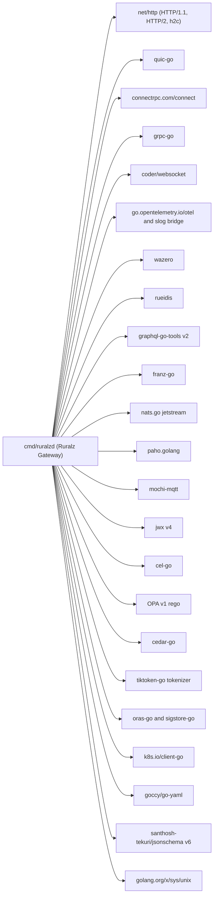
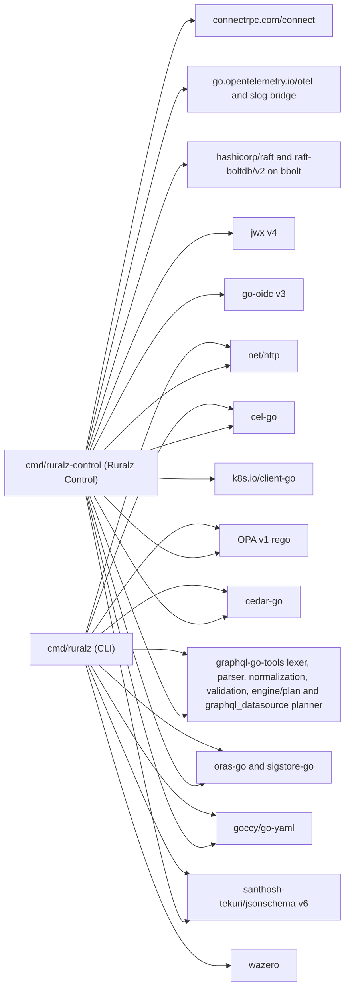
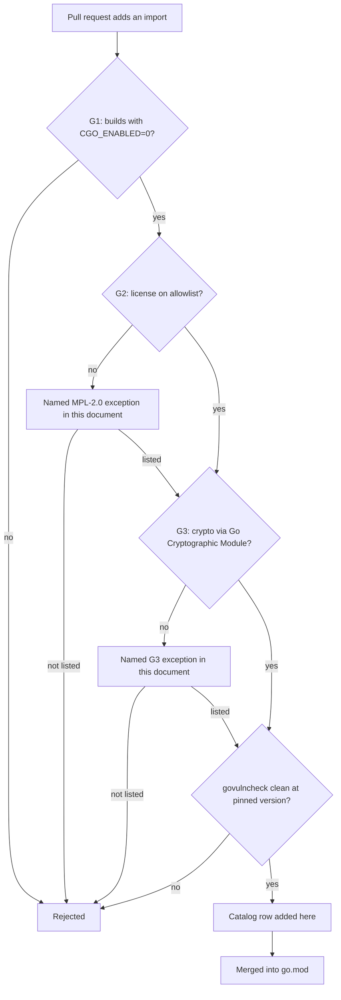

# Tech Stack and Libraries

## Summary

This document fixes the Go toolchain and every third-party library selected so far for `ruralzd` (Ruralz Gateway), `ruralz-control` (Ruralz Control) and the `ruralz` CLI, plus the tools that gate the documentation. It states the selection criteria, one catalog row per chosen concern, the concerns still awaiting a choice, the `CGO_ENABLED=0` and `GOFIPS140` build stance, dependency hygiene and rejected alternatives. Contributors read it before adding an import; architects check that designs assume only listed libraries or open selections. Nothing is implemented yet; every item carries a Planned (Mx) tag.

## Scope and non-goals

In scope: libraries linked into the three binaries, test and documentation tooling, the Go version floor, static build flags, platform support levels, the FIPS build, license admission, advisory-driven version floors and update policy.

Non-goals:

- Package layout, owned by [Repository layout and conventions](02-repository-layout-and-conventions.md), which also owns the Ruralz Console frontend toolchain.
- Test strategy and benchmark method, owned by [Testing and quality strategy](03-testing-and-quality-strategy.md).
- Release signing, SBOM and versioning, owned by [Release, versioning and compatibility](04-release-versioning-and-compatibility.md).
- Runtime behavior of each library, for example the Plugin ABI in [WASM plugin system](../architecture/05-wasm-plugin-system.md) and Control Stream messages in [Control plane and GitOps](../architecture/04-control-plane-and-gitops.md).

## Selection criteria

Every dependency MUST pass gates G1 to G3 and SHOULD score well on the rest. A library that fails a gate is rejected even when it is the fastest option.

| ID | Criterion | How it is checked |
|---|---|---|
| G1 | Pure Go: builds with `CGO_ENABLED=0` for linux/amd64 and linux/arm64 | CI cross-build of all three binaries, Planned (M0) |
| G2 | License compatible with Apache-2.0 distribution ([ADR-0002](../adr/0002-apache-2-license-no-feature-gating.md)): Apache-2.0, MIT, BSD-2-Clause, BSD-3-Clause, ISC, or EDL-1.0 where elected for a dual-licensed module; MPL-2.0 only by named exception; no GPL, AGPL, SSPL, RSALv2, BSL or EPL-only code | License gate over the linked package set ([License rules](#license-rules)), Planned (M0) |
| G3 | Cryptographic primitives come only from Go `crypto/...` or from `golang.org/x/crypto` packages that delegate to the Go Cryptographic Module in FIPS mode; anything else is a named exception in [FIPS build](#fips-build) | `go list -deps` crypto denylist in CI, Planned (M0); FIPS CI job, Planned (M5) |
| S1 | A release in the last 12 months and active commits at the snapshot | Quarterly health review |
| S2 | Builds on the project floor (Go 1.26) with no extra flags | Build with the floor toolchain |
| S3 | Composes with `net/http` handlers and `context.Context` cancellation | Design review |
| S4 | Exposes memory caps, deadlines and cost limits | Review against [Performance budgets and benchmarking](../architecture/12-performance-budgets-and-benchmarking.md) |
| S5 | Protocol completeness (federation, KIP coverage, MQTT v5) | Conformance suites |
| S6 | Small transitive graph; no second implementation of something already linked | `go mod graph` diff in review |
| S7 | Wrapped behind a Ruralz interface in `internal/`, never exposed in `pkg/` or `sdk/` | Exported API lint |

Accepted soft-criterion exceptions: jwx v4 fails S2 ([Version floor](#version-floor)); paho.golang and mochi-mqtt fail S1 (watch list); gorilla/websocket breaks S6 because graphql-go-tools' `graphql_datasource` pulls it in beside coder/websocket; go-jose/v4 breaks S6 in `ruralz-control` only, where go-oidc pulls it in beside jwx (OQ-tech-stack-and-libraries-6, option (b)); the archived boltdb/bolt, linked by raft-boltdb/v2 for `MigrateToV2`, fails S1 (watch list).

Library choices never gate features: every library ships in the single Apache-2.0 build, with no separate "enterprise" dependency set.

## Library catalog

Versions are the 2026-09-23 releases and serve as floors; pins live in `go.mod`. "Milestone" is when the first code using the library lands. "CGO" reads "Verified" where research states the library is pure Go and "Pending CI" until the G1 cross-build confirms it. Rows follow [foundation pack](../_meta/foundation-pack.md) section 7; [Tooling and licenses research](../_meta/research/tooling-and-licenses.md) backs the YAML, JSON Schema, docs tooling and Control Store rows.

| Concern | Chosen | Alternatives | Rationale | License | Risk | CGO | ADR | Milestone | Source |
|---|---|---|---|---|---|---|---|---|---|
| WASM runtime | wazero v1.12.x (repository `wazero/wazero`, module `github.com/tetratelabs/wazero`) | wasmtime-go; mosn proxy-wasm-go-host | Pure Go; compiler mode on amd64 and arm64; compile cache; memory and context limits | Apache-2.0 | No fuel metering; `WithCloseOnContextDone` costs 10 to 20x on loop-heavy guests; `api.Function.Call` is not goroutine-safe, so one instance per concurrent call; default 65536 pages (4 GiB) per instance, so `WithMemoryLimitPages` and a bounded pool are mandatory, cap owned by the WASM plugin system document (target) | Verified | [ADR-0004](../adr/0004-wasm-runtime-wazero.md) | Planned (M2) | ([source](https://github.com/wazero/wazero/blob/main/README.md)) ([source](https://github.com/wazero/wazero/issues/2466)) ([source](https://github.com/wazero/wazero/blob/main/api/wasm.go)) ([source](https://github.com/wazero/wazero/blob/main/config.go)) |
| Plugin PDK conventions | Extism-style memory and Host Function conventions for Plugin ABI v1 (`ruralz.plugin.v1`); Ruralz PDKs | Extism go-sdk as host; proxy-wasm ABI as primary | Known guest convention across PDK languages, with deny-by-default Capabilities | Ruralz PDKs Apache-2.0; go-sdk not linked | go-sdk is stale and pins wazero v1.9.0 | Not linked | [ADR-0005](../adr/0005-plugin-abi-v1.md) | Planned (M2) | ([source](https://extism.org/docs/concepts/pdk)) ([source](https://github.com/extism/go-sdk)) |
| HTTP/1.1 and HTTP/2 | `net/http` (`Server.Protocols`, `HTTP2Config`, `UnencryptedHTTP2`); `x/net/http2` only for non-deprecated low-level APIs such as `Framer`, none in use | fasthttp; `x/net/http2` `Server` | h2c built in since Go 1.24; `x/net/http2` `Server` and `Transport` deprecated in x/net v0.59.0 | BSD-3-Clause | HTTP/2 moves from `h2_bundle.go` into `net/http/internal/http2` in Go 1.27; behavior rides toolchain upgrades | Standard library | [ADR-0009](../adr/0009-http-stack-net-http-quic-go.md) | Planned (M1) | ([source](https://go.dev/doc/go1.24)) ([source](https://github.com/golang/go/issues/78064)) ([source](https://github.com/golang/go/tree/release-branch.go1.27/src/net/http/internal)) ([source](https://github.com/golang/go/tree/release-branch.go1.26/src/net/http)) ([source](https://github.com/golang/net/blob/v0.59.0/http2/server_common.go)) |
| HTTP/3 | quic-go `http3` v0.63.x, pinned | Go stdlib HTTP/3 (internal on master) | Only mature pure-Go HTTP/3; RFC 9218 priorities | MIT | Pre-1.0, breaks on minor releases; named G3 exception | Verified | [ADR-0009](../adr/0009-http-stack-net-http-quic-go.md) | Planned (M3) | ([source](https://github.com/quic-go/quic-go/releases/tag/v0.63.0)) ([source](https://github.com/quic-go/quic-go)) |
| gRPC ingress | `connectrpc.com/connect` v1.21.x: gRPC, gRPC-Web and Connect on `net/http` via Route-derived generic handlers ([gRPC proxying](#grpc-proxying)) | grpc-go server; connect v2 alpha | Shares the `net/http` listener; `WithRequestGate` authenticates before decompression | Apache-2.0 | v2 changes the Go API; pass-through unproven (OQ-tech-stack-and-libraries-21) | Verified | None | Planned (M3) | ([source](https://github.com/connectrpc/connect-go/blob/main/README.md)) ([source](https://github.com/connectrpc/connect-go/releases/tag/v1.21.0)) |
| gRPC upstream client | grpc-go v1.84.x | connect client | Native HTTP/2 transport and full client semantics | Apache-2.0 | OTel metric names changed in v1.84.0 | Verified | None | Planned (M3) | ([source](https://github.com/grpc/grpc-go/releases/tag/v1.84.0)) ([source](https://github.com/grpc/grpc-go)) |
| WebSocket | coder/websocket v1.8.x | gorilla/websocket; gobwas/ws | Zero dependencies, context-first, concurrent writes, passes Autobahn | ISC | gorilla/websocket enters via graphql-go-tools; floor v1.5.3 | Pending CI | None | Planned (M3) | ([source](https://github.com/coder/websocket)) ([source](https://pkg.go.dev/vuln/GO-2026-6278)) |
| SSE | `http.ResponseController` (`Flush`, deadlines, `EnableFullDuplex`) | tmaxmax/go-sse; r3labs/sse | No dependency; framing and flushing only | BSD-3-Clause | Replay and `Last-Event-ID` are Ruralz code | Standard library | None | Planned (M3) | ([source](https://pkg.go.dev/net/http#ResponseController)) |
| Telemetry | `go.opentelemetry.io/otel` v1.46.x traces and metrics; `log/slog` with `otelslog` v0.20.x | Vendor SDKs; Prometheus client only | Traces and metrics stable; Logs API expected at v1 in v1.47.0 | Apache-2.0 | v1.47.0-rc.1 deprecates `otel/log/global`; `/metrics` exporter unselected (OQ-tech-stack-and-libraries-16) | Pending CI | [ADR-0010](../adr/0010-telemetry-opentelemetry-first.md) | Planned (M1) | ([source](https://github.com/open-telemetry/opentelemetry-go/blob/main/README.md)) ([source](https://github.com/open-telemetry/opentelemetry-go/releases/tag/v1.47.0-rc.1)) |
| Control Stream | Own `ruralz.control.v1.ControlStream` (snapshot plus delta, xDS-style ACK/NACK) over mTLS, via connect in gRPC mode on both ends; every Node dials `ruralz-control` on 8091 | xDS via go-control-plane; grpc-go both ends | Built for whole Revisions; one RPC library for Ruralz APIs; not xDS | Apache-2.0 | The 8091 server disables `ReadTimeout` and `WriteTimeout` for the stream and detects dead peers with `HTTP2Config` pings; `buf breaking` gates protos | Verified | [ADR-0007](../adr/0007-control-stream-protocol.md) | Planned (M2) | ([source](https://github.com/connectrpc/connect-go/blob/main/README.md)) ([source](https://github.com/bufbuild/buf)) |
| Control Store | `hashicorp/raft` v1.8.0 with `github.com/hashicorp/raft-boltdb/v2` v2.4.2 or newer on `go.etcd.io/bbolt` v1.4.1 (`go-msgpack/v2` v2.1.5), mutual-TLS transport on 8092 ([Control Store transport](#control-store-transport)); optional `postgres`, Planned (M4) | etcd raft; dragonboat | `NetworkTransport` and file snapshot store; pure-Go log store; avoid raft-boltdb v2.4.0 and v2.4.1 | MPL-2.0 named exceptions: raft, raft-boltdb/v2, go-immutable-radix, golang-lru ([License rules](#license-rules)); bbolt, go-msgpack/v2, go-hclog, go-metrics MIT | MPL-2.0 obligations; links the archived boltdb/bolt ([source](https://github.com/hashicorp/raft-boltdb/blob/v2.4.2/v2/bolt_store.go)) | Pending CI | [ADR-0006](../adr/0006-control-store-raft-boltdb.md) (proposed) | Planned (M2) | ([source](https://github.com/hashicorp/raft)) ([source](https://github.com/hashicorp/raft-boltdb/releases/tag/v2.4.2)) ([source](https://github.com/hashicorp/raft-boltdb/blob/v2.4.2/LICENSE)) ([source](https://github.com/hashicorp/go-msgpack/blob/v2.1.5/LICENSE)) |
| State Store client | `github.com/redis/rueidis` v1.0.78 | go-redis v9 | RESP3-first; auto-pipelining; Valkey-aware | Apache-2.0 | Client-side caching off (`DisableCache`) by default, since `DefaultCacheBytes` is 128 MiB per connection; enabling needs a per-connection cap owned by the scalability document (target) | Pending CI | None | Planned (M1) | ([source](https://github.com/redis/rueidis/blob/main/rueidis.go)) ([source](https://github.com/redis/rueidis/blob/main/README.md)) |
| Rate limiting | Local token bucket at a per-Node ceiling plus GCRA as one Lua `EVAL` through rueidis; server `TIME`; `EVALSHA`; `NOSCRIPT` applies `failureMode` and schedules an off-path `SCRIPT LOAD`, never an `EVAL` retry; fail-open default, over-admission at most N × per-Node ceiling | redis_rate v10; throttled v2 | redis_rate is bound to go-redis; throttled uses non-atomic SETNX plus EXPIRE | Apache-2.0 (Ruralz code) | Script cache lost on failover; all keys in `KEYS` | Ruralz code | [ADR-0008](../adr/0008-rate-limiting-local-bucket-and-gcra.md) | Planned (M1) | ([source](https://raw.githubusercontent.com/go-redis/redis_rate/v10/lua.go)) ([source](https://redis.io/docs/latest/develop/programmability/eval-intro/)) |
| Semantic Cache | Redis 8.4.6 or newer Vector Sets (`VADD`, `VSIM`) or valkey-search 1.2 (`FT.*`) on Valkey 9.0.1 or newer, floors set by [AI/LLM gateway](../architecture/06-ai-llm-gateway.md), on the same State Store deployment, via a separate rueidis client with dedicated connections and timeouts | External vector database | No new infrastructure | rueidis Apache-2.0; servers external (Redis 8 RSALv2, SSPLv1 or AGPLv3; valkey-search BSD-3-Clause) | Vector commands MUST NOT share auto-pipelined connections with rate-limit and quota scripts, or a slow search delays every queued reply; on servers with neither (Dragonfly, Valkey below 9.0.1) the Policy acts as a State Store failure under `failureMode` (default `open`) and the Node reports degraded; no Active-Active | Via rueidis | None ([AI/LLM gateway](../architecture/06-ai-llm-gateway.md)) | Planned (M3) | ([source](https://redis.io/docs/latest/develop/data-types/vector-sets/)) ([source](https://redis.io/docs/latest/commands/vsim/)) ([source](https://github.com/valkey-io/valkey-search/releases)) ([source](https://redis.io/docs/latest/operate/oss_and_stack/stack-with-enterprise/release-notes/redisce/redisos-8.4-release-notes/)) |
| GraphQL | `wundergraph/graphql-go-tools` v2.22.x. `ruralzd`: lexer, parser, `astnormalization`, `astvalidation`, `engine/plan`, `engine/resolve` and `graphql_datasource`. `ruralz-control` and `ruralz`: lexer, parser, normalization and validation packages, plus `engine/plan` and the `graphql_datasource` planner, with no HTTP or subscription client, never `engine/resolve`. No binary links `subscription` | gqlgen; bramble; graphql-go | Federation versions 1 and 2; subscriptions over WebSocket and SSE; built for gateways | MIT | Customer-steered roadmap; pins gorilla/websocket v1.5.1, which `graphql_datasource` brings into all three binaries | Pending CI | [ADR-0012](../adr/0012-graphql-engine-graphql-go-tools.md) | Planned (M3) | ([source](https://github.com/wundergraph/graphql-go-tools)) ([source](https://github.com/wundergraph/graphql-go-tools/tree/master/v2)) ([source](https://raw.githubusercontent.com/wundergraph/graphql-go-tools/master/v2/go.mod)) |
| Kafka | `twmb/franz-go` v1.22.x; `ProducerLinger(0)` on Routes that await the acknowledgment | IBM/sarama; segmentio/kafka-go | Kafka 0.8.0 to 4.4; full EOS; KIP-848, KIP-932 | BSD-3-Clause | Tags only; library default linger 10 ms since v1.20.0 | Verified | [ADR-0013](../adr/0013-messaging-client-libraries.md) | Planned (M4) | ([source](https://github.com/twmb/franz-go)) ([source](https://raw.githubusercontent.com/twmb/franz-go/master/CHANGELOG.md)) |
| NATS | `nats-io/nats.go` v1.54.x, `jetstream` package | Legacy JetStream API | Replaces the legacy API; pull consumers, KeyValue | Apache-2.0 | Needs nats-server 2.9.0 or newer | Pending CI | [ADR-0013](../adr/0013-messaging-client-libraries.md) | Planned (M4) | ([source](https://github.com/nats-io/nats.go/blob/main/jetstream/README.md)) ([source](https://github.com/nats-io/nats.go/releases)) |
| MQTT client | `eclipse-paho/paho.golang` v0.23.x (module `github.com/eclipse/paho.golang`), `autopaho` | paho.mqtt.golang | MQTT v5, session persistence, QoS 1 and 2 | EPL-2.0 or EDL-1.0; Ruralz elects EDL-1.0 | Pre-1.0; last tag 2025-09-06 (fails S1); Receive Maximum gaps | Pending CI | [ADR-0013](../adr/0013-messaging-client-libraries.md) | Planned (M4) | ([source](https://github.com/eclipse-paho/paho.golang)) ([source](https://pkg.go.dev/github.com/eclipse/paho.golang?tab=versions)) |
| MQTT embedded broker | `mochi-mqtt/server/v2` v2.7.x, core and auth packages only, so its Redis, Badger and Pebble storage hooks are not linked (the license gate still scans them) | Separate broker process | In-process v5 broker with ACL hooks; passes Paho interoperability tests | MIT | Last tag 2025-03-01 (fails S1); inline client bypasses ACLs | Pending CI | [ADR-0013](../adr/0013-messaging-client-libraries.md) | Planned (M4) | ([source](https://github.com/mochi-mqtt/server)) ([source](https://pkg.go.dev/github.com/mochi-mqtt/server/v2?tab=versions)) |
| JOSE | `lestrrat-go/jwx/v4` v4.5.x; `ruralzd` uses jwx alone for JWKS and token verification | golang-jwt/jwt/v5; go-jose/v4 alone | Full JWA, JWE, JWK, JWS, JWT; v4.5.0 fixes GHSA-4cf7-xm37-g63h | MIT | `GOEXPERIMENT=jsonv2` on Go 1.26 (S2 exception); ML-DSA unregistered below Go 1.27 (G3) | Pending CI | None | Planned (M1) | ([source](https://github.com/lestrrat-go/jwx/blob/develop/v4/README.md)) ([source](https://github.com/lestrrat-go/jwx/releases/tag/v4.5.0)) |
| OIDC | `coreos/go-oidc/v3` v3.21.x, in `ruralz-control` only, for Ruralz Console SSO (OQ-tech-stack-and-libraries-6, option (b)) | jwx plus own discovery | Maintained discovery and ID token verification | Apache-2.0 | Brings go-jose/v4 beside jwx in `ruralz-control` | Pending CI | None | Planned (M5) | ([source](https://github.com/coreos/go-oidc/blob/v3/go.mod)) |
| Expressions | cel-go v0.32.x at `cel.dev/cel-go` (`google/cel-go` is a read-only alias) | Lua; expr-lang | Typed, non-Turing-complete; `CostLimit`, `ContextEval` | Apache-2.0 | Old path "will eventually be removed" | Pending CI | [ADR-0011](../adr/0011-expressions-and-authorization-engines.md) | Planned (M1) | ([source](https://github.com/google/cel-go/blob/main/README.md)) ([source](https://github.com/cel-expr/cel-go/releases/tag/v0.32.0)) |
| Authorization engines | OPA v1 (`opa/v1/rego`, `PrepareForEval`) and cedar-go v1.8.x; also in Ruralz Control and CLI for validation | Root `opa/rego`; OPA sidecar | Prepared queries per request, no network hop | Apache-2.0 | cedar-go idle since 2026-06-01 and lacks the schema validator, so Cedar validation stops at parsing | Pending CI | [ADR-0011](../adr/0011-expressions-and-authorization-engines.md) | Planned (M2) | ([source](https://github.com/open-policy-agent/opa/blob/main/v1/rego/rego.go)) ([source](https://github.com/cedar-policy/cedar-go/blob/main/README.md)) ([source](https://github.com/cedar-policy/cedar-go)) |
| Tokenizer (estimates only) | `tiktoken-go/tokenizer` v0.8.x | pkoukk/tiktoken-go | Vocabularies embedded (about 4 MB); provider usage stays authoritative | MIT | OpenAI encodings only; init-time heap unmeasured (hypothesis: lazy per-encoding loading avoids it) | Pending CI | [ADR-0014](../adr/0014-ai-api-surface.md) | Planned (M3) | ([source](https://github.com/tiktoken-go/tokenizer)) ([source](https://pkg.go.dev/github.com/tiktoken-go/tokenizer)) |
| Plugin and Revision distribution | `oras.land/oras-go/v2` v2.6.2 or newer; `sigstore/sigstore-go` v1.3.x | cosign as a library | OCI Referrers carry Sigstore signatures; stable verification library | Apache-2.0 | Older oras-go carries GO-2026-5879 | Pending CI | [ADR-0017](../adr/0017-artifact-signing.md) | Planned (M2) | ([source](https://pkg.go.dev/oras.land/oras-go/v2?tab=versions)) ([source](https://github.com/sigstore/sigstore-go)) |
| Service discovery | `net` for DNS SRV; `k8s.io/client-go` EndpointSlice informers | Consul `api`; minimal list-and-watch client (OQ-tech-stack-and-libraries-23) | Informers avoid DNS TTL lag | BSD-3-Clause; Apache-2.0 | client-go is always linked into `ruralzd` and `ruralz-control`: a static binary cannot drop it without a second build variant | Pending CI | None | Planned (M1) DNS; Planned (M2) Kubernetes | ([source](https://pkg.go.dev/net)) ([source](https://pkg.go.dev/k8s.io/client-go/informers/discovery/v1)) |
| Zero-Downtime Upgrade socket steering | `golang.org/x/sys/unix` v0.48.x, imported directly for `SO_ATTACH_REUSEPORT_CBPF` steering at a Zero-Downtime Upgrade | `syscall` | Already linked transitively through wazero and bbolt, so no new module | BSD-3-Clause | Steering calls are Linux-only | Pending CI | [ADR-0015](../adr/0015-zero-downtime-upgrades-so-reuseport.md) | Planned (M1) | ([source](https://github.com/golang/sys/blob/v0.48.0/LICENSE)) ([source](https://github.com/wazero/wazero/blob/main/go.mod)) ([source](https://github.com/etcd-io/bbolt/blob/v1.4.1/go.mod)) |
| YAML 1.2 parser | `github.com/goccy/go-yaml` v1.19.x; Ruralz code over its AST rejects anchors, aliases, merge keys and custom tags | go-yaml v4 (`go.yaml.in/yaml/v4`); sigs.k8s.io/yaml (YAML 1.1 resolver) | Only candidate claiming YAML 1.2-only scalar resolution; duplicate keys fail by default; no dependencies | MIT | Last release 2026-01-08; YAML Test Suite results self-reported | Pending CI | [ADR-0003](../adr/0003-configuration-format.md) | Planned (M1) | ([source](https://github.com/goccy/go-yaml/blob/master/README.md)) ([source](https://github.com/goccy/go-yaml/blob/master/token/token.go)) ([source](https://github.com/goccy/go-yaml/blob/v1.19.2/option.go)) |
| JSON Schema validator | `github.com/santhosh-tekuri/jsonschema/v6` v6.0.x (draft 2020-12), also behind `validation.json-schema` | kaptinlin/jsonschema (`go 1.27.0` fails S2); google/jsonschema-go | Claims 2020-12 test-suite compliance; `Vocabulary` API for `x-ruralz-*` keywords; instance locations for the source map; declares `go 1.21` | Apache-2.0 | Compliance shown by badges, not an independent run | Pending CI | [ADR-0003](../adr/0003-configuration-format.md) | Planned (M1) | ([source](https://github.com/santhosh-tekuri/jsonschema/blob/boon/README.md)) ([source](https://github.com/santhosh-tekuri/jsonschema/blob/v6.0.3/vocab.go)) ([source](https://github.com/santhosh-tekuri/jsonschema/blob/v6.0.3/go.mod)) |
| Test tooling (not shipped) | testcontainers-go v0.44.x; buf v1.73.x | Docker Compose scripts | Real brokers in Go tests; `buf lint` and `buf breaking` | MIT; Apache-2.0 | Breaking changes in v0.42.0 and v0.43.0 | Not linked | None | Planned (M0) | ([source](https://github.com/testcontainers/testcontainers-go)) ([source](https://github.com/bufbuild/buf)) |

Because client-go, OPA and graphql-go-tools are always linked, `ruralzd` has a stripped binary budget of 160 MiB (target) and an idle RSS budget of 89 MiB with no Revision loaded (target), owned by [Performance budgets and benchmarking](../architecture/12-performance-budgets-and-benchmarking.md) and reported by a CI size check from Planned (M1). This answers OQ-performance-budgets-and-benchmarking-5 with option (a), aligning to 89 MiB.

### Concerns not yet selected

[Research](../_meta/research/tooling-and-licenses.md) section 8 lists candidate licenses only. A design MAY assume the capability but MUST NOT name a library until a research-backed catalog row lands (foundation pack section 7).

| Concern | Needed by | Milestone | Open question |
|---|---|---|---|
| Protobuf runtime and code generation | `ruralz.control.v1`, `ruralz.plugin.v1` | Planned (M2) | OQ-tech-stack-and-libraries-14 |
| ULID for `node.id` | `ruralzd` | Planned (M1) | OQ-tech-stack-and-libraries-15 |
| Metrics exposition (`/metrics`) | `ruralzd` (admin port 9901); `ruralz-control` (admin port 9902) | Planned (M1) | OQ-tech-stack-and-libraries-16 |
| AWS SigV4 signing | `auth.upstream-sigv4`; `bedrock` dialect | Planned (M2) | OQ-tech-stack-and-libraries-17 |
| CLI framework | `ruralz` | Planned (M1) | OQ-tech-stack-and-libraries-18 |
| SAML and SSO for Ruralz Console | `ruralz-control` | Planned (M5) | OQ-tech-stack-and-libraries-19 |
| `postgres` Control Store driver | `ruralz-control` | Planned (M4) | OQ-tech-stack-and-libraries-20 |
| MaxMind-format database reader | `authz.geoip` | Planned (M2) | OQ-tech-stack-and-libraries-24 |

### gRPC proxying

connect-go serves typed handlers, yet a Route matches arbitrary services by service and method and forwards to grpc-go Upstreams. The Planned (M3) design, confirmed by a spike under OQ-tech-stack-and-libraries-21:

- Each Route-derived procedure (`/pkg.Service/Method` or a service prefix) gets a unary and a bidirectional-stream generic connect handler sharing a pass-through codec. Since connect-go accepts only its stream type's content types, a Ruralz `http.Handler` in front sends Connect unary requests (`application/proto`, `application/json`, GET) to the unary handler and every enveloped type (`application/grpc`, `application/grpc-web`, `application/connect+proto`) to the bidirectional one; the Content-Type alone picks the stream type, with no descriptor.
- Descriptors (Bundle-supplied or from Upstream reflection) load only when a client uses JSON encoding and the Node transcodes.
- Each inbound call opens one grpc-go client stream with the same codec: headers become metadata, `grpc-timeout` becomes the context deadline clamped by the Route timeout, and half-close and cancellation propagate both ways. A non-OK Upstream `grpc-status` returns as `*connect.Error` (code, message, details from `grpc-status-details-bin`), which connect-go encodes per protocol; trailing metadata on success goes to the response trailers.
- An unmatched procedure returns `Unimplemented` without reading the body.

### Control Store transport

`raft.NetworkTransport` runs over a Ruralz mutual-TLS stream layer on `crypto/tls`, never the built-in TCP layer, so replication is encrypted; peers present Ruralz Control peer certificates and Node certificates are rejected. It listens on 8092, the Raft peer port of foundation pack section 8.4, which keeps Nodes off peer traffic in firewall rules; `ruralz control join` adds a replica over it. Certificates belong to [Control plane and GitOps](../architecture/04-control-plane-and-gitops.md).

### Dependency graph

*Figure 1: libraries linked by `cmd/ruralzd`, which carries the request path; go-oidc stays out, so jwx alone verifies tokens.*

*Figure 2: libraries linked by `cmd/ruralz-control` and `cmd/ruralz`.*

One validation library runs in all three binaries ([Configuration model](../architecture/02-configuration-model.md#validation-and-diff-semantics)), so `ruralz-control` and the CLI compile every CEL expression, Rego module, Cedar policy and GraphQL document, and plan supergraph operations, before a Revision exists; such errors surface in `ruralz bundle validate`, not as Node NACKs (size cost: OQ-tech-stack-and-libraries-22). `ruralz-control` links client-go to watch Ruralz CRDs. The CLI links wazero so `ruralz plugin test` matches `ruralzd`; `ruralz dev run` launches a local `ruralzd` rather than embedding it.

## Go toolchain, static builds and FIPS

### Version floor

The minimum Go version is 1.26 ([ADR-0001](../adr/0001-implementation-language-go.md)); the root `go.mod` declares `go 1.26.0`. The graph forces it: quic-go since v0.62.0 ([source](https://github.com/quic-go/quic-go/releases/tag/v0.62.0)), nats.go v1.54.0 ([source](https://github.com/nats-io/nats.go/releases)), and OPA, `raft-boltdb/v2` and `otelslog` ([source](https://github.com/open-policy-agent/opa/blob/main/go.mod)) ([source](https://github.com/hashicorp/raft-boltdb/blob/master/v2/go.mod)) ([source](https://github.com/open-telemetry/opentelemetry-go-contrib/blob/main/bridges/otelslog/go.mod)).

jwx v4 needs `encoding/json/v2`, standard in Go 1.27 and behind `GOEXPERIMENT=jsonv2` on 1.26 ([source](https://github.com/lestrrat-go/jwx/blob/develop/v4/README.md)). The 1.26 floor stays, as foundation pack section 7 (Language / build) fixes:

- Release and FIPS binaries MUST use the latest patch of the newest Go release (Go 1.27.1 at the snapshot ([source](https://go.dev/doc/devel/release))), pinned by `toolchain go1.27.1`, and never set a `GOEXPERIMENT`.
- Under the default `GOTOOLCHAIN=auto`, a Go 1.26 `go` command switches to go1.27.1, so plain builds need no flags.
- The floor CI job builds and tests on the latest 1.26 patch with `GOTOOLCHAIN=local` and `GOEXPERIMENT=jsonv2`; the Makefile floor target sets both.
- A guard file constrained to `go1.26 && !go1.27 && !goexperiment.jsonv2` fails compilation with an identifier naming the fix.
- JSON golden tests (Bundle loading, Control Stream JSON, JOSE) MUST produce identical bytes in both jobs.

A checked-in `default.pgo` for `cmd/ruralzd` is Planned (M4); the Go docs report 2 to 14% gains ([source](https://go.dev/doc/pgo)).

### Static builds

All three binaries build with `CGO_ENABLED=0`, `-trimpath` and `-ldflags -X` metadata. Research confirms pure Go for wazero ([source](https://github.com/wazero/wazero/blob/main/README.md)), quic-go ([source](https://github.com/quic-go/quic-go)), franz-go ([source](https://github.com/twmb/franz-go)), connect-go ([source](https://github.com/connectrpc/connect-go)) and grpc-go ([source](https://github.com/grpc/grpc-go)). A library that fails the Planned (M0) G1 cross-build loses its row.

| Platform | `ruralzd` | `ruralz-control` | `ruralz` |
|---|---|---|---|
| linux/amd64, linux/arm64 | Production | Production | Production |
| darwin/arm64, darwin/amd64 | Development only | Development only | Production (CLI) |
| windows/amd64 | Not planned: no production target | Not planned: no production target | Production (CLI) |

Production support for the gateway is limited to amd64 and arm64 because wazero's compiler runs only there and its interpreter is often ten times slower ([source](https://github.com/wazero/wazero/blob/main/README.md)).

### FIPS build

The FIPS variant is Planned (M5): the same source built with `GOFIPS140` by the release toolchain, as separate artifacts named by [Release, versioning and compatibility](04-release-versioning-and-compatibility.md).

| Decision | Value | Basis |
|---|---|---|
| Module | `GOFIPS140=v1.0.0` (CMVP #5247) until v1.26.0 leaves "Pending Review"; `GODEBUG=fips140=on`, never `only` | ([source](https://go.dev/doc/security/fips140)) |
| Plugins | FIPS mode does not cover Wasm, so guest code is outside the FIPS boundary; Plugins get cryptography only through a crypto Host Function Capability named by the WASM plugin system document | ([source](https://go.dev/doc/security/fips140)) |
| JOSE | Only allowlisted approved JWA algorithms register; ML-DSA only where `crypto/mldsa` exists (Go 1.27 and newer) | ([source](https://tip.golang.org/doc/go1.27)) |
| G3 check | `go list -deps` fails on any `golang.org/x/crypto` package off the delegation allowlist, or non-standard package with `crypto` in its path, that lacks a row below | Selection criteria |

| G3 exception | What breaks G3 | Handling | Tracking |
|---|---|---|---|
| quic-go | FIPS enforcement off for Initial and Retry protection (fixed keys); separate ChaCha20 path; `go:linkname` into unexported `crypto/tls.aeadAESGCMTLS13` ([source](https://github.com/quic-go/quic-go/blob/master/FIPS140.md)) | Accepted outside FIPS builds; HTTP/3 off in FIPS builds, and a FIPS Node refuses, never ignores, `http3: true` | OQ-tech-stack-and-libraries-9 |
| jwx v4 ML-DSA | No `crypto/mldsa` before Go 1.27 ([source](https://tip.golang.org/doc/go1.27)) | Excluded below Go 1.27 | Version floor |
| go-jose/v4 (`ruralz-control` only), OPA v1, sigstore-go | No research evidence either way | The G3 check decides; a failure adds a row or a replacement | OQ-tech-stack-and-libraries-9 |

Go 1.26 enables hybrid post-quantum key exchange in `crypto/tls` by default ([source](https://go.dev/doc/go1.26)); Ruralz keeps it outside FIPS builds.

## Dependency hygiene

### Admission

*Figure 3: the path a new module takes from proposal to `go.mod`.*

A new direct dependency MUST get a catalog row in the same pull request. Transitive additions outside the license set fail the gate even under a permissive direct import.

### License rules

- Allowed without review: the G2 list.
- **MPL-2.0, named exceptions only.** File-level weak copyleft, accepted because the Control Store sits behind an interface with an optional `postgres` implementation ([ADR-0006](../adr/0006-control-store-raft-boltdb.md), proposed). The MPL-2.0 Consul `api` module ([source](https://raw.githubusercontent.com/hashicorp/consul/main/api/LICENSE)) is not admitted.
- **Dual-licensed modules.** paho.golang is EPL-2.0 or EDL-1.0 ([source](https://github.com/eclipse-paho/paho.golang)); Ruralz elects EDL-1.0 in `NOTICE`.
- **What the gate reads.** Each binary's linked packages (`go list -deps -test=false`), which Ruralz distributes, not `go mod graph`. The MPL-2.0 `go-cleanhttp` and `go-retryablehttp`, listed only in go-metrics' `go.mod` for its Circonus sink ([source](https://github.com/hashicorp/go-metrics/blob/v0.7.0/go.mod)), pass until that sink is imported. The first gate run, Planned (M0), confirms the researched linked set.
- **CI tools stay out of `go.mod`.** golangci-lint (GPL-3.0 ([source](https://github.com/golangci/golangci-lint/blob/v2.13.2/LICENSE))) runs as a pinned binary, never a `tool` directive.
- **External servers are not linked.** Redis 8 is RSALv2, SSPLv1 or AGPLv3 ([source](https://redis.io/legal/licenses/)) and ships no code in Ruralz; Valkey with valkey-search (BSD-3-Clause ([source](https://github.com/valkey-io/valkey-search))) is the fully open State Store deployment.

| MPL-2.0 exception | Version | Status | Reason | Obligations |
|---|---|---|---|---|
| `github.com/hashicorp/raft` | v1.8.0 | Confirmed ([source](https://github.com/hashicorp/raft/blob/v1.8.0/LICENSE)) | Control Store consensus | Use unmodified; keep notices; publish patches to MPL-2.0 files under MPL-2.0 |
| `github.com/hashicorp/raft-boltdb/v2` | v2.4.2 | Confirmed, including the module zip ([source](https://proxy.golang.org/github.com/hashicorp/raft-boltdb/v2/@v/v2.4.2.zip)) | Raft log store | As above |
| `github.com/hashicorp/go-immutable-radix` | v1.3.1 | Confirmed ([source](https://github.com/hashicorp/go-immutable-radix/blob/v1.3.1/LICENSE)) | Via go-metrics, which raft needs | As above |
| `github.com/hashicorp/golang-lru` | v1.0.2 | Confirmed ([source](https://github.com/hashicorp/golang-lru/blob/v1.0.2/LICENSE)) | Via go-immutable-radix | As above |

`go.etcd.io/bbolt`, `go-hclog` and `go-metrics` are MIT ([source](https://github.com/etcd-io/bbolt/blob/v1.4.1/LICENSE)) ([source](https://github.com/hashicorp/go-hclog/blob/v1.6.3/LICENSE)) ([source](https://github.com/hashicorp/go-metrics/blob/v0.7.0/LICENSE)), as are `go-msgpack/v2` and `boltdb/bolt`. Minimal version selection may raise these versions; a linked license outside G2 and this table reopens ADR-0006.

### Version floors from advisories

| Module | Floor | Reason |
|---|---|---|
| gorilla/websocket (via graphql-go-tools) | v1.5.3 | GO-2026-6278; graphql-go-tools pins v1.5.1 ([source](https://pkg.go.dev/vuln/GO-2026-6278)) |
| oras-go/v2 | v2.6.2 | GO-2026-5879 and related ([source](https://pkg.go.dev/oras.land/oras-go/v2?tab=versions)) |
| jwx/v4 | v4.5.0 | GHSA-4cf7-xm37-g63h ([source](https://github.com/lestrrat-go/jwx/releases/tag/v4.5.0)) |
| raft-boltdb/v2 | v2.4.2 | v2.4.0 and v2.4.1 "should not be used" ([source](https://github.com/hashicorp/raft-boltdb/releases/tag/v2.4.2)) |

Explicit `require` lines enforce floors over lower transitive pins.

### Update policy

- `govulncheck` and `go mod verify` run on every pull request; a reachable vulnerability blocks merge, Planned (M0).
- Weekly update pull requests: patch bumps merge on green CI; minor bumps of pre-1.0 modules need a named reviewer, since quic-go breaks APIs on minor releases ([source](https://github.com/quic-go/quic-go/releases/tag/v0.63.0)).
- Release builds follow [Version floor](#version-floor); the floor moves only by ADR-0001 amendment.

### CI tooling

CI tools run in stages 2 and 6 but are never linked into a binary and never enter `go.mod` ([License rules](#license-rules)). `make tools` installs them into `bin/`; the research is in the [tooling addendum](../_meta/research/tooling-and-licenses.md). This answers OQ-repository-layout-and-conventions-7 with option (a).

| Tool | Version | License | How it runs | Source |
|---|---|---|---|---|
| golangci-lint | v2.13.2 | GPL-3.0 | Release binary checked against a pinned SHA-256 | ([source](https://github.com/golangci/golangci-lint/releases/tag/v2.13.2)) ([source](https://github.com/golangci/golangci-lint/blob/v2.13.2/LICENSE)) |
| gofumpt, goimports | Bundled in golangci-lint | BSD-3-Clause | golangci-lint formatters; no separate install | ([source](https://github.com/mvdan/gofumpt/blob/master/LICENSE)) ([source](https://github.com/golang/tools/blob/master/LICENSE)) |
| govulncheck | `golang.org/x/vuln` v1.8.0 | BSD-3-Clause | `go install` at the pinned version, verified by the Go checksum database and built with the module's toolchain | ([source](https://pkg.go.dev/golang.org/x/vuln@v1.8.0/cmd/govulncheck)) ([source](https://proxy.golang.org/golang.org/x/vuln/@v/v1.8.0.zip)) |
| actions/checkout | v7.0.1 | MIT | GitHub Actions step, pinned by commit SHA | ([source](https://github.com/actions/checkout/blob/v7.0.1/LICENSE)) |
| actions/setup-go | v7.0.0 | MIT | GitHub Actions step, pinned by commit SHA; installs the `go.mod` `toolchain` version | ([source](https://github.com/actions/setup-go/blob/v7.0.0/README.md)) ([source](https://github.com/actions/setup-go/blob/v7.0.0/LICENSE)) |

G2, G3, the `ruralzd` Raft denylist and the advisory floors run as `internal/tool/depgate`, a standard-library program over `go list -deps -test=false` for each binary and shipped platform with `CGO_ENABLED=0`. It classifies each linked module's license file text, keys the MPL-2.0 exceptions by module path, and fails on an unreadable license until a reviewed override names it. Its x/crypto delegation allowlist is empty: no research row yet names a delegating package, and nothing links `golang.org/x/crypto`.

### Watch list

| Module | Signal at snapshot | Trigger | Fallback |
|---|---|---|---|
| mochi-mqtt/server | No tag in about 18 months ([source](https://pkg.go.dev/github.com/mochi-mqtt/server/v2?tab=versions)) | No release by M4 start | Separate broker via paho.golang |
| paho.golang | Last tag 2025-09-06 ([source](https://pkg.go.dev/github.com/eclipse/paho.golang?tab=versions)) | v5 defect unfixed for a quarter | Public fork |
| cedar-go | No commits since 2026-06-01 ([source](https://github.com/cedar-policy/cedar-go)) | Unfixed security issue | OPA only; fork |
| boltdb/bolt | Archived; last push 2018-03-02 ([source](https://github.com/boltdb/bolt)) | Advisory against v1.3.1 | Fork raft-boltdb/v2 without `MigrateToV2` |
| OTel Logs API | Release candidate ([source](https://github.com/open-telemetry/opentelemetry-go/releases/tag/v1.47.0-rc.1)) | v1.47.0 stable | Logs SDK replaces the bridge |

### Documentation tooling

ADRs follow MADR 4.0 plus `Confirmation` ([style guide](../_meta/style-guide.md)).

## Alternatives not chosen

| Alternative | Concern | Why not chosen | Revisit if | Source |
|---|---|---|---|---|
| wasmtime-go | WASM runtime | CGO and a prebuilt Rust library break G1, despite fuel and epoch interruption | An ADR accepts CGO for fuel metering | ([source](https://github.com/bytecodealliance/wasmtime-go/blob/main/config.go)) |
| fasthttp | HTTP stack | Not `net/http`, so connect and the standard HTTP/2 server cannot be reused | Never | ([source](https://github.com/connectrpc/connect-go/blob/main/README.md)) |
| Go stdlib HTTP/3 | HTTP/3 | Unexported package on master; proposals on hold | A public API ships | ([source](https://github.com/golang/go/issues/70914)) |
| grpc-go `ServeHTTP` | gRPC ingress | Needs HTTP/2; lacks some native-server features | Never | ([source](https://github.com/grpc/grpc-go/blob/master/server.go)) |
| go-control-plane | Control Stream | Per-resource xDS model, not whole Revisions ([ADR-0007](../adr/0007-control-stream-protocol.md)) | Never | Design decision, no external claim |
| etcd raft; dragonboat | Control Store | etcd raft has no transport or storage; dragonboat has no release since 2023 | hashicorp/raft stalls | ([source](https://github.com/etcd-io/raft/blob/main/README.md)) ([source](https://github.com/lni/dragonboat/blob/master/README.md)) |
| go-redis v9 | State Store client | Auto-pipelining and client-side caching experimental | Both stabilize and win benchmarks | ([source](https://github.com/redis/go-redis/releases/tag/v9.22.0)) |
| gqlgen; bramble; graphql-go | GraphQL | Code-generation framework; no subscriptions; stale since 2023 with GO-2022-0942 | Never | ([source](https://github.com/99designs/gqlgen)) ([source](https://github.com/movio/bramble)) ([source](https://pkg.go.dev/github.com/graphql-go/graphql?tab=versions)) |
| sarama; kafka-go | Kafka | Only two latest Kafka releases; tested only to Kafka 2.7.1 | franz-go stalls | ([source](https://github.com/IBM/sarama)) ([source](https://github.com/segmentio/kafka-go)) |
| pkoukk/tiktoken-go | Tokenizer | Downloads vocabularies at runtime | Never | ([source](https://github.com/pkoukk/tiktoken-go)) |
| r3labs/sse | SSE | MPL-2.0; no tag since 2023-01 | Never | ([source](https://pkg.go.dev/github.com/r3labs/sse/v2?tab=versions)) |
| Embedded Lua | Expressions | Duplicates the Plugin path ([ADR-0011](../adr/0011-expressions-and-authorization-engines.md)) | Never | Design decision, no external claim |

## Open questions

| ID | Question | Options | Owner | Blocking? |
|---|---|---|---|---|
| OQ-tech-stack-and-libraries-6 | Two JOSE stacks (jwx, go-jose via go-oidc) | (a) Accept; (b) Chosen by Security and identity: go-oidc, with go-jose/v4, in Ruralz Control only; (c) go-jose/v4 only | Security and identity owner | No (answered) |
| OQ-tech-stack-and-libraries-8 | Plugin CPU limits without fuel metering? | (a) Deadlines; (b) Host-side call budgets; (c) Upstream fix | WASM plugin system owner | Yes, for WASM plugin system |
| OQ-tech-stack-and-libraries-9 | FIPS HTTP/3 given the quic-go G3 exception (golang/go#79219); how a FIPS Node refuses, never ignores, a Revision with `http3: true`; G3 status of go-jose/v4, OPA, sigstore-go | (a) HTTP/3 off in FIPS builds (current); (b) Ship with caveat. For `http3: true`: (c) Deterministic NACK, or a file-mode load failure, with an RZ-CFG code the Configuration model registers (proposed), which pauses or rolls back Rollouts in Clusters mixing FIPS and default Nodes; (d) Render-time error, needing a field that marks FIPS targets, which the Configuration model lacks | Release owner | Yes, for the FIPS build |
| OQ-tech-stack-and-libraries-11 | Token estimates for non-OpenAI providers? | (a) Per-`AIProvider` ratio; (b) Provider count APIs; (c) OpenAI proxy | AI/LLM gateway owner | No |
| OQ-tech-stack-and-libraries-14 | Protobuf runtime and generator? | google.golang.org/protobuf with buf | Control plane owner | Yes, for Planned (M2) |
| OQ-tech-stack-and-libraries-15 | ULID library? | oklog/ulid/v2; own code on `crypto/rand` | Data plane owner | No |
| OQ-tech-stack-and-libraries-16 | Which `/metrics` exporter serves 9901 and 9902? | OTel Prometheus exporter; Prometheus client | Observability owner | No |
| OQ-tech-stack-and-libraries-17 | SigV4 signer? | aws-sdk-go-v2 signer/v4; own code | Security and identity owner | No |
| OQ-tech-stack-and-libraries-18 | CLI framework? | spf13/cobra; `flag` | CLI reference owner | No |
| OQ-tech-stack-and-libraries-19 | SAML library for Console SSO? | crewjam/saml (fails S1); OIDC only | Security and identity owner | No |
| OQ-tech-stack-and-libraries-20 | `postgres` driver? | jackc/pgx/v5; defer | Control plane owner | No |
| OQ-tech-stack-and-libraries-21 | Does gRPC pass-through hold for trailers, deadlines, all stream types, Connect unary and error mapping; where do descriptors come from? | (a) Generic connect handlers (proposed); (b) Raw HTTP/2 proxy for gRPC | Multi-protocol owner | Yes, for Multi-protocol |
| OQ-tech-stack-and-libraries-22 | Validation-only engines and GraphQL supergraph planning grow Ruralz Control and CLI | (a) Accept; (b) Node-side only, errors as NACKs | Control plane owner | No |
| OQ-tech-stack-and-libraries-23 | client-go or a minimal EndpointSlice client in `ruralzd`? | (a) client-go within budget; (b) Minimal client | Data plane owner | No |
| OQ-tech-stack-and-libraries-24 | MaxMind-format database reader for `authz.geoip`? | (a) Research addendum, then a catalog row; (b) Own reader | Security and identity owner | Yes, for `authz.geoip` |
| OQ-tech-stack-and-libraries-25 | Where do the static binaries get CA roots, given images without a libc base and archive installs? | (a) The image ships a CA bundle and archives read the host store; (b) The binary embeds roots, needing a research-backed catalog row and a G3 decision, with `-fips` artifacts making the same choice; (c) The host or a mounted store only | Release owner | Yes, for container images |

Answered here: OQ-performance-budgets-and-benchmarking-5, option (a), idle RSS 89 MiB (target) ([Library catalog](#library-catalog)).
