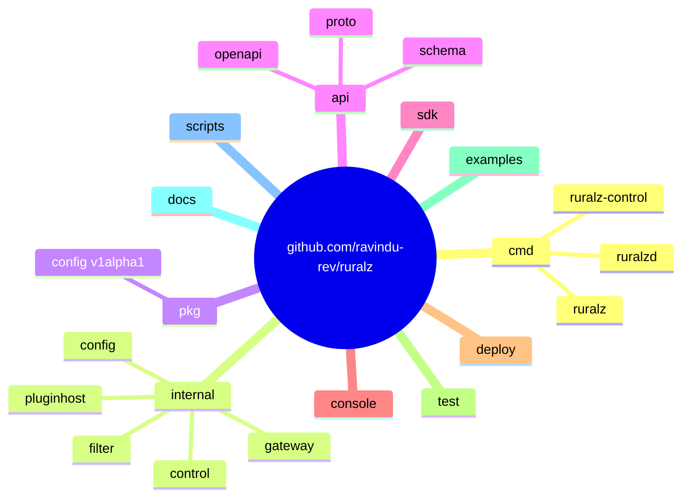
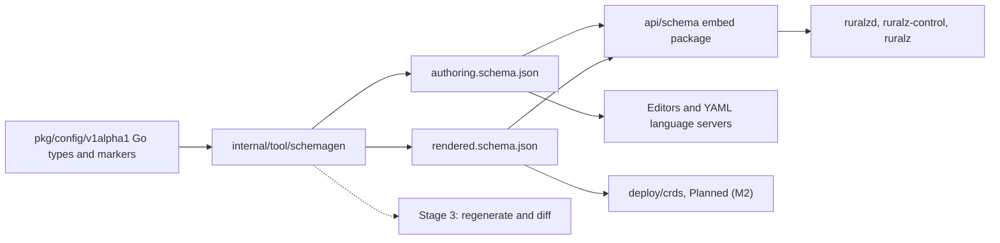
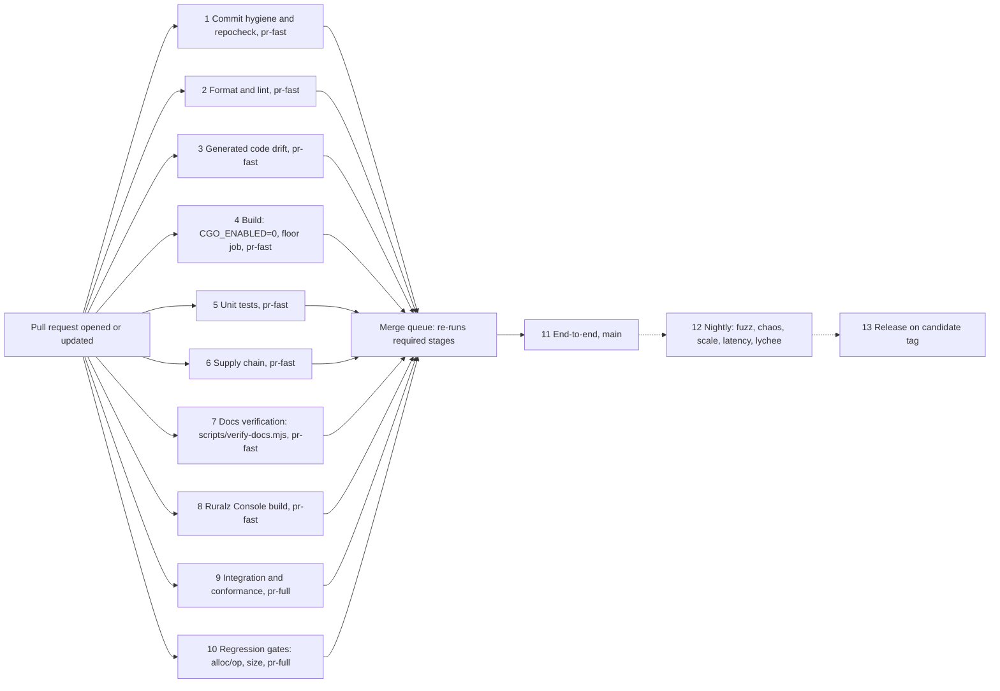

# Repository Layout and Conventions

## Summary

This document fixes how the monorepo `github.com/ravindu-rev/ruralz` is organized and how code enters it: the tree and import rules for `ruralzd` (Ruralz Gateway), `ruralz-control` (Ruralz Control) and the `ruralz` CLI; Go conventions and golangci-lint; protobuf layout and buf; JSON Schema generation from Go types; commit, DCO and pull request rules; CI stages; and documentation verification. Nothing is implemented yet; every capability is Planned (Mx), and untagged conventions are Planned (M0).

## Scope and non-goals

In scope: the subjects the Summary lists, plus the Ruralz Console source location and frontend toolchain, which [Tech stack and libraries](01-tech-stack-and-libraries.md) assigns here; the toolchain waits for OQ-repository-layout-and-conventions-3.

Non-goals:

- Library selection, license admission and version floors, owned by [Tech stack and libraries](01-tech-stack-and-libraries.md); this document names no library linked into a binary without a catalog row there; Go CI tools await OQ-repository-layout-and-conventions-7.
- Test layers, thresholds and the pipelines `pr-fast`, `pr-full`, `main`, `nightly` and `release`, owned by [Testing and quality strategy](03-testing-and-quality-strategy.md).
- Versions, release artifacts, signing and SBOMs, owned by [Release, versioning and compatibility](04-release-versioning-and-compatibility.md).
- JSON Schema content (kinds, fields, defaults, `x-ruralz-*` values), owned by the [Configuration model](../architecture/02-configuration-model.md); this document owns the generation mechanism and paths.
- The CLI surface, owned by [CLI and API surface](../reference/01-cli-and-api-surface.md), and Control Stream message semantics, owned by [Control plane and GitOps](../architecture/04-control-plane-and-gitops.md).

## Monorepo tree

Ruralz is one Git repository and one root Go module, `github.com/ravindu-rev/ruralz`, with the top-level Go directories fixed by the [foundation pack](../_meta/foundation-pack.md) section 2: `cmd/ruralzd`, `cmd/ruralz-control`, `cmd/ruralz`, `internal/`, `pkg/`, `api/` and `sdk/`. The layout is Planned (M0) and grows with each milestone.

*Figure 1: top-level directories of the monorepo `github.com/ravindu-rev/ruralz`.*



Package names under `internal/` are proposals that owning documents MAY refine while the import rules hold.

```text
github.com/ravindu-rev/ruralz
├── cmd/
│   ├── ruralzd/                 main package of Ruralz Gateway
│   ├── ruralz-control/          main package of Ruralz Control
│   └── ruralz/                  main package of the CLI
├── internal/
│   ├── gateway/                 listener, router, chain, upstream, admin, loader
│   ├── control/                 api, rollout, drift, enroll, gitsource
│   ├── controlstore/            raft (default), postgres (Planned (M4))
│   ├── controlstream/           client (Node side), server (Ruralz Control side)
│   ├── cli/                     one package per noun: bundle, rollout, plugin, ai, dev, node, control, test
│   ├── config/                  loader, profile, overlay, subst, validate, hub, convert, canonical, diff
│   ├── filter/                  built-in Filters, one package per Policy type
│   ├── pluginhost/              wazero host, Host Functions, Capability gate
│   ├── statestore/              memory, redis
│   ├── signing/                 digest and Sigstore verification, OCI fetch
│   ├── telemetry/               OpenTelemetry setup, slog bridge, metric and span names
│   ├── errcode/                 RZ-<AREA>-<NNN> registry
│   ├── console/                 embed package; dist/ holds a committed placeholder
│   ├── gen/proto/               generated protobuf Go code (committed)
│   └── tool/                    schemagen, repocheck; never linked into a binary
├── pkg/
│   └── config/v1alpha1/         public Go types of the ten kinds; schema source
├── api/
│   ├── proto/ruralz/control/v1/ package ruralz.control.v1
│   ├── proto/ruralz/plugin/v1/  package ruralz.plugin.v1
│   ├── schema/                  embed package; ruralz/v1alpha1/ holds the generated JSON Schema
│   └── openapi/                 REST API description for /api/v1/
├── sdk/                         Plugin PDKs: go/, rust/, typescript/, dotnet/
├── console/                     Ruralz Console TypeScript source
├── deploy/                      helm/ chart, crds/ (generated), container build files
├── test/                        e2e/, conformance/, fixtures/ (Go test suites)
├── examples/                    example Bundles, validated in CI
├── docs/                        documentation (see Docs as code)
├── scripts/                     verify-docs.mjs, its tests, package.json, package-lock.json
├── .github/                     workflows/, CODEOWNERS, pull request template
├── .gitattributes, .gitignore, .golangci.yml, .markdownlint-cli2.yaml, buf.yaml, buf.gen.yaml
├── go.mod, go.sum, Makefile
└── LICENSE, NOTICE, README.md, CONTRIBUTING.md, SECURITY.md
```

### Directory responsibilities

| Path | Contents | Owning document | Milestone |
|---|---|---|---|
| `cmd/ruralzd` | `main` for Ruralz Gateway: flags, process settings (`RURALZ_*`), wiring | [Data plane](../architecture/03-data-plane.md) | Planned (M1) |
| `cmd/ruralz-control` | `main` for Ruralz Control | [Control plane and GitOps](../architecture/04-control-plane-and-gitops.md) | Planned (M2) |
| `cmd/ruralz` | `main` for the CLI | [CLI and API surface](../reference/01-cli-and-api-surface.md) | Planned (M1) |
| `internal/` | Every non-public Go package; the default home for new code | Feature documents (content); this document (boundaries) | Planned (M0) |
| `pkg/` | Public Go API, only `pkg/config/v1alpha1` at first; product SemVer from `1.0.0` | [Release](04-release-versioning-and-compatibility.md) | Planned (M0) |
| `api/` | Protos, generated JSON Schema, OpenAPI; the importable `api/schema` package has the same promise as `pkg/` | This document (layout); contract owners (content) | Planned (M0) schema; Planned (M2) protos |
| `sdk/` | Plugin PDKs; the Go PDK is its own module, tagged `sdk/go/vX.Y.Z` on its own SemVer | [WASM plugin system](../architecture/05-wasm-plugin-system.md#sdk-matrix) | Planned (M2) Go and Rust; Planned (M3) TypeScript; Planned (M4) C# |
| `console/` | Ruralz Console source, a React and TypeScript SPA | [Control plane and GitOps](../architecture/04-control-plane-and-gitops.md) (content); this document (toolchain) | Planned (M2) |
| `deploy/` | Helm chart, CRDs ([ADR-0016](../adr/0016-kubernetes-helm-and-crds.md), proposed), container build files | [Deployment topologies](../operations/01-deployment-topologies.md) | Planned (M2) |
| `test/`, `examples/` | End-to-end and conformance suites, fixtures; example Bundles | [Testing and quality strategy](03-testing-and-quality-strategy.md) | Planned (M1) |

### Where Go code goes

- New code starts in `internal/`. A move to `pkg/` needs approval from the [Release, versioning and compatibility](04-release-versioning-and-compatibility.md) owner, because `pkg/` becomes a SemVer promise at `1.0.0`.
- `cmd/<binary>` holds only `main.go` and flag definitions; repocheck fails on logic there.
- Built-in Filters map from the Policy `type` (foundation pack section 10) to a path: dots become slashes, hyphens are dropped (`auth.api-key` in `internal/filter/auth/apikey`). `headers` lives in `internal/filter/header` (Go packages are singular); `plugin` maps to `internal/pluginhost`.
- depguard confines three libraries to their wrapper package (tech stack criterion S7): wazero to `internal/pluginhost`, rueidis to `internal/statestore/redis` (including the Semantic Cache vector client), `hashicorp/raft` to `internal/controlstore/raft`.
- The shared validation library in `internal/config` links into all three binaries, so `ruralz bundle validate`, Ruralz Control ingest and Node activation give identical offline diagnostics for the same overlay and variables; online checks can still fail later ([Configuration model](../architecture/02-configuration-model.md#validation-and-diff-semantics)).

### Ruralz Console assets

`internal/console` embeds `all:dist` with `go:embed`. Only a placeholder `internal/console/dist/index.html` is committed, so `go build ./...` compiles on a fresh clone without Node.js, and `ruralz-control` then serves it at `/console`, stating that Ruralz Console was not built. Stages 8 and 13 write the production build over it before building `ruralz-control`. The root `.gitignore` MUST anchor its `dist/` rule as `/dist/` and add `internal/console/dist/*` and `!internal/console/dist/index.html`, so only the placeholder is tracked. Planned (M2).

### Import boundaries

| Rule | Reason | Enforced by |
|---|---|---|
| `internal/gateway/...` never imports `internal/control/...`, `internal/controlstore/...` or `internal/cli/...` | P2: the gateway stands alone ([Vision](../vision/01-vision-and-positioning.md#principles)); `ruralzd` never links Raft | depguard; the stage 6 Raft denylist over `go list -deps ./cmd/ruralzd` also catches transitive imports |
| `internal/control/...` never imports `internal/gateway/...` | Ruralz Control is never on the request path | depguard |
| `pkg/...` imports only the standard library and other `pkg/...` packages | No third-party or internal type leaks into public API (S7) | depguard; exported-API check in repocheck |
| `sdk/...` never imports the root module | PDKs compile to WASM guests with their own toolchains and versions | Separate modules; stage 3 builds each |
| No `import "C"` anywhere | `CGO_ENABLED=0` static binaries ([ADR-0001](../adr/0001-implementation-language-go.md)); a `CGO_ENABLED=0` build silently excludes such files | repocheck source scan; stage 4 cross-build |
| `internal/cli/...` never imports `internal/gateway/...` | `ruralz dev run` launches a local `ruralzd` (foundation pack section 9) | depguard |
| No `plugin` standard package, no Lua | Custom code is a WASM Plugin or CEL (product non-goal 3) | depguard |

## Go conventions and linters

### Toolchain and modules

The root `go.mod` declares `go 1.26.0` and `toolchain go1.27.1`, as fixed by [ADR-0001](../adr/0001-implementation-language-go.md) and the [version floor](01-tech-stack-and-libraries.md#version-floor) rules; the floor job adds `GOTOOLCHAIN=local` and `GOEXPERIMENT=jsonv2`. Nested modules exist only under `sdk/`. The repository commits no `go.work` file, so CI builds each module the way its users consume it.

Build tools stay out of `go.mod`. Go 1.24 added `tool` directives that put executables into the module graph ([source](https://go.dev/doc/go1.24)), and golangci-lint is GPL-3.0 ([source](https://github.com/golangci/golangci-lint/blob/v2.13.2/LICENSE)), so the linter, buf and other CI tools run as pinned, checksum-verified binaries installed by `make tools`, never as `tool` directives ([license rules](01-tech-stack-and-libraries.md#license-rules)).

### Code conventions

| Area | Rule |
|---|---|
| Packages | Lower-case, singular, no underscores (foundation pack section 12); no `util`, `common` or `misc` |
| Files | Lower-case with underscores (`route_match.go`); tests beside code; golden files under `testdata/` |
| License header | Every hand-written Go, proto and TypeScript file starts with `Copyright <creation year> <copyright holder>` (Revington for Revington's work) and `SPDX-License-Identifier: Apache-2.0` ([ADR-0002](../adr/0002-apache-2-license-no-feature-gating.md)) |
| Generated files | First line `// Code generated by <tool>. DO NOT EDIT.`; no license header; excluded from lint; diffed in stage 3 |
| Line endings | `.gitattributes` pins LF on every OS |
| Build constraints | Platform, Go version and `goexperiment` constraints (such as the floor guard file), plus test-only tags `integration` (stage 9) and `e2e` (stage 11) on `_test.go` files. No feature tags (P1) |
| Context | First parameter of any function that blocks or calls the network or the State Store; never stored in a struct |
| Goroutines | Each has an owner that cancels and waits for it; every channel, queue and pool is bounded (System overview) |
| Errors | Wrap with `%w`; client-facing errors carry an `RZ-<AREA>-<NNN>` code registered in `internal/errcode` |
| Logging | `log/slog` through `internal/telemetry` only ([ADR-0010](../adr/0010-telemetry-opentelemetry-first.md)) |
| Telemetry names | Metrics `ruralz_<component>_<name>_<unit>`, counters ending in `_total`; spans `ruralz.filter.<name>`, `ruralz.upstream.<name>`, `ruralz.route.match` (foundation pack section 2) |
| State | No `init()` or mutable package-level variables, except tests, generated code, sentinel errors and `go:embed` variables; registries are explicit tables |
| `unsafe` | Only in packages listed in `.golangci.yml`, each with a reason |

### golangci-lint linter set

golangci-lint v2.13.x ([source](https://github.com/golangci/golangci-lint/releases/tag/v2.13.2)), a binary built with Go 1.27 or newer, runs every linter below in stage 2, Planned (M0). A finding blocks merge. A suppression MUST name the linter and give a reason (`//nolint:gosec // reason`).

| Linter | Purpose in Ruralz |
|---|---|
| `errcheck`, `govet`, `ineffassign`, `staticcheck`, `unused` | The standard set |
| `bodyclose`, `contextcheck`, `noctx` | Response bodies closed; context propagated to every network call |
| `depguard` | Import boundaries and banned imports |
| `errorlint`, `nilerr` | Wrapped `RZ` errors match through `errors.Is` and `errors.As` |
| `exhaustive` | Switches over enums (Rollout states, Phases, Filter classes) cover every value |
| `forbidigo` | Bans `fmt.Print*` outside `internal/cli` and the deprecated `x/net/http2` `Server` and `Transport` ([ADR-0009](../adr/0009-http-stack-net-http-quic-go.md)) |
| `gochecknoinits`, `gocritic`, `unparam`, `unconvert`, `usestdlibvars` | No `init()`; style, performance and simplification |
| `goheader` | Go license header: any holder, SPDX line required; repocheck covers proto and TypeScript |
| `gosec` | Security diagnostics; suppressing one in auth, authz, signing or Plugin host packages needs a security reviewer |
| `misspell`, `revive`, `sloglint` | American English; documented exports; consistent `slog` keys |
| `nolintlint` | Every suppression is specific and explained |
| `protogetter`, `spancheck` | Protobuf getters; spans ended with errors recorded |
| `tagliatelle` | `camelCase` JSON tags matching YAML keys, scoped to `pkg/config` and `internal/config`, because provider and OAuth2 wire formats (`max_tokens`, `access_token`) are snake_case |

Formatters are `gofumpt` and `goimports`, with `github.com/ravindu-rev/ruralz` as the local import prefix. An excerpt of `.golangci.yml` follows.

```yaml
# .golangci.yml (golangci-lint configuration, not a Ruralz Bundle)
version: "2"
run:
  go: "1.26"
  build-tags: [integration, e2e]
linters:
  default: standard
  enable: [bodyclose, contextcheck, depguard, errorlint, exhaustive, forbidigo,
           gochecknoinits, gocritic, goheader, gosec, misspell, nilerr, noctx,
           nolintlint, protogetter, revive, sloglint, spancheck, tagliatelle,
           unconvert, unparam, usestdlibvars]
  settings:
    misspell:
      locale: US
    nolintlint:
      require-specific: true
      require-explanation: true
    tagliatelle:
      case:
        rules:
          json: camel
  exclusions:
    rules:
      - linters: [tagliatelle]
        path-except: '^(pkg|internal)/config/'
formatters:
  enable: [gofumpt, goimports]
  settings:
    goimports:
      local-prefixes: [github.com/ravindu-rev/ruralz]
```

### Banned imports

| Import | Use instead | Reason |
|---|---|---|
| `github.com/google/cel-go` | `cel.dev/cel-go` | Read-only alias path (foundation pack section 7) |
| `log` (depguard rule `log$`) | `log/slog` via `internal/telemetry` | One structured logging path (ADR-0010) |
| `github.com/tetratelabs/wazero` outside `internal/pluginhost` | `internal/pluginhost` | S7 wrapping; `ruralz plugin test` runs Plugins through the same host package as `ruralzd` |
| `github.com/hashicorp/raft` outside `internal/controlstore/raft` | `internal/controlstore` interface | MPL-2.0 exception scoped to the Control Store ([license rules](01-tech-stack-and-libraries.md#license-rules)) |
| Any module without a catalog row | Add a row in the same pull request | [Dependency admission](01-tech-stack-and-libraries.md#admission) |

### Ruralz-specific checks

`internal/tool/repocheck`, a standard-library Go program run in stage 1, Planned (M0), checks what no linter covers: `cmd/` holds wiring only; metric and span names match foundation pack section 2; every `RZ-<AREA>-<NNN>` literal is registered; `pkg/` and `api/schema` expose no third-party types; proto and TypeScript license headers; no `import "C"`; the Ruralz Console placeholder is unchanged. It also runs the no-license-check scan of [ADR-0002](../adr/0002-apache-2-license-no-feature-gating.md) over every file in `cmd/`, `internal/`, `pkg/`, `sdk/` and `console/`: any denylisted identifier, string or hostname absent from the reviewed allowlist file blocks merge (P1).

## API and protobuf definitions

All language-neutral contracts live under `api/`. Protobuf files are the source of truth for the Control Stream and for Plugin ABI v1 metadata; Go code generated from them is committed under `internal/gen/proto/`, so `go build` never needs buf. Proto packages are fixed by foundation pack section 12.

| Path | Proto package | Contents | Owner | Milestone |
|---|---|---|---|---|
| `api/proto/ruralz/control/v1/` | `ruralz.control.v1` | Service `ControlStream` with unary `Enroll` and bidirectional `Stream` ([ADR-0007](../adr/0007-control-stream-protocol.md)) | [Control plane and GitOps](../architecture/04-control-plane-and-gitops.md) | Planned (M2) |
| `api/proto/ruralz/plugin/v1/` | `ruralz.plugin.v1` | Plugin ABI v1 metadata, from which PDKs could generate constants ([ADR-0005](../adr/0005-plugin-abi-v1.md)); whether it exists and its contents are OQ-repository-layout-and-conventions-2 | [WASM plugin system](../architecture/05-wasm-plugin-system.md) | Planned (M2) |
| `api/openapi/` | None | REST API under `/api/v1/` on 8090; authoring is OQ-repository-layout-and-conventions-5 | [Control plane and GitOps](../architecture/04-control-plane-and-gitops.md) | Planned (M2) |
| `api/schema/ruralz/v1alpha1/` | None | Generated JSON Schema ([Schema generation from Go types](#schema-generation-from-go-types)) | [Configuration model](../architecture/02-configuration-model.md) | Planned (M0) |

The WASM import module `ruralz.plugin.v1` is the ABI contract; the proto package of the same name would only describe its constants and metadata, because the Plugin ABI passes raw buffers and canonical JSON ([WASM plugin system](../architecture/05-wasm-plugin-system.md)).

### buf rules

buf v1.73.x (Apache-2.0) ([source](https://github.com/bufbuild/buf/releases/tag/v1.73.0)) ([source](https://github.com/bufbuild/buf/blob/main/LICENSE)) is the only proto tool contributors run. One `buf.yaml` at the repository root declares `api/proto` as the module:

```yaml
# buf.yaml (buf configuration, not a Ruralz Bundle)
version: v2
modules:
  - path: api/proto
lint:
  use: [STANDARD, COMMENTS]
  # Foundation pack section 2 fixes the service name ControlStream.
  service_suffix: Stream
breaking:
  use: [FILE]
```

`service_suffix: Stream` keeps the pack's `ControlStream` name lint-clean. This document proposes `<RPC>Request` and `<RPC>Response` envelopes (`EnrollRequest`, `StreamRequest`, `StreamResponse`) to Control plane and GitOps, which owns the messages.

| Check | Command | Rule |
|---|---|---|
| Format | `buf format --diff --exit-code` | Canonical formatting |
| Lint | `buf lint` | Directory matches package; versioned package suffix; enum zero values end in `_UNSPECIFIED`; every message, field and RPC has a comment (`COMMENTS`) |
| Breaking | `buf breaking --against` the `main` branch and the last tag of each release line in support, as the Release document requires | No removed or renumbered field, no changed type, no renamed RPC within a `v1` package; a breaking change needs a new package (`v2`) and a Release document decision |
| Generate | `buf generate` | Writes committed Go code under `internal/gen/proto/` and, per OQ-repository-layout-and-conventions-2, PDK constants under `sdk/`; generator plugins wait for OQ-tech-stack-and-libraries-14 |

Proto style: files are `lower_snake_case.proto`, messages and services `PascalCase`, fields `lower_snake_case` (JSON mapping `lowerCamelCase`), and removed fields become `reserved` numbers and names. Compatibility windows belong to [Release, versioning and compatibility](04-release-versioning-and-compatibility.md).

## Schema generation from Go types

The Configuration model publishes one JSON Schema (draft 2020-12) in two views, authoring and rendered, "generated from one source" ([ADR-0003](../adr/0003-configuration-format.md), [schema keywords](../architecture/02-configuration-model.md#schema-keywords-that-drive-tooling)). This document fixes that source and the output, Planned (M0):

| Item | Value |
|---|---|
| Source package | `github.com/ravindu-rev/ruralz/pkg/config/v1alpha1` (directory `pkg/config/v1alpha1`): Go types for the envelope, the ten kinds and each Policy type's `config` |
| Generator | `internal/tool/schemagen`, invoked by a `//go:generate` directive in `pkg/config/v1alpha1/doc.go` |
| Output path | `api/schema/ruralz/v1alpha1/authoring.schema.json` and `api/schema/ruralz/v1alpha1/rendered.schema.json`, each holding one definition per kind |
| Embedding | Package `api/schema` embeds both files with `go:embed`, so every source-loading path validates against identical bytes |
| Derived output | CRDs in `deploy/crds/`, generated from the rendered view with group `ruralz.io`, Planned (M2) ([ADR-0016](../adr/0016-kubernetes-helm-and-crds.md), proposed) |
| Published | The two files ship with every release ([Release artifacts](04-release-versioning-and-compatibility.md)); their `$id` is OQ-repository-layout-and-conventions-4 |

A later apiVersion adds a sibling source package (`pkg/config/v1beta1`) and output directory. Hub types and conversions stay in `internal/config/hub` and `internal/config/convert`, because the hub is never public ([Configuration model](../architecture/02-configuration-model.md#hub-and-spoke-conversion)).

*Figure 2: one set of Go types generates both schema views and everything derived from them.*



### Normative artifact

The generated JSON Schema, not the Go types, is the contract every tool reads, keeping the Configuration model rule that "the JSON Schema is the single source of truth". Every source-loading path validates the parsed, substituted document against the embedded schema before decoding it into Go types ([Configuration model](../architecture/02-configuration-model.md#validation-and-diff-semantics)). Go types carry only `json` tags. Changing the generated files needs a Configuration model owner's review (CODEOWNERS on `api/schema/` and `pkg/config/`).

### Markers

Doc comments become `description`. Marker lines start with `+ruralz:`, are stripped from the description and emit schema keywords:

| Marker | Emits | Example |
|---|---|---|
| `+ruralz:required` | `required` in the parent object | On `PolicyRef.Name` |
| `+ruralz:ref=<Kind>` | `x-ruralz-ref` | `+ruralz:ref=Policy` |
| `+ruralz:secret` | `x-ruralz-secret` | On a `SecretValue` field |
| `+ruralz:cel=<variables>:<result type>` | `x-ruralz-cel` | On a `when` field |
| `+ruralz:list=<map, orderedMap, set or atomic>[,key=<field>]` | `x-ruralz-list` | `+ruralz:list=orderedMap,key=name` |
| `+ruralz:impact=<class>` | `x-ruralz-impact` | `+ruralz:impact=security` |
| `+ruralz:since=<level>` | `x-ruralz-since` | `+ruralz:since=2` |
| `+ruralz:validation=<CEL rule>` | `x-ruralz-validations` | Rule over `self` |
| `+ruralz:default=<value>` | `default` | `+ruralz:default=true` |
| `+ruralz:policyType=<type>` | The `config` definition selected by `Policy.spec.type` | `+ruralz:policyType=ratelimit` |

### Presence and defaults

A Go zero value cannot tell an absent field from an explicit `false` or `0`, so, Planned (M0):

- `required` comes only from `+ruralz:required`, never from a missing `omitempty`.
- Every optional bool and number, and every optional field whose default is not the Go zero value, is a pointer, so an authored `overridable: false` decodes as set.
- The loader applies the embedded schema's `default` values only to nil pointers and absent fields.
- The `ruralz.canonical.v1` encoder is schema-driven, never relying on `encoding/json` `omitempty`: it writes materialized defaults and omits a field with `x-ruralz-since` above 0 only when it equals its default ([canonical form](../architecture/02-configuration-model.md#canonical-form-and-revision)).
- A golden test proves that an explicit `overridable: false` survives canonicalization and changes the Revision.

A named string type with a `const` block becomes an `enum`; `Duration` and byte-size types get the syntax the Configuration model defines. The authoring view adds the `${VAR}` alternative to every substitutable non-string scalar. RZ-CFG-011 forbids substitution in keys, `apiVersion`, `kind`, `metadata.name` and `ref`, `secret` or `cel` fields; schemagen hard-codes the envelope fields and reads the markers for the rest.

The example uses only Configuration model fields; marker values are illustrative.

```go
// RouteSpec is the spec of a Route.
type RouteSpec struct {
    // Listeners names Gateway listeners; default all.
    // +ruralz:list=set
    Listeners []string `json:"listeners,omitempty"`

    // Policies attaches Route-scoped Policies in authored order.
    // +ruralz:list=orderedMap,key=name
    // +ruralz:impact=security
    Policies []PolicyRef `json:"policies,omitempty"`

    // Timeout is the whole-request deadline.
    Timeout *Duration `json:"timeout,omitempty"`
}

// PolicyRef names a Policy in the same rendered Bundle.
type PolicyRef struct {
    // +ruralz:required
    // +ruralz:ref=Policy
    Name string `json:"name"`
}

// PolicySpec (excerpt): a pointer keeps an explicit false.
type PolicySpec struct {
    // Overridable, when false on a Gateway Policy, forbids Route replace or exclude.
    // +ruralz:default=true
    // +ruralz:impact=security
    Overridable *bool `json:"overridable,omitempty"`
}
```

### Generator rules

- `schemagen` uses only the standard library (`reflect` for structure, `go/parser` and `go/doc` for comments and markers). Adopting a third-party generator needs a research-backed catalog row first (foundation pack section 7).
- Output is deterministic: keys sorted, two-space indentation, LF line endings, a trailing newline, no timestamps. Regenerating on any OS yields identical bytes, and stage 3 fails on any diff.
- A Go test meta-validates both files against draft 2020-12 with `santhosh-tekuri/jsonschema/v6` and validates every Bundle under `examples/`, Planned (M1).
- A Plugin `configSchema` is authored by the Plugin publisher and never generated.

## Commits and pull requests

### DCO sign-off

Ruralz uses the Developer Certificate of Origin, not a CLA ([ADR-0002](../adr/0002-apache-2-license-no-feature-gating.md)). Every commit MUST carry a `Signed-off-by:` trailer whose name and email match the commit author, which certifies DCO 1.1 ([source](https://developercertificate.org/)). `git commit -s` adds the trailer; `git rebase --signoff` repairs a branch. Stage 1 rejects a pull request if any commit lacks a matching sign-off. The weekly dependency update bot ([Update policy](01-tech-stack-and-libraries.md#update-policy)) MUST sign off as its bot identity.

The DCO keeps contributor paperwork low ([source](https://helm.sh/blog/helm-dco/)) but is not what keeps Ruralz free: Apache-2.0 lets a redistributor ship later derivative works under other terms ([source](https://www.apache.org/licenses/LICENSE-2.0)), so that commitment comes from P1 and ADR-0002. The DCO check is Planned (M0).

### Conventional Commits

Commit messages and pull request titles follow Conventional Commits: `<type>(<scope>): <subject>`, imperative mood, lower-case subject, no trailing period.

| Type | Use | Scope values |
|---|---|---|
| `feat` | New behavior | `gateway`, `control`, `cli`, `config`, `filter`, `plugin`, `ai`, `statestore`, `controlstream`, `console`, `sdk`, `api`, `deploy` |
| `fix` | Bug fix | Same as `feat` |
| `perf` | Performance change with benchmark evidence (P10) | Same as `feat` |
| `refactor` | No behavior change | Same as `feat` |
| `test` | Tests only | `feat` scopes, `e2e`, `conformance` |
| `docs` | Documentation only | Document slug, for example `docs(data-plane)` |
| `build`, `ci` | Build system, CI workflows | `deps`, `tools`, `workflows` |
| `chore`, `revert` | Maintenance, reverts | Any |

A breaking change adds `!` after the scope and a `BREAKING CHANGE:` footer. Footers also carry `Refs: OQ-<docslug>-<n>` or `Refs: ADR-NNNN` when a change implements a decision.

```text
fix(statestore): skip remaining calls once the request deadline expires

Later Policies now apply failureMode without waiting, as foundation pack
section 8.7 requires.

Signed-off-by: Jane Doe <jane@example.com>
```

### Pull request rules

| Rule | Detail |
|---|---|
| Merge method | Squash merge only; the title becomes the commit subject, and the repository's squash message setting MUST include commit details, so every `Signed-off-by:` survives |
| Reviews | One CODEOWNERS approval; two, counted by a stage 1 job that reruns on each review and gates only merge, for `api/`, `pkg/`, `docs/_meta/`, security-sensitive packages and `go.mod` |
| Same-PR duties | Tests, regenerated files, documentation, and a catalog row for any new dependency |
| Binding decisions | Changing a foundation pack decision needs an ADR or an Open questions entry (foundation pack section 14) |
| Size | SHOULD stay under 400 changed lines, excluding generated files (target) |
| Merge queue | Re-runs every required `pr-fast` and `pr-full` stage on the combined change |

## CI stages

The numbered stages are jobs inside the pipelines that [Testing and quality strategy](03-testing-and-quality-strategy.md#test-pyramid) owns: `pr-fast` on every pull request, within 10 minutes (target); `pr-full` on pull requests changing Go code, protos, schemas or examples, within 30 minutes (target); then `main`, `nightly` and `release`. Stages 1 to 12 each call one `make` target, runnable locally except stage 1's approval count; stage 13 also needs signing credentials. Path filters skip stages whose inputs did not change; a pass-through job computes the changed paths itself and MUST report success for each skipped required check. *Go changes* means any `*.go` file, `go.mod`, `go.sum`, `.golangci.yml` or `Makefile`; any change under `.github/workflows/` runs every `pr-fast` and `pr-full` stage.

| Stage | Pipeline | What runs | Make target | Trigger | Blocks merge | Milestone |
|---|---|---|---|---|---|---|
| 1. Commit hygiene | `pr-fast` | DCO sign-off on the pull request's own commits, also on merge queue runs; Conventional Commits title; repocheck with the no-license-check scan; a separate approval count job that gates only merge, never other stages | `make hygiene` | Every pull request | Yes | Planned (M0) |
| 2. Format and lint | `pr-fast` | `gofumpt`, `goimports`, golangci-lint, `buf format`, `buf lint` | `make lint` | Go or proto changes | Yes | Planned (M0) |
| 3. Generated code drift | `pr-fast` | `go generate ./...` and `buf generate`, then `git diff --exit-code`; `buf breaking`; builds and license-gates each `sdk/` module's lockfile (G2) | `make generate` | Changes under `pkg/`, `api/`, `internal/gen/`, `internal/tool/`, `sdk/` or `deploy/crds/`, or to `buf.yaml`, `buf.gen.yaml` or `go.mod` | Yes | Planned (M0) schema; Planned (M2) protos and PDKs |
| 4. Build | `pr-fast` | Three binaries for linux/amd64 and linux/arm64 with `CGO_ENABLED=0`, `-trimpath` and `-ldflags -X` metadata (G1); CLI for darwin/arm64, darwin/amd64 and windows/amd64; floor job; FIPS job with `GOFIPS140` | `make build` | Go changes | Yes | Planned (M0); FIPS job Planned (M5) |
| 5. Unit tests | `pr-fast` | `go test -race -shuffle=on ./...` with cgo and `netgo,osusergo`, plus the same tests under `CGO_ENABLED=0` without `-race`, in the release and floor jobs, with identical JSON golden files; CLI unit and golden tests also on darwin/arm64, darwin/amd64 and windows/amd64, with identical digests | `make test` | Go changes or `examples/` | Yes | Planned (M0) |
| 6. Supply chain | `pr-fast` | `go mod verify`, govulncheck, license gate (G2) over `go list -deps -test=false` per binary, crypto denylist (G3), `ruralzd` Raft denylist | `make supply-chain` | Every pull request; nightly rescan | Yes | Planned (M0) |
| 7. Docs verification | `pr-fast` | `node scripts/verify-docs.mjs` | `make docs` | Changes under `docs/` or `scripts/`, or to `README.md` or `.markdownlint-cli2.yaml` | Yes | Planned (M0) |
| 8. Ruralz Console | `pr-fast` | Type check, lint, unit tests, lockfile license gate (G2, ADR-0002), production build into `internal/console/dist`, then a `ruralz-control` build | `make console` | Changes under `console/` or `internal/console/` | Yes | Planned (M2) |
| 9. Integration and conformance | `pr-full` | `go test -race -tags integration ./...`: testcontainers-go v0.44.x ([source](https://github.com/testcontainers/testcontainers-go)) brokers; the three conformance suites; YAML Test Suite and JSON-Schema-Test-Suite (ADR-0003); `ruralz bundle validate` on `examples/`; `ruralz plugin test` on each PDK scaffold | `make integration` | Go, proto, schema or `examples/` changes | Yes | Planned (M1) Redis and Valkey; Planned (M2) Plugin ABI suite and scaffolds; Planned (M4) Kafka, NATS and MQTT |
| 10. Regression gates | `pr-full` | alloc/op gate; `ruralzd` size and idle RSS gate, at the testing document's thresholds | `make gates` | Go changes | Yes | Planned (M1) |
| 11. End-to-end | `main` | `go test -tags e2e ./test/e2e/...` on Docker Compose and kind; secret leak tests | `make e2e` | Every merge to `main` | No; blocks the next release | Planned (M1); kind Planned (M2) |
| 12. Nightly | `nightly` | Fuzz, chaos, scale and latency jobs; lychee v0.24.x; supply chain rescan | `make nightly` | Schedule | No; opens an issue and blocks the next release | Planned (M1); chaos and scale Planned (M2) |
| 13. Release | `release` | Release gates, the ADR-0002 release audit and air-gapped start, then build, sign and publish ([Release](04-release-versioning-and-compatibility.md)) | `make release` | Release candidate tag | Not applicable | Planned (M1) |

Stage 5 never passes `integration` or `e2e`, so it never compiles the Docker-dependent suites. Race jobs enable cgo for test binaries only; the `CGO_ENABLED=0` job tests the shipped configuration. Shipped binaries come only from stage 13, which uses stage 4's `CGO_ENABLED=0` and `-trimpath` flags. Before opening a pull request, run `make hygiene lint generate build test supply-chain docs`, plus `make integration` when Docker is available.

*Figure 3: CI stages by pipeline; stages 1 to 10 start in parallel, and stages 2 to 10 never wait for stage 1's approval count.*



## Docs as code

Documentation lives in `docs/` beside the code, is reviewed in the same pull requests and is verified in stage 7. Folders follow the manifest: `README.md` and `glossary.md` at the root, `vision/`, `architecture/`, `engineering/`, `operations/`, `comparison/`, `reference/`, `roadmap/`, `adr/` (MADR 4.0 plus `Confirmation` ([source](https://github.com/adr/madr/releases/tag/4.0.0)), indexed by the [ADR index](../adr/README.md)) and `_meta/` (binding inputs and research).

### Rules

- The [style guide](../_meta/style-guide.md) and the foundation pack are binding; `docs/_meta/manifest.yaml` fixes each document's outline, diagrams, acceptance criteria and machine checks.
- Diagrams are Mermaid source, never images, so diffs stay reviewable.
- Every competitor, vendor or library claim cites a URL from a file under `docs/_meta/research/`; a new fact needs a research addendum first.
- Changes to binding files under `docs/_meta/` follow foundation pack section 14 and need two approvals.

### Verification gate

[scripts/verify-docs.mjs](../../scripts/verify-docs.mjs) is already in the repository; running it in CI as stage 7 is Planned (M0). It checks links, mermaid, front matter, outlines, machine checks, citations and number tags, and exits 1 on any error.

```bash
npm ci --prefix scripts
node scripts/verify-docs.mjs --allow-missing
```

- `--allow-missing` turns links to manifest documents that do not exist yet into warnings; CI drops it once every manifest document exists.
- `verify-docs.mjs` runs `npx --yes markdownlint-cli2` unpinned, which resolves to the npm `latest` tag ([source](https://registry.npmjs.org/markdownlint-cli2)); pinning 0.23.x in `scripts/package.json` is Planned (M0).
- The mermaid parser stays on 11.x, because mermaid 12.0.0 needs Node 22.12 or newer ([source](https://github.com/mermaid-js/mermaid/releases/tag/mermaid%4012.0.0)) and `scripts/package.json` declares Node 20. mermaid is an optional dependency, so `make docs` MUST fail on a `mermaid-parse-unverified` warning.
- lychee ([source](https://github.com/lycheeverse/lychee/releases/tag/lychee-v0.24.2)) checks external URLs on a schedule (stage 12).

## Open questions

| ID | Question | Options | Owner | Blocking? |
|---|---|---|---|---|
| OQ-repository-layout-and-conventions-1 | Does the Configuration model accept Go types in `pkg/config/v1alpha1` as the one source that generates both schema views, with the generated schema as the normative artifact? | (a) Go types generate the schema (proposed); (b) Hand-written schema, Go types generated from it | configuration-model | Yes, for the Planned (M0) published schema |
| OQ-repository-layout-and-conventions-2 | What does the proto package `ruralz.plugin.v1` contain? | (a) Host Function field identifiers, return codes and the artifact config message (proposed); (b) Artifact config only; (c) No proto file, which needs a foundation pack section 12 amendment (OQ-wasm-plugin-system-12) | wasm-plugin-system | Yes, for Planned (M2) |
| OQ-repository-layout-and-conventions-3 | Which toolchain builds Ruralz Console (package manager, bundler, type checker, test runner, linter)? | (a) A research addendum, then choose here and add the tech stack license and catalog rows (proposed); (b) The same research, then the Control plane and GitOps owner chooses | repository-layout-and-conventions | Yes, for Ruralz Console, Planned (M2) |
| OQ-repository-layout-and-conventions-4 | What `$id` base URI do the published schema files use, and where are they hosted for editors? | (a) Release asset URLs; (b) A Revington-owned domain; (c) A URN | release-versioning-and-compatibility | No |
| OQ-repository-layout-and-conventions-5 | Is the OpenAPI document hand-authored or generated from Go handlers? | (a) Hand-authored with a drift test (proposed); (b) Generated after a catalog row | control-plane-and-gitops | No |
| OQ-repository-layout-and-conventions-6 | Where do linux/arm64 tests run? | (a) Native arm64 runners; (b) Emulation; (c) Native, nightly only | testing-and-quality-strategy | Yes, for stage 9 conformance, Planned (M1) |
| OQ-repository-layout-and-conventions-7 | Which Go CI tools (golangci-lint v2.13.x, `gofumpt`, `goimports`, govulncheck) get a Tech stack catalog row? | (a) A research addendum, then a CI tooling row (proposed); (b) golangci-lint's bundled formatters only | tech-stack-and-libraries | Yes, for Planned (M0) stages 2 and 6 |
