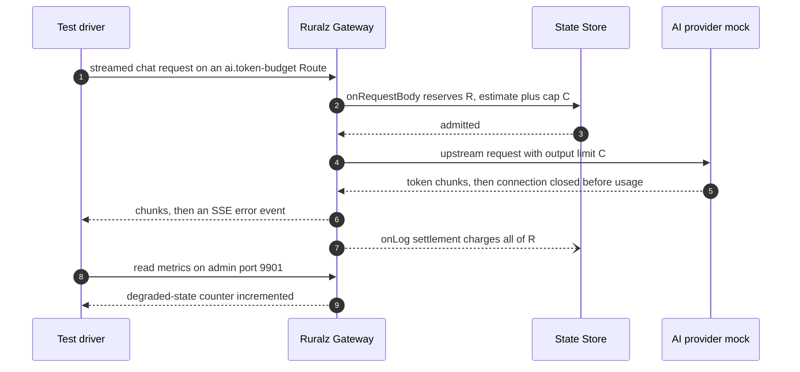

# Testing and Quality Strategy

## Summary

This document fixes how Ruralz proves code matches design: test layers and CI stages, three conformance suites (configuration, Plugin ABI, protocol), fuzzing, chaos, benchmark gates, security scanning, the Plugin SDK and AI provider harnesses, and release gates, all `Planned (Mx)`. Each new package, Policy type, protocol or Host Function arrives with the tests required here.

## Scope and non-goals

In scope: tests for `ruralzd` (Ruralz Gateway), `ruralz-control` (Ruralz Control), the `ruralz` CLI, the Plugin Development Kits (PDKs) and the Bundle schema, their CI stages and release evidence, under the [foundation pack](../_meta/foundation-pack.md) v1 and P10 ([Vision](../vision/01-vision-and-positioning.md#principles)).

Non-goals, owned elsewhere: budget values and thresholds ([Performance budgets and benchmarking](../architecture/12-performance-budgets-and-benchmarking.md)); signing and skew ([Release, versioning and compatibility](04-release-versioning-and-compatibility.md)); numbered CI jobs and the Ruralz Console toolchain ([Repository layout](02-repository-layout-and-conventions.md)); the threat model ([Security and identity](../architecture/08-security-and-identity.md)); the `ruralz test run` case format ([CLI and API surface](../reference/01-cli-and-api-surface.md)).

## Test pyramid

A defect found in a higher layer MUST add a regression test at the lowest layer that reproduces it.

| Layer | Tools | Coverage target | CI stage | Milestone |
|---|---|---|---|---|
| Unit | Go `testing`, race detector, injected clock | 80% statement coverage per `internal/` package; 90% for loader, validation, precedence, canonical form (target) | `pr-fast` | Planned (M0) |
| Property | `testing.F`; model-based state machines | Every [required property](#required-properties): 100% (target) | `pr-fast` | Planned (M1) |
| Golden | Checked-in expected files | 100% byte-exact (target) | `pr-fast` | Planned (M1) |
| Integration | testcontainers-go v0.44.x | Every State Store Policy type and messaging protocol: 100% (target) | `pr-full` | Planned (M1) |
| Conformance | The three [suites](#conformance-suites) | 100% of cases per production platform (target) | `pr-full` | Planned (M1) to Planned (M4) |
| Fuzzing | Go native fuzzing | 25 or more targets by M2; zero open crashers at release (target) | `pr-fast` seeds; `nightly` | Planned (M1) |
| End-to-end | Docker Compose, kind, `ruralz test run` | Every pack section 9 command by its milestone: 100% (target) | `main` | Planned (M1) |
| Chaos | Fault injection | Every System overview failure row and Scalability chaos experiment by its milestone: 100% (target) | `nightly` | Planned (M1); Ruralz Control, Plugin and signature rows Planned (M2) |
| Benchmarks | `go test -bench -benchmem`; open-loop load | Every seed budget item from its component's milestone: 100% (target) | `pr-full`; `nightly` | Planned (M1); Plugin Phase call Planned (M2) |
| Security scanning | `govulncheck`, license gate, golangci-lint, `buf breaking` | Zero reachable vulnerabilities (target) | `pr-fast`; secret leak tests in `main` | Planned (M0); `buf breaking` Planned (M2) |

| Stage | Trigger | Wall-clock budget |
|---|---|---|
| `pr-fast` | Every pull request and merge queue run | 10 minutes (target) |
| `pr-full` | Go, proto or schema changes, and merge queue runs | 30 minutes (target) |
| `main` | Every merge | 45 minutes (target) |
| `nightly` | Daily, four parallel jobs | Longest job 3 hours (target) |
| `release` | A release candidate tag | Not bounded |

`nightly` keeps noisy work off the latency machine:

| `nightly` job | Runs on | Work |
|---|---|---|
| Fuzz | General runners, sharded | Each target 15 minutes, eight per shard (target) |
| Chaos | General runners | Every [chaos scenario](#chaos-testing) |
| Scale | Dedicated general runners | SM-9, SM-10 |
| Latency | Reference hardware, alone | Macro latency gate |

*Figure 1: the CI stages; `pr-fast` and `pr-full` block merge, while `main` and `nightly` failures block the next release.*


`pr-fast` builds the three binaries with `CGO_ENABLED=0` for linux/amd64 and linux/arm64 ([tech stack](01-tech-stack-and-libraries.md#selection-criteria) gate G1, [ADR-0001](../adr/0001-implementation-language-go.md)); shipped binaries come only from `release`. CLI unit and golden tests also run on darwin/arm64, darwin/amd64 and windows/amd64, with identical digests.

## Unit and property tests

Unit tests are hermetic: time, randomness and the State Store arrive as failure-injecting fakes, and tests run shuffled under the race detector. Race jobs set `CGO_ENABLED=1` for test binaries only, with the `netgo,osusergo` build tags; a second `pr-fast` job runs the same tests without `-race` under `CGO_ENABLED=0`, so the shipped configuration is tested. A floor job repeats them on Go 1.26 (`GOTOOLCHAIN=local`, `GOEXPERIMENT=jsonv2`); its JSON golden output MUST match the release job ([tech stack](01-tech-stack-and-libraries.md#version-floor)).

### Required properties

Each property is a `testing.F` target until a property library is chosen (OQ-testing-and-quality-strategy-1): seeds in `pr-fast`, longer fuzzing in `nightly`.

| Area | Property | Source |
|---|---|---|
| Canonical form | Reordering files or `map` and `set` lists, or reformatting, keeps the Revision; YAML and JSON give one digest | [Canonical form](../architecture/02-configuration-model.md#canonical-form-and-revision) |
| Render | Rendering a rendered Bundle again yields the same Revision, including `$${` escapes | [Overlays](../architecture/02-configuration-model.md#overlays) |
| Conversion | Every field round-trips through the hub type; converting apiVersions keeps the Revision | [Conversion](../architecture/02-configuration-model.md#hub-and-spoke-conversion) |
| Substitution | `${VAR}` never injects structure or appears in forbidden positions | [Substitution](../architecture/02-configuration-model.md#environment-substitution) |
| Precedence | One Policy per slot per scope; `overridable: false` Policies are never removed; order follows Filter class, scope and list position; response Phases reverse, `onLog` keeps request order | Pack section 8.12 |
| Diff | `diff(A, A)` is empty, exit 0; `diff(A, B)` is empty exactly when Revisions are equal; added and removed identities are set differences, mirrored in `diff(B, A)`; field ops turn A's canonical form into B's (`SecretValue` by reference); reordering `map` or `set` lists yields no op | [Diff semantics](../architecture/02-configuration-model.md#diff-semantics) |
| Rate Limit | With a deterministic clock, admission per key stays within the limit with a healthy State Store, and within N × per-Node ceiling (target) while failing open | Pack section 8.8, [ADR-0008](../adr/0008-rate-limiting-local-bucket-and-gcra.md) |
| Token Budget | R is reserved only if the remaining budget covers it; settlement charges each attempt's reported usage once, plus all of R once per request when any attempt that reached the provider reported no usage, and releases the rest of R; overshoot stays within the sum of concurrent input-estimate errors (hypothesis; SM-10), plus (attempts - 1) x R per concurrent request (hypothesis), plus hidden reasoning above C on `gemini` and `ollama` (OQ-ai-llm-gateway-17). If OQ-ai-llm-gateway-15 closes, the property follows it | Pack section 8.9, [AI/LLM gateway](../architecture/06-ai-llm-gateway.md) |
| Rollout | Under random ACK, NACK, timeout and reconnect events, every transition is in the state table | Pack section 8.3 |
| Last-Known-Good, Control mode | A candidate is promoted exactly when the active digest equals the promoted digest, also after reconnect, Enrollment or scale-out; never after a failed canary | Pack section 8.2 |
| Last-Known-Good, file mode | Promotion on activation; a Revision that failed validation is never activated or promoted | Pack section 8.2 |

Illustrative, not final code:

```go
// Digest stability: reordering unordered lists or files never changes the Revision.
func FuzzRevisionStableUnderReorder(f *testing.F) {
    for _, bundle := range goldenCorpus(f) {
        f.Add(bundle, int64(1))
    }
    f.Fuzz(func(t *testing.T, bundle []byte, seed int64) {
        want, err := buildRevision(bundle)
        if err != nil {
            t.Skip("invalid input is covered by the negative corpus")
        }
        got, err := buildRevision(reorderUnordered(bundle, seed))
        if err != nil || got != want {
            t.Fatalf("digest changed under reordering: %v, %s != %s", err, got, want)
        }
    })
}
```

### Golden tests

The golden corpus pins Bundle digests (including `shop-bundle`), diagnostics, `ruralz bundle render --effective` tables and `ruralz.diff.v1` documents. Every release MUST reproduce it byte for byte, deliberate default changes excepted ([ADR-0003](../adr/0003-configuration-format.md)). `.gitattributes` MUST mark golden files `eol=lf` for Windows checkouts.

## Integration tests

Integration tests run in `pr-full` on testcontainers-go, a test-only [catalog](01-tech-stack-and-libraries.md#library-catalog) module ([source](https://github.com/testcontainers/testcontainers-go)), with images pinned by digest, as research did not check module defaults ([source](https://golang.testcontainers.org/modules/)).

| Dependency | Container source | Used for | Milestone |
|---|---|---|---|
| Redis 8 | `modules/redis` ([source](https://golang.testcontainers.org/modules/)) | `redis` State Store driver: GCRA script, Quota, Response Cache, Token Budget; Vector Sets for the Semantic Cache | Planned (M1); Token Budget and Semantic Cache Planned (M3) |
| Valkey 9.0.1 or newer | `modules/valkey` ([source](https://golang.testcontainers.org/modules/)) | The same tests; valkey-search 1.2, and a server without it for the degraded path | Planned (M1); Token Budget and Semantic Cache Planned (M3) |
| Redis Cluster and Valkey cluster | Generic containers, three primaries, Linux runners only, since members announce container IPs ([source](https://github.com/testcontainers/testcontainers-go)) | Consumptive calls sharing a hash slot run as one script; others run sequentially, stop at the first deny and never hit `CROSSSLOT` (pack section 8.7) | Planned (M1); Token Budget Planned (M3) |
| Dragonfly | Generic container ([source](https://github.com/testcontainers/testcontainers-go)) | The same driver tests and scripts; the degraded Semantic Cache path (pack section 7) | Planned (M1); Semantic Cache Planned (M3) |
| Kafka | `modules/kafka`, KRaft, a CI-suitable image, not `confluent-local` ([source](https://golang.testcontainers.org/modules/kafka/)) | `kafka` Upstreams (franz-go) | Planned (M4) |
| NATS | `modules/nats` ([source](https://golang.testcontainers.org/modules/nats/)) | `nats` Upstreams (nats.go/jetstream) | Planned (M4) |
| MQTT | `modules/mosquitto` ([source](https://golang.testcontainers.org/modules/mosquitto/)) | `mqtt` Upstreams (paho.golang); embedded broker mode | Planned (M4) |
| OCI registry | `modules/registry` ([source](https://golang.testcontainers.org/modules/)) | Revision and Plugin pulls by digest with Sigstore verification | Planned (M2) |

Authentication tests replace Mosquitto's anonymous default ([source](https://golang.testcontainers.org/modules/mosquitto/)). Required State Store scenarios:

- After a script cache flush, `EVALSHA` (the cached form of pack section 8.8's single GCRA `EVAL`) meets `NOSCRIPT`. That request applies the Policy's `failureMode` without a second round trip (pack section 8.7 rule 1). The Node reloads the script off the request path, and the next request's `EVALSHA` succeeds ([Traffic management and resilience](../architecture/09-traffic-management-and-resilience.md)).
- A full post-commit queue drops writes with a counter, never delaying the response.
- A slow vector search never delays a rate-limit reply.
- Without vector support, `ai.semantic-cache` behaves as a State Store failure under its `failureMode`; the Node reports a degraded state.

Container-free tests run three Ruralz Control replicas and Nodes in one process over loopback mutual TLS ([ADR-0007](../adr/0007-control-stream-protocol.md)), each instance with its own `RURALZ_DATA_DIR`, OpenTelemetry providers and `slog` logger: snapshot and delta delivery, ACK and NACK classification, promoted digests, backup then restore. Their fencing test, Planned (M2), proves a deposed leader's entry at a taken sequence commits but is never accepted or delivered, and a new leader proposes only after Barrier; its `postgres` Control Store variant, Planned (M4), proves the transaction rejects that entry ([ADR-0006](../adr/0006-control-store-raft-boltdb.md)).

## End-to-end tests

End-to-end tests drive real binaries with `ruralz test run` (pack section 9); until it lands in M2, a Go driver runs the cases.

| Environment | Topology | What only it can show | Milestone |
|---|---|---|---|
| Docker Compose | File mode: two Nodes, a State Store, mock Upstreams, an OpenTelemetry collector, and from M2 an OCI registry; Control mode adds three Ruralz Control replicas and the AI provider mock | Rollouts, Last-Known-Good boots, Hot Reload, Drain, signed OCI pulls | Planned (M1) file mode; Planned (M2) Control mode and OCI pulls; mock Planned (M3) |
| kind | The Helm chart, CRDs and Ruralz Control | CRD ingestion, `provider: kubernetes` secrets, EndpointSlice discovery, rolling pod replacement with readiness gating and Drain | Planned (M2) |

Every run injects a canary secret through `secretRef` and fails if it appears in a log, `/config/dump`, `/tap` output, diff or trace; `/debug/pprof` heap profiles are excluded ([Secrets](../architecture/02-configuration-model.md#secrets-and-environment-variables)).

| Required scenario | Milestone |
|---|---|
| 1. The scripted quickstart reaches a first proxied request in 10 minutes or less (target) on a clean machine (SM-7) | Planned (M1) |
| 2. `shop-bundle` serves its Routes with the Filter Chains `ruralz bundle render --effective --route` prints | REST Planned (M1); gRPC and AI Planned (M3) |
| 3. A canary Rollout with a deterministic NACK ends `rolled-back`, or `paused` with `autoRollback: false` until `ruralz rollout resume` | Planned (M2) |
| 4. With Ruralz Control stopped, Nodes keep serving and stay ready; a restarted Node boots Last-Known-Good after up to 5 s (target) | Planned (M2) |
| 5. A Hot Reload keeps open WebSocket and SSE streams on their starting snapshot | Planned (M3) |
| 6. `ruralz bundle diff` against a Node's `/config/dump` shows an injected difference | Planned (M1) |
| 7. A Zero-Downtime Upgrade under load fails zero requests on TCP listeners (target), for clients honoring `Connection: close` and GOAWAY | Planned (M1) |

## Conformance suites

Conformance suites test published contracts; each is versioned with its contract and also runs outside Ruralz CI.

| Suite | Contract under test | Cases | Runs against | CI stage | Milestone |
|---|---|---|---|---|---|
| Configuration | JSON Schema (both views), restricted YAML profile, `ruralz.canonical.v1`, `ruralz.diff.v1`, RZ-CFG registry | Golden corpus; one negative fixture per offline RZ-CFG code with file, line and column, its metadata naming stage, binaries and source mapping; CEL cost and overlay fixtures | `ruralz` and `ruralz-control` MUST emit identical diagnostics; `ruralzd` MUST match for its stages (rendered Bundle in file mode, reference resolution onward in Control mode) | `pr-full` | Planned (M1); CRD path Planned (M2) |
| Plugin ABI | `ruralz.plugin.v1`: Host Functions, memory conventions, Capabilities, limits, every Phase | Reference Plugins per Phase; denied Capabilities; trap, deadline and memory cases with `RZ-PLG` codes | The `ruralzd` and `ruralz plugin test` hosts, every Ruralz PDK, the proxy-wasm adapter | `pr-full` | Planned (M2); adapter Planned (M4) |
| Protocol | Per-protocol Phase mappings (P7) and wire behavior | HTTP/1.1, HTTP/2; gRPC, gRPC-Web and Connect with trailers, deadlines and all stream types; WebSocket; SSE; GraphQL federation; AI dialects; event protocols | Ruralz Gateway through its listeners | `pr-full` | Planned (M1) HTTP; Planned (M3) streaming, gRPC, GraphQL, AI and HTTP/3; Planned (M4) events |

The codes of the five checks that can fail after a green offline run ([Validation and diff semantics](../architecture/02-configuration-model.md#validation-and-diff-semantics)) may carry no source position; integration and end-to-end cases assert code and resource identity wherever raised: RZ-CFG-024 at Rollout, NACK or file-mode load; RZ-CFG-026 at NACK or load; RZ-CFG-027 at `ruralz bundle push`, OCI pull, Control Stream delivery and Last-Known-Good boot; RZ-CFG-028 and RZ-CFG-033 in `ruralz bundle build`, `validate --online`, Ruralz Control ingest and Node activation, RZ-CFG-033 also for Revision signatures at Node activation (pack sections 8.1 and 8.14).

The configuration suite also re-runs the JSON-Schema-Test-Suite and the YAML Test Suite, because the selected libraries self-report test-suite results ([source](https://github.com/santhosh-tekuri/jsonschema/blob/boon/README.md)) ([source](https://github.com/goccy/go-yaml/blob/master/README.md)); an upgrade that loses a passing case fails.

The Plugin ABI suite is the promise to Plugin authors ([ADR-0005](../adr/0005-plugin-abi-v1.md)): a PDK is maintained only while it passes, with wazero in compiler mode on production platforms.

The protocol suite runs the Autobahn cases, which the selected WebSocket library passes ([source](https://github.com/coder/websocket)), through Ruralz Gateway's listeners and a `websocket` Upstream. Its AI dialect fixtures verify Prompt Cache marker preservation in 100% of cases (target) (SM-11). Frame-level HTTP/2 and HTTP/3 suites await research (OQ-testing-and-quality-strategy-6).

## Fuzzing

Go native fuzzing covers every surface parsing untrusted or operator-supplied bytes, seeded from the golden and negative corpora; each crasher becomes a committed seed before its fix merges. No target may panic, hang or crash the Node.

| Target family | Oracle | Milestone |
|---|---|---|
| Restricted YAML loader | Rejections carry RZ-CFG-001 to RZ-CFG-004; memory stays bounded under alias bombs | Planned (M1) |
| Env substitution and overlay merge | Output validates or fails with a registered code | Planned (M1) |
| CEL compile and cost estimator | A finite estimate, or RZ-CFG-014 or RZ-CFG-015; at nominal input sizes, actual cost stays within the static estimate; on any capped input, evaluation finishes or stops with the runtime cost-limit error at 1,000,000 units (target), handled per its place's runtime-error rule ([Allowed places](../architecture/02-configuration-model.md#allowed-places)) | Planned (M1) |
| Canonicalization | Parse, canonicalize and parse again: identical bytes | Planned (M1) |
| Router match and header handling | Matches equal those of a reference matcher | Planned (M1) |
| Control Stream decoding, one target per message type | Malformed messages NACK or close the stream | Planned (M2) |
| Plugin Host Functions, one target per Host Function group | Out-of-bounds guest pointers and lengths trap the guest, never the host | Planned (M2) |
| Rego and Cedar policy parsing for `authz.opa` and `authz.cedar` ([ADR-0011](../adr/0011-expressions-and-authorization-engines.md)) | Malformed policies are rejected before activation; accepted ones stay within the per-Revision engine-memory cap (target) | Planned (M2) |
| GraphQL operation parser and normalizer ([ADR-0012](../adr/0012-graphql-engine-graphql-go-tools.md)) | Depth, alias, field-count and complexity limits hold after fragment expansion, before any upstream call | Planned (M3) |
| AI stream parsers, one target per dialect | Moving chunk boundaries: extracted usage equals the fixture's final usage; mutated content: correct usage or usage reported missing | Planned (M3) |

Property targets plus the per-message and per-group targets make 25 or more by M2 (target). The `nightly` fuzz job keeps the grown corpus as a CI artifact. Fuzzing beyond CI is OQ-testing-and-quality-strategy-4.

## Chaos testing

Chaos tests prove P9: each [System overview failure table](../architecture/01-system-overview.md#failure-semantics-at-component-boundaries) row is injected under load, its declared behavior asserted through metrics and responses. The `nightly` chaos job also runs each [Scalability chaos experiment](../architecture/11-scalability-and-distributed-state.md#chaos-experiments) against at least 10 Nodes (target), which owns their pass criteria, and each gates its milestone: CE-1 to CE-6, CE-12, CE-15 and CE-16 Planned (M1); CE-7 to CE-10 Planned (M2); CE-13 and CE-14 Planned (M3); CE-11 and CE-17 Planned (M4).

| Injected failure | Assertion | Milestone |
|---|---|---|
| One Node killed at 50% load (target), or sent SIGTERM while holding connections (CE-1, CE-2) | Errors only on its in-flight requests; no Quota under-charge; zero failed new requests during Drain | Planned (M1); WebSocket and SSE Drain Planned (M3) |
| Ruralz Control replicas killed; Raft quorum lost | Nodes keep their active Revision and stay ready; zero outage-caused errors (target) | Planned (M2) |
| Node restarted during that outage | Boots Last-Known-Good after the boot wait, else stays not ready | Planned (M2) |
| State Store slower than `stateStoreTimeout`, then stopped | At most one deadline per request, then `failureMode`; the breaker opens; admission within N × per-Node ceiling (target); `closed` Policies reject with `RZ-STS` (CE-3 to CE-5) | Planned (M1) |
| Upstream Endpoints reset or slowed | Outlier ejection, budgeted retries and an open breaker, with `RZ-UP` codes | Planned (M1) |
| AI provider mock returns 429 before the first byte | Provider Fallback to the next `AIModel` candidate | Planned (M3) |
| Plugin traps, loops or reaches `limits.maxPluginMemoryBytes` | `RZ-PLG` under `failureMode`; the Node never crashes | Planned (M2) |
| Revision with a bad digest or signature | Rejected before any swap (NACK in Control mode) ([ADR-0017](../adr/0017-artifact-signing.md)) | Planned (M2) |
| Leader failover with every Node reconnecting | Jittered reconnects; each Node gets only its planned Revision | Planned (M2) |
| One Cell's State Store lost | Only that Cell degrades | Planned (M4) |

Faults come from container stop, pause and kill, kind pod deletion and a TCP fault proxy (OQ-testing-and-quality-strategy-3). A degraded state without a metric fails its scenario (P10).

## Benchmarks and regression gates

[Performance budgets and benchmarking](../architecture/12-performance-budgets-and-benchmarking.md) owns values, hardware, load tools and both thresholds; this document places the gates. M1 gates cover the seed budgets whose components land in M1; the Plugin Phase call budget joins at M2 (SM-6); the M4 bench suite extends them.

**Regression policy.** A change fails when it regresses p99 latency by more than 5% (target) or alloc/op by more than 3% (target) against its gate's baseline. The alloc/op baseline is the merge base, benchmarked interleaved with the head in one `pr-full` job, at least 10 runs each (target; OQ-testing-and-quality-strategy-2); the macro latency baseline is the previous `nightly` latency result on the reference hardware; the release job re-runs the previous release's benchmarks on the same machine.

| Gate | Measures | Stage | Fails when | Milestone |
|---|---|---|---|---|
| Microbenchmarks | Router match, Filter Chain executor, CEL, canonicalization, validation, Plugin Phase call per Phase, pooled instance, deadline interruption enabled (SM-6); `testing.AllocsPerRun` around Router and Filter Chain executor, with a pre-parsed HTTP/1.1 request and discard `ResponseWriter` | `pr-full` | alloc/op above its threshold | Planned (M1); Plugin Phase call Planned (M2) (SM-6) |
| Macro latency | SM-4 and SM-5 reference scenario, open-loop; a same-zone GCRA round trip | `nightly` latency job, `release` | p99 above its threshold, or a seed budget exceeded | Planned (M1) |
| SM-9 | 20 or more `all-at-once` Rollouts per run (target), Plugins cached, from Revision recorded to last ACK; 100 Nodes (target), three Ruralz Control replicas (OQ-testing-and-quality-strategy-10) | `nightly` scale job, `release` | Above 30 s at p95 (target) | Planned (M2) |
| SM-10 | AI provider mock: B = 1,000,000 tokens, 200 concurrent streams, 2,000-token prompts, `max_tokens` = 4,096; usage 2% above the estimate on every stream, dropped on 5% of streams (hypothesis) | `nightly` scale job, `release` | Overshoot above the sum of per-stream estimate error, or above 1% of B (hypothesis) | Planned (M3) |
| Size | Stripped `ruralzd` binary; idle RSS with no Revision loaded | `pr-full` | Above 160 MiB or 89 MiB respectively (target) ([Memory budget](../architecture/12-performance-budgets-and-benchmarking.md#memory-budget)) | Planned (M1) |

The alloc gate runs with `GOGC=off` and fixed `GOMAXPROCS`, so GC cycles cannot empty `sync.Pool` mid-run; at 30 allocations (hypothesis), one extra allocation exceeds 3% (target). Macro runs use open-loop load, because closed-loop generators slow down with the system and hide latency ([source](https://grafana.com/docs/k6/latest/using-k6/scenarios/concepts/open-vs-closed/)) ([source](https://github.com/giltene/wrk2)).

Seeds from the [System overview](../architecture/01-system-overview.md#worked-example-a-rate-limited-route-in-a-brownout): gateway-added p50 of 150 µs or less, p99 of 1 ms or less, from M2 a WASM Plugin Phase call on a pooled instance, deadline interruption enabled, of 50 µs or less at p99 (target); a GCRA round trip of 1 ms or less at p99 and 30 or fewer Ruralz-owned allocations per pass-through HTTP/1.1 request, excluding `net/http` internals (hypothesis). From the [Configuration model](../architecture/02-configuration-model.md#limits): typical match and key expressions under 2 µs at p99 (target). Results publish with commit, hardware and raw histograms (P10); tooling is OQ-testing-and-quality-strategy-2.

## Security scanning

Static checks run in `pr-fast`, block merge and enforce the [tech stack](01-tech-stack-and-libraries.md#dependency-hygiene) admission rules.

| Check | What fails the build | Stage | Milestone |
|---|---|---|---|
| `govulncheck` and `go mod verify` | A reachable vulnerability or checksum mismatch | `pr-fast` | Planned (M0) |
| License gate (G2) | A linked package outside the allowlist and named MPL-2.0 exceptions | `pr-fast` | Planned (M0) |
| Crypto denylist (G3) | A crypto package off the allowlist; a FIPS job adds `GOFIPS140` builds and tests, HTTP/3 cases excepted | `pr-fast` | Planned (M0); FIPS job Planned (M5) |
| golangci-lint | A finding; a pinned binary, since it is GPL-3.0 ([source](https://github.com/golangci/golangci-lint/blob/v2.13.2/LICENSE)) | `pr-fast` | Planned (M0) |
| `buf lint` and `buf breaking` | A breaking change to `ruralz.control.v1` or `ruralz.plugin.v1` ([source](https://github.com/bufbuild/buf)) | `pr-fast` | Planned (M2) |
| No-license-check scan | A license-key or entitlement check, found by the [repocheck](02-repository-layout-and-conventions.md) source scan (P1; SM-1: 0 gated features, target) | `pr-fast` | Planned (M0) |
| Redaction unit tests | A `secretRef` value in `/config/dump`, diff or log encoder output | `pr-fast` | Planned (M1) |
| Secret leak tests | The [end-to-end](#end-to-end-tests) canary secret appears in any output | `main`, `release` | Planned (M1) |
| `ruralz bundle audit` | An unexpected finding on the golden corpus | `pr-fast` | Planned (M2) |

The Plugin ABI suite and Host Function fuzzing hunt sandbox escapes (SM-13: none unpatched after 30 days, target). Image scanning is OQ-testing-and-quality-strategy-5.

## Plugin SDK and AI provider harnesses

### Plugin SDK harness

`ruralz plugin test`, Planned (M2), runs Phase, limit and Capability cases on the same wazero host code and limits as `ruralzd`, with failure-injecting host fakes (State Store, clock, random source), per the [WASM plugin system](../architecture/05-wasm-plugin-system.md). In `pr-full`, every PDK's `ruralz plugin init` scaffold MUST pass `ruralz plugin test` unchanged. A case without host fakes that passes under one host and fails under the other is a release-blocking host bug.

### AI provider mock

The AI provider mock, a test-only Go HTTP server, speaks each `AIProvider` dialect; tests point `AIProvider.spec.baseUrl` at it, so the Node runs its production path ([ADR-0014](../adr/0014-ai-api-surface.md)). It is Planned (M3) and never ships.

| `dialect` | Streaming shape the mock emits | Usage it reports |
|---|---|---|
| `openai` | SSE `data:` chunks ending in `data: [DONE]` ([source](https://github.com/openai/openai-python/blob/main/src/openai/types/chat/chat_completion_stream_options_param.py)) | A `choices: []` usage chunk before `[DONE]`, only with `stream_options.include_usage`; otherwise `usage: null` |
| `anthropic` | Named events `message_start`, `content_block_*`, `message_delta`, `message_stop`, `ping` and `error` ([source](https://platform.claude.com/docs/en/build-with-claude/streaming)) | Input and cache fields in `message_start`; cumulative counts in `message_delta.usage` |
| `gemini` | SSE through `alt=sse` ([source](https://ai.google.dev/api/generate-content)) | `usageMetadata` with `cachedContentTokenCount` and `thoughtsTokenCount`; every chunk or only the last is unconfirmed, so the mock emits both |
| `bedrock` | An event stream ending with a `metadata` event ([source](https://docs.aws.amazon.com/bedrock/latest/APIReference/API_runtime_ConverseStream.html)); any SigV4 signature passes, as the signer is unselected (OQ-tech-stack-and-libraries-17) | Uncached `inputTokens`, `cacheReadInputTokens`, `cacheWriteInputTokens` ([source](https://docs.aws.amazon.com/bedrock/latest/userguide/prompt-caching.html)) |
| `mistral` | SSE ending in `data: [DONE]` ([source](https://docs.mistral.ai/api/)) | `usage` in the final message; its chunk placement is unconfirmed ([source](https://docs.mistral.ai/api/)) |
| `ollama` | NDJSON | A final `done: true` object with `prompt_eval_count` and `eval_count` ([source](https://docs.ollama.com/api/chat)) |

Unit cases script chunks, timing, token counts and at most one fault per stream; scale scenarios such as SM-10 mix faults:

- **Missing usage.** The stream ends before its usage chunk, which OpenAI warns can happen on interruption ([source](https://github.com/openai/openai-python/blob/main/src/openai/types/chat/chat_completion_stream_options_param.py)); settlement MUST charge all of R and emit the degraded-state metric.
- **Cumulative usage.** `message_delta` counts grow; the extractor MUST take the last, never the sum ([source](https://platform.claude.com/docs/en/build-with-claude/streaming)).
- **Throttling.** 429 with and without `retry-after`, including Anthropic's spend-cap 429 ([source](https://platform.claude.com/docs/en/api/rate-limits)), and Bedrock `throttlingException` (429) ([source](https://docs.aws.amazon.com/bedrock/latest/APIReference/API_runtime_ConverseStream.html)).
- **Mid-stream error.** An error before the first content event (Anthropic `error` after `message_start`, Bedrock `modelStreamErrorException`) MUST cause Provider Fallback; after it, the Node ends the stream with `RZ-AI-009` and never falls back.
- **Overlong output.** More output tokens than C; the `onChunk` streaming guard MUST end the stream, and the local count is never billed.

Recorded request bodies show that C reached the upstream output-token limit, `cache_control` markers arrived byte for byte on native passthrough (SM-11), and, for `openai` Chat Completions, the Node set `stream_options.include_usage` and hid the usage chunk from clients that did not ask ([AI/LLM gateway](../architecture/06-ai-llm-gateway.md)). The `ollama` dialect also serves embeddings for air-gapped Semantic Cache tests.

*Figure 2: a Token Budget test against the AI provider mock, with a stream that loses its usage chunk.*



Fixtures follow provider documentation; unconfirmed placements and live checks are OQ-testing-and-quality-strategy-7.

## Release gates

A release candidate becomes a release only when every gate below passes on its exact commit, where the `release` stage re-runs every other stage and `nightly` job. Skipping a gate needs a release-notes entry and a maintainer's approval from outside the author's team.

| Gate | Evidence | From |
|---|---|---|
| All CI stages green | Every stage re-run on the candidate commit, with floor and release jobs | Planned (M0) |
| Golden corpus | Byte-exact, except entries recording a deliberate change | Planned (M1) |
| Conformance | 100% of cases for shipped features (target); every PDK passes the Plugin ABI suite of every supported release line | Planned (M1) |
| Fuzzing | Zero open crashers; every fixed crasher has a regression seed | Planned (M1) |
| Chaos | Every chaos scenario and CE experiment shipped by the candidate's milestone passed on the candidate commit | Planned (M1) |
| Benchmarks | Within 5% p99 and 3% alloc/op of the previous release (target); every seed budget met from the milestone introducing its component | Planned (M1) |
| Security scanning | Every check in [Security scanning](#security-scanning) green | Planned (M0) |
| Compatibility | `buf breaking` against the last tag of each supported release line; a previous-release Node gets a skew-checked Revision (RZ-CFG-024); a Zero-Downtime Upgrade from it fails no requests (target) | Planned (M2) |
| Docs gate | [verify-docs.mjs](../../scripts/verify-docs.mjs) clean for every changed document | Planned (M0) |
| FIPS build | The same tests pass on the `GOFIPS140` artifacts, except HTTP/3 cases, which assert `http3: true` is refused or inert (foundation pack section 8.4, OQ-tech-stack-and-libraries-9) | Planned (M5) |

Signing and SBOM follow [Release, versioning and compatibility](04-release-versioning-and-compatibility.md); the tested commit MUST be the signed commit.

## Open questions

| ID | Question | Options | Owner | Blocking? |
|---|---|---|---|---|
| OQ-testing-and-quality-strategy-1 | Should property tests use a dedicated library? | (a) `testing.F` only; (b) a researched library | tech-stack-and-libraries | No |
| OQ-testing-and-quality-strategy-2 | Which statistics tool and runner hardware back the benchmark gates? | (a) Bare metal for both; (b) cloud instances, more repetitions; (c) alloc/op shared, latency bare metal (current) | performance-budgets-and-benchmarking | Yes, for the M1 benchmark gate |
| OQ-testing-and-quality-strategy-3 | Which tool injects chaos network faults? | (a) A Ruralz Go proxy; (b) a researched proxy; (c) kernel traffic control | testing-and-quality-strategy | No |
| OQ-testing-and-quality-strategy-4 | Should fuzzing continue outside CI? | (a) CI only (current); (b) an external program after research | testing-and-quality-strategy | No |
| OQ-testing-and-quality-strategy-5 | Which scanner checks container images? | (a) Research, then a selection; (b) `govulncheck` on binaries only | release-versioning-and-compatibility | No |
| OQ-testing-and-quality-strategy-6 | Which frame-level HTTP/2 and HTTP/3 suites join the protocol suite? | (a) Research, then adoption; (b) Ruralz frame tests | multi-protocol | Yes, for the M3 protocol suite |
| OQ-testing-and-quality-strategy-7 | Where does `usage` sit in `mistral` stream chunks, is `gemini` `usageMetadata` on every chunk, and should a job check the mock against live providers? | (a) Documentation fixtures only (current); (b) a scheduled job with Revington-funded keys; (c) community reports | ai-llm-gateway | Yes, for the M3 `mistral` and `gemini` fixtures |
| OQ-testing-and-quality-strategy-8 | What format do `ruralz test run` cases use? | (a) Versioned YAML owned by the CLI reference; (b) a Go test API only | cli-and-api-surface | Yes, for the M2 end-to-end suite |
| OQ-testing-and-quality-strategy-9 | Which tools and coverage target apply to Ruralz Console? | (a) Chosen with its toolchain; (b) browser end-to-end tests only | repository-layout-and-conventions | No |
| OQ-testing-and-quality-strategy-10 | Where does the 100-Node SM-9 scenario run? | (a) 100 `ruralzd` processes on dedicated runners; (b) a cloud Kubernetes cluster per run; (c) kind | performance-budgets-and-benchmarking | Yes, for the M2 SM-9 gate |
