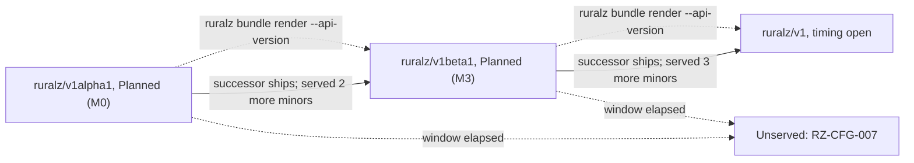
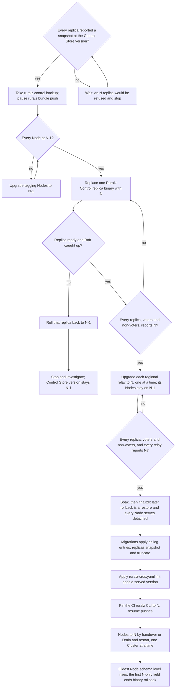
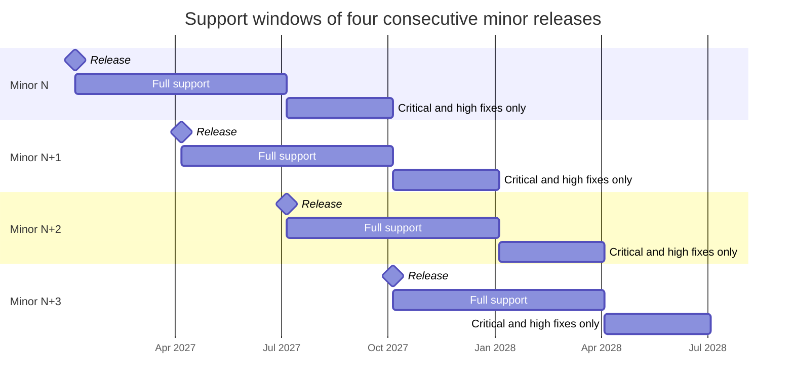

# Release, Versioning and Compatibility

## Summary

This document fixes how Ruralz is versioned, released and kept compatible: one Semantic Versioning scheme for every binary and the Helm chart; own identifiers and change rules for the Bundle apiVersion, Plugin ABI v1 and the Control Stream; N and N-1 skew between Ruralz Control, Ruralz Gateway and the CLI, with a finalize step for Raft upgrades; quarterly releases with support windows in months; security fixes by severity, public to everyone at once; and signed artifacts with SBOM and provenance. Nothing is implemented yet; all of it is Planned. Contributors, operators and plugin authors should read it.

## Scope and non-goals

In scope: versions, versioned interfaces, deprecation, skew, upgrade order, cadence, support, security fixes and artifacts. "Pack 8.14" names a section of the binding [foundation pack](../_meta/foundation-pack.md).

Non-goals:

- Revision and Plugin signing ([ADR-0017](../adr/0017-artifact-signing.md)); supply-chain requirements come from [Security and identity](../architecture/08-security-and-identity.md#release-supply-chain).
- Kinds, fields, schema levels and conversion ([Configuration model](../architecture/02-configuration-model.md#apiversion-versioning-and-migration)).
- Upgrade procedures ([Zero-downtime upgrades and hot reload](../operations/02-zero-downtime-upgrades-and-hot-reload.md)), test gates ([Testing and quality strategy](03-testing-and-quality-strategy.md)), libraries ([Tech stack and libraries](01-tech-stack-and-libraries.md)) and dates ([Roadmap and milestones](../roadmap/01-roadmap-and-milestones.md)).

## Semantic versioning

### One product version

`ruralzd`, `ruralz-control`, the `ruralz` CLI, the Helm chart and the published JSON Schema share one product version, `MAJOR.MINOR.PATCH` in Semantic Versioning 2.0.0 syntax, tagged `vMAJOR.MINOR.PATCH` on `github.com/ravindu-rev/ruralz`; one tag builds every artifact. Binaries embed version, commit and build flavor through `-ldflags -X` ([Tech stack and libraries](01-tech-stack-and-libraries.md#static-builds)), printed by `ruralz version`. Milestones are feature sets, not versions; the first release is `0.1.0`, Planned (M1).

| Change | Patch `x.y.Z` | Minor `x.Y.0` | Major `X.0.0` |
|---|---|---|---|
| Security fix, dependency or toolchain bump, bug fix changing no Revision | Yes | Yes | Yes |
| `ruralz/v1alpha1` default change or digest-changing render fix, shipped as a new schema level with a golden-corpus entry; new feature, Policy type, CLI verb or flag, metric, error code, field, Host Function or Control Stream field | No | Yes | Yes |
| Deprecation, or removal after its window in a surface that is not stable | No | Yes | Yes |
| Removal or incompatible change in a stable surface | No | No | Yes, with a new surface identifier |

Every change that alters a digest, whether a default change or a render or canonicalization fix, is gated by a schema level or a format identifier, never shipped bare. In `ruralz/v1alpha1` it ships as a new schema level, so rendering at a level reproduces that level's output byte for byte. In `ruralz/v1beta1` and `ruralz/v1`, a fix that would change a digest ships only behind a new opt-in field or a new format identifier (for example `ruralz.canonical.v2`), per the [Configuration model](../architecture/02-configuration-model.md#canonical-form-and-revision); CI runs the golden corpus at every schema level inside the skew window. Whether the Configuration model's golden-corpus exception covers a `ruralz/v1alpha1` render fix, and not only a default change, is OQ-release-versioning-and-compatibility-13.

Patches never raise a level or change a digest, so they never matter for skew. Stable surfaces are `ruralz/v1`, `ruralz.canonical.v1`, `ruralz.diff.v1`, a frozen `ruralz.plugin.v1`, `ruralz.control.v1`, `/api/v1/`, exit codes and error codes; `ruralz/v1alpha1`, `ruralz/v1beta1`, preview ABI levels and the rest retire by their windows. `1.0.0` needs `ruralz/v1` served, Plugin ABI v1 frozen and two consecutive minors without a stable-surface deprecation (OQ-release-versioning-and-compatibility-1).

### Versioned surfaces

| Surface | Identifier | Compatibility rule | Owner |
|---|---|---|---|
| Bundle schema, CRDs | `ruralz/v1alpha1` to `ruralz/v1`; `ruralz.io/v1alpha1` | Lifecycle below; additions raise `x-ruralz-since` ([ADR-0016](../adr/0016-kubernetes-helm-and-crds.md), proposed) | [Configuration model](../architecture/02-configuration-model.md#version-skew) |
| Revision serialization | `ruralz.canonical.v1` | Every release reproduces the golden corpus byte for byte at every schema level inside the skew window, except entries recording a change shipped as a new `ruralz/v1alpha1` schema level; any other serialization change needs a new format identifier | Configuration model |
| Diff JSON | `ruralz.diff.v1` | Additive fields only | [CLI and API surface](../reference/01-cli-and-api-surface.md) |
| Plugin ABI | `ruralz.plugin.v1` | [Plugin ABI versioning](#plugin-abi-versioning) | [WASM plugin system](../architecture/05-wasm-plugin-system.md#contract) |
| Control Stream | `ruralz.control.v1` | [Control Stream versioning](#control-stream-versioning) | [Control plane and GitOps](../architecture/04-control-plane-and-gitops.md#control-stream) |
| Control Store Raft state | Control Store version | [Ruralz Control upgrades](#ruralz-control-upgrades) | Control plane and GitOps |
| Control Store content: Revision content, diffs, plans, sealed audit segments | Format marker per object | Immutable, never re-encoded; every release decodes every format still referenced or retained | Control plane and GitOps |
| REST API | `/api/v1/` | Additive; a `/api/v2/` runs beside it for 4 minor releases (target) | Control plane and GitOps |
| CLI | Pack 9 registry, flags, exit codes | Flags and added verbs are deprecated for 2 minor releases before removal (target); pack 9 commands need a pack amendment; exit codes never change | CLI and API surface |
| Error codes, metrics | `RZ-<AREA>-<NNN>`, `ruralz_<component>_<name>_<unit>` | Codes never change meaning or get reused; a renamed metric keeps its old name for 2 minor releases (target) | Pack 8.6 registries; [Observability](../architecture/10-observability.md) |
| Node handover and identity | `${RURALZ_DATA_DIR}` file lock, candidate, Unix-socket readiness message; under `${RURALZ_DATA_DIR}/identity/`, the persisted (`storeEpoch`, `assignmentSeq`) pair, last accepted `promotionSeq` and anchor-set `version` | Hand over from every supported line, and back within the [binary rollback limit](#binary-rollback-limit); format changes are additive or version-marked | [Data plane](../architecture/03-data-plane.md); [Control plane and GitOps](../architecture/04-control-plane-and-gitops.md#fencing-stale-replicas); Zero-downtime upgrades |

## apiVersion lifecycle and deprecation windows

The first served version is `ruralz/v1alpha1`, Planned (M0) ([ADR-0003](../adr/0003-configuration-format.md)), first loaded by a released binary in `0.1.0`, Planned (M1); its schema `$id` and hosting are OQ-repository-layout-and-conventions-4.

| Stage | Promise (Configuration model) | Served after the successor ships | Planned |
|---|---|---|---|
| `ruralz/v1alpha1` | Fields and defaults may change with one milestone of notice, each a new schema level | At least 2 minor releases, about 6 months (target) | Planned (M0) |
| `ruralz/v1beta1` | Deprecation, not removal; defaults never change | At least 3 minor releases, about 9 months (target) | Planned (M3) |
| `ruralz/v1` | Additive only; defaults never change | Within a product major, always; a `ruralz/v2` serves it alongside for 4 minor releases, about 12 months (target) | OQ-release-versioning-and-compatibility-1 |

Inside `ruralz/v1alpha1`, a change announced in minor N with a deprecation warning (OQ-release-versioning-and-compatibility-7) takes effect no earlier than the later of minor N+2 and the next milestone's first release. Deprecated fields work until their apiVersion stops being served; an unserved version fails with RZ-CFG-007.

This answers OQ-configuration-model-6 by combining its options in minors: `ruralz/v1beta1` ships in the first minor after the first CRD release, Planned (M2), and two consecutive minors without a breaking `ruralz/v1alpha1` change, targeting Planned (M3).

*Figure 1: Bundle apiVersion progression, served windows and conversion.*

### Migration tooling

- `ruralz bundle render --api-version` converts through the hub, Planned (M1), and drops comments (OQ-configuration-model-7).
- Conversion MUST yield the same Revision and an empty `ruralz bundle diff` ([Hub-and-spoke conversion](../architecture/02-configuration-model.md#hub-and-spoke-conversion)); round-trip property tests run from Planned (M1), golden-corpus conversion from Planned (M3).
- `ruralz bundle validate` reports deprecated fields and apiVersions as RZ-CFG-025 with the removing release; release notes list every deprecation with its removal release.
- From `ruralz.io/v1beta1`, Planned (M3), CRDs serve every served version through Ruralz Control's conversion webhook, so non-storage versions depend on its availability; while only `ruralz.io/v1alpha1` is served, `conversion.strategy: None` needs none. Before dropping a version, Ruralz Control rewrites stored objects and prunes `status.storedVersions`, needing cluster-scoped RBAC on CRD status.

## Plugin ABI versioning

Plugin ABI v1, `ruralz.plugin.v1` ([ADR-0005](../adr/0005-plugin-abi-v1.md)), freezes when the Plugin system ships, Planned (M2); preview Plugins need rebuilds. After it, a compiled Plugin runs on every release serving v1, whatever Go toolchain built `ruralzd`, because the contract is WASM imports, not Go linkage; KrakenD CE 3.0 drops Go plugins, which need an exact Go match ([source](https://www.krakend.io/blog/dropping-plugins-support-on-community/)).

Only new Host Functions count as additions ([WASM plugin system](../architecture/05-wasm-plugin-system.md#contract)):

| Change | Within `ruralz.plugin.v1` | Needs `ruralz.plugin.v2` |
|---|---|---|
| New Host Function, guarded by a new or existing Capability | Allowed; raises the ABI level | No |
| Existing Host Function valid in more Phases | Only as a new name | No |
| New optional fields in guest JSON | Pending OQ-release-versioning-and-compatibility-10 | No |
| Removing, renaming or re-typing a Host Function; changing result codes, Phase results, memory conventions or required exports; fewer Phases or a broader Capability | Never | Yes |

1. Each addition raises an integer ABI level; `rz_abi_version()` still returns 1. A Plugin's level follows from its imports, so no `Plugin` field is needed.
2. A Node at level L, implied by its product version, accepts v1 Plugins at L or below. Once Ruralz Control learns Node versions (OQ-release-versioning-and-compatibility-4), it refuses a Rollout whose Plugins exceed the oldest target Node's level. Until then an older Node NACKs with RZ-CFG-028, which Ruralz Control cannot reproduce, so it quarantines the Node as transient; operators MUST NOT roll out a Plugin needing a level some Node of the Cluster lacks.
3. The proposed OCI media types `application/vnd.ruralz.plugin.v1` and `application/vnd.ruralz.plugin.config.v1+json` evolve additively.

Rules 1 and 2 propose option (c) for OQ-wasm-plugin-system-13, levels implied by reported product versions, and a missing-import NACK that pauses the Rollout instead of quarantining, since retries never succeed; control-plane-and-gitops decides at conformance.

A major creates the import namespace `ruralz.plugin.v2` and a new `abi` value; Nodes serve v1 and v2 for 4 minor releases, about 12 months (target), and `ruralz bundle validate` warns on v1 Plugins. The proxy-wasm compatibility adapter, Planned (M4), is identified per OQ-wasm-plugin-system-8.

## Control Stream versioning

The Control Stream is the gRPC package `ruralz.control.v1`, service `ControlStream`, RPCs `Enroll` and `Stream` ([ADR-0007](../adr/0007-control-stream-protocol.md)). From Planned (M2), `buf breaking` checks every pull request against the last tag of every supported line, covering the skew window. Revision content follows the apiVersion rules.

| Change | Within `ruralz.control.v1` | Needs `ruralz.control.v2` |
|---|---|---|
| New field with a new number | Allowed; receivers ignore unknown fields | No |
| New `oneof` message or enum value | Allowed; receivers ignore and count unknown ones; one carrying a Revision gets a transient NACK with an `RZ-CP` code that Control plane and GitOps registers | No |
| Removed field, either direction | Only as `reserved`, after at least 2 minor releases (target) in which no in-policy version reads or requires it, while the sender keeps populating it | No |
| Renumbering, re-typing or changing a field's meaning; ACK meaning, digest encoding, dial direction | Never | Yes |

Ruralz Control upgrades first and MUST NOT depend on an older Node understanding additions. Only `EnrollRequest` carries a binary `version` (`Hello` carries the anchor set's), which goes stale after an upgrade or rollback (OQ-release-versioning-and-compatibility-4, recommending a `binaryVersion` field in `Hello`). Until then Ruralz Control sends a new `oneof` member or enum value only to Nodes whose version it learned on the current stream, and treats others as the first `ruralz.control.v1` release, Planned (M2).

A `ruralz.control.v2` uses distinct gRPC paths, so 8091 serves both for 4 minor releases, about 12 months (target); Nodes fall back on `Unimplemented`.

## Control plane and data plane version skew

Here N is the newest Ruralz Control binary minor; the Control Store version stays N-1 until finalize. [Zero-downtime upgrades and hot reload](../operations/02-zero-downtime-upgrades-and-hot-reload.md) and [High availability and disaster recovery](../operations/04-high-availability-and-disaster-recovery.md) follow it. Skew checks are Planned (M2), file-mode checks Planned (M1).

| Pair | In policy | Outside policy | Enforcement |
|---|---|---|---|
| Ruralz Control and Ruralz Gateway Nodes | N-1; N once the Control Store version is N | N-2 or older; newer than the Control Store version | Every enrolled Node's stream is accepted, so in-policy skew costs no active Revision (P9) within the [binary rollback limit](#binary-rollback-limit); flagging: OQ-release-versioning-and-compatibility-4 |
| Ruralz Control replicas, voters and non-voters | N-1 and N while the Control Store version is N-1 | N-2; N-1 after finalize; more than one minor above the Control Store version, or one above it before every replica reported its post-finalize snapshot | The binary halts, or its status report is rejected and it stops (rule 4 of [Ruralz Control upgrades](#ruralz-control-upgrades)) |
| Regional Ruralz Control relay, Planned (M4) | N-1 and N while the Control Store version is N-1; N after finalize; upgrades after every replica reports N and before finalize | N-2; N-1 after finalize; newer than the replicas | Reports its binary version like a replica and counts toward finalize (rules 1 and 3); same halt rule. Form: the read-only relay that [Control plane and GitOps](../architecture/04-control-plane-and-gitops.md#relay-feed) decided for OQ-system-overview-16 |
| `ruralz` CLI and REST API | CLI at N or N-1 | N-2; newer than Ruralz Control | Unknown Bundle field: RZ-CFG-006; other unknown request fields: an `RZ-CP` code |
| `ruralz bundle push` to Ruralz Control | CLI at the Control Store version; one minor older only if N added no schema level | Other versions | Re-render mismatch: RZ-CFG-027 |
| CLI and Nodes (`ruralz dev tap`, `ruralz node dump`, file-mode Revisions) | Oldest Node's minor or one newer | Two or more newer | File-mode Node: RZ-CFG-024 |
| Nodes within one Cluster | Any mix of N and N-1 | N-2 or older; newer than the Control Store version | Rollouts with fields newer than the oldest Node are refused (RZ-CFG-024) |
| `ruralzd` upgrade handover | From any supported line; back within the binary rollback limit | Unsupported lines | An unknown format marker refuses the handover; the old process keeps serving |
| Plugin and Node | ABI level at or below the Node's | Above it | RZ-CFG-028, or earlier refusal (rule 2 of [Plugin ABI versioning](#plugin-abi-versioning)) |
| Last-Known-Good and Node | Written by N-1 or N, booted by N; written by N without newer fields, booted by N-1 | Newer field, booted by N-1 | RZ-CFG-024; the Node waits for the Control Stream or stays not ready (pack 8.2) |
| Helm chart and CRDs | `ruralz-control` at the chart version; `ruralzd` at N or N-1; CRDs serve every apiVersion N-1 served; a newly served version appears only once every replica runs N, and becomes the storage version no earlier than the next minor | A served version that some replica's conversion webhook cannot convert; a storage version that N-1 cannot read | Separate image tags (OQ-release-versioning-and-compatibility-11); CRD order in [Release artifacts](#release-artifacts) |

### State Store layout changes

State Store changes add no blocking round trips (pack 8.7 rule 1, P3). A Cluster may mix N and N-1 Nodes indefinitely, so each state class has one allowed path; [Scalability and distributed state](../architecture/11-scalability-and-distributed-state.md) owns layouts and bounds.

| State class | Allowed layout change | Extra admission |
|---|---|---|
| GCRA, Quota and Token Budget counters | Keep the old key's hash tag; while N-1 Nodes can serve, the N script reads and writes both keys in one `EVAL`, then, once the minimum Node version is N (OQ-release-versioning-and-compatibility-9), migrates lazily (read old, write new, delete old) | None (hypothesis) |
| Quota counters, alternatively | The minimum-Node-version signal carries an absolute switch boundary, a window start published at least one full window ahead; every Node holding the signal switches at that boundary | Up to 2x for one window per Node that has not received the signal by the boundary, for example while detached (P9) (hypothesis); Scalability and distributed state owns the bound |
| Response Cache, Semantic Cache | N Nodes keep the N-1 layout until the minimum Node version is N | None; misses only (hypothesis) |

Token Budget counters take only the first path: a split key would let a Node admit a reservation that the remaining budget does not cover, which pack 8.9 and P8 forbid.

A Node rolled back to N-1 after lazy migration began sees an empty old key, so its limit may admit up to 2x for that window (hypothesis).

### Ruralz Control upgrades

For the `raft` Control Store, Planned (M2):

1. The Control Store holds a replicated Control Store version. Each replica, voter or non-voter, and each regional relay, Planned (M4), reports its binary version to the leader over the status-forwarding class on 8092 (OQ-control-plane-and-gitops-15); a relay reports through the replica serving its [relay feed](../architecture/04-control-plane-and-gitops.md#relay-feed).
2. N binaries MUST decode every N-1 entry, record and snapshot. While the Control Store version is N-1, every replica, whichever leads, writes only N-1 formats in all persisted state (log entries, bbolt records, snapshots, content objects, audit segments) and on 8092, relay feed included. It also renders Revisions at N-1's schema levels and defaults, so a commit yields one digest. This is feasible because every digest-changing change, default or render fix, ships as a new schema level or format identifier ([One product version](#one-product-version)), so rendering at a level reproduces that level's output byte for byte (OQ-release-versioning-and-compatibility-12).
3. Once every replica and every relay reports N and a 24-hour soak (target) has passed, an operator finalizes (OQ-release-versioning-and-compatibility-8) and the leader commits a version-advance entry. Migrations, new record types and N defaults apply only after it, as deterministic log entries, never at startup; recorded Revisions are never re-rendered. Every replica then forces a snapshot past that index, truncates its log and reports to the leader. Until all have, the leader refuses the next upgrade as rule 4 describes.
4. A replica or relay meeting a Control Store version above its binary's, or an unknown entry type, stops before serving, exports a metric and never skips the entry; it checks the snapshot and log at startup too. A replica or relay whose binary minor is more than one above the Control Store version, or whose local snapshot predates the last version-advance entry, also stops before serving and exports a metric. The leader rejects the status report of a binary newer than the Control Store version, with an `RZ-CP` code that Control plane and GitOps registers, until every replica has reported its snapshot past the last version-advance entry; a replica or relay whose report is rejected stops before serving. That is how the leader refuses the next upgrade, and why a skipped minor never serves.
5. Before finalize, returning a replica or relay to N-1 is a rolling step. After it, rollback is `ruralz control restore` of the pre-upgrade backup into an empty N-1 deployment ([Backup, restore and `postgres`](../architecture/04-control-plane-and-gitops.md#backup-restore-and-postgres)). It loses later writes (Rollouts, audit entries, Enrollments, revocations), needs a root-signed anchor set with a new online key and a higher `storeEpoch`, and invalidates sessions and API tokens. Every Node serves detached until the operator supplies a revocation list, and Nodes enrolled after the backup re-enroll; hence the soak before finalize.
6. If Nodes have already moved to N, rollback after finalize follows a fixed order. First, while still on the N deployment, roll out to every Cluster a Revision without N-only fields and let it reach `complete`, so Last-Known-Good is promoted. Next, return every Node to N-1 by handover, which the [binary rollback limit](#binary-rollback-limit) now allows; N-1 Nodes stay in policy against the N Ruralz Control. Only then restore, redeploying relays at N-1 with the restored deployment and, on Kubernetes, first re-applying N-1's `ruralz-crds.yaml` ([Release artifacts](#release-artifacts)). No Node runs newer than the restored Control Store version, so the skew table needs no exception. [Zero-downtime upgrades and hot reload](../operations/02-zero-downtime-upgrades-and-hot-reload.md) owns the Rollout and handover steps; [High availability and disaster recovery](../operations/04-high-availability-and-disaster-recovery.md) owns the restore.

With `postgres`, Planned (M4), replicas use the N-1 schema until finalize, and the version advance and migrations are transactions.

### Binary rollback limit

Once a Revision uses a field above N-1's levels, a Node restarted on N-1 (a Kubernetes image rollback, systemd) boots Last-Known-Good, gets RZ-CFG-024, NACKs and stays not ready; a handover to N-1 is refused. Binary rollback holds only while the active Revision and Last-Known-Good use no N-only field; otherwise first roll out a Revision without one. Ruralz Control flags such Clusters, Planned (M2), and operators SHOULD soak N before adopting new fields; Zero-downtime upgrades and hot reload owns the procedure.

### Upgrade order

Ruralz Control moves one minor at a time (rules 3 and 4), replicas one at a time, leadership moved off each first. Skipping a minor is refused: upgrade through each minor in turn. Once every replica reports N, relays move to N one at a time, before finalize, and their Nodes stay on N-1 until after it. After finalize, Nodes move from N-1 to N by handover or, on Kubernetes, Drain and restart ([Zero-downtime upgrades and hot reload](../operations/02-zero-downtime-upgrades-and-hot-reload.md), [ADR-0015](../adr/0015-zero-downtime-upgrades-so-reuseport.md)). Pushes pause from the backup, the one rule 5 restores, until finalize, then resume from a CI CLI at N. A chart that deploys Nodes takes two upgrades, Ruralz Control first.

*Figure 2: upgrading one deployment from N-1 to N without leaving the skew window.*

## SDK versioning

PDK package names are [WASM plugin system](../architecture/05-wasm-plugin-system.md#sdk-matrix) proposals, Apache-2.0 under `sdk/` ([ADR-0002](../adr/0002-apache-2-license-no-feature-gating.md)).

| SDK | Package (proposed) | Version scheme | Planned |
|---|---|---|---|
| Rust PDK | `ruralz-pdk` crate | Own SemVer; major 1 targets `ruralz.plugin.v1` | Planned (M2) |
| Go PDK | `github.com/ravindu-rev/ruralz/sdk/go`, tags `sdk/go/vX.Y.Z` | Own SemVer; major 1 targets `ruralz.plugin.v1` | Planned (M2) |
| TypeScript PDK | `@ruralz/pdk` | Own SemVer; major 1 targets `ruralz.plugin.v1` | Planned (M3) |
| C# PDK | `Ruralz.Pdk` | Own SemVer; major 1 targets `ruralz.plugin.v1` | Planned (M4) |
| JSON Schema; OpenAPI for `/api/v1/` | One file per apiVersion and view; one description | Product version; `x-ruralz-since` marks levels | Schema published Planned (M0), attached to releases Planned (M1); OpenAPI Planned (M2) |

- A PDK minor adds wrappers for a newer ABI level, never raising a Plugin's level by itself; the two newest PDK minors get fixes (target), tested against every supported line's ABI conformance suite.
- `pkg/` follows SemVer from `1.0.0`, `internal/` never. Since `pkg/` is in the root module, a product `2.0.0` also moves the module path to `github.com/ravindu-rev/ruralz/v2`. Generated REST clients are Not planned: users generate them from OpenAPI.

## Release cadence and support windows

One cadence and support policy covers every artifact, Planned (M1) from `0.1.0`. No payment buys another line, a longer window or an earlier patch; commercial support buys help only, and the FIPS build gets the same windows (P1).

- A minor ships every 3 months (target), after a signed release candidate `vX.Y.0-rc.N` at least 2 weeks earlier (target); patches ship as needed, at least monthly while a line has unreleased fixes (target).
- Release builds pin the newest Go patch through the `toolchain` directive ([ADR-0001](../adr/0001-implementation-language-go.md)); a Go security release reachable per `govulncheck` triggers patches per its severity row, otherwise it rides the next patch.
- Fixes land on the main branch, then are cherry-picked to `release-X.Y` branches; embargoed security fixes instead merge to every named branch at disclosure.

In this table N is the newest released minor.

| Line | Receives | Duration from its release |
|---|---|---|
| N (newest minor) | Bug and security fixes | Full support for about 6 months, until N+2 ships (target) |
| N-1 | Bug fixes; security fixes per the severity table | Inside the same 6 months (target) |
| N-2 | Critical and high security fixes only | About 3 more months, until N+3 ships (target) |
| N-3 and older | Nothing | Unsupported |

*Figure 3: an illustrative quarterly cadence: about six months of full support, then three of critical and high fixes (target).*

Staying supported means moving two minors every 6 months (target): two single-minor steps, each with its own 24-hour soak (target) and Node upgrades, so at least 2 to 3 days (target). A long-term line is OQ-release-versioning-and-compatibility-2.

## Security fix policy

Open source releases receive security fixes immediately: every user gets a fix at once, through the public signed release, with no embargoed, private or paid early channel; severity sets how soon. Ruralz Cloud runs the public images with no private patches ([Managed cloud](../vision/01-vision-and-positioning.md#managed-cloud)), and commercial support MUST NOT deliver a private fix (P1).

1. A reporter uses the private channel in `SECURITY.md`, Planned (M0); the security response team acknowledges within 2 business days (target).
2. The team rates severity and privately prepares the fix, a regression test and patches for the lines the table names.
3. At disclosure, the patches, signatures, SBOMs and an advisory with a CVE identifier, affected and fixed versions and workarounds publish together, and the fix merges publicly the same day.

| Severity | Examples | Fixed release | Lines |
|---|---|---|---|
| Critical | Plugin sandbox escape (default rating); authentication bypass; Revision or Plugin signature bypass | Within 7 days of triage (target) | N, N-1, N-2 |
| High | Unauthenticated traffic crashing a Node; secret disclosure on the admin port | Within 30 days (target); SM-13 bounds a sandbox escape rated High to 30 days | N, N-1, N-2 |
| Medium | Denial of service needing admin credentials; bounded information leaks | Next patch, within 90 days (target) | N, N-1 |
| Low | Hardening gaps without a practical exploit | Next minor | N |

Reachable `govulncheck` findings in linked modules or the Go toolchain follow the same table ([Tech stack and libraries](01-tech-stack-and-libraries.md#update-policy)); redistributor notice is OQ-release-versioning-and-compatibility-5. Whether EU Cyber Resilience Act reporting, from 2026-09-11 ([source](https://digital-strategy.ec.europa.eu/en/policies/cra-reporting)), binds Revington is OQ-vision-and-positioning-6.

Contrast with KrakenD CE: KrakenD lists "security fixes and updates as standard" among its Enterprise support services ([source](https://www.krakend.io/enterprise/)), and the 2026-09-23 research snapshot records no published security fix window for KrakenD CE. KrakenD EE also stops when its license file expires ([source](https://www.krakend.io/docs/enterprise/overview/license-file/)); in Ruralz, every user of a supported line gets the same fix at once.

## Release artifacts

One tagged workflow builds, signs and publishes every artifact from `CGO_ENABLED=0` builds on the pinned toolchain; a CI job checks that rebuilding a tag reproduces identical binaries (target).

| Artifact | Name and location | Platforms | Planned |
|---|---|---|---|
| Binaries | `ruralzd_<version>_<os>_<arch>.tar.gz`, likewise `ruralz-control` and `ruralz` (`.zip` on Windows), on the release page | Servers: linux/amd64, linux/arm64, darwin for development; `ruralz`: linux, darwin, windows/amd64 | Planned (M1); `ruralz-control` Planned (M2) |
| Checksums | `SHA256SUMS` for every archive | All | Planned (M1) |
| Container images | `ghcr.io/ravindu-rev/ruralzd`, `ghcr.io/ravindu-rev/ruralz-control`; tags `X.Y.Z`, never re-pushed (policy), and `X.Y`, no `latest`; deployments SHOULD pin by digest | linux/amd64, linux/arm64 | Planned (M1); `ruralz-control` Planned (M2) |
| FIPS build | `-fips` images and archives with the same feature set except HTTP/3, off per OQ-tech-stack-and-libraries-9 (pack 8.4) | linux/amd64, linux/arm64 | Planned (M5) |
| Helm chart | `oci://ghcr.io/ravindu-rev/charts/ruralz` at the product version; `ruralz-crds.yaml`, applied in the order below | Kubernetes | Planned (M2) |
| SBOM | CycloneDX per archive and image, as an attestation | All | Planned (M1) |
| Signatures | Sigstore bundles for images, chart and `SHA256SUMS` | All | Planned (M1) |
| Provenance | SLSA Build Level 3 attestation per archive and image | All | Planned (M1) |
| JSON Schema, OpenAPI | Schema files per apiVersion and view; `/api/v1/` OpenAPI | All | Planned (M1); OpenAPI Planned (M2) |
| Release notes | Features, fixes, deprecations, upgrade notes, schema, ABI and Control Stream additions | All | Planned (M1) |

- Signing is keyless Sigstore, bound to the release workflow's OIDC identity and logged in Rekor v2, generally available since 2025-10-10 ([source](https://blog.sigstore.dev/rekor-v2-ga/)). Verification instructions using cosign MUST require 3.1.3 or newer on 3.x, or 2.6.5 or newer on 2.x, which fix a verification bypass (GHSA-fx35-mq7g-6g98) ([source](https://github.com/sigstore/cosign/releases)); the tool is OQ-release-versioning-and-compatibility-3.
- SBOMs use CycloneDX 1.7, standardized as ECMA-424 2nd edition ([source](https://cyclonedx.org/news/cyclonedx-v1.7-released/)) ([source](https://ecma-international.org/publications-and-standards/standards/ecma-424/)); SPDX 3.0.1 ([source](https://spdx.github.io/spdx-spec/latest/)) is an option in the same question.
- SLSA Build L3 needs a hardened, isolating platform protecting signing material ([source](https://slsa.dev/spec/v1.1/levels)); v1.2 is backward compatible ([source](https://slsa.dev/blog/2025/11/announce-slsa-v1.2)) ([source](https://slsa.dev/spec/v1.2/whats-new)). GitHub artifact attestations reach L3 with reusable workflows ([source](https://docs.github.com/en/actions/concepts/security/artifact-attestations)).
- SM-12 targets an OpenSSF Scorecard of 8.0 or higher, including Signed-Releases, from Planned (M2) (hypothesis) ([source](https://github.com/ossf/scorecard)).
- Release signing is separate from Revision and Plugin signing (pack 8.14).
- `ruralz-crds.yaml` that changes only the schemas of already served versions applies before the chart. One that adds a served version, such as `ruralz.io/v1beta1` when `ruralz/v1beta1` ships, Planned (M3), applies only once every Ruralz Control replica runs N, because an N-1 conversion webhook cannot convert to it and the API server would fail every request in that version; Figure 2 places it after finalize, so a rolling rollback before finalize never meets it. A version becomes the storage version no earlier than the minor after it is first served, so a restore to N-1 (rule 6 of [Ruralz Control upgrades](#ruralz-control-upgrades)) never meets a stored version N-1 cannot convert, and re-applying N-1's manifest can drop the new version. Removals keep the rewrite-and-prune rule of [Migration tooling](#migration-tooling). Zero-downtime upgrades and hot reload owns the procedure.

## Open questions

| ID | Question | Options | Owner | Blocking? |
|---|---|---|---|---|
| OQ-release-versioning-and-compatibility-1 | When do `ruralz/v1` and `1.0.0` ship? | (a) First release meeting the criteria; (b) At Planned (M5); (c) After M5 | release-versioning-and-compatibility | No |
| OQ-release-versioning-and-compatibility-2 | Should a long-term line exist after `1.0.0`? | (a) No (current); (b) One free yearly line with 24 months of security fixes; (c) Longer windows for all | release-versioning-and-compatibility | No |
| OQ-release-versioning-and-compatibility-3 | Which tools sign artifacts and generate SBOMs; does SPDX ship too? | (a) cosign plus an SBOM generator after research; (b) A `sigstore-go` tool; (c) GitHub attestations only | tech-stack-and-libraries | Yes, for Planned (M1) artifacts |
| OQ-release-versioning-and-compatibility-4 | How does Ruralz Control learn a Node's binary version after an upgrade or rollback? | (a) A `binaryVersion` field in `Hello` (recommended); (b) In `Heartbeat`; (c) From `schemaLevels` | control-plane-and-gitops | Yes, for Planned (M2) skew checks |
| OQ-release-versioning-and-compatibility-5 | May redistributors get advance notice of a fix? | (a) No (current); (b) Up to 5 days, free, never binaries | security-and-identity | No |
| OQ-release-versioning-and-compatibility-6 | Should `ruralz version` print schema, ABI and Control Stream levels? | (a) Yes, with `--output json`; (b) A separate verb | cli-and-api-surface | No |
| OQ-release-versioning-and-compatibility-7 | How are announced default changes and deprecated field values, such as an old `abi`, reported? | (a) Widen RZ-CFG-025; (b) A new warning code (recommended, since codes never change meaning) | configuration-model | No |
| OQ-release-versioning-and-compatibility-8 | Which surface finalizes a Ruralz Control upgrade; may a timed soak finalize it? | (a) A REST API action; (b) A `control` verb; (c) Either, plus optional timed soak | control-plane-and-gitops | Yes, for Planned (M2) |
| OQ-release-versioning-and-compatibility-9 | How do Nodes learn the Cluster's minimum Node version, which starts lazy migration, and a Quota layout switch's absolute boundary, published at least one full window ahead? | (a) A new Control Stream field, operator-set in file mode; (b) Operator-set everywhere | scalability-and-distributed-state | Yes, for the first layout change |
| OQ-release-versioning-and-compatibility-10 | May `ruralz.plugin.v1` add more than Host Functions, such as optional guest JSON fields? | (a) No (current); (b) Also record a required level in the OCI config and take the maximum with imports | wasm-plugin-system | No |
| OQ-release-versioning-and-compatibility-11 | Does the Helm chart deploy Nodes, and how does it replace Ruralz Control replicas? | (a) Ruralz Control only; (b) Both, separate tags, two upgrades; either with partitioned or `OnDelete` replica updates | deployment-topologies | Yes, for Planned (M2) |
| OQ-release-versioning-and-compatibility-12 | How does Ruralz Control render at pinned schema levels and defaults while replicas run mixed binaries? | (a) The renderer takes the Control Store version's levels as input; (b) Rendering pauses until finalize | configuration-model | Yes, for Planned (M2) |
| OQ-release-versioning-and-compatibility-13 | Does the golden-corpus exception in the Configuration model's Canonical form and Revision cover a digest-changing render or canonicalization fix shipped as a new `ruralz/v1alpha1` schema level, or only a default change? | (a) Amend it to cover any change shipped as a new `ruralz/v1alpha1` schema level (proposed); (b) Keep it narrow, so such a fix needs a new format identifier | configuration-model | Yes, for the first digest-changing fix |

This document also owns OQ-repository-layout-and-conventions-4, recommending (b), since release asset URLs change per release, and OQ-testing-and-quality-strategy-5, recommending (a). As release owner of OQ-tech-stack-and-libraries-9 it keeps (a), HTTP/3 off in FIPS builds. It proposes option (c) for OQ-wasm-plugin-system-13 ([Plugin ABI versioning](#plugin-abi-versioning)).
